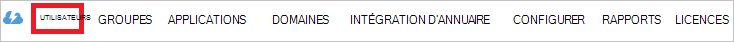

<properties
    pageTitle="Didacticiel : Azure Active Directory intégrant unicolore apprendre | Microsoft Azure"
    description="Découvrez comment configurer l’authentification unique entre Azure Active Directory et tableau noir en savoir plus."
    services="active-directory"
    documentationCenter=""
    authors="jeevansd"
    manager="femila"
    editor=""/>

<tags
    ms.service="active-directory"
    ms.workload="identity"
    ms.tgt_pltfrm="na"
    ms.devlang="na"
    ms.topic="article"
    ms.date="09/29/2016"
    ms.author="jeedes"/>

# Didacticiel : Azure Active Directory intégrant unicolore en savoir plus

Dans ce didacticiel, vous allez apprendre à intégrer unicolore apprendre Azure Active Directory (AD Azure).

Intégrant unicolore Découvrez AD Azure vous offre les avantages suivants :

- Vous pouvez contrôler dans Azure AD qui a accès au tableau noir en savoir plus
- Vous pouvez autoriser les utilisateurs à automatiquement obtenir signé sur unicolore en savoir plus (Single Sign-On) avec leur compte Azure AD
- Vous pouvez gérer vos comptes dans un emplacement central : le portail classique Azure

Si vous souhaitez connaître plus de détails sur l’intégration de l’application SaaS avec AD Azure, consultez [accès aux applications et single sign-on avec Azure Active Directory](active-directory-appssoaccess-whatis.md).

## Conditions préalables

Pour configurer l’intégration de publicités Azure unicolore en savoir plus, vous devez les éléments suivants :

- Un abonnement Azure AD
- Une connexion unique plate-forme de nuage unicolore en savoir plus sur abonnement activé

> [AZURE.NOTE] Pour tester les étapes de ce didacticiel, nous ne recommandons pas l’utilisation d’un environnement de production.

Pour tester les étapes de ce didacticiel, vous devez suivre ces recommandations :

- Vous ne devez pas utiliser votre environnement de production, sauf si cela est nécessaire.
- Si vous n’avez pas un environnement d’essai Azure AD, vous pouvez obtenir un mois d’évaluation [ici](https://azure.microsoft.com/pricing/free-trial/).

## Description du scénario
Dans ce didacticiel, vous testez Azure AD de l’authentification unique dans un environnement de test.

Le scénario décrit dans ce didacticiel se compose de deux blocs de construction principaux :

1. Ajoutant unicolore apprendre de la galerie
2. Configuration et test AD Azure authentification unique

## Ajoutant unicolore apprendre de la galerie
Pour configurer l’intégration d’unicolore apprendre dans Azure annonce, vous devez ajouter unicolore apprendre de la galerie à la liste des applications gérées de SaaS.

**Pour ajouter l’unicolore apprendre de la galerie, procédez comme suit :**

1. Dans **Azure portal classique**, dans le volet de navigation de gauche, cliquez sur **Active Directory**.

    ![Active Directory][1]
2. Dans la liste **répertoire** , sélectionnez le répertoire pour lequel vous souhaitez activer l’intégration d’annuaire.

3. Pour ouvrir la vue des applications, dans la vue du répertoire, cliquez sur **Applications** dans le menu supérieur.

    ![Applications][2]

4. Cliquez sur **Ajouter** au bas de la page.

    ![Applications][3]

5. Dans la boîte de dialogue **que voulez-vous faire** , cliquez sur **Ajouter une application à partir de la galerie**.

    ![Applications][4]

6. Dans la zone Rechercher, tapez **Unicolore en savoir plus**.

    

7. Dans le volet résultats, sélectionnez **Unicolore en savoir plus**et puis cliquez sur **Terminer** pour ajouter l’application.
    
    

##  Configuration et test AD Azure authentification unique
Dans cette section, vous configurez et testez de l’authentification unique de l’annonce Azure unicolore Découvrez basée sur un utilisateur de test appelé « Brian Simon ».

Pour de l’authentification unique fonctionner, AD Azure doit connaître l’utilisateur équivalent dans unicolore en savoir plus à un utilisateur dans AD Azure. En d’autres termes, une relation de liaison entre un utilisateur AD Azure et l’utilisateur connexe dans unicolore apprendre doit être établi.

Ce lien est établi en affectant la valeur du **nom d’utilisateur** dans AD Azure comme valeur du **nom d’utilisateur** dans le tableau noir en savoir plus.

Pour configurer et tester AD Azure single sign-on avec unicolore en savoir plus, vous devez effectuer les blocs de construction suivantes :

1. **[Configuration AD Azure Single Sign-On](#configuring-azure-ad-single-sign-on)** - pour autoriser les utilisateurs à utiliser cette fonctionnalité.
2. **[Création d’une annonce Azure tester l’utilisateur](#creating-an-azure-ad-test-user)** - tester AD Azure single sign-on avec Britta Simon.
3. **[Création d’un tableau noir en savoir tester l’utilisateur](#creating-a-blackboard-learn-test-user)** - d’avoir un équivalent de Britta Simon dans unicolore qui est lié à la représentation sous forme de publicité Azure de lui en savoir plus.
4. **[Tester l’utilisateur affectant la publicité Azure](#assigning-the-azure-ad-test-user)** - pour activer Britta Simon utilisation de l’authentification unique de l’annonce Azure.
5. **[Test de l’authentification unique](#testing-single-sign-on)** - pour vérifier si la configuration fonctionne.

### Configuration d’Azure AD unique Single Sign-On

Dans cette section, vous activez Azure AD de l’authentification unique dans le portail classique et configurez l’authentification unique dans votre application unicolore en savoir plus.

Application d’apprentissage unicolore attend les assertions SAML dans un format spécifique. Veuillez configurer les demandes suivantes pour cette application. Vous pouvez gérer les valeurs de ces attributs à partir de l’onglet **« Atrribute »** de l’application. La capture d’écran suivante montre un exemple de cela. 

 

**Pour configurer AD Azure SSO avec unicolore en savoir plus, effectuez les opérations suivantes :**

1. Dans le portail Azure classique, sur la page **Unicolore apprendre** des intégration application, dans le menu de la partie supérieure, cliquez sur **attributs**.

     

1. Dans la boîte de dialogue **attributs de jeton SAML** , pour chaque ligne indiqué dans le tableau ci-dessous, effectuez les opérations suivantes : nous avons mapper Userprincipalname comme attribut utilisateur unique ici, mais vous pouvez le mapper à la valeur appropriée qui identifient de façon unique l’utilisateur dans l’organisation et que correspond à unicolore apprendre le champ nom d’utilisateur.

  	| Nom de l’attribut | Valeur de l’attribut |
  	| --- | --- |    
  	| urn:oid:1.3.6.1.4.1.5923.1.1.1.6  | User.userPrincipalName |
   
 
    une barre d’outils. Cliquez sur **Ajouter attribut utilisateur** pour ouvrir la boîte de dialogue **Ajouter des Attribure utilisateur** .

     

    b. Dans la zone de texte **Nom d’affectent** , tapez le nom d’attribut affiché pour cette ligne.

    c. Dans la liste **Valeur de l’attribut** , selsect la valeur d’attribut affichée pour cette ligne.

    d. Cliquez sur **terminé**.  

2. Dans le portail classique, sur la page **Unicolore en savoir** un intégration d’application, cliquez **sur Configurer l’authentification unique** pour ouvrir la boîte de dialogue **Configuration de l’authentification unique** .
     
    ![Configurer l’authentification unique][6] 

3. Dans la page **Comment voulez-vous que les utilisateurs à signer unicolore apprendre** , sélectionnez **Azure AD Single Sign-On**, puis cliquez sur **suivant**.

     

4. Sur la page de la boîte de dialogue **Configurer les paramètres d’application** , effectuez les opérations suivantes :

     

    une barre d’outils. Dans la zone de texte **URL de connexion** , tapez l’URL utilisée par vos utilisateurs à l’ouverture de session sur votre application unicolore en savoir selon le modèle suivant : **https://\<société nom-prix\>.blackboard.com/**
    
    b. Cliquez sur **suivant**
 
5. Dans la page **configuration de l’authentification unique au tableau noir en savoir plus** , effectuez les opérations suivantes :

    

    une barre d’outils. Cliquez sur **télécharger les métadonnées**et puis enregistrez le fichier sur votre ordinateur.

    b. Cliquez sur **suivant**.

6. Pour obtenir l’authentification unique configurée pour votre application, contactez l’équipe de support unicolore en savoir et leur donner les informations suivantes :

    • Les métadonnées téléchargée

7. Dans le portail classique, sélectionnez la confirmation de la configuration d’ouverture de session unique, puis cliquez sur **suivant**.
    
    ![Azure AD unique Single Sign-On][10]

8. Sur la page de **confirmation d’ouverture de session unique** , cliquez sur **Terminer**.  
 
    ![Azure AD unique Single Sign-On][11]

### Création d’un utilisateur de test AD Azure
Dans cette section, vous créez un utilisateur test dans le portail classique appelé Britta Simon.

![Créer utilisateur d’AD Azure][20]

**Pour créer un utilisateur test dans Azure AD, effectuez les opérations suivantes :**

1. Dans **Azure portal classique**, dans le volet de navigation de gauche, cliquez sur **Active Directory**.

     

2. Dans la liste **répertoire** , sélectionnez le répertoire pour lequel vous souhaitez activer l’intégration d’annuaire.

3. Pour afficher la liste des utilisateurs, dans le menu de la partie supérieure, cliquez sur **utilisateurs**.

     

4. Pour ouvrir la boîte de dialogue **Ajouter un utilisateur** , dans la barre d’outils dans la partie inférieure, cliquez sur **Ajouter un utilisateur**.

     

5. Sur la page de dialogue **nous dire sur cet utilisateur** , effectuez les opérations suivantes :   

    une barre d’outils. En tant que Type d’utilisateur, sélectionnez nouvel utilisateur de votre organisation.

    b. Dans la **zone de texte**nom d’utilisateur, tapez **BrittaSimon**.

    c. Cliquez sur **suivant**.

6.  Sur la page de la boîte de dialogue **Profil d’utilisateur** , effectuez les opérations suivantes :  

    une barre d’outils. Dans la zone de texte **nom** , tapez **Brian**.  

    b. Dans la zone de texte **Nom** , type, **Simon**.

    c. Dans la zone de texte **Nom complet** , tapez **Brian Simon**.

    d. Dans la liste **rôle** , sélectionnez **utilisateur**.

    e. Cliquez sur **suivant**.

7. Sur la page de boîte de dialogue **obtenir le mot de passe temporaire** , cliquez sur **créer**.

     

8. Sur la page de boîte de dialogue **obtenir le mot de passe temporaire** , effectuez les opérations suivantes :

     

    une barre d’outils. Notez que la valeur de **Nouveau mot de passe**.

    b. Cliquez sur **terminé**.   

### Création d’un utilisateur test unicolore en savoir plus

Dans cette section, vous créez un utilisateur appelé Britta Simon dans unicolore en savoir plus. 

Application d’apprentissage unicolore prend en charge au moment de l’approvisionnement de l’utilisateur. Veuillez vous assurer que vous avez configuré les revendications comme décrit dans la section ** [Configuration AD Azure Single Sign-On](#configuring-azure-ad-single-sign-on)**

### Affectation de l’utilisateur de test AD Azure

Dans cette section, vous activez Britta Simon à utiliser Azure SSO en accordant l’accès unicolore apprendre.

![Affecter des utilisateurs][200] 

**Pour affecter des Britta Simon unicolore apprendre, effectuez les opérations suivantes :**

1. Sur le portail classique, pour ouvrir la vue des applications, dans la vue du répertoire, cliquez sur **Applications** dans le menu supérieur.

    ![Affecter des utilisateurs][201] 

2. Dans la liste des applications, sélectionnez **Unicolore en savoir plus**.

     

3. Dans le menu du haut, cliquez sur **utilisateurs**.

    ![Affecter des utilisateurs][203]

4. Dans la liste utilisateurs, sélectionnez **Brian Simon**.

5. Dans la barre d’outils dans la partie inférieure, cliquez sur **attribuer**.

    ![Affecter des utilisateurs][205]

### Test de l’authentification unique

Dans cette section, vous testez votre annonce Azure unique configuration de l’authentification à l’aide du panneau d’accès.

Unicolore apprentissage application prise en charge lorsque vous cliquez sur la mosaïque dans le panneau d’accès unicolore en savoir plus, Découvrez les automatiquement signé sur votre application unicolore en savoir plus.

## Ressources supplémentaires

* [Liste des didacticiels sur la façon d’intégrer les applications SaaS avec Azure Active Directory](active-directory-saas-tutorial-list.md)
* [Quel est l’accès de l’application et de l’authentification unique avec Azure Active Directory ?](active-directory-appssoaccess-whatis.md)

<!--Image references-->

[1]: ./media/active-directory-saas-blackboard-learn-tutorial/tutorial_general_01.png
[2]: ./media/active-directory-saas-blackboard-learn-tutorial/tutorial_general_02.png
[3]: ./media/active-directory-saas-blackboard-learn-tutorial/tutorial_general_03.png
[4]: ./media/active-directory-saas-blackboard-learn-tutorial/tutorial_general_04.png

[6]: ./media/active-directory-saas-blackboard-learn-tutorial/tutorial_general_05.png
[10]: ./media/active-directory-saas-blackboard-learn-tutorial/tutorial_general_06.png
[11]: ./media/active-directory-saas-blackboard-learn-tutorial/tutorial_general_07.png
[20]: ./media/active-directory-saas-blackboard-learn-tutorial/tutorial_general_100.png

[200]: ./media/active-directory-saas-blackboard-learn-tutorial/tutorial_general_200.png
[201]: ./media/active-directory-saas-blackboard-learn-tutorial/tutorial_general_201.png
[203]: ./media/active-directory-saas-blackboard-learn-tutorial/tutorial_general_203.png
[204]: ./media/active-directory-saas-blackboard-learn-tutorial/tutorial_general_204.png
[205]: ./media/active-directory-saas-blackboard-learn-tutorial/tutorial_general_205.png
