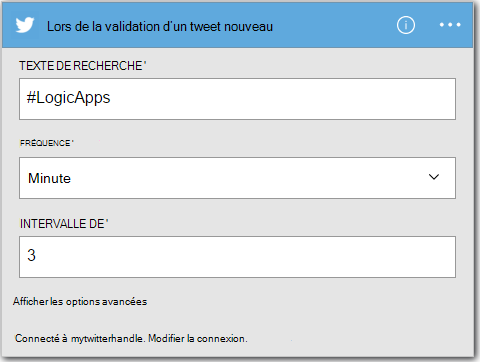
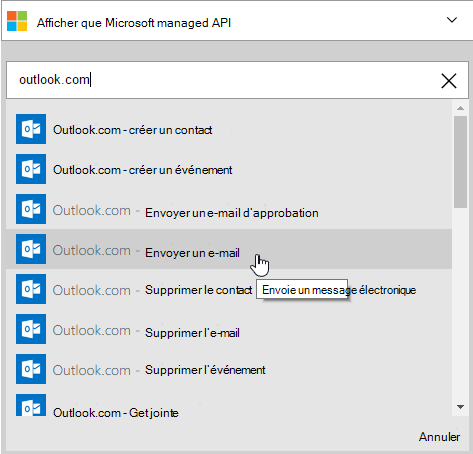
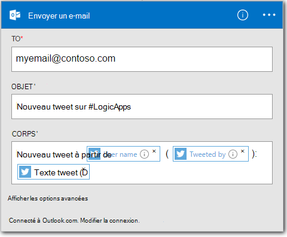

<properties
    pageTitle="Créer une application de logique | Microsoft Azure"
    description="Apprenez à créer une application de la logique de connexion des services de SaaS"
    authors="jeffhollan"
    manager="dwrede"
    editor=""
    services="logic-apps"
    documentationCenter=""/>

<tags
    ms.service="logic-apps"
    ms.workload="na"
    ms.tgt_pltfrm="na"
    ms.devlang="na"
    ms.topic="get-started-article"
    ms.date="10/18/2016"
    ms.author="jehollan"/>

# Créer une nouvelle application logique SaaS services de connexion

Cette rubrique montre comment, en quelques minutes, vous pouvez commencer avec [Les applications Azure logique](app-service-logic-what-are-logic-apps.md). Nous traiterons un workflow simple qui vous permet d’envoyer un Tweet intéressant à votre courrier électronique.

Pour utiliser ce scénario, vous devez :

- Un abonnement Azure
- Un compte Twitter
- Un Outlook.com ou une boîte aux lettres de Office 365 hébergé

## Créer une nouvelle application logique pour vous de messagerie tweet

1. Dans le [tableau de bord de portail Azure](https://portal.azure.com), sélectionnez **Nouveau**. 
2. Dans la barre de recherche, recherchez « application logique » et puis sélectionnez la **Logique d’application**. Vous pouvez également sélectionner **Nouveau**, **Web + Mobile**et sélectionnez la **Logique d’application**. 
3. Entrez un nom pour votre application logique, sélectionnez un emplacement, un groupe de ressources et sélectionnez **créer**.  Si vous sélectionnez **Ajouter au tableau de bord** l’application logique s’ouvre automatiquement une fois déployée.  
4. Après avoir ouvert votre application logique pour la première fois, vous pouvez sélectionner à partir d’un modèle pour démarrer.  Pour l’instant, cliquez sur **Application vide de logique** pour cela créer de toutes pièces. 
1. Le premier élément que vous créez est le déclencheur.  Il s’agit de l’événement qui démarrera votre application logique.  Rechercher **twitter** dans la zone de recherche de déclencheur et sélectionnez-le.
7. Maintenant vous devez saisir un terme de recherche sera déclenchée.  La **fréquence** et **l’intervalle** détermine la fréquence à laquelle votre application logique recherchera tweet nouvelle (et tous les tweet pendant cette période de retour).
    

5. Cliquez sur le bouton **nouvelle étape** et choisissez **Ajouter une action** ou sur **Ajouter une condition**
6. Lorsque vous sélectionnez **Ajouter une Action**, vous pouvez rechercher des [connecteurs disponibles](../connectors/apis-list.md) pour choisir une action. Par exemple, vous pouvez sélectionner **Outlook.com - envoyer un E-mail** à envoyer du courrier à partir d’une adresse de outlook.com :  
    

7. Vous devez ensuite remplir les paramètres de l’e-mail que vous souhaitez :  

8. Enfin, vous pouvez sélectionner **Enregistrer** pour rendre votre application logique live.

## Gérer votre application logique après la création

Votre application logique est maintenant en cours d’exécution. Il recherche régulièrement les tweet avec le terme de recherche entré. Lorsqu’il trouve un tweet correspondant, il vous enverra un courrier électronique. Enfin, vous allez voir comment faire pour désactiver l’application, ou voir comment elle se comporte.

1. Accédez au [portail Azure](https://portal.azure.com)

1. Cliquez sur **Parcourir** sur le côté gauche de l’écran et sélectionnez **Les applications logique**.

2. Cliquez sur la nouvelle application logique que vous venez de créer pour afficher l’état actuel et des informations générales.

3. Pour modifier votre nouvelle application logique, cliquez sur **Modifier**.

5. Pour désactiver l’application, cliquez sur **désactiver** dans la barre de commandes.

1. Permet d’afficher des historiques de série et de trigger à surveiller lorsque votre application logique est en cours d’exécution.  Vous pouvez cliquer sur **Actualiser** pour afficher les données les plus récentes.

En moins de 5 minutes, vous avez pu configurer une application de logique simple s’exécutant dans le nuage. Pour plus d’informations sur l’utilisation des fonctionnalités des applications de logique, reportez-vous à la section [fonctionnalités utilisation logique de l’application]. Pour obtenir des informations sur l’application de la logique de définitions de, voir [créer des définitions de la logique d’application](app-service-logic-author-definitions.md).

<!-- Shared links -->
[Azure portal]: https://portal.azure.com
[Utiliser les fonctionnalités de l’application logique]: app-service-logic-create-a-logic-app.md
