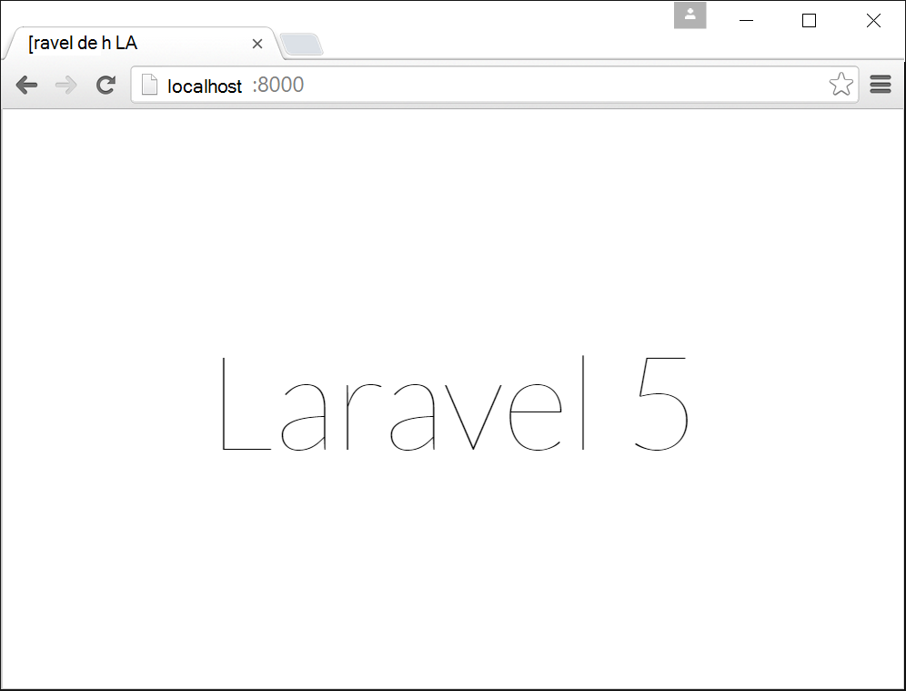
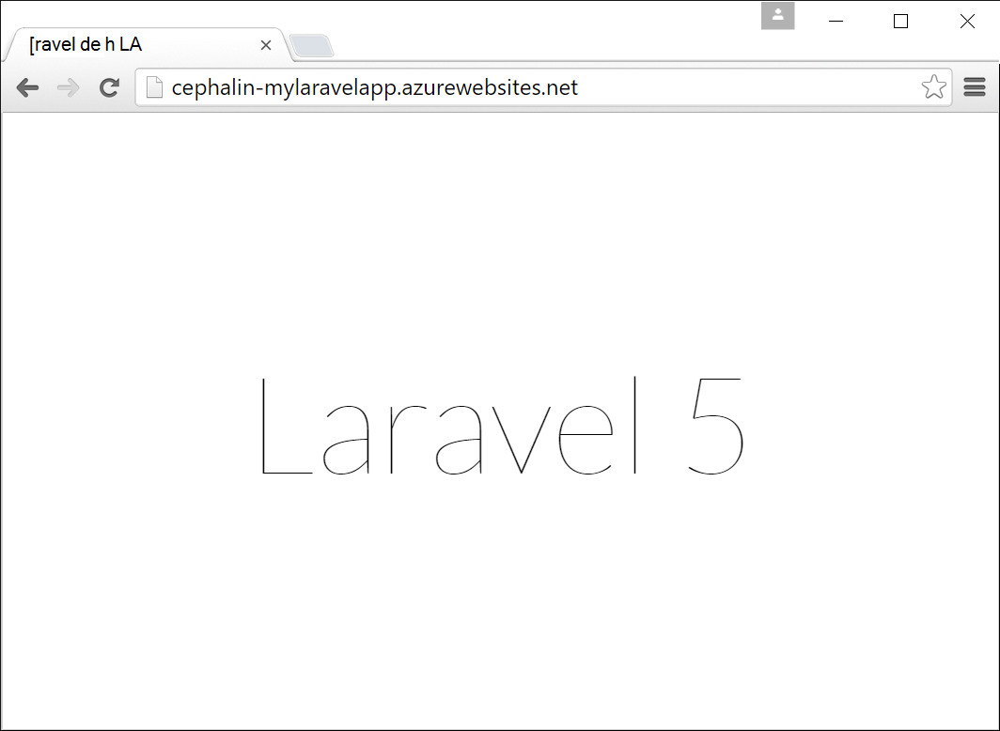

<properties
    pageTitle="Créer, configurer et déployer une application web PHP vers Azure"
    description="Un didacticiel qui montre comment exécuter une application web PHP (Laravel) dans le Service d’application Azure. Découvrez comment configurer le Service d’application Azure pour répondre aux exigences de l’infrastructure PHP que vous choisissez."
    services="app-service\web"
    documentationCenter="php"
    authors="cephalin"
    manager="wpickett"
    editor=""
    tags="mysql"/>

<tags
    ms.service="app-service-web"
    ms.workload="web"
    ms.tgt_pltfrm="na"
    ms.devlang="PHP"
    ms.topic="article"
    ms.date="06/03/2016" 
    ms.author="cephalin"/>

# Créer, configurer et déployer une application web PHP vers Azure

[AZURE.INCLUDE [tabs](../../includes/app-service-web-get-started-nav-tabs.md)]

Ce didacticiel vous montre comment créer, configurer et déployer une application web PHP pour Azure et comment configurer le Service d’application Azure pour satisfaire les besoins de votre application web PHP. À la fin de ce didacticiel, vous avez une travail [Laravel](https://www.laravel.com/) web app est en cours d’exécution dans le [Service d’application Azure](../app-service/app-service-value-prop-what-is.md).

Comme un développeur PHP, vous pouvez mettre votre infrastructure PHP favori vers Azure. Ce didacticiel utilise Laravel comme un exemple d’application concrète. Vous allez apprendre : 

- Déployer à l’aide de Git
- Version d’ensemble de PHP
- Utiliser un fichier de démarrage qui n’est pas dans le répertoire racine de l’application
- Variables d’environnement spécifiques accès
- Mise à jour de votre application dans Azure

Vous pouvez appliquer ce que vous apprendrez ici à d’autres applications web PHP que vous déployez sur Azure.

>[AZURE.INCLUDE [app-service-linux](../../includes/app-service-linux.md)] 

## Conditions préalables

- Installer [PHP 5.6.x](http://php.net/downloads.php) (prise en charge de PHP 7 est la version bêta)
- Installer [Composer](https://getcomposer.org/download/)
- Installer [l’interface CLI Azure](../xplat-cli-install.md)
- Installer [Git](http://www.git-scm.com/downloads)
- Obtenir un compte Microsoft Azure. Si vous n’avez pas un compte, vous pouvez [vous inscrire à une évaluation gratuite](/pricing/free-trial/?WT.mc_id=A261C142F) ou [activer vos avantages d’abonné de Visual Studio](/pricing/member-offers/msdn-benefits-details/?WT.mc_id=A261C142F).

>[AZURE.NOTE] Consultez une application web en action. [Essayez le Service application](http://go.microsoft.com/fwlink/?LinkId=523751) immédiatement et créer une application de démarrage de courte durée : aucune carte de crédit requise, aucun engagement.

## Créer une application PHP (Laravel) sur votre ordinateur de développement

1. Ouvrez une nouvelle invite de commandes Windows, une fenêtre PowerShell, shell Linux ou OS X terminal. Exécutez les commandes suivantes pour vérifier que les outils nécessaires sont correctement installés sur votre ordinateur. 

        php --version
        composer --version
        azure --version
        git --version

    

    Si vous n’avez pas installé les outils, consultez [conditions préalables](#Prerequisites) pour les liens de téléchargement.
    
2. Laravel de l’installation comme suit :

        composer global require "laravel/installer

3. `CD`dans un répertoire de travail et créer une nouvelle application de Laravel comme suit :

        cd <working_directory>
        laravel new <app_name>

4. `CD`dans nouvellement créé `<app_name>` répertoire et test de l’application comme suit :

        cd <app_name>
        php artisan serve
        
    Vous permettre de naviguer maintenant http://localhost:8000 dans un navigateur et de voir l’écran de démarrage de Laravel.
    
    
    
Donc beaucoup, tout le flux de travail normal de le Laravel et que vous n’êtes pas ici pour <a href="https://laravel.com/docs/5.2" rel="nofollow">en savoir Laravel</a>. Nous pouvons donc passer.

## Créer une application web Azure et la configuration du déploiement de Git

>[AZURE.NOTE] « Attendez ! Que se passe-t-il si je souhaite déployer avec le protocole FTP ? » Il existe un [didacticiel FTP](web-sites-php-mysql-deploy-use-ftp.md) pour vos besoins. 

Avec la CLI d’Azure, vous pouvez créer une application web dans le Service d’application Azure et paramétrage de déploiement Git avec une seule ligne de commande. Allons-y.

1. Modifier en mode d’ASM et connectez-vous pour Azure :

        azure config mode asm
        azure login
    
    Suivez le message d’aide pour continuer le processus de connexion.
    
    

4. Exécutez la commande pour créer l’application web Azure avec Git déploiement. Lorsque vous y êtes invité, spécifiez le numéro de la région de votre choix.

        azure site create --git <app_name>
    
    
    
    >[AZURE.NOTE] Si vous n’avez jamais configuré les informations d’identification de déploiement pour votre abonnement Azure, vous devrez les créer. Ces informations d’identification, pas vos informations d’identification compte Azure, sont utilisées par le Service d’application uniquement pour les déploiements de Git et connexions FTP. 
    
    Cette commande crée un nouveau référentiel Git sur le répertoire en cours (avec `git init`) et qu’il se connecte au référentiel dans Azure sous la forme d’une distance Git (avec `git remote add`).

<a name="configure"/>
## Configurer l’application web Azure

Pour votre application Laravel dans Azure, vous devez prêter attention à plusieurs choses. Vous allez faire cet exercice similaire pour votre infrastructure PHP de choix.

- Configurer PHP 5.5.9 ou une version ultérieure. Consultez les [Dernières exigences de serveur Laravel 5.2](https://laravel.com/docs/5.2#server-requirements) pour la liste complète de la configuration requise du serveur. Le reste de la liste sont des extensions qui sont déjà activées par les installations PHP d’Azure. 
- Définir les variables d’environnement de votre application a besoin. Laravel utilise le `.env` fichier facilitant la configuration des variables d’environnement. Toutefois, dans la mesure où il n’est pas supposé d’être validés dans le contrôle de code source (voir [Configuration de l’environnement Laravel](https://laravel.com/docs/5.2/configuration#environment-configuration), vous allez définir les paramètres d’application de votre application web Azure à la place.
- Assurez-vous que point d’entrée de l’application Laravel, `public/index.php`, est chargé en premier. Consultez [vue d’ensemble du cycle de vie de Laravel](https://laravel.com/docs/5.2/lifecycle#lifecycle-overview). En d’autres termes, vous devez définir l’URL de la racine de l’application web pour pointer vers le `public` répertoire.
- Activer l’extension de Composer dans Azure, puisque vous disposez d’un composer.json. De cette façon, vous pouvez laisser Composer soucier d’obtenir vos packages requis lorsque vous déployez avec `git push`. Il s’agit d’une question de commodité. Si vous n’activez pas automation de Composer, il vous suffit de supprimer `/vendor` à partir de la `.gitignore` fichier afin que Git inclut ("Nations unies-ignore ») tous les éléments de la `vendor` répertoire lors de la validation et le déploiement de code.

Configurons ces tâches séquentiellement.

4. Définir la version PHP qui nécessite de votre application Laravel.

        azure site set --php-version 5.6

    Vous avez terminé la définition de la version PHP ! 
    
4. Générer un nouveau `APP_KEY` pour votre Azure web app et le définir comme un paramètre d’application pour votre application web Azure.

        php artisan key:generate --show
        azure site appsetting add APP_KEY="<output_of_php_artisan_key:generate_--show>"

4. Également, activer le débogage de Laravel pour préempter tout énigmatiques `Whoops, looks like something went wrong.` page.

        azure site appsetting add APP_DEBUG=true

    Vous avez terminé la définition des variables d’environnement !
    
    >[AZURE.NOTE] Attendez, nous allons ralentir un peu et expliquer ce que fait le Laravel et le rôle Azure ici. Laravel utilise le `.env` fichier dans le répertoire racine pour fournir des variables d’environnement pour l’application, où vous trouverez la ligne `APP_DEBUG=true` (et `APP_KEY=...`). Cette variable se trouve dans `config/app.php` par le code de     `'debug' => env('APP_DEBUG', false),`. [env()](https://laravel.com/docs/5.2/helpers#method-env) est une méthode d’assistance Laravel qui utilise le PHP [getenv()](http://php.net/manual/en/function.getenv.php) en coulisses.
    >
    >Toutefois, `.env` est ignorée par le Git, car il est appelé le `.gitignore` le fichier dans le répertoire racine. En bref, `.env`  
 dans vos locaux Git référentiel n’est pas placée sur Azure avec le reste des fichiers. Bien sûr, il suffit de supprimer cette ligne à partir de `.gitignore`, mais nous avons déjà établi que la validation de ce fichier dans le contrôle de code source n’est pas recommandé. Néanmoins, vous devez toujours un moyen de spécifier ces variables d’environnement dans Azure. 
    >
    >La bonne nouvelle est que les paramètres d’application dans le Service d’application Azure prend en charge les [getenv()](http://php.net/manual/en/function.getenv.php)  
 dans PHP. Bien que vous pouvez utiliser FTP ou autres moyens pour télécharger manuellement un `.env` fichier dans Azure, vous pouvez simplement spécifier les variables que vous souhaitez comme paramètres d’application Azure sans un `.env` dans Azure, comme vous venez de faire. En outre, si une variable est à la fois dans un `.env` de fichiers et de paramètres d’application Azure, le paramètre d’application Azure wins.     

4. Les deux dernières tâches (le répertoire virtuel et activer le compositeur) nécessite le [Azure portal](https://portal.azure.com), donc ouvrir une session sur le [portail](https://portal.azure.com) avec votre compte Azure.

4. À partir du menu de gauche, cliquez sur **Services d’application** > **&lt;nom_app >** > **Outils**.

    
    
    >[AZURE.TIP] Si vous cliquez sur les **paramètres** au lieu des **Outils**, vous serez en mesure d’accéder aux **Paramètres de l’Application**  
 lame, ce qui vous permet de définie les versions PHP, paramètres de l’application, et des répertoires virtuels tels que vous venez de faire. 
    
4. Cliquez sur **Extensions** > **Ajouter** pour ajouter une extension.

4. Sélectionnez **Composer** dans l' **extension de choisir** [blade](../azure-portal-overview.md) (*lame*: une page de portail qui s’ouvre horizontalement).

4. De la lame **d’accepter les conditions juridiques** , cliquez sur **OK** . 

5. Cliquez sur **OK** dans la blade **d’Ajouter une extension** .

    Lorsque Azure a terminé l’ajout de l’extension doit s’afficher un message convivial dans le coin, ainsi que de  **Composer** énumérés à la lame **d’Extensions** .

    

    Vous avez fini de Composer l’activation !
    
4. De retour dans les lames de votre application web, cliquez sur **paramètres** > **Paramètres de l’Application**.

    

    De la lame de **Paramètres d’Application** , notez la version PHP que vous définissez précédemment :

    

    et les paramètres d’application que vous avez ajoutée :
    
    

4. Faites défiler vers le bas de la lame et modifiez le répertoire virtuel de la racine pour pointer vers **site\wwwroot\public** au lieu de **site\wwwroot**.

    

4. Cliquez sur **Enregistrer** en haut de la lame.

    Vous avez terminé la définition du répertoire virtuel ! 

## Déployer votre application web avec Git (et de la définition des variables d’environnement)

Vous êtes prêt à déployer votre code maintenant. Vous ferez ce dans votre invite de commande ou d’un terminal.

4. Valider toutes vos modifications et déployer votre code à l’application web Azure comme vous le feriez dans n’importe quel référentiel Git :

        git add .
        git commit -m "Hurray! My first commit for my Azure app!"
        git push azure master 

    Lors de l’exécution `git push`, vous devrez fournir votre mot de passe de déploiement Git. Si vous avez demandé créer les informations d’identification de déploiement au `azure site create` précédemment, tapez le mot de passe que vous avez utilisé.
    
5. Nous allons voir s’exécuter dans le navigateur en exécutant cette commande :

        azure site browse

    Votre navigateur doit afficher l’écran de démarrage de Laravel.
    
    
    
    Félicitations, vous êtes maintenant en une application web de Laravel Azure.
             
## Résoudre les erreurs courantes

Voici les erreurs que vous pourriez rencontrer lors de la suite de ce didacticiel :

- [CLI Azure indique « 'site' n’est pas une commande azure »](#clierror)
- [Application Web affiche l’erreur HTTP 403](#http403)
- [Application Web indique « Whoops, on dirait que quelque chose s’est passé. »](#whoops)
- [Application Web n’affiche « Aucun chiffreur pris en charge trouvé. »](#encryptor)

### CLI Azure indique « 'site' n’est pas une commande azure »

Lors de l’exécution `azure site *` dans le terminal de ligne de commande, vous voyez l’erreur`error:   'site' is not an azure command. See 'azure help'.` 

Il s’agit généralement d’un résultat du passage en mode de « ARM » (responsable de ressources Azure). Pour résoudre ce problème, basculez en mode de « ASM » (gestion des services Azure) en exécutant `azure config mode asm`.

### Application Web affiche l’erreur HTTP 403

Vous avez déployé votre application web vers Azure avec succès, mais lorsque vous accédez à votre application web d’Azure, vous obtenez un `HTTP 403` ou`You do not have permission to view this directory or page.`

C’est probablement parce que l’application web ne peut pas trouver le point d’entrée pour l’application de Laravel. Assurez-vous que vous avez modifié le répertoire virtuel de la racine pour pointer vers `site\wwwroot\public`, où de Laravel `index.php` est (voir [configurer l’application web Azure](#configure)).

### Application Web indique « Whoops, on dirait que quelque chose s’est passé. »

Vous avez déployé votre application web vers Azure avec succès, mais lorsque vous accédez à votre application web d’Azure, vous obtenez le message crypté`Whoops, looks like something went wrong.`

Pour obtenir une erreur plus explicite, activer le débogage de Laravel en définissant `APP_DEBUG` variable d’environnement `true` (voir [configurer l’application web Azure](#configure)).

### Application Web n’affiche « Aucun chiffreur pris en charge trouvé. »

Vous avez déployé votre application web vers Azure avec succès, mais lorsque vous accédez à votre application web d’Azure, vous obtenez le message d’erreur ci-dessous :

    
C’est une erreur nasty, mais au moins elle n’est pas compliqué depuis que vous avez activé le débogage Laravel. Une recherche rapide de la chaîne d’erreur sur les forums de Laravel vous indiquera qu’il est en raison de ne pas définir le APP_KEY `.env`, ou dans votre cas, n’ayant ne pas `.env` dans Azure du tout. Vous pouvez résoudre ce problème en ajoutant le paramètre `APP_KEY` sous la forme d’une application Azure, définition (voir [configurer l’application web Azure](#configure)).
    
## Étapes suivantes

Apprenez à ajouter des données à votre application en [créant une base de données MySQL dans Azure](../store-php-create-mysql-database.md). Vérifiez également les liens plus utiles pour PHP dans Azure ci-dessous :

- [Centre de développement PHP](/develop/php/).
- [Créer une application web à partir de Azure Marketplace](app-service-web-create-web-app-from-marketplace.md)
- [Configurer PHP dans Azure Application Service Web Apps](web-sites-php-configure.md)
- [Convertir WordPress Multisite dans le Service d’application Azure](web-sites-php-convert-wordpress-multisite.md)
- [WordPress d’entreprise sur le Service d’application Azure](web-sites-php-enterprise-wordpress.md)
