<properties 
    pageTitle="Utilisez Azure CDN dans le Service d’application Azure" 
    description="Un didacticiel qui vous explique comment déployer une application web au Service d’application Azure qui fournissent du contenu à partir d’un point de terminaison Azure CDN intégré" 
    services="app-service\web,cdn" 
    documentationCenter=".net" 
    authors="cephalin" 
    manager="wpickett" 
    editor="jimbe"/>

<tags 
    ms.service="app-service" 
    ms.workload="tbd" 
    ms.tgt_pltfrm="na" 
    ms.devlang="dotnet" 
    ms.topic="article" 
    ms.date="07/01/2016" 
    ms.author="cephalin"/>


# <a name="use-azure-cdn-in-azure-app-service"></a>Utilisez Azure CDN dans le Service d’application Azure

[Service d’application](http://go.microsoft.com/fwlink/?LinkId=529714) peut être intégré avec [Azure CDN](/services/cdn/), ajout aux mise à l’échelle des capacités inhérentes à [l’Application de Service Web Apps](http://go.microsoft.com/fwlink/?LinkId=529714) globales en servant du contenu de votre application web globalement à partir des nœuds de serveur près de vos clients (une liste mise à jour de tous les emplacements de noeud en cours, vous pouvez trouver [ici](http://msdn.microsoft.com/library/azure/gg680302.aspx)). Dans des scénarios comme desservant des images statiques, cette intégration peut augmenter considérablement les performances de vos applications de Web Service Azure application et améliore de manière significative l’expérience utilisateur de votre application web dans le monde entier. 

Intégration d’applications Web avec Azure CDN vous offre les avantages suivants :

- Intégrer un déploiement de contenu (des images, des scripts et des feuilles de style) dans le cadre du processus de [déploiement en continu](app-service-continuous-deployment.md) de votre application web
- Facilement mettre à niveau les packages NuGet dans votre application web dans le Service d’application Azure, tels que jQuery ou versions d’amorçage 
- Gérer votre application Web et votre contenu servi CDN depuis la même interface de Visual Studio
- Intégration ASP.NET regroupement et minimisation avec Azure CDN

[AZURE.INCLUDE [app-service-web-to-api-and-mobile](../../includes/app-service-web-to-api-and-mobile.md)] 

## <a name="what-you-will-build"></a>Vous allez générer ##

Vous déployez une application web à un Service d’application Azure à l’aide de la valeur par défaut du modèle ASP.NET MVC dans Visual Studio, ajoutez du code pour servir du contenu depuis un CDN Azure intégré, par exemple une image, résultats d’action de contrôleur et les fichiers par défaut JavaScript et CSS et également écrire du code pour configurer le mécanisme de secours pour les offres groupées pris en charge dans le cas où le CDN est hors connexion.

## <a name="what-you-will-need"></a>Ce que vous devez ##

Ce didacticiel présente les conditions préalables suivantes :

-   Un actif [compte Microsoft Azure](/account/)
-   Visual Studio 2015, avec le [Kit de développement Azure pour .NET](http://go.microsoft.com/fwlink/p/?linkid=323510&clcid=0x409). Si vous utilisez Visual Studio, les étapes peuvent varier.

> [AZURE.NOTE] Vous avez besoin d’un compte Azure pour compléter ce didacticiel :
> + Vous pouvez [Ouvrir un compte Azure gratuitement](/pricing/free-trial/) , vous obtenez des crédits que vous pouvez utiliser pour tester des services Azure payés et même après leur utilisation vous pouvez conserver le compte et utilisation libre des services Azure, tels que les applications Web.
> + Vous pouvez [activer des avantages pour les abonnés de Visual Studio](/pricing/member-offers/msdn-benefits-details/) , de Visual Studio votre abonnement fournit les crédits que vous pouvez utiliser pour des services Azure payés chaque mois.
>
> Si vous souhaitez commencer avec le Service d’application Azure avant l’ouverture d’un compte Azure, accédez à [Essayer le Service application](http://go.microsoft.com/fwlink/?LinkId=523751), où vous pouvez créer une application web de courte durée starter immédiatement dans le Service d’application. Aucune carte de crédit obligatoire ; aucun des engagements.

## <a name="deploy-a-web-app-to-azure-with-an-integrated-cdn-endpoint"></a>Déployer une application web vers Azure avec un point de terminaison CDN intégré ##

Dans cette section, vous déployez le modèle d’application ASP.NET MVC dans Visual Studio 2015 par défaut au Service de l’application et puis vous l’intégrez avec un nouveau point de terminaison CDN. Suivez les instructions ci-dessous :

1. Dans Visual Studio 2015, créer une application web ASP.NET à partir de la barre de menus à partir de **fichier > Nouveau > projet > Web > ASP.NET Web Application**. Donnez-lui un nom, puis cliquez sur **OK**.

    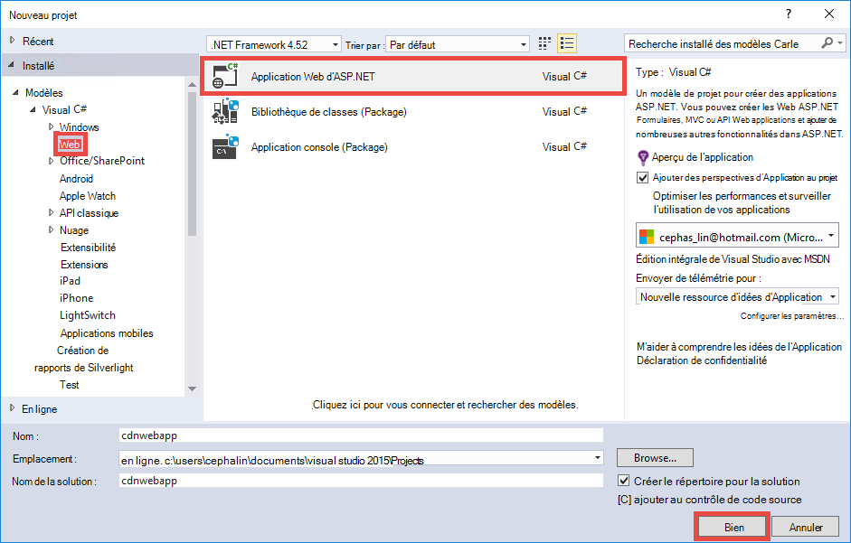

3. **MVC** et cliquez sur **OK**.

    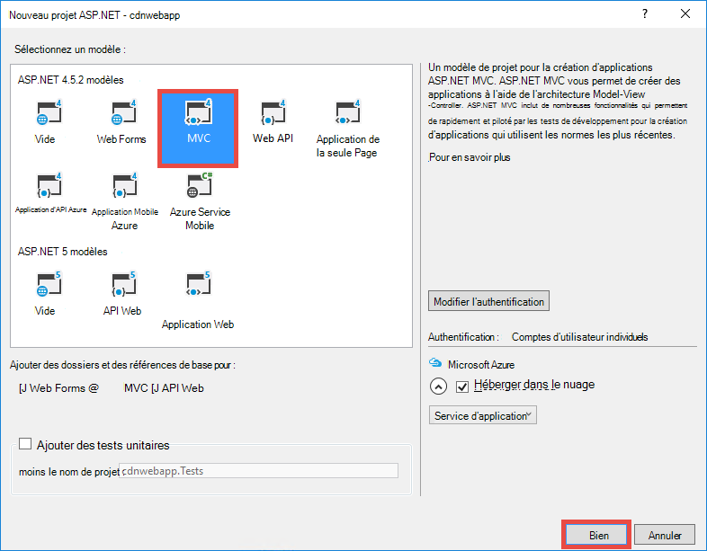

4. Si vous n’avez pas encore connecté à votre compte Azure, cliquez sur l’icône de compte dans le coin supérieur droit et suivez la boîte de dialogue pour vous connecter à votre compte Azure. Une fois que vous avez terminé, configurez votre application, comme indiqué ci-dessous, puis cliquez sur **Nouveau** pour créer un nouveau plan de Service d’application pour votre application.  

    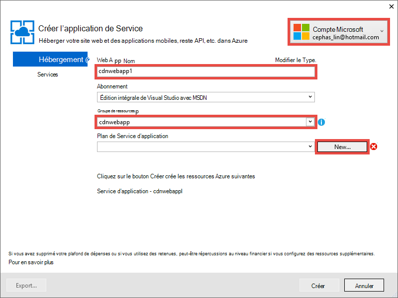

5. Configurer un nouveau plan de Service de l’application dans la boîte de dialogue, comme illustré ci-dessous, puis cliquez sur **OK**. 

    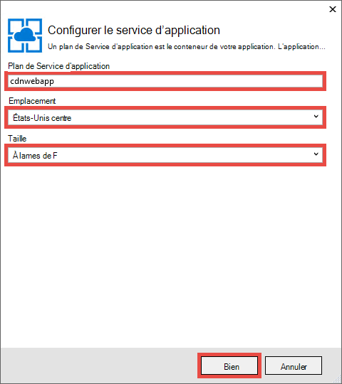

8. Cliquez sur **créer** pour créer l’application web.

    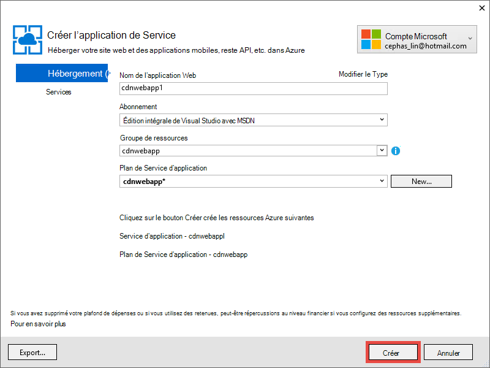

9. Une fois que votre application ASP.NET est créée, publiez-le sur Azure dans le volet de l’activité de Service d’application Azure en cliquant sur **Publier `<app name>` à cette application Web maintenant**. Cliquez sur **Publier** pour terminer le processus.

    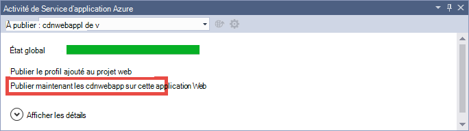

    Vous verrez votre application web publiée dans le navigateur lorsque la publication est terminée. 

1. Pour créer un point de terminaison CDN, connectez-vous au [portail Azure](https://portal.azure.com). 
2. Cliquez sur **+ nouvelle** > **Media + CDN** > **CDN**.

    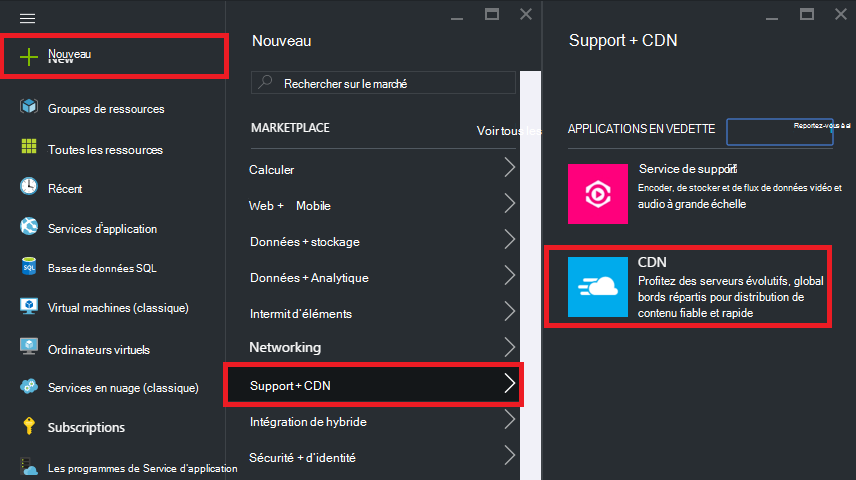

3. Le **Canada**, **l’emplacement**, **groupe de ressources**, **niveau de tarification**, puis cliquez sur **créer**

    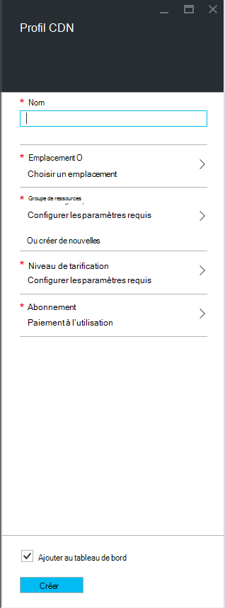   

4. Dans le **Profil du CDN** lame cliquez sur le bouton **+ de point de terminaison** . Donnez-lui un nom, sélectionnez **l’Application Web** dans la liste déroulante **Type d’origine** et votre application web dans la liste déroulante **nom d’hôte d’origine** , puis cliquez sur **Ajouter**.  

    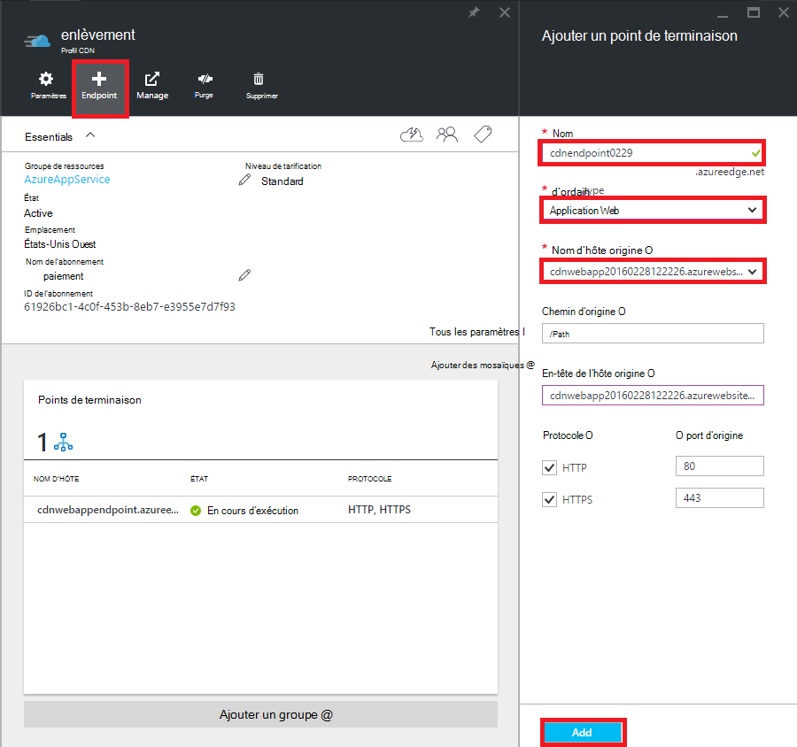


    > [AZURE.NOTE] Une fois votre point de terminaison CDN est créé, la lame de **point de terminaison** vous indiquera son URL CDN et le domaine d’origine il est intégré avec. Toutefois, elle peut prendre du temps pour la configuration du nouveau CDN du point de terminaison être complètement propagée à tous les emplacements de nœud CDN. 

3. De retour dans la lame de **point de terminaison** , cliquez sur le nom du point de terminaison CDN que vous venez de créer.

    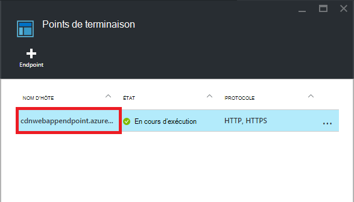

3. Cliquez sur le bouton **configurer** . De la lame à **configurer** , sélectionnez **mettre en Cache chaque URL unique** dans la liste déroulante de **la mise en cache de comportement de chaîne de requête** , puis cliquez sur le bouton **Enregistrer** .


    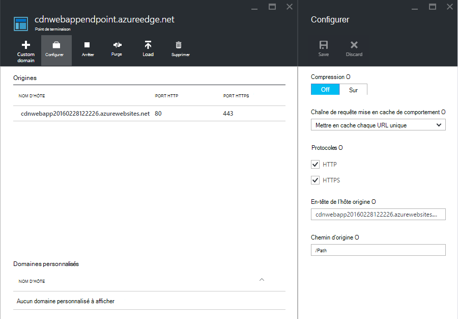

Dès que vous activez cette option, le lien même avec des chaînes de requête différents est mis en cache en tant qu’entrées séparées.

>[AZURE.NOTE] Lors de l’activation de la chaîne de requête n’est pas nécessaire pour cette section du didacticiel, vous souhaitez cela comme tôt que possible pour des raisons pratiques depuis toute modification apportée ici va prendre le temps de se propager à tous les nœuds du CDN et que vous ne souhaitez pas que tout contenu non-requête-chaîne-activé congestionner le cache CDN (mise à jour contenu CDN sera abordé plus tard).

2. Maintenant, accédez à l’adresse de point de terminaison CDN. Si le point de terminaison est prêt, vous devez voir votre application web s’affiche. Si vous obtenez une erreur **HTTP 404** , le point de terminaison CDN n’est pas prêt. Vous devrez peut-être attendre jusqu'à une heure pour la configuration de Paie Canada-fichier d’être propagées à tous les nœuds du bord. 

    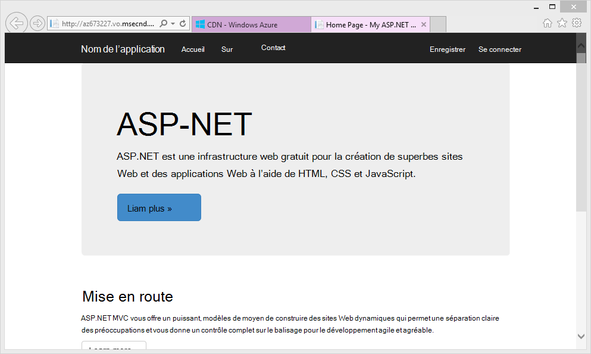

1. Ensuite, essayez d’accéder au fichier **~/Content/bootstrap.css** dans votre projet ASP.NET. Dans la fenêtre du navigateur, accédez à * *http://*&lt;cdnName >*.azureedge.net/Content/bootstrap.css**. Dans mon programme d’installation, cette URL est la suivante :

        http://az673227.azureedge.net/Content/bootstrap.css

    Qui correspond à l’URL d’origine suivante au point de terminaison CDN :

        http://cdnwebapp.azurewebsites.net/Content/bootstrap.css

    Lorsque vous naviguez vers * *http://*&lt;cdnName >*.azureedge.net/Content/bootstrap.css**, vous serez invité à télécharger le bootstrap.css provenant de votre application web dans Azure. 

    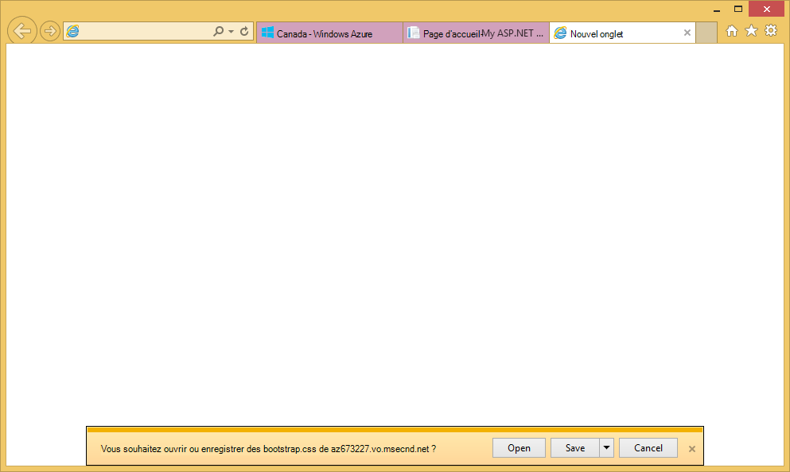

Vous pouvez accéder de la même manière à n’importe quelle URL accessible publiquement à * *http://*&lt;ServiceName% >*.cloudapp.net/**, directement à partir de votre point de terminaison CDN. Par exemple :

-   Un fichier .js dans le chemin d’accès /Script
-   Tout fichier de contenu à partir de la/Content chemin d’accès
-   Toute action et de contrôleur 
-   Si la chaîne de requête est votre point de terminaison CDN, une URL avec des chaînes de requête
-   L’application web d’Azure ensemble, si tout le contenu est public

Notez qu’il peut-être pas toujours une bonne idée (ou généralement une bonne idée) pour servir une application Azure ensemble du site web par le biais de Azure CDN. Les restrictions sont les suivantes :

-   Cette approche nécessite d’être publique, car Azure CDN ne peut pas servir de n’importe quel contenu privé sur l’ensemble de votre site.
-   Si le point de terminaison CDN se déconnecte pour une raison quelconque, si une maintenance planifiée ou erreur de l’utilisateur, votre application web entière est mis hors connexion, sauf si les clients peuvent être redirigés vers l’URL d’origine * *http://*&lt;sitename >*.azurewebsites.net/**. 
-   Même avec les paramètres de contrôle du Cache personnalisés (voir [configurer les options pour les fichiers statiques dans votre application web Azure la mise en cache](#configure-caching-options-for-static-files-in-your-azure-web-app)), un point de terminaison CDN n’améliore pas les performances du contenu de hautement dynamiques. Si vous avez essayé de charger la page d’accueil à partir de votre point de terminaison CDN comme indiqué ci-dessus, notez qu’il a pris au moins 5 secondes pour charger la page d’accueil par défaut la première fois, ce qui est une page simple. Imaginez ce qui se passerait à l’expérience du client si cette page contient du contenu dynamique qui doit de mettre à jour toutes les minutes. Héberger un contenu dynamique à partir d’un point de terminaison CDN nécessite l’expiration de cache court, qui se traduit par des échecs de cache fréquentes au point de terminaison CDN. Cela nuit aux performances de votre application web Azure et nuit à l’utilité d’un CDN.

L’alternative consiste à déterminer le contenu à servir d’Azure CDN sur une base au cas par cas dans votre application web Azure. À cette fin, vous avez déjà vu comment accéder à des fichiers de contenu à partir de l’extrémité CDN. Je vous montrerai comment prendre en charge une action de contrôleur spécifique via le point de terminaison CDN de [servir du contenu à partir des actions de contrôleur via Azure CDN](#serve-content-from-controller-actions-through-azure-cdn).

## <a name="configure-caching-options-for-static-files-in-your-azure-web-app"></a>Configurer les options de mise en cache de fichiers statiques dans votre application web Azure ##

Grâce à l’intégration d’Azure CDN dans votre application web d’Azure, vous pouvez spécifier comment vous souhaitez que le contenu statique à mettre en cache dans le point de terminaison CDN. Pour ce faire, ouvrez le *fichier Web.config* de votre projet ASP.NET (par exemple, **cdnwebapp**) et ajouter une `<staticContent>` élément à `<system.webServer>`. Le code XML ci-dessous configure le cache pour expirer dans les 3 jours.  

    <system.webServer>
      <staticContent>
        <clientCache cacheControlMode="UseMaxAge" cacheControlMaxAge="3.00:00:00"/>
      </staticContent>
      ...
    </system.webServer>

Une fois cela fait, tous les fichiers statiques dans votre application web Azure observera la même règle dans votre cache CDN. Pour un contrôle plus granulaire des paramètres du cache, ajoutez un fichier *Web.config* dans un dossier et vos paramètres. Par exemple, ajouter un fichier *Web.config* dans le dossier *\Content* et remplacer le contenu par le code XML suivant :

    <?xml version="1.0"?>
    <configuration>
      <system.webServer>
        <staticContent>
          <clientCache cacheControlMode="UseMaxAge" cacheControlMaxAge="15.00:00:00"/>
        </staticContent>
      </system.webServer>
    </configuration>

Avec ce paramètre, tous les fichiers statiques à partir du dossier *\Content* mise en cache pendant 15 jours.

Pour plus d’informations sur la configuration de la `<clientCache>` élément, reportez-vous à la section [Cache Client &lt;clientCache >](http://www.iis.net/configreference/system.webserver/staticcontent/clientcache).

Dans la section suivante, je vais également vous montrer à comment vous pouvez configurer les paramètres de cache de résultats d’action de contrôleur dans le cache CDN.

## <a name="serve-content-from-controller-actions-through-azure-cdn"></a>Fournir du contenu à partir des actions de contrôleur via Azure CDN ##

Lorsque vous intégrez des applications Web avec Azure CDN, il est relativement facile de servir du contenu à partir des actions de contrôleur via l’Azure CDN. Encore une fois, si vous décidez de servir l’application Azure ensemble du site web par l’intermédiaire de votre CDN, vous n’avez pas besoin de cela tout étant donné que toutes les actions de contrôleur sont accessibles via le CDN déjà. Mais, pour les raisons que j’ai déjà fait remarquer de [déployer une application web Azure avec un point de terminaison CDN intégré](#deploy-a-web-app-to-azure-with-an-integrated-cdn-endpoint), vous pouvez décider contre ceci et choisir à la place sélectionner l’action de contrôleur que vous souhaitez servir d’Azure CDN. [Maarten Balliauw](https://twitter.com/maartenballiauw) vous montre comment procéder avec un contrôleur de MemeGenerator [latence de réduction sur le web avec l’Azure CDN](http://channel9.msdn.com/events/TechDays/Techdays-2014-the-Netherlands/Reducing-latency-on-the-web-with-the-Windows-Azure-CDN)vous amuser. Je sera simplement le reproduire ici.

Supposons que dans votre application web que vous souhaitez générer les memes basé sur une image de Chuck Norris jeune (photo par [Alan lumière](http://www.flickr.com/photos/alan-light/218493788/)) comme suit :


Vous avez un simple `Index` action qui autorise les clients à spécifier les superlatifs dans l’image, puis génère le meme une fois qu’ils publient à l’action. Puisqu’il s’agit de Chuck Norris, vous vous attendez à cette page pour devenir globalement l’outil très apprécié. Il s’agit d’un bon exemple de service contenu partiel dynamique avec Azure CDN. 

Suivez les étapes ci-dessus pour configurer cette action de contrôleur :

1. Dans le dossier *\Controllers* , créez un nouveau fichier .cs appelé *MemeGeneratorController.cs* et remplacer le contenu par le code suivant. Le chemin d’accès du fichier de `~/Content/chuck.bmp` et le nom de votre CDN pour `yourCDNName`.


        using System;
        using System.Collections.Generic;
        using System.Diagnostics;
        using System.Drawing;
        using System.IO;
        using System.Net;
        using System.Web.Hosting;
        using System.Web.Mvc;
        using System.Web.UI;

        namespace cdnwebapp.Controllers
        {
          public class MemeGeneratorController : Controller
          {
            static readonly Dictionary<string, Tuple<string ,string>> Memes = new Dictionary<string, Tuple<string, string>>();

            public ActionResult Index()
            {
              return View();
            }

            [HttpPost, ActionName("Index")]
            public ActionResult Index_Post(string top, string bottom)
            {
              var identifier = Guid.NewGuid().ToString();
              if (!Memes.ContainsKey(identifier))
              {
                Memes.Add(identifier, new Tuple<string, string>(top, bottom));
              }

              return Content("<a href=\"" + Url.Action("Show", new {id = identifier}) + "\">here's your meme</a>");
            }

            [OutputCache(VaryByParam = "*", Duration = 1, Location = OutputCacheLocation.Downstream)]
            public ActionResult Show(string id)
            {
              Tuple<string, string> data = null;
              if (!Memes.TryGetValue(id, out data))
              {
                return new HttpStatusCodeResult(HttpStatusCode.NotFound);
              }

              if (Debugger.IsAttached) // Preserve the debug experience
              {
                return Redirect(string.Format("/MemeGenerator/Generate?top={0}&bottom={1}", data.Item1, data.Item2));
              }
              else // Get content from Azure CDN
              {
                return Redirect(string.Format("http://<yourCDNName>.azureedge.net/MemeGenerator/Generate?top={0}&bottom={1}", data.Item1, data.Item2));
              }
            }

            [OutputCache(VaryByParam = "*", Duration = 3600, Location = OutputCacheLocation.Downstream)]
            public ActionResult Generate(string top, string bottom)
            {
              string imageFilePath = HostingEnvironment.MapPath("~/Content/chuck.bmp");
              Bitmap bitmap = (Bitmap)Image.FromFile(imageFilePath);

              using (Graphics graphics = Graphics.FromImage(bitmap))
              {
                SizeF size = new SizeF();
                using (Font arialFont = FindBestFitFont(bitmap, graphics, top.ToUpperInvariant(), new Font("Arial Narrow", 100), out size))
                {
                    graphics.DrawString(top.ToUpperInvariant(), arialFont, Brushes.White, new PointF(((bitmap.Width - size.Width) / 2), 10f));
                }
                using (Font arialFont = FindBestFitFont(bitmap, graphics, bottom.ToUpperInvariant(), new Font("Arial Narrow", 100), out size))
                {
                    graphics.DrawString(bottom.ToUpperInvariant(), arialFont, Brushes.White, new PointF(((bitmap.Width - size.Width) / 2), bitmap.Height - 10f - arialFont.Height));
                }
              }
              MemoryStream ms = new MemoryStream();
              bitmap.Save(ms, System.Drawing.Imaging.ImageFormat.Png);
              return File(ms.ToArray(), "image/png");
            }

            private Font FindBestFitFont(Image i, Graphics g, String text, Font font, out SizeF size)
            {
              // Compute actual size, shrink if needed
              while (true)
              {
                size = g.MeasureString(text, font);

                // It fits, back out
                if (size.Height < i.Height &&
                     size.Width < i.Width) { return font; }

                // Try a smaller font (90% of old size)
                Font oldFont = font;
                font = new Font(font.Name, (float)(font.Size * .9), font.Style);
                oldFont.Dispose();
              }
            }
          }
        }

2. Avec le bouton droit dans la valeur par défaut `Index()` action et sélectionnez **Ajouter une vue**.

    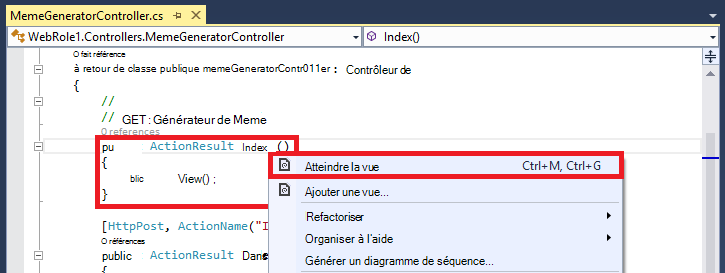

3.  Acceptez les paramètres ci-dessous, puis cliquez sur **Ajouter**.

    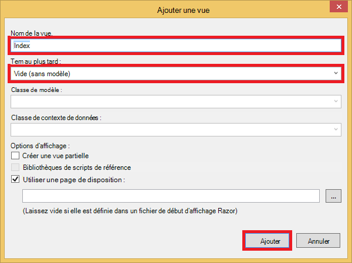

4. Ouvrez la nouvelle *Views\MemeGenerator\Index.cshtml* et remplacer le contenu par le HTML simple suivant pour soumettre les superlatifs :

        <h2>Meme Generator</h2>
        
        <form action="" method="post">
            <input type="text" name="top" placeholder="Enter top text here" />
            <br />
            <input type="text" name="bottom" placeholder="Enter bottom text here" />
            <br />
            <input class="btn" type="submit" value="Generate meme" />
        </form>

5. Publiez à nouveau à l’application web Azure et accédez à * *http://*&lt;ServiceName% >*.cloudapp.net/MemeGenerator/Index** dans votre navigateur. 

Lorsque vous envoyez les valeurs de formulaire à `/MemeGenerator/Index`, le `Index_Post` méthode d’action renvoie un lien vers le `Show` méthode d’action avec l’identificateur d’entrée respectif. Lorsque vous cliquez sur le lien, vous atteignez le code suivant :  

    [OutputCache(VaryByParam = "*", Duration = 1, Location = OutputCacheLocation.Downstream)]
    public ActionResult Show(string id)
    {
      Tuple<string, string> data = null;
      if (!Memes.TryGetValue(id, out data))
      {
        return new HttpStatusCodeResult(HttpStatusCode.NotFound);
      }

      if (Debugger.IsAttached) // Preserve the debug experience
      {
        return Redirect(string.Format("/MemeGenerator/Generate?top={0}&bottom={1}", data.Item1, data.Item2));
      }
      else // Get content from Azure CDN
      {
        return Redirect(string.Format("http://<yourCDNName>.azureedge.net/MemeGenerator/Generate?top={0}&bottom={1}", data.Item1, data.Item2));
      }
    }

Si votre débogueur local est attaché, vous obtiendrez l’expérience de débogage régulières avec une redirection locale. Si elle est en cours d’exécution dans l’application web d’Azure, puis il redirige vers :

    http://<yourCDNName>.azureedge.net/MemeGenerator/Generate?top=<formInput>&bottom=<formInput>

Qui correspond à l’URL d’origine suivante à votre point de terminaison du Canada :

    http://<yourSiteName>.azurewebsites.net/cdn/MemeGenerator/Generate?top=<formInput>&bottom=<formInput>

Une fois la règle appliquée précédemment de réécriture d’URL, le fichier réel qui obtient mis en cache sur votre point de terminaison CDN est :

    http://<yourSiteName>.azurewebsites.net/MemeGenerator/Generate?top=<formInput>&bottom=<formInput>

Vous pouvez ensuite utiliser le `OutputCacheAttribute` d’attribut sur le `Generate` méthode pour spécifier comment le résultat de l’action doit être mis en cache, qui respecte la Azure CDN. Le code ci-dessous spécifie une expiration du cache de 1 heure (3 600 secondes).

    [OutputCache(VaryByParam = "*", Duration = 3600, Location = OutputCacheLocation.Downstream)]

De même, vous pouvez servir des contenus à partir de n’importe quelle action de contrôleur dans votre application web Azure via votre Azure CDN, avec l’option de mise en cache de votre choix.

Dans la section suivante, je vous montrerai comment prendre en charge les scripts fournis et réduites et CSS grâce à Azure CDN. 

## <a name="integrate-aspnet-bundling-and-minification-with-azure-cdn"></a>Intégration ASP.NET regroupement et minimisation avec Azure CDN ##

Les feuilles de style CSS et les scripts changent peu souvent et constituent des candidates pour le cache d’Azure CDN. Service de l’application web entière par l’intermédiaire de votre Azure CDN est le moyen le plus simple pour intégrer le regroupement et minimisation avec Azure CDN. Cependant, que vous pouvez choisir par rapport à cette approche pour les raisons décrites dans [intégrer un point de terminaison Azure CDN avec votre Azure web app et servir du contenu statique dans vos pages Web à partir d’Azure CDN](#deploy-a-web-app-to-azure-with-an-integrated-cdn-endpoint), je vous montrerai faire tout en préservant de l’expérience du programme souhaité de ASP.NET regroupement et minimisation, telles que :

-   Expérience du mode débogage très
-   Déploiement rationalisé
-   Mises à jour immédiates aux clients des mises à niveau de version de script/CSS
-   Mécanisme de secours en cas d’échec de votre point de terminaison CDN
-   Réduire la modification de code

Dans le projet ASP.NET créé à [intégrer un point de terminaison Azure CDN avec votre Azure web app et servir du contenu statique dans vos pages Web à partir d’Azure CDN](#deploy-a-web-app-to-azure-with-an-integrated-cdn-endpoint), ouvrez *App_Start\BundleConfig.cs* et examinez les `bundles.Add()` les appels de méthode.

    public static void RegisterBundles(BundleCollection bundles)
    {
        bundles.Add(new ScriptBundle("~/bundles/jquery").Include(
                    "~/Scripts/jquery-{version}.js"));
        ...
    }

La première `bundles.Add()` instruction ajoute une offre groupée de script dans le répertoire virtuel `~/bundles/jquery`. Ouvrez ensuite *Views\Shared\_Layout.cshtml* pour voir comment la balise offre groupée de script est rendue. Vous serez en mesure de trouver la ligne suivante de code Razor :

    @Scripts.Render("~/bundles/jquery")

Lorsque ce code Razor est exécuté dans l’application web d’Azure, il restituera un `<script>` balise pour l’offre groupée du script semblable au suivant : 

    <script src="/bundles/jquery?v=FVs3ACwOLIVInrAl5sdzR2jrCDmVOWFbZMY6g6Q0ulE1"></script>

Toutefois, lorsqu’il est exécuté dans Visual Studio en tapant `F5`, il restituera individuellement chaque fichier de script du lot (dans ce cas, un seul script fichier est dans le lot) :

    <script src="/Scripts/jquery-1.10.2.js"></script>

Cela vous permet de déboguer le code JavaScript dans votre environnement de développement tout en réduisant les connexions client simultanées (regroupement) et amélioration du fichier téléchargent des performances (réduction) dans la production. Il s’agit d’une fonctionnalité intéressante à conserver avec intégration d’Azure CDN. En outre, dans la mesure où l’offre groupée rendue contient déjà une chaîne de version généré automatiquement, vous souhaitez répliquer cette fonctionnalité afin que chaque fois que vous mettez à jour votre version de jQuery via NuGet, elle peut être mise à jour côté client dès que possible.

Suivez les étapes ci-dessous pour le regroupement des ASP.NET d’intégration et minimisation avec votre point de terminaison CDN.

1. Dans *App_Start\BundleConfig.cs*, modifiez les `bundles.Add()` les méthodes à utiliser un autre [constructeur de l’offre groupée](http://msdn.microsoft.com/library/jj646464.aspx), qui spécifie une adresse CDN. Pour ce faire, remplacez la `RegisterBundles` définition de méthode par le code suivant :  
    
        public static void RegisterBundles(BundleCollection bundles)
        {
          bundles.UseCdn = true;
          var version = System.Reflection.Assembly.GetAssembly(typeof(Controllers.HomeController))
            .GetName().Version.ToString();
          var cdnUrl = "http://<yourCDNName>.azureedge.net/{0}?" + version;

          bundles.Add(new ScriptBundle("~/bundles/jquery", string.Format(cdnUrl, "bundles/jquery")).Include(
                "~/Scripts/jquery-{version}.js"));

          bundles.Add(new ScriptBundle("~/bundles/jqueryval", string.Format(cdnUrl, "bundles/jqueryval")).Include(
                "~/Scripts/jquery.validate*"));

          // Use the development version of Modernizr to develop with and learn from. Then, when you're
          // ready for production, use the build tool at http://modernizr.com to pick only the tests you need.
          bundles.Add(new ScriptBundle("~/bundles/modernizr", string.Format(cdnUrl, "bundles/modernizr")).Include(
                "~/Scripts/modernizr-*"));

          bundles.Add(new ScriptBundle("~/bundles/bootstrap", string.Format(cdnUrl, "bundles/bootstrap")).Include(
                "~/Scripts/bootstrap.js",
                "~/Scripts/respond.js"));

          bundles.Add(new StyleBundle("~/Content/css", string.Format(cdnUrl, "Content/css")).Include(
                "~/Content/bootstrap.css",
                "~/Content/site.css"));
        }


    Veillez à remplacer `<yourCDNName>` avec le nom de votre Azure CDN.

    Clairement, vous définissez des `bundles.UseCdn = true` et ajouté une URL CDN soigneusement chaque lot. Par exemple, le premier constructeur dans le code :

        new ScriptBundle("~/bundles/jquery", string.Format(cdnUrl, "bundles/jquery"))

    est le même que : 

        new ScriptBundle("~/bundles/jquery", string.Format(cdnUrl, "http://<yourCDNName>.azureedge.net/bundles/jquery?<W.X.Y.Z>"))

    Ce constructeur indique le groupage d’ASP.NET et de minimisation à rendre les fichiers de script individuels lors du débogage localement, mais utiliser l’adresse CDN spécifiée pour accéder au script en question. Notez, cependant, deux caractéristiques importantes avec cette URL CDN élaborée avec soin :
    
    - L’origine de cette URL CDN est `http://<yourSiteName>.azurewebsites.net/bundles/jquery?<W.X.Y.Z>`, qui est en fait le répertoire virtuel du fichier de script dans votre application Web.
    - Dans la mesure où vous utilisez le constructeur CDN, la balise de script CDN pour l’offre groupée ne contient plus la chaîne de version généré automatiquement dans l’URL rendue. Vous devez générer manuellement une chaîne de version unique chaque fois que l’ensemble du script est modifié pour forcer une absence de cache à votre Azure CDN. Dans le même temps, cette chaîne de version unique doit rester constante par le biais de la durée de vie du déploiement pour maximiser les correspondances dans le cache à votre Azure CDN après le déploiement de l’offre groupée.

3. La chaîne de requête `<W.X.Y.Z>` extrait de *Properties\AssemblyInfo.cs* dans votre projet ASP.NET. Vous pouvez avoir un flux de travail de déploiement qui inclut chaque fois que vous publiez vers Azure, l’incrémentation de la version de l’assembly. Ou bien, vous pouvez simplement modifier *Properties\AssemblyInfo.cs* dans votre projet pour incrémenter automatiquement la chaîne de version à chaque fois que vous générez, en utilisant le caractère générique ' *'. Par exemple, remplacez `AssemblyVersion` comme indiqué ci-dessous :
    
        [assembly: AssemblyVersion("1.0.0.*")]
    
    Une autre stratégie pour rationaliser la génération d’une chaîne unique pour la durée de vie d’un déploiement fonctionnera également ici.

3. Republier l’application ASP.NET et d’accéder à la page d’accueil.
 
4. Permet d’afficher le code HTML de la page. Vous devez être en mesure de voir l’URL CDN rendu, avec une chaîne de version unique chaque fois que vous publiez de nouveau les modifications à votre application web Azure. Par exemple :  
    
        ...
        <link href="http://az673227.azureedge.net/Content/css?1.0.0.25449" rel="stylesheet"/>
        <script src="http://az673227.azureedge.net/bundles/modernizer?1.0.0.25449"></script>
        ...
        <script src="http://az673227.azureedge.net/bundles/jquery?1.0.0.25449"></script>
        <script src="http://az673227.azureedge.net/bundles/bootstrap?1.0.0.25449"></script>
        ...

5. Dans Visual Studio, déboguer l’application ASP.NET dans Visual Studio en tapant `F5`., 

6. Permet d’afficher le code HTML de la page. Vous verrez toujours chaque fichier de script restitué individuellement et avoir un débogage cohérente peut rencontrer dans Visual Studio.  
    
        ...
        <link href="/Content/bootstrap.css" rel="stylesheet"/>
        <link href="/Content/site.css" rel="stylesheet"/>
        <script src="/Scripts/modernizr-2.6.2.js"></script>
        ...
        <script src="/Scripts/jquery-1.10.2.js"></script>
        <script src="/Scripts/bootstrap.js"></script>
        <script src="/Scripts/respond.js"></script>
        ...    

## <a name="fallback-mechanism-for-cdn-urls"></a>Mécanisme de secours pour les URL du CDN ##

Lorsque votre point de terminaison Azure CDN échoue pour une raison quelconque, vous souhaitez que votre page Web assez intelligent accéder à votre serveur Web d’origine comme option de secours de chargement du JavaScript ou amorçage. Il est assez sérieuse perte d’images sur votre application web en raison de l’indisponibilité CDN, mais beaucoup plus important de perdre la fonctionnalité essentielle fournie par les scripts et les feuilles de style.

La classe [offre groupée](http://msdn.microsoft.com/library/system.web.optimization.bundle.aspx) contient une propriété appelée [CdnFallbackExpression](http://msdn.microsoft.com/library/system.web.optimization.bundle.cdnfallbackexpression.aspx) qui vous permet de configurer le mécanisme de secours de l’échec CDN. Pour utiliser cette propriété, procédez comme suit :

1. Dans votre projet ASP.NET, ouvrez *App_Start\BundleConfig.cs*, où vous avez ajouté une URL CDN dans chaque [constructeur de faisceau](http://msdn.microsoft.com/library/jj646464.aspx)et ajoutez `CdnFallbackExpression` dans les quatre emplacements de code comme illustré pour ajouter un mécanisme de secours aux groupes par défaut.  
    
        public static void RegisterBundles(BundleCollection bundles)
        {
          var version = System.Reflection.Assembly.GetAssembly(typeof(BundleConfig))
            .GetName().Version.ToString();
          var cdnUrl = "http://cdnurl.azureedge.net/.../{0}?" + version;
          bundles.UseCdn = true;

          bundles.Add(new ScriptBundle("~/bundles/jquery", string.Format(cdnUrl, "bundles/jquery")) 
                { CdnFallbackExpression = "window.jquery" }
                .Include("~/Scripts/jquery-{version}.js"));

          bundles.Add(new ScriptBundle("~/bundles/jqueryval", string.Format(cdnUrl, "bundles/jqueryval")) 
                { CdnFallbackExpression = "$.validator" }
                .Include("~/Scripts/jquery.validate*"));

          // Use the development version of Modernizr to develop with and learn from. Then, when you're
          // ready for production, use the build tool at http://modernizr.com to pick only the tests you need.
          bundles.Add(new ScriptBundle("~/bundles/modernizr", string.Format(cdnUrl, "bundles/modernizer")) 
                { CdnFallbackExpression = "window.Modernizr" }
                .Include("~/Scripts/modernizr-*"));

          bundles.Add(new ScriptBundle("~/bundles/bootstrap", string.Format(cdnUrl, "bundles/bootstrap"))     
                { CdnFallbackExpression = "$.fn.modal" }
                .Include(
                        "~/Scripts/bootstrap.js",
                        "~/Scripts/respond.js"));

          bundles.Add(new StyleBundle("~/Content/css", string.Format(cdnUrl, "Content/css")).Include(
                "~/Content/bootstrap.css",
                "~/Content/site.css"));
        }

    Lors de la `CdnFallbackExpression` est pas null, script est injecté dans le code HTML pour tester si l’offre est chargé correctement et, dans le cas contraire, accéder à l’offre groupée directement à partir du serveur Web d’origine. Cette propriété doit être définie sur une expression JavaScript qui teste si le bundle CDN respectif est chargé correctement. L’expression permettant de tester chaque botte diffère en fonction du contenu. Pour les offres groupées par défaut ci-dessus :
    
    - `window.jquery`est défini dans .js jquery-{version}
    - `$.validator`est défini dans jquery.validate.js
    - `window.Modernizr`est défini dans modernizer-{version} .js
    - `$.fn.modal`est défini dans bootstrap.js
    
    Vous avez peut-être remarqué que je n’avez pas défini de CdnFallbackExpression pour la `~/Cointent/css` offre groupée. C’est parce que, actuellement, il existe un [bogue dans System.Web.Optimization](https://aspnetoptimization.codeplex.com/workitem/104) qui injecte un `<script>` balises de la CSS de secours au lieu du texte attendu `<link>` balises.
    
    Toutefois, il existe un bon [Style offre groupée secours](https://github.com/EmberConsultingGroup/StyleBundleFallback) offerts par [Les Consulting Group](https://github.com/EmberConsultingGroup). 

2. Pour utiliser la solution de contournement pour CSS, créer un nouveau fichier .cs dans le dossier de *App_Start* de votre projet ASP.NET appelé *StyleBundleExtensions.cs*et de remplacer son contenu par le [code à partir de GitHub](https://github.com/EmberConsultingGroup/StyleBundleFallback/blob/master/Website/App_Start/StyleBundleExtensions.cs). 

4. Dans *App_Start\StyleFundleExtensions.cs*, renommez l’espace de noms à l’espace de noms de votre application ASP.NET (par exemple, **cdnwebapp**). 

3. Revenez à `App_Start\BundleConfig.cs` et remplacer la dernière `bundles.Add` instruction par le code suivant :  

        bundles.Add(new StyleBundle("~/Content/css", string.Format(cdnUrl, "Content/css"))
          .IncludeFallback("~/Content/css", "sr-only", "width", "1px")
          .Include(
            "~/Content/bootstrap.css",
            "~/Content/site.css"));

    Cette nouvelle méthode d’extension utilise la même idée pour injecter un script dans le code HTML pour vérifier le DOM pour le nom de classe correspondant, nom de la règle, de valeur définie dans l’offre groupée CSS et se situe sur le serveur Web d’origine en cas d’échec trouver la correspondance de la règle.

4. Publiez à nouveau à votre application web Azure et accéder à la page d’accueil. 
5. Permet d’afficher le code HTML de la page. Vous devriez trouver des scripts injectées semblable à la suivante :    
    
    ```
    ...
    <link href="http://az673227.azureedge.net/Content/css?1.0.0.25474" rel="stylesheet"/>
<script>(function() {
                var loadFallback,
                    len = document.styleSheets.length;
                for (var i = 0; i < len; i++) {
                    var sheet = document.styleSheets[i];
                    if (sheet.href.indexOf('http://az673227.azureedge.net/Content/css?1.0.0.25474') !== -1) {
                        var meta = document.createElement('meta');
                        meta.className = 'sr-only';
                        document.head.appendChild(meta);
                        var value = window.getComputedStyle(meta).getPropertyValue('width');
                        document.head.removeChild(meta);
                        if (value !== '1px') {
                            document.write('<link href="/Content/css" rel="stylesheet" type="text/css" />');
                        }
                    }
                }
                return true;
            }())||document.write('<script src="/Content/css"><\/script>');</script>

    <script src="http://az673227.azureedge.net/bundles/modernizer?1.0.0.25474"></script>
    <script>(window.Modernizr)||document.write('<script src="/bundles/modernizr"><\/script>');</script>
    ... 
    <script src="http://az673227.azureedge.net/bundles/jquery?1.0.0.25474"></script>
    <script>(window.jquery)||document.write('<script src="/bundles/jquery"><\/script>');</script>

    <script src="http://az673227.azureedge.net/bundles/bootstrap?1.0.0.25474"></script>
    <script>($.fn.modal)||document.write('<script src="/bundles/bootstrap"><\/script>');</script>
    ...
    ```

    Notez que script injecté pour l’offre groupée CSS contient toujours le remnant errant de la `CdnFallbackExpression` propriété dans la ligne :

        }())||document.write('<script src="/Content/css"><\/script>');</script>

    Mais depuis la première partie de la || expression retournera toujours la valeur true (dans la ligne directement au-dessus de), la fonction document.Write () ne s’exécutera jamais.

6. Pour vérifier si le script de secours fonctionne, revenez à la lame du votre point de terminaison CDN et cliquez sur **Arrêter**.

    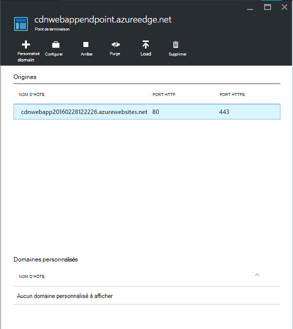

7. Actualiser la fenêtre de votre navigateur pour l’application web Azure. Vous devez maintenant voir que tous les scripts et feuilles de style sont correctement chargé.

## <a name="more-information"></a>Plus d’informations 
- [Vue d’ensemble du réseau Azure de diffusion de contenu (CDN)](../cdn/cdn-overview.md)
- [À l’aide d’Azure CDN](../cdn/cdn-create-new-endpoint.md)
- [Intégrer un service cloud avec Azure CDN](../cdn/cdn-cloud-service-with-cdn.md)
- [ASP.NET regroupement et minimisation](http://www.asp.net/mvc/tutorials/mvc-4/bundling-and-minification)

