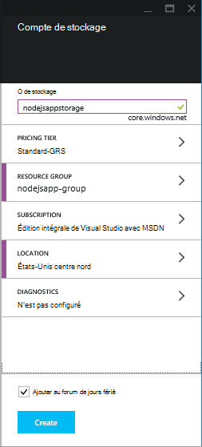
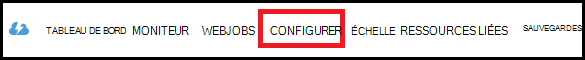
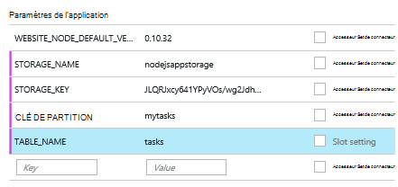

<properties
    pageTitle="Application web de Node.js à l’aide du Service de Table Azure"
    description="Ce didacticiel vous apprend à utiliser le service de la Table d’Azure pour stocker des données à partir d’une application Node.js qui est hébergée dans Azure Application Service Web Apps."
    tags="azure-portal"
    services="app-service\web, storage"
    documentationCenter="nodejs"
    authors="rmcmurray"
    manager="wpickett"
    editor=""/>

<tags
    ms.service="storage"
    ms.workload="storage"
    ms.tgt_pltfrm="na"
    ms.devlang="nodejs"
    ms.topic="article"
    ms.date="08/11/2016"
    ms.author="robmcm"/>

# Application web de Node.js à l’aide du Service de Table Azure

## Vue d’ensemble

Ce didacticiel vous montre comment utiliser le service de Table fournie par la gestion des données Azure pour stocker et accéder aux données d’une application de [nœud] hébergée dans [Azure Application Service](http://go.microsoft.com/fwlink/?LinkId=529714) Web Apps. Ce didacticiel suppose que vous disposez d’une expérience préalable à l’aide du nœud et [Git].

Vous allez apprendre :

* Comment utiliser npm (Gestionnaire de package de nœud) pour installer les modules de nœud

* Comment utiliser le service de la Table d’Azure

* L’utilisation de l’infrastructure du langage commun Azure pour créer une application web.

En suivant ce didacticiel, vous allez créer un simple basée sur le web application « liste de tâches » qui permet la création, la récupération et la réalisation des tâches. Les tâches sont stockées dans le service de la Table.

Voici l’application terminée :

![Une page web affichant une liste des tâches vide][node-table-finished]

>[AZURE.NOTE] Si vous souhaitez commencer avec le Service d’application Azure avant l’ouverture d’un compte Azure, accédez à [Essayer le Service application](http://go.microsoft.com/fwlink/?LinkId=523751), où vous pouvez créer une application web de courte durée starter immédiatement dans le Service d’application. Aucune carte de crédit obligatoire ; aucun des engagements.

## Conditions préalables

Avant de suivre les instructions fournies dans cet article, assurez-vous d’avoir les éléments suivants :

* [nœud] version 0.10.24 ou supérieure

* [GIT]

[AZURE.INCLUDE [create-account-and-websites-note](../../includes/create-account-and-websites-note.md)]

## Créer un compte de stockage

Créez un compte de stockage Azure. L’application utilise ce compte pour stocker les éléments d’action.

1.  Journal du [portail Azure](https://portal.azure.com/).

2. Cliquez sur l’icône de **Nouveau** en bas à gauche du portail, puis cliquez sur **données + stockage** > **stockage**. Nommez le compte de stockage unique et créer un nouveau [groupe de ressources](../azure-resource-manager/resource-group-overview.md) pour celui-ci.

    

    Lorsque le compte de stockage a été créé, le bouton **Notifications** clignote en vert **Réussite** et les lames du compte de stockage sont ouvert pour montrer qu’il appartient pour le nouveau groupe de ressources que vous avez créé.

5. Dans les lames du compte de stockage, cliquez sur **paramètres** > **clés**. Copiez la clé d’accès principal dans le Presse-papiers.

    ![Touche d’accès rapide][portal-storage-access-keys]

##Installation de modules et de générer la structure

Dans cette section, vous créez une nouvelle application de nœud et npm permet d’ajouter des packages de module. Pour cette application, vous utiliserez les modules [Express] et [Azure] . Le module Express fournit une infrastructure Model View Controller de nœud, tandis que les modules Azure fournit la connectivité au service de la Table.

### Installation express et générer la génération de modèles automatique

1. À partir de la ligne de commande, créez un répertoire nommé **tasklist** et commutateur à ce répertoire.  

2. Entrez la commande suivante pour installer le module Express.

        npm install express-generator@4.2.0 -g

    Selon le système d’exploitation, vous devrez placer 'sudo' avant la commande :

        sudo npm install express-generator@4.2.0 -g

    La sortie ressemble à l’exemple suivant :

        express-generator@4.2.0 /usr/local/lib/node_modules/express-generator
        ├── mkdirp@0.3.5
        └── commander@1.3.2 (keypress@0.1.0)

    > [AZURE.NOTE] Le '-g' paramètre installe le module globalement. De cette façon, nous pouvons utiliser **express** pour générer la génération de modèles automatique web app sans avoir à saisir les informations de chemin d’accès supplémentaire.

4. Pour créer la génération de modèles automatique pour l’application, entrez la commande **express** :

        express

    La sortie de cette commande ressemble à l’exemple suivant :

           create : .
           create : ./package.json
           create : ./app.js
           create : ./public
           create : ./public/images
           create : ./routes
           create : ./routes/index.js
           create : ./routes/users.js
           create : ./public/stylesheets
           create : ./public/stylesheets/style.css
           create : ./views
           create : ./views/index.jade
           create : ./views/layout.jade
           create : ./views/error.jade
           create : ./public/javascripts
           create : ./bin
           create : ./bin/www

           install dependencies:
             $ cd . && npm install

           run the app:
             $ DEBUG=my-application ./bin/www

    Vous disposez désormais de plusieurs nouveaux répertoires et fichiers dans le répertoire de la **liste des tâches** .

### Installation des modules complémentaires

Un des fichiers que **express** crée est **package.json**. Ce fichier contient une liste de dépendances de module. Ultérieurement, lorsque vous déployez l’application à application Service Web Apps, ce fichier détermine quels modules doivent être installés sur Azure.

À partir de la ligne de commande, entrez la commande suivante pour installer les modules décrits dans le fichier **package.json** . Vous devrez peut-être utiliser 'sudo'.

    npm install

La sortie de cette commande ressemble à l’exemple suivant :

    debug@0.7.4 node_modules\debug

    cookie-parser@1.0.1 node_modules\cookie-parser
    ├── cookie-signature@1.0.3
    └── cookie@0.1.0

    [...]

Ensuite, entrez la commande suivante pour installer les modules [d’azure], le [nœud-uuid], [nconf] et [asynchrone] :

    npm install azure-storage node-uuid async nconf --save

La **--Enregistrer** indicateur ajoute des entrées pour ces modules dans le fichier **package.json** .

La sortie de cette commande ressemble à l’exemple suivant :

    async@0.9.0 node_modules\async

    node-uuid@1.4.1 node_modules\node-uuid

    nconf@0.6.9 node_modules\nconf
    ├── ini@1.2.1
    ├── async@0.2.9
    └── optimist@0.6.0 (wordwrap@0.0.2, minimist@0.0.10)

    [...]

## Création de l’application

Nous sommes maintenant prêts à générer l’application.

### Créer un modèle

Un *modèle* est un objet qui représente les données dans votre application. Pour l’application, le modèle seul est un objet de tâche, ce qui représente un élément dans la liste de tâches. Tâches comporte les champs suivants :

- PartitionKey
- RowKey
- nom (chaîne)
- catégorie (chaîne)
- terminé (booléen)

**PartitionKey** et **RowKey** sont utilisés par le Service de la Table en tant que clés de table. Pour plus d’informations, consultez [Présentation du modèle de données de Service de la Table](https://msdn.microsoft.com/library/azure/dd179338.aspx).

1. Dans le répertoire de la **liste des tâches** , créer un nouveau répertoire nommé **modèles**.

2. Dans le répertoire de **modèles** , créez un nouveau fichier nommé **task.js**. Ce fichier contient le modèle pour les tâches créées par votre application.

3. Au début du fichier **task.js** , ajoutez le code suivant pour référencer les bibliothèques requises :

        var azure = require('azure-storage');
        var uuid = require('node-uuid');
        var entityGen = azure.TableUtilities.entityGenerator;

4. Ajoutez le code suivant pour définir et exporter l’objet de la tâche. Cet objet est responsable de la connexion à la table.

        module.exports = Task;

        function Task(storageClient, tableName, partitionKey) {
          this.storageClient = storageClient;
          this.tableName = tableName;
          this.partitionKey = partitionKey;
          this.storageClient.createTableIfNotExists(tableName, function tableCreated(error) {
            if(error) {
              throw error;
            }
          });
        };

5. Ajoutez le code suivant pour définir d’autres méthodes sur l’objet de la tâche, qui permettent des interactions avec les données stockées dans la table :

        Task.prototype = {
          find: function(query, callback) {
            self = this;
            self.storageClient.queryEntities(this.tableName, query, null, function entitiesQueried(error, result) {
              if(error) {
                callback(error);
              } else {
                callback(null, result.entries);
              }
            });
          },

          addItem: function(item, callback) {
            self = this;
            // use entityGenerator to set types
            // NOTE: RowKey must be a string type, even though
            // it contains a GUID in this example.
            var itemDescriptor = {
              PartitionKey: entityGen.String(self.partitionKey),
              RowKey: entityGen.String(uuid()),
              name: entityGen.String(item.name),
              category: entityGen.String(item.category),
              completed: entityGen.Boolean(false)
            };
            self.storageClient.insertEntity(self.tableName, itemDescriptor, function entityInserted(error) {
              if(error){  
                callback(error);
              }
              callback(null);
            });
          },

          updateItem: function(rKey, callback) {
            self = this;
            self.storageClient.retrieveEntity(self.tableName, self.partitionKey, rKey, function entityQueried(error, entity) {
              if(error) {
                callback(error);
              }
              entity.completed._ = true;
              self.storageClient.updateEntity(self.tableName, entity, function entityUpdated(error) {
                if(error) {
                  callback(error);
                }
                callback(null);
              });
            });
          }
        }

6. Enregistrez et fermez le fichier **task.js** .

### Création d’un contrôleur

Un *contrôleur* gère les requêtes HTTP et rend la réponse HTML.

1. Dans le **répertoire/parcours de la liste des tâches** , créer un nouveau fichier nommé **tasklist.js** et ouvrez-le dans un éditeur de texte.

2. Ajoutez le code suivant à **tasklist.js**. Il charge les modules azure et asynchrone, qui sont utilisés par **tasklist.js**. Il définit également la fonction de **liste des tâches** , qui est passée à une instance de l’objet de **tâche** que nous avons défini plus haut :

        var azure = require('azure-storage');
        var async = require('async');

        module.exports = TaskList;

3. Permet de définir un objet de la **liste des tâches** .

        function TaskList(task) {
          this.task = task;
        }

4. Ajoutez les méthodes suivantes à la **liste des tâches**:

        TaskList.prototype = {
          showTasks: function(req, res) {
            self = this;
            var query = new azure.TableQuery()
              .where('completed eq ?', false);
            self.task.find(query, function itemsFound(error, items) {
              res.render('index',{title: 'My ToDo List ', tasks: items});
            });
          },

          addTask: function(req,res) {
            var self = this;
            var item = req.body.item;
            self.task.addItem(item, function itemAdded(error) {
              if(error) {
                throw error;
              }
              res.redirect('/');
            });
          },

          completeTask: function(req,res) {
            var self = this;
            var completedTasks = Object.keys(req.body);
            async.forEach(completedTasks, function taskIterator(completedTask, callback) {
              self.task.updateItem(completedTask, function itemsUpdated(error) {
                if(error){
                  callback(error);
                } else {
                  callback(null);
                }
              });
            }, function goHome(error){
              if(error) {
                throw error;
              } else {
               res.redirect('/');
              }
            });
          }
        }

### Modifier app.js

1. À partir du répertoire de la **liste des tâches** , ouvrez le fichier **app.js** . Ce fichier a été créé précédemment en exécutant la commande **express** .

2. Au début du fichier, ajoutez ce qui suit pour charger le module azure, définir le nom de la table clé de partition et les informations d’identification de stockage utilisées par cet exemple :

        var azure = require('azure-storage');
        var nconf = require('nconf');
        nconf.env()
             .file({ file: 'config.json', search: true });
        var tableName = nconf.get("TABLE_NAME");
        var partitionKey = nconf.get("PARTITION_KEY");
        var accountName = nconf.get("STORAGE_NAME");
        var accountKey = nconf.get("STORAGE_KEY");

    > [AZURE.NOTE] nconf charge les valeurs de configuration à partir de variables d’environnement ou le fichier **config.json** , qui nous le créerons ultérieurement.

3. Dans le fichier app.js, recherchez où vous voyez la ligne suivante :

        app.use('/', routes);
        app.use('/users', users);

    Remplacez les lignes précédentes par le code ci-dessous. Une instance de <strong>tâche</strong> avec une connexion à votre compte de stockage sera initialisé. Il est passé à la <strong>liste des tâches</strong>, qui utilisent pour communiquer avec le service de la Table :

        var TaskList = require('./routes/tasklist');
        var Task = require('./models/task');
        var task = new Task(azure.createTableService(accountName, accountKey), tableName, partitionKey);
        var taskList = new TaskList(task);

        app.get('/', taskList.showTasks.bind(taskList));
        app.post('/addtask', taskList.addTask.bind(taskList));
        app.post('/completetask', taskList.completeTask.bind(taskList));

4. Enregistrez le fichier **app.js** .

### Modifier l’affichage de l’index

1. Ouvrez le fichier **tasklist/views/index.jade** dans un éditeur de texte.

2. Remplacez tout le contenu du fichier par le code suivant. Définit une vue qui affiche les tâches existantes et comprend un formulaire permettant d’ajouter de nouvelles tâches et de marquage existants comme étant terminée.

        extends layout

        block content
          h1= title
          br

          form(action="/completetask", method="post")
            table.table.table-striped.table-bordered
              tr
                td Name
                td Category
                td Date
                td Complete
              if (typeof tasks === "undefined")
                tr
                  td
              else
                each task in tasks
                  tr
                    td #{task.name._}
                    td #{task.category._}
                    - var day   = task.Timestamp._.getDate();
                    - var month = task.Timestamp._.getMonth() + 1;
                    - var year  = task.Timestamp._.getFullYear();
                    td #{month + "/" + day + "/" + year}
                    td
                      input(type="checkbox", name="#{task.RowKey._}", value="#{!task.completed._}", checked=task.completed._)
            button.btn(type="submit") Update tasks
          hr
          form.well(action="/addtask", method="post")
            label Item Name:
            input(name="item[name]", type="textbox")
            label Item Category:
            input(name="item[category]", type="textbox")
            br
            button.btn(type="submit") Add item

3. Enregistrez et fermez le fichier de **index.jade** .

### Modifier la disposition globale

Le fichier **layout.jade** dans le répertoire **views** est un modèle global pour les autres fichiers **.jade** . Dans cette étape, vous allez modifier pour utiliser [Twitter des données d’amorçage](https://github.com/twbs/bootstrap), qui est un kit d’outils facilite la conception d’une application web d’aspect agréable.

Téléchargez et extrayez les fichiers [d’Amorçage de Twitter](http://getbootstrap.com/). Copiez le fichier **bootstrap.min.css** à partir du dossier démarrage **css** dans le répertoire **public/feuilles de style** de votre application.

Dans le dossier **vues** , ouvrez **layout.jade** et remplacez l’intégralité du contenu par le suivant :

    doctype html
    html
      head
        title= title
        link(rel='stylesheet', href='/stylesheets/bootstrap.min.css')
        link(rel='stylesheet', href='/stylesheets/style.css')
      body.app
        nav.navbar.navbar-default
          div.navbar-header
          a.navbar-brand(href='/') My Tasks
        block content

### Créer un fichier de configuration

Pour exécuter l’application localement, nous allons présenter les informations d’identification du stockage Azure dans un fichier de configuration. Créez un fichier nommé * *config.json* *avec le JSON suivant :

    {
        "STORAGE_NAME": "<storage account name>",
        "STORAGE_KEY": "<storage access key>",
        "PARTITION_KEY": "mytasks",
        "TABLE_NAME": "tasks"
    }

Remplacez le **nom du compte de stockage** avec le nom du compte de stockage que vous avez créé précédemment et remplacez la **clé d’accès de stockage** avec la clé d’accès principal pour votre compte de stockage. Par exemple :

    {
        "STORAGE_NAME": "nodejsappstorage",
        "STORAGE_KEY": "KG0oDd..."
        "PARTITION_KEY": "mytasks",
        "TABLE_NAME": "tasks"
    }

Enregistrer ce fichier *répertoire de niveau supérieur* à celui du répertoire de la **liste des tâches** , comme suit :

    parent/
      |-- config.json
      |-- tasklist/

La raison pour cela est d’éviter de vérifier le fichier de configuration dans le contrôle de source, où il peut devenir public. Lors du déploiement de l’application dans Azure, nous allons utiliser des variables d’environnement au lieu d’un fichier de configuration.

## Exécutez l’application localement

Pour tester l’application sur votre ordinateur local, procédez comme suit :

1. À partir de la ligne de commande, accédez au répertoire de la **liste des tâches** .

2. Utilisez la commande suivante pour lancer l’application localement :

        npm start

3. Ouvrez un navigateur web et accédez à http://127.0.0.1:3000.

    Une page web similaire à celle ci-dessous s’affiche.

    ![Une page Web affichant une liste des tâches vide][node-table-finished]

4. Pour créer un nouvel élément de tâche, entrez un nom et une catégorie, puis cliquez sur **Ajouter un élément**. 

6. Pour marquer une tâche comme terminée, vérifiez les **complète** et cliquez sur **Les tâches de mise à jour**.

    ![Une image du nouvel élément dans la liste des tâches][node-table-list-items]

Même si l’application s’exécute localement, il stocke les données dans le service de la Table d’Azure.

## Déployer votre application dans Azure

Les étapes décrites dans cette section les outils de ligne de commande Azure permet de créer une nouvelle application web dans le Service d’application et puis utilisent Git pour déployer votre application. Pour effectuer ces étapes, vous devez posséder un abonnement Azure.

> [AZURE.NOTE] Ces étapes peuvent également être réalisées à l’aide du [Portail Azure](https://portal.azure.com/). Reportez-vous à la section [créer et déployer une application web de Node.js dans le Service d’application Azure].
>
> S’il s’agit de la première application web que vous avez créé, vous devez utiliser le portail Azure pour déployer cette application.

Pour commencer, installez la [CLI d’Azure] en entrant la commande suivante à partir de la ligne de commande :

    npm install azure-cli -g

### Importer les paramètres de publication

Dans cette étape, vous allez télécharger un fichier contenant des informations sur votre abonnement.

1. Entrez la commande suivante :

        azure account download

    Cette commande lance un navigateur et accède à la page de téléchargement. Si vous y êtes invité, connectez-vous avec le compte associé à votre abonnement Azure.

    <!-- ![The download page][download-publishing-settings] -->

    Le téléchargement du fichier commence automatiquement ; Si elle n’est pas le cas, vous pouvez cliquer sur le lien au début de la page pour télécharger manuellement le fichier. Enregistrez le fichier et notez le chemin d’accès du fichier.

2. Entrez la commande suivante pour importer les paramètres :

        azure account import <path-to-file>

    Spécifiez le chemin et le nom du fichier de paramètres publication que vous avez téléchargé à l’étape précédente.

3. Une fois que les paramètres sont importés, supprimer le fichier de paramètres de publication. Il n’est plus nécessaire et contient des informations confidentielles concernant votre abonnement Azure.

### Créer une application web de Service de l’application

1. À partir de la ligne de commande, accédez au répertoire de la **liste des tâches** .

2. Utilisez la commande suivante pour créer une nouvelle application web.

        azure site create --git

    Vous demandera le nom de l’application web et l’emplacement. Fournissez un nom unique et sélectionnez le même emplacement géographique comme votre compte de stockage Azure.

    Le `--git` paramètre crée un référentiel Git sur Azure pour cette application web. Elle initialise également un référentiel Git dans le répertoire en cours si aucun n’existe et ajoute un [Git distant] nommé « azure », qui est utilisé pour publier l’application sur Azure. Enfin, il crée un fichier **web.config** qui contient les paramètres utilisés par Azure pour héberger des applications de nœud. Si vous omettez le `--git` paramètre mais le répertoire contient un référentiel Git, la commande crée toujours le « azure » à distance.

    Une fois cette commande terminée, vous verrez une sortie similaire à ce qui suit. Notez que la ligne qui commence par le **site Web créé au** contienne l’URL de l’application web.

        info:   Executing command site create
        help:   Need a site name
        Name: TableTasklist
        info:   Using location southcentraluswebspace
        info:   Executing `git init`
        info:   Creating default .gitignore file
        info:   Creating a new web site
        info:   Created web site at  tabletasklist.azurewebsites.net
        info:   Initializing repository
        info:   Repository initialized
        info:   Executing `git remote add azure https://username@tabletasklist.azurewebsites.net/TableTasklist.git`
        info:   site create command OK

    > [AZURE.NOTE] S’il s’agit de la première application de Service de l’application web pour votre abonnement, vous serez invité à utiliser le portail Azure pour créer l’application web. Pour plus d’informations, consultez [Générer et déployer une application web de Node.js dans le Service d’application Azure].

### Jeu de variables d’environnement

Dans cette étape, vous allez ajouter des variables d’environnement pour la configuration de votre application web sur Azure.
À partir de la ligne de commande, entrez les informations suivantes :

    azure site appsetting add
        STORAGE_NAME=<storage account name>;STORAGE_KEY=<storage access key>;PARTITION_KEY=mytasks;TABLE_NAME=tasks

Remplacer **<storage account name>** avec le nom du stockage du compte créé précédemment et remplacer **<storage access key>** avec la clé d’accès principal pour votre compte de stockage. (Utilisez les mêmes valeurs que le fichier config.json que vous avez créé plus tôt.)

Vous pouvez également définir des variables d’environnement dans le [Portail Azure](https://portal.azure.com/):

1.  Ouvrez la lame de l’application web en cliquant sur **Parcourir** > **Web Apps** > le nom de votre application web.

1.  Dans les lames de votre application web, cliquez sur **Tous les paramètres** > **Paramètres de l’Application**.

    <!--  -->

1.  Faites défiler jusqu'à la section **paramètres d’application** et d’ajouter des paires clé/valeur.

    

1. Cliquez sur **Enregistrer**.

### Publication de l’application

Pour publier l’application, valider les fichiers de code Git et puis pousser vers azure/master.

1. Définir les informations d’identification de votre déploiement.

        azure site deployment user set <name> <password>

2. Ajouter et valider les fichiers de votre application.

        git add .
        git commit -m "adding files"

3. Poussez la validation à l’application Service web app :

        git push azure master

    Utilisez **maître** comme la branche cible. À la fin du déploiement, vous voyez une instruction semblable à l’exemple suivant :

        To https://username@tabletasklist.azurewebsites.net/TableTasklist.git
         * [new branch]      master -> master

4. À l’issue de l’opération de diffusion, accédez à l’URL d’application web retournée précédemment par le `azure create site` pour afficher votre application.

## Étapes suivantes

Alors que les étapes décrites dans cet article décrivent à l’aide du Service de la Table pour stocker des informations, vous pouvez également utiliser [MongoDB](https://mlab.com/azure/). 

## Ressources supplémentaires

[CLI Azure]

## Ce qui a changé
* Pour obtenir un guide pour la modification de sites Web au Service de l’application voir : [Service d’application Azure et son Impact sur les Services Azure existants](http://go.microsoft.com/fwlink/?LinkId=529714)

<!-- URLs -->

[Générer et déployer une application web de Node.js dans le Service d’application Azure]: web-sites-nodejs-develop-deploy-mac.md
[Azure Developer Center]: /develop/nodejs/

[nœud]: http://nodejs.org
[GIT]: http://git-scm.com
[Express]: http://expressjs.com
[for free]: http://windowsazure.com
[GIT à distance]: http://git-scm.com/docs/git-remote

[CLI Azure]: ../xplat-cli-install.md

[Azure]: https://github.com/Azure/azure-sdk-for-node
[nœud-uuid]: https://www.npmjs.com/package/node-uuid
[nconf]: https://www.npmjs.com/package/nconf
[Async]: https://www.npmjs.com/package/async

[Azure Portal]: https://portal.azure.com

[Create and deploy a Node.js application to an Azure Web Site]: web-sites-nodejs-develop-deploy-mac.md
 
<!-- Image References -->

[node-table-finished]: ./media/storage-nodejs-use-table-storage-web-site/table_todo_empty.png
[node-table-list-items]: ./media/storage-nodejs-use-table-storage-web-site/table_todo_list.png
[download-publishing-settings]: ./media/storage-nodejs-use-table-storage-web-site/azure-account-download-cli.png
[portal-new]: ./media/storage-nodejs-use-table-storage-web-site/plus-new.png
[portal-storage-account]: ./media/storage-nodejs-use-table-storage-web-site/new-storage.png
[portal-quick-create-storage]: ./media/storage-nodejs-use-table-storage-web-site/quick-storage.png
[portal-storage-access-keys]: ./media/storage-nodejs-use-table-storage-web-site/manage-access-keys.png
[go-to-dashboard]: ./media/storage-nodejs-use-table-storage-web-site/go_to_dashboard.png
[web-configure]: ./media/storage-nodejs-use-table-storage-web-site/sql-task-configure.png
[app-settings-save]: ./media/storage-nodejs-use-table-storage-web-site/savebutton.png
[app-settings]: ./media/storage-nodejs-use-table-storage-web-site/storage-tasks-appsettings.png
