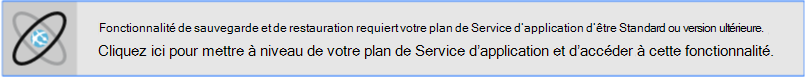
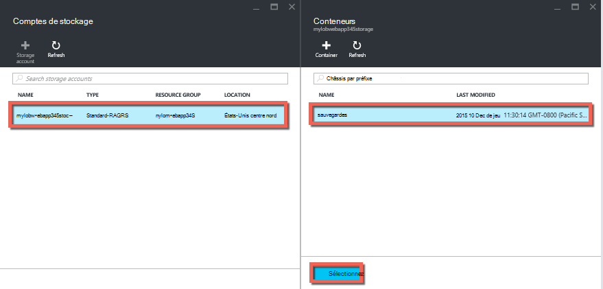
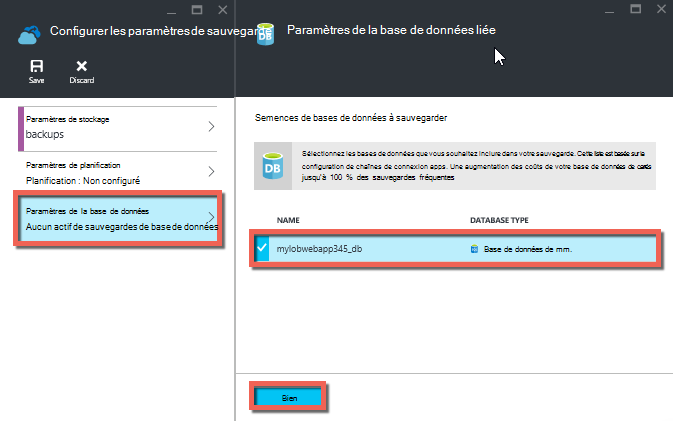
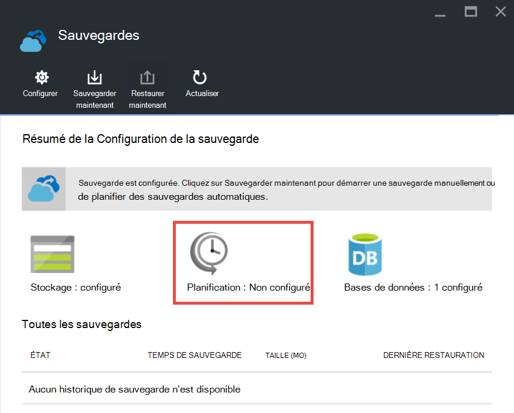

<properties 
    pageTitle="Sauvegarder votre application dans Azure" 
    description="Apprenez à créer des sauvegardes de vos applications de Service d’application Azure." 
    services="app-service" 
    documentationCenter="" 
    authors="cephalin" 
    manager="wpickett" 
    editor="jimbe"/>

<tags 
    ms.service="app-service" 
    ms.workload="na" 
    ms.tgt_pltfrm="na" 
    ms.devlang="na" 
    ms.topic="article" 
    ms.date="07/06/2016" 
    ms.author="cephalin"/>

# Sauvegarder votre application dans Azure

La fonctionnalité de sauvegarde et de restauration dans le [Service d’application Azure](../app-service/app-service-value-prop-what-is.md) permet de créer facilement des sauvegardes de l’application manuellement ou automatiquement. Vous pouvez restaurer votre application à un état antérieur, ou créer une nouvelle application à partir de sauvegardes d’origine de votre application. 

Pour plus d’informations sur la restauration d’une application de sauvegarde, consultez [restauration d’une application dans Azure](web-sites-restore.md).

## Ce qui est sauvegardé 
Service de l’application peut sauvegarder les informations suivantes :

* Configuration de l’application
* Contenu du fichier
* Les bases de données SQL Azure ou les bases de données MySQL d’Azure (ClearDB) connectés à votre application (vous pouvez choisir celles que vous voulez inclure dans la sauvegarde)

Ces informations sont sauvegardées pour le compte de stockage Azure et le conteneur que vous spécifiez. 

> [AZURE.NOTE] Chaque sauvegarde est une copie complète hors connexion de votre application, pas une mise à jour incrémentielle.

## Conditions et restrictions

* La fonctionnalité de sauvegarde et de restauration requiert le Service de l’application dans la couche **Standard** ou plan supérieur. Pour plus d’informations sur la mise à l’échelle de votre plan de Service de l’application à un niveau supérieur, consultez [mettre à l’échelle d’une application dans Azure](web-sites-scale.md). Notez que le niveau de **prime** permet un plus grand nombre de sauvegardes quotidiennes à niveau **Standard** .
* Vous avez besoin d’un compte de stockage Azure et un conteneur dans la souscription de même que l’application que vous souhaitez sauvegarder. Pour plus d’informations sur les comptes de stockage Azure, consultez les [liens](#moreaboutstorage) à la fin de cet article.
* Les sauvegardes peuvent être jusqu'à 10 Go de contenu d’application et de base de données. Vous obtiendrez une erreur si la taille de la sauvegarde dépasse cette limite. 

## Créer une sauvegarde manuelle

2. Dans le [Portail Azure](https://portal.azure.com), accédez à lame de votre application, sélectionnez **paramètres**, puis les **sauvegardes**. La lame de **sauvegardes** s’affichent.
    
    ![Page de sauvegardes][ChooseBackupsPage]

    >[AZURE.NOTE]Si vous voyez le message ci-dessous s’affiche, cliquez dessus pour mettre à niveau votre plan de Service d’application avant de procéder à des sauvegardes.
Pour plus d’informations, reportez-vous à la section [mise à l’échelle d’une application dans Azure](web-sites-scale.md) .  
    >

3. Dans la lame de **sauvegardes** , cliquez sur **stockage : ne pas configuré** pour configurer un compte de stockage.

    ![Choisissez le compte de stockage][ChooseStorageAccount]
    
4. Choisissez la destination de votre sauvegarde en sélectionnant un **Compte de stockage** et d’un **conteneur**. Le compte de stockage doit appartenir à l’abonnement de même que l’application que vous souhaitez sauvegarder. Si vous le souhaitez, vous pouvez créer un nouveau compte de stockage ou un nouveau conteneur dans les lames respectifs. Lorsque vous avez terminé, cliquez sur **Sélectionner**.
    
    
    
5. De la lame de **Configurer les paramètres de sauvegarde** qui reste toujours ouverte, cliquez sur **Paramètres de la base de données**, puis sélectionnez les bases de données que vous souhaitez inclure dans les sauvegardes (base de données SQL ou de MySQL), puis cliquez sur **OK**.  

    

    > [AZURE.NOTE]  Pour une base de données apparaissent dans cette liste, sa chaîne de connexion doit exister dans la section de **chaînes de connexion** de la lame de **paramètres d’Application** pour votre application.

6. De la lame de **Configurer les paramètres de sauvegarde** , cliquez sur **Enregistrer**.  

7. Dans la barre de commande de la lame de **sauvegardes** , cliquez sur **Sauvegarder maintenant**.
    
    ![Bouton de BackUpNow][BackUpNow]
    
    Un message de progression s’affiche pendant le processus de sauvegarde.

Après avoir configuré un compte de stockage et un conteneur pour les sauvegardes, vous pouvez rendre un manuel de sauvegarde à tout moment.  

## Configurer des sauvegardes automatiques

1. Dans la lame de **sauvegardes** , cliquez sur **planification : ne pas configuré**. 

    
    
1. Sur la lame de **Sauvegarde des paramètres de planification** , **Planification de la sauvegarde** **sur**, puis configurer la planification de sauvegarde comme vous le souhaitez et cliquez sur **OK**.
    
    ![Activer les sauvegardes automatiques][SetAutomatedBackupOn]
    
4. De la lame de **Configurer les paramètres de sauvegarde** qui reste toujours ouverte, cliquez sur **Paramètres de stockage**, puis choisissez la destination de votre sauvegarde en sélectionnant un **Compte de stockage** et d’un **conteneur**. Le compte de stockage doit appartenir à l’abonnement de même que l’application que vous souhaitez sauvegarder. Si vous le souhaitez, vous pouvez créer un nouveau compte de stockage ou un nouveau conteneur dans les lames respectifs. Lorsque vous avez terminé, cliquez sur **Sélectionner**.
    
    
    
5. De la lame de **Configurer les paramètres de sauvegarde** , cliquez sur **Paramètres de la base de données**, puis sélectionnez les bases de données que vous souhaitez inclure dans les sauvegardes (base de données SQL ou de MySQL), puis cliquez sur **OK**.  

    

    > [AZURE.NOTE]  Pour une base de données apparaissent dans cette liste, sa chaîne de connexion doit exister dans la section de **chaînes de connexion** de la lame de **paramètres d’Application** pour votre application.

6. De la lame de **Configurer les paramètres de sauvegarde** , cliquez sur **Enregistrer**.  

## Sauvegarde seulement une partie de votre application.

Parfois vous ne souhaitez pas sauvegarder tout le contenu de votre application. Voici quelques exemples :

-   Vous [configurez des sauvegardes hebdomadaires](web-sites-backup.md#configure-automated-backups) de votre application qui contient du contenu statique, qui ne change jamais, comme des billets de blog ancien ou des images.
-   Votre application a plus de 10 Go de contenu (ce qui est le montant maximum que vous pouvez sauvegarder à la fois).
-   Vous ne souhaitez pas sauvegarder les fichiers journaux.

Sauvegardes partielles vous permettra de choisir précisément les fichiers que vous souhaitez sauvegarder.

### Exclure des fichiers de votre sauvegarde

Pour exclure des fichiers et des dossiers à partir de vos sauvegardes, vous devez créer un `_backup.filter` de fichiers dans le dossier D:\home\site\wwwroot de votre application et spécifier la liste des fichiers et dossiers à exclure de cet emplacement. Il est un moyen facile pour accéder à ce par le biais de la [Console de Kudu](https://github.com/projectkudu/kudu/wiki/Kudu-console). 

Supposons que vous avez une application qui contient les fichiers journaux et des images statiques à partir de ces dernières années qui vont jamais à modifier. Vous disposez déjà d’une sauvegarde complète de l’application qui inclut les anciennes images. Vous voulez à présent l’application de sauvegarde tous les jours, mais vous ne voulez pas payer pour le stockage des fichiers journaux ou les fichiers image statique qui ne changent jamais.

![Ouvre le dossier][LogsFolder]
![dossier d’Images][ImagesFolder]
    
Les étapes ci-dessous afficher comment vous devez exclure ces fichiers à partir de la sauvegarde.

1. Accédez à `http://{yourapp}.scm.azurewebsites.net/DebugConsole` et identifier les dossiers que vous souhaitez exclure de vos sauvegardes. Dans cet exemple, vous pouvez exclure les fichiers et les dossiers affichés dans cette interface utilisateur suivants :

        D:\home\site\wwwroot\Logs
        D:\home\LogFiles
        D:\home\site\wwwroot\Images\2013
        D:\home\site\wwwroot\Images\2014
        D:\home\site\wwwroot\Images\brand.png

    [AZURE.NOTE] La dernière ligne montre que vous pouvez exclure les fichiers particuliers ainsi que les dossiers.

2. Créez un fichier appelé `_backup.filter` et placer la liste ci-dessus dans le fichier, mais supprimer `D:\home`. Liste d’un répertoire ou un fichier par ligne. Afin que le contenu du fichier doit être :

    \site\wwwroot\Logs \LogFiles \site\wwwroot\Images\2013 \site\wwwroot\Images\2014 \site\wwwroot\Images\brand.png

3. Télécharger ce fichier à la `D:\home\site\wwwroot\` répertoire de votre site à l’aide de [ftp](web-sites-deploy.md#ftp) ou toute autre méthode. Si vous le souhaitez, vous pouvez créer le fichier directement dans `http://{yourapp}.scm.azurewebsites.net/DebugConsole` et insérer le contenu il.

4. Exécuter les sauvegardes de la même manière que vous feriez normalement, [manuellement](#create-a-manual-backup) ou [automatiquement](#configure-automated-backups).

Maintenant, tous les fichiers et dossiers qui sont spécifiés dans `_backup.filter` seront exclus de la sauvegarde. Dans cet exemple, les fichiers journaux et les fichiers d’image 2013 et 2014 sont ne plus être sauvegardés, ainsi que brand.png.

>[AZURE.NOTE] Vous restaurez les sauvegardes partielles de votre site de la même façon que vous le feriez pour [restaurer une sauvegarde régulière](web-sites-restore.md). Le processus de restauration fera l’attitude.
>
>Lorsqu’une sauvegarde complète est restaurée, tout le contenu du site est remplacé avec les données dans la sauvegarde. Si un fichier est sur le site, mais pas dans la sauvegarde, il est supprimé. Mais lors de la restauration d’une sauvegarde partielle, un contenu qui se trouve dans un des répertoires sur liste noire, ou n’importe quel fichier sur liste noire, est laissé en l’état.

## Mode de stockage des sauvegardes

Après avoir effectué une ou plusieurs sauvegardes pour votre application, les sauvegardes seront visibles sur la lame de **conteneurs** de votre compte de stockage, ainsi que votre application. Dans le compte de stockage, chaque sauvegarde se compose d’un fichier .zip qui contient les données de sauvegarde et d’un fichier .xml qui contient un manifeste du contenu du fichier .zip. Vous pouvez décompresser et parcourir ces fichiers si vous souhaitez accéder à vos sauvegardes sans réellement effectuer une restauration de l’application.

La sauvegarde de la base de données pour l’application est stockée dans la racine du fichier .zip. Pour une base de données SQL, ceci est un fichier de type sac à DOS (sans extension de fichier) et peut être importé. Pour créer une nouvelle base de données SQL en fonction de l’exportation de type sac à DOS, reportez-vous à [importation d’un fichier de type sac à DOS pour créer une nouvelle base de données de l’utilisateur](http://technet.microsoft.com/library/hh710052.aspx).

> [AZURE.WARNING] Modifier les fichiers dans votre conteneur de **websitebackups** peut provoquer la sauvegarde non valide et par conséquent non-peuvent être restaurées.

## Étapes suivantes
Pour plus d’informations sur la restauration d’une application à partir d’une sauvegarde, consultez [restauration d’une application dans Azure](web-sites-restore.md). Vous pouvez également de sauvegarde et de restauration des applications de Service d’application à l’aide des API REST (voir [Reste utiliser pour sauvegarder et restaurer des applications de Service d’application](websites-csm-backup.md)).

>[AZURE.NOTE] Si vous souhaitez commencer avec le Service d’application Azure avant l’ouverture d’un compte Azure, accédez à [Essayer le Service application](http://go.microsoft.com/fwlink/?LinkId=523751), où vous pouvez créer une application web de courte durée starter immédiatement dans le Service d’application. Aucune carte de crédit obligatoire ; aucun des engagements.

<!-- IMAGES -->
[ChooseBackupsPage]: ./media/web-sites-backup/01ChooseBackupsPage.png
[ChooseStorageAccount]: ./media/web-sites-backup/02ChooseStorageAccount.png
[IncludedDatabases]: ./media/web-sites-backup/03IncludedDatabases.png
[BackUpNow]: ./media/web-sites-backup/04BackUpNow.png
[BackupProgress]: ./media/web-sites-backup/05BackupProgress.png
[SetAutomatedBackupOn]: ./media/web-sites-backup/06SetAutomatedBackupOn.png
[Frequency]: ./media/web-sites-backup/07Frequency.png
[StartDate]: ./media/web-sites-backup/08StartDate.png
[StartTime]: ./media/web-sites-backup/09StartTime.png
[SaveIcon]: ./media/web-sites-backup/10SaveIcon.png
[ImagesFolder]: ./media/web-sites-backup/11Images.png
[LogsFolder]: ./media/web-sites-backup/12Logs.png
[GhostUpgradeWarning]: ./media/web-sites-backup/13GhostUpgradeWarning.png
 
