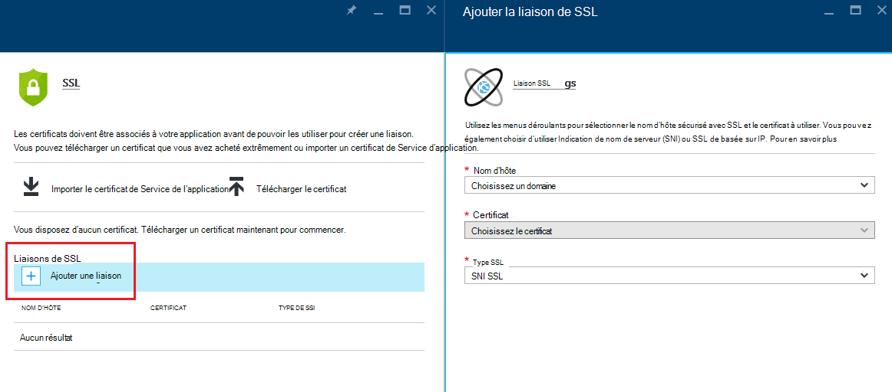
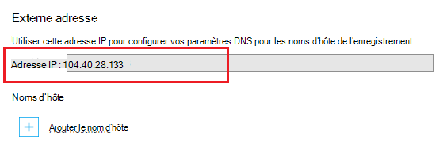
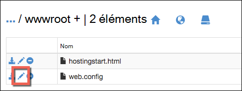

<properties
    pageTitle="Domaine personnalisé de votre application avec HTTPS sécurisé | Microsoft Azure"
    description="Découvrez comment sécuriser le nom de domaine personnalisé pour votre application dans le Service d’application Azure en configurant une liaison de certificat SSL. Vous apprendrez également comment obtenir un certificat SSL à partir de plusieurs outils."
    services="app-service"
    documentationCenter=".net"
    authors="cephalin"
    manager="wpickett"
    editor="jimbe"
    tags="top-support-issue"/>

<tags
    ms.service="app-service"
    ms.workload="na"
    ms.tgt_pltfrm="na"
    ms.devlang="na"
    ms.topic="article"
    ms.date="08/08/2016"
    ms.author="cephalin"/>

# Domaine personnalisé de votre application avec HTTPS sécurisé

> [AZURE.SELECTOR]
- [Acheter le certificat SSL dans Azure](web-sites-purchase-ssl-web-site.md)
- [Utiliser un certificat SSL à partir d’un autre emplacement](web-sites-configure-ssl-certificate.md)

Cet article vous explique comment activer HTTPS pour une application web, un back-end de l’application mobile ou une application API dans le [Service d’application Azure](../app-service/app-service-value-prop-what-is.md) qui utilise un nom de domaine personnalisé. Il traite l’authentification serveur uniquement. Si vous avez besoin de l’authentification mutuelle (y compris l’authentification du client), reportez-vous à la section [Comment à configurer TLS l’authentification mutuelle pour l’application de Service](app-service-web-configure-tls-mutual-auth.md).

Pour sécuriser, avec le protocole HTTPS, une application qui possède un nom de domaine personnalisé, vous ajoutez un certificat pour ce nom de domaine. Par défaut, Azure sécurise la ** \*. azurewebsites.net** domaine générique avec un seul certificat SSL, afin que vos clients peuvent déjà accéder à votre application à * *https://*&lt;appname >*. azurewebsites.net**. Mais si vous souhaitez utiliser un domaine personnalisé, tel que **les www.contoso.com contoso.com,**, ****, et ** \*. contoso.com**, le certificat par défaut ne peut pas sécuriser qui. En outre, comme tous les [certificats génériques](https://casecurity.org/2014/02/26/pros-and-cons-of-single-domain-multi-domain-and-wildcard-certificates/), le certificat par défaut n’est pas aussi sécurisé que l’utilisation d’un domaine personnalisé et un certificat pour ce domaine personnalisé.   

>[AZURE.NOTE] Vous pouvez obtenir de l’aide d’experts Azure à tout moment sur les [forums Azure](https://azure.microsoft.com/support/forums/). Pour un support plus personnalisé, accédez à [Azure prend en charge](https://azure.microsoft.com/support/options/) et cliquez sur **Obtenir la prise en charge**.

## Ce dont vous avez besoin
Pour sécuriser votre nom de domaine personnalisé avec le protocole HTTPS, vous liez un certificat SSL personnalisé à ce domaine personnalisé dans Azure. Avant de lier un certificat personnalisé, vous devez effectuer les opérations suivantes :

- **Configurer le domaine personnalisé** - App Service autorise uniquement l’ajout d’un certificat pour un nom de domaine qui est déjà configuré dans votre application. Pour obtenir des instructions, reportez-vous à [mapper un nom de domaine personnalisé pour une application Azure](web-sites-custom-domain-name.md). 
- **Évoluer au niveau de base ou supérieure** Plans de Service de l’application dans les niveaux de prix inférieurs ne prennent pas en charge les certificats SSL personnalisés. Pour obtenir des instructions, reportez-vous à la section [mise à l’échelle d’une application dans Azure](web-sites-scale.md). 
- **Obtenez un certificat SSL** - si vous n’en avez pas déjà un, vous devez en obtenir un auprès d’une confiance [autorité de certification](http://en.wikipedia.org/wiki/Certificate_authority) (CA). Le certificat doit répondre à toutes les exigences suivantes :

    - Il est signé par une autorité de certification approuvée (aucun serveur d’autorité de certification privée).
    - Il contient une clé privée.
    - Il est créé pour l’échange de clés et exporté vers un. Fichiers PFX.
    - Il utilise un minimum de cryptage 2048 bits.
    - Son nom de sujet correspond le domaine personnalisé dont il a besoin pour sécuriser. Pour sécuriser plusieurs domaines avec un certificat, vous devez utiliser un nom générique (par exemple, ** \*. contoso.com**) ou de spécifier des valeurs de subjectAltName.
    - Il est fusionné avec tous les **[certificats intermédiaires](http://en.wikipedia.org/wiki/Intermediate_certificate_authorities)** utilisés par votre autorité de certification. Dans le cas contraire, vous pouvez rencontrer des problèmes d’interopérabilité irreproducible sur certains clients.

        >[AZURE.NOTE] La façon la plus simple pour obtenir un certificat SSL qui répond à toutes les exigences est pour en         [acheter une dans le portail Azure directement](web-sites-purchase-ssl-web-site.md). Cet article vous montre comment effectuer cette opération manuellement et comment le lier à votre domaine personnalisé dans le Service d’application.
        >   
        > **Les certificats de cryptographie de courbe elliptique (ECC)** fonctionnent avec le Service de l’application, mais en dehors de la portée de cet article. Travailler avec votre autorité de certification sur les étapes exactes pour créer des certificats ECC.

## Étape 1. Obtenez un certificat SSL

Comme les autorités de certification fournissent les différents types de certificats SSL à différents prix, vous devez commencer par décider quel type de certificat SSL d’acheter. Pour sécuriser un seul nom de domaine (**www.contoso.com**), vous devez simplement un certificat de base. Pour sécuriser plusieurs noms de domaine (**contoso.com** *et* **www.contoso.com** 
*et* **mail.contoso.com**), vous avez besoin d’un [certificat générique](http://en.wikipedia.org/wiki/Wildcard_certificate) ou un certificat avec [l’Autre nom du sujet](http://en.wikipedia.org/wiki/SubjectAltName) (`subjectAltName`).

Une fois que vous savez quel certificat SSL d’acheter, vous envoyez une demande de certificat de signature (CSR) à une autorité de certification. Quand vous rentrerez certificat demandé à partir de l’autorité de certification, vous générez ensuite un fichier .pfx à partir du certificat. Vous pouvez effectuer ces étapes à l’aide de l’outil de votre choix. Voici des instructions pour les outils courants :

- [Certreq.exe étapes](#bkmk_certreq) - l’utilitaire Windows pour la création de demandes de certificats. Il fait partie de Windows depuis Windows XP, Windows Server 2000.
- [Étapes du Gestionnaire des services IIS](#bkmk_iismgr) - l’outil de choix si vous êtes déjà familiarisé avec elle.
- [Étapes d’OpenSSL](#bkmk_openssl) - un [outil open source, multiplates-formes](https://www.openssl.org). Utilisez-le pour vous aider à obtenir un certificat SSL à partir de n’importe quelle plate-forme.
- [étapes subjectAltName à l’aide d’OpenSSL](#bkmk_subjectaltname) - étapes pour obtenir `subjectAltName` les certificats.

Si vous souhaitez tester la configuration dans le Service d’application avant d’acheter un certificat, vous pouvez générer un [certificat auto-signé](https://en.wikipedia.org/wiki/Self-signed_certificate). Ce didacticiel vous offre deux manières de générer :

- [Certificat auto-signé, Certreq.exe étapes](#bkmk_sscertreq)
- [Certificat auto-signé, étapes de OpenSSL](#bkmk_ssopenssl)

### Obtenir un certificat en utilisant Certreq.exe

1. Créer un fichier (par exemple, **myrequest.txt**), copiez le texte suivant et enregistrez-le dans un répertoire de travail. Remplacer le `<your-domain>` espace réservé avec le nom de domaine personnalisé de votre application.

        [NewRequest]
        Subject = "CN=<your-domain>"  ; E.g. "CN=www.contoso.com", or "CN=*.contoso.com" for a wildcard certificate
        Exportable = TRUE
        KeyLength = 2048              ; Required minimum is 2048
        KeySpec = 1
        KeyUsage = 0xA0
        MachineKeySet = True
        ProviderName = "Microsoft RSA SChannel Cryptographic Provider"
        ProviderType = 12
        HashAlgorithm = SHA256

        [EnhancedKeyUsageExtension]
        OID=1.3.6.1.5.5.7.3.1         ; Server Authentication

    Pour plus d’informations sur les options de conseiller et d’autres options disponibles, consultez la [documentation de référence de Certreq](https://technet.microsoft.com/library/dn296456.aspx).

4. Dans une invite de commande, `CD` dans le répertoire de votre travail et exécutez la commande suivante pour créer le conseiller du service clientèle :

        certreq -new myrequest.txt myrequest.csr

    **myrequest.CSR** est désormais créé dans votre répertoire de travail actuel.

5. Envoyer **myrequest.csr** à une autorité de certification pour obtenir un certificat SSL. Vous téléchargez le fichier, soit copiez son contenu à partir d’un éditeur de texte dans un formulaire web.

    Pour une liste d’autorités de certification approuvées par Microsoft, consultez [programme de certificat racine de confiance de Microsoft : Participants][cas].

6. Une fois que l’autorité de certification vous a répondu avec un certificat (. Fichier de région d’exécution limitée), enregistrez-le dans votre répertoire de travail. Ensuite, exécutez la commande suivante pour exécuter le conseiller du service clientèle en attente.

        certreq -accept -user <certificate-name>.cer

    Cette commande stocke le certificat terminé dans le magasin de certificats Windows.

6. Si votre autorité de certification utilise les certificats intermédiaires, installez-les avant de continuer. Ils sont généralement fournis sous forme de téléchargement distinct à partir de votre autorité de certification et dans plusieurs formats pour les types de serveurs web différents. Sélectionnez la version de Microsoft IIS.

    Une fois que vous avez téléchargé les certificats, cliquez sur chacun d’eux dans l’Explorateur Windows et sélectionnez  **installer le certificat**. Utilisez les valeurs par défaut dans l' **Assistant Importation de certificat**et poursuivez le choix **suivant** jusqu'à ce que l’importation est terminée.

7. Pour exporter votre certificat SSL à partir du magasin de certificats, appuyez sur la touche `Win` + `R` et exécuter **certmgr.msc** pour lancer le Gestionnaire de certificats. Sélectionnez **personnel** > **les certificats**. Dans la colonne **Délivré à** , vous devriez voir une entrée avec le nom de votre domaine personnalisé et que vous avez utilisé pour générer le certificat dans la colonne **Délivré par** l’autorité de certification.

    ![Insérer image du Gestionnaire de certificat ici][certmgr]

9. Cliquez sur le certificat, puis sélectionnez **Toutes les tâches** > **Exporter**. Dans l' **Assistant Exportation de certificat**, cliquez sur **suivant**, puis sélectionnez **Oui, exporter la clé privée**, puis cliquez sur **suivant** à nouveau.

    ![Exporter la clé privée][certwiz1]

10. Sélectionnez **l’Échange d’informations personnelles - PKCS #12**, **inclure tous les certificats dans le chemin d’accès de certificat si possible**et **d’Exporter toutes les propriétés étendues**. Ensuite, cliquez sur **suivant**.

    ![inclure tous les certificats et les propriétés étendues][certwiz2]

11. Sélectionnez **mot de passe**, puis entrez et confirmez le mot de passe. Cliquez sur **suivant**.

    ![spécifier un mot de passe][certwiz3]

12. Fournir un chemin d’accès et le nom de fichier du certificat exporté, avec l' extension **.pfx**. Cliquez sur **suivant** pour terminer.

    ![fournir un chemin d’accès du fichier][certwiz4]

Vous êtes maintenant prêt à télécharger le fichier PFX exporté au Service de l’application. Reportez-vous à l’étape de [2. Télécharger et lier le certificat SSL personnalisé](#bkmk_configuressl).

### Obtenir un certificat en utilisant le Gestionnaire des services IIS

1. Générer une CSR avec le Gestionnaire des services IIS pour envoyer à l’autorité de certification. Pour plus d’informations sur la génération d’un conseiller du service clientèle, consultez [demande d’un certificat de serveur Internet (IIS 7)][iiscsr].

3. Soumettre votre conseiller du service clientèle à une autorité de certification pour obtenir un certificat SSL. Pour une liste d’autorités de certification approuvées par Microsoft, consultez [programme de certificat racine de confiance de Microsoft : Participants][cas].

3. Exécutez le conseiller du service clientèle avec le certificat de l’autorité de certification renvoie à vous. Pour plus d’informations sur le conseiller du service clientèle, consultez [installer un certificat de serveur Internet (IIS 7)][installcertiis].

4. Si votre autorité de certification utilise les certificats intermédiaires, installez-les avant de continuer. Ils sont généralement fournis sous forme de téléchargement distinct à partir de votre autorité de certification et dans plusieurs formats pour les types de serveurs web différents. Sélectionnez la version de Microsoft IIS.

    Une fois que vous avez téléchargé les certificats, cliquez sur chacun d’eux dans l’Explorateur Windows et sélectionnez **installer le certificat**. 
    Utilisez les valeurs par défaut dans l' **Assistant Importation de certificat**et poursuivez le choix **suivant** jusqu'à ce que l’importation est terminée.

4. Exporter le certificat SSL à partir de Gestionnaire des services IIS. Pour plus d’informations sur l’exportation de certificat, consultez [exportation d’un certificat de serveur (IIS 7)][exportcertiis]. 

    >[AZURE.IMPORTANT] Dans l' **Assistant Exportation de certificat**, assurez-vous que vous sélectionnez **Oui, exporter la clé privée**  
    >
    >![Exporter la clé privée][certwiz1]  
    >
    > et également sélectionner **l’Échange d’informations personnelles - PKCS #12**, **inclure tous les certificats dans le chemin d’accès de certificat si possible**et     **d’Exporter toutes les propriétés étendues**.
    >
    >![inclure tous les certificats et les propriétés étendues][certwiz2]

Vous êtes maintenant prêt à télécharger le fichier PFX exporté au Service de l’application. Reportez-vous à l’étape de [2. Télécharger et lier le certificat SSL personnalisé](#bkmk_configuressl).

### Obtenir un certificat à l’aide d’OpenSSL

1. Dans un terminal de ligne de commande, `CD` dans un répertoire de travail génère une clé privée et un conseiller du service clientèle en exécutant la commande suivante :

        openssl req -sha256 -new -nodes -keyout myserver.key -out server.csr -newkey rsa:2048

2. Lorsque vous y êtes invité, entrez les informations appropriées. Par exemple :

        Country Name (2 letter code)
        State or Province Name (full name) []: Washington
        Locality Name (eg, city) []: Redmond
        Organization Name (eg, company) []: Microsoft
        Organizational Unit Name (eg, section) []: Azure
        Common Name (eg, YOUR name) []: www.microsoft.com
        Email Address []:

        Please enter the following 'extra' attributes to be sent with your certificate request

        A challenge password []:

    Lorsque vous avez terminé, vous devez disposer de deux fichiers dans votre répertoire de travail : **myserver.key** et **server.csr**. 
    La **server.csr** contient le conseiller du service clientèle, et vous avez besoin de **myserver.key** ultérieurement.

3. Soumettre votre conseiller du service clientèle à une autorité de certification pour obtenir un certificat SSL. Pour une liste d’autorités de certification approuvées par Microsoft, consultez [programme de certificat racine de confiance de Microsoft : Participants][cas].

4. Une fois que l’autorité de certification vous envoie le certificat demandé, l’enregistrer dans un fichier nommé **myserver.crt** dans votre répertoire de travail. Si votre autorité de certification fournit au format texte, simplement copier le contenu dans les **myserver.crt** dans un éditeur de texte et l’enregistrer. Votre fichier doit se présenter comme suit :

        -----BEGIN CERTIFICATE-----
        MIIDJDCCAgwCCQCpCY4o1LBQuzANBgkqhkiG9w0BAQUFADBUMQswCQYDVQQGEwJV
        UzELMAkGA1UECBMCV0ExEDAOBgNVBAcTB1JlZG1vbmQxEDAOBgNVBAsTB0NvbnRv
        c28xFDASBgNVBAMTC2NvbnRvc28uY29tMB4XDTE0MDExNjE1MzIyM1oXDTE1MDEx
        NjE1MzIyM1owVDELMAkGA1UEBhMCVVMxCzAJBgNVBAgTAldBMRAwDgYDVQQHEwdS
        ZWRtb25kMRAwDgYDVQQLEwdDb250b3NvMRQwEgYDVQQDEwtjb250b3NvLmNvbTCC
        ASIwDQYJKoZIhvcNAQEBBQADggEPADCCAQoCggEBAN96hBX5EDgULtWkCRK7DMM3
        enae1LT9fXqGlbA7ScFvFivGvOLEqEPD//eLGsf15OYHFOQHK1hwgyfXa9sEDPMT
        3AsF3iWyF7FiEoR/qV6LdKjeQicJ2cXjGwf3G5vPoIaYifI5r0lhgOUqBxzaBDZ4
        xMgCh2yv7NavI17BHlWyQo90gS2X5glYGRhzY/fGp10BeUEgIs3Se0kQfBQOFUYb
        ktA6802lod5K0OxlQy4Oc8kfxTDf8AF2SPQ6BL7xxWrNl/Q2DuEEemjuMnLNxmeA
        Ik2+6Z6+WdvJoRxqHhleoL8ftOpWR20ToiZXCPo+fcmLod4ejsG5qjBlztVY4qsC
        AwEAATANBgkqhkiG9w0BAQUFAAOCAQEAVcM9AeeNFv2li69qBZLGDuK0NDHD3zhK
        Y0nDkqucgjE2QKUuvVSPodz8qwHnKoPwnSrTn8CRjW1gFq5qWEO50dGWgyLR8Wy1
        F69DYsEzodG+shv/G+vHJZg9QzutsJTB/Q8OoUCSnQS1PSPZP7RbvDV9b7Gx+gtg
        7kQ55j3A5vOrpI8N9CwdPuimtu6X8Ylw9ejWZsnyy0FMeOPpK3WTkDMxwwGxkU3Y
        lCRTzkv6vnHrlYQxyBLOSafCB1RWinN/slcWSLHADB6R+HeMiVKkFpooT+ghtii1
        A9PdUQIhK9bdaFicXPBYZ6AgNVuGtfwyuS5V6ucm7RE6+qf+QjXNFg==
        -----END CERTIFICATE-----

5. Dans le terminal de ligne de commande, exécutez la commande suivante pour exporter les **myserver.pfx** de **myserver.key** et de **myserver.crt**:

        openssl pkcs12 -export -out myserver.pfx -inkey myserver.key -in myserver.crt

    Lorsque vous y êtes invité, définissez un mot de passe pour sécuriser le fichier .pfx.

    > [AZURE.NOTE] Si votre autorité de certification utilise les certificats intermédiaires, vous devez les inclure avec la `-certfile` paramètre. Ils sont généralement fournis sous forme de téléchargement distinct à partir de votre autorité de certification et dans plusieurs formats pour les types de serveurs web différents. Sélectionnez la version avec le `.pem` extension.
    >
    > Votre `openssl -export` commande doit ressembler à l’exemple suivant, qui crée un fichier .pfx qui inclut les certificats intermédiaires à partir du fichier **intermédiaire-cets.pem** :
    >  
    > `openssl pkcs12 -chain -export -out myserver.pfx -inkey myserver.key -in myserver.crt -certfile intermediate-cets.pem`

Vous êtes maintenant prêt à télécharger le fichier PFX exporté au Service de l’application. Reportez-vous à l’étape de [2. Télécharger et lier le certificat SSL personnalisé](#bkmk_configuressl).

### Obtenir un certificat SubjectAltName à l’aide d’OpenSSL

1. Créez un fichier nommé **sancert.cnf**, copiez le texte suivant et enregistrez-le dans un répertoire de travail :

        # -------------- BEGIN custom sancert.cnf -----
        HOME = .
        oid_section = new_oids
        [ new_oids ]
        [ req ]
        default_days = 730
        distinguished_name = req_distinguished_name
        encrypt_key = no
        string_mask = nombstr
        req_extensions = v3_req # Extensions to add to certificate request
        [ req_distinguished_name ]
        countryName = Country Name (2 letter code)
        countryName_default =
        stateOrProvinceName = State or Province Name (full name)
        stateOrProvinceName_default =
        localityName = Locality Name (eg, city)
        localityName_default =
        organizationalUnitName  = Organizational Unit Name (eg, section)
        organizationalUnitName_default  =
        commonName              = Your common name (eg, domain name)
        commonName_default      = www.mydomain.com
        commonName_max = 64
        [ v3_req ]
        subjectAltName=DNS:ftp.mydomain.com,DNS:blog.mydomain.com,DNS:*.mydomain.com
        # -------------- END custom sancert.cnf -----

    Dans la ligne qui commence par `subjectAltName`, remplacez la valeur de tous les noms de domaine à sécuriser (en plus de  `commonName`). Par exemple :

        subjectAltName=DNS:sales.contoso.com,DNS:support.contoso.com,DNS:fabrikam.com

    Vous n’avez pas besoin de modifier un autre champ, y compris les `commonName`. Vous devrez les spécifier dans les étapes suivantes.

1. Dans un terminal de ligne de commande, `CD` dans le répertoire de votre travail et exécutez la commande suivante :

        openssl req -sha256 -new -nodes -keyout myserver.key -out server.csr -newkey rsa:2048 -config sancert.cnf

2. Lorsque vous y êtes invité, entrez les informations appropriées. Par exemple :

        Country Name (2 letter code) []: US
        State or Province Name (full name) []: Washington
        Locality Name (eg, city) []: Redmond
        Organizational Unit Name (eg, section) []: Azure
        Your common name (eg, domain name) []: www.microsoft.com

    Une fois terminé, vous devez disposer de deux fichiers dans votre répertoire de travail : **myserver.key** et **server.csr**. 
    La **server.csr** contient le conseiller du service clientèle, et vous avez besoin de **myserver.key** ultérieurement.

3. Soumettre votre conseiller du service clientèle à une autorité de certification pour obtenir un certificat SSL. Pour une liste d’autorités de certification approuvées par Microsoft, consultez [programme de certificat racine de confiance de Microsoft : Participants][cas].

4. Une fois que l’autorité de certification vous envoie le certificat demandé, l’enregistrer dans un fichier nommé **myserver.crt**. Si votre autorité de certification fournit au format texte, simplement copier le contenu dans les **myserver.crt** dans un éditeur de texte et l’enregistrer. Le fichier doit se présenter comme suit :

        -----BEGIN CERTIFICATE-----
        MIIDJDCCAgwCCQCpCY4o1LBQuzANBgkqhkiG9w0BAQUFADBUMQswCQYDVQQGEwJV
        UzELMAkGA1UECBMCV0ExEDAOBgNVBAcTB1JlZG1vbmQxEDAOBgNVBAsTB0NvbnRv
        c28xFDASBgNVBAMTC2NvbnRvc28uY29tMB4XDTE0MDExNjE1MzIyM1oXDTE1MDEx
        NjE1MzIyM1owVDELMAkGA1UEBhMCVVMxCzAJBgNVBAgTAldBMRAwDgYDVQQHEwdS
        ZWRtb25kMRAwDgYDVQQLEwdDb250b3NvMRQwEgYDVQQDEwtjb250b3NvLmNvbTCC
        ASIwDQYJKoZIhvcNAQEBBQADggEPADCCAQoCggEBAN96hBX5EDgULtWkCRK7DMM3
        enae1LT9fXqGlbA7ScFvFivGvOLEqEPD//eLGsf15OYHFOQHK1hwgyfXa9sEDPMT
        3AsF3iWyF7FiEoR/qV6LdKjeQicJ2cXjGwf3G5vPoIaYifI5r0lhgOUqBxzaBDZ4
        xMgCh2yv7NavI17BHlWyQo90gS2X5glYGRhzY/fGp10BeUEgIs3Se0kQfBQOFUYb
        ktA6802lod5K0OxlQy4Oc8kfxTDf8AF2SPQ6BL7xxWrNl/Q2DuEEemjuMnLNxmeA
        Ik2+6Z6+WdvJoRxqHhleoL8ftOpWR20ToiZXCPo+fcmLod4ejsG5qjBlztVY4qsC
        AwEAATANBgkqhkiG9w0BAQUFAAOCAQEAVcM9AeeNFv2li69qBZLGDuK0NDHD3zhK
        Y0nDkqucgjE2QKUuvVSPodz8qwHnKoPwnSrTn8CRjW1gFq5qWEO50dGWgyLR8Wy1
        F69DYsEzodG+shv/G+vHJZg9QzutsJTB/Q8OoUCSnQS1PSPZP7RbvDV9b7Gx+gtg
        7kQ55j3A5vOrpI8N9CwdPuimtu6X8Ylw9ejWZsnyy0FMeOPpK3WTkDMxwwGxkU3Y
        lCRTzkv6vnHrlYQxyBLOSafCB1RWinN/slcWSLHADB6R+HeMiVKkFpooT+ghtii1
        A9PdUQIhK9bdaFicXPBYZ6AgNVuGtfwyuS5V6ucm7RE6+qf+QjXNFg==
        -----END CERTIFICATE-----

5. Dans le terminal de ligne de commande, exécutez la commande suivante pour exporter les **myserver.pfx** de **myserver.key** et de **myserver.crt**:

        openssl pkcs12 -export -out myserver.pfx -inkey myserver.key -in myserver.crt

    Lorsque vous y êtes invité, définissez un mot de passe pour sécuriser le fichier .pfx.

    > [AZURE.NOTE] Si votre autorité de certification utilise les certificats intermédiaires, vous devez les inclure avec la `-certfile` paramètre. Ils sont généralement fournis sous forme de téléchargement distinct à partir de votre autorité de certification et dans plusieurs formats pour les types de serveurs web différents. Sélectionnez la version avec le `.pem` extension).
    >
    > Votre `openssl -export` commande doit ressembler à l’exemple suivant, qui crée un fichier .pfx qui inclut les certificats intermédiaires à partir du fichier **intermédiaire-cets.pem** :
    >  
    > `openssl pkcs12 -chain -export -out myserver.pfx -inkey myserver.key -in myserver.crt -certfile intermediate-cets.pem`

Vous êtes maintenant prêt à télécharger le fichier PFX exporté au Service de l’application. Reportez-vous à l’étape de [2. Télécharger et lier le certificat SSL personnalisé](#bkmk_configuressl).

### Générer un certificat auto-signé à l’aide de Certreq.exe ###

>[AZURE.IMPORTANT] Les certificats auto-signés sont uniquement à des fins de test. La plupart des navigateurs renvoyer des erreurs lorsque vous visitez un site Web qui est sécurisé par un certificat auto-signé. Certains navigateurs peuvent refuser même d’atteindre le site. 

1. Créez un fichier texte (par exemple, **mycert.txt**), copiez le texte suivant et enregistrez le fichier dans un répertoire de travail. Remplacer le `<your-domain>` espace réservé avec le nom de domaine personnalisé de votre application.

        [NewRequest]
        Subject = "CN=<your-domain>"  ; E.g. "CN=www.contoso.com", or "CN=*.contoso.com" for a wildcard certificate
        Exportable = TRUE
        KeyLength = 2048              ; KeyLength can be 2048, 4096, 8192, or 16384 (required minimum is 2048)
        KeySpec = 1
        KeyUsage = 0xA0
        MachineKeySet = True
        ProviderName = "Microsoft RSA SChannel Cryptographic Provider"
        ProviderType = 12
        HashAlgorithm = SHA256
        RequestType = Cert            ; Self-signed certificate
        ValidityPeriod = Years
        ValidityPeriodUnits = 1

        [EnhancedKeyUsageExtension]
        OID=1.3.6.1.5.5.7.3.1         ; Server Authentication

    Le paramètre important est `RequestType = Cert`, qui spécifie un certificat auto-signé. 
    Pour plus d’informations sur les options de conseiller et d’autres options disponibles, consultez la [documentation de référence de Certreq](https://technet.microsoft.com/library/dn296456.aspx).

4. À l’invite de commandes, `CD` à votre répertoire de travail et à exécuter la commande suivante :

        certreq -new mycert.txt mycert.crt
    
    Votre nouveau certificat auto-signé est désormais installé dans le magasin de certificats.

7. Pour exporter le certificat dans le magasin de certificats, appuyez sur la touche `Win` + `R` et exécuter **certmgr.msc** pour lancer le Gestionnaire de certificats. Sélectionnez **personnel** > **les certificats**. Dans la colonne **Délivré à** , vous devriez voir une entrée avec le nom de votre domaine personnalisé et que vous avez utilisé pour générer le certificat dans la colonne **Délivré par** l’autorité de certification.

    ![Insérer image du Gestionnaire de certificat ici][certmgr]

9. Cliquez sur le certificat, puis sélectionnez **Toutes les tâches** > **Exporter**. Dans l' **Assistant Exportation de certificat**, cliquez sur **suivant**, puis sélectionnez **Oui, exporter la clé privée**, puis cliquez sur **suivant** à nouveau.

    ![Exporter la clé privée][certwiz1]

10. Sélectionnez **l’Échange d’informations personnelles - PKCS #12**, **inclure tous les certificats dans le chemin d’accès de certificat si possible**et **d’Exporter toutes les propriétés étendues**. Ensuite, cliquez sur **suivant**.

    ![inclure tous les certificats et les propriétés étendues][certwiz2]

11. Sélectionnez **mot de passe**, puis entrez et confirmez le mot de passe. Cliquez sur **suivant**.

    ![spécifier un mot de passe][certwiz3]

12. Fournir un chemin d’accès et le nom de fichier du certificat exporté, avec l' extension **.pfx**. Cliquez sur **suivant** pour terminer.

    ![fournir un chemin d’accès du fichier][certwiz4]

Vous êtes maintenant prêt à télécharger le fichier PFX exporté au Service de l’application. Reportez-vous à l’étape de [2. Télécharger et lier le certificat SSL personnalisé](#bkmk_configuressl).

###Générer un certificat auto-signé à l’aide d’OpenSSL ###

>[AZURE.IMPORTANT] Les certificats auto-signés sont uniquement à des fins de test. La plupart des navigateurs renvoyer des erreurs lorsque vous visitez un site Web qui est sécurisé par un certificat auto-signé. Certains navigateurs peuvent refuser même d’atteindre le site. 

1. Créer un fichier texte nommé **serverauth.cnf**, puis copiez-y le contenu suivant et enregistrez-le dans un répertoire de travail :

        [ req ]
        default_bits           = 2048
        default_keyfile        = privkey.pem
        distinguished_name     = req_distinguished_name
        attributes             = req_attributes
        x509_extensions        = v3_ca

        [ req_distinguished_name ]
        countryName         = Country Name (2 letter code)
        countryName_min         = 2
        countryName_max         = 2
        stateOrProvinceName     = State or Province Name (full name)
        localityName            = Locality Name (eg, city)
        0.organizationName      = Organization Name (eg, company)
        organizationalUnitName      = Organizational Unit Name (eg, section)
        commonName          = Common Name (eg, your app's domain name)
        commonName_max          = 64
        emailAddress            = Email Address
        emailAddress_max        = 40

        [ req_attributes ]
        challengePassword       = A challenge password
        challengePassword_min       = 4
        challengePassword_max       = 20

        [ v3_ca ]
         subjectKeyIdentifier=hash
         authorityKeyIdentifier=keyid:always,issuer:always
         basicConstraints = CA:false
         keyUsage=nonRepudiation, digitalSignature, keyEncipherment
         extendedKeyUsage = serverAuth

2. Dans un terminal de ligne de commande, `CD` dans le répertoire de votre travail et exécutez la commande suivante :

        openssl req -sha256 -x509 -nodes -days 365 -newkey rsa:2048 -keyout myserver.key -out myserver.crt -config serverauth.cnf

    Cette commande crée deux fichiers : **myserver.crt** (le certificat auto-signé) et **myserver.key** (clé privée), basé sur les paramètres dans **serverauth.cnf**.

3. Exportez le certificat vers un fichier .pfx en exécutant la commande suivante :

        openssl pkcs12 -export -out myserver.pfx -inkey myserver.key -in myserver.crt

    Lorsque vous y êtes invité, définissez un mot de passe pour sécuriser le fichier .pfx.

Vous êtes maintenant prêt à télécharger le fichier PFX exporté au Service de l’application. Reportez-vous à l’étape de [2. Télécharger et lier le certificat SSL personnalisé](#bkmk_configuressl).

## Étape 2. Télécharger et lier le certificat SSL personnalisé

Avant de poursuivre, consultez la section de [ce dont vous avez besoin](#bkmk_domainname) et vérifiez que :

- vous avez un domaine personnalisé qui correspond à votre application Azure,
- votre application est en cours d’exécution dans la couche de **base** ou une version ultérieure, et
- vous avez un certificat SSL pour le domaine personnalisé à partir d’une autorité de certification.

1. Dans votre navigateur, ouvrez le ** [Azure Portal.](https://portal.azure.com/)**
2.  Cliquez sur l’option de **Service de l’application** sur le côté gauche de la page.
3.  Cliquez sur le nom de votre application à laquelle vous souhaitez attribuer ce certificat. 
4.  Dans la zone **paramètres**, cliquez sur **certificats SSL**
5.  Cliquez sur **Télécharger le certificat**
6.  Sélectionnez le fichier .pfx que vous avez exporté à [l’étape 1](#bkmk_getcert) et spécifier le mot de passe que vous créez avant. Puis, cliquez sur **Télécharger** pour télécharger le certificat. Vous devez maintenant voir votre certificat téléchargé dans la lame de **certificat SSL** .
7. Dans les **liaisons ssl** de la section, cliquez sur **Ajouter des liaisons**
8. De la lame **d’Ajouter la liaison SSL** utilisez les menus déroulants pour sélectionner le nom de domaine pour sécuriser avec SSL et le certificat à utiliser. Vous pouvez également choisir d’utiliser **[Indication de nom de serveur (SNI)](http://en.wikipedia.org/wiki/Server_Name_Indication)** ou SSL de basée sur IP.

    

       •    IP based SSL associates a certificate with a domain name by mapping the dedicated public IP address of the server to the domain name. This requires each domain name (contoso.com, fabricam.com, etc.) associated with your service to have a dedicated IP address. This is the traditional          method of associating SSL certificates with a web server.
       •    SNI based SSL is an extension to SSL and **[Transport Layer Security](http://en.wikipedia.org/wiki/Transport_Layer_Security)** (TLS) that allows multiple domains to share the same IP address, with separate security certificates for each domain. Most modern browsers (including Internet Explorer, Chrome, Firefox and Opera) support SNI, however older browsers may not support SNI. For more information on SNI, see the **[Server Name Indication](http://en.wikipedia.org/wiki/Server_Name_Indication)** article on Wikipedia.
     
9. Cliquez sur **Ajouter la liaison** pour enregistrer les modifications et activer SSL.

## Étape 3. Modifier le mappage de nom de domaine (basée sur IP SSL uniquement)

Si vous utilisez uniquement des liaisons **SNI SSL** , ignorez cette section. Plusieurs liaisons **SNI SSL** peuvent travailler ensemble sur l’adresse IP partagée existante affectée à votre application. Toutefois, si vous créez une liaison **IP basée SSL** , Service d’application crée une adresse IP dédiée pour la liaison car l' **IP basée SSL** requiert un. Uniquement une adresse IP dédiée adresse peut être créée, ainsi seulement une liaison **IP basée SSL** peut-être être ajoutée.

En raison de cette adresse IP dédiée, vous devez configurer votre application plus si :

- Vous avez [utilisé un enregistrement A pour mapper votre domaine personnalisé](web-sites-custom-domain-name.md#a) pour votre application Azure et que vous venez d’ajouter une liaison **SSL de basée sur IP** . Dans ce scénario, vous devez remapper existant un enregistrement pour pointer vers l’adresse IP dédiée en suivant ces étapes :

    1. Après avoir configuré une adresse IP en fonction de liaison SSL, une adresse IP dédiée est affectée à votre application. Vous trouverez cette adresse IP dans la page **domaine de personnalisé** sous les paramètres de votre application, juste au-dessus de la section de **noms d’hôtes** . Il sera répertorié comme **Adresse IP externe**
    
        

    2. [Remapper l’enregistrement A de votre nom de domaine personnalisé pour cette nouvelle adresse IP](web-sites-custom-domain-name.md#a).

- Vous disposez déjà d’une ou plusieurs liaisons **SNI SSL** dans votre application, et que vous venez d’ajouter une liaison **SSL de basée sur IP** . Une fois que la liaison est terminée, votre * &lt;appname >*. azurewebsites.net de domaine nom pointe vers la nouvelle adresse IP. Par conséquent, n’importe quel existant [mappage CNAME du domaine personnalisé](web-sites-custom-domain-name.md#cname) à * &lt;appname >*. azurewebsites.net, y compris ceux qui la **SNI SSL** secure, reçoit également le trafic sur la nouvelle adresse, qui est créé pour la **SSL basée sur l’IP** uniquement. Dans ce scénario, vous devez envoyer le trafic **SSL de SNI** vers l’adresse IP partagée d’origine en procédant comme suit :

    1. Identifiez tous les [mappages CNAME de domaines personnalisés](web-sites-custom-domain-name.md#cname) pour votre application qui a une liaison **SNI SSL** .

    2. Remapper chaque enregistrement CNAME à **sni.** &lt;appname >. azurewebsites.net au lieu de &lt;appname >. azurewebsites.net.

## Étape 4. Test HTTPS pour votre domaine personnalisé

Tout ce qui reste à faire est maintenant pour vous assurer que HTTPS fonctionne pour votre domaine personnalisé. Dans différents navigateurs, accédez à `https://<your.custom.domain>` pour vérifier qu’elle répond à l’installation de votre application.

- Si votre application offre vous les erreurs de validation de certificat, vous utilisez probablement un certificat auto-signé.

- Si n’est pas le cas, vous pouvez avoir laissé des certificats intermédiaires lorsque vous exportez votre certificat .pfx. Revenir à [ce dont vous avez besoin](#bkmk_domainname) pour vérifier que votre conseiller du service clientèle répond à toutes les conditions requises par le Service de l’application.

## Mettre en œuvre HTTPS sur votre application

Si vous souhaitez toujours autoriser l’accès HTTP à votre application, ignorez cette étape. Service de App *pas* appliquer HTTPS, afin que les visiteurs peuvent toujours accéder à votre application à l’aide de HTTP. Si vous souhaitez mettre en œuvre HTTPS pour votre application, vous pouvez définir une règle de réécriture dans le `web.config` fichier de votre application. Chaque application de Service de l’application a ce fichier, quel que soit le cadre de la langue de votre application.

> [AZURE.NOTE] Il est spécifique à la langue la redirection des demandes. ASP.NET MVC peut utiliser le filtre [RequireHttps](http://msdn.microsoft.com/library/system.web.mvc.requirehttpsattribute.aspx) au lieu de la règle de réécriture de `web.config` (voir [déploiement d’une application ASP.NET MVC 5 sécurisée pour une application web](web-sites-dotnet-deploy-aspnet-mvc-app-membership-oauth-sql-database.md)).

Procédez comme suit :

1. Accédez à la console de débogage Kudu pour votre application. Son adresse est `https://<appname>.scm.azurewebsites.net/DebugConsole`.

2. Dans la console de débogage, CD à `D:\home\site\wwwroot`.

3. Ouvrir `web.config` en cliquant sur le bouton crayon.

    

    Si vous déployez votre application avec Visual Studio ou Git, Service de l’application génère automatiquement le texte approprié `web.config` pour votre application .NET, PHP, Node.js ou Python dans la racine de l’application. 
    Si `web.config` n’existe pas, exécutez `touch web.config` dans l’invite de commande sur le web pour le créer. Ou bien, vous pouvez créer dans votre projet local et redéployer votre code.

4. Si vous deviez créer un `web.config`, copiez le code suivant et enregistrez-le. Si vous avez ouvert un web.config existant, puis il vous suffit de copier l’intégralité de la `<rule>` de la balise dans votre `web.config`de `configuration/system.webServer/rewrite/rules` élément.

        <?xml version="1.0" encoding="UTF-8"?>
        <configuration>
          <system.webServer>
            <rewrite>
              <rules>
                <!-- BEGIN rule TAG FOR HTTPS REDIRECT -->
                <rule name="Force HTTPS" enabled="true">
                  <match url="(.*)" ignoreCase="false" />
                  <conditions>
                    <add input="{HTTPS}" pattern="off" />
                  </conditions>
                  <action type="Redirect" url="https://{HTTP_HOST}/{R:1}" appendQueryString="true" redirectType="Permanent" />
                </rule>
                <!-- END rule TAG FOR HTTPS REDIRECT -->
              </rules>
            </rewrite>
          </system.webServer>
        </configuration>

    Cette règle renvoie un HTTP 301 (redirection permanente) pour le protocole HTTPS à chaque fois que l’utilisateur demande une page à l’aide de HTTP. Il redirige de http://contoso.com vers https://contoso.com.

    >[AZURE.IMPORTANT] S’il existe déjà d’autres `<rule>` balises dans votre `web.config`, puis placer le texte copié `<rule>` balise avant l’autre `<rule>` balises.

4. Enregistrez le fichier dans la console de débogage Kudu. Il doit prendre effet immédiatement rediriger toutes les requêtes pour HTTPS.

Pour plus d’informations sur le module de réécriture d’URL IIS, consultez la documentation de la [Réécriture d’URL](http://www.iis.net/downloads/microsoft/url-rewrite) .

## Plus de ressources ##
- [Centre de confidentialité de Microsoft Azure](/support/trust-center/security/)
- [Options de configuration déverrouillées dans des Sites Web Azure](/blog/2014/01/28/more-to-explore-configuration-options-unlocked-in-windows-azure-web-sites/)
- [Activer l’enregistrement des Diagnostics](web-sites-enable-diagnostic-log.md)
- [Configurer des applications web dans le Service d’application Azure](web-sites-configure.md)
- [Portail de gestion Azure](https://manage.windowsazure.com)

>[AZURE.NOTE] Si vous souhaitez commencer avec le Service d’application Azure avant l’ouverture d’un compte Azure, accédez à [Essayer le Service application](http://go.microsoft.com/fwlink/?LinkId=523751), où vous pouvez créer une application de courte durée starter immédiatement dans le Service d’application. Aucune carte de crédit obligatoire ; aucun des engagements.

[customdomain]: web-sites-custom-domain-name.md
[iiscsr]: http://technet.microsoft.com/library/cc732906(WS.10).aspx
[cas]: http://social.technet.microsoft.com/wiki/contents/articles/31634.microsoft-trusted-root-certificate-program-participants-v-2016-april.aspx
[installcertiis]: http://technet.microsoft.com/library/cc771816(WS.10).aspx
[exportcertiis]: http://technet.microsoft.com/library/cc731386(WS.10).aspx
[openssl]: http://www.openssl.org/
[portal]: https://manage.windowsazure.com/
[tls]: http://en.wikipedia.org/wiki/Transport_Layer_Security
[staticip]: ./media/web-sites-configure-ssl-certificate/staticip.png
[website]: ./media/web-sites-configure-ssl-certificate/sslwebsite.png
[scale]: ./media/web-sites-configure-ssl-certificate/sslscale.png
[standard]: ./media/web-sites-configure-ssl-certificate/sslreserved.png
[pricing]: /pricing/details/
[configure]: ./media/web-sites-configure-ssl-certificate/sslconfig.png
[uploadcert]: ./media/web-sites-configure-ssl-certificate/ssluploadcert.png
[uploadcertdlg]: ./media/web-sites-configure-ssl-certificate/ssluploaddlg.png
[sslbindings]: ./media/web-sites-configure-ssl-certificate/sslbindings.png
[sni]: http://en.wikipedia.org/wiki/Server_Name_Indication
[certmgr]: ./media/web-sites-configure-ssl-certificate/waws-certmgr.png
[certwiz1]: ./media/web-sites-configure-ssl-certificate/waws-certwiz1.png
[certwiz2]: ./media/web-sites-configure-ssl-certificate/waws-certwiz2.png
[certwiz3]: ./media/web-sites-configure-ssl-certificate/waws-certwiz3.png
[certwiz4]: ./media/web-sites-configure-ssl-certificate/waws-certwiz4.png

