<properties
    pageTitle="Connecter une application web dans le Service d’application Azure pour Redis le Cache via le protocole Memcache | Microsoft Azure"
    description="Connecter une application web dans le service d’application d’Azure au Cache Redis en utilisant le protocole Memcache"
    services="app-service\web"
    documentationCenter="php"
    authors="SyntaxC4"
    manager="wpickett"
    editor="riande"/>

<tags
    ms.service="app-service-web"
    ms.devlang="php"
    ms.topic="get-started-article"
    ms.tgt_pltfrm="windows"
    ms.workload="na"
    ms.date="02/29/2016"
    ms.author="cfowler"/>

# <a name="connect-a-web-app-in-azure-app-service-to-redis-cache-via-the-memcache-protocol"></a>Connecter une application web dans le Service d’application Azure pour Redis le Cache via le protocole Memcache

Dans cet article, vous apprendrez comment connecter une application web de WordPress dans le [Service d’application Azure](http://go.microsoft.com/fwlink/?LinkId=529714) au [Cache de Azure Redis] [ 12] à l’aide de la [Memcache] [ 13] protocole. Si vous disposez d’une application web existante qui utilise un serveur Memcached pour la mise en cache en mémoire, vous pouvez migrer vers le Service d’application Azure et utiliser la solution de mise en cache du premier tiers dans Microsoft Azure avec peu ou aucune modification à votre code d’application. En outre, vous pouvez utiliser votre Memcache existant expertise pour créer très évolutives, distributed applications dans le Service d’application Azure avec Cache de Redis Azure pour la mise en cache en mémoire, lors de l’utilisation des infrastructures d’application populaires tels que .NET, PHP, Node.js, Java et Python.  

Application Service Web Apps permet ce scénario d’application avec le shim Memcache d’applications Web, qui est un serveur local Memcached qui agit comme un proxy memcache, être mise en cache des appels au Cache de Redis d’Azure. Cela permet à n’importe quelle application qui communique à l’aide du protocole Memcache en cache des données avec Redis de Cache. Ce correctif Memcache fonctionne au niveau du protocole, afin qu’il puisse être utilisé par une application ou une infrastructure d’application tant qu’il communique à l’aide du protocole Memcache.

[AZURE.INCLUDE [app-service-web-to-api-and-mobile](../../includes/app-service-web-to-api-and-mobile.md)] 

## <a name="prerequisites"></a>Conditions préalables

Le shim Memcache d’applications Web peut être utilisé avec n’importe quelle application pour autant qu’il communique à l’aide du protocole Memcache. Pour cet exemple, l’application de référence est un site WordPress évolutive qui peut être mis en service à partir de Azure Marketplace.

Suivez les étapes décrites dans ces articles :

* [Configurer une instance du Service Azure Redis du Cache][0]
* [Déployer un site WordPress évolutive dans Azure][1]

Une fois que le site WordPress évolutifs déployés et une instance de Redis le Cache mis en service, vous serez prêt à procéder à l’activation du shim Memcache dans Azure Application Service Web Apps.

## <a name="enable-the-web-apps-memcache-shim"></a>Activer le shim Memcache d’applications Web

Pour configurer les shim Memcache, vous devez créer trois paramètres de l’application. Cela peut être effectué à l’aide de différentes méthodes, y compris le [Portail Azure](http://go.microsoft.com/fwlink/?LinkId=529715), le [portail classique][3], les [Applets de commande PowerShell Azure] [ 5] ou de l' [Interface de ligne de commande de Azure][5]. Pour les besoins de cet article, je vais utiliser le [Portail Azure] [ 4] pour définir les paramètres d’application. Les valeurs suivantes peuvent être extraites de la lame de **paramètres** de votre instance de Cache de Redis.

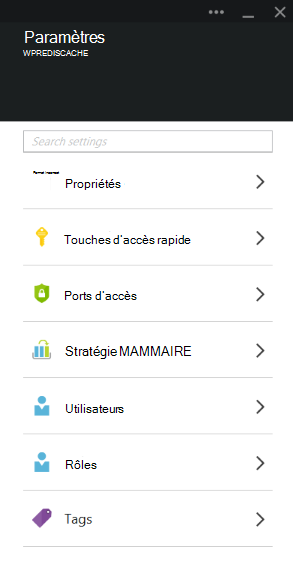

### <a name="add-redishost-app-setting"></a>Ajouter un paramètre d’application REDIS_HOST

Le premier paramètre d’application que vous créez est la **REDIS\_hôte** paramètre d’application. Ce paramètre définit la destination à laquelle le shim transmet des informations du cache. La valeur requise pour le paramètre d’application REDIS_HOST peut être extraites de la lame de **Propriétés** de votre instance de Cache de Redis.

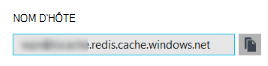

Définir la clé du paramètre à app **REDIS\_hôte** et la valeur du paramètre d’application pour le **nom d’hôte** de l’instance de Cache de Redis.

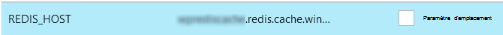

### <a name="add-rediskey-app-setting"></a>Ajouter un paramètre d’application REDIS_KEY

Le deuxième paramètre d’application que vous devez créer est la **REDIS\_clé** paramètre d’application. Ce paramètre fournit que le jeton d’authentification requises pour accéder en toute sécurité à l’instance de Cache de Redis. Vous pouvez récupérer la valeur requise pour le paramètre d’application REDIS_KEY de la lame de **touches d’accès rapide** de l’instance de Cache de Redis.

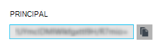

Définir la clé du paramètre à app **REDIS\_clé** et la valeur du paramètre d’application à la **Clé primaire** de l’instance de Cache de Redis.

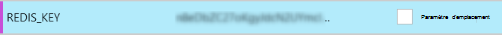

### <a name="add-memcacheshimredisenable-app-setting"></a>Ajouter un paramètre d’application MEMCACHESHIM_REDIS_ENABLE

Le dernier paramètre de l’application est utilisé pour activer le correctif Memcache dans des applications Web, qui utilise le REDIS_HOST et le REDIS_KEY pour se connecter au Cache Redis Azure et de transférer le cache appels. Définissez la clé du paramètre d’application à **MEMCACHESHIM\_REDIS\_activer** et la valeur **true**.


Une fois que vous avez terminé d’ajouter les paramètres d’application de trois (3), cliquez sur **Enregistrer**.

## <a name="enable-memcache-extension-for-php"></a>Activer l’extension de Memcache pour PHP

Dans l’ordre d’application parler du protocole Memcache, il est nécessaire d’installer l’extension Memcache PHP--le framework de langue pour votre site WordPress.

### <a name="download-the-phpmemcache-extension"></a>Téléchargez l’Extension de la php_memcache

Accédez à [PECL][6]. Sous la catégorie de mise en cache, cliquez sur [memcache][7]. Dans la colonne de téléchargement, cliquez sur le lien de la DLL.


Télécharger le lien Non Thread-Safe (NTS) x86 pour la version de PHP activé dans les applications Web. (Valeur par défaut est PHP 5.4)

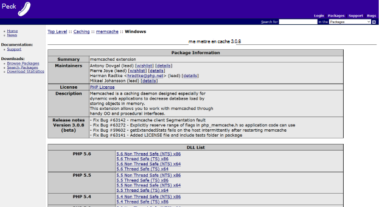

### <a name="enable-the-phpmemcache-extension"></a>Activer l’extension php_memcache

Après avoir téléchargé le fichier, décompressez et télécharger le **php\_memcache.dll** dans les **d:\\domestique\\site\\wwwroot\\emplacement\\ext\\ ** répertoire. Une fois la php_memcache.dll est chargé dans l’application web, vous devez activer l’extension à l’exécution de PHP. Pour activer l’extension Memcache dans Azure Portal, ouvrez la lame de **Paramètres d’Application** pour l’application web, puis ajouter un nouveau paramètre d’application avec la clé de **PHP\_EXTENSIONS** et la valeur **emplacement\\ext\\php_memcache.dll**.


> [AZURE.NOTE] Si l’application web doit charger plusieurs extensions PHP, la valeur de PHP_EXTENSIONS doit être une liste séparée par des virgules des chemins d’accès relatifs vers des fichiers DLL.


Une fois que vous avez terminé, cliquez sur **Enregistrer**.

## <a name="install-memcache-wordpress-plugin"></a>Installer le plug-in de Memcache WordPress

> [AZURE.NOTE] Vous pouvez également télécharger le [Plug-in de Memcached objet Cache](https://wordpress.org/plugins/memcached/) à partir de WordPress.org.

Sur la page de plug-ins WordPress, cliquez sur **Ajouter**.


Dans la zone Rechercher, tapez **memcached** et appuyez sur **entrée**.

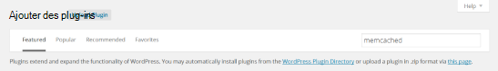

Rechercher un **Cache d’objets Memcached** dans la liste, puis cliquez sur **Installer maintenant**.

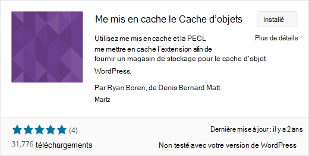

### <a name="enable-the-memcache-wordpress-plugin"></a>Activer le plug-in Memcache WordPress

>[AZURE.NOTE] Suivez les instructions de ce blog sur [l’activation d’une Extension de Site dans les applications Web] [ 8] pour installer Visual Studio Team Services.

Dans le `wp-config.php` , ajoutez le code suivant au-dessus du taquet de modification des commentaires à la fin du fichier.

```php
$memcached_servers = array(
    'default' => array('localhost:' . getenv("MEMCACHESHIM_PORT"))
);
```

Une fois ce code a été collé, monaco va automatiquement enregistrer le document.

L’étape suivante consiste à activer le plug-in cache d’objets. Cela est fait en faisant glisser **l’objet-cache.php** **wp-contenu/plugins/memcached** dossier dans le dossier de **contenu-wp** pour activer la fonctionnalité de Cache d’objet Memcache.

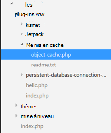

Maintenant que le fichier **cache.php de l’objet** se trouve dans le dossier de **contenu-wp** , le Cache de l’objet Memcached est maintenant activé.

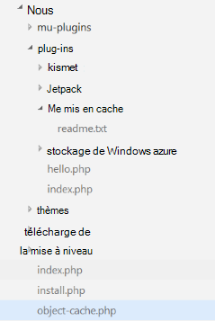

## <a name="verify-the-memcache-object-cache-plugin-is-functioning"></a>Vérifier que le plug-in de Cache d’objet Memcache fonctionne

Toutes les étapes pour activer le correctif Memcache d’applications Web sont maintenant terminées. Le reste est de vérifier que les données sont remplissage de votre instance de Cache de Redis.

### <a name="enable-the-non-ssl-port-support-in-azure-redis-cache"></a>Activer la prise en charge du port non-SSL dans le Cache de Redis Azure

>[AZURE.NOTE] Au moment de la rédaction de cet article, la CLI Redis ne supporte pas la connectivité SSL, par conséquent, les étapes suivantes sont nécessaires.

Dans le portail d’Azure, accédez à l’instance de Cache de Redis que vous avez créé pour cette application web. Une fois les lames du cache sont ouvert, cliquez sur l’icône **paramètres** .

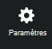

Sélectionnez les **Ports d’accès** dans la liste.


Pour **Autoriser l’accès uniquement via SSL**, cliquez sur **non** .

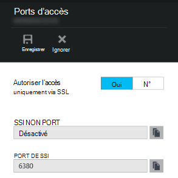

Vous verrez que la NON-SSL port est maintenant défini. Cliquez sur **Enregistrer**.

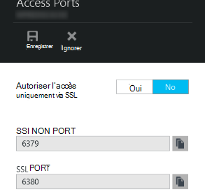

### <a name="connect-to-azure-redis-cache-from-redis-cli"></a>Se connecter au Cache de Azure Redis redis-CLI

>[AZURE.NOTE] Cette étape suppose que redis est installé localement sur votre ordinateur de développement. [Installer localement à l’aide de ces instructions de Redis][9].

Ouvrez la console de ligne de commande de choix et tapez la commande suivante :

```shell
redis-cli –h <hostname-for-redis-cache> –a <primary-key-for-redis-cache> –p 6379
```

Remplacer la ** &lt;nom d’hôte de cache redis&gt; ** avec le nom d’hôte réel xxxxx.redis.cache.windows.net et le ** &lt;principal--pour-redis-cache de clés&gt; ** avec la touche d’accès rapide pour le cache, puis appuyez sur **entrée**. Une fois que l’infrastructure CLI est connecté à l’instance de Cache de Redis, émettre une commande redis. Dans la capture d’écran ci-dessous, j’ai choisi répertorier les clés.

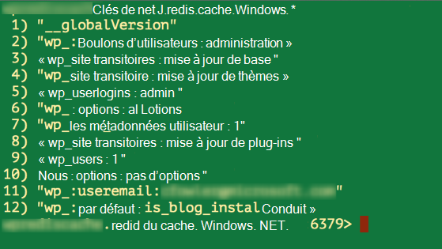

L’appel pour répertorier les clés doit retourner une valeur. Si non, essayez de naviguer vers l’application web et essayez à nouveau.

## <a name="conclusion"></a>Conclusion

Félicitations ! L’application WordPress a maintenant un cache en mémoire centralisé pour vous aider à augmenter le débit. N’oubliez pas que le Shim de Memcache d’applications Web peuvent être utilisé avec n’importe quel client Memcache, quel que soit le langage de programmation ou d’infrastructure de l’application. Pour fournir des commentaires ou à poser des questions sur le shim Memcache d’applications Web, publication sur [Les Forums MSDN] [ 10] ou [Stackoverflow][11].

>[AZURE.NOTE] Si vous souhaitez commencer avec le Service d’application Azure avant l’ouverture d’un compte Azure, accédez à [Essayer le Service application](http://go.microsoft.com/fwlink/?LinkId=523751), où vous pouvez créer une application web de courte durée starter immédiatement dans le Service d’application. Aucune carte de crédit obligatoire ; aucun des engagements.

## <a name="whats-changed"></a>Ce qui a changé
* Pour obtenir un guide pour la modification de sites Web au Service de l’application voir : [Service d’application Azure et son impact sur les Services Azure existants](http://go.microsoft.com/fwlink/?LinkId=529714)


[0]: ../redis-cache/cache-dotnet-how-to-use-azure-redis-cache.md#create-a-cache
[1]: http://bit.ly/1t0KxBQ
[2]: http://manage.windowsazure.com
[3]: http://portal.azure.com
[4]: ../powershell-install-configure.md
[5]: /downloads
[6]: http://pecl.php.net
[7]: http://pecl.php.net/package/memcache
[8]: http://blog.syntaxc4.net/post/2015/02/05/how-to-enable-a-site-extension-in-azure-websites.aspx
[9]: http://redis.io/download#installation
[10]: https://social.msdn.microsoft.com/Forums/home?forum=windowsazurewebsitespreview
[11]: http://stackoverflow.com/questions/tagged/azure-web-sites
[12]: /services/cache/
[13]: http://memcached.org
