<properties
   pageTitle="Créer une application web de ASP.NET 5 dans le Code de Visual Studio"
   description="Ce didacticiel illustre comment créer une application web de ASP.NET 5 à l’aide de Code de Visual Studio."
   services="app-service\web"
   documentationCenter=".net"
   authors="erikre"
   manager="wpickett"
   editor="jimbe"/>

<tags
    ms.service="app-service-web" 
    ms.workload="web" 
    ms.tgt_pltfrm="dotnet" 
    ms.devlang="na" 
    ms.topic="article" 
    ms.date="02/26/2016" 
    ms.author="cephalin"/>

# Créer une application web de ASP.NET 5 dans le Code de Visual Studio

## Vue d’ensemble

Ce didacticiel vous montre comment créer une application web de ASP.NET 5 à l’aide de [Code de Visual Studio (VS Code)](http://code.visualstudio.com//Docs/whyvscode) et le déployer sur le [Service d’application Azure](../app-service/app-service-value-prop-what-is.md). 

> [AZURE.NOTE] Bien que cet article fasse référence à des applications web, il s’applique également aux applications d’API et d’applications mobiles. 

ASP.NET 5 est une restructuration importante de ASP.NET. ASP.NET 5 est une nouvelle infrastructure open source et multiplates-formes pour la création d’applications web modernes de nuage à l’aide de .NET. Pour plus d’informations, consultez [Introduction à ASP.NET 5](http://docs.asp.net/en/latest/conceptual-overview/aspnet.html). Pour plus d’informations sur les applications Azure Application Service web, consultez [Vue d’ensemble des applications Web](app-service-web-overview.md).

[AZURE.INCLUDE [app-service-web-try-app-service.md](../../includes/app-service-web-try-app-service.md)]

## Conditions préalables  

* Installer [un Code VS](http://code.visualstudio.com/Docs/setup).
* D’installer [Node.js](http://nodejs.org) - groupes de Node.js est une plate-forme pour la création d’applications de serveur rapide et évolutive à l’aide de JavaScript. Nœud est le runtime (nœud) et [npm](http://www.npmjs.com/) est le Gestionnaire de package pour les modules de nœud. Vous allez utiliser npm à scaffold une application web de 5 de ASP.NET dans ce didacticiel.
* Installer Git - vous pouvez l’installer à partir d’un de ces emplacements : [Chocolatey](https://chocolatey.org/packages/git) ou [git-scm.com](http://git-scm.com/downloads). Si vous ne connaissez pas le Git, choisissez [git-scm.com](http://git-scm.com/downloads) et sélectionnez l’option à **Utiliser Git à partir de l’invite de commande Windows**. Une fois que vous installez Git, vous devez également définir le nom d’utilisateur Git et de la messagerie électronique comme exigé plus loin dans le didacticiel (lors de l’exécution d’une validation à partir du Code VS).  

## Installez ASP.NET 5 et DNX
ASP.NET 5/DNX (l’environnement d’exécution .NET) est une pile de .NET de production au plus juste pour la création de cloud moderne et les applications web qui s’exécutent sur OS X, Linux et Windows. Il a été construit à partir du sol à fournir une infrastructure de développement optimisé pour les applications qui sont déployées dans le nuage ou exécuter sur site. Il est constitué de composants modulaires avec impact minimal, afin de conserver une flexibilité lors de la construction de vos solutions.

Ce didacticiel est conçu pour vous aider à créer des applications avec les dernières versions de développement d’ASP.NET 5 et DNX. Suivez les instructions ci-dessous sont spécifiques à Windows. Pour des instructions plus détaillées de l’installation sur OS X, Linux et Windows, reportez-vous à la section [installation de 5 de ASP.NET et DNX](https://code.visualstudio.com/Docs/ASPnet5#_installing-aspnet-5-and-dnx). 

1. Pour installer le Gestionnaire de Version .NET (DNVM) dans Windows, ouvrez une invite de commande et exécutez la commande suivante.

        @powershell -NoProfile -ExecutionPolicy unrestricted -Command "&{$Branch='dev';iex ((new-object net.webclient).DownloadString('https://raw.githubusercontent.com/aspnet/Home/dev/dnvminstall.ps1'))}"

    Cela télécharger le script DNVM et placez-le dans votre répertoire de profil utilisateur. 

2. **Redémarrer Windows** pour terminer l’installation de DNVM. 

    Après le redémarrage de Windows, vous pouvez ouvrir l’invite de commandes pour vérifier l’emplacement de DNVM en entrant le texte suivant :

        where dnvm

    L’invite de commandes affiche un chemin d’accès semblable au suivant.

    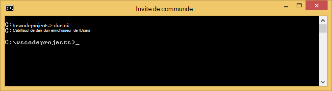

3. Maintenant que vous avez DNVM, vous devez l’utiliser pour télécharger DNX pour exécuter vos applications. À l’invite de commande, exécutez la procédure suivante :

        dnvm upgrade

    Vérifiez votre DNVM et d’afficher le runtime actif en entrant la commande suivante à l’invite de commande :

        dnvm list

    L’invite de commandes affiche les détails du runtime actif.

    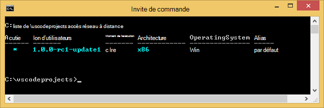

    Si plus d’un runtime DNX est répertorié, vous pouvez choisir d’entrer le texte suivant (ou une version plus récente) à l’invite de commande pour définir le runtime DNX actif. Définir la même version que celle qui est utilisée par le Générateur de 5 de ASP.NET lorsque vous créez votre application web plus loin dans ce didacticiel. *Non, vous devrez modifier le runtime actif si elle est définie sur la dernière version disponible.*

        dnvm use 1.0.0-update1 –p

> [AZURE.NOTE] Pour des instructions plus détaillées de l’installation sur OS X, Linux et Windows, reportez-vous à la section [installation de 5 de ASP.NET et DNX](https://code.visualstudio.com/Docs/ASPnet5#_installing-aspnet-5-and-dnx). 

## Créer l’application web 

Cette section vous indique comment scaffold une nouvelle application web ASP.NET app. Vous allez utiliser le Gestionnaire de package de nœud (npm) pour installer des [Yeoman](http://yeoman.io/) (outil de génération de modèles automatique d’application - équivalent VS Code le Visual Studio **fichier > Nouveau projet** opération), [Grunt](http://gruntjs.com/) (runner de tâche JavaScript) et [Bower](http://bower.io/) (Gestionnaire de package de côté client). 

1. Ouvrez une invite de commandes disposant de droits d’administrateur et accédez à l’emplacement où vous voulez créer votre projet ASP.NET. Par exemple, créez un répertoire de *vscodeprojects* à la racine du lecteur C:\.

2. Entrez la commande suivante à l’invite de commandes pour installer les outils de support et de Yeoman.

        npm install -g yo grunt-cli generator-aspnet bower

    > [AZURE.NOTE] Vous pouvez obtenir un avertissement suggérant que votre version de npm est obsolète. Cet avertissement ne doit pas affecter ce didacticiel.

3. Entrez la commande suivante à l’invite de commande pour créer le dossier de projet et scaffold de l’application.

        yo aspnet

4. Utilisez les touches de direction pour sélectionner le type de **Base de Web Application** dans le menu de générateur de ASP.NET 5 et appuyez sur la touche ** &lt;entrée >**.

    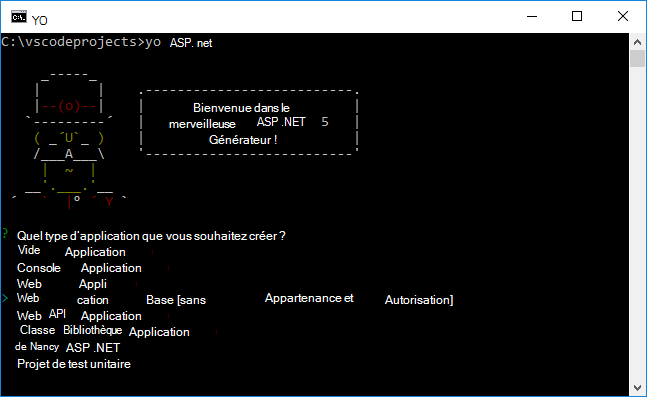

5. Définir le nom de votre nouvelle application web ASP.NET à **SampleWebApp**. Comme ce nom est utilisé tout au long de ce didacticiel, si vous sélectionnez un autre nom, vous devrez remplacer chaque occurrence de **SampleWebApp**. Lorsque vous appuyez sur la touche ** &lt;entrée >**, Yeoman va créer un nouveau dossier nommé **SampleWebApp** et les fichiers nécessaires à votre nouvelle application.

6. À l’invite de commandes, accédez au nouveau dossier de votre projet :

        cd SampleWebApp

7. Également à l’invite de commandes, pour installer les packages NuGet nécessaires pour exécuter l’application, entrez la commande suivante :

        dnu restore

8. Ouvrir le Code de VS en entrant la commande suivante à l’invite de commande :

        code .

## Exécuter l’application web localement

Maintenant que vous avez créé l’application web et récupéré tous les packages NuGet pour l’application, vous pouvez exécuter l’application web localement.

1. Dans la **Palette de commande** VS Code, entrez la commande suivante pour afficher les options de la commande d’exécution disponibles :

        dnx: Run Command

    > [AZURE.NOTE] Si le serveur de Omnisharp n’est pas en cours d’exécution, il démarrera. Entrez à nouveau la commande ci-dessus.

    Sélectionnez ensuite la commande suivante pour exécuter votre application web :
        
        dnx web - (SampleWebApp)

    Affiche la fenêtre de commande que l’application a démarré. Si la fenêtre commande n’affiche pas ce message, vérifiez l’inférieur gauche corning de VS Code les erreurs dans votre projet.
    
    > [AZURE.NOTE]Émission d’une commande à partir de la **Palette de commande** requiert un **>** caractères au début de la ligne de commande. Vous pouvez afficher les informations associées à la commande **web** dans le fichier *project.json* .   
    > Si la commande ne s’affiche pas ou n’est pas disponible, vous devrez peut-être installer l’extension de C#. Exécutez `>Extensions: Install Extension` et `ext install c#` pour installer les extensions C#.

2. Ouvrez un navigateur et accédez à l’URL suivante.

    **http://localhost:5000**

    La page par défaut de l’application web apparaîtra comme suit.

    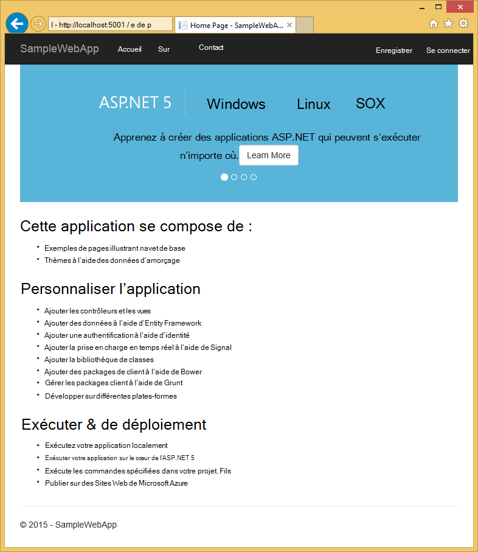

3. Fermez votre navigateur. Dans la **Fenêtre de commande**, appuyez sur **Ctrl + C** pour arrêter l’application et fermez la **Fenêtre de commande**. 

## Créer une application web dans le portail Azure

La procédure suivante vous guide dans la création d’une application web dans le portail Azure.

1. Connectez-vous au [portail Azure](https://portal.azure.com).

2. Cliquez sur **Nouveau** dans la partie supérieure gauche du portail.

3. Cliquez sur **Web Apps > Web App**.

    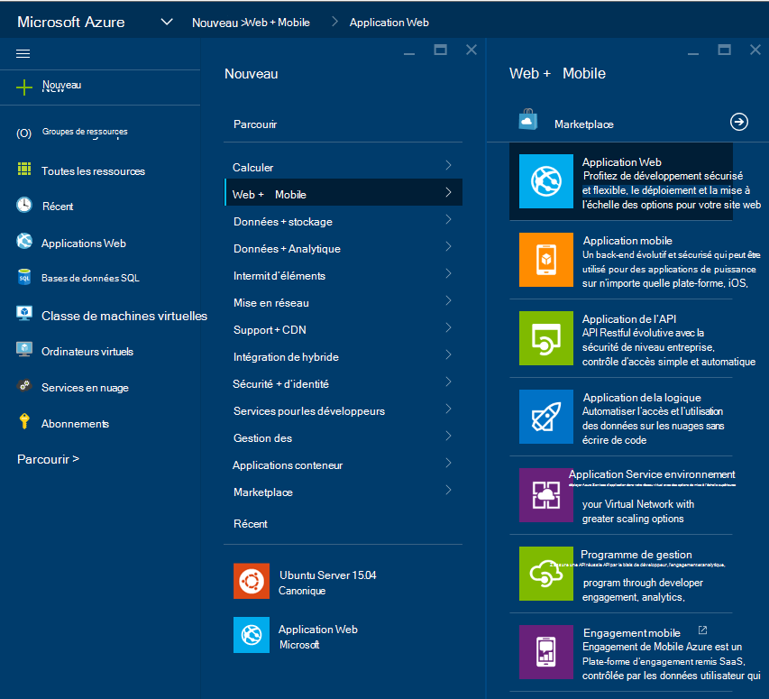

4. Entrez une valeur pour le **nom**, comme **SampleWebAppDemo**. Notez que ce nom doit être unique et que le portail impose que lorsque vous essayez d’entrer le nom. Par conséquent, si vous sélectionnez une entrée, une valeur différente, vous devez remplacer cette valeur pour chaque occurrence de **SampleWebAppDemo** que vous voyez dans ce didacticiel. 

5. Sélectionnez un **Plan de Service d’application** le existant ou créer un nouveau. Si vous créez un plan, sélectionnez le niveau de tarification, d’emplacement et d’autres options. Pour plus d’informations sur les plans de Service d’application, consultez l’article de [présentation approfondie des plans de Service d’application Azure](../app-service/azure-web-sites-web-hosting-plans-in-depth-overview.md).

    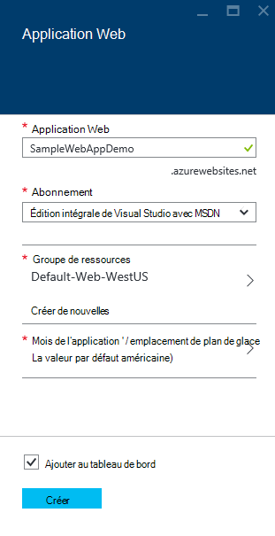

6. Cliquez sur **créer**.

    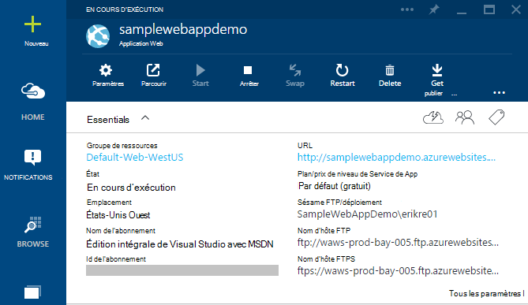

## Activer la publication Git pour la nouvelle application web

GIT est un système de contrôle de version distribuée que vous pouvez utiliser pour déployer votre application web de Service d’application Azure. Vous allez stocker le code que vous écrivez pour votre application web dans un référentiel Git local, et vous allez déployer votre code sur Azure en poussant vers un référentiel distant.   

1. Journal du [portail Azure](https://portal.azure.com).

2. Cliquez sur **Parcourir**.

3. Cliquez sur **Les applications Web** pour afficher la liste des applications web associées à votre abonnement Azure.

4. Sélectionnez l’application web que vous avez créé dans ce didacticiel.

5. Dans la blade d’application web, cliquez sur **paramètres** > **déploiement continue**. 

    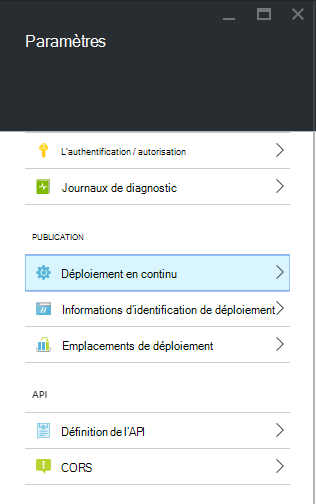

6. Cliquez sur **Choisir Source > référentiel de Git Local**.

7. Cliquez sur **OK**.

    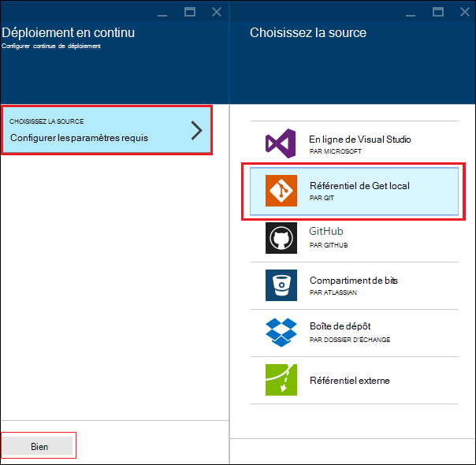

8. Si vous n’avez pas déjà défini les informations d’identification de déploiement pour la publication d’une application web ou autres applications de Service d’application, les définir maintenant :

    * Cliquez sur **paramètres** > **les informations d’identification de déploiement**. La lame de **définir les informations d’identification de déploiement** s’affiche.

    * Créer un nom d’utilisateur et le mot de passe.  Vous devez ce mot de passe ultérieurement lors du paramétrage de Git.

    * Cliquez sur **Enregistrer**.

9. Dans les lames de votre application web, cliquez sur **les paramètres > Propriétés**. L’URL du référentiel Git à distance que vous allez déployer sur est indiqué sous **GIT URL**.

10. Copiez la valeur de **l’URL de GIT** pour une utilisation ultérieure dans le didacticiel.

    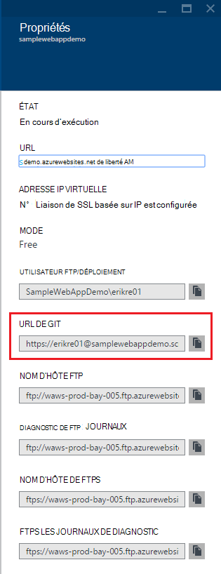

## Publier votre application web à un Service d’application Azure

Dans cette section, vous allez créer un référentiel de Git local et la diffusion à partir de ce référentiel pour Azure pour déployer votre application web vers Azure.

1. Dans le Code de VS, sélectionnez l’option de **Git** dans la barre de navigation de gauche.

    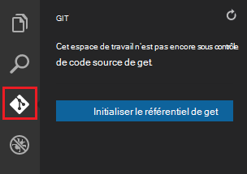

2. Sélectionnez **initialiser le git référentiel** pour vous assurer que votre espace de travail est sous contrôle de code source git. 

    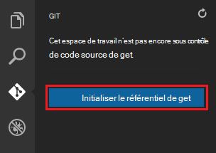

3. Ouvrez la fenêtre de commande et changez de répertoire vers le répertoire de votre application web. Ensuite, entrez la commande suivante :

        git config core.autocrlf false

    Cette commande empêche un problème à propos du texte dans lequel les terminaisons CRLF et fin de saut de ligne est impliqués.

4. Dans le Code de VS, ajouter un message de validation et cliquez sur l’icône de vérification de **Validation tous** .

    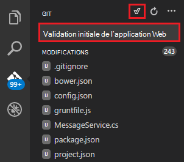

5. Une fois le Git a terminé le traitement, vous verrez qu’il n’y a pas de fichiers listés dans la fenêtre Git sous **des modifications**. 

    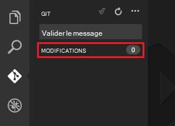

6. Rétablir la fenêtre de commande où l’invite de commande pointe vers le répertoire où se trouve votre application web.

7. Créer une référence distante pour pousser des mises à jour pour votre application web à l’aide de l’URL Git (numéro se termine par « .git ») que vous avez copié précédemment.

        git remote add azure [URL for remote repository]

8. Configurer le Git pour enregistrer vos informations d’identification de localement afin qu’ils seront automatiquement ajoutés à vos commandes push générés à partir de Code de VS.

        git config credential.helper store

9. Distribuer vos modifications vers Azure en entrant la commande suivante. Cette transmission initiale sur Azure, vous serez en mesure d’effectuer toutes les commandes d’envoi à partir de Code de VS. 

        git push -u azure master

    Vous êtes invité pour le mot de passe que vous avez créé précédemment dans Azure. **Remarque : Votre mot de passe ne sera pas visible.**

    La sortie de la commande ci-dessus se termine par un message que le déploiement a réussi.

        remote: Deployment successful.
        To https://user@testsite.scm.azurewebsites.net/testsite.git
        [new branch]      master -> master

> [AZURE.NOTE] Si vous apportez des modifications à votre application, vous pouvez le republier directement dans le Code de VS à l’aide de la fonctionnalité intégrée de Git en sélectionnant l’option **Valider tous les** suivie de l’option **poussée** . Vous trouverez l’option **poussée** disponible dans le menu déroulant en regard des boutons **Valider toutes les** et **Actualiser** .

Si vous avez besoin collaborer sur un projet, vous devez envisager de pousser vers GitHub entre installation push sur Azure.

## Exécutez l’application dans Azure
Maintenant que vous avez déployé votre application web, nous allons exécuter l’application tandis que hébergées dans Azure. 

Pour ce faire de deux façons :

* Ouvrez un navigateur et entrez le nom de votre application web comme suit.   

        http://SampleWebAppDemo.azurewebsites.net
 
* Dans le portail d’Azure, recherchez la blade d’application web pour votre application web et cliquez sur **Parcourir** pour afficher votre application 
* dans votre navigateur par défaut.

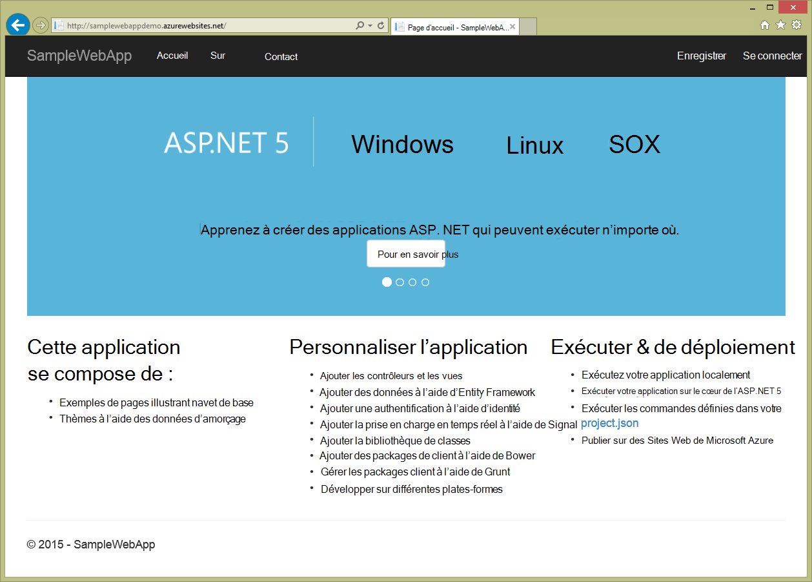

## Résumé
Dans ce didacticiel, vous avez appris comment créer une application web dans le Code de VS et le déployer vers Azure. Pour plus d’informations sur le Code de VS, consultez l’article [Pourquoi Visual Studio Code de ?](https://code.visualstudio.com/Docs/) Pour plus d’informations sur les applications de Service d’application web, consultez [Vue d’ensemble des applications Web](app-service-web-overview.md). 
