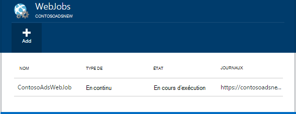
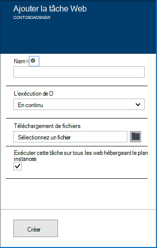
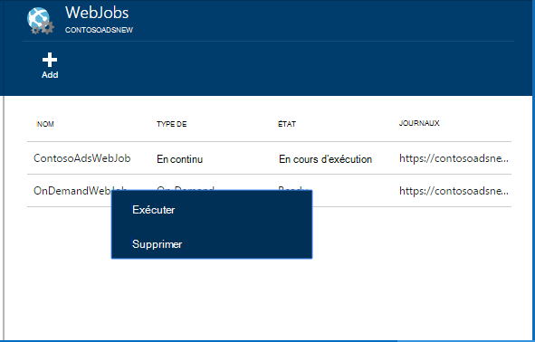
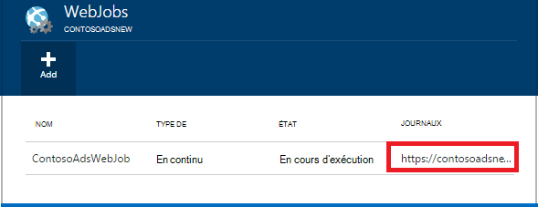

<properties 
    pageTitle="Exécuter des tâches en arrière-plan avec WebJobs" 
    description="Apprenez à exécuter des tâches en arrière-plan dans les applications web Azure." 
    services="app-service" 
    documentationCenter="" 
    authors="tdykstra" 
    manager="wpickett" 
    editor="jimbe"/>

<tags 
    ms.service="app-service" 
    ms.workload="na" 
    ms.tgt_pltfrm="na" 
    ms.devlang="na" 
    ms.topic="article" 
    ms.date="04/27/2016" 
    ms.author="tdykstra"/>

# <a name="run-background-tasks-with-webjobs"></a>Exécuter des tâches en arrière-plan avec WebJobs

## <a name="overview"></a>Vue d’ensemble

Vous pouvez exécuter des programmes ou des scripts dans WebJobs dans votre [Application Service](http://go.microsoft.com/fwlink/?LinkId=529714) web app de trois manières différentes : à la demande, en continu ou selon un planning. Il n’existe aucun coût supplémentaire à utiliser WebJobs.

Cet article explique comment déployer des WebJobs à l’aide du [Portail Azure](https://portal.azure.com). Pour plus d’informations sur la façon de déployer à l’aide de Visual Studio ou un processus continu de remise, consultez [comment déployer des WebJobs Azure à des applications Web](websites-dotnet-deploy-webjobs.md).

Le Kit de développement Azure WebJobs simplifie la WebJobs de nombreuses tâches de programmation. Pour plus d’informations, consultez [le Kit de développement logiciel WebJobs](websites-dotnet-webjobs-sdk.md).

 Fonctions Azure (en aperçu) est une autre façon d’exécuter des programmes et des scripts dans le Service d’application Azure. Pour plus d’informations, consultez [vue d’ensemble des fonctions d’Azure](../azure-functions/functions-overview.md).

[AZURE.INCLUDE [app-service-web-to-api-and-mobile](../../includes/app-service-web-to-api-and-mobile.md)] 

## <a name="acceptablefiles"></a>Types de fichiers acceptables pour des scripts ou des programmes

Les types de fichier suivants sont acceptés :

* .cmd, .bat, .exe (à l’aide de la cmd de windows)
* .ps1 (à l’aide de powershell)
* .sh (à l’aide de bash)
* .PHP (à l’aide de php)
* .py (en utilisant les python)
* .js (à l’aide du nœud)
* .jar (à l’aide de java)

## <a name="CreateOnDemand"></a>Créer une demande suite WebJob dans le portail

1. De la lame **d’Application Web** du [Portail Azure](https://portal.azure.com), cliquez sur **tous les paramètres > WebJobs** pour afficher la lame de **WebJobs** .
    
    
    
5. Cliquez sur **Ajouter**. La boîte de dialogue **Ajouter un WebJob** s’affiche.
    
    
    
2. Sous **nom**, fournissez un nom pour le WebJob. Le nom doit commencer par une lettre ou un chiffre et ne peut pas contenir de caractères spéciaux autres que «- » et « _ ».
    
4. Dans la zone **comment exécuter** , choisissez **Exécuter à la demande**.
    
3. Dans la zone de **Téléchargement de fichier** , cliquez sur l’icône de dossier et recherchez le fichier zip qui contient votre script. Le fichier zip doit contenir votre fichier exécutable (.exe .cmd .bat .sh .php .py .js) ainsi que les fichiers de prise en charge nécessaires à l’exécution du programme ou du script.
    
5. Vérifiez les **créer** pour charger le script à votre application web. 
    
    Le nom que vous avez spécifié pour la WebJob s’affiche dans la liste sur la lame de **WebJobs** .
    
6. Pour exécuter le WebJob, cliquez sur son nom dans la liste, puis cliquez sur **exécuter**.
    
    
    
## <a name="CreateContinuous"></a>Créer un WebJob en permanence en cours d’exécution

1. Pour créer un WebJob en permanence en cours d’exécution, suivez les mêmes étapes pour la création d’un WebJob que s’exécute une seule fois, mais dans la zone **comment exécuter** , cliquez sur **continu**.

2. Pour démarrer ou arrêter une WebJob continue, avec le bouton droit de la WebJob dans la liste, puis cliquez sur **Démarrer** ou **Arrêter**.
    
> [AZURE.NOTE] Si votre application web s’exécute sur plusieurs instances, une WebJob en permanence en cours d’exécution s’exécutera sur l’ensemble de vos instances. WebJobs à la demande et planifiées s’exécutent sur une instance unique sélectionnée pour l’équilibrage par Microsoft Azure.
    
> Pour WebJobs continue à exécuter de façon fiable et sur toutes les instances, activer la toujours sur * paramètre de configuration de l’application web dans le cas contraire, ils peuvent arrêter l’exécution lorsque le site hôte SCM a été inactif pendant trop longtemps.

## <a name="CreateScheduledCRON"></a>Créer un WebJob programmé à l’aide d’une expression CRON

Cette technique n’est disponible pour les applications Web s’exécutant en mode de base, Standard ou Premium et requiert le paramètre **Toujours** être activée pour l’application.

Pour transformer un WebJob de la demande sur un WebJob planifiée, incluez simplement un `settings.job` le fichier à la racine de votre fichier zip de WebJob. Ce fichier JSON doit inclure un `schedule` propriété avec une [expression CRON](https://en.wikipedia.org/wiki/Cron), par exemple ci-dessous.

L’expression CRON se compose de 6 champs : `{second} {minute} {hour} {day} {month} {day of the week}`.

Par exemple, pour déclencher des toutes les 15 minutes, votre WebJob votre `settings.job` aurait :

```json
{
    "schedule": "0 */15 * * * *"
}
``` 

D’autres exemples de planification CRON :

- Toutes les heures (par exemple, à chaque fois que le nombre de minutes est 0) :`0 0 * * * *` 
- Toutes les heures de 9 h à 17 h 00 :`0 0 9-17 * * *` 
- À 9 h 30 tous les jours :`0 30 9 * * *`
- À 9 h 30 chaque jour de la semaine :`0 30 9 * * 1-5`

**Remarque**: lors du déploiement d’un WebJob à partir de Visual Studio, veillez à marquer votre `settings.job` propriétés du fichier en tant que « Copier si plus récent ».


## <a name="CreateScheduled"></a>Créer un WebJob planifiée à l’aide du planificateur Azure

L’autre technique suivante montre comment utiliser le planificateur d’Azure. Dans ce cas, votre WebJob n’a pas de connaissances direct de la planification. Au lieu de cela, le planificateur Azure obtient configuré pour déclencher votre WebJob selon une planification. 

Le portail Azure ne dispose pas encore la possibilité de créer un WebJob planifiée, mais tant que fonctionnalité est ajoutée que vous pouvez le faire à l’aide du [portail classique](http://manage.windowsazure.com).

1. Dans le [portail classique](http://manage.windowsazure.com) aller à la page WebJob et cliquez sur **Ajouter**.

1. Dans la zone **comment exécuter** , choisissez **exécuter selon une planification**.
    
    ![Nouvel tâche planifiée][NewScheduledJob]
    
2. Choisir la **Région du planificateur** pour votre travail, puis cliquez sur la flèche en bas à droite de la boîte de dialogue pour passer à l’écran suivant.

3. Dans la boîte de dialogue **Créer un projet** , choisissez le type de **périodicité** souhaitée : **tâche ponctuelle** ou **périodique**.
    
    ![Planifier la périodicité][SchdRecurrence]
    
4. Également choisir une heure de **départ** : **maintenant** ou **à une heure spécifique**.
    
    ![Heure de début de planification][SchdStart]
    
5. Si vous souhaitez commencer à une heure spécifique, choisissez vos valeurs de temps de départ sous **Démarrage sur**.
    
    ![Début du calendrier à une heure spécifique][SchdStartOn]
    
6. Si vous avez choisi un projet récurrent, vous avez la **Répéter chaque** option permet de spécifier la fréquence d’occurrence et l’option **De fin** pour spécifier une heure de fin.
    
    ![Planifier la périodicité][SchdRecurEvery]
    
7. Si vous choisissez **semaines**, vous pouvez sélectionner la boîte **Sur une planification particulier** et spécifier les jours de la semaine où vous souhaitez que la tâche à exécuter.
    
    ![Planification des jours de la semaine][SchdWeeksOnParticular]
    
8. Si vous choisissez le **mois** et que vous activez la case **Sur une planification particulier** , vous pouvez définir la tâche à exécuter sur certains numérotée **jours** dans le mois. 
    
    ![Planifier les Dates particulier dans le mois][SchdMonthsOnPartDays]
    
9. Si vous choisissez les **Jours de la semaine**, vous pouvez sélectionner l’ou les jours de la semaine dans le mois que vous souhaitez que la tâche à exécuter.
    
    ![Planification des jours de la semaine particulier dans un mois][SchdMonthsOnPartWeekDays]
    
10. Enfin, vous pouvez également utiliser l’option **Occurrences** de choisir quelle semaine du mois (premier, deuxième, troisième etc.) vous voulez que la tâche à exécuter sur les jours de la semaine spécifié.
    
    ![Planification des jours de la semaine particulier sur semaines particuliers dans un mois][SchdMonthsOnPartWeekDaysOccurences]
    
11. Après avoir créé une ou plusieurs tâches, leurs noms apparaissent sous l’onglet WebJobs avec leur statut, type de planification et d’autres informations. Les informations historiques de le 30 dernières WebJobs sont conservées.
    
    ![Liste des tâches][WebJobsListWithSeveralJobs]
    
### <a name="Scheduler"></a>Les tâches planifiées et planificateur d’Azure

Tâches planifiées peuvent être davantage configurés dans les pages d’Azure planificateur du [portail classique](http://manage.windowsazure.com).

1.  Sur la page WebJobs, cliquez sur le lien de **planification** du travail pour accéder à la page du portail Azure planificateur. 
    
    ![Lien vers Azure planificateur][LinkToScheduler]
    
2. Sur la page du planificateur, cliquez sur la tâche.
    
    ![Tâche sur la page du portail du planificateur][SchedulerPortal]
    
3. La page **Action de la tâche** s’ouvre, dans laquelle vous pouvez configurer la tâche. 
    
    ![PageInScheduler d’Action de la tâche][JobActionPageInScheduler]
    
## <a name="ViewJobHistory"></a>Afficher l’historique des travaux

1. Pour afficher l’historique de l’exécution d’un travail, y compris les travaux créés avec le SDK WebJobs, cliquez sur le lien correspondant sous la colonne de **journaux** de la lame de WebJobs. (Vous pouvez utiliser l’icône du Presse-papiers pour copier l’URL de la page du fichier journal dans le Presse-papiers si vous le souhaitez.)
    
    
        
2. En cliquant sur le lien pour ouvrir la page Détails de la WebJob. Cette page affiche le nom de la commande Exécuter, les dernières fois qu'il s’est exécuté, et sa réussite ou son échec. **Travail récent s’exécute**, cliquez sur une heure pour obtenir plus de détails.
    
    ![WebJobDetails][WebJobDetails]
    
3. La page de **Détails de la série WebJob** s’affiche. Cliquez sur **Activer/désactiver sortie** pour afficher le texte du contenu du journal. Le journal de résultat est au format texte. 
    
    ![Détails de la tâche Web][WebJobRunDetails]
    
4. Pour afficher le texte de sortie dans une fenêtre distincte du navigateur, cliquez sur le lien de **téléchargement** . Pour télécharger le texte lui-même, cliquez sur le lien et utilisez les options de votre navigateur pour enregistrer le contenu du fichier.
    
    ![Sortie du journal de téléchargement][DownloadLogOutput]
    
5. Le lien **WebJobs** en haut de la page offre un moyen pratique pour accéder à une liste de WebJobs sur le tableau de bord de l’historique.
    
    ![Lien vers la liste de WebJobs][WebJobsLinkToDashboardList]
    
    ![Liste des WebJobs dans le tableau de bord de l’historique][WebJobsListInJobsDashboard]
    
    En cliquant sur un de ces liens permet d’atteindre la page de détails de la WebJob pour le travail que vous avez sélectionné.


## <a name="WHPNotes"></a>Notes
    
- Les applications Web en mode libre peuvent expirer après 20 minutes si il n’y a aucune demande au site scm (déploiement) et le portail de l’application web n’est ne pas ouvert dans Azure. Demandes sur le site réel ne réinitialise pas cela.
- Code d’un projet en continu doive être écrites pour s’exécuter dans une boucle sans fin.
- Continue les tâches exécutées en continu uniquement lorsque l’application web est actif.
- Base et offre les modes Standard toujours sur des fonctionnalités qui, lorsqu’il est activé, empêche les applications web de devenir inactive.
- Vous ne pouvez déboguer en permanence en cours d’exécution WebJobs. WebJobs planifiée ou à la demande de débogage n’est pas pris en charge.

## <a name="NextSteps"></a>Étapes suivantes
 
Pour plus d’informations, consultez [Ressources de recommandé Azure WebJobs][WebJobsRecommendedResources].

[PSonWebJobs]:http://blogs.msdn.com/b/nicktrog/archive/2014/01/22/running-powershell-web-jobs-on-azure-websites.aspx
[WebJobsRecommendedResources]:http://go.microsoft.com/fwlink/?LinkId=390226

[OnDemandWebJob]: ./media/web-sites-create-web-jobs/01aOnDemandWebJob.png
[WebJobsList]: ./media/web-sites-create-web-jobs/02aWebJobsList.png
[NewContinuousJob]: ./media/web-sites-create-web-jobs/03aNewContinuousJob.png
[NewScheduledJob]: ./media/web-sites-create-web-jobs/04aNewScheduledJob.png
[SchdRecurrence]: ./media/web-sites-create-web-jobs/05SchdRecurrence.png
[SchdStart]: ./media/web-sites-create-web-jobs/06SchdStart.png
[SchdStartOn]: ./media/web-sites-create-web-jobs/07SchdStartOn.png
[SchdRecurEvery]: ./media/web-sites-create-web-jobs/08SchdRecurEvery.png
[SchdWeeksOnParticular]: ./media/web-sites-create-web-jobs/09SchdWeeksOnParticular.png
[SchdMonthsOnPartDays]: ./media/web-sites-create-web-jobs/10SchdMonthsOnPartDays.png
[SchdMonthsOnPartWeekDays]: ./media/web-sites-create-web-jobs/11SchdMonthsOnPartWeekDays.png
[SchdMonthsOnPartWeekDaysOccurences]: ./media/web-sites-create-web-jobs/12SchdMonthsOnPartWeekDaysOccurences.png
[RunOnce]: ./media/web-sites-create-web-jobs/13RunOnce.png
[WebJobsListWithSeveralJobs]: ./media/web-sites-create-web-jobs/13WebJobsListWithSeveralJobs.png
[WebJobLogs]: ./media/web-sites-create-web-jobs/14WebJobLogs.png
[WebJobDetails]: ./media/web-sites-create-web-jobs/15WebJobDetails.png
[WebJobRunDetails]: ./media/web-sites-create-web-jobs/16WebJobRunDetails.png
[DownloadLogOutput]: ./media/web-sites-create-web-jobs/17DownloadLogOutput.png
[WebJobsLinkToDashboardList]: ./media/web-sites-create-web-jobs/18WebJobsLinkToDashboardList.png
[WebJobsListInJobsDashboard]: ./media/web-sites-create-web-jobs/19WebJobsListInJobsDashboard.png
[LinkToScheduler]: ./media/web-sites-create-web-jobs/31LinkToScheduler.png
[SchedulerPortal]: ./media/web-sites-create-web-jobs/32SchedulerPortal.png
[JobActionPageInScheduler]: ./media/web-sites-create-web-jobs/33JobActionPageInScheduler.png
 
