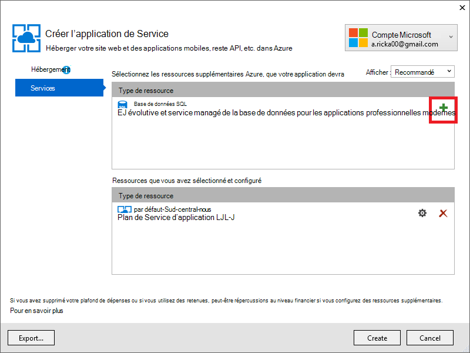

<properties 
    pageTitle="Créer une application ASP.NET MVC avec l’authentification et la base de données SQL et le déployer vers Azure Application Service" 
    description="Découvrez comment développer une application ASP.NET MVC 5 avec un SQL de base de données back-end, ajouter l’authentification et l’autorisation et la déployer vers Azure." 
    services="app-service\web" 
    documentationCenter=".net" 
    authors="Rick-Anderson" 
    writer="Rick-Anderson" 
    manager="wpickett" 
    editor=""/>

<tags 
    ms.service="app-service-web" 
    ms.workload="web" 
    ms.tgt_pltfrm="na" 
    ms.devlang="dotnet" 
    ms.topic="article" 
    ms.date="03/21/2016" 
    ms.author="riande"/> 

# Créer une application ASP.NET MVC avec l’authentification et la base de données SQL et le déployer vers Azure Application Service

Ce didacticiel explique comment créer une application web ASP.NET MVC 5 sécurisée qui permet aux utilisateurs de se connecter avec les informations d’identification à partir de Facebook ou Google. L’application est une simple liste de contacts qui utilise ADO.NET Entity Framework pour l’accès de la base de données. Vous allez déployer l’application de [Service d’application Azure](http://go.microsoft.com/fwlink/?LinkId=529714). 

À la fin de ce didacticiel, vous avez une application web sécurisée de contrôlée par les données dans le nuage et exécutés à l’aide d’une base de données. L’illustration suivante montre la page de connexion pour l’application terminée.

![page de connexion][rxb]

Vous apprendrez à :

* Comment créer un projet de web ASP.NET MVC 5 sécurisé dans Visual Studio.
* Comment authentifier et autoriser les utilisateurs qui ouvrent une session avec des informations d’identification de leur compte Google ou Facebook (authentification social fournisseur à l’aide de [OAuth 2.0](http://oauth.net/2 "http://oauth.net/2")).
* Comment authentifier et autoriser les utilisateurs qui s’enregistrent dans une base de données gérée par l’application (à l’aide de [ASP.NET identité](http://asp.net/identity/)d’authentification locale).
* Comment utiliser ADO.NET Entity Framework 6 Code First pour lire et écrire des données dans une base de données SQL.
* L’utilisation d’Entity Framework Code premier Migrations pour déployer une base de données.
* Explique comment stocker des données relationnelles dans le nuage en utilisant la base de données de SQL Azure.
* Comment déployer un projet web qui utilise une base de données à une [application web](http://go.microsoft.com/fwlink/?LinkId=529714) dans le Service d’application Azure.

>[AZURE.NOTE] Il s’agit d’un didacticiel de long. Si vous souhaitez une brève introduction aux projets web de Service d’application Azure et Visual Studio, voir [créer une application web ASP.NET dans le Service d’application Azure](web-sites-dotnet-get-started.md). Pour des informations de dépannage, consultez la section [dépannage](#troubleshooting) .
>
>Ou si vous souhaitez commencer avec le Service d’application Azure avant l’ouverture d’un compte Azure, [Essayez le Service application](http://go.microsoft.com/fwlink/?LinkId=523751), où vous pouvez créer une application web de courte durée starter immédiatement dans le Service d’application. Aucune carte de crédit obligatoire ; aucun des engagements.

## Conditions préalables

Pour terminer ce didacticiel, vous avez besoin d’un compte Microsoft Azure. Si vous n’avez pas un compte, vous pouvez [activer vos avantages d’abonné de Visual Studio](/pricing/member-offers/msdn-benefits-details/?WT.mc_id=A261C142F) , ou [Inscrivez-vous pour un essai gratuit](/pricing/free-trial/?WT.mc_id=A261C142F).

Pour configurer votre environnement de développement, vous devez installer [Visual Studio 2013 Update 5](http://go.microsoft.com/fwlink/?LinkId=390521) ou version ultérieure et la dernière version du [SDK Azure pour .NET](http://go.microsoft.com/fwlink/?linkid=324322&clcid=0x409). Cet article a été écrit pour 4 de mise à jour de Visual Studio et le Kit de développement logiciel 2.8.1. Les mêmes instructions de travail pour Visual Studio 2015 avec le dernier [SDK Azure pour .NET](http://go.microsoft.com/fwlink/?linkid=518003&clcid=0x409) installée, mais certains écrans aura un aspect différents dans les illustrations.

## Création d’une application ASP.NET MVC 5

### Créer le projet

1. Dans le menu **fichier** , cliquez sur **Nouveau projet**.

    

1. Dans la boîte de dialogue **Nouveau projet** , développez **C#** et sélectionnez **Web** sous **Modèles installés**puis sélectionnez **ASP.NET Web Application**. Nom de l’application **ContactManager**, puis cliquez sur **OK**.

    
 
    **Remarque :** Assurez-vous que vous entrez « ContactManager ». Les blocs de code que vous allez copier ultérieurement supposent que le nom du projet est ContactManager. 

1. Dans la boîte de dialogue **Nouveau projet ASP.NET** , sélectionnez le modèle **MVC** . Vérifiez que **l’authentification** est définie pour les **Comptes d’utilisateur individuels**, **hôte dans le nuage** est vérifiée et **Service d’application** est sélectionnée.

    

1. Cliquez sur **OK**.

1. La boîte de dialogue **Configurer des paramètres d’application Microsoft Azure Web** s’affiche. Vous devrez peut-être ouvrir une session si vous ne le n'avez pas déjà fait, ou entrer de nouveau vos informations d’identification si votre nom d’utilisateur est expiré.

1. Facultatif : modification de la valeur dans le **nom de l’application Web** de la zone (voir image ci-dessous).

    L’URL de l’application web sera {nom} .azurewebsites .net, afin que le nom doit être unique dans le domaine azurewebsites.net. L’Assistant de configuration vous suggère un nom unique en ajoutant un numéro au nom du projet « ContactManager », et c’est parfait pour ce didacticiel.

5. Dans le **groupe de ressources** de la liste déroulante Sélectionnez un groupe existant ou **créer un groupe de ressources**(voir image ci-dessous). 

    Si vous préférez, vous pouvez sélectionner un groupe de ressources dont vous disposez déjà. Mais si vous créez un nouveau groupe de ressources et l’utiliser uniquement pour ce didacticiel, il sera facile de supprimer toutes les ressources Azure que vous avez créé pour le didacticiel lorsque vous avez terminé avec elles. Pour plus d’informations sur les groupes de ressources, consultez [vue d’ensemble du Gestionnaire de ressources Azure](../azure-resource-manager/resource-group-overview.md). 

5. Dans le **plan de Service d’application** de la liste déroulante Sélectionner un plan existant ou un **plan de Service d’application nouveau créer**(voir image ci-dessous).

    Si vous préférez, vous pouvez sélectionner un plan de Service de l’application que vous avez déjà. Pour plus d’informations sur les plans de Service de l’application, reportez-vous à la section [présentation approfondie des plans de Service d’application Azure](../app-service/azure-web-sites-web-hosting-plans-in-depth-overview.md). 

1. Cliquez sur **Explorer les services Azure supplémentaires** pour ajouter une base de données SQL.

    

1. Cliquez sur le **+** icône pour ajouter une base de données SQL.

    

1. Cliquez sur **Nouveau** dans la boîte de dialogue **Configurer la base de données SQL** :

    

1. Entrez un nom pour l’administrateur et un mot de passe.

    

    Le nom du serveur doit être unique. Il peut contenir des lettres en minuscules, des chiffres et des traits d’union. Il ne peut pas contenir un trait d’union. Le nom d’utilisateur et le mot de passe sont les nouvelles informations d’identification que vous créez pour le nouveau serveur. 

    Si vous avez déjà un serveur de base de données, vous pouvez sélectionner qui au lieu de créer un. Les serveurs de base de données sont une ressource essentielle, et il est souvent préférable de créer plusieurs bases de données sur le même serveur de test et de développement au lieu de créer un serveur de base de données par la base de données. Toutefois, pour ce didacticiel vous ne devez le serveur temporairement, et en créant le serveur dans le même groupe de ressources que le site web vous rendez facile de supprimer les ressources d’application et de base de données web en supprimant le groupe de ressources lorsque vous avez terminé avec le didacticiel. 

    Si vous sélectionnez un serveur de base de données existante, assurez-vous que votre application web et la base de données sont dans la même région.

    

4. Cliquez sur **créer**.

    Visual Studio crée le projet web ContactManager, crée le groupe de ressources et d’un plan de Service de l’application que vous avez spécifiée, et crée une application web dans le Service d’application Azure avec le nom spécifié.

### La valeur de l’en-tête de page et pied de page

1. Dans **L’Explorateur de solutions** , ouvrez le fichier *Layout.cshtml* dans le dossier *Views\Shared* .

    ![_Layout.cshtml dans l’Explorateur de solutions][newapp004]

1. Remplacez le ActionLink dans le fichier *Layout.cshtml* par le code suivant.

    @Html.ActionLink("CMDémo », « Index », « Contacts », nouveau {zone = « »}, nouveau { @class = « barre de navigation-marque »})
                   

    Assurez-vous que vous modifiez le troisième paramètre à « Domicile », « Contacts ». Le balisage ci-dessus crée un lien de « Contacts » sur chaque page à la méthode Index du contrôleur de Contacts. Modifier le nom de l’application dans l’en-tête et le pied de page à partir de « Mes ASP.NET Application » et « Nom de l’Application » à « Gestionnaire de contacts » et « Demo CM ». 
 
### Exécutez l’application localement

1. Appuyez sur CTRL + F5 pour exécuter l’application.

    La page d’accueil application s’affiche dans le navigateur par défaut.

    

C’est tout ce vous devez faire pour le moment créer l’application que vous allez déployer sur Azure. 

## Déployer l’application vers Azure

1. Dans Visual Studio, cliquez sur le projet dans **L’Explorateur de solutions** et sélectionnez **Publier** dans le menu contextuel.

    
    
    L’Assistant de **Publication sur le Web** s’ouvre.

1. Dans la boîte de dialogue **Publier le site Web** , cliquez sur **Publier**.

    

    L’application que vous avez créé est en cours d’exécution dans le nuage. La prochaine fois que vous déployez l’application, seuls les fichiers modifiés (ou nouveau) seront déployés.

    

## Activer SSL pour le projet ##

1. Dans l' **Explorateur de solutions**, cliquez sur le projet **ContactManager** , puis cliquez sur F4 pour ouvrir la fenêtre **Propriétés** .

3. Modifier **le protocole SSL activé** sur **True**. 

4. Copiez l' **URL SSL**.

    L’URL SSL sera https://localhost:44300 / sauf si vous avez déjà créé des applications web SSL.

    ![activer SSL][rxSSL]
 
1. Dans l' **Explorateur de solutions**, cliquez avec le bouton droit sur le projet du **Gestionnaire de contacts** et cliquez sur **Propriétés**.

1. Cliquez sur l’onglet **Web** .

1. Modifier l' **Url du projet** pour utiliser l' **URL SSL** et enregistrez la page (contrôle S).

    
 
1. Vérifiez qu’Internet Explorer est le navigateur le lancement de Visual Studio, comme illustré dans l’image ci-dessous :

    

    Le sélecteur de navigateur vous permet de spécifier le navigateur que lance de Visual Studio. Vous pouvez sélectionner plusieurs navigateurs et Visual Studio mise à jour lorsque vous apportez des modifications de chaque navigateur. Pour plus d’informations, reportez-vous [à l’aide des liens de navigateur dans Visual Studio 2013](http://www.asp.net/visual-studio/overview/2013/using-browser-link).

    

1. Appuyez sur CTRL + F5 pour exécuter l’application. Cliquez sur **Oui** pour démarrer le processus d’approbation IIS Express a généré le certificat auto-signé.

     

1. Lecture de la boîte de dialogue **Avertissement de sécurité** et puis cliquez sur **Oui** si vous souhaitez installer le certificat représentant **l’hôte local**.

    

1. Internet Explorer affiche la page *d’accueil* et aucun avertissement SSL.

     

     Internet Explorer est un bon choix lorsque vous utilisez SSL, car il accepte le certificat et affiche le contenu HTTPS sans avertissement. Microsoft Edge et Google Chrome également acceptent le certificat. Firefox utilise son propre magasin de certificats, afin qu’elle affiche un message d’avertissement.

     

## Ajouter une base de données à l’application

Ensuite, vous allez mettre à jour l’application pour ajouter la possibilité d’afficher et de mettre à jour des contacts et de stocker les données dans une base de données. L’application utilise Entity Framework (FE) pour créer la base de données et pour lire et mettre à jour les données.

### Ajouter des classes de modèle de données pour les contacts

Vous commencez par créer un modèle de données simple dans le code.

1. Dans l' **Explorateur de solutions**, cliquez sur le dossier Modèles, cliquez sur **Ajouter**, puis **classe**.

    

2. Dans la boîte de dialogue **Ajouter un nouvel élément** , nommez le nouveau fichier de classe *Contact.cs*, puis cliquez sur **Ajouter**.

    ![Ajouter un nouvel élément][adddb002]

3. Remplacez le contenu du fichier Contact.cs par le code suivant.

        using System.ComponentModel.DataAnnotations;
        using System.Globalization;
        namespace ContactManager.Models
        {
            public class Contact
            {
                public int ContactId { get; set; }
                public string Name { get; set; }
                public string Address { get; set; }
                public string City { get; set; }
                public string State { get; set; }
                public string Zip { get; set; }
                [DataType(DataType.EmailAddress)]
                public string Email { get; set; }
            }
        }
La classe **Contact** définit les données que vous souhaitez stocker pour chaque contact, plus une clé primaire, et *soumettez le formulaire*, qui est requis par la base de données.

### Créer des pages web qui permettent aux utilisateurs d’applications à utiliser avec les contacts

La fonctionnalité de génération de modèles automatique ASP.NET MVC peut générer automatiquement du code qui exécute créer, lire, mettre à jour et supprimer des actions (CRUD). 

1. Générez le projet **(Ctrl + Maj + B)**. (Vous devez générer le projet avant d’utiliser le mécanisme de génération de modèles automatique.)
 
1. Dans l' **Explorateur de solutions**, cliquez sur le dossier Controllers et cliquez sur **Ajouter**, puis cliquez sur **contrôleur**.

    ![Ajouter un contrôleur dans le menu contextuel du dossier contrôleurs][addcode001]

5. Dans la boîte de dialogue **Ajouter un échafaudage** , sélectionnez **Contrôleur de 5 MVC avec des vues, l’utilisation d’EF** et puis cliquez sur **Ajouter**.
    
    

1. Dans la zone déroulante de la **classe de modèle** , sélectionnez le **Contact (ContactManager.Models)**. (Voir l’image ci-dessous.)

1. Dans la **classe de contexte de données**, sélectionnez **ApplicationDbContext (ContactManager.Models)**. **ApplicationDbContext** sera utilisé pour la base de données d’appartenance et de nos données de contact.

    

1. Cliquez sur **Ajouter**.

   Visual Studio crée un contrôleur avec des méthodes et des affichages pour les opérations de base de données pour les objets de **Contact** .

## Activer des Migrations, créer la base de données, ajoutez des exemples de données et un initialiseur de données ##

La tâche suivante consiste à activer la fonctionnalité de [Migrations de premier Code](http://msdn.microsoft.com/library/hh770484.aspx) afin de créer des tables de base de données basées sur le modèle de données que vous avez créé.

1. Dans le menu **Outils** , sélectionnez **Du Gestionnaire de package NuGet** , puis **Console du Gestionnaire de package**.

    

2. Dans la fenêtre de la **Console du Gestionnaire de package** , entrez la commande suivante :

        enable-migrations

    La commande **enable-migrations** crée un dossier des *Migrations* , et qu’il place dans ce dossier un fichier *Configuration.cs* que vous pouvez modifier pour amorcer la base de données et configurer des Migrations. 

2. Dans la fenêtre de la **Console du Gestionnaire de package** , entrez la commande suivante :

        add-migration Initial

    La commande **Ajouter de migration initiale** génère un fichier nommé ** &lt;date_stamp&gt;initiale** dans le dossier *migration* . Le code de ce fichier crée les tables de la base de données. Le premier paramètre ( **initiale** ) est utilisé pour créer le nom du fichier. Vous pouvez voir les nouveaux fichiers de classe dans **L’Explorateur de solutions**.

    Dans la classe **initiale** , la méthode **des** crée la table Contacts, et supprime la méthode **vers le bas** (utilisée lorsque vous souhaitez revenir à l’état précédent).

3. Ouvrez le fichier *Migrations\Configuration.cs* . 

4. Ajoutez le code suivant `using` instruction. 

         using ContactManager.Models;

5. Remplacez la méthode *d’amorçage* par le code suivant :

        protected override void Seed(ContactManager.Models.ApplicationDbContext context)
        {
            context.Contacts.AddOrUpdate(p => p.Name,
               new Contact
               {
                   Name = "Debra Garcia",
                   Address = "1234 Main St",
                   City = "Redmond",
                   State = "WA",
                   Zip = "10999",
                   Email = "debra@example.com",
               },
                new Contact
                {
                    Name = "Thorsten Weinrich",
                    Address = "5678 1st Ave W",
                    City = "Redmond",
                    State = "WA",
                    Zip = "10999",
                    Email = "thorsten@example.com",
                },
                new Contact
                {
                    Name = "Yuhong Li",
                    Address = "9012 State st",
                    City = "Redmond",
                    State = "WA",
                    Zip = "10999",
                    Email = "yuhong@example.com",
                },
                new Contact
                {
                    Name = "Jon Orton",
                    Address = "3456 Maple St",
                    City = "Redmond",
                    State = "WA",
                    Zip = "10999",
                    Email = "jon@example.com",
                },
                new Contact
                {
                    Name = "Diliana Alexieva-Bosseva",
                    Address = "7890 2nd Ave E",
                    City = "Redmond",
                    State = "WA",
                    Zip = "10999",
                    Email = "diliana@example.com",
                }
                );
        }

    Ce code initialise (semences) la base de données avec les informations de contact. Pour plus d’informations sur l’amorçage de la base de données, voir [l’amorçage et bases de données de débogage Entity Framework (EF)](http://blogs.msdn.com/b/rickandy/archive/2013/02/12/seeding-and-debugging-entity-framework-ef-dbs.aspx). Générez le projet pour vérifier qu'il n’y a aucune erreur de compilation.

6. Dans la **Console du Gestionnaire de package** , saisissez la commande :

        update-database

    ![Commandes de la Console du Gestionnaire de package][addcode009]

    La **mise à jour de bases de données** s’exécute la première migration qui crée la base de données. Par défaut, la base de données est créée sous la forme d’une base de données SQL Server Express LocalDB. 

7. Appuyez sur CTRL + F5 pour exécuter l’application, puis cliquez sur le lien **Démonstration de CM** ; ou accédez à https://localhost :(port#)/Cm. 

    L’application affiche les données de la valeur de départ et fournit des détails, de modifier et de supprimer des liens. Vous pouvez créer, modifier, supprimer et afficher les données.

    ![Vue MVC de données][rx2]

## Ajouter un fournisseur de OAuth2

>[AZURE.NOTE] Pour obtenir des instructions détaillées sur la façon d’utiliser les Google et Facebook developer sites portail, ce didacticiel des liens vers des didacticiels sur le site ASP.NET. Toutefois, Google et Facebook changent plus fréquemment que ces didacticiels sont mis à jour, et ils sont maintenant à jour leurs sites. Si vous rencontrez un problème en suivant les instructions, voir le commentaire Disqus proposé à la fin de ce didacticiel pour obtenir une liste de ce qui a changé. 

[OAuth] (http://oauth.net/ "http://OAuth.NET/") est un protocole ouvert qui permet d’autorisation sécurisée dans une méthode simple et standard à partir des applications web, mobiles et de bureau. Le modèle ASP.NET MVC internet utilise OAuth pour exposer des Facebook, Twitter, Google et Microsoft comme fournisseur d’authentification. Bien que ce didacticiel utilise uniquement de Google comme fournisseur d’authentification, vous pouvez facilement modifier le code pour utiliser un de ces fournisseurs. Les étapes pour implémenter d’autres fournisseurs sont très similaires aux étapes que vous voir dans ce didacticiel. Pour utiliser Facebook comme fournisseur d’authentification, consultez [Application de 5 MVC avec Facebook, Twitter, LinkedIn et Google OAuth2 ouverture de session ](http://www.asp.net/mvc/tutorials/mvc-5/create-an-aspnet-mvc-5-app-with-facebook-and-google-oauth2-and-openid-sign-on).

Outre l’authentification, ce didacticiel utilise des rôles pour l’autorisation de mettre en œuvre. Seuls les utilisateurs que vous ajoutez au rôle *canEdit* sont en mesure de modifier les données (c'est-à-dire, créer, modifier ou supprimer des contacts).

1. Suivez les instructions dans l' [Application de 5 MVC avec Facebook, Twitter, LinkedIn et Google OAuth2 ouverture de session](http://www.asp.net/mvc/tutorials/mvc-5/create-an-aspnet-mvc-5-app-with-facebook-and-google-oauth2-and-openid-sign-on#goog) sous **Création d’une application de Google pour 2 OAuth configurer une application de Google pour OAuth2**.

3. Exécutez et testez l’application pour vérifier que vous pouvez vous connecter à l’aide de l’authentification de Google.

2. Si vous souhaitez créer des boutons de connexion sociale avec des icônes spécifiques au fournisseur, voir [boutons de connexion assez social pour ASP.NET MVC 5](http://www.jerriepelser.com/blog/pretty-social-login-buttons-for-asp-net-mvc-5)

## À l’aide de l’API d’appartenance

Dans cette section, vous allez ajouter un utilisateur local et le rôle *canEdit* à la base de données d’appartenance. Seuls les utilisateurs dans le rôle *canEdit* sera en mesure de modifier les données. Une méthode conseillée consiste à rôles nom par les actions qu’ils peuvent effectuer, *canEdit* est préférable à un rôle appelé *admin*. Lorsque votre application évolue, vous pouvez ajouter de nouveaux rôles tels que *canDeleteMembers* , plutôt que le moins descriptifs *superAdmin*.

1. Ouvrez le fichier *migrations\configuration.cs* et ajoutez le code suivant `using` instructions :

        using Microsoft.AspNet.Identity;
        using Microsoft.AspNet.Identity.EntityFramework;

1. Ajoutez la méthode **AddUserAndRole** suivante à la classe :

        bool AddUserAndRole(ContactManager.Models.ApplicationDbContext context)
        {
            IdentityResult ir;
            var rm = new RoleManager<IdentityRole>
                (new RoleStore<IdentityRole>(context));
            ir = rm.Create(new IdentityRole("canEdit"));
            var um = new UserManager<ApplicationUser>(
                new UserStore<ApplicationUser>(context));
            var user = new ApplicationUser()
            {
                UserName = "user1@contoso.com",
            };
            ir = um.Create(user, "P_assw0rd1");
            if (ir.Succeeded == false)
                return ir.Succeeded;
            ir = um.AddToRole(user.Id, "canEdit");
            return ir.Succeeded;
        }

1. Appeler la nouvelle méthode à partir de la méthode de **semences** :

        protected override void Seed(ContactManager.Models.ApplicationDbContext context)
        {
            AddUserAndRole(context);
            context.Contacts.AddOrUpdate(p => p.Name,
                // Code removed for brevity
        }

    Les images suivantes indique les modifications apportées à la méthode de *semences* :

    

    Ce code crée un nouveau rôle appelé *canEdit*, crée un nouvel utilisateur local *user1@contoso.com*et ajoute *user1@contoso.com* au rôle *canEdit* . Pour plus d’informations, consultez les [didacticiels de l’identité d’ASP.NET](http://www.asp.net/identity/overview/features-api) , sur le site ASP.NET.

## Utiliser un Code temporaire pour ajouter les nouveaux utilisateurs de connexion sociale sur le rôle de canEdit  ##

Dans cette section, vous modifierez temporairement la méthode **ExternalLoginConfirmation** dans le contrôleur de compte à ajouter de nouveaux utilisateurs inscription auprès d’un fournisseur OAuth au rôle *canEdit* . Nous espérons que de fournir un outil semblable à [WSAT](http://msdn.microsoft.com/library/ms228053.aspx) à l’avenir qui vous permet de créer et de modifier des comptes d’utilisateurs et de rôles. En attendant, vous pouvez accomplir la même fonction à l’aide de code temporaire.

1. Ouvrez le fichier **Controllers\AccountController.cs** et accédez à la méthode **ExternalLoginConfirmation** .

1. Ajoutez l’appel suivant à **AddToRoleAsync** juste avant l’appel de **SignInAsync** .

        await UserManager.AddToRoleAsync(user.Id, "canEdit");

   Le code ci-dessus ajoute l’utilisateur qui vient d’être inscrit pour le rôle de « canEdit », ce qui leur donne accès aux méthodes d’action qui modifient les données (modifier). L’extrait suivant montre la nouvelle ligne de code dans le contexte.

          // POST: /Account/ExternalLoginConfirmation
          [HttpPost]
          [AllowAnonymous]
          [ValidateAntiForgeryToken]
          public async Task ExternalLoginConfirmation(ExternalLoginConfirmationViewModel model, string returnUrl)
          {
             if (User.Identity.IsAuthenticated)
             {
                return RedirectToAction("Index", "Manage");
             }
             if (ModelState.IsValid)
             {
                // Get the information about the user from the external login provider
                var info = await AuthenticationManager.GetExternalLoginInfoAsync();
                if (info == null)
                {
                   return View("ExternalLoginFailure");
                }
                var user = new ApplicationUser { UserName = model.Email, Email = model.Email };
                var result = await UserManager.CreateAsync(user);
                if (result.Succeeded)
                {
                   result = await UserManager.AddLoginAsync(user.Id, info.Login);
                   if (result.Succeeded)
                   {
                      await UserManager.AddToRoleAsync(user.Id, "canEdit");
                      await SignInManager.SignInAsync(user, isPersistent: false, rememberBrowser: false);
                      return RedirectToLocal(returnUrl);
                   }
                }
                AddErrors(result);
             }
             ViewBag.ReturnUrl = returnUrl;
             return View(model);
          }

Plus loin dans le didacticiel, vous allez déployer l’application vers Azure, où vous allez session avec Google ou d’un autre fournisseur d’authentification de tierce partie. Cela ajoutera votre compte nouvellement inscrit au rôle *canEdit* . Toute personne qui détecte les URL de votre application web et possède un ID de Google peut ensuite enregistrer et mise à jour de votre base de données. Pour empêcher d’autres personnes à partir de cela, vous pouvez arrêter le site. Vous serez en mesure de vérifier qui est dans le rôle *canEdit* en examinant la base de données.

Dans la **Console du Gestionnaire de package** , appuyez sur la touche flèche haut pour faire apparaître la commande suivante :

        Update-Database

La commande de **Mise à jour de base de données** exécute la méthode de **semences** et qui exécute la méthode **AddUserAndRole** que vous avez ajouté précédemment. La méthode **AddUserAndRole** crée l’utilisateur *user1@contoso.com* et lui ajoute au rôle *canEdit* .

## Protéger l’Application avec SSL et l’attribut autoriser ##

Dans cette section, vous appliquez l’attribut [Autoriser](http://msdn.microsoft.com/library/system.web.mvc.authorizeattribute.aspx) pour limiter l’accès pour les méthodes d’action. Les utilisateurs anonymes pourront afficher uniquement la méthode d’action **Index** du contrôleur home. Les utilisateurs enregistrés sera en mesure de voir les données de contact (les pages **Index** et **Détails** du contrôleur Cm), la page à propos et la page de Contact. Seuls les utilisateurs dans le rôle *canEdit* pourront à l’accès aux méthodes d’action qui modifient les données.

1. Ouvrez le fichier *App_Start\FilterConfig.cs* et remplacez la méthode *RegisterGlobalFilters* suivants (qui ajoutant les deux filtres) :

        public static void RegisterGlobalFilters(GlobalFilterCollection filters)
        {
            filters.Add(new HandleErrorAttribute());
            filters.Add(new System.Web.Mvc.AuthorizeAttribute());
            filters.Add(new RequireHttpsAttribute());
        }
        
    Ce code ajoute le filtre [Autoriser](http://msdn.microsoft.com/library/system.web.mvc.authorizeattribute.aspx) et filtre [RequireHttps](http://msdn.microsoft.com/library/system.web.mvc.requirehttpsattribute.aspx) à l’application. Le filtre [Autoriser](http://msdn.microsoft.com/library/system.web.mvc.authorizeattribute.aspx) empêche les utilisateurs anonymes d’accéder à toutes les méthodes dans l’application. L’attribut [AllowAnonymous](http://blogs.msdn.com/b/rickandy/archive/2012/03/23/securing-your-asp-net-mvc-4-app-and-the-new-allowanonymous-attribute.aspx) vous permet de refuser la demande d’autorisation dans les deux méthodes, afin que les utilisateurs anonymes peuvent se connecter et peuvent afficher la page d’accueil. Le [RequireHttps](http://msdn.microsoft.com/library/system.web.mvc.requirehttpsattribute.aspx) requiert que tous les accès à l’application web via HTTPS.

    Une autre approche consiste à ajouter l’attribut [Autoriser](http://msdn.microsoft.com/library/system.web.mvc.authorizeattribute.aspx) et l’attribut [RequireHttps](http://msdn.microsoft.com/library/system.web.mvc.requirehttpsattribute.aspx) à chaque contrôleur, mais il est considéré comme une meilleure pratique de sécurité pour les appliquer à l’ensemble de l’application. En les ajoutant globalement, chaque nouvelle méthode de contrôleur et d’action que vous ajoutez est automatiquement protégé : vous n’avez pas besoin de penser à les appliquer. Pour plus d’informations, consultez [sécurisation de votre application de MVC ASP.NET et le nouvel attribut AllowAnonymous](http://blogs.msdn.com/b/rickandy/archive/2012/03/23/securing-your-asp-net-mvc-4-app-and-the-new-allowanonymous-attribute.aspx). 

1. Ajoutez l’attribut [AllowAnonymous](http://blogs.msdn.com/b/rickandy/archive/2012/03/23/securing-your-asp-net-mvc-4-app-and-the-new-allowanonymous-attribute.aspx) à la méthode **Index** du contrôleur Home. L’attribut [AllowAnonymous](http://blogs.msdn.com/b/rickandy/archive/2012/03/23/securing-your-asp-net-mvc-4-app-and-the-new-allowanonymous-attribute.aspx) vous permet à la liste blanche les méthodes que vous souhaitez refuser l’autorisation. 

        public class HomeController : Controller
        {
          [AllowAnonymous]
          public ActionResult Index()
          {
             return View();
          }

    Si vous effectuez une recherche globale pour *AllowAnonymous*, vous verrez qu’il est utilisé dans les méthodes d’inscription et d’ouverture de session du contrôleur de compte.

1. Dans *CmController.cs*, ajoutez `[Authorize(Roles = "canEdit")]` aux méthodes HttpGet et HttpPost qui modifient les données (créer, modifier, supprimer, chaque méthode d’action, à l’exception des Index et des détails), le contrôleur *Cm* . Une partie du code complet est présentée ci-dessous : 

        // GET: Cm/Create
        [Authorize(Roles = "canEdit")]
        public ActionResult Create()
        {
           return View(new Contact { Address = "123 N 456 W",
            City="Great Falls", Email = "ab@cd.com", Name="Joe Smith", State="MT",
           Zip = "59405"});
        }
        // POST: Cm/Create
        // To protect from overposting attacks, please enable the specific properties you want to bind to, for 
        // more details see http://go.microsoft.com/fwlink/?LinkId=317598.
        [HttpPost]
        [ValidateAntiForgeryToken]
         [Authorize(Roles = "canEdit")]
        public ActionResult Create([Bind(Include = "ContactId,Name,Address,City,State,Zip,Email")] Contact contact)
        {
            if (ModelState.IsValid)
            {
                db.Contacts.Add(contact);
                db.SaveChanges();
                return RedirectToAction("Index");
            }
            return View(contact);
        }
        // GET: Cm/Edit/5
        [Authorize(Roles = "canEdit")]
        public ActionResult Edit(int? id)
        {
            if (id == null)
            {
                return new HttpStatusCodeResult(HttpStatusCode.BadRequest);
            }
            Contact contact = db.Contacts.Find(id);
            if (contact == null)
            {
                return HttpNotFound();
            }
            return View(contact);
        }
        
1. Appuyez sur CTRL + F5 pour exécuter l’application.

1. Si vous êtes toujours connecté à partir d’une session précédente, cliquez sur le lien de **déconnexion** .

1. Cliquez sur les **sur** ou **Contact** des liens. Vous êtes redirigé vers la page de connexion, car les utilisateurs anonymes ne peuvent pas afficher ces pages.

1. Cliquez sur le lien **Enregistrer sous la forme d’un nouvel utilisateur** et ajouter un utilisateur local avec des e-mails *joe@contoso.com*. Vérifiez que *Joe* l’accueil, environ et de Contact pages. 

    

1. Cliquez sur le lien *Démonstration de CM* et vérifiez que vous consultez les données.

1. Cliquez sur un lien Modifier sur la page, vous êtes redirigé vers la page de connexion (dans la mesure où un nouvel utilisateur local n’est pas ajouté au rôle *canEdit* ).

1. Connectez-vous en tant que *user1@contoso.com* avec le mot de passe de « P_assw0rd1 » (le « 0 » dans « word » est un zéro). Vous êtes redirigé vers la page de modification que vous avez précédemment sélectionné. 
2. 

    Si vous ne pouvez pas vous connecter avec ce compte et ce mot de passe, essayez de copier le mot de passe à partir du code source et la coller. Si vous ne peut pas se connecter, activez la colonne du **nom d’utilisateur** de la table **AspNetUsers** pour vérifier *user1@contoso.com* a été ajouté. 

1. Vérifiez que vous pouvez apporter des modifications de données.

## Déployer l’application vers Azure

1. Dans Visual Studio, cliquez sur le projet dans **L’Explorateur de solutions** et sélectionnez **Publier** dans le menu contextuel.

    ![Publier dans le menu contextuel du projet][firsdeploy003]

    L’Assistant de **Publication sur le Web** s’ouvre.

1. Cliquez sur l’onglet **paramètres** dans la partie gauche de la boîte de dialogue **Publier le site Web** . 

2. Permet de sélectionner la base de données que vous avez créé lorsque vous avez créé le projet sous **ApplicationDbContext** .
   

1. Sous **ContactManagerContext**, sélectionnez **Exécuter des Migrations premier Code**.

    

1. Cliquez sur **Publier**.

1. Connectez-vous en tant que *user1@contoso.com* (avec le mot de passe de « P_assw0rd1 ») et vérifiez que vous pouvez modifier les données.

1. Fermer la session.

1. Accédez à la [Console de développeurs de Google](https://console.developers.google.com/) et sur la mise à jour de l’onglet **informations d’identification de** l’URI de redirection et JavaScript Orgins pour utiliser l’URL d’Azure.

1. Connectez-vous à l’aide de Google ou Facebook. Qui ajoute le compte Google ou Facebook au rôle **canEdit** . Si vous obtenez une erreur HTTP 400 avec le message *l’URI de redirection de la demande : https://contactmanager {mon version}.azurewebsites.net/signin-google ne correspond pas à une redirection des URI.*, vous devrez attendre que les modifications apportées sont propagées. Si vous obtenez cette erreur après plus de quelques minutes, vérifier les URI sont corrects.

### Arrêt de l’application web pour empêcher d’autres personnes à partir de l’enregistrement  

1. Dans l' **Explorateur de serveurs**, naviguez jusqu'à **Azure > Application Service > {votre groupe de ressources} > {votre application web}**.

4. Cliquez sur l’application web et sélectionnez **Arrêter**. 

    Sinon, à partir du [Portail Azure](https://portal.azure.com/), vous pouvez atteindre la lame de l’application web, puis cliquez sur l’icône **Arrêter** en haut de la lame.

    

### Supprimer AddToRoleAsync, publier et tester

1. Mettez en commentaire ou supprimer le code suivant dans la méthode **ExternalLoginConfirmation** dans le contrôleur de compte :

        await UserManager.AddToRoleAsync(user.Id, "canEdit");

1. Générez le projet (qui enregistre les modifications de fichier et vérifie que les erreurs de compilation vous n’avez pas).

5. Cliquez sur le projet dans **L’Explorateur de solutions** et sélectionnez **Publier**.

       
    
4. Cliquez sur le bouton **Démarrer l’aperçu** . Seuls les fichiers qui doivent être mis à jour sont déployées.

5. Démarrez l’application web à partir de Visual Studio ou à partir du portail. **Vous ne pourrez pas publier pendant l’arrêt de l’application web**.

    

5. Revenez à Visual Studio et cliquez sur **Publier**.

3. Votre application Azure s’ouvre dans votre navigateur par défaut. Si vous êtes connecté, déconnectez-vous afin d’afficher la page d’accueil en tant qu’utilisateur anonyme.  

4. Cliquez sur le lien à **propos** . Vous allez être redirigé vers le journal dans la page.

5. Cliquez sur le lien **d’inscription** dans le journal dans la page et créer le compte local. Nous utiliserons ce compte local afin de vérifier les pages de lecture seules accessibles mais vous ne peut pas accéder aux pages qui modifient les données (qui sont protégées par le rôle *canEdit* ). Plus tard dans le didacticiel, vous allez supprimer accès de compte local. 

    

1. Vérifiez que vous pouvez naviguer vers les pages *sur* et *Contact* .

    

1. Cliquez sur le lien **Démonstration de CM** pour atteindre le contrôleur **Cm** . Sinon, vous pouvez ajouter des *Cm* à l’URL. 

    
 
1. Cliquez sur un lien Modifier. 

    Vous êtes redirigé vers la page de connexion. 

2. Sous **utiliser un autre service pour ouvrir une session**cliquez sur une Google ou Facebook et journal avec le compte que vous avez enregistré précédemment. (Si vous travaillez rapidement et votre cookie de session n’a pas expiré, vous serez automatiquement connecté avec le compte Google ou Facebook, que vous avez précédemment utilisé.)

2. Vérifiez que vous pouvez modifier les données lorsque vous êtes connecté à ce compte.

    **Remarque :** Vous ne peut pas vous déconnecter Google à partir de cette application et le journal dans un compte google différents avec le même navigateur. Si vous utilisez un navigateur, vous devrez accéder à Google et de se déconnecter. Vous pouvez vous connecter avec un autre compte à partir de la même authentificateur de tiers (tels que Google) à l’aide d’un navigateur différent.

    Si vous n’avez pas rempli le prénom et le nom de vos informations de compte Google, une exception NullReferenceException se produit.

## Examiner le SQL Azure DB ##

1. Dans l' **Explorateur de serveurs**, naviguez jusqu'à **Azure > bases de données SQL > {votre base de données}**

2. Cliquez avec le bouton droit sur votre base de données, puis sélectionnez **Ouvrir dans l’Explorateur d’objets SQL Server**.
 
    
 
3. Si vous ne l’avez pas déjà connecté à cette base de données, vous pouvez être invité à ajouter une règle de pare-feu pour permettre l’accès de votre adresse IP actuelle. L’adresse IP sera remplie. Cliquez sur **Ajouter une règle de pare-feu** pour permettre l’accès.

    

3. Connectez-vous à la base de données avec le nom d’utilisateur et le mot de passe que vous avez spécifié lorsque vous avez créé le serveur de base de données. 
 
1. Cliquez avec le bouton droit sur la table **AspNetUsers** et sélectionnez **Afficher les données**.

    
 
1. Notez l’Id du compte Google vous inscrit dans le rôle **canEdit** et l’Id de *user1@contoso.com*. Elles doivent être les seuls utilisateurs dans le rôle **canEdit** . (Vous allez vérifier que l’étape suivante.)

    
 
2. Dans l' **Explorateur d’objets SQL Server**, cliquez avec le bouton droit sur **AspNetUserRoles** et sélectionnez **Afficher les données**.

    
 
3. Vérifiez que **nom d’utilisateur** est de *user1@contoso.com* et le compte Google que vous vous êtes inscrit. 

## Résolution des problèmes

Si vous rencontrez des problèmes, voici quelques suggestions pour que faire ?.

* Les erreurs SQL de mise en service de base de données, assurez-vous que vous disposez de l’actuel kit de développement SDK. Les versions antérieures à 2.8.1 ont un bogue qui provoque des erreurs lors de VS tente de créer le serveur de base de données ou la base de données dans certains scénarios.
* Message d’erreur « opération n’est pas pris en charge pour le type de votre offre d’abonnement » lorsque la création de ressources Azure - comme ci-dessus.
* Erreurs lors du déploiement de - parcourez l’article [déploiement ASP.NET de base](web-sites-dotnet-get-started.md) . Scénario de déploiement est plus simple que si vous rencontrez le même problème il il peut être plus facile à isoler. Par exemple, dans certains environnements d’entreprise un pare-feu d’entreprise peut empêcher Web Deploy les types de connexions vers Azure dont il a besoin.
* Aucune option pour sélectionner la chaîne de connexion dans l’Assistant Publication sur le Web lorsque vous déployez - si vous avez utilisé une méthode différente pour créer vos ressources Azure (par exemple, vous tentez de déployer une application web et une base de données SQL est créée dans le portail), la base de données SQL n’est peut-être pas associée à l’application web. La solution la plus simple est de créer une nouvelle application web et la base de données à l’aide de VS comme indiqué dans le didacticiel. Vous n’êtes pas obligé de redémarrer le didacticiel--dans l’Assistant Publication sur le Web, vous pouvez choisir pour créer une nouvelle application web, et vous obtenez la boîte de dialogue ressource Azure création même que vous obtenez lorsque vous créez le projet.
* Instructions pour le portail de développement Google ou Facebook sont obsolètes - voir le commentaire Disqus proposé à la fin de ce didacticiel.

## Étapes suivantes

Vous avez créé une application web ASP.NET MVC base qui authentifie les utilisateurs. Pour plus d’informations sur les tâches courantes de l’authentification et protéger les données sensibles, consultez les didacticiels suivants.

- [Créer une application web de ASP.NET MVC 5 sécurisée avec journal de réinitialisation de mot de passe de confirmation et de courrier électronique](http://www.asp.net/mvc/overview/getting-started/create-an-aspnet-mvc-5-web-app-with-email-confirmation-and-password-reset)
- [Applications ASP.NET MVC 5 avec SMS et messagerie authentification à deux facteurs](http://www.asp.net/mvc/overview/getting-started/aspnet-mvc-5-app-with-sms-and-email-two-factor-authentication)
- [Meilleures pratiques pour le déploiement des mots de passe et autres données sensibles sur ASP.NET et Azure](http://www.asp.net/identity/overview/features-api/best-practices-for-deploying-passwords-and-other-sensitive-data-to-aspnet-and-azure) 
- [Créer une application ASP.NET MVC 5 avec Facebook et Google OAuth2](http://www.asp.net/mvc/tutorials/mvc-5/create-an-aspnet-mvc-5-app-with-facebook-and-google-oauth2-and-openid-sign-on ) Cela inclut des instructions sur la façon d’ajouter des données de profil à la base de données de l’enregistrement de l’utilisateur et pour obtenir des instructions détaillées sur l’utilisation de Facebook comme fournisseur d’authentification.
- [Mise en route avec ASP.NET MVC 5](http://www.asp.net/mvc/tutorials/mvc-5/introduction/getting-started)

Pour un didacticiel plus avancé sur l’utilisation d’Entity Framework, consultez [Mise en route avec EF et MVC](http://www.asp.net/mvc/tutorials/getting-started-with-ef-using-mvc/creating-an-entity-framework-data-model-for-an-asp-net-mvc-application).

Ce didacticiel a été écrit par [Rick Anderson](http://blogs.msdn.com/b/rickandy/) (Twitter [@RickAndMSFT](https://twitter.com/RickAndMSFT)) avec l’assistance de Tom Dykstra et Barry Dorrans (Twitter [@blowdart](https://twitter.com/blowdart)). 

***Veuillez laisser une évaluation*** sur ce que vous préférez ou vous souhaiteriez améliorée, non seulement sur le didacticiel lui-même, mais également sur les produits qu’il montre. Vos commentaires nous aideront à hiérarchiser les améliorations. Vous pouvez également demander et le vote sur les nouvelles rubriques à [Afficher Me comment avec le Code](http://aspnet.uservoice.com/forums/228522-show-me-how-with-code).

## Ce qui a changé

* Pour obtenir un guide pour la modification de sites Web au Service de l’application voir : [Service d’application Azure et son Impact sur les Services Azure existants](http://go.microsoft.com/fwlink/?LinkId=529714)

<!-- bookmarks -->
[Add an OAuth Provider]: #addOauth
[Using the Membership API]:#mbrDB
[Create a Data Deployment Script]:#ppd
[Update the Membership Database]:#ppd2

[setupwindowsazureenv]: #bkmk_setupwindowsazure
[createapplication]: #bkmk_createmvc4app
[deployapp1]: #bkmk_deploytowindowsazure1
[deployapp11]: #bkmk_deploytowindowsazure11
[adddb]: #bkmk_addadatabase

<!-- images-->
[rx2]: ./media/web-sites-dotnet-deploy-aspnet-mvc-app-membership-oauth-sql-database/rx2.png

[rx5]: ./media/web-sites-dotnet-deploy-aspnet-mvc-app-membership-oauth-sql-database-vs2013/rx5.png
[rx6]: ./media/web-sites-dotnet-deploy-aspnet-mvc-app-membership-oauth-sql-database-vs2013/rx6.png
[rx7]: ./media/web-sites-dotnet-deploy-aspnet-mvc-app-membership-oauth-sql-database-vs2013/rx7.png
[rx8]: ./media/web-sites-dotnet-deploy-aspnet-mvc-app-membership-oauth-sql-database-vs2013/rx8.png
[rx9]: ./media/web-sites-dotnet-deploy-aspnet-mvc-app-membership-oauth-sql-database-vs2013/rx9.png

[rxb]: ./media/web-sites-dotnet-deploy-aspnet-mvc-app-membership-oauth-sql-database/rxb.png

[rxSSL]: ./media/web-sites-dotnet-deploy-aspnet-mvc-app-membership-oauth-sql-database/rxSSL.png

[rxNOT]: ./media/web-sites-dotnet-deploy-aspnet-mvc-app-membership-oauth-sql-database-vs2013/rxNOT.png
[rxNOT2]: ./media/web-sites-dotnet-deploy-aspnet-mvc-app-membership-oauth-sql-database-vs2013/rxNOT2.png

[rxNOT]: ./media/web-sites-dotnet-deploy-aspnet-mvc-app-membership-oauth-sql-database-vs2013/rxNOT.png
[rxNOT]: ./media/web-sites-dotnet-deploy-aspnet-mvc-app-membership-oauth-sql-database-vs2013/rxNOT.png
[rxNOT]: ./media/web-sites-dotnet-deploy-aspnet-mvc-app-membership-oauth-sql-database-vs2013/rxNOT.png
[rr1]: ./media/web-sites-dotnet-deploy-aspnet-mvc-app-membership-oauth-sql-database-vs2013/rr1.png

[rxPrevDB]: ./media/web-sites-dotnet-deploy-aspnet-mvc-app-membership-oauth-sql-database-vs2013/rxPrevDB.png

[rxWSnew]: ./media/web-sites-dotnet-deploy-aspnet-mvc-app-membership-oauth-sql-database-vs2013/rxWSnew2.png
[rxCreateWSwithDB]: ./media/web-sites-dotnet-deploy-aspnet-mvc-app-membership-oauth-sql-database-vs2013/rxCreateWSwithDB.png

[setup007]: ./media/web-sites-dotnet-deploy-aspnet-mvc-app-membership-oauth-sql-database-vs2013/dntutmobile-setup-azure-site-004.png

[newapp004]: ./media/web-sites-dotnet-deploy-aspnet-mvc-app-membership-oauth-sql-database/dntutmobile-createapp-004.png

[firsdeploy003]: ./media/web-sites-dotnet-deploy-aspnet-mvc-app-membership-oauth-sql-database/dntutmobile-deploy1-publish-001.png

[adddb002]: ./media/web-sites-dotnet-deploy-aspnet-mvc-app-membership-oauth-sql-database/dntutmobile-adddatabase-002.png
[addcode001]: ./media/web-sites-dotnet-deploy-aspnet-mvc-app-membership-oauth-sql-database/dntutmobile-controller-add-context-menu.png

[addcode008]: ./media/web-sites-dotnet-deploy-aspnet-mvc-app-membership-oauth-sql-database-vs2013/dntutmobile-migrations-package-manager-menu.png
[addcode009]: ./media/web-sites-dotnet-deploy-aspnet-mvc-app-membership-oauth-sql-database/dntutmobile-migrations-package-manager-console.png

[Important information about ASP.NET in Azure web apps]: #aspnetwindowsazureinfo
[Next steps]: #nextsteps

[ImportPublishSettings]: ./media/web-sites-dotnet-deploy-aspnet-mvc-app-membership-oauth-sql-database-vs2013/ImportPublishSettings.png
 
