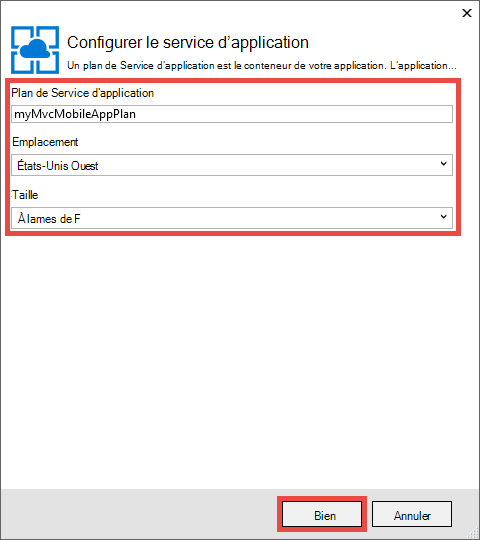
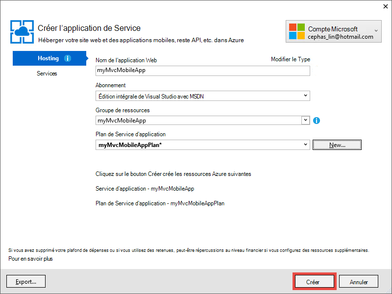

<properties 
    pageTitle="Déployer une application web mobile de 5 de MVC ASP.NET dans le Service d’application Azure" 
    description="Un didacticiel qui vous explique comment déployer une application web à un Service d’application Azure à l’aide des fonctionnalités mobiles dans une application web de ASP.NET MVC 5." 
    services="app-service" 
    documentationCenter=".net" 
    authors="cephalin" 
    manager="wpickett" 
    editor="jimbe"/>

<tags 
    ms.service="app-service" 
    ms.workload="na" 
    ms.tgt_pltfrm="na" 
    ms.devlang="dotnet" 
    ms.topic="article" 
    ms.date="01/12/2016" 
    ms.author="cephalin;riande"/>

# Déployer une application web mobile de 5 de MVC ASP.NET dans le Service d’application Azure

Ce didacticiel vous apprendra les notions de base comment générer une application web ASP.NET MVC 5 qui est compatible avec mobile et le déployer sur le Service d’application Azure. Pour ce didacticiel, vous avez besoin de [Visual Studio Express 2013 pour Web] [ Visual Studio Express 2013] ou l’édition professionnelle de Visual Studio, si vous avez déjà. Vous pouvez utiliser [Visual Studio 2015] , mais les captures d’écran sera différentes et vous devez utiliser les modèles de 4.x ASP.NET.

[AZURE.INCLUDE [create-account-and-websites-note](../../includes/create-account-and-websites-note.md)]

## Ce que vous allez générer

Pour ce didacticiel, vous allez ajouter des fonctionnalités mobiles à l’application de conférence-liste simple qui est fournie dans le [projet de démarrage][StarterProject]. La capture d’écran suivante montre les sessions ASP.NET dans l’application complète, comme dans l’émulateur de navigateur dans les outils de développement Internet Explorer 11 F12.

![][FixedSessionsByTag]

Vous pouvez utiliser les outils de développement Internet Explorer 11 F12 et l' [outil de Fiddler] [ Fiddler] pour aider à déboguer votre application. 

## Vous allez apprendre des compétences

Voici ce que vous apprendrez :

-   Explique comment utiliser Visual Studio 2013 pour publier votre application web directement dans une application web dans le Service d’application Azure.
-   Comment les modèles ASP.NET MVC 5 utilisent le framework d’amorçage de CSS pour améliorer l’affichage sur les périphériques mobiles
-   Comment faire pour créer des vues spécifiques au mobile pour cibler certains navigateurs mobiles, tels que les iPhone et Android
-   Comment créer des vues de réactifs (les vues qui répondent aux différents navigateurs sur les périphériques)

## Configurer l’environnement de développement

Configurer votre environnement de développement en installant le Kit de développement Azure pour .NET 2.5.1 ou version ultérieure. 

1. Pour installer le SDK Azure pour .NET, cliquez sur le lien ci-dessous. Si vous n’avez pas Visual Studio 2013 encore installé, il sera installé par le lien. Ce didacticiel requiert Visual Studio 2013. [Azure SDK pour Visual Studio 2013][AzureSDKVs2013]
1. Dans la fenêtre de Web Platform Installer, cliquez sur **installer** et poursuivre l’installation.

Vous aurez également besoin d’un émulateur de navigateur mobile. Utilisez une des opérations suivantes :

-   Émulateur de navigateur dans [les outils de développement Internet Explorer 11 F12] [ EmulatorIE11] (utilisée dans toutes les captures d’écran de navigateur mobile). Il a des présélections de chaîne d’agent utilisateur pour Windows Phone 8, Windows Phone 7 et iPad d’Apple.
-   Émulateur de navigateur dans [Google Chrome DevTools][EmulatorChrome]. Il contient des paramètres prédéfinis pour nombreux appareils Android, ainsi que Apple iPhone, iPad d’Apple et feu de Kindle d’Amazon. Il émule également des événements tactiles.
-   [Émulateur Mobile d’Opera][EmulatorOpera]

Les projets Visual Studio avec C\# code source est disponible pour accompagner cette rubrique :

-   [Téléchargement de projet Starter][StarterProject]
-   [Téléchargement du projet terminé][CompletedProject]

##Déployer le projet de démarrage pour une application web Azure

1.  Télécharger l' application de conférence-annonce [projet de démarrage][StarterProject].

2.  Puis, dans l’Explorateur Windows, cliquez sur le fichier ZIP téléchargé et choisissez *Propriétés*.

3.  Dans la boîte de dialogue **Propriétés** , cliquez sur le bouton **Débloquer** . (Le déblocage empêche un avertissement de sécurité qui se produit lorsque vous essayez d’utiliser un fichier *.zip* que vous avez téléchargé à partir du web.)

4.  Cliquez sur le fichier ZIP et sélectionnez **Extraire tout** pour décompresser le fichier. 

5.  Dans Visual Studio, ouvrez le fichier *C#\Mvc5Mobile.sln* .

6.  Dans l’Explorateur de solutions, cliquez sur le projet, puis cliquez sur **Publier**.

    ![][DeployClickPublish]

7.  De publier le site Web, cliquez sur **Service d’application Microsoft Azure**.

    ![][DeployClickWebSites]

8.  Si vous n’avez pas encore ouvert dans Azure, cliquez sur **Ajouter un compte**.

    ![][DeploySignIn]

9.  Suivez les invites pour vous connecter à votre compte Azure.

11. La boîte de dialogue Service d’application doit maintenant vous montrer comme connecté. Cliquez sur **Nouveau**.

    ![][DeployNewWebsite]  

12. Dans le champ **Nom de l’application Web** , spécifier un préfixe de nom d’application unique. Le nom de votre application web de qualifié sera * &lt;préfixe >*. azurewebsites.net. En outre, sélectionnez ou spécifiez un nouveau nom de groupe de ressources dans le **groupe de ressources**. Puis, cliquez sur **Nouveau** pour créer un nouveau plan de Service de l’application.

    ![][DeploySiteSettings]

13. Configurez le nouveau plan de Service de l’application et cliquez sur **OK**. 

    

13. Dans la boîte de dialogue de création de Service App, cliquez sur **créer**.

     

13. Après l’Azure ressources sont créées, la publication sur le Web dialogue sera rempli avec les paramètres de votre nouvelle application. Cliquez sur **Publier**.

    ![][DeployPublishSite]

    Une fois que Visual Studio a terminé de publier le projet de démarrage pour l’application web d’Azure, le navigateur de bureau s’ouvre pour afficher l’application web en direct.

14. Démarrez votre émulateur de navigateur mobile, copiez l’URL de l’application de conférence (*<prefix>*. azurewebsites.net) dans l’émulateur, puis cliquez sur le bouton supérieur droit et sélectionnez **Parcourir par balise**. Si vous utilisez Internet Explorer 11 comme navigateur par défaut, il vous suffit de taper `F12`, puis `Ctrl+8`, puis modifiez le profil de navigateur pour **Windows Phone**. L’illustration ci-dessous indique la vue *AllTags* en mode portrait (à partir d’en choisissant **Parcourir par balise**).

    ![][AllTags]

>[AZURE.TIP] Alors que vous pouvez déboguer votre application MVC 5 à partir de Visual Studio, vous pouvez publier votre application web vers Azure à nouveau pour vérifier l’application web en ligne directement à partir de votre navigateur mobile ou un émulateur de navigateur.

L’affichage est très lisible sur un périphérique mobile. Vous voyez également déjà certains effets visuels appliqués par le framework d’amorçage CSS.
Cliquez sur le lien **d’ASP.NET** .

![][SessionsByTagASP.NET]

L’affichage de la balise ASP.NET est équipé de zoom à l’écran, ce qui amorce le fait automatiquement pour vous. Toutefois, vous pouvez améliorer cette vue pour l’adapter le navigateur mobile. Par exemple, la colonne de **Date** est difficile à lire. Plus loin dans le didacticiel, vous allez remplacer la vue de *AllTags* pour les rendre compatibles avec les mobiles.

##Framework CSS d’amorçage

Nouveau dans le MVC 5 modèle est prise en charge d’amorçage intégrée. Vous avez déjà vu comment il améliore les différents affichages dans votre application. Par exemple, la barre de navigation en haut est automatiquement réduite lorsque la largeur du navigateur est plus petite. Dans le navigateur de bureau, essayez de redimensionner la fenêtre du navigateur et voir comment la barre de navigation modifie son apparence. Il s’agit de la conception web réactive qui est intégrée dans les données d’amorçage.

Pour voir l’aspect de l’application Web sans les données d’amorçage, ouvrez *App\_Démarrer\\BundleConfig.cs* et commentez les lignes qui contiennent des *bootstrap.js* et *bootstrap.css*. Le code suivant illustre les deux dernières instructions de le `RegisterBundles` méthode après la modification :

     bundles.Add(new ScriptBundle("~/bundles/bootstrap").Include(
              //"~/Scripts/bootstrap.js",
              "~/Scripts/respond.js"));

    bundles.Add(new StyleBundle("~/Content/css").Include(
              //"~/Content/bootstrap.css",
              "~/Content/site.css"));

Appuyez sur la touche `Ctrl+F5` pour exécuter l’application.

Notez que la barre de navigation réductible est maintenant simplement une liste non triée ordinaire. Cliquez à nouveau sur **Parcourir par balise** , puis cliquez sur **ASP.NET**.
Dans la vue d’émulateur mobile, vous pouvez voir qu’il n’est plus monté de zoom à l’écran, et vous devez accéder sur le côté pour voir la partie droite de la table.

![][SessionsByTagASP.NETNoBootstrap]

Annuler vos modifications et actualiser le navigateur mobile pour vérifier que l’affichage compatibles avec les mobiles a été restaurée.

Données d’amorçage ne sont pas spécifique à ASP.NET MVC 5, et vous pouvez tirer parti de ces fonctionnalités dans une application web. Mais il est désormais disponible dans le modèle de projet ASP.NET MVC 5, afin que votre application MVC 5 Web peut tirer parti des données d’amorçage par défaut.

Pour plus d’informations sur les données d’amorçage, accédez à l' [amorce] [ BootstrapSite] site.

Dans la section suivante, vous verrez comment fournir des vues spécifiques du navigateur mobile.

##Substituer des vues, des mises en page et des vues partielles

Vous pouvez substituer n’importe quel affichage (y compris les dispositions et les vues partielles) pour les navigateurs mobiles en général, pour un navigateur mobile individuel, ou pour n’importe quel navigateur spécifique. Pour fournir un affichage spécifique au mobile, vous pouvez copier un fichier de vue et ajoutez *. Mobile* au nom du fichier. Par exemple, pour créer une vue *Index* mobile, vous pouvez copier *vues\\Home\\Index.cshtml* à *des vues\\Home\\Index.Mobile.cshtml*.

Dans cette section, vous allez créer un fichier de disposition de mobiles spécifiques.

Pour commencer, vous devez copier *vues\\Shared\\\_Layout.cshtml* à *des vues\\Shared\\\_Layout.Mobile.cshtml*. Ouvrir * \_Layout.Mobile.cshtml* et modifier le titre de **l’Application de MVC5** à **MVC5 Application (Mobile)**.

Dans chaque `Html.ActionLink` appeler pour la barre de navigation, supprimer « Parcourir par » à chaque lien *ActionLink*. Le code suivant illustre la fin `<ul class="nav navbar-nav">` balises du fichier mise en page mobile.

    <ul class="nav navbar-nav">
        <li>@Html.ActionLink("Home", "Index", "Home")</li>
        <li>@Html.ActionLink("Date", "AllDates", "Home")</li>
        <li>@Html.ActionLink("Speaker", "AllSpeakers", "Home")</li>
        <li>@Html.ActionLink("Tag", "AllTags", "Home")</li>
    </ul>

Copie la *vues\\Home\\AllTags.cshtml* fichier *vues\\Home\\AllTags.Mobile.cshtml*. Ouvrez le nouveau fichier et modifiez le `<h2>` élément de « Balises » à « balises (M) » :

    <h2>Tags (M)</h2>

Accédez à la page des balises à l’aide d’un navigateur de bureau et l’émulateur de navigateur mobile. L’émulateur de navigateur mobile affiche les deux modifications apportées (le titre de * \_Layout.Mobile.cshtml* et le titre à partir de *AllTags.Mobile.cshtml*).

![][AllTagsMobile_LayoutMobile]

En revanche, l’affichage du bureau n’a pas été modifié (avec des titres de * \_Layout.cshtml* et *AllTags.cshtml*).

![][AllTagsMobile_LayoutMobileDesktop]

##Créer des vues spécifiques au navigateur

En plus des vues spécifiques au mobile et de bureau spécifiques, vous pouvez créer des vues pour un navigateur donné. Par exemple, vous pouvez créer des vues qui sont spécifiquement conçus pour l’iPhone ou le navigateur Android. Dans cette section, vous allez créer une disposition pour le navigateur iPhone et une version iPhone de la vue *AllTags* .

Ouvrez le fichier *Global.asax* et ajoutez le code suivant à la fin de la `Application_Start` méthode.

    DisplayModeProvider.Instance.Modes.Insert(0, new DefaultDisplayMode("iPhone")
    {
        ContextCondition = (context => context.GetOverriddenUserAgent().IndexOf
            ("iPhone", StringComparison.OrdinalIgnoreCase) >= 0)
    });

Ce code définit un nouveau mode d’affichage appelé « iPhone », ce qui correspond à chaque demande entrante. Si la demande entrante correspond à la condition que vous avez défini (autrement dit, si l’agent utilisateur contient la chaîne « iPhone »), ASP.NET MVC recherchera les vues dont le nom contient le suffixe « iPhone ».

>[AZURE.NOTE] Lorsque vous ajoutez des modes d’affichage de spécifiques au navigateur mobile, par exemple pour l’iPhone et Android, veillez à définir le premier argument `0` (insérer en haut de la liste) pour vous assurer que le mode navigateur spécifique est prioritaire sur le modèle de mobile (*. Mobile.cshtml). Si le modèle mobile est en haut de la liste au lieu de cela, il sera sélectionné sur votre mode d’affichage souhaité (la première correspondance l’emporte et le modèle mobile correspond à tous les navigateurs mobiles). 

Dans le code, cliquez sur `DefaultDisplayMode`, cliquez sur **résoudre**, puis choisissez `using System.Web.WebPages;`. Cela ajoute une référence à la `System.Web.WebPages` espace de noms où les `DisplayModeProvider` et `DefaultDisplayMode` les types sont définis.

![][ResolveDefaultDisplayMode]

Vous pouvez également ajouter simplement manuellement la ligne suivante à la `using` section du fichier.

    using System.Web.WebPages;

Enregistrer les modifications. Copie la *vues\\Shared\\\_Layout.Mobile.cshtml* fichier de *vues\\Shared\\\_Layout.iPhone.cshtml*. Ouvrir le nouveau fichier et modifiez le titre de `MVC5 Application (Mobile)` à `MVC5 Application (iPhone)`.

Copie la *vues\\Home\\AllTags.Mobile.cshtml* fichier *vues\\Home\\AllTags.iPhone.cshtml*. Dans le nouveau fichier, modifier la `<h2>` élément de « balises (M) » à « Balises (iPhone) ».

Exécutez l’application. Exécutez un émulateur de navigateur mobile, assurez-vous que l’agent utilisateur est défini sur « iPhone » et accédez à la vue *AllTags* . Si vous utilisez l’émulateur dans les outils de développement Internet Explorer 11 F12, configurer l’émulation à ce qui suit :

-   Profil de navigateur = **Windows Phone**
-   Chaîne d’agent utilisateur = **personnalisé**
-   Chaîne personnalisée = **Apple-iPhone5C1/1001.525**

La capture d’écran suivante montre le mode de *AllTags* restitué dans l’émulateur dans les outils de développement Internet Explorer 11 F12 avec la chaîne d’agent utilisateur (il s’agit d’une chaîne d’agent utilisateur iPhone 5 C).

![][AllTagsIPhone_LayoutIPhone]

Dans le navigateur mobile, sélectionnez le lien **haut-parleurs** . Car il n’est pas un affichage mobile (*AllSpeakers.Mobile.cshtml*), la vue de haut-parleurs par défaut (*AllSpeakers.cshtml*) est restituée à l’aide de la vue de la mise en page mobile (*\_Layout.Mobile.cshtml*). Comme illustré ci-dessous, le titre de **L’Application MVC5 (Mobile)** est défini dans * \_Layout.Mobile.cshtml*.

![][AllSpeakers_LayoutMobile]

Vous pouvez désactiver globalement l’affichage par défaut (non mobile) de rendu à l’intérieur d’une page mobile en affectant `RequireConsistentDisplayMode` à `true` dans les *des vues\\\_ViewStart.cshtml* fichier, comme suit :

    @{
        Layout = "~/Views/Shared/_Layout.cshtml";
        DisplayModeProvider.Instance.RequireConsistentDisplayMode = true;
    }

Lors de la `RequireConsistentDisplayMode` a `true`, la mise en page mobile (*\_Layout.Mobile.cshtml*) est utilisé uniquement pour les affichages mobiles (c'est-à-dire lorsque le fichier de vue est de la forme * **ViewName**. Mobile.cshtml*). Vous souhaiterez peut-être définir `RequireConsistentDisplayMode` à `true` si votre disposition mobile ne fonctionne pas correctement avec les vues non mobiles. La capture d’écran ci-dessous montre comment s’affiche la page de *haut-parleurs* lorsque `RequireConsistentDisplayMode` a `true` (sans la chaîne « (Mobile) » dans la barre de navigation en haut).

![][AllSpeakers_LayoutMobileOverridden]

Vous pouvez désactiver le mode de cohérence de l’affichage dans une vue spécifique en définissant `RequireConsistentDisplayMode` à `false` dans le fichier de vue. Le balisage suivant dans la *des vues\\Home\\AllSpeakers.cshtml* fichier définit `RequireConsistentDisplayMode` à `false`:

    @model IEnumerable<string>

    @{
        ViewBag.Title = "All speakers";
        DisplayModeProvider.Instance.RequireConsistentDisplayMode = false;
    }

Dans cette section, nous avons vu comment créer des vues et des mises en page mobiles et comment créer des vues pour des périphériques spécifiques, tels que l’iPhone et mises en page.
Toutefois, le principal avantage de l’infrastructure d’amorçage CSS est la disposition réactive, ce qui signifie qu’une seule feuille de style peut être appliqué sur le bureau, téléphone et navigateurs du Tablet PC pour créer une apparence cohérente. Dans la section suivante, vous verrez comment tirer parti des données d’amorçage pour créer des vues compatibles avec les mobiles.

##Améliorer la liste de haut-parleurs

Comme vous venez de le voir, la vue de *haut-parleurs* est lisible, mais les liens sont de petite taille et sont difficiles à exploiter sur un périphérique mobile. Dans cette section, vous effectuerez la vue *AllSpeakers* compatibles avec les mobiles, qui affiche des liens importants, robinet facile et contient une zone de recherche pour trouver rapidement des haut-parleurs.

Vous pouvez utiliser le style de [groupe de la liste liée][] de données d’amorçage pour améliorer l’affichage des *haut-parleurs* . Dans *des vues\\Home\\AllSpeakers.cshtml*, remplacez le contenu du fichier Razor par le code ci-dessous.

     @model IEnumerable<string>

    @{
        ViewBag.Title = "All Speakers";
    }

    <h2>Speakers</h2>

    

        @foreach (var speaker in Model)
        {
            @Html.ActionLink(speaker, "SessionsBySpeaker", new { speaker }, new { @class = "list-group-item" })
        }
    

Le `class="list-group"` l’attribut dans le `
` balise s’applique le style de la liste des données d’amorçage et le `class="input-group-item"` attribut s’applique le style d’élément de liste d’amorçage à chaque lien.

Actualiser le navigateur mobile. Le mode de mise à jour ressemble à ceci :

![][AllSpeakersFixed]

Le style de [groupe de la liste liée][] de données d’amorçage rend la zone entière pour chaque lien interactif, qui est une bien meilleure expérience utilisateur. Basculer vers l’affichage du bureau et observer l’apparence.

![][AllSpeakersFixedDesktop]

La vue navigateur mobile s’est améliorée, mais il est difficile de parcourir la longue liste des haut-parleurs. Une recherche filtre fonctionnalités out-de-l’emploi ne fournissent pas de données d’amorçage, mais vous pouvez l’ajouter avec quelques lignes de code. Vous allez tout d’abord ajouter une zone de recherche à la vue, puis raccorder avec le code JavaScript de la fonction de filtre. Dans *vues\\Home\\AllSpeakers.cshtml*, ajouter un \<écran\> juste après la balise le \<h2\> de la balise, comme indiqué ci-dessous :

    @model IEnumerable<string>

    @{
        ViewBag.Title = "All Speakers";
    }

    <h2>Speakers</h2>

    <form class="input-group">
        
        <input type="text" class="form-control" placeholder="Search speaker">
    </form>
     
    

        @foreach (var speaker in Model)
        {
            @Html.ActionLink(speaker, 
                             "SessionsBySpeaker", 
                             new { speaker }, 
                             new { @class = "list-group-item" })
        }
    

Notez que la `<form>` et `<input>` balises à la fois les données d’amorçage styles sont appliqués leur. Le `` élément ajoute une [glyphicon][] de données d’amorçage vers la zone de recherche.

Dans le dossier *Scripts* , ajoutez un fichier JavaScript appelé *filter.js*. Ouvrez le fichier et collez le code suivant :

    $(function () {

        // reset the search form when the page loads
        $("form").each(function () {
            this.reset();
        });

        // wire up the events to the <input> element for search/filter
        $("input").bind("keyup change", function () {
            var searchtxt = this.value.toLowerCase();
            var items = $(".list-group-item");

            // show all speakers that begin with the typed text and hide others
            for (var i = 0; i < items.length; i++) {
                var val = items[i].text.toLowerCase();
                val = val.substring(0, searchtxt.length);
                if (val == searchtxt) {
                    $(items[i]).show();
                }
                else {
                    $(items[i]).hide();
                }
            }
        });
    });

Vous devez également inclure filter.js dans vos offres enregistrés. Ouvrir *App\_Démarrer\\BundleConfig.cs* et modifier les lots en premier. Modifier la première `bundles.Add` instruction (pour l’offre groupée de **jquery** ) pour inclure *Scripts\\filter.js*, comme suit :

     bundles.Add(new ScriptBundle("~/bundles/jquery").Include(
                "~/Scripts/jquery-{version}.js",
                "~/Scripts/filter.js"));

L’offre groupée de **jquery** est déjà restituée par la valeur par défaut * \_mise en* vue. Par la suite, vous pouvez utiliser le même code JavaScript pour appliquer la fonctionnalité de filtre à d’autres vues de la liste.

Actualiser le navigateur mobile et passez à la vue *AllSpeakers* . Dans la zone Rechercher, tapez « sc ». La liste des haut-parleurs doit maintenant être filtrée en fonction de votre chaîne de recherche.

![][AllSpeakersFixedSearchBySC]

##Améliorer la liste balises

Comme le mode des *haut-parleurs* , l’affichage de *balises* est lisible, mais les liens sont petites et difficiles à exploiter sur un périphérique mobile. Vous pouvez corriger l’affichage de *balises* de la même façon que vous corrigez le mode des *haut-parleurs* , si vous utilisez les modifications de code décrites précédemment, mais avec les éléments suivants `Html.ActionLink` syntaxe de la méthode de *les vues\\Home\\AllTags.cshtml*:

    @Html.ActionLink(tag, 
                     "SessionsByTag", 
                     new { tag }, 
                     new { @class = "list-group-item" })

Le navigateur de bureau actualisé se présente comme suit :

![][AllTagsFixedDesktop]

Et le navigateur mobile actualisé se présente comme suit : 

![][AllTagsFixed]

>[AZURE.NOTE] Si vous remarquez que la mise en forme de liste d’origine est toujours présent dans le navigateur mobile et demandez qu’est-il arrivé à votre style d’amorçage de nice, il s’agit d’un artefact de votre action antérieure à créer des affichages mobiles spécifiques. Toutefois, maintenant que vous utilisez le framework d’amorçage CSS pour créer une conception web réactive, passez la tête et supprimer ces vues spécifiques au mobile et les vues mobile spécifique. Une fois que vous l’avez fait, le navigateur mobile actualisé affiche le style d’amorçage.

##Améliorer la liste de Dates

Vous pouvez améliorer l’affichage de *Dates* comme vous amélioré les vues des *balises* et des *haut-parleurs* si vous utilisez les modifications de code décrites précédemment, mais avec les éléments suivants `Html.ActionLink` syntaxe de la méthode de *les vues\\Home\\AllDates.cshtml*:

    @Html.ActionLink(date.ToString("ddd, MMM dd, h:mm tt"), 
                     "SessionsByDate", 
                     new { date }, 
                     new { @class = "list-group-item" })

Vous obtenez une vue actualisée de navigateur mobile comme suit :

![][AllDatesFixed]

Vous pouvez encore améliorer l’affichage des *Dates* en organisant les valeurs de date et d’heure en date. Ceci est possible avec le style d’amorçage [panneaux][] . Remplacez le contenu de la *des vues\\accueil\\AllDates.cshtml* fichier par le code suivant :

    @model IEnumerable<DateTime>

    @{
        ViewBag.Title = "All Dates";
    }

    <h2>Dates</h2>

    @foreach (var dategroup in Model.GroupBy(x=>x.Date))
    {
        

            

                @dategroup.Key.ToString("ddd, MMM dd")
            

            

                @foreach (var date in dategroup)
                {
                    @Html.ActionLink(date.ToString("h:mm tt"), 
                                     "SessionsByDate", 
                                     new { date }, 
                                     new { @class = "list-group-item" })
                }
            

        

    }

Ce code crée une nouvelle `
` balise pour chaque date distinct dans la liste et utilise le [groupe de la liste liée][] pour les liens respectifs, comme avant. Voici à quoi ressemble le navigateur mobile lorsque ce code s’exécute :

![][AllDatesFixed2]

Basculez vers le navigateur de bureau. Là encore, notez l’aspect cohérent.

![][AllDatesFixed2Desktop]

##Améliorer l’affichage SessionsTable

Dans cette section, vous effectuerez la vue *SessionsTable* plus compatibles avec les mobiles. Cette modification est plus complète les modifications précédentes.

Dans le navigateur mobile, cliquez sur le bouton de la **balise** , puis entrez `asp` dans la zone de recherche.

![][AllTagsFixedSearchByASP]

Cliquez sur le lien **d’ASP.NET** .

![][SessionsTableTagASP.NET]

Comme vous pouvez le constater, l’affichage est mis en forme sous forme de tableau, qui est actuellement conçu pour être affichés dans le navigateur de bureau. Toutefois, il est un peu difficile à lire sur un navigateur mobile. Pour résoudre ce problème, ouvrez *vues\\Home\\SessionsTable.cshtml* , puis remplacez le contenu du fichier par le code suivant :

    @model IEnumerable<Mvc5Mobile.Models.Session>

    <h2>@ViewBag.Title</h2>

    

        

            @foreach (var session in Model)
            {
                

                    

                        @Html.ActionLink(session.Title, 
                                         "SessionByCode", 
                                         new { session.Code }, 
                                         new { @class="list-group-item active" })
                        

                            

                                @Html.Partial("_SpeakersLinks", session)
                            

                            

                                @session.DateText
                            

                            

                                @Html.Partial("_TagsLinks", session)
                            

                        

                    

                

            }
        

    

Le code fait les 3 choses :

-   utilise le Bootstrap [groupe personnalisé liste liés][] à mettre en forme les informations de session verticalement, afin que toutes ces informations sont lisibles sur un navigateur mobile (à l’aide des classes de liste-groupe--texte de l’élément)
-   applique le [système de grille][] pour la disposition, afin que les éléments de la session de flux horizontalement dans le navigateur de bureau et verticalement dans le navigateur mobile (à l’aide de la classe col-md-4)
-   utilise les [utilitaires réactives][] pour masquer les balises de session lorsqu’il est affiché dans le navigateur mobile (à l’aide de la classe masquée-xs)

Vous pouvez également cliquer sur un lien vers le titre pour accéder à la session respectif. L’image ci-dessous indique les modifications du code.

![][FixedSessionsByTag]

Le système de grille d’amorçage que vous avez appliqué automatiquement Réorganise les sessions verticalement dans le navigateur mobile. Notez également que les balises ne sont pas affichés. Basculez vers le navigateur de bureau.

![][SessionsTableFixedTagASP.NETDesktop]

Dans le navigateur de bureau, notez que les balises sont maintenant affichés. En outre, vous pouvez voir que le système de grille d’amorçage que vous avez appliqué réorganise les éléments de la session dans deux colonnes. Si vous agrandissez le navigateur, vous verrez que la disposition change à trois colonnes.

##Améliorer l’affichage SessionByCode

Enfin, vous allez résoudre la vue *SessionByCode* pour les rendre compatibles avec les mobiles.

Dans le navigateur mobile, cliquez sur le bouton de la **balise** , puis entrez `asp` dans la zone de recherche.

![][AllTagsFixedSearchByASP]

Cliquez sur le lien **d’ASP.NET** . Sessions de la balise ASP.NET sont affichées.

![][FixedSessionsByTag]

Cliquez sur le lien de **Création d’une Application à une Page ASP.NET et AngularJS** .

![][SessionByCode3-644]

L’affichage du bureau par défaut fonctionne correctement, mais vous pouvez facilement améliorer l’apparence à l’aide de certains composants de l’interface utilisateur graphique du programme d’amorçage.

Ouvrir *vues\\Home\\SessionByCode.cshtml* et remplacez le contenu par le balisage suivant :

    @model Mvc5Mobile.Models.Session

    @{
        ViewBag.Title = "Session details";
    }
    <h3>@Model.Title (@Model.Code)</h3>
    

        <strong>@Model.DateText</strong> in <strong>@Model.Room</strong>
    

    

        

            Speakers
        

        @foreach (var speaker in Model.Speakers)
        {
            @Html.ActionLink(speaker, 
                             "SessionsBySpeaker", 
                             new { speaker }, 
                             new { @class="panel-body" })
        }
    

    
@Model.Abstract

    

        

            Tags
        

        @foreach (var tag in Model.Tags)
        {
            @Html.ActionLink(tag, 
                             "SessionsByTag", 
                             new { tag }, 
                             new { @class = "panel-body" })
        }
    

Le balisage utilise des panneaux d’amorçage style pour améliorer l’affichage mobile. 

Actualiser le navigateur mobile. L’image suivante reflète les modifications de code que vous venez de créer :

![][SessionByCodeFixed3-644]

## Empaqueter et passer en revue

Ce didacticiel vous a montré comment utiliser ASP.NET MVC 5 pour développer des applications Web compatibles avec les mobiles. Celles-ci comprennent :

-   Déployer une application ASP.NET MVC 5 à un Service d’application web app
-   Utiliser des données d’amorçage pour créer un mode réactif web dans votre application MVC 5
-   Remplacer la mise en page, des vues et des vues partielles, à la fois globale et une vue individuelle
-   Disposition de contrôles et partiel substituent l’application à l’aide de la `RequireConsistentDisplayMode` propriété
-   Créer des vues qui ciblent les navigateurs spécifiques, tels que le navigateur iPhone
-   Appliquer des styles d’amorçage dans le code Razor

## Voir aussi

-   [9 principes fondamentaux de la conception web réactive](http://blog.froont.com/9-basic-principles-of-responsive-web-design/)
-   [Données d’amorçage][BootstrapSite]
-   [Blog officiel de données d’amorçage][]
-   [Didacticiel d’amorçage Twitter République du didacticiel][]
-   [Le terrain de jeu de données d’amorçage][]
-   [Meilleures pratiques W3C Recommendation Mobile Web applications][]
-   [Recommandation candidat de W3C pour les requêtes de média][]

## Ce qui a changé
* Pour obtenir un guide pour la modification de sites Web au Service de l’application voir : [Service d’application Azure et son Impact sur les Services Azure existants](http://go.microsoft.com/fwlink/?LinkId=529714)

<!-- Internal Links -->
[Deploy the starter project to an Azure web app]: #bkmk_DeployStarterProject
[Bootstrap CSS Framework]: #bkmk_bootstrap
[Override the Views, Layouts, and Partial Views]: #bkmk_overrideviews
[Create Browser-Specific Views]:#bkmk_browserviews
[Improve the Speakers List]: #bkmk_Improvespeakerslist
[Improve the Tags List]: #bkmk_improvetags
[Improve the Dates List]: #bkmk_improvedates
[Improve the SessionsTable View]: #bkmk_improvesessionstable
[Improve the SessionByCode View]: #bkmk_improvesessionbycode

<!-- External Links -->
[Visual Studio Express 2013]: http://www.visualstudio.com/downloads/download-visual-studio-vs#d-express-web
[Visual Studio 2015]: https://www.visualstudio.com/downloads/download-visual-studio-vs
[AzureSDKVs2013]: http://go.microsoft.com/fwlink/p/?linkid=323510&clcid=0x409
[Fiddler]: http://www.fiddler2.com/fiddler2/
[EmulatorIE11]: http://msdn.microsoft.com/library/ie/dn255001.aspx
[EmulatorChrome]: https://developers.google.com/chrome-developer-tools/docs/mobile-emulation
[EmulatorOpera]: http://www.opera.com/developer/tools/mobile/
[StarterProject]: http://go.microsoft.com/fwlink/?LinkID=398780&clcid=0x409
[CompletedProject]: http://go.microsoft.com/fwlink/?LinkID=398781&clcid=0x409
[BootstrapSite]: http://getbootstrap.com/
[WebPIAzureSdk23NetVS13]: ./media/web-sites-dotnet-deploy-aspnet-mvc-mobile-app/WebPIAzureSdk23NetVS13.png
[groupe de la liste liée]: http://getbootstrap.com/components/#list-group-linked
[glyphicon]: http://getbootstrap.com/components/#glyphicons
[panneaux]: http://getbootstrap.com/components/#panels
[groupe de la liste liée personnalisée]: http://getbootstrap.com/components/#list-group-custom-content
[système de grille]: http://getbootstrap.com/css/#grid
[utilitaires de réactifs]: http://getbootstrap.com/css/#responsive-utilities
[Blog officiel de données d’amorçage]: http://blog.getbootstrap.com/
[Didacticiel d’amorçage Twitter République du didacticiel]: http://www.tutorialrepublic.com/twitter-bootstrap-tutorial/
[Le terrain de jeu de données d’amorçage]: http://www.bootply.com/
[Meilleures pratiques W3C Recommendation Mobile Web applications]: http://www.w3.org/TR/mwabp/
[Recommandation candidat de W3C pour les requêtes de média]: http://www.w3.org/TR/css3-mediaqueries/

<!-- Images -->
[DeployClickPublish]: ./media/web-sites-dotnet-deploy-aspnet-mvc-mobile-app/deploy-to-azure-website-1.png
[DeployClickWebSites]: ./media/web-sites-dotnet-deploy-aspnet-mvc-mobile-app/deploy-to-azure-website-2.png
[DeploySignIn]: ./media/web-sites-dotnet-deploy-aspnet-mvc-mobile-app/deploy-to-azure-website-3.png
[DeployUsername]: ./media/web-sites-dotnet-deploy-aspnet-mvc-mobile-app/deploy-to-azure-website-4.png
[DeployPassword]: ./media/web-sites-dotnet-deploy-aspnet-mvc-mobile-app/deploy-to-azure-website-5.png
[DeployNewWebsite]: ./media/web-sites-dotnet-deploy-aspnet-mvc-mobile-app/deploy-to-azure-website-6.png
[DeploySiteSettings]: ./media/web-sites-dotnet-deploy-aspnet-mvc-mobile-app/deploy-to-azure-website-7.png
[DeployPublishSite]: ./media/web-sites-dotnet-deploy-aspnet-mvc-mobile-app/deploy-to-azure-website-8.png
[MobileHomePage]: ./media/web-sites-dotnet-deploy-aspnet-mvc-mobile-app/mobile-home-page.png
[FixedSessionsByTag]: ./media/web-sites-dotnet-deploy-aspnet-mvc-mobile-app/SessionsByTag-ASP.NET-Fixed.png
[AllTags]: ./media/web-sites-dotnet-deploy-aspnet-mvc-mobile-app/AllTags.png
[SessionsByTagASP.NET]: ./media/web-sites-dotnet-deploy-aspnet-mvc-mobile-app/SessionsByTag-ASP.NET.png
[SessionsByTagASP.NETNoBootstrap]: ./media/web-sites-dotnet-deploy-aspnet-mvc-mobile-app/SessionsByTag-ASP.NET-NoBootstrap.png
[AllTagsMobile_LayoutMobile]: ./media/web-sites-dotnet-deploy-aspnet-mvc-mobile-app/AllTagsMobile-_LayoutMobile.png
[AllTagsMobile_LayoutMobileDesktop]: ./media/web-sites-dotnet-deploy-aspnet-mvc-mobile-app/AllTagsMobile-_LayoutMobile-Desktop.png
[ResolveDefaultDisplayMode]: ./media/web-sites-dotnet-deploy-aspnet-mvc-mobile-app/Resolve-DefaultDisplayMode.png
[AllTagsIPhone_LayoutIPhone]: ./media/web-sites-dotnet-deploy-aspnet-mvc-mobile-app/AllTagsIPhone-_LayoutIPhone.png
[AllSpeakers_LayoutMobile]: ./media/web-sites-dotnet-deploy-aspnet-mvc-mobile-app/AllSpeakers-_LayoutMobile.png
[AllSpeakers_LayoutMobileOverridden]: ./media/web-sites-dotnet-deploy-aspnet-mvc-mobile-app/AllSpeakers-_LayoutMobile-Overridden.png
[AllSpeakersFixed]: ./media/web-sites-dotnet-deploy-aspnet-mvc-mobile-app/AllSpeakers-Fixed.png
[AllSpeakersFixedDesktop]: ./media/web-sites-dotnet-deploy-aspnet-mvc-mobile-app/AllSpeakers-Fixed-Desktop.png
[AllSpeakersFixedSearchBySC]: ./media/web-sites-dotnet-deploy-aspnet-mvc-mobile-app/AllSpeakers-Fixed-SearchBySC.png
[AllTagsFixedDesktop]: ./media/web-sites-dotnet-deploy-aspnet-mvc-mobile-app/AllTags-Fixed-Desktop.png 
[AllTagsFixed]: ./media/web-sites-dotnet-deploy-aspnet-mvc-mobile-app/AllTags-Fixed.png
[AllDatesFixed]: ./media/web-sites-dotnet-deploy-aspnet-mvc-mobile-app/AllDates-Fixed.png
[AllDatesFixed2]: ./media/web-sites-dotnet-deploy-aspnet-mvc-mobile-app/AllDates-Fixed2.png
[AllDatesFixed2Desktop]: ./media/web-sites-dotnet-deploy-aspnet-mvc-mobile-app/AllDates-Fixed2-Desktop.png
[AllTagsFixedSearchByASP]: ./media/web-sites-dotnet-deploy-aspnet-mvc-mobile-app/AllTags-Fixed-SearchByASP.png
[SessionsTableTagASP.NET]: ./media/web-sites-dotnet-deploy-aspnet-mvc-mobile-app/SessionsTable-Tag-ASP.NET.png
[SessionsTableFixedTagASP.NETDesktop]: ./media/web-sites-dotnet-deploy-aspnet-mvc-mobile-app/SessionsTable-Fixed-Tag-ASP.NET-Desktop.png
[SessionByCode3-644]: ./media/web-sites-dotnet-deploy-aspnet-mvc-mobile-app/SessionByCode-3-644.png
[SessionByCodeFixed3-644]: ./media/web-sites-dotnet-deploy-aspnet-mvc-mobile-app/SessionByCode-Fixed-3-644.png
 
