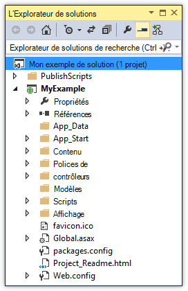

<properties
    pageTitle="Déployer une application ASP.NET au Service d’application Azure à l’aide de Visual Studio | Microsoft Azure"
    description="Découvrez comment déployer un projet web d’ASP.NET à une nouvelle application web dans le Service d’application Azure, à l’aide de Visual Studio."
    services="app-service\web"
    documentationCenter=".net"
    authors="tdykstra"
    manager="wpickett"
    editor=""/>

<tags
    ms.service="app-service-web"
    ms.workload="web"
    ms.tgt_pltfrm="na"
    ms.devlang="dotnet"
    ms.topic="get-started-article"
    ms.date="07/22/2016"
    ms.author="rachelap"/>

# Déployer une application web ASP.NET au Service d’application Azure, à l’aide de Visual Studio

[AZURE.INCLUDE [tabs](../../includes/app-service-web-get-started-nav-tabs.md)]

## Vue d’ensemble

Ce didacticiel montre comment déployer une application web ASP.NET pour une [application web dans le Service d’application Azure](app-service-web-overview.md) à l’aide de Visual Studio 2015.

Ce didacticiel suppose que vous êtes un développeur ASP.NET disposant d’aucune expérience antérieure d’à l’aide d’Azure. Lorsque vous avez terminé, vous aurez une application web simple et en cours d’exécution dans le nuage.

Vous apprendrez à :

* Comment créer une nouvelle application de web Service de l’application lorsque vous créez un nouveau projet web dans Visual Studio.
* Explique comment déployer un projet web à un Service d’application web app à l’aide de Visual Studio.

Le diagramme illustre les opérations dans le didacticiel.

À la fin du didacticiel, une section de [dépannage](#troubleshooting) fournit des idées sur la procédure à suivre si quelque chose ne fonctionne pas, et une section [étapes suivantes](#next-steps) fournit des liens vers les autres didacticiels qui passe en plus de détails sur l’utilisation des services d’application Azure.

Comme il s’agit d’un didacticiel mise en route, le projet web qu'il indique comment déployer est simple qui n’utilise pas une base de données et ne fait pas l’authentification ni autorisation. Pour des liens vers des rubriques plus avancées de déploiement, consultez [comment déployer une application web Azure](web-sites-deploy.md).

Outre le temps nécessaire pour installer le SDK Azure pour .NET, ce didacticiel va prendre environ 10-15 minutes.

## Conditions préalables

* Ce didacticiel suppose que vous avez travaillé avec ASP.NET MVC et Visual Studio. Si vous avez besoin d’une introduction, consultez [Mise en route avec ASP.NET MVC 5](http://www.asp.net/mvc/overview/getting-started/introduction/getting-started).

* Vous avez besoin d’un compte Azure. Vous pouvez [Ouvrir un compte Azure gratuit](/pricing/free-trial/?WT.mc_id=A261C142F) ou [avantages d’abonné activation de Visual Studio](/pricing/member-offers/msdn-benefits-details/?WT.mc_id=A261C142F). 

    Si vous souhaitez commencer avec le Service d’application Azure avant de vous inscrivez pour un compte Azure, accédez à [Essayer le Service application](http://go.microsoft.com/fwlink/?LinkId=523751). Il vous pouvez créer une application starter de courte durée de vie dans le Service d’application : aucune carte de crédit requise et aucun des engagements.

## Configurer l’environnement de développement

Le didacticiel est écrit pour Visual Studio 2015 avec le [SDK Azure pour .NET](../dotnet-sdk.md) 2,9 ou une version ultérieure. 

* [Télécharger la dernière version du SDK Azure pour Visual Studio 2015](http://go.microsoft.com/fwlink/?linkid=518003). Le Kit de développement installe Visual Studio 2015 si vous ne l’avez déjà pas.

    >[AZURE.NOTE] Selon le nombre de dépendances SDK vous disposez sur votre ordinateur, l’installation du Kit de développement peut prendre du temps, de quelques minutes à une demi-heure ou plus.

Si vous avez Visual Studio 2013 et que vous préférez utiliser, vous pouvez [Télécharger la dernière version du SDK Azure pour Visual Studio 2013](http://go.microsoft.com/fwlink/?LinkID=324322). Certains écrans peuvent différer dans les illustrations.

## Configurer un nouveau projet web

L’étape suivante consiste à créer un projet web dans Visual Studio et d’une application web dans le Service d’application Azure. Dans cette section du didacticiel, vous configurez le nouveau projet web. 

1. Ouvrez Visual Studio 2015.

2. Cliquez sur **fichier > Nouveau > projet**.

3. Dans la boîte de dialogue **Nouveau projet** , cliquez sur **Visual C# > Web > ASP.NET Web Application**.

3. Assurez-vous que **.NET Framework 4.5.2** est sélectionné comme framework cible.

4.  [Idées d’Application Azure](../application-insights/app-insights-overview.md) surveille votre application web pour la disponibilité, de performances et d’utilisation. La case à cocher **Ajouter des idées Application au projet** est sélectionnée par défaut la première fois que vous créez un projet web après l’installation de Visual Studio. Désactivez la case à cocher si elle est sélectionnée, mais vous ne souhaitez pas essayez les perspectives de l’Application.

4. Nom de l’application **MyExample**, puis cliquez sur **OK**.

    

5. Dans la boîte de dialogue **Nouveau projet ASP.NET** , sélectionnez le modèle **MVC** , puis cliquez sur **Modifier l’authentification**.

    Pour ce didacticiel, vous déployez un projet web d’ASP.NET MVC. Si vous souhaitez savoir comment déployer un projet de l’API de Web ASP.NET, consultez la section [étapes suivantes](#next-steps) . 

    

6. Dans la boîte de dialogue **Modifier l’authentification** , cliquez sur **Aucune authentification**, puis cliquez sur **OK**.

    

    Pour ce didacticiel mise en route vous déployez une application simple qui ne fait pas de journal de l’utilisateur.

5. Dans la section **Microsoft Azure** de la boîte de dialogue **Nouveau projet ASP.NET** , assurez-vous que **l’hôte dans le nuage** est sélectionnée et que le **Service d’application** est sélectionnée dans la liste déroulante.

    

    Ces paramètres directement de Visual Studio pour créer une application web Azure pour votre projet web.

6. Cliquez sur **OK**

## Configurer les ressources Azure pour une nouvelle application web

Maintenant vous informer Visual Studio de ressources Azure que vous souhaitez créer.

5. Dans la boîte de dialogue de **Création de Service App** , cliquez sur **Ajouter un compte**et puis connectez-vous à Azure avec l’ID et le mot de passe du compte que vous utilisez pour gérer votre abonnement Azure.

    

    Si vous déjà connecté précédemment sur le même ordinateur, vous ne voyiez pas le bouton **Ajouter un compte** . Dans ce cas, vous pouvez ignorer cette étape, ou vous devrez peut-être entrer à nouveau vos informations d’identification.
 
3. Entrez le **Nom de l’application Web** qui est unique dans le domaine *azurewebsites.net* . Par exemple, vous pouvez nommer MyExample avec les nombres à droite pour le rendre unique, tel que MyExample810. Si un nom du site web par défaut est créé pour vous, il sera unique et vous pouvez l’utiliser.

    Si une autre personne a déjà utilisé le nom que vous entrez, vous voyez un point d’exclamation rouge à droite au lieu d’une coche verte, et vous devez entrer un autre nom.

    L’URL de votre application est ce nom plus *. azurewebsites.net*. Par exemple, si le nom est `MyExample810`, l’URL est `myexample810.azurewebsites.net`.

    Vous pouvez également utiliser un domaine personnalisé avec une application web Azure. Pour plus d’informations, consultez [configurer un nom de domaine personnalisé dans le Service d’application Azure](web-sites-custom-domain-name.md).

6. Cliquez sur le bouton **Nouveau** en regard de la zone de **Groupe de ressources** et entrez « MyExample » ou un autre nom si vous le souhaitez. 

    

    Un groupe de ressources est un ensemble de ressources Azure, tels que les applications web, des bases de données et des ordinateurs virtuels. Pour un didacticiel, il est généralement préférable de créer un nouveau groupe de ressources, car cela facilite à supprimer en une seule étape toutes les ressources Azure que vous créez pour le didacticiel. Pour plus d’informations, consultez [vue d’ensemble du Gestionnaire de ressources Azure](../azure-resource-manager/resource-group-overview.md).

4. Cliquez sur le bouton **Nouveau** du **Plan de Service d’application** vers le bas.

    

    La boîte de dialogue **Configurer un Plan de Service application** s’affiche.

    

    Dans les étapes suivantes, vous configurez un plan de Service d’application pour le nouveau groupe de ressources. Un plan de Service de l’application spécifie les ressources de calcul que votre application web s’exécute sur. Par exemple, si vous choisissez la couche libre, votre application API s’exécute sur VMs partagés, alors que pour certains niveaux payées Il s’exécute sur les ordinateurs virtuels dédiés. Pour plus d’informations, consultez [vue d’ensemble des plans de Service de l’application](../app-service/azure-web-sites-web-hosting-plans-in-depth-overview.md).

5. Dans la boîte de dialogue **Configurer un Plan de Service App** , entrez « MyExamplePlan » ou un autre nom si vous le souhaitez.

5. Dans la liste déroulante **emplacement** , sélectionnez l’emplacement le plus proche de vous.

    Ce paramètre spécifie le centre de données Azure votre application s’exécutera dans. Pour ce didacticiel, vous pouvez sélectionner n’importe quelle région et il ne faire la différence notable. Mais, pour une application de production, vous souhaitez que votre serveur soit aussi proche que possible pour les clients qui sont accèdent, pour réduire la [latence](http://www.bing.com/search?q=web%20latency%20introduction&qs=n&form=QBRE&pq=web%20latency%20introduction&sc=1-24&sp=-1&sk=&cvid=eefff99dfc864d25a75a83740f1e0090).

5. Dans le menu déroulant **taille** , cliquez sur **libre**.

    Pour ce didacticiel, le niveau de tarification libre fournira une qualité suffisamment performant.

6. Dans la boîte de dialogue **Configurer un Plan de Service App** , cliquez sur **OK**.

7. Dans la boîte de dialogue de **Création de Service App** , cliquez sur **créer**.

## Visual Studio crée l’application web et le projet

En un temps très court, généralement moins d’une minute, Visual Studio crée le projet web et l’application web.  

La fenêtre de **L’Explorateur de solutions** affiche les fichiers et les dossiers dans le nouveau projet.

La fenêtre de **l’Activité de Service d’application Azure** indique que l’application web a été créée.

La fenêtre **Explorateur de nuage** permet d’afficher et de gérer les ressources d’Azure, y compris la nouvelle application web que vous venez de créer.

    
## Déployer le projet web à l’application web Azure

Dans cette section, vous déployez le projet web à l’application web.

1. Dans l' **Explorateur de solutions**, cliquez sur le projet et choisissez **Publier**.

    

    En quelques secondes, l’Assistant de **Publication Web** s’affiche. L’Assistant s’ouvre à un *profil de la publication* qui contient des paramètres pour déployer le projet web pour la nouvelle application web.

    Le profil de publication contient un nom d’utilisateur et le mot de passe pour le déploiement.  Ces informations d’identification ont été générées pour vous, et vous n’êtes pas obligé de les entrer. Le mot de passe est crypté dans un fichier spécifique à l’utilisateur masqué dans le `Properties\PublishProfiles` dossier.
 
8. Sous l’onglet **connexion** de l’Assistant **Publication sur le Web** , cliquez sur **suivant**.

    

    Vient ensuite l’onglet **paramètres** . Ici, vous pouvez modifier la configuration de build pour déployer une version debug pour le [débogage distant](../app-service-web/web-sites-dotnet-troubleshoot-visual-studio.md#remotedebug). L’onglet propose également plusieurs [Options de publication du fichier](https://msdn.microsoft.com/library/dd465337.aspx#Anchor_2).

10. Dans l’onglet **paramètres** , cliquez sur **suivant**.

    

    L’onglet **Aperçu** est la suivante. Vous avez ici la possibilité de voir les fichiers doivent être copiés à partir de votre projet pour l’application de l’API. Lorsque vous déployez un projet pour une application API que vous avez déjà déployé sur plus haut, seuls les fichiers modifiés sont copiés. Si vous souhaitez afficher une liste de ce que sera copié, vous pouvez cliquer sur le bouton **Démarrer l’aperçu** .

11. Dans l’onglet **Aperçu** , cliquez sur **Publier**.

    

    Lorsque vous cliquez sur **Publier**, Visual Studio lance le processus de copie des fichiers vers le serveur Azure. Cette opération peut prendre une minute ou deux.

    Les fenêtres **sortie** et **Activité de Service d’application Azure** afficher les actions de déploiement ont été prises et rapport de réussite du déploiement.

    

    Lors de la réussite du déploiement, le navigateur par défaut s’ouvre automatiquement à l’URL de l’application web déployée et l’application que vous avez créé est en cours d’exécution dans le nuage. L’URL dans la barre d’adresse de navigateur indique que l’application web est chargée à partir d’Internet.

    

    > [AZURE.TIP]Vous pouvez activer la barre d’outils de **Publication Web en un clic** pour un déploiement rapide. Cliquez sur **Affichage > barres d’outils**, puis sélectionnez la **Publication Web en un clic**. Vous pouvez utiliser la barre d’outils pour sélectionner un profil, cliquez sur un bouton pour publier ou cliquez sur un bouton pour ouvrir l’Assistant **Publication sur le Web** .
    > 

## Résolution des problèmes

Si vous rencontrez un problème tout au long de ce didacticiel, assurez-vous que vous utilisez la dernière version du SDK Azure pour .NET. Pour ce faire, le plus simple consiste à [Télécharger le SDK Azure pour Visual Studio 2015](http://go.microsoft.com/fwlink/?linkid=518003). Si vous disposez de la version actuellement installée, le programme d’installation de la plate-forme Web vous permet de savoir qu’aucune installation n’est nécessaire.

Si vous êtes sur un réseau d’entreprise et que vous essayez de déployer le service d’application Azure à travers un pare-feu, assurez-vous que les ports 443 et 8172 sont ouverts pour le déploiement Web. Si vous ne pouvez pas ouvrir ces ports, reportez-vous à la section d’étapes suivante suivant pour d’autres options de déploiement.

Une fois que votre application de web ASP.NET en cours d’exécution dans le Service d’application Azure, vous souhaiterez peut-être en savoir plus sur les fonctionnalités de Visual Studio qui simplifient la résolution des problèmes. Pour plus d’informations sur la journalisation, le débogage distant et bien plus encore, voir [Dépannage de Azure les applications web dans Visual Studio](web-sites-dotnet-troubleshoot-visual-studio.md).

## Étapes suivantes

Dans ce didacticiel, vous avez vu comment créer une application web simple et le déployer sur une application web Azure. Voici quelques rubriques connexes et les ressources pour en savoir plus sur le Service d’application Azure :

* Surveillez et gérez votre application web sur le [portail Azure](https://portal.azure.com/). 

    Pour plus d’informations, consultez [une vue d’ensemble du portail Azure](/services/management-portal/) et la [Configuration des applications web dans le Service d’application Azure](web-sites-configure.md).

* Déployer un projet web existant à une nouvelle application web, à l’aide de Visual Studio

    Cliquez sur le projet dans **L’Explorateur de solutions**, puis cliquez sur **Publier**. Choisissez le **Service d’application Microsoft Azure** comme cible de la publication, puis cliquez sur **Nouveau**. Les boîtes de dialogue sont ensuite identique à ce que vous l’avez vu dans ce didacticiel.

* Déployer un projet web à partir du contrôle de code source

    Pour plus d’informations sur l' [automatisation du déploiement](http://www.asp.net/aspnet/overview/developing-apps-with-windows-azure/building-real-world-cloud-apps-with-windows-azure/continuous-integration-and-continuous-delivery) d’un [système de contrôle de code source](http://www.asp.net/aspnet/overview/developing-apps-with-windows-azure/building-real-world-cloud-apps-with-windows-azure/source-control), consultez [mise en route avec des applications web dans le Service d’application Azure](app-service-web-get-started.md) et [comment déployer une application web Azure](web-sites-deploy.md).

* Déployer un site Web ASP.NET API pour une application API dans le Service d’application Azure

    Vous avez vu comment créer une instance du Service d’application Azure qui est principalement destiné à héberger un site Web. Service d’application offre également des fonctionnalités pour l’hébergement Web API, telles que la prise en charge de CORS et prise en charge des métadonnées API de génération du code client. Vous pouvez utiliser les fonctionnalités de l’API dans une application web, mais si vous souhaitez que principalement héberger une API dans une instance de Service de l’application, une **application de l’API** est un meilleur choix. Pour plus d’informations, consultez [mise en route de ASP.NET dans le Service d’application Azure et les applications d’API](../app-service-api/app-service-api-dotnet-get-started.md). 

* Ajouter un nom de domaine personnalisé et de SSL

    Pour plus d’informations sur l’utilisation de SSL et votre domaine (par exemple, www.contoso.com au lieu de contoso.azurewebsites.net), consultez les ressources suivantes :

    * [Configurer un nom de domaine personnalisé dans le Service d’application Azure](web-sites-custom-domain-name.md)
    * [Activer HTTPS pour un site Web d’Azure](web-sites-configure-ssl-certificate.md)

* Supprimer le groupe de ressources qui contient votre application web et toutes les ressources Azure connexes lorsque vous avez terminé avec elles.

    Pour plus d’informations sur la façon d’utiliser des groupes de ressources dans le portail Azure, consultez [ressources de déploiement avec les modèles du Gestionnaire de ressources et Azure portal](../resource-group-template-deploy-portal.md).   

*   Pour plus d’exemples de création d’une application Web de ASP.NET dans le Service d’application, consultez [créer et déployer une application web ASP.NET dans le Service d’application Azure](https://github.com/Microsoft/HealthClinic.biz/wiki/Create-and-deploy-an-ASP.NET-web-app-in-Azure-App-Service) et [créer et déployer une application mobile dans le Service d’application Azure](https://github.com/Microsoft/HealthClinic.biz/wiki/Create-and-deploy-a-mobile-app-in-Azure-App-Service) à partir de la connexion de [HealthClinic.biz](https://github.com/Microsoft/HealthClinic.biz) 2015 [Démo](https://blogs.msdn.microsoft.com/visualstudio/2015/12/08/connectdemos-2015-healthclinic-biz/). Pour plus des Démarrages rapides à partir de la démo de HealthClinic.biz, consultez les [Démarrages rapides outils de développeur de Azure](https://github.com/Microsoft/HealthClinic.biz/wiki/Azure-Developer-Tools-Quickstarts).
