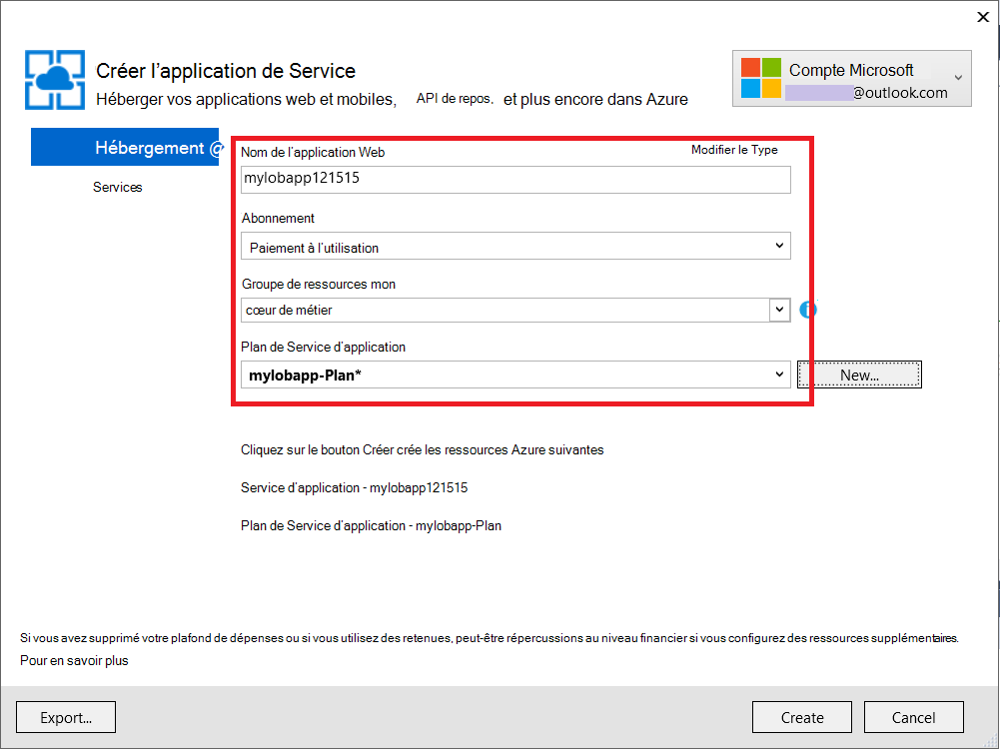
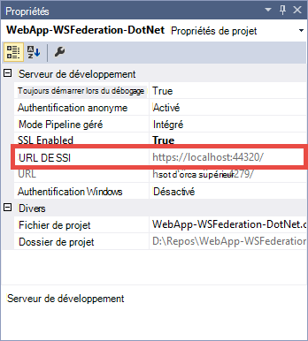

<properties 
    pageTitle="Créer une application Azure line-of-business avec l’authentification AD FS | Microsoft Azure" 
    description="Apprenez à créer une application métier d’Azure application service qui authentifie sur site STS. Ce didacticiel vise AD FS comme le STS sur site." 
    services="app-service\web" 
    documentationCenter=".net" 
    authors="cephalin" 
    manager="wpickett" 
    editor=""/>

<tags 
    ms.service="app-service-web" 
    ms.devlang="dotnet" 
    ms.topic="article" 
    ms.tgt_pltfrm="na" 
    ms.workload="web" 
    ms.date="08/31/2016" 
    ms.author="cephalin"/>

# Créer une application Azure line-of-business avec l’authentification AD FS

Cet article vous montre comment créer une application de métier d’ASP.NET MVC dans le [Service d’application Azure](../app-service/app-service-value-prop-what-is.md) à l’aide d’un local d' [Active Directory Federation Services](http://technet.microsoft.com/library/hh831502.aspx) comme le fournisseur d’identité. Ce scénario peut travailler lorsque vous souhaitez créer des applications du secteur d’activité dans le Service d’application Azure, mais votre organisation requiert des données de l’annuaire à stocker sur le site.

>[AZURE.NOTE] Pour une vue d’ensemble des options d’authentification et d’autorisation entreprise différente pour le Service d’application Azure, consultez [authentifier avec sur site Active Directory dans votre application Azure](web-sites-authentication-authorization.md).

## Vous allez générer ##

Vous allez créer une application ASP.NET de base dans Azure Application Service Web Apps avec les fonctionnalités suivantes :

- Authentifie les utilisateurs par rapport à ADFS
- Utilise `[Authorize]` pour autoriser des utilisateurs pour différentes actions
- Configuration statique de débogage dans Visual Studio et de publication pour une application de Service Web Apps (configurer qu’une seule fois, déboguez et publiez à tout moment)  

## Ce dont vous avez besoin ##

[AZURE.INCLUDE [free-trial-note](../../includes/free-trial-note.md)]

Les éléments suivants pour terminer ce didacticiel, vous devez :

- Un local déploiement d’ADFS (pour une procédure de bout en bout de l’atelier de test utilisé dans ce didacticiel, consultez [laboratoire de Test : STS autonome à AD FS dans Azure VM (pour le test uniquement)](https://blogs.msdn.microsoft.com/cephalin/2014/12/21/test-lab-standalone-sts-with-ad-fs-in-azure-vm-for-test-only/))
- Autorisations nécessaires pour créer la confiance tiers dans AD FS gestion des approbations
- Mise à jour de Visual Studio 2013 4 ou version ultérieure
- [Azure SDK 2.8.1](http://go.microsoft.com/fwlink/p/?linkid=323510&clcid=0x409) ou version ultérieure

## Utilisez l’exemple d’application métier du modèle ##

L’exemple d’application dans ce didacticiel, [WebApp-WSFederation-DotNet)](https://github.com/AzureADSamples/WebApp-WSFederation-DotNet), est créé par l’équipe Azure Active Directory. Puisque ADFS prend en charge WS-Federation, vous pouvez l’utiliser comme modèle pour créer les applications line-of-business en toute simplicité. Il présente les caractéristiques suivantes :

- Utilise [WS-Federation](http://msdn.microsoft.com/library/bb498017.aspx) pour s’authentifier auprès d’un site de déploiement d’ADFS
- Fonctionnalités de connexion et de déconnexion
- Utilise [Microsoft.Owin](http://www.asp.net/aspnet/overview/owin-and-katana/an-overview-of-project-katana) (au lieu de Windows Identity Foundation), qui est la valeur future de ASP.NET et beaucoup plus simple à configurer pour l’authentification et l’autorisation à WIF

## Paramétrage de l’exemple d’application ##

2.  Cloner ou télécharger la solution de l’échantillon à [WebApp-WSFederation-DotNet](https://github.com/AzureADSamples/WebApp-WSFederation-DotNet) dans votre répertoire local.

    > [AZURE.NOTE] Les instructions de la section [README.md](https://github.com/AzureADSamples/WebApp-WSFederation-DotNet/blob/master/README.md) vous montrent comment configurer l’application avec Azure Active Directory. Mais dans ce didacticiel, vous configurer avec AD FS, par conséquent, suivez les étapes ici à la place.

3.  Ouvrez la solution et puis ouvrez Controllers\AccountController.cs dans l' **Explorateur de solutions**.

    Vous verrez que le code envoie simplement une stimulation d’authentification pour authentifier l’utilisateur à l’aide de WS-Federation. Toutes les authentifications sont défini dans App_Start\Startup.Auth.cs.

4.  Ouvrez App_Start\Startup.Auth.cs. Dans le `ConfigureAuth` méthode, notez la ligne :

        app.UseWsFederationAuthentication(
            new WsFederationAuthenticationOptions
            {
                Wtrealm = realm,
                MetadataAddress = metadata                                      
            });

    Dans le monde OWIN, cet extrait de code est vraiment le strict minimum, que vous devez configurer l’authentification de WS-Federation. Il est beaucoup plus simple et plus élégante à WIF, où Web.config est injecté avec XML partout. La seule information dont vous avez besoin est la partie de confiance (RP) identificateur et l’URL du fichier de métadonnées de votre service ADFS. Voici un exemple :

    -   Identificateur RP :`https://contoso.com/MyLOBApp`
    -   Adresse des métadonnées :`http://adfs.contoso.com/FederationMetadata/2007-06/FederationMetadata.xml`

5.  Dans App_Start\Startup.Auth.cs, modifiez les définitions de chaîne statique suivant :  
    <pre class="prettyprint">
    domaine de chaîne de statique privé = ConfigurationManager.AppSettings["ida :<mark>RPIdentifier</mark>«] ; <mark><del>privé chaîne statique aadInstance = ConfigurationManager.AppSettings["ida:AADInstance"] ;</del></mark> 
     <mark><del>les clients privés chaîne statique = ConfigurationManager.AppSettings["ida:Tenant"] ;</del></mark> 
     <mark><del>privé chaîne statique métadonnées = chaîne. Format ("{0} / {1} /federationmetadata/2007-06/federationmetadata.xml", aadInstance, fermier) ;</del></mark> 
     <mark>privé chaîne statique métadonnées = chaîne. Format ("https:// {0} /federationmetadata/2007-06/federationmetadata.xml," ConfigurationManager.AppSettings["ida:ADFS"]) ;</mark>

    <mark><del>chaîne d’autorité = String.Format (CultureInfo.InvariantCulture, aadInstance, les clients) ;</del></mark>
    </pre>

6.  Maintenant, apporter les modifications correspondantes dans le fichier Web.config. Ouvrez le fichier Web.config et modifier les paramètres d’application suivants :  
    <pre class="prettyprint">
    &lt;appSettings&gt;
    &lt;add key="webpages:Version" value="3.0.0.0" /&gt;
    &lt;add key="webpages:Enabled" value="false" /&gt;
    &lt;add key="ClientValidationEnabled" value="true" /&gt;
    &lt;add key="UnobtrusiveJavaScriptEnabled" value="true" /&gt;
      <mark><del>&lt;add key="ida:Wtrealm" value="[Enter the App ID URI of WebApp-WSFederation-DotNet https://contoso.onmicrosoft.com/WebApp-WSFederation-DotNet]" /&gt;</del></mark>
      <mark><del>&lt;add key="ida:AADInstance" value="https://login.windows.net" /&gt;</del></mark>
      <mark><del>&lt;add key="ida:Tenant" value="[Enter tenant name, e.g. contoso.onmicrosoft.com]" /&gt;</del></mark>
      <mark>&lt;add key="ida:RPIdentifier" value="[Enter the relying party identifier tel que configuré dans AD FS, par exemple, https://localhost:44320 /] » /&gt;</mark>
      <mark>&lt;Ajouter clé = « ida : ADFS » value = « [Entrez le FQDN du service AD FS, par exemple adfs.contoso.com] » /&gt; </mark>        

    &lt;/appSettings&gt;
    </pre>

    Renseignez les valeurs de clé en fonction de votre environnement respectif.

7.  Générez l’application pour vous assurer qu’aucune erreur.

Voilà. L’exemple d’application est maintenant prêt à travailler avec AD FS. Vous devez toujours configurer une approbation RP avec cette application ultérieurement dans AD FS.

## Déployer l’exemple d’application Azure Application Service Web Apps

Ici, vous publiez l’application à une application web dans l’application de Service Web Apps tout en préservant l’environnement de débogage. Notez que vous allez publier l’application avant qu’il ait une approbation RP avec AD FS, afin que l’authentification ne fonctionne toujours pas encore. Toutefois, si vous le faites maintenant peut avoir l’URL d’application web que vous pouvez utiliser pour configurer l’approbation RP ultérieurement.

1. Droit sur votre projet et sélectionnez **Publier**.

    

2. Sélectionnez le **Service d’application Microsoft Azure**.
3. Si vous n’avez pas connecté sur Azure, cliquez sur **Se connecter** et connectez-vous en utilisant le compte Microsoft pour votre abonnement Azure.
4. Une fois connecté, cliquez sur **Nouveau** pour créer une application web.
5. Renseignez tous les champs obligatoires. Vous allez vous connecter sur site données ultérieurement, afin de ne pas créer une base de données pour cette application web.

    

6. Cliquez sur **créer**. Une fois que l’application web est créée, la boîte de dialogue Publier le site Web est ouvert.
7. Dans l' **URL de Destination**, modifiez **http** vers **https**. Copiez l’URL entière dans un éditeur de texte pour une utilisation ultérieure. Ensuite, cliquez sur **Publier**.

    

11. Dans Visual Studio, ouvrez **Web.Release.config** dans votre projet. Insérez le code XML suivant dans le `<configuration>` de la balise et remplacez la valeur de clé avec les URL de votre application web de publication.  
    <pre class="prettyprint">
&lt;appSettings&gt;
   &lt;Ajouter clé = « ida : RPIdentifier » value = »<mark>[par ex. https://mylobapp.azurewebsites.net/]</mark>"xdt:Transform = « SetAttributes » xdt:Locator="Match(key) » /&gt;
&lt;/appSettings&gt;</pre>

Lorsque vous avez terminé, vous avez deux identificateurs RP configurés dans votre projet, une pour votre environnement de débogage dans Visual Studio et l’autre pour l’application web publiés dans Azure. Vous allez définir une approbation RP pour chacun des deux environnements dans AD FS. Pendant le débogage, les paramètres d’application dans le fichier Web.config sont utilisés pour rendre votre configuration de **débogage** fonctionne avec AD FS. Lorsqu’il est publié (par défaut, la configuration **Release** est publiée), un fichier Web.config transformé qui intègre les modifications de paramètre d’application dans Web.Release.config téléchargé.

Si vous souhaitez associer l’application web publiés dans Azure pour le débogueur (par exemple, vous devez télécharger les symboles de débogage de votre code dans l’application web publiés), vous pouvez créer un clone de la configuration Debug pour le débogage d’Azure, mais avec son propre transformation de Web.config personnalisée (par exemple, Web.AzureDebug.config) qui utilise les paramètres d’application à partir de Web.Release.config. Cela vous permet de maintenir une configuration statique dans les différents environnements.

## Configurer des approbations de partie utilisatrice dans AD FS gestion ##

Vous devez maintenant configurer une approbation RP dans AD FS Management avant de pouvoir utiliser votre exemple d’application et en fait authentifier avec AD FS. Vous devez configurer les deux approbations RP distinctes, un pour votre environnement de débogage et une pour votre application web publiés.

> [AZURE.NOTE] Assurez-vous que vous répétez les étapes suivantes pour les deux de vos environnements.

4.  Sur votre serveur ADFS, connectez-vous avec les informations d’identification disposant de droits de gestion pour AD FS.
5.  Ouvrez l’outil Gestion AD FS. Droit **AD FS\Trusted Relationships\Relying partie approuve** et sélectionnez **Ajouter compter partie faire confiance**.

    

5.  Dans la page **Sélectionner la Source de données** , sélectionnez **entrer manuellement les données sur la partie de confiance**. 

    

6.  Dans la page **Spécifier le nom complet** , tapez un nom complet pour l’application et cliquez sur **suivant**.
7.  Dans la page **Sélectionnez un protocole** , cliquez sur **suivant**.
8.  Dans la page **Configurer le certificat** , cliquez sur **suivant**.

    > [AZURE.NOTE] Dans la mesure où vous devez utiliser HTTPS déjà, des jetons cryptés sont facultatifs. Si vous voulez vraiment à chiffrer les jetons d’ADFS sur cette page, vous devez également ajouter la logique de décryptage de jeton dans votre code. Pour plus d’informations, consultez [configuration manuelle OWIN WS-Federation middleware et acceptant des jetons cryptés](http://chris.59north.com/post/2014/08/21/Manually-configuring-OWIN-WS-Federation-middleware-and-accepting-encrypted-tokens.aspx).
  
5.  Avant de passer à l’étape suivante, vous avez besoin d’une information à partir de votre projet Visual Studio. Dans les propriétés du projet, notez l' **URL SSL** de l’application. 

    

6.  Dans AD FS gestion, dans la page **Configurer l’URL** de l' **Assistant Ajout de confiance tiers de confiance**, sélectionnez **Activer la prise en charge du protocole WS-Federation Passive** et saisissez l’URL SSL de votre projet Visual Studio que vous avez noté à l’étape précédente. Ensuite, cliquez sur **suivant**.

    

    > [AZURE.NOTE] URL spécifie l’emplacement d’envoyer au client après que l’authentification réussit. Pour l’environnement de débogage, il convient de <code>https://localhost:&lt;port&gt;/</code>. Pour l’application du site web publié, il doit être l’URL d’application web.

7.  Dans la page **Configurer les identificateurs** , vérifiez que votre projet URL SSL est déjà répertorié, puis cliquez sur **suivant**. Cliquez sur **suivant** jusqu'à la fin de l’Assistant avec les sélections par défaut.

    > [AZURE.NOTE] Dans la App_Start\Startup.Auth.cs de votre projet Visual Studio, cet identificateur correspond à la valeur de <code>WsFederationAuthenticationOptions.Wtrealm</code> lors de l’authentification fédérée. Par défaut, l’URL de l’application à partir de l’étape précédente est ajouté sous la forme d’un identificateur RP.

8.  Vous avez maintenant terminé la configuration de l’application RP pour votre projet dans AD FS. Ensuite, vous configurez cette application pour envoyer les déclarations requises par votre application. La boîte de dialogue **Modifier les règles de revendication** est ouvert par défaut d’à la fin de l’Assistant afin que vous puissiez commencer immédiatement. Passons à la configuration au moins les affirmations suivantes (avec les schémas entre parenthèses) :

    -   Utilisé par ASP.NET pour alimenter le nom (http://schemas.xmlsoap.org/ws/2005/05/identity/claims/name) - `User.Identity.Name`.
    -   Nom d’utilisateur principal (http://schemas.xmlsoap.org/ws/2005/05/identity/claims/upn) - utilisé pour identifier les utilisateurs de l’organisation.
    -   Appartenances aux rôles (http://schemas.microsoft.com/ws/2008/06/identity/claims/role) - peut être utilisé avec `[Authorize(Roles="role1, role2,...")]` décoration pour autoriser les contrôleurs et les actions. En réalité, cette approche ne peut pas être les plus performantes pour l’autorisation de rôle. Si vos utilisateurs AD appartiennent à des centaines de groupes de sécurité, ils deviennent des centaines de rôle les revendications dans le jeton SAML. Une autre approche consiste à envoyer une demande unique rôle conditionnellement en fonction de l’appartenance à un groupe particulier. Toutefois, nous allons conserver simple pour ce didacticiel.
    -   Nom de code (http://schemas.xmlsoap.org/ws/2005/05/identity/claims/nameidentifier) : peut être utilisé pour la validation d’anti-contrefaçon. Pour plus d’informations sur la façon de faire fonctionner avec anti-contrefaçon validation, reportez-vous à la section **Ajouter une fonctionnalité de métier** de [créer une ligne d’activité application Azure avec l’authentification Azure Active Directory](web-sites-dotnet-lob-application-azure-ad.md#bkmk_crud).

    > [AZURE.NOTE] Les types de revendications vous devez configurer pour votre application est déterminée par les besoins de votre application. Pour la liste des revendications prises en charge par les applications Azure Active Directory (c'est-à-dire les approbations RP), par exemple, reportez-vous à la section [prise en charge de jeton et les Types de revendications](http://msdn.microsoft.com/library/azure/dn195587.aspx).

8.  Dans la boîte de dialogue Modifier les règles de revendication, cliquez sur **Ajouter une règle**.
9.  Configurer les revendications de nom UPN et rôle, comme illustré dans la capture d’écran et cliquez sur **Terminer**.

    

    Ensuite, vous créez un nom temporaire ID demande à l’aide de la procédure présentée dans le [Nom des identificateurs dans les assertions SAML](http://blogs.msdn.com/b/card/archive/2010/02/17/name-identifiers-in-saml-assertions.aspx).

9.  Cliquez de nouveau sur **Ajouter une règle** .
10. Sélectionnez **Envoyer des demandes à l’aide d’une règle personnalisée** , puis cliquez sur **suivant**.
11. Coller la langue suivante de la règle dans la zone **règle personnalisée** , le nom de la règle **Par l’identificateur de Session** et cliquez sur **Terminer**.  
    <pre class="prettyprint">
    C1 : [Type == « http://schemas.microsoft.com/ws/2008/06/identity/claims/windowsaccountname »] &amp; &amp; 
    c2 : [Type == « http://schemas.microsoft.com/ws/2008/06/identity/claims/authenticationinstant »] = > Ajouter (stocker = « _OpaqueIdStore », les types = («<mark>http://contoso.com/internal/sessionid</mark>»), requête = « {0} { 1} ; {2} ; {3} ; {4} », param = « useEntropy », param = c1. Valeur, param = c1. OriginalIssuer, param = « », param = c2. Valeur) ;
    </pre>

    Votre règle personnalisée doit ressembler à la capture d’écran :

    

9.  Cliquez de nouveau sur **Ajouter une règle** .
10. **Transformer une revendication entrante** et cliquez sur **suivant**.
11. Configurez la règle comme indiqué dans la capture d’écran (en utilisant le type de demande que vous avez créé dans la règle personnalisée) et cliquez sur **Terminer**.

    

    Pour obtenir des informations détaillées sur les étapes de la revendication de nom ID en régime transitoire, consultez [Identificateurs de nom dans les assertions SAML](http://blogs.msdn.com/b/card/archive/2010/02/17/name-identifiers-in-saml-assertions.aspx).

12. Dans la boîte de dialogue **Modifier les règles de revendication** , cliquez sur **Appliquer** . Il doit maintenant ressembler à la capture d’écran suivante :

    

    > [AZURE.NOTE] À nouveau, assurez-vous que vous répétez ces étapes pour votre environnement de débogage et de publication web app.

## Authentification fédérée de test pour votre application

Vous êtes prêt à tester la logique de votre application d’authentification AD FS. Dans mon environnement de test AD FS, j’ai un utilisateur de test qui appartient à un groupe dans Active Directory (AD).

Pour tester l’authentification dans le débogueur, il vous souhaitez maintenant est type `F5`. Si vous souhaitez tester l’authentification de l’application web publiés, naviguez jusqu'à l’URL.

Après le chargement de l’application web, cliquez sur **Connexion**. Doit maintenant s’afficher une boîte de dialogue d’ouverture de session ou de la page de connexion pris en charge par ADFS, en fonction de la méthode d’authentification choisie par AD FS. Voici ce que je reçois dans Internet Explorer 11.

Une fois que vous vous connectez avec un utilisateur dans le domaine de la publicité du déploiement ADFS, vous devez maintenant voir la page d’accueil à l’aide de **Hello, <User Name>!** dans le coin. Voici ce que j’obtiens.

À ce stade, vous avez réussi dans l’une des manières suivantes :

- Votre application a atteint AD FS et un identificateur RP correspondant est trouvé dans la base de données AD FS
- AD FS a correctement authentifié un utilisateur AD et vous rediriger vers la page d’accueil de l’application
- AD FS envoyé avec succès la revendication de nom (http://schemas.xmlsoap.org/ws/2005/05/identity/claims/name) à votre application, comme indiqué par le fait que le nom d’utilisateur s’affiche dans le coin. 

Si la revendication de nom est manquante, vous auriez vu **Hello, !**. Si vous regardez les Views\Shared\_LoginPartial.cshtml, vous constatez qu’elle utilise `User.Identity.Name` pour afficher le nom de l’utilisateur. Comme mentionné précédemment, si la revendication de nom de l’utilisateur authentifié est disponible dans le jeton SAML, ASP.NET hydrates de cette propriété avec elle. Pour afficher toutes les demandes qui sont envoyées par ADFS, placez un point d’arrêt dans Controllers\HomeController.cs, dans la méthode d’action Index. Une fois que l’utilisateur est authentifié, inspecter la `System.Security.Claims.Current.Claims` collection.

 

## Autoriser des utilisateurs pour les contrôleurs spécifiques ou des actions

Étant donné que vous avez inclus des appartenances au groupe que les créances de rôle dans votre configuration d’approbation RP, vous pouvez maintenant les utiliser directement dans le `[Authorize(Roles="...")]` décoration pour les contrôleurs et les actions. Dans une application métier d’avec le modèle de création-lecture-mise à jour-suppression (CRUD), vous pouvez autoriser des rôles spécifiques de chaque action. Pour l’instant, vous sera simplement tester cette fonctionnalité sur le contrôleur Home existant.

1. Ouvrez Controllers\HomeController.cs.
2. Décorer le `About` et `Contact` les méthodes d’action similaires au code suivant, à l’aide de la sécurité les appartenances de l’utilisateur authentifié.  
    <pre class="prettyprint">
    <mark>[Autoriser (rôles = "Test Group")]</mark> 
    public ActionResult About() {ViewBag.Message = « Votre application description page. » ;

        return View();
    }

    <mark>[Autoriser (rôles = "Domain Admins")]</mark> 
    public ActionResult Contact() {ViewBag.Message = « Votre page de contact. » ;

        return View();
    }  </pre>

    Étant donné que j’ai ajouté un **Utilisateur de Test** au **Groupe de tests** dans mon environnement de test AD FS, je vais utiliser le groupe de Test pour tester les autorisations sur `About`. Pour `Contact`, permettra de tester le cas négatif **Admins du domaine**, auquel n’appartient pas **Tester l’utilisateur** .

3. Démarrez le débogueur en tapant `F5` vous connecter, puis cliquez sur à **propos**. Vous devez maintenant afficher le `~/About/Index` page avec succès, si votre utilisateur authentifié est autorisé pour cette action.
4. Maintenant, cliquez sur **Contact**, qui, dans mon cas, ne devraient pas autoriser **l’Utilisateur Test** pour l’action. Toutefois, le navigateur est redirigé vers AD FS, ce qui finalement affiche ce message :

    

    Si vous examinez cette erreur dans l’Observateur d’événements sur le serveur AD FS, vous voyez ce message d’exception :  
    <pre class="prettyprint">
   Microsoft.IdentityServer.Web.InvalidRequestException : MSIS7042 : <mark>la même session du navigateur client a adressé une demande '6' dans les derniers 11 secondes.</mark> Pour plus d’informations, contactez votre administrateur.
   à Microsoft.IdentityServer.Web.Protocols.PassiveProtocolHandler.UpdateLoopDetectionCookie (contexte WrappedHttpListenerContext) à Microsoft.IdentityServer.Web.Protocols.WSFederation.WSFederationProtocolHandler.SendSignInResponse (contexte de WSFederationContext, la réponse à MSISSignInResponse) à Microsoft.IdentityServer.Web.PassiveProtocolListener.ProcessProtocolRequest (ProtocolContext protocolContext, PassiveProtocolHandler protocolHandler) à Microsoft.IdentityServer.Web.PassiveProtocolListener.OnGetContext (WrappedHttpListenerContext de contexte) </pre>

    La raison de cette erreur est que par défaut, MVC retourne un 401 non autorisé lorsque les rôles d’un utilisateur ne sont pas autorisés. Cela déclenche une demande d’authentification à votre fournisseur d’identité (Active Directory Federation Services). Dans la mesure où l’utilisateur est déjà authentifié, ADFS renvoie à la même page, lequel émet un autre 401, créant une boucle de redirection. Vous substituez de AuthorizeAttribute `HandleUnauthorizedRequest` méthode avec une logique simple pour afficher quelque chose qui est logique au lieu de continuer la boucle de redirection.

5. Créez un fichier dans le projet nommé AuthorizeAttribute.cs et collez-y le code suivant.

        using System;
        using System.Web.Mvc;
        using System.Web.Routing;
        
        namespace WebApp_WSFederation_DotNet
        {
            [AttributeUsage(AttributeTargets.Class | AttributeTargets.Method, Inherited = true, AllowMultiple = true)]
            public class AuthorizeAttribute : System.Web.Mvc.AuthorizeAttribute
            {
                protected override void HandleUnauthorizedRequest(AuthorizationContext filterContext)
                {
                    if (filterContext.HttpContext.Request.IsAuthenticated)
                    {
                        filterContext.Result = new System.Web.Mvc.HttpStatusCodeResult((int)System.Net.HttpStatusCode.Forbidden);
                    }
                    else
                    {
                        base.HandleUnauthorizedRequest(filterContext);
                    }
                }
            }
        }

    Le code de substitution envoie un HTTP 403 (refusé) au lieu de HTTP 401 (non autorisé) dans les cas authentifiés mais non autorisés.

6. Exécuter le débogueur à l’aide de `F5`. Cliquant sur **Contact** affiche un message d’erreur plus informatif (quoique peu attrayante) :

    

7. Publier l’application à Azure Application Service Web Apps et tester le comportement de l’application active.

## Se connecter aux données de locaux

Un que vous pouvez implémenter votre application de métier avec AD FS, au lieu d’Azure Active Directory du fait des problèmes de conformité à la conservation de données organisation hors-site. Cela peut également signifier que votre application web dans Azure doit accéder aux bases de données sur site, dans la mesure où vous n’êtes pas autorisé à utiliser [De base de données SQL](/services/sql-database/) que la couche de données pour vos applications web.

Azure Application Service Web Apps prend en charge l’accès aux bases de données sur site avec deux approches : [Les connexions hybride](../biztalk-services/integration-hybrid-connection-overview.md) et [Des réseaux virtuels](web-sites-integrate-with-vnet.md). Pour plus d’informations, consultez [intégration d’à l’aide de VNET et de connexions hybride avec Azure Application Service Web Apps](https://azure.microsoft.com/blog/2014/10/30/using-vnet-or-hybrid-conn-with-websites/).

## Autres ressources

- [Protéger l’Application avec SSL et l’attribut autoriser](web-sites-dotnet-deploy-aspnet-mvc-app-membership-oauth-sql-database.md#protect-the-application-with-ssl-and-the-authorize-attribute)
- [Authentifier avec sur site Active Directory dans votre application Azure](web-sites-authentication-authorization.md)
- [Créer une application Azure line-of-business avec l’authentification Azure Active Directory](web-sites-dotnet-lob-application-azure-ad.md)
- [Utilisez l’Option d’authentification d’organisation local (ADFS) avec ASP.NET dans Visual Studio 2013](http://www.cloudidentity.com/blog/2014/02/12/use-the-on-premises-organizational-authentication-option-adfs-with-asp-net-in-visual-studio-2013/)
- [Migrer un projet Web de VS2013 à partir de WIF pour interconnexions](http://www.cloudidentity.com/blog/2014/09/15/MIGRATE-A-VS2013-WEB-PROJECT-FROM-WIF-TO-KATANA/)
- [Vue d’ensemble des Services de fédération Active Directory](http://technet.microsoft.com/library/hh831502.aspx)
- [Spécification WS-Federation 1.1](http://download.boulder.ibm.com/ibmdl/pub/software/dw/specs/ws-fed/WS-Federation-V1-1B.pdf?S_TACT=105AGX04&S_CMP=LP)

