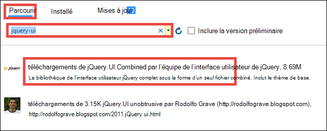

<properties 
    pageTitle="Créer une application Azure line-of-business avec l’authentification Active Directory de Azure | Microsoft Azure" 
    description="Apprenez à créer une application de métier d’ASP.NET MVC dans le Service d’application Azure qui authentifie avec Azure Active Directory" 
    services="app-service\web, active-directory" 
    documentationCenter=".net" 
    authors="cephalin" 
    manager="wpickett" 
    editor=""/>

<tags 
    ms.service="app-service-web" 
    ms.devlang="dotnet" 
    ms.topic="article" 
    ms.tgt_pltfrm="na" 
    ms.workload="web" 
    ms.date="09/01/2016" 
    ms.author="cephalin"/>

# Créer une application Azure line-of-business avec l’authentification Azure Active Directory #

Cet article vous montre comment créer une application de métier de .NET dans [Azure Application Service Web Apps](http://go.microsoft.com/fwlink/?LinkId=529714) à l’aide de la [l’authentification / autorisation](../app-service/app-service-authentication-overview.md) fonctionnalité. Il montre également comment utiliser l' [API de graphique Azure Active Directory](https://msdn.microsoft.com/Library/Azure/Ad/Graph/api/api-catalog) pour interroger les données de répertoire de l’application.

Le locataire Azure Active Directory que vous utilisez peut être un répertoire Azure uniquement. Ou bien, il peut être [synchronisé avec votre sur site Active Directory](../active-directory/active-directory-aadconnect.md) pour créer une expérience d’ouverture de session unique pour les travailleurs qui sont locaux et distants. Cet article utilise le répertoire par défaut pour votre compte Azure.

## Vous allez générer ##

Vous allez créer une application simple de créer-lecture-mise à jour-Supprimer (CRUD)-métier dans une application de Service Web Apps que suit le travail éléments grâce aux fonctionnalités suivantes :

- Authentifie les utilisateurs par rapport à Active Directory de Azure
- Requêtes des utilisateurs et des groupes à l’aide des [API de graphique Azure Active Directory](http://msdn.microsoft.com/library/azure/hh974476.aspx)
- Utilisez le modèle ASP.NET MVC *Aucune authentification*

Si vous avez besoin de contrôle d’accès basé sur les rôles (RBAC) pour votre application de métier dans Azure, reportez-vous à [l’Étape suivante](#next).

## Ce dont vous avez besoin ##

[AZURE.INCLUDE [free-trial-note](../../includes/free-trial-note.md)]

Les éléments suivants pour terminer ce didacticiel, vous devez :

- Un locataire Azure Active Directory avec les utilisateurs de différents groupes
- Autorisations pour créer des applications sur le locataire Azure Active Directory
- Mise à jour de Visual Studio 2013 4 ou version ultérieure
- [Azure SDK 2.8.1 ou version ultérieure](https://azure.microsoft.com/downloads/)

## Créer et déployer une application web vers Azure ##

1. À partir de Visual Studio, cliquez sur **le fichier** > **Nouveau** > **projet**.

2. Sélectionnez **ASP.NET Web Application**, nommez votre projet et cliquez sur **OK**.

3. Sélectionnez le modèle **MVC** , puis modifiez l’authentification **Aucune authentification**. Assurez-vous que **l’hôte dans le nuage** est sélectionné et cliquez sur **OK**.

    

4. Dans la boîte de dialogue de **Création de Service App** , cliquez sur **Ajouter un compte** (puis sur **Ajouter un compte** dans la liste déroulante) pour vous connecter à votre compte Azure.

5. Une fois connecté, configurez votre application web. Créer un groupe de ressources et d’un nouveau plan de Service de l’application en cliquant sur le bouton **Nouveau** respectif. Cliquez sur **Explorer les services Azure supplémentaires** pour continuer.

    

6. Dans l’onglet **Services** , cliquez sur **+** pour ajouter une base de données SQL de votre application. 

    

7. De **Configurer la base de données SQL**, cliquez sur **Nouveau** pour créer une instance de SQL Server.

8. Dans **Configurer le SQL Server**, configurez votre instance de SQL Server. Ensuite, cliquez sur **OK**, **OK**, **créer** pour lancer la création de l’application dans Azure.

9. Dans l' **Activité de Service d’application Azure**, vous pouvez voir lorsque la création de l’application est terminée. Cliquez sur * *publication &lt; *appname*> pour cette application Web maintenant**puis cliquez sur **publier **. 

    Une fois que Visual Studio a terminé, il ouvre l’application de publication dans le navigateur. 

    

## Configurer l’accès d’authentification et d’annuaire

1. Connectez-vous au [portail Azure](https://portal.azure.com).

2. Dans le menu de gauche, cliquez sur **Services d’application** > **&lt;*appname*>** > **l’authentification / autorisation **.

    

3. Activer l’authentification Azure Active Directory en cliquant **sur** > **Azure Active Directory** > **Express** > **OK**.

    

4. Cliquez sur **Enregistrer** dans la barre de commandes.

    

    Une fois les paramètres d’authentification sont enregistrées correctement, essayez d’afficher votre application dans le navigateur. Les paramètres par défaut appliquent l’authentification à l’application entière. Si vous n’êtes pas déjà connecté, vous êtes redirigé vers un écran de connexion. Une fois connecté, vous consultez votre application sécurisée par HTTPS. Ensuite, vous devez activer l’accès aux données de l’annuaire. 

5. Accédez au [portail classique](https://manage.windowsazure.com).

6. Dans le menu de gauche, cliquez sur **Active Directory** > **Répertoire par défaut** > **les Applications** > **&lt;*appname*> **.

    

    Il s’agit de l’application Azure Active Directory que le Service d’application est créé pour vous pour activer l’autorisation / fonctionnalité d’authentification.

7. Cliquez sur **utilisateurs** et **groupes** pour vous assurer que vous disposez des utilisateurs et des groupes dans l’annuaire. Dans le cas contraire, créez quelques groupes et utilisateurs de test.

    

7. Cliquez sur **configurer** pour configurer cette application.

8. Faites défiler jusqu'à la section **clés** et ajouter une clé en sélectionnant une durée. Cliquez sur **Déléguer les autorisations** , puis sélectionnez les **données de l’annuaire en lecture**. Cliquez sur **Enregistrer**.

    

8. Une fois que vos paramètres sont enregistrés, retournez la section **clés** et cliquez sur le bouton **Copier** pour copier la clé du client. 

    

    >[AZURE.IMPORTANT] Si vous quittez cette page maintenant, vous ne pourrez plus jamais accéder à cette clé du client.

9. Ensuite, vous devez configurer votre application web avec cette clé. Ouvrez une session l' [Explorateur de ressources Azure](https://resources.azure.com) avec votre compte Azure.

10. En haut de la page, cliquez sur **Lecture** pour apporter des modifications dans l’Explorateur de ressources Azure.

    

11. Rechercher les paramètres d’authentification pour votre application, qui se trouve au niveau des abonnements > * *&lt;*subscriptionname*>** > **resourceGroups** > **&lt;*resourcegroupname*>** > **fournisseurs** > **Microsoft.Web** > **sites** > **&lt;*appname*>** > **config** > **authsettings **.

12. Cliquez sur **Modifier**.

    

13. Dans le volet d’édition, définissez la `clientSecret` et `additionalLoginParams` propriétés comme suit.

        ...
        "clientSecret": "<client key from the Azure Active Directory application>",
        ...
        "additionalLoginParams": ["response_type=code id_token", "resource=https://graph.windows.net"],
        ...

14. Cliquez sur **Insérer** en haut pour soumettre vos modifications.

    

14. Maintenant, pour vérifier si vous avez le jeton d’autorisation pour accéder à l’API de graphique Azure Active Directory, simplement accéder au * *https://&lt;*appname*>.azurewebsites.net/.auth/me** dans votre navigateur. Si vous avez tout ce qui est correctement configuré, vous devez voir les `access_token` propriété dans la réponse JSON.

    Le `~/.auth/me` chemin d’accès de l’URL est géré par l’application, Service d’authentification / autorisation afin de vous fournir toutes les informations relatives à votre session authentifiée. Pour plus d’informations, consultez [authentification et autorisation dans les services d’application Azure](../app-service/app-service-authentication-overview.md).

    >[AZURE.NOTE] Le `access_token` a une période d’expiration. Toutefois, l’authentification du Service application / autorisation fournit les fonctionnalités d’actualisation jeton avec `~/.auth/refresh`. Pour plus d’informations sur la façon de l’utiliser, reportez-vous à la section     [App Store de jeton de Service](https://cgillum.tech/2016/03/07/app-service-token-store/).

Ensuite, vous ferez quelque chose d’utile avec les données de l’annuaire.

## Ajouter des fonctionnalités de métier de votre application

Maintenant, vous créez un suivi d’éléments de travail CRUD simple.  

5.  Dans le dossier ~\Models, créez un fichier de classe appelé WorkItem.cs et `public class WorkItem {...}` par le code suivant :

        using System.ComponentModel.DataAnnotations;

        public class WorkItem
        {
            [Key]
            public int ItemID { get; set; }
            public string AssignedToID { get; set; }
            public string AssignedToName { get; set; }
            public string Description { get; set; }
            public WorkItemStatus Status { get; set; }
        }

        public enum WorkItemStatus
        {
            Open,
            Investigating,
            Resolved,
            Closed
        }

7.  Générez le projet pour rendre votre nouveau modèle accessibles à la logique de génération de modèles automatique dans Visual Studio.

8.  Ajouter un nouvel élément avec génération de modèles `WorkItemsController` dans le dossier ~\Controllers ( **contrôleurs**d’avec le bouton droit, pointez sur **Ajouter**et sélectionnez **un nouvel élément avec génération de modèles**). 

9.  **Contrôleur de 5 MVC avec des vues, à l’aide d’Entity Framework** , cliquez sur **Ajouter**.

10. Sélectionnez le modèle que vous créé, puis cliquez sur **+** et puis **Ajouter** pour ajouter un contexte de données, puis cliquez sur **Ajouter**.

    

14. Dans ~\Views\WorkItems\Create.cshtml (un élément avec génération de modèles automatique), recherchez le `Html.BeginForm` méthode d’assistance et apportez les modifications de mise en surbrillance suivantes :  
<pre class="prettyprint">
    @modelWebApplication1.Models.WorkItem

    @{ViewBag.Title = &quot;créer&quot;; }

    &lt;H2&gt;créer&lt;/h2&gt;

    @using(Html.BeginForm (<mark>&quot;créer&quot;, &quot;WorkItems&quot;, FormMethod.Post, nouveau {id = &quot;-formulaire principal&quot; }</mark>)) {@Html.AntiForgeryToken()

        &lt;div class=&quot;form-horizontal&quot;&gt;
            &lt;h4&gt;WorkItem&lt;/h4&gt;
            &lt;hr /&gt;
            @Html.ValidationSummary(true, &quot;&quot;, new { @class = &quot;text-danger&quot; })
            &lt;div class=&quot;form-group&quot;&gt;
                @Html.LabelFor(model =&gt; model.AssignedToID, htmlAttributes: new { @class = &quot;control-label col-md-2&quot; })
                &lt;div class=&quot;col-md-10&quot;&gt;
                    @Html.EditorFor(model =&gt; model.AssignedToID, new { htmlAttributes = new { @class = &quot;form-control&quot;<mark>, @type = &quot;hidden&quot;</mark> } })
                    @Html.ValidationMessageFor(model =&gt; model.AssignedToID, &quot;&quot;, new { @class = &quot;text-danger&quot; })
                &lt;/div&gt;
            &lt;/div&gt;

            &lt;div class=&quot;form-group&quot;&gt;
                @Html.LabelFor(model =&gt; model.AssignedToName, htmlAttributes: new { @class = &quot;control-label col-md-2&quot; })
                &lt;div class=&quot;col-md-10&quot;&gt;
                    @Html.EditorFor(model =&gt; model.AssignedToName, new { htmlAttributes = new { @class = &quot;form-control&quot; } })
                    @Html.ValidationMessageFor(model =&gt; model.AssignedToName, &quot;&quot;, new { @class = &quot;text-danger&quot; })
                &lt;/div&gt;
            &lt;/div&gt;

            &lt;div class=&quot;form-group&quot;&gt;
                @Html.LabelFor(model =&gt; model.Description, htmlAttributes: new { @class = &quot;control-label col-md-2&quot; })
                &lt;div class=&quot;col-md-10&quot;&gt;
                    @Html.EditorFor(model =&gt; model.Description, new { htmlAttributes = new { @class = &quot;form-control&quot; } })
                    @Html.ValidationMessageFor(model =&gt; model.Description, &quot;&quot;, new { @class = &quot;text-danger&quot; })
                &lt;/div&gt;
            &lt;/div&gt;

            &lt;div class=&quot;form-group&quot;&gt;
                @Html.LabelFor(model =&gt; model.Status, htmlAttributes: new { @class = &quot;control-label col-md-2&quot; })
                &lt;div class=&quot;col-md-10&quot;&gt;
                    @Html.EnumDropDownListFor(model =&gt; model.Status, htmlAttributes: new { @class = &quot;form-control&quot; })
                    @Html.ValidationMessageFor(model =&gt; model.Status, &quot;&quot;, new { @class = &quot;text-danger&quot; })
                &lt;/div&gt;
            &lt;/div&gt;

            &lt;div class=&quot;form-group&quot;&gt;
                &lt;div class=&quot;col-md-offset-2 col-md-10&quot;&gt;
                    &lt;input type=&quot;submit&quot; value=&quot;Create&quot; class=&quot;btn btn-default&quot;<mark> id=&quot;submit-button&quot;</mark> /&gt;
                &lt;/div&gt;
            &lt;/div&gt;
        &lt;/div&gt;
    }

    &lt;div&gt;
    @Html.ActionLink(&quot;retour à la liste&quot;, &quot;Index&quot;) &lt;/div    &gt;

    @sectionScripts { @Scripts.Render( &quot;~/bundles/jqueryval&quot;)     <mark> &lt;script&gt; 
     / / Code de sélecteur de personnes/groupe var maxResultsPerPage = 14 ;         entrée de var = document.getElementById (&quot;AssignedToName&quot;) ;

            // Access token from request header, and tenantID from claims identity
            var token = &quot;@Request.Headers[&quot;X-MS-TOKEN-AAD-ACCESS-TOKEN&quot;]&quot;;
            var tenant =&quot;@(System.Security.Claims.ClaimsPrincipal.Current.Claims
                            .Where(c => c.Type == &quot;http://schemas.microsoft.com/identity/claims/tenantid&quot;)
                            .Select(c => c.Value).SingleOrDefault())&quot;;

            var picker = new AadPicker(maxResultsPerPage, input, token, tenant);

            // Submit the selected user/group to be asssigned.
            $(&quot;#submit-button&quot;).click({ picker: picker }, function () {
                if (!picker.Selected())
                    return;
                $(&quot;#main-form&quot;).get()[0].elements[&quot;AssignedToID&quot;].value = picker.Selected().objectId;
            });
        &lt;/script&gt;</mark>
    }
    </pre>
    
    Notez que `token` et `tenant` sont utilisés par le `AadPicker` objet pour effectuer des appels d’API de graphique Azure Active Directory. Vous allez ajouter `AadPicker` plus tard.   
    
    >[AZURE.NOTE] Vous pouvez tout aussi bien obtenir `token` et `tenant` à partir du client avec `~/.auth/me`, mais ce serait un appel de serveur supplémentaire. Par exemple :
    >  
    >     $.ajax({
    >         dataType: "json",
    >         url: "/.auth/me",
    >         success: function (data) {
    >             var token = data[0].access_token;
    >             var tenant = data[0].user_claims
    >                             .find(c => c.typ === 'http://schemas.microsoft.com/identity/claims/tenantid')
    >                             .val;
    >         }
    >     });
    
15. Apportez les mêmes modifications avec ~ \Views\WorkItems\Edit.cshtml.

15. Le `AadPicker` objet est défini dans un script que vous souhaitez ajouter à votre projet. Cliquez sur le dossier ~\Scripts, pointez sur **Ajouter**et cliquez sur le **fichier JavaScript**. Type de `AadPickerLibrary` pour le nom de fichier, puis cliquez sur **OK**.

16. Copiez le contenu à partir d' [ici](https://raw.githubusercontent.com/cephalin/active-directory-dotnet-webapp-roleclaims/master/WebApp-RoleClaims-DotNet/Scripts/AadPickerLibrary.js) dans ~ \Scripts\AadPickerLibrary.js.

    Dans le script, le `AadPicker` objet appelle des [API de graphique Azure Active Directory](https://msdn.microsoft.com/Library/Azure/Ad/Graph/api/api-catalog) pour rechercher des utilisateurs et des groupes qui correspondent à l’entrée.  

17. ~\Scripts\AadPickerLibrary.js utilise également le [widget de la saisie semi-automatique de l’interface utilisateur jQuery](https://jqueryui.com/autocomplete/). Vous devez donc ajouter l’interface utilisateur jQuery à votre projet. Droit sur votre projet dans, puis cliquez sur **Gérer les Packages NuGet**.

18. Dans le Gestionnaire de package NuGet, cliquez sur Parcourir, tapez **jquery-ui** dans la barre de recherche et cliquez sur **jQuery.UI.Combined**.

    

19. Dans le volet droit, cliquez sur **installer**, puis cliquez sur **OK** pour continuer.

19. Ouvrez ~\App_Start\BundleConfig.cs et apportez les modifications de mise en surbrillance suivantes :  
    <pre class="prettyprint">
    public static void RegisterBundles(BundleCollection bundles) {bottes. Ajouter (nouvelle ScriptBundle (&quot;~/bundles/jquery&quot;). Inclure ( &quot;~/Scripts/jquery-{version}.js&quot;<mark>, &quot;~/Scripts/jquery-ui-{version}.js&quot;, &quot;~/Scripts/AadPickerLibrary.js&quot;</mark>)) ;

        bundles.Add(new ScriptBundle(&quot;~/bundles/jqueryval&quot;).Include(
                    &quot;~/Scripts/jquery.validate*&quot;));

        // Use the development version of Modernizr to develop with and learn from. Then, when you&#39;re
        // ready for production, use the build tool at http://modernizr.com to pick only the tests you need.
        bundles.Add(new ScriptBundle(&quot;~/bundles/modernizr&quot;).Include(
                    &quot;~/Scripts/modernizr-*&quot;));

        bundles.Add(new ScriptBundle(&quot;~/bundles/bootstrap&quot;).Include(
                    &quot;~/Scripts/bootstrap.js&quot;,
                    &quot;~/Scripts/respond.js&quot;));

        bundles.Add(new StyleBundle(&quot;~/Content/css&quot;).Include(
                    &quot;~/Content/bootstrap.css&quot;,
                    &quot;~/Content/site.css&quot;<mark>,
                    &quot;~/Content/themes/base/jquery-ui.css&quot;</mark>));
    }
    </pre>

    Il existe plusieurs façons de performant pour gérer les fichiers JavaScript et CSS dans votre application. Toutefois, par souci de simplicité vous allez juste se greffent sur les offres groupées qui sont chargées avec chaque vue.

12. Enfin, de ~ \Global.asax, ajoutez la ligne suivante de code dans la `Application_Start()` méthode. `Ctrl`+`.`sur chaque erreur de résolution d’affectation de noms pour le corriger.

        AntiForgeryConfig.UniqueClaimTypeIdentifier = ClaimTypes.NameIdentifier;
    
    > [AZURE.NOTE] Vous avez besoin de cette ligne de code dans la mesure où le modèle MVC par défaut utilise <code>[ValidateAntiForgeryToken]</code> décoration sur certaines des actions. En raison du comportement décrit par [Brock Allen](https://twitter.com/BrockLAllen)     [MVC 4, AntiForgeryToken](http://brockallen.com/2012/07/08/mvc-4-antiforgerytoken-and-claims/) et revendications votre POST HTTP peut échouer validation de jeton anti-contrefaçon car :

    > - Azure Active Directory n’envoie pas le http://schemas.microsoft.com/accesscontrolservice/2010/07/claims/identityprovider, qui est requis par défaut par le jeton anti-contrefaçon.
    > - En cas d’Azure Active Directory directory synchronisé avec AD FS, l’approbation ADFS par défaut n’envoie pas la demande http://schemas.microsoft.com/accesscontrolservice/2010/07/claims/identityprovider, vous pouvez configurer manuellement les Federation Services pour envoyer cette demande.

    > `ClaimTypes.NameIdentifies`Spécifie la demande `http://schemas.xmlsoap.org/ws/2005/05/identity/claims/nameidentifier`, lequel Azure Active Directory fournit.  

20. Maintenant, publiez vos modifications. Droit sur votre projet, puis cliquez sur **Publier**.

21. Cliquez sur **paramètres**, vérifiez qu’il existe une chaîne de connexion à votre base de données SQL, sélectionnez **Mise à jour de base de données** puisse apporter les modifications de schéma pour votre modèle et cliquez sur **Publier**.

    

22. Dans le navigateur, accédez à https://&lt;*appname*>.azurewebsites.net/workitems, puis cliquez sur **Créer un nouveau**.

23. Cliquez dans la zone de **AssignedToName** . Vous devez maintenant voir les utilisateurs et les groupes à partir de votre client Azure Active Directory dans une liste déroulante. Vous pouvez taper pour filtrer, ou utiliser le `Up` ou `Down` clé ou cliquez sur pour sélectionner l’utilisateur ou le groupe. 

    

24. Cliquez sur **créer** pour enregistrer les modifications. Ensuite, cliquez sur **Modifier** dans l’élément de travail créé pour observer le même comportement.

Félicitations, vous êtes maintenant en une application métier d’Azure avec accès à l’annuaire ! Il est beaucoup plus que vous pouvez faire avec l’API du graphique. Consultez la [référence des API d’Azure AD graphique](https://msdn.microsoft.com/library/azure/ad/graph/api/api-catalog).

## Étape suivante

Si vous avez besoin de contrôle d’accès basé sur les rôles (RBAC) pour votre application de métier dans azure, consultez [WebApp-RoleClaims-DotNet](https://github.com/Azure-Samples/active-directory-dotnet-webapp-roleclaims) pour obtenir un exemple de l’équipe Azure Active Directory. Il vous montre comment activer les rôles de votre application Azure Active Directory et ensuite autoriser les utilisateurs avec le `[Authorize]` décoration.

Si votre application métier de doit accéder aux données de locaux, consultez [accès aux ressources à l’aide de connexions hybride dans Azure Application Service sur site](web-sites-hybrid-connection-get-started.md).

## Autres ressources

- [Authentification et autorisation dans les services d’application Azure](../app-service/app-service-authentication-overview.md)
- [Authentifier avec sur site Active Directory dans votre application Azure](web-sites-authentication-authorization.md)
- [Créer une application métier de dans Azure avec l’authentification AD FS](web-sites-dotnet-lob-application-adfs.md)
- [Authentification de Service de l’application et le graphique AD Azure API](https://cgillum.tech/2016/03/25/app-service-auth-aad-graph-api/)
- [Documentation et exemples d’Active Directory de Microsoft Azure](https://github.com/AzureADSamples)
- [Azure Active Directory prises en charge de jeton et les Types de revendications](http://msdn.microsoft.com/library/azure/dn195587.aspx)

[Protect the Application with SSL and the Authorize Attribute]: web-sites-dotnet-deploy-aspnet-mvc-app-membership-oauth-sql-database.md#protect-the-application-with-ssl-and-the-authorize-attribute
