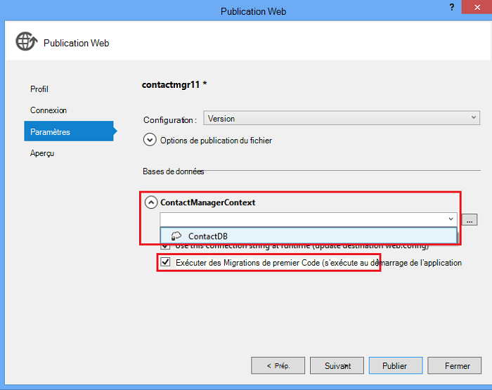

<properties 
    pageTitle="Créer un service reste à l’aide de ASP.NET Web API et la base de données de SQL Azure Application Service" 
    description="Un didacticiel qui vous explique comment déployer une application qui utilise l’API Web ASP.NET pour une application web Azure à l’aide de Visual Studio." 
    services="app-service\web" 
    documentationCenter=".net" 
    authors="Rick-Anderson" 
    writer="Rick-Anderson" 
    manager="wpickett" 
    editor=""/>

<tags 
    ms.service="app-service-web" 
    ms.workload="web" 
    ms.tgt_pltfrm="na" 
    ms.devlang="dotnet" 
    ms.topic="article" 
    ms.date="02/29/2016" 
    ms.author="riande"/>

# Créer un service reste à l’aide de ASP.NET Web API et la base de données de SQL Azure Application Service

Ce didacticiel montre comment déployer une application web ASP.NET à un [Service d’application Azure](http://go.microsoft.com/fwlink/?LinkId=529714) à l’aide de l’Assistant de publication Web dans Visual Studio 2013 ou 2013 Community Edition de Visual Studio. 

Vous pouvez ouvrir gratuitement un compte Azure et si vous ne disposez pas de Visual Studio 2013, le Kit de développement installe automatiquement Visual Studio 2013 pour Web Express. Ainsi, vous pouvez démarrer le développement libre pour Azure entièrement pour.

Ce didacticiel suppose que vous n’avez aucune expérience préalable à l’aide d’Azure. À la fin de ce didacticiel, vous avez une application web simple des et en cours d’exécution dans le nuage.
 
Vous apprendrez à :

* Comment activer votre machine de développement Azure en installant le Kit de développement Azure.
* Comment créer un projet Visual Studio 5 de MVC ASP.NET et le publier dans une application Azure.
* L’utilisation de l’API Web ASP.NET pour permettre les appels d’API Restful.
* L’utilisation d’une base de données SQL pour stocker des données dans Azure.
* Comment publier des mises à jour de l’application dans Azure.

Vous allez créer une application web simple de liste de contacts est basée sur ASP.NET MVC 5 et utilise ADO.NET Entity Framework pour l’accès de la base de données. L’illustration suivante montre l’application terminée :

![capture d’écran de site web][intro001]

<!-- the next line produces the "Set up the development environment" section as see at http://azure.microsoft.com/documentation/articles/web-sites-dotnet-get-started/ -->
[AZURE.INCLUDE [create-account-and-websites-note](../../includes/create-account-and-websites-note.md)]

### Créer le projet

1. Démarrez Visual Studio 2013.
1. Dans le menu **fichier** , cliquez sur **Nouveau projet**.
3. Dans la boîte de dialogue **Nouveau projet** , développez **Visual C#** et sélectionnez **Web** puis sélectionnez **ASP.NET Web Application**. Nom de l’application **ContactManager** et cliquez sur **OK**.

    

1. Dans la boîte de dialogue **Nouveau projet ASP.NET** , sélectionnez le modèle **MVC** , vérifiez les **API Web** et puis cliquez sur **Modifier l’authentification**.

1. Dans la boîte de dialogue **Modifier l’authentification** , cliquez sur **Aucune authentification**, puis cliquez sur **OK**.

    

    L’exemple d’application que vous créez n’ont des fonctionnalités qui nécessitent la connexion des utilisateurs. Pour plus d’informations sur la façon d’implémenter des fonctionnalités d’authentification et d’autorisation, consultez la section [Étapes suivantes](#nextsteps) à la fin de ce didacticiel. 

1. Dans la boîte de dialogue **Nouveau projet ASP.NET** , assurez-vous que l' **hôte dans le nuage** est activée, puis cliquez sur **OK**.

Si vous n’êtes pas déjà inscrit sur Azure, vous devrez vous connecter.

1. L’Assistant de configuration suggère un nom unique basé sur le *ContactManager* (voir l’image ci-dessous). Sélectionnez une région proche de chez vous. Vous pouvez utiliser [azurespeed.com](http://www.azurespeed.com/ "AzureSpeed.com") pour trouver le centre de données de latence plus faible. 
2. Si vous n’avez pas créé un serveur de base de données avant le, sélectionnez **créer un nouveau serveur**, entrez un nom d’utilisateur de base de données et le mot de passe.

    

Si vous disposez d’un serveur de base de données, l’utiliser pour créer une nouvelle base de données. Les serveurs de base de données sont une ressource essentielle, et il est souvent préférable de créer plusieurs bases de données sur le même serveur de test et de développement au lieu de créer un serveur de base de données par la base de données. Assurez-vous que votre site web et la base de données sont dans la même région.

### La valeur de l’en-tête de page et pied de page

1. Dans l' **Explorateur de solutions**, développez le dossier *Views\Shared* et ouvrir le fichier *_Layout.cshtml* .

    ![_Layout.cshtml dans l’Explorateur de solutions][newapp004]

1. Remplacez le contenu du fichier *Views\Shared_Layout.cshtml* par le code suivant :

        <!DOCTYPE html>
        <html lang="en">
        <head>
            <meta charset="utf-8" />
            <title>@ViewBag.Title - Contact Manager</title>
            <link href="~/favicon.ico" rel="shortcut icon" type="image/x-icon" />
            <meta name="viewport" content="width=device-width" />
            @Styles.Render("~/Content/css")
            @Scripts.Render("~/bundles/modernizr")
        </head>
        <body>
            <header>
                

                    

                        
@Html.ActionLink("Contact Manager", "Index", "Home")

                    

                

            </header>
            

                @RenderSection("featured", required: false)
                <section class="content-wrapper main-content clear-fix">
                    @RenderBody()
                </section>
            

            <footer>
                

                    

                        
&copy; @DateTime.Now.Year - Contact Manager

                    

                

            </footer>
            @Scripts.Render("~/bundles/jquery")
            @RenderSection("scripts", required: false)
        </body>
        </html>
            
Le balisage ci-dessus modifie le nom de l’application à partir de « Mon App ASP.NET » à « Gestionnaire de contacts », et il supprime les liens à ** **la maison**et **Contact**** .

### Exécutez l’application localement

1. Appuyez sur CTRL + F5 pour exécuter l’application.
La page d’accueil application s’affiche dans le navigateur par défaut.
    

C’est tout ce vous devez faire pour le moment créer l’application que vous allez déployer sur Azure. Vous pourrez ensuite ajouter des fonctionnalités de base de données.

## Déployer l’application vers Azure

1. Dans Visual Studio, cliquez sur le projet dans **L’Explorateur de solutions** et sélectionnez **Publier** dans le menu contextuel.

    ![Publier dans le menu contextuel du projet][PublishVSSolution]

    L’Assistant de **Publication sur le Web** s’ouvre.

12. Cliquez sur **Publier**.

Visual Studio lance le processus de copie des fichiers vers le serveur Azure. La fenêtre **sortie** affiche les actions de déploiement ont été prises et signale la réussite du déploiement.

14. Le navigateur par défaut s’ouvre automatiquement à l’URL du site déployé.

    L’application que vous avez créé est en cours d’exécution dans le nuage.
    
    ![À la page d’accueil liste des tâches en cours d’exécution dans Azure][rxz2]

## Ajouter une base de données à l’application

Ensuite, vous allez mettre à jour l’application MVC pour ajouter la possibilité d’afficher et de mettre à jour des contacts et de stocker les données dans une base de données. L’application utilise Entity Framework pour créer la base de données et pour lire et mettre à jour les données dans la base de données.

### Ajouter des classes de modèle de données pour les contacts

Vous commencez par créer un modèle de données simple dans le code.

1. Dans l' **Explorateur de solutions**, cliquez sur le dossier Modèles, cliquez sur **Ajouter**, puis **classe**.

    ![Ajouter une classe dans le menu contextuel du dossier Modèles][adddb001]

2. Dans la boîte de dialogue **Ajouter un nouvel élément** , nommez le nouveau fichier de classe *Contact.cs*, puis cliquez sur **Ajouter**.

    ![Ajouter un nouvel élément][adddb002]

3. Remplacez le contenu du fichier Contacts.cs par le code suivant.

        using System.Globalization;
        namespace ContactManager.Models
        {
            public class Contact
            {
                public int ContactId { get; set; }
                public string Name { get; set; }
                public string Address { get; set; }
                public string City { get; set; }
                public string State { get; set; }
                public string Zip { get; set; }
                public string Email { get; set; }
                public string Twitter { get; set; }
                public string Self
                {
                    get { return string.Format(CultureInfo.CurrentCulture,
                         "api/contacts/{0}", this.ContactId); }
                    set { }
                }
            }
        }

La classe **Contact** définit les données que vous souhaitez stocker pour chaque contact, plus une clé primaire, et soumettez le formulaire, qui est requis par la base de données. Vous pouvez obtenir plus d’informations sur les modèles de données dans la section [Étapes suivantes](#nextsteps) à la fin de ce didacticiel.

### Créer des pages web qui permettent aux utilisateurs d’applications à utiliser avec les contacts

La fonctionnalité de génération de modèles automatique le MVC ASP.NET peut générer automatiquement du code qui exécute créer, lire, mettre à jour et supprimer des actions (CRUD).

## Ajouter un contrôleur et une vue de données

1. Dans l' **Explorateur de solutions**, développez le dossier Controllers.

3. Générez le projet **(Ctrl + Maj + B)**. (Vous devez générer le projet avant d’utiliser le mécanisme de génération de modèles automatique.) 

4. Cliquez sur le dossier Controllers et cliquez sur **Ajouter**, puis cliquez sur **contrôleur**.

    ![Ajouter un contrôleur dans le menu contextuel du dossier contrôleurs][addcode001]

1. Dans la boîte de dialogue **Ajouter un échafaudage** , sélectionnez **Contrôleur MVC avec des vues, à l’aide d’Entity Framework** et cliquez sur **Ajouter**.

 

6. Définissez le nom de contrôleur pour le **HomeController**. Sélectionnez le **Contact** que votre classe de modèle. Cliquez sur le bouton **nouveau contexte de données** et d’accepter la valeur par défaut « ContactManager.Models.ContactManagerContext » pour le **type de contexte de données**. Cliquez sur **Ajouter**.

    Une boîte de dialogue vous demandera : « un fichier portant le nom HomeController existe déjà. Voulez-vous le remplacer ? ». Cliquez sur **Oui**. Nous sommes en écrasant le contrôleur Home qui a été créé avec le nouveau projet. Nous allons utiliser le nouveau contrôleur Home de notre liste de contacts.

    Visual Studio crée des méthodes de contrôleur et les vues pour les opérations de base de données pour les objets de **Contact** .

## Activer des Migrations, créer la base de données, ajoutez des exemples de données et un initialiseur de données ##

La tâche suivante consiste à activer la fonctionnalité de [Migrations de premier Code](http://curah.microsoft.com/55220) afin de créer la base de données basé sur le modèle de données que vous avez créé.

1. Dans le menu **Outils** , sélectionnez **Gestionnaire de package de bibliothèque** , puis **Console du Gestionnaire de package**.

    ![Console du Gestionnaire de package dans le menu Outils][addcode008]

2. Dans la fenêtre de la **Console du Gestionnaire de package** , entrez la commande suivante :

        enable-migrations 
  
    La commande **enable-migrations** crée un dossier de *Migrations* et place dans ce dossier un fichier *Configuration.cs* que vous pouvez modifier pour configurer les Migrations. 

2. Dans la fenêtre de la **Console du Gestionnaire de package** , entrez la commande suivante :

        add-migration Initial

    La commande **initiale de migration ajouter** génère une classe nommée ** &lt;date_stamp&gt;initiale** qui crée la base de données. Le premier paramètre ( *initiale* ) est arbitraire et utilisée pour créer le nom du fichier. Vous pouvez voir les nouveaux fichiers de classe dans **L’Explorateur de solutions**.

    Dans la classe **initiale** , la méthode **des** crée la table Contacts, et supprime la méthode **vers le bas** (utilisée lorsque vous souhaitez revenir à l’état précédent).

3. Ouvrez le fichier *Migrations\Configuration.cs* . 

4. Ajouter des espaces de noms suivants. 

         using ContactManager.Models;

5. Remplacez la méthode *d’amorçage* par le code suivant :
        
        protected override void Seed(ContactManager.Models.ContactManagerContext context)
        {
            context.Contacts.AddOrUpdate(p => p.Name,
               new Contact
               {
                   Name = "Debra Garcia",
                   Address = "1234 Main St",
                   City = "Redmond",
                   State = "WA",
                   Zip = "10999",
                   Email = "debra@example.com",
                   Twitter = "debra_example"
               },
                new Contact
                {
                    Name = "Thorsten Weinrich",
                    Address = "5678 1st Ave W",
                    City = "Redmond",
                    State = "WA",
                    Zip = "10999",
                    Email = "thorsten@example.com",
                    Twitter = "thorsten_example"
                },
                new Contact
                {
                    Name = "Yuhong Li",
                    Address = "9012 State st",
                    City = "Redmond",
                    State = "WA",
                    Zip = "10999",
                    Email = "yuhong@example.com",
                    Twitter = "yuhong_example"
                },
                new Contact
                {
                    Name = "Jon Orton",
                    Address = "3456 Maple St",
                    City = "Redmond",
                    State = "WA",
                    Zip = "10999",
                    Email = "jon@example.com",
                    Twitter = "jon_example"
                },
                new Contact
                {
                    Name = "Diliana Alexieva-Bosseva",
                    Address = "7890 2nd Ave E",
                    City = "Redmond",
                    State = "WA",
                    Zip = "10999",
                    Email = "diliana@example.com",
                    Twitter = "diliana_example"
                }
                );
        }

    Ce code ci-dessus initialise la base de données avec les informations de contact. Pour plus d’informations sur l’amorçage de la base de données, reportez-vous à la section [DBs de débogage Entity Framework (EF)](http://blogs.msdn.com/b/rickandy/archive/2013/02/12/seeding-and-debugging-entity-framework-ef-dbs.aspx).

1. Dans la **Console du Gestionnaire de package** , saisissez la commande :

        update-database

    ![Commandes de la Console du Gestionnaire de package][addcode009]

    La **mise à jour de bases de données** s’exécute la première migration qui crée la base de données. Par défaut, la base de données est créée sous la forme d’une base de données SQL Server Express LocalDB.

1. Appuyez sur CTRL + F5 pour exécuter l’application. 

L’application affiche les données de la valeur de départ et fournit des détails, de modifier et de supprimer des liens.

![Vue MVC de données][rxz3]

## Modifier l’affichage

1. Ouvrez le fichier *Views\Home\Index.cshtml* . À l’étape suivante, nous remplaçons le balisage généré par du code qui utilise [jQuery](http://jquery.com/) et [Knockout.js](http://knockoutjs.com/). Ce nouveau code récupère la liste des contacts à l’aide des API de web et JSON et puis lie les données de contact pour l’interface utilisateur à l’aide de knockout.js. Pour plus d’informations, consultez la section [Étapes suivantes](#nextsteps) à la fin de ce didacticiel. 

2. Remplacez le contenu du fichier par le code suivant.

        @model IEnumerable<ContactManager.Models.Contact>
        @{
            ViewBag.Title = "Home";
        }
        @section Scripts {
            @Scripts.Render("~/bundles/knockout")
            
        }
        <ul id="contacts" data-bind="foreach: contacts">
            <li class="ui-widget-content ui-corner-all">
                <h1 data-bind="text: Name" class="ui-widget-header"></h1>
                

                

                    ,
                    
                    
                

                

                
Email?

                

                
Twitter?

                
<a data-bind="attr: { href: Self }, click: $root.removeContact" class="removeContact ui-state-default ui-corner-all">Remove</a>

            </li>
        </ul>
        <form id="addContact" data-bind="submit: addContact">
            <fieldset>
                <legend>Add New Contact</legend>
                <ol>
                    <li>
                        <label for="Name">Name</label>
                        <input type="text" name="Name" />
                    </li>
                    <li>
                        <label for="Address">Address</label>
                        <input type="text" name="Address" >
                    </li>
                    <li>
                        <label for="City">City</label>
                        <input type="text" name="City" />
                    </li>
                    <li>
                        <label for="State">State</label>
                        <input type="text" name="State" />
                    </li>
                    <li>
                        <label for="Zip">Zip</label>
                        <input type="text" name="Zip" />
                    </li>
                    <li>
                        <label for="Email">E-mail</label>
                        <input type="text" name="Email" />
                    </li>
                    <li>
                        <label for="Twitter">Twitter</label>
                        <input type="text" name="Twitter" />
                    </li>
                </ol>
                <input type="submit" value="Add" />
            </fieldset>
        </form>

3. Droit sur le dossier de contenu et cliquez sur **Ajouter**, puis cliquez sur **Nouvel élément**.

    ![Ajouter la feuille de style dans le menu contextuel du dossier contenu][addcode005]

4. Dans la boîte de dialogue **Ajouter un nouvel élément** , entrez le **Style** dans la zone de recherche de droite supérieure et puis sélectionnez la **Feuille de Style**.
    ![Ajouter un nouvel élément][rxStyle]

5. Nommez le fichier *Contacts.css* et cliquez sur **Ajouter**. Remplacez le contenu du fichier par le code suivant.
    
        .column {
            float: left;
            width: 50%;
            padding: 0;
            margin: 5px 0;
        }
        form ol {
            list-style-type: none;
            padding: 0;
            margin: 0;
        }
        form li {
            padding: 1px;
            margin: 3px;
        }
        form input[type="text"] {
            width: 100%;
        }
        #addContact {
            width: 300px;
            float: left;
            width:30%;
        }
        #contacts {
            list-style-type: none;
            margin: 0;
            padding: 0;
            float:left;
            width: 70%;
        }
        #contacts li {
            margin: 3px 3px 3px 0;
            padding: 1px;
            float: left;
            width: 300px;
            text-align: center;
            background-image: none;
            background-color: #F5F5F5;
        }
        #contacts li h1
        {
            padding: 0;
            margin: 0;
            background-image: none;
            background-color: Orange;
            color: White;
            font-family: Trebuchet MS, Tahoma, Verdana, Arial, sans-serif;
        }
        .removeContact, .viewImage
        {
            padding: 3px;
            text-decoration: none;
        }

    Nous allons utiliser cette feuille de style pour la disposition, les couleurs et les styles utilisés dans l’application Gestionnaire de contacts professionnels.

6. Ouvrez le fichier *App_Start\BundleConfig.cs* .

7. Ajoutez le code suivant pour inscrire le plug-in [Knockout](http://knockoutjs.com/index.html "KO") .

        bundles.Add(new ScriptBundle("~/bundles/knockout").Include(
                    "~/Scripts/knockout-{version}.js"));
    Cet exemple à l’aide de knockout pour simplifier le code JavaScript dynamique qui gère les modèles d’écran.

8. Modifiez l’entrée de contenu/css pour enregistrer la feuille de style *contacts.css* . Modifiez la ligne suivante :

                 bundles.Add(new StyleBundle("~/Content/css").Include(
                   "~/Content/bootstrap.css",
                   "~/Content/site.css"));
À :

        bundles.Add(new StyleBundle("~/Content/css").Include(
                   "~/Content/bootstrap.css",
                   "~/Content/contacts.css",
                   "~/Content/site.css"));

1. Dans la Console du Gestionnaire de package, exécutez la commande suivante pour installer Knockout.

        Install-Package knockoutjs

## Ajouter un contrôleur pour l’interface Web API Restful

1. Dans l' **Explorateur de solutions**, cliquez avec droit de contrôleurs et cliquez sur **Ajouter** , puis sur **contrôleur...** 

1. Dans la boîte de dialogue **Ajouter un échafaudage** , entrez **Web API 2 contrôleur avec les actions, à l’aide d’Entity Framework** et puis cliquez sur **Ajouter**.

    

4. Dans la boîte de dialogue **Ajouter un contrôleur** , entrez « ContactsController » comme nom de votre contrôleur. Sélectionnez « Contact (ContactManager.Models) » pour la **classe de modèle**.  Conservez la valeur par défaut pour la **classe de contexte de données**. 

6. Cliquez sur **Ajouter**.

### Exécutez l’application localement

1. Appuyez sur CTRL + F5 pour exécuter l’application.

    ![Page d’index][intro001]

2. Entrez un contact et cliquez sur **Ajouter**. L’application retourne à la page d’accueil et affiche le contact que vous avez entré.

    ![Page d’index avec des éléments de liste de tâches][addwebapi004]

3. Dans le navigateur, ajoutez **/api/contacts** à l’URL.

    L’URL résultante ressemble à http://localhost:1234/api/contacts. Le web RESTful API que vous avez ajouté renvoie les contacts stockés. Firefox et Chrome affiche les données au format XML.

    ![Page d’index avec des éléments de liste de tâches][rxFFchrome]
    

    Internet Explorer vous invite à ouvrir ou à enregistrer les contacts.

    ![Web API de boîte de dialogue Enregistrer][addwebapi006]
    
    
    Vous pouvez ouvrir les contacts retournés dans le bloc-notes ou dans un navigateur.
    
    Cette sortie peut être consommée par une autre application comme page web mobile ou une application.

    ![Web API de boîte de dialogue Enregistrer][addwebapi007]

    **Avertissement de sécurité**: À ce stade, votre application est non sécurisé et vulnérable à une attaque CSRF. Plus loin dans le didacticiel, nous supprimera cette vulnérabilité. Pour plus d’informations, consultez [attaques de prévention Cross-Site Request falsification (CSRF)][prevent-csrf-attacks].
## Ajouter une Protection de XSRF

Falsification de demande de site à site (également connu sous le nom XSRF ou CSRF) est une attaque contre les applications web hébergées par laquelle un site Web malveillant peut influencer l’interaction entre un navigateur client et un site Web approuvé par ce navigateur. Ces attaques sont possible parce que les navigateurs web enverra automatiquement avec chaque demande, les jetons d’authentification pour un site Web. L’exemple canonique est un cookie d’authentification, tel que ASP. Ticket d’authentification de formulaires du NET. Toutefois, les sites Web qui utilisent n’importe quel mécanisme d’authentification persistant (par exemple, l’authentification Windows, Basic, etc.) peuvent être ciblés par ces attaques.

Une attaque XSRF est différente d’une attaque par phishing. Les attaques par phishing nécessitent l’interaction de la victime. Dans une attaque par phishing, un site Web malveillant reflétera le site Web cible et la victime est croyez fournissant des informations sensibles à l’attaquant. Dans une attaque XSRF, aucune interaction n’est souvent nécessaire de la victime. Au lieu de cela, l’agresseur repose sur le navigateur est envoyé automatiquement tous les cookies appropriés au site Web de destination.

Pour plus d’informations, consultez le [XSRF](https://www.owasp.org/index.php/Cross-Site_Request_Forgery_(CSRF))du [Projet de sécurité Web Application ouvert](https://www.owasp.org/index.php/Main_Page) (OWASP avoir).

1. Dans l' **Explorateur de solutions**, projet de **ContactManager** avec le bouton droit et cliquez sur **Ajouter** , puis sur **classe**.

2. Nommez le fichier *ValidateHttpAntiForgeryTokenAttribute.cs* et ajoutez le code suivant :

        using System;
        using System.Collections.Generic;
        using System.Linq;
        using System.Net;
        using System.Net.Http;
        using System.Web.Helpers;
        using System.Web.Http.Controllers;
        using System.Web.Http.Filters;
        using System.Web.Mvc;
        namespace ContactManager.Filters
        {
            public class ValidateHttpAntiForgeryTokenAttribute : AuthorizationFilterAttribute
            {
                public override void OnAuthorization(HttpActionContext actionContext)
                {
                    HttpRequestMessage request = actionContext.ControllerContext.Request;
                    try
                    {
                        if (IsAjaxRequest(request))
                        {
                            ValidateRequestHeader(request);
                        }
                        else
                        {
                            AntiForgery.Validate();
                        }
                    }
                    catch (HttpAntiForgeryException e)
                    {
                        actionContext.Response = request.CreateErrorResponse(HttpStatusCode.Forbidden, e);
                    }
                }
                private bool IsAjaxRequest(HttpRequestMessage request)
                {
                    IEnumerable<string> xRequestedWithHeaders;
                    if (request.Headers.TryGetValues("X-Requested-With", out xRequestedWithHeaders))
                    {
                        string headerValue = xRequestedWithHeaders.FirstOrDefault();
                        if (!String.IsNullOrEmpty(headerValue))
                        {
                            return String.Equals(headerValue, "XMLHttpRequest", StringComparison.OrdinalIgnoreCase);
                        }
                    }
                    return false;
                }
                private void ValidateRequestHeader(HttpRequestMessage request)
                {
                    string cookieToken = String.Empty;
                    string formToken = String.Empty;
                    IEnumerable<string> tokenHeaders;
                    if (request.Headers.TryGetValues("RequestVerificationToken", out tokenHeaders))
                    {
                        string tokenValue = tokenHeaders.FirstOrDefault();
                        if (!String.IsNullOrEmpty(tokenValue))
                        {
                            string[] tokens = tokenValue.Split(':');
                            if (tokens.Length == 2)
                            {
                                cookieToken = tokens[0].Trim();
                                formToken = tokens[1].Trim();
                            }
                        }
                    }
                    AntiForgery.Validate(cookieToken, formToken);
                }
            }
        }

1. Ajoutez l’instruction *using* suivante au contrôleur de contrats afin d’avoir accès à l’attribut **[ValidateHttpAntiForgeryToken]** .

        using ContactManager.Filters;

1. Pour les méthodes de publication de la **ContactsController** pour le protéger contre les menaces XSRF, ajoutez l’attribut **[ValidateHttpAntiForgeryToken]** . Vous allez l’ajouter dans les méthodes d’action « PutContact », « PostContact » et **DeleteContact** .

        [ValidateHttpAntiForgeryToken]
            public IHttpActionResult PutContact(int id, Contact contact)
            {

1. Mise à jour de la section *Scripts* du fichier *Views\Home\Index.cshtml* d’inclure du code pour obtenir les jetons XSRF.

         @section Scripts {
            @Scripts.Render("~/bundles/knockout")
            
         }

## Publier la mise à jour de l’application et de base de données SQL Azure

Pour publier l’application, vous répétez la procédure que vous avez suivi le plus haut.

1. Dans l' **Explorateur de solutions**, cliquez avec le bouton droit sur le projet et sélectionnez **Publier**.

    ![Publier][rxP]

5. Cliquez sur l’onglet **paramètres** .
    

1. Sous **ContactsManagerContext(ContactsManagerContext)**, cliquez sur l’icône de **v** pour modifier la *chaîne de connexion à distance* à la chaîne de connexion pour la base de données contact. Cliquez sur **ContactDB**.

    

7. La case à cocher pour **Exécuter une migration de premier Code (qui s’exécute au démarrage de l’application)**.

1. Cliquez sur **suivant** , puis sur **Aperçu**. Visual Studio affiche une liste des fichiers qui seront ajoutés ou mis à jour.

8. Cliquez sur **Publier**.
Une fois le déploiement terminé, le navigateur ouvre la page d’accueil de l’application.

    ![Page d’index avec aucun contact][intro001]

    Le Visual Studio publier automatiquement des processus configurés de la chaîne de connexion dans le fichier *Web.config* déployé pour pointer vers la base de données SQL. Il également configuré des Migrations de premier Code pour mettre automatiquement à jour la base de données vers la version la plus récente la première fois que l’application accède à la base de données après le déploiement.

    Avec cette configuration, le premier Code créé la base de données en exécutant le code dans la classe **initiale** que vous avez créé précédemment. Il fait cela la première fois que l’application a essayé d’accéder à la base de données après le déploiement.

9. Entrez un contact comme vous l’avez fait lorsque vous avez exécuté l’application localement, pour vérifier que le déploiement de la base de données a réussi.

Lorsque vous voyez que l’article est enregistré et qu’il apparaît sur la page du Gestionnaire de contacts professionnels, vous savez qu’il a été stocké dans la base de données.

![Page d’index des contacts][addwebapi004]

L’application est en cours d’exécution dans le nuage, à l’aide de la base de données SQL pour stocker ses données. Après avoir terminé le test de l’application dans Azure, supprimez-le. L’application est publique et ne possède pas un mécanisme permettant de limiter l’accès.

>[AZURE.NOTE] Si vous souhaitez commencer avec le Service d’application Azure avant l’ouverture d’un compte Azure, accédez à [Essayer le Service application](http://go.microsoft.com/fwlink/?LinkId=523751), où vous pouvez créer une application web de courte durée starter immédiatement dans le Service d’application. Aucune carte de crédit obligatoire ; aucun des engagements.

## Étapes suivantes

Une application réelle nécessite l’authentification et l’autorisation, et vous utilisez la base de données d’appartenance à cet effet. Le didacticiel de [déploiement d’une application de sécuriser le MVC ASP.NET avec OAuth, l’appartenance et de la base de données SQL](web-sites-dotnet-deploy-aspnet-mvc-app-membership-oauth-sql-database.md) est basé sur ce didacticiel et indique comment déployer une application web avec la base de données d’appartenance.

Une autre pour stocker des données dans une application Azure consiste à utiliser le stockage Azure, qui permettent un stockage de données non relationnelles sous la forme de BLOB et les tables. Les liens suivants fournissent plus d’informations sur les API Web, ASP.NET MVC et fenêtre Azure.
 

* [Mise en route d’Entity Framework à l’aide de MVC][EFCodeFirstMVCTutorial]
* [Introduction à ASP.NET MVC 5](http://www.asp.net/mvc/tutorials/mvc-5/introduction/getting-started)
* [Votre première API de Web ASP.NET](http://www.asp.net/web-api/overview/getting-started-with-aspnet-web-api/tutorial-your-first-web-api)
* [Débogage WAWS](web-sites-dotnet-troubleshoot-visual-studio.md)

Ce didacticiel et l’exemple d’application a été écrite par [Rick Anderson](http://blogs.msdn.com/b/rickandy/) (Twitter [@RickAndMSFT](https://twitter.com/RickAndMSFT)) avec l’assistance de Tom Dykstra et Barry Dorrans (Twitter [@blowdart](https://twitter.com/blowdart)). 

Veuillez laisser une évaluation sur ce que vous préférez ou vous souhaiteriez améliorée, non seulement sur le didacticiel lui-même, mais également sur les produits qu’il montre. Vos commentaires nous aideront à hiérarchiser les améliorations. Nous sommes particulièrement intéressés savoir comment beaucoup d’intérêt dans une automatisation accrue pour le processus de configuration et de déploiement de la base de données d’appartenance. 

## Ce qui a changé
* Pour obtenir un guide pour la modification de sites Web au Service de l’application voir : [Service d’application Azure et son Impact sur les Services Azure existants](http://go.microsoft.com/fwlink/?LinkId=529714)

<!-- bookmarks -->
[Add an OAuth Provider]: #addOauth
[Add Roles to the Membership Database]:#mbrDB
[Create a Data Deployment Script]:#ppd
[Update the Membership Database]:#ppd2
[setupdbenv]: #bkmk_setupdevenv
[setupwindowsazureenv]: #bkmk_setupwindowsazure
[createapplication]: #bkmk_createmvc4app
[deployapp1]: #bkmk_deploytowindowsazure1
[adddb]: #bkmk_addadatabase
[addcontroller]: #bkmk_addcontroller
[addwebapi]: #bkmk_addwebapi
[deploy2]: #bkmk_deploydatabaseupdate

<!-- links -->
[EFCodeFirstMVCTutorial]: http://www.asp.net/mvc/tutorials/getting-started-with-ef-using-mvc/creating-an-entity-framework-data-model-for-an-asp-net-mvc-application
[dbcontext-link]: http://msdn.microsoft.com/library/system.data.entity.dbcontext(v=VS.103).aspx

<!-- images-->
[rxE]: ./media/web-sites-dotnet-rest-service-aspnet-api-sql-database/rxE.png
[rxP]: ./media/web-sites-dotnet-rest-service-aspnet-api-sql-database/rxP.png
[rx22]: ./media/web-sites-dotnet-rest-service-aspnet-api-sql-database/
[rxb2]: ./media/web-sites-dotnet-rest-service-aspnet-api-sql-database/rxb2.png
[rxz]: ./media/web-sites-dotnet-rest-service-aspnet-api-sql-database/rxz.png
[rxzz]: ./media/web-sites-dotnet-rest-service-aspnet-api-sql-database/rxzz.png
[rxz2]: ./media/web-sites-dotnet-rest-service-aspnet-api-sql-database/rxz2.png
[rxz3]: ./media/web-sites-dotnet-rest-service-aspnet-api-sql-database/rxz3.png
[rxStyle]: ./media/web-sites-dotnet-rest-service-aspnet-api-sql-database/rxStyle.png
[rxz4]: ./media/web-sites-dotnet-rest-service-aspnet-api-sql-database/rxz4.png
[rxz44]: ./media/web-sites-dotnet-rest-service-aspnet-api-sql-database/rxz44.png
[rxNewCtx]: ./media/web-sites-dotnet-rest-service-aspnet-api-sql-database/rxNewCtx.png
[rxPrevDB]: ./media/web-sites-dotnet-rest-service-aspnet-api-sql-database/rxPrevDB.png
[rxOverwrite]: ./media/web-sites-dotnet-rest-service-aspnet-api-sql-database/rxOverwrite.png
[rxPWS]: ./media/web-sites-dotnet-rest-service-aspnet-api-sql-database/rxPWS.png
[rxNewCtx]: ./media/web-sites-dotnet-rest-service-aspnet-api-sql-database/rxNewCtx.png
[rxAddApiController]: ./media/web-sites-dotnet-rest-service-aspnet-api-sql-database/rxAddApiController.png
[rxFFchrome]: ./media/web-sites-dotnet-rest-service-aspnet-api-sql-database/rxFFchrome.png
[intro001]: ./media/web-sites-dotnet-rest-service-aspnet-api-sql-database/dntutmobil-intro-finished-web-app.png
[rxCreateWSwithDB]: ./media/web-sites-dotnet-rest-service-aspnet-api-sql-database/rxCreateWSwithDB.png
[setup007]: ./media/web-sites-dotnet-rest-service-aspnet-api-sql-database/dntutmobile-setup-azure-site-004.png
[setup009]: ../Media/dntutmobile-setup-azure-site-006.png
[newapp002]: ./media/web-sites-dotnet-rest-service-aspnet-api-sql-database/dntutmobile-createapp-002.png
[newapp004]: ./media/web-sites-dotnet-rest-service-aspnet-api-sql-database/dntutmobile-createapp-004.png
[firsdeploy007]: ./media/web-sites-dotnet-rest-service-aspnet-api-sql-database/dntutmobile-deploy1-publish-005.png
[firsdeploy009]: ./media/web-sites-dotnet-rest-service-aspnet-api-sql-database/dntutmobile-deploy1-publish-007.png
[adddb001]: ./media/web-sites-dotnet-rest-service-aspnet-api-sql-database/dntutmobile-adddatabase-001.png
[adddb002]: ./media/web-sites-dotnet-rest-service-aspnet-api-sql-database/dntutmobile-adddatabase-002.png
[addcode001]: ./media/web-sites-dotnet-rest-service-aspnet-api-sql-database/dntutmobile-controller-add-context-menu.png
[addcode002]: ./media/web-sites-dotnet-rest-service-aspnet-api-sql-database/dntutmobile-controller-add-controller-dialog.png
[addcode004]: ./media/web-sites-dotnet-rest-service-aspnet-api-sql-database/dntutmobile-controller-modify-index-context.png
[addcode005]: ./media/web-sites-dotnet-rest-service-aspnet-api-sql-database/dntutmobile-controller-add-contents-context-menu.png
[addcode007]: ./media/web-sites-dotnet-rest-service-aspnet-api-sql-database/dntutmobile-controller-modify-bundleconfig-context.png
[addcode008]: ./media/web-sites-dotnet-rest-service-aspnet-api-sql-database/dntutmobile-migrations-package-manager-menu.png
[addcode009]: ./media/web-sites-dotnet-rest-service-aspnet-api-sql-database/dntutmobile-migrations-package-manager-console.png
[addwebapi004]: ./media/web-sites-dotnet-rest-service-aspnet-api-sql-database/dntutmobile-webapi-added-contact.png
[addwebapi006]: ./media/web-sites-dotnet-rest-service-aspnet-api-sql-database/dntutmobile-webapi-save-returned-contacts.png
[addwebapi007]: ./media/web-sites-dotnet-rest-service-aspnet-api-sql-database/dntutmobile-webapi-contacts-in-notepad.png
[Add XSRF Protection]: #xsrf
[WebPIAzureSdk20NetVS12]: ./media/web-sites-dotnet-rest-service-aspnet-api-sql-database/WebPIAzureSdk20NetVS12.png
[Add XSRF Protection]: #xsrf
[ImportPublishSettings]: ./media/web-sites-dotnet-rest-service-aspnet-api-sql-database/ImportPublishSettings.png
[ImportPublishProfile]: ./media/web-sites-dotnet-rest-service-aspnet-api-sql-database/ImportPublishProfile.png
[PublishVSSolution]: ./media/web-sites-dotnet-rest-service-aspnet-api-sql-database/PublishVSSolution.png
[ValidateConnection]: ./media/web-sites-dotnet-rest-service-aspnet-api-sql-database/ValidateConnection.png
[WebPIAzureSdk20NetVS12]: ./media/web-sites-dotnet-rest-service-aspnet-api-sql-database/WebPIAzureSdk20NetVS12.png
[prevent-csrf-attacks]: http://www.asp.net/web-api/overview/security/preventing-cross-site-request-forgery-(csrf)-attacks
 
