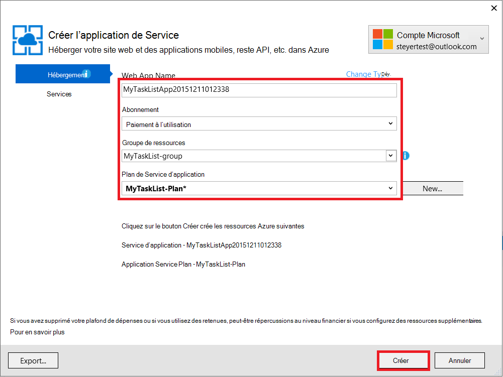
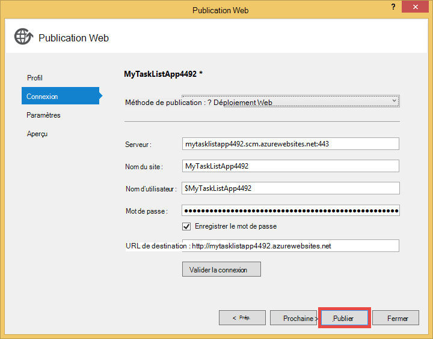

<properties 
    pageTitle="Créer une application web dans Azure qui se connecte à MongoDB en cours d’exécution sur une machine virtuelle" 
    description="Un didacticiel qui vous explique comment utiliser Git pour déployer une application ASP.NET au Service d’application Azure, connecté à MongoDB sur une Machine virtuelle de Azure."
    tags="azure-portal" 
    services="app-service\web, virtual-machines" 
    documentationCenter=".net" 
    authors="cephalin" 
    manager="wpickett" 
    editor=""/>

<tags 
    ms.service="app-service-web" 
    ms.workload="web" 
    ms.tgt_pltfrm="na" 
    ms.devlang="dotnet" 
    ms.topic="article" 
    ms.date="02/29/2016" 
    ms.author="cephalin"/>

# Créer une application web dans Azure qui se connecte à MongoDB en cours d’exécution sur une machine virtuelle

Git, vous pouvez déployer une application ASP.NET pour Azure Application Service Web Apps. Dans ce didacticiel, vous allez générer un MVC ASP.NET de frontal simple application de liste de tâches qui se connecte à une base de données MongoDB en cours d’exécution sur une machine virtuelle dans Azure.  [MongoDB] [ MongoDB] est un populaires ouvrir la source, la base de données NoSQL de hautes performances. Une fois en cours d’exécution et test de l’application ASP.NET sur votre ordinateur de développement, vous allez télécharger l’application pour l’application de Service Web Apps à l’aide de Git.

>[AZURE.NOTE] Si vous souhaitez commencer avec le Service d’application Azure avant l’ouverture d’un compte Azure, accédez à [Essayer le Service application](http://go.microsoft.com/fwlink/?LinkId=523751), où vous pouvez créer une application web de courte durée starter immédiatement dans le Service d’application. Aucune carte de crédit obligatoire ; aucun des engagements.

## Notions de base ##

Connaissance des éléments suivants est utile pour ce didacticiel, cependant ne pas requis :

* Le pilote C# pour MongoDB. Pour plus d’informations sur le développement d’applications C# contre MongoDB, consultez MongoDB [Centre de langage CSharp][MongoC#LangCenter]. 
* L’infrastructure d’application web ASP .NET. Vous pouvez pour tout savoir sur le [site Web ASP.net]à l’adresse[ASP.NET].
* L’infrastructure d’application web ASP .NET MVC. Vous pouvez apprendre tout sur le [site Web d’ASP.NET MVC][MVCWebSite].
* Azure. Vous pouvez commencer à [Azure][WindowsAzure].

## Conditions préalables ##

- [Visual Studio Express 2013 pour Web]  [ VSEWeb] ou [Visual Studio 2013] [VSUlt]
- [Azure SDK pour .NET](http://go.microsoft.com/fwlink/p/?linkid=323510&clcid=0x409)
- Un abonnement Microsoft Azure

[AZURE.INCLUDE [create-account-and-websites-note](../../includes/create-account-and-websites-note.md)]

 
## Créer un ordinateur virtuel et installez MongoDB ##

Ce didacticiel suppose que vous avez créé un ordinateur virtuel dans Azure. Après avoir créé l’ordinateur virtuel, vous devez installer MongoDB sur l’ordinateur virtuel :

* Pour créer une machine virtuelle Windows et installer MongoDB, reportez-vous à la section [Installation de MongoDB sur une machine virtuelle exécutant Windows Server dans Azure][InstallMongoOnWindowsVM].

Après avoir créé l’ordinateur virtuel dans Azure et installé MongoDB, assurez-vous de mémoriser le nom DNS de l’ordinateur virtuel (« testlinuxvm.cloudapp.net », par exemple) et le port externe pour MongoDB que vous avez spécifié dans le point de terminaison.  Vous aurez besoin de cette information plus loin dans le didacticiel.

## Création de l’application ##

Dans cette section, vous créez une application ASP.NET appelée « Ma liste de tâches » à l’aide de Visual Studio et effectuer un déploiement initial pour Azure Application Service Web Apps. Vous allez exécuter l’application localement, mais il va se connecter à votre machine virtuelle sur Azure et utilisez l’instance de MongoDB que vous avez créé.

1. Dans Visual Studio, cliquez sur **Nouveau projet**.

    ![Nouveau projet de Page de démarrage][StartPageNewProject]

1. Dans la fenêtre **Nouveau projet** , dans le volet gauche, sélectionnez **Visual C#**, puis sélectionnez **Web**. Dans le volet central, sélectionnez **l’Application Web de ASP.NET**. En bas, nommez votre projet « MyTaskListApp », puis cliquez sur **OK**.

    ![Boîte de dialogue Nouveau projet][NewProjectMyTaskListApp]

1. Dans la boîte de dialogue **Nouveau projet ASP.NET** **MVC**de sélectionner et puis cliquez sur **OK**.

    ![Sélectionnez le modèle MVC][VS2013SelectMVCTemplate]

1. Si vous n’êtes pas déjà connecté dans Microsoft Azure, vous êtes invité à vous connecter. Suivez les invites pour vous connecter à Azure.
2. Une fois que vous êtes connecté, vous pouvez commencer à configurer votre application de web Service de l’application. Spécifiez le **nom de l’application Web**, **service d’application**, **groupe de ressources**et **région**, puis cliquez sur **créer**.

    

1. Le projet après la fin de la création, d’attente de l’application web doit être créé dans le Service d’application Azure comme indiqué dans la fenêtre de **l’Activité de Service d’application Azure** . Puis, cliquez sur **Publier les MyTaskListApp à cette application Web maintenant**.

1. Cliquez sur **Publier**.

    

    Une fois que votre application d’ASP.NET par défaut est publiée sur Azure Application Service Web Apps, il sera lancé dans le navigateur.

## Installez le pilote MongoDB C#

MongoDB offre la prise en charge côté client pour les applications C# via un pilote, vous devez installer sur votre ordinateur de développement local. Le pilote de C# est disponible via NuGet.

Pour installer le pilote MongoDB C# :

1. Dans l' **Explorateur de solutions**, droit sur le projet **MyTaskListApp** , puis sélectionnez **Gérer les NuGetPackages**.

    ![Gérer les Packages NuGet][VS2013ManageNuGetPackages]

2. Dans la fenêtre **Gérer les Packages NuGet** , dans le volet gauche, cliquez sur **en ligne**. Dans la zone de **Recherche en ligne** sur la droite, tapez « mongodb.driver ».  Cliquez sur **installer** pour installer le pilote.

    ![Recherche de MongoDB C# pilote][SearchforMongoDBCSharpDriver]

3. Cliquez sur **J’accepte** pour accepter les 10gen, les termes de la licence Inc..

4. Une fois que le pilote est installé, cliquez sur **Fermer** .
    ![MongoDB C# pilote installé][MongoDBCsharpDriverInstalled]

Le pilote MongoDB C# est maintenant installé.  Les références aux bibliothèques de **MongoDB.Bson**, **MongoDB.Driver**et **MongoDB.Driver.Core** ont été ajoutés au projet.

![Références de MongoDB C# pilote][MongoDBCSharpDriverReferences]

## Ajout d’un modèle ##
Dans l' **Explorateur de solutions**, cliquez droit sur le dossier *modèles* et **Ajouter** une nouvelle **classe** et nommez-le *TaskModel.cs*.  Dans *TaskModel.cs*, remplacez le code existant par le code suivant :

    using System;
    using System.Collections.Generic;
    using System.Linq;
    using System.Web;
    using MongoDB.Bson.Serialization.Attributes;
    using MongoDB.Bson.Serialization.IdGenerators;
    using MongoDB.Bson;
    
    namespace MyTaskListApp.Models
    {
        public class MyTask
        {
            [BsonId(IdGenerator = typeof(CombGuidGenerator))]
            public Guid Id { get; set; }
    
            [BsonElement("Name")]
            public string Name { get; set; }
    
            [BsonElement("Category")]
            public string Category { get; set; }
    
            [BsonElement("Date")]
            public DateTime Date { get; set; }
    
            [BsonElement("CreatedDate")]
            public DateTime CreatedDate { get; set; }
    
        }
    }

## Ajouter de la couche d’accès aux données ##
Dans l' **Explorateur de solutions**, cliquez sur le projet de *MyTaskListApp* et **Ajouter** un **Nouveau dossier** nommé *DAL*.  Cliquez sur le dossier de la *couche DAL* et **Ajouter** une nouvelle **classe**. Nom du fichier de classe *Dal.cs*.  Dans *Dal.cs*, remplacez le code existant par le code suivant :

    using System;
    using System.Collections.Generic;
    using System.Linq;
    using System.Web;
    using MyTaskListApp.Models;
    using MongoDB.Driver;
    using MongoDB.Bson;
    using System.Configuration;
    
    
    namespace MyTaskListApp
    {
        public class Dal : IDisposable
        {
            private MongoServer mongoServer = null;
            private bool disposed = false;
    
            // To do: update the connection string with the DNS name
            // or IP address of your server. 
            //For example, "mongodb://testlinux.cloudapp.net"
            private string connectionString = "mongodb://mongodbsrv20151211.cloudapp.net";
    
            // This sample uses a database named "Tasks" and a 
            //collection named "TasksList".  The database and collection 
            //will be automatically created if they don't already exist.
            private string dbName = "Tasks";
            private string collectionName = "TasksList";
    
            // Default constructor.        
            public Dal()
            {
            }
    
            // Gets all Task items from the MongoDB server.        
            public List<MyTask> GetAllTasks()
            {
                try
                {
                    var collection = GetTasksCollection();
                    return collection.Find(new BsonDocument()).ToList();
                }
                catch (MongoConnectionException)
                {
                    return new List<MyTask>();
                }
            }
    
            // Creates a Task and inserts it into the collection in MongoDB.
            public void CreateTask(MyTask task)
            {
                var collection = GetTasksCollectionForEdit();
                try
                {
                    collection.InsertOne(task);
                }
                catch (MongoCommandException ex)
                {
                    string msg = ex.Message;
                }
            }
    
            private IMongoCollection<MyTask> GetTasksCollection()
            {
                MongoClient client = new MongoClient(connectionString);
                var database = client.GetDatabase(dbName);
                var todoTaskCollection = database.GetCollection<MyTask>(collectionName);
                return todoTaskCollection;
            }
    
            private IMongoCollection<MyTask> GetTasksCollectionForEdit()
            {
                MongoClient client = new MongoClient(connectionString);
                var database = client.GetDatabase(dbName);
                var todoTaskCollection = database.GetCollection<MyTask>(collectionName);
                return todoTaskCollection;
            }
    
            # region IDisposable
    
            public void Dispose()
            {
                this.Dispose(true);
                GC.SuppressFinalize(this);
            }
    
            protected virtual void Dispose(bool disposing)
            {
                if (!this.disposed)
                {
                    if (disposing)
                    {
                        if (mongoServer != null)
                        {
                            this.mongoServer.Disconnect();
                        }
                    }
                }
    
                this.disposed = true;
            }
    
            # endregion
        }
    }

## Ajouter un contrôleur ##
Ouvrez le fichier *Controllers\HomeController.cs* dans **L’Explorateur de solutions** et remplacez le code existant par le suivant :

    using System;
    using System.Collections.Generic;
    using System.Linq;
    using System.Web;
    using System.Web.Mvc;
    using MyTaskListApp.Models;
    using System.Configuration;
    
    namespace MyTaskListApp.Controllers
    {
        public class HomeController : Controller, IDisposable
        {
            private Dal dal = new Dal();
            private bool disposed = false;
            //
            // GET: /MyTask/
    
            public ActionResult Index()
            {
                return View(dal.GetAllTasks());
            }
    
            //
            // GET: /MyTask/Create
    
            public ActionResult Create()
            {
                return View();
            }
    
            //
            // POST: /MyTask/Create
    
            [HttpPost]
            public ActionResult Create(MyTask task)
            {
                try
                {
                    dal.CreateTask(task);
                    return RedirectToAction("Index");
                }
                catch
                {
                    return View();
                }
            }
    
            public ActionResult About()
            {
                return View();
            }
    
            # region IDisposable
    
            new protected void Dispose()
            {
                this.Dispose(true);
                GC.SuppressFinalize(this);
            }
    
            new protected virtual void Dispose(bool disposing)
            {
                if (!this.disposed)
                {
                    if (disposing)
                    {
                        this.dal.Dispose();
                    }
                }
    
                this.disposed = true;
            }
    
            # endregion
    
        }
    }

## Définir les styles ##
Pour modifier le titre en haut de la page, ouvrez la *Views\Shared\\_Layout.cshtml* de fichiers dans **L’Explorateur de solutions** et de remplacer « Application name » dans l’en-tête de la barre de navigation avec « Mon Application de liste de tâche » afin qu’il ressemble à ceci :

    @Html.ActionLink("My Task List Application", "Index", "Home", null, new { @class = "navbar-brand" })

Pour configurer le menu de la liste des tâches, ouvrez le fichier *\Views\Home\Index.cshtml* et remplacez le code existant par le code suivant :
    
    @model IEnumerable<MyTaskListApp.Models.MyTask>
    
    @{
        ViewBag.Title = "My Task List";
    }
    
    <h2>My Task List</h2>
    
    <table border="1">
        <tr>
            <th>Task</th>
            <th>Category</th>
            <th>Date</th>
            
        </tr>
    
    @foreach (var item in Model) {
        <tr>
            <td>
                @Html.DisplayFor(modelItem => item.Name)
            </td>
            <td>
                @Html.DisplayFor(modelItem => item.Category)
            </td>
            <td>
                @Html.DisplayFor(modelItem => item.Date)
            </td>
            
        </tr>
    }
    
    </table>
    
  @Html.Partial("Create", new MyTaskListApp.Models.MyTask())

Pour ajouter la possibilité de créer une nouvelle tâche, cliquez sur le *Views\Home\\ * dossier et **Ajouter** une **vue**.  Nom de la vue *Création*. Remplacez le code par le texte suivant :

    @model MyTaskListApp.Models.MyTask
    
    
    
    
    
    @using (Html.BeginForm("Create", "Home")) {
        @Html.ValidationSummary(true)
        <fieldset>
            <legend>New Task</legend>
    
            

                @Html.LabelFor(model => model.Name)
            

            

                @Html.EditorFor(model => model.Name)
                @Html.ValidationMessageFor(model => model.Name)
            

    
            

                @Html.LabelFor(model => model.Category)
            

            

                @Html.EditorFor(model => model.Category)
                @Html.ValidationMessageFor(model => model.Category)
            

    
            

                @Html.LabelFor(model => model.Date)
            

            

                @Html.EditorFor(model => model.Date)
                @Html.ValidationMessageFor(model => model.Date)
            

    
            

                <input type="submit" value="Create" />
            

        </fieldset>
    }

**L’Explorateur de solutions** doit ressembler à ceci :

![L’Explorateur de solutions][SolutionExplorerMyTaskListApp]

## Définissez la chaîne de connexion de MongoDB ##
Dans l' **Explorateur de solutions**, ouvrez le fichier *DAL/Dal.cs* . Rechercher la ligne de code suivante :

    private string connectionString = "mongodb://<vm-dns-name>";

Remplacer `<vm-dns-name>` avec le nom DNS de l’ordinateur virtuel en cours d’exécution MongoDB que vous avez créé à l’étape [créer un ordinateur virtuel et installez MongoDB][] de ce didacticiel.  Pour trouver le nom DNS de votre machine virtuelle, accédez au portail Azure, sélectionnez **Machines virtuelles**et rechercher le **Nom DNS**.

Si le nom DNS de l’ordinateur virtuel est « testlinuxvm.cloudapp.net » et MongoDB est à l’écoute sur le port par défaut 27017, la ligne de chaîne de connexion du code ressemble à :

    private string connectionString = "mongodb://testlinuxvm.cloudapp.net";

Si le point de terminaison de machine virtuelle spécifie un autre port externe pour MongoDB, vous pouvez spécifier le port dans la chaîne de connexion :

    private string connectionString = "mongodb://testlinuxvm.cloudapp.net:12345";

Pour plus d’informations sur les chaînes de connexion de MongoDB, consultez [connexions][MongoConnectionStrings].

## Tester le déploiement local ##

Pour exécuter votre application sur votre ordinateur de développement, sélectionnez **Démarrer le débogage** dans le menu **Déboguer** ou appuyez sur **F5**. IIS Express démarre et un navigateur s’ouvre et lance la page d’accueil de l’application.  Vous pouvez ajouter une nouvelle tâche, qui sera ajoutée à la base de données MongoDB en cours d’exécution sur votre ordinateur virtuel dans Azure.

![Mon Application de liste de tâches][TaskListAppBlank]

## Publier vers Azure Application Service Web Apps

Dans cette section, vous allez publier vos modifications pour Azure Application Service Web Apps.

1. Dans l’Explorateur de solutions, cliquez de nouveau sur **MyTaskListApp** et cliquez sur **Publier**.
2. Cliquez sur **Publier**.

    Vous devez maintenant voir votre application web en cours d’exécution dans le Service d’application Azure et accéder à la base de données de MongoDB dans Azure Virtual Machines.

## Résumé ##

Vous avez déployé avec succès votre application ASP.NET à Azure Application Service Web Apps. Pour afficher l’application web :

1. Journal du portail Azure.
2. Cliquez sur **les applications Web**. 
3. Sélectionnez votre application web dans la liste des **Applications Web** .

Pour plus d’informations sur le développement d’applications C# contre MongoDB, voir le [Centre de langage CSharp][MongoC#LangCenter]. 

[AZURE.INCLUDE [app-service-web-whats-changed](../../includes/app-service-web-whats-changed.md)]
 

<!-- HYPERLINKS -->

[AzurePortal]: http://manage.windowsazure.com
[WindowsAzure]: http://www.windowsazure.com
[MongoC#LangCenter]: http://docs.mongodb.org/ecosystem/drivers/csharp/
[MVCWebSite]: http://www.asp.net/mvc
[ASP.NET]: http://www.asp.net/
[MongoConnectionStrings]: http://www.mongodb.org/display/DOCS/Connections
[MongoDB]: http://www.mongodb.org
[InstallMongoOnWindowsVM]: ../virtual-machines/virtual-machines-windows-classic-install-mongodb.md
[VSEWeb]: http://www.microsoft.com/visualstudio/eng/2013-downloads#d-2013-express
[VSUlt]: http://www.microsoft.com/visualstudio/eng/2013-downloads

<!-- IMAGES -->

[StartPageNewProject]: ./media/web-sites-dotnet-store-data-mongodb-vm/NewProject.png
[NewProjectMyTaskListApp]: ./media/web-sites-dotnet-store-data-mongodb-vm/NewProjectMyTaskListApp.png
[VS2013SelectMVCTemplate]: ./media/web-sites-dotnet-store-data-mongodb-vm/VS2013SelectMVCTemplate.png
[VS2013DefaultMVCApplication]: ./media/web-sites-dotnet-store-data-mongodb-vm/VS2013DefaultMVCApplication.png
[VS2013ManageNuGetPackages]: ./media/web-sites-dotnet-store-data-mongodb-vm/VS2013ManageNuGetPackages.png
[SearchforMongoDBCSharpDriver]: ./media/web-sites-dotnet-store-data-mongodb-vm/SearchforMongoDBCSharpDriver.png
[MongoDBCsharpDriverInstalled]: ./media/web-sites-dotnet-store-data-mongodb-vm/MongoDBCsharpDriverInstalled.png
[MongoDBCSharpDriverReferences]: ./media/web-sites-dotnet-store-data-mongodb-vm/MongoDBCSharpDriverReferences.png
[SolutionExplorerMyTaskListApp]: ./media/web-sites-dotnet-store-data-mongodb-vm/SolutionExplorerMyTaskListApp.png
[TaskListAppBlank]: ./media/web-sites-dotnet-store-data-mongodb-vm/TaskListAppBlank.png
[WAWSCreateWebSite]: ./media/web-sites-dotnet-store-data-mongodb-vm/WAWSCreateWebSite.png
[WAWSDashboardMyTaskListApp]: ./media/web-sites-dotnet-store-data-mongodb-vm/WAWSDashboardMyTaskListApp.png
[Image9]: ./media/web-sites-dotnet-store-data-mongodb-vm/RepoReady.png
[Image10]: ./media/web-sites-dotnet-store-data-mongodb-vm/GitInstructions.png
[Image11]: ./media/web-sites-dotnet-store-data-mongodb-vm/GitDeploymentComplete.png

<!-- TOC BOOKMARKS -->
[Créer un ordinateur virtuel et installez MongoDB]: #virtualmachine
[Create and run the My Task List ASP.NET application on your development computer]: #createapp
[Create an Azure web site]: #createwebsite
[Deploy the ASP.NET application to the web site using Git]: #deployapp
 