<properties 
    pageTitle="Résoudre les problèmes liés à une application web dans le Service d’application Azure à l’aide de Visual Studio" 
    description="Découvrez comment résoudre les problèmes d’une application web Azure en utilisant le débogage distant, de suivi et de journalisation les outils intégrés à Visual Studio 2013." 
    services="app-service" 
    documentationCenter=".net" 
    authors="tdykstra" 
    manager="wpickett" 
    editor=""/>

<tags 
    ms.service="app-service" 
    ms.workload="na" 
    ms.tgt_pltfrm="na" 
    ms.devlang="dotnet" 
    ms.topic="article" 
    ms.date="08/29/2016" 
    ms.author="rachelap"/>

# Résoudre les problèmes liés à une application web dans le Service d’application Azure à l’aide de Visual Studio

## Vue d’ensemble

Ce didacticiel explique comment utiliser les outils de Visual Studio qui permettent de déboguer une application web dans le [Service d’application](http://go.microsoft.com/fwlink/?LinkId=529714), en exécutant à distance en [mode débogage](http://www.visualstudio.com/get-started/debug-your-app-vs.aspx) ou en consultant les journaux d’application et les journaux de serveur web.

[AZURE.INCLUDE [app-service-web-to-api-and-mobile](../../includes/app-service-web-to-api-and-mobile.md)]

Vous apprendrez à :

* Les fonctions de gestion d’application Azure web sont disponibles dans Visual Studio.
* Comment utiliser l’affichage à distance de Visual Studio pour apporter des modifications rapides dans une application web à distance.
* L’exécution en mode de débogage à distance pendant un projet s’exécute dans Azure, pour une application web et un WebJob.
* Comment créer des journaux d’application et de les afficher lors de l’application est leur création.
* Comment afficher les journaux de serveur web, y compris les messages d’erreur détaillés et Échec de suivi de la demande.
* Procédure d’envoi des journaux de diagnostic pour un stockage Azure compte et il les afficher.

Si vous disposez de Visual Studio Ultimate, vous pouvez également utiliser [IntelliTrace](http://msdn.microsoft.com/library/vstudio/dd264915.aspx) pour le débogage. IntelliTrace n’est pas abordé dans ce didacticiel.

## Conditions préalables

Ce didacticiel fonctionne avec l’environnement de développement, de projet web et application web Azure que vous paramétrez dans [mise en route avec Azure et ASP.NET][GetStarted]. Pour les sections de la WebJobs, vous aurez besoin de l’application que vous créez dans [Mise en route avec le Kit de développement Azure WebJobs][GetStartedWJ].

Les exemples de code de ce didacticiel sont pour une application web de MVC C#, mais les procédures de dépannage sont les mêmes pour les applications Visual Basic et de Web Forms.

Ce didacticiel suppose que vous utilisez Visual Studio 2015 ou 2013. Si vous utilisez Visual Studio 2013, les fonctionnalités WebJobs nécessitent la [mise à jour 4](http://go.microsoft.com/fwlink/?LinkID=510314) ou une version ultérieure. 

Les journaux en continu fonctionnalité fonctionne uniquement pour les applications qui ciblent.NET Framework 4 ou version ultérieure.

## Gestion et configuration d’application web

Visual Studio fournit l’accès à un sous-ensemble des fonctions de gestion des applications web et des paramètres de configuration disponibles dans le [Portail Azure](http://go.microsoft.com/fwlink/?LinkId=529715). Dans cette section, vous verrez ce qui est disponible en utilisant **l’Explorateur de serveurs**. Pour voir les dernières fonctionnalités d’intégration d’Azure, essayer de **Cloud Explorer** également. Vous pouvez ouvrir deux fenêtres dans le menu **affichage** . 

1. Si vous n’êtes pas déjà connecté à Azure dans Visual Studio, cliquez sur le bouton **se connecter pour Azure** dans **l’Explorateur de serveurs**.

    Une alternative consiste à installer un certificat de gestion qui permet d’accéder à votre compte. Si vous choisissez d’installer un certificat, cliquez sur le nœud **d’Azure** dans **l’Explorateur de serveurs**, puis cliquez sur **filtrer les abonnements et les gérer** dans le menu contextuel. Dans la boîte de dialogue **Gérer les abonnements Azure** , cliquez sur l’onglet **certificats** , puis cliquez sur **Importer**. Suivez les instructions pour télécharger et ensuite importer un fichier d’abonnement (également appelé fichier *.publishsettings* ) pour votre compte Azure.

    > [AZURE.NOTE]
    > Si vous téléchargez un fichier d’abonnement, enregistrez-le dans un dossier en dehors de vos répertoires de code source (par exemple, dans le dossier Téléchargements) et ensuite de le supprimer une fois l’importation terminée. Un utilisateur malveillant qui parvient à accéder au fichier d’abonnement peut modifier, créer et supprimer vos services Azure.

    Pour plus d’informations sur la connexion aux ressources Azure à partir de Visual Studio, voir [Gérer les comptes, les abonnements et les rôles administratifs](http://go.microsoft.com/fwlink/?LinkId=324796#BKMK_AccountVCert).

2. Dans l' **Explorateur de serveurs**, développez **Azure** et **Service de l’application**.

3. Développez le groupe de ressources contenant l’application web que vous avez créé dans la [mise en route avec Azure et ASP.NET][GetStarted], puis cliquez sur le nœud d’application web et cliquez sur **Paramètres d’affichage**.

    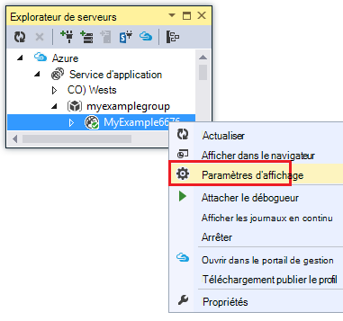

    L’onglet **Azure Web App** s’affiche et vous pouvez voir les tâches d’application web gestion et de configuration qui sont disponibles dans Visual Studio.

    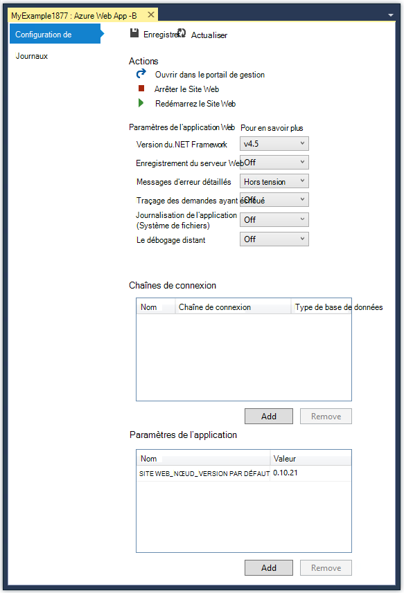

    Dans ce didacticiel vous utiliserez l’enregistrement et le suivi listes déroulantes. Vous allez également utiliser le débogage à distance, mais vous allez utiliser une méthode différente pour l’activer.
   
    Pour plus d’informations sur les boîtes de paramètres d’application et des chaînes de connexion dans cette fenêtre, consultez [Azure Web Apps : comment les chaînes d’Application et de travail des chaînes de connexion](http://blogs.msdn.com/b/windowsazure/archive/2013/07/17/windows-azure-web-sites-how-application-strings-and-connection-strings-work.aspx).

    Si vous souhaitez effectuer une tâche de gestion d’application web qui ne peut pas être effectuée dans cette fenêtre, cliquez sur **Ouvrir dans le portail de gestion** pour ouvrir une fenêtre de navigateur pour le portail Azure.

## Fichiers d’application web Access dans l’Explorateur de serveurs

En général, vous déployez un projet web avec le `customErrors` indicateur dans le fichier Web.config la valeur `On` ou `RemoteOnly`, qui signifie que vous n’obtenez pas un message d’erreur utile lorsque quelque chose se passe mal. Pour de nombreuses erreurs, tout ce que vous obtenez est une page comme un des messages suivants.

**Erreur du serveur dans l’Application '/' :**

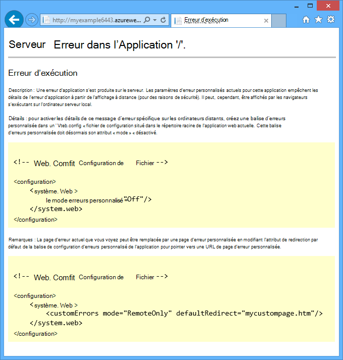

**Une erreur s’est produite :**

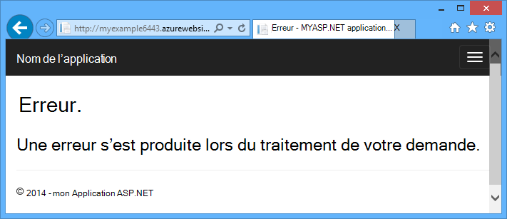

**Le site Web ne peut pas afficher la page**

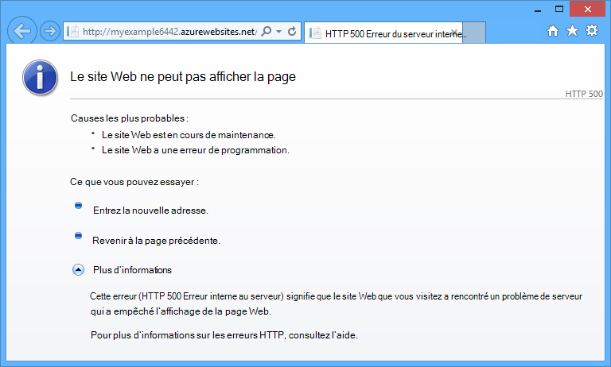

La façon la plus simple pour trouver la cause de l’erreur est souvent pour activer les messages d’erreur détaillés, le premier de la capture d’écran précédente explique la procédure à suivre. Qui nécessite une modification dans le fichier Web.config déployé. Vous pouvez modifier le fichier *Web.config* dans le projet et redéployer le projet, ou de créer une [transformation de Web.config](http://www.asp.net/mvc/tutorials/deployment/visual-studio-web-deployment/web-config-transformations) et déployer une version debug, mais il existe un moyen plus rapide : dans **L’Explorateur de solutions** , vous pouvez directement consulter et modifier les fichiers dans l’application web à distance à l’aide de la fonction *d’affichage à distance* .

1. Dans l' **Explorateur de serveurs**, développez **Azure**, développez le **Service de l’application**, développez le groupe de ressources où se trouve votre application web et puis développez le nœud pour votre application web.

    Vous consultez des nœuds qui vous donnent accès à des fichiers de contenu et les fichiers journaux de l’application web.

2. Développez le nœud **fichiers** et double-cliquez sur le fichier *Web.config* .

    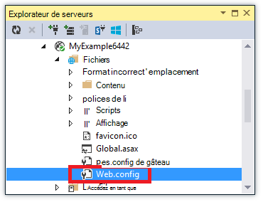

    Visual Studio ouvre le fichier Web.config de l’application web à distance et [distant] s’affiche en regard de nom du fichier dans la barre de titre.

3. Ajoutez la ligne suivante à la `system.web` élément :

    `<customErrors mode="Off"></customErrors>`

    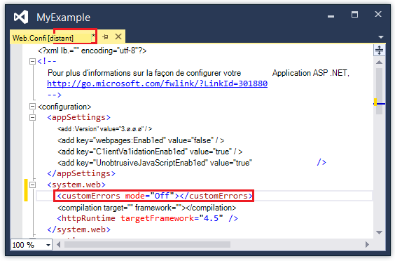

4. Actualisez le navigateur qui affiche le message d’erreur inutile, et maintenant vous obtenez un message d’erreur détaillé, comme dans l’exemple suivant :

    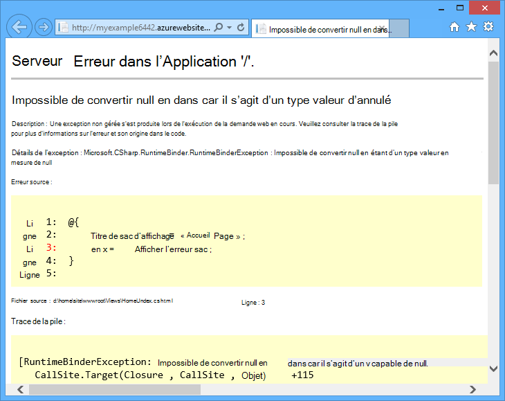

    (Le message d’erreur indiqué a été créé en ajoutant la ligne apparaissent en rouge à *Views\Home\Index.cshtml*).

Modification du fichier Web.config n'est qu’un exemple de scénarios dans lesquels la possibilité de lire et de modifier des fichiers dans votre application web Azure faciliter le dépannage.

## Applications web débogage à distance

Si le message d’erreur détaillé ne fournit pas suffisamment d’informations, et vous ne pouvez pas recréer l’erreur localement, une autre pour résoudre les problèmes consiste à exécuter en mode de débogage à distance. Vous pouvez définir des points d’arrêt, manipuler directement de mémoire, parcourez le code et même modifier le chemin d’accès du code. 

Le débogage distant ne fonctionne pas dans les éditions Express de Visual Studio.

Cette section indique comment déboguer à distance à l’aide de votre nouveau projet dans [mise en route avec Azure et ASP.NET][GetStarted].

1. Ouvrez le projet web que vous avez créé dans la [mise en route avec Azure et ASP.NET][GetStarted].

1. Ouvrez *Controllers\HomeController.cs*.

2. Supprimer le `About()` méthode et insérez le code suivant à la place.

        public ActionResult About()
        {
            string currentTime = DateTime.Now.ToLongTimeString();
            ViewBag.Message = "The current time is " + currentTime;
            return View();
        }

2. [Définissez un point d’arrêt](http://www.visualstudio.com/get-started/debug-your-app-vs.aspx) sur le `ViewBag.Message` ligne.

1. Dans l' **Explorateur de solutions**, cliquez sur le projet et cliquez sur **Publier**.

2. Dans la liste déroulante **profil** , sélectionnez le même profil que celui que vous avez utilisée dans la [mise en route avec Azure et ASP.NET][GetStarted].

3. Cliquez sur l’onglet **paramètres** et modifier la **Configuration** pour le **débogage**, puis cliquez sur **Publier**.

    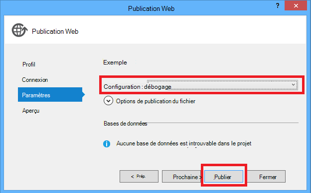

4. Après le déploiement se termine et votre navigateur s’ouvre à l’URL Azure de votre application web, fermez le navigateur.

5. Dans l' **Explorateur de serveurs**, avec le bouton droit de votre application web, puis cliquez sur **Attacher un débogueur**. 

    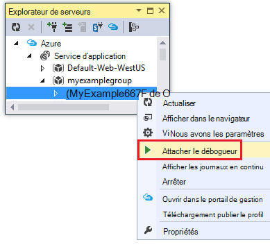

    Le navigateur s’ouvre automatiquement à votre page d’accueil en cours d’exécution dans Azure. Vous devrez peut-être attendre 20 secondes ou ainsi Azure configure le serveur pour le débogage. Ce délai ne se produit que la première fois que vous exécutez en mode débogage sur une application web. Les démarrages suivants dans les 48 heures lorsque vous commencez à déboguer à nouveau il ne sont pas un délai d’attente.

    **Remarque :** Si vous avez des problèmes pour démarrer le débogueur, essayez de le faire à l’aide de **Cloud Explorer** au lieu de **l’Explorateur de serveurs**.

6. Cliquez sur à **propos** dans le menu.

    Visual Studio s’arrête sur le point d’arrêt, et le code s’exécute dans Azure, pas sur votre ordinateur local.

7. Placez le curseur sur le `currentTime` variable pour déterminer la valeur d’heure.

    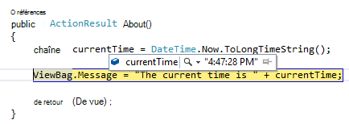

    Le temps que vous consultez est l’heure du serveur Azure, qui se trouve dans un autre fuseau horaire de votre ordinateur local.

8. Entrez une nouvelle valeur pour le `currentTime` variable, tel que « En cours d’exécution dans Azure ».

5. Appuyez sur F5 pour continuer à s’exécuter.

    La page en cours d’exécution dans Azure à propos affiche la nouvelle valeur que vous avez entré dans la variable currentTime.

    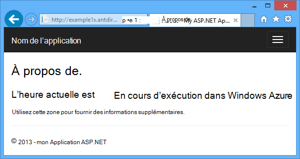

## WebJobs de débogage à distance

Cette section indique comment déboguer à distance à l’aide de l’application web et projet que vous créez dans [Mise en route avec le Kit de développement logiciel WebJobs Azure](websites-dotnet-webjobs-sdk.md). 

Les fonctions illustrées dans cette section sont disponibles uniquement dans Visual Studio 2013, avec mise à jour 4 ou une version ultérieure. 

Le débogage distant fonctionne uniquement avec des WebJobs en continu. WebJobs planifiées et à la demande ne prend pas en charge le débogage.

1. Ouvrez le projet web que vous avez créé dans la [Mise en route avec le Kit de développement Azure WebJobs][GetStartedWJ].

1. Dans le projet ContosoAdsWebJob, ouvrez *Functions.cs*.

2. [Définissez un point d’arrêt](http://www.visualstudio.com/get-started/debug-your-app-vs.aspx) sur la première instruction de la `GnerateThumbnail` méthode.

    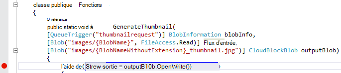

1. Dans l' **Explorateur de solutions**, cliquez sur le projet web (et non le projet WebJob) et cliquez sur **Publier**.

2. Dans la liste déroulante **profil** , sélectionnez le même profil que celui que vous avez utilisée dans la [Mise en route avec le Kit de développement logiciel WebJobs Azure](websites-dotnet-webjobs-sdk.md).

3. Cliquez sur l’onglet **paramètres** et modifier la **Configuration** pour le **débogage**, puis cliquez sur **Publier**.

    Visual Studio déploie le web et les projets de WebJob, et votre navigateur s’ouvre à l’URL Azure de votre application web.

5. Dans **l’Explorateur de serveurs** , développez **Azure > Application Service > votre groupe de ressources > votre application web > WebJobs > continu**, puis cliquez sur **ContosoAdsWebJob**.

7. Cliquez sur **joindre un débogueur**. 

    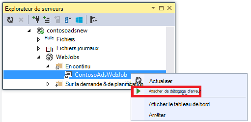

    Le navigateur s’ouvre automatiquement à votre page d’accueil en cours d’exécution dans Azure. Vous devrez peut-être attendre 20 secondes ou ainsi Azure configure le serveur pour le débogage. Ce délai ne se produit que la première fois que vous exécutez en mode débogage sur une application web. La prochaine fois que vous joignez le débogueur n’est pas un délai, si vous le faites dans les 48 heures.

6. Dans le navigateur web s’ouvre à la page d’accueil Contoso annonces, créer une nouvelle annonce. 

    Création d’une annonce provoque un message de file d’attente à créer, qui est pris en compte par la WebJob et traité. Lorsque le SDK WebJobs appelle la fonction pour traiter le message de la file d’attente, le code sera atteint votre point d’arrêt.

7. Lorsque le débogueur s’arrête à votre point d’arrêt, vous pouvez examiner et modifier les valeurs de variables pendant que le programme est en cours d’exécution le nuage. Dans l’illustration suivante, le débogueur affiche le contenu de l’objet blobInfo qui a été passé à la méthode GenerateThumbnail.

    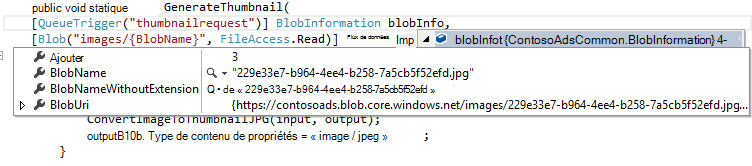
 
5. Appuyez sur F5 pour continuer à s’exécuter.

    La méthode GenerateThumbnail a terminé la création de la miniature.

6. Dans le navigateur, actualisez la page d’Index, et que la miniature.

6. Dans Visual Studio, appuyez sur MAJ + F5 pour arrêter le débogage.

7. Dans l' **Explorateur de serveurs**, cliquez sur le nœud ContosoAdsWebJob, puis cliquez sur **Afficher le tableau de bord**.

8. Connectez-vous avec vos informations d’identification Azure, puis cliquez sur le nom de WebJob pour accéder à la page de votre WebJob. 

    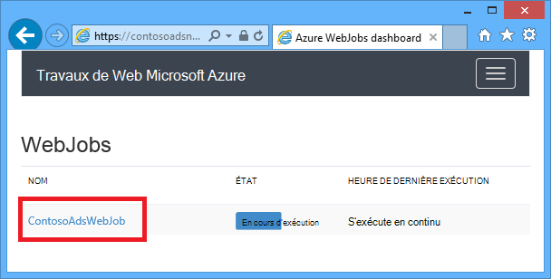

    Le tableau de bord qui affiche la fonction GenerateThumbnail exécutée récemment.

    (La prochaine fois que vous cliquez sur **Afficher le tableau de bord**, vous n’êtes pas obligé de se connecter, et le navigateur accède directement à la page pour votre WebJob.)

9. Cliquez sur le nom de la fonction pour afficher plus d’informations sur l’exécution de la fonction.

    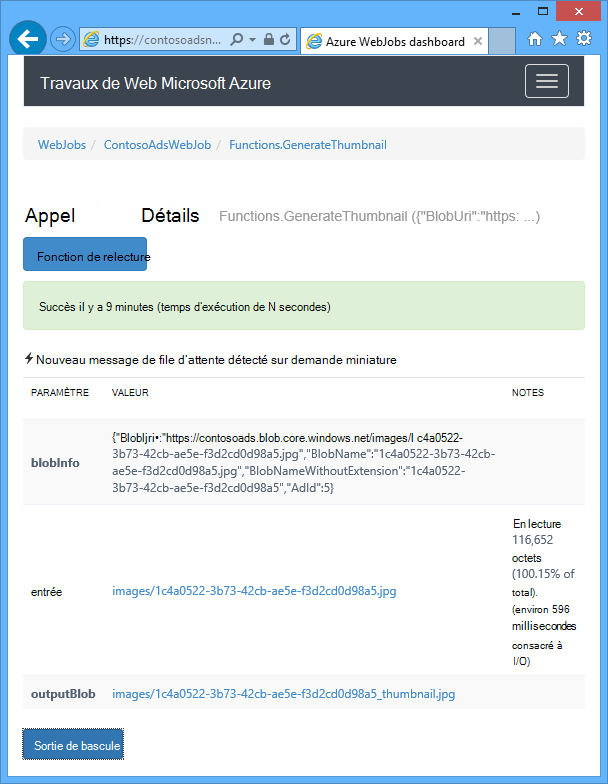

Si votre fonction [a écrit des journaux](websites-dotnet-webjobs-sdk-storage-queues-how-to.md#logs), vous pouvez cliquer sur **ToggleOutput** de les voir.

## Notes sur le débogage distant

* Exécution en mode débogage dans la production n’est pas recommandée. Si votre application web de production n’est pas répartie sur plusieurs instances de serveur, débogage empêche le serveur web de répondre aux autres requêtes. Si vous avez plusieurs instances du serveur web, lorsque vous joignez le débogueur vous obtiendrez une instance aléatoire, et vous n’avez aucun moyen pour vous assurer que les demandes suivantes ira à cette instance. Également, vous déployez en général n’une version debug à la production et pour les versions release, les optimisations du compilateur peuvent rendre impossible d’afficher ce qui se passe ligne par ligne dans votre code source. Pour résoudre des problèmes de production, votre meilleure ressource est application des journaux de serveur web et de suivi.

* Éviter de longs arrête à des points d’arrêt à distance de débogage. Azure traite un processus qui est arrêté pendant plus de quelques minutes sous la forme d’un processus ne répond pas et il s’arrête.

* Pendant que vous déboguez, le serveur envoie des données à Visual Studio, ce qui pourrait affecter les frais de bande passante. Pour plus d’informations sur les taux de bande passante, consultez [Tarification d’Azure](/pricing/calculator/).

* Assurez-vous que le `debug` attribut de la `compilation` élément dans le fichier *Web.config* a la valeur True. Il a la valeur true par défaut, lorsque vous publiez une configuration de build debug.

        <system.web>
          <compilation debug="true" targetFramework="4.5" />
          <httpRuntime targetFramework="4.5" />
        </system.web>

* Si vous trouvez que le débogueur ne détaillé dans le code que vous souhaitez déboguer, vous devrez peut-être modifier le paramètre uniquement mon Code.  Pour plus d’informations, voir [restreindre l’exécution pas à pas pour uniquement mon Code](http://msdn.microsoft.com/library/vstudio/y740d9d3.aspx#BKMK_Restrict_stepping_to_Just_My_Code).

* Une minuterie démarre sur le serveur lorsque vous activez la fonctionnalité de débogage à distance et 48 heures après la fonctionnalité est automatiquement désactivée. Cette limite de 48 heures est effectuée pour des raisons de sécurité et les performances. Vous pouvez facilement activer la fonctionnalité sur autant de fois que vous le souhaitez. Nous vous recommandons de laisser désactivée lorsque vous effectuez un débogage pas activement.

* Vous pouvez manuellement attacher le débogueur à un processus, et pas uniquement le processus application web (w3wp.exe). Pour plus d’informations sur l’utilisation du mode débogage dans Visual Studio, consultez [débogage dans Visual Studio](http://msdn.microsoft.com/library/vstudio/sc65sadd.aspx).

## Vue d’ensemble des journaux de diagnostic

Une application ASP.NET qui s’exécute dans une application web Azure peut créer les types de journaux suivants :

* **Journaux de suivi d’application** 
  L’application crée ces journaux en appelant les méthodes de la classe de [System.Diagnostics.Trace](http://msdn.microsoft.com/library/system.diagnostics.trace.aspx) .
* **Journaux de serveur Web** 
  Le serveur web crée une entrée de journal pour chaque requête HTTP pour l’application web.
* **Journaux de messages d’erreur détaillés** 
  Le serveur web crée une page HTML avec des informations supplémentaires pour les demandes HTTP a échoué (celles qui résultent en un code d’état 400 ou supérieur). 
* **Échec de journaux de suivi des demandes** 
  Le serveur web crée un fichier XML avec les informations de suivi détaillées pour les demandes HTTP a échoué. Le serveur web fournit également un fichier XSL pour mettre en forme le code XML dans un navigateur.
  
Enregistrement affecte les performances des applications web, Azure vous donne la possibilité d’activer ou de désactiver chaque type de journal en fonction des besoins. Pour les journaux de l’application, vous pouvez spécifier que seuls les journaux au-dessus d’un certain niveau de gravité doivent être écrits. Lorsque vous créez une nouvelle application web, par défaut tous les enregistrement est désactivé.

Les journaux sont écrits dans les fichiers d’un dossier de *fichiers journaux* dans le système de fichiers de votre application web et sont accessibles via FTP. Journaux de serveur Web et des applications peuvent également être écrites à un compte de stockage Azure. Vous pouvez conserver un plus grand nombre de journaux dans un compte de stockage que dans le système de fichiers. Vous êtes limité à un maximum de 100 mégaoctets de journaux lorsque vous utilisez le système de fichiers. (Système de fichiers journaux sont uniquement pour la rétention à court terme. Azure supprime les anciens fichiers journaux pour libérer de l’espace pour les nouveaux une fois la limite atteinte.)  

## Créer et afficher des journaux d’application

Dans cette section, vous allez effectuer les tâches suivantes :

* Ajouter des instructions de traçage pour le projet web que vous avez créé dans la [mise en route avec Azure et ASP.NET][GetStarted].
* Afficher les journaux lorsque vous exécutez le projet localement.
* Afficher les journaux qu’ils sont générés par l’application qui s’exécute dans Azure. 

Pour des informations sur la création d’application WebJobs se connecte, consultez [comment travailler avec le stockage Azure de file d’attente à l’aide du SDK WebJobs - comment écrire des journaux de](websites-dotnet-webjobs-sdk-storage-queues-how-to.md#logs). Les instructions suivantes pour l’affichage de journaux et de contrôler la façon dont elles sont stockées dans Azure s’appliquent également aux journaux d’application créés par WebJobs. 

### Ajouter des instructions de traçage à l’application

1. Ouvrez *Controllers\HomeController.cs*et remplacez le `Index`, `About`, et `Contact` méthodes avec le code suivant pour ajouter `Trace` instructions et un `using` instruction pour `System.Diagnostics`:

        public ActionResult Index()
        {
            Trace.WriteLine("Entering Index method");
            ViewBag.Message = "Modify this template to jump-start your ASP.NET MVC application.";
            Trace.TraceInformation("Displaying the Index page at " + DateTime.Now.ToLongTimeString());
            Trace.WriteLine("Leaving Index method");
            return View();
        }
        
        public ActionResult About()
        {
            Trace.WriteLine("Entering About method");
            ViewBag.Message = "Your app description page.";
            Trace.TraceWarning("Transient error on the About page at " + DateTime.Now.ToShortTimeString());
            Trace.WriteLine("Leaving About method");
            return View();
        }
        
        public ActionResult Contact()
        {
            Trace.WriteLine("Entering Contact method");
            ViewBag.Message = "Your contact page.";
            Trace.TraceError("Fatal error on the Contact page at " + DateTime.Now.ToLongTimeString());
            Trace.WriteLine("Leaving Contact method");
            return View();
        }       

2. Ajouter un `using System.Diagnostics;` en haut du fichier.
                
### Afficher la sortie de traçage localement

3. Appuyez sur F5 pour exécuter l’application en mode débogage.

    L’écouteur de la trace par défaut écrit toutes les sorties de traçage dans la fenêtre **sortie** , ainsi que d’autres résultats de débogage. L’illustration suivante montre la sortie dans les instructions trace que vous avez ajoutés à la `Index` méthode.

    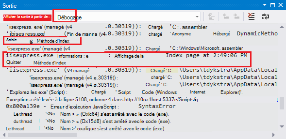

    Les étapes suivantes indiquent comment afficher la sortie de trace dans une page web, sans le compiler en mode débogage.

2. Ouvrez le fichier Web.config de l’application (celle qui se trouve dans le dossier du projet) et ajoutez une `<system.diagnostics>` élément à la fin du fichier juste avant la fermeture de `</configuration>` élément :

        <system.diagnostics>
            <trace>
              <listeners>
                <add name="WebPageTraceListener"
                    type="System.Web.WebPageTraceListener, 
                    System.Web, 
                    Version=4.0.0.0, 
                    Culture=neutral,
                    PublicKeyToken=b03f5f7f11d50a3a" />
              </listeners>
            </trace>
          </system.diagnostics>

    Le `WebPageTraceListener` sortie de trace vous permet d’afficher en accédant à `/trace.axd`.

3. Ajoutez un <a href="http://msdn.microsoft.com/library/vstudio/6915t83k(v=vs.100).aspx">élément trace</a> sous `<system.web>` dans le fichier Web.config, comme dans l’exemple suivant :

        <trace enabled="true" writeToDiagnosticsTrace="true" mostRecent="true" pageOutput="false" />

3. Appuyez sur CTRL + F5 pour exécuter l’application.

4. Dans la barre d’adresses de la fenêtre du navigateur, ajoutez *trace.axd* à l’URL et puis appuyez sur entrée (l’URL sera semblable à http://localhost:53370/trace.axd).

5. Sur la page de la **Trace de l’Application** , cliquez sur **Afficher les détails** sur la première ligne (et non la ligne de BrowserLink).

    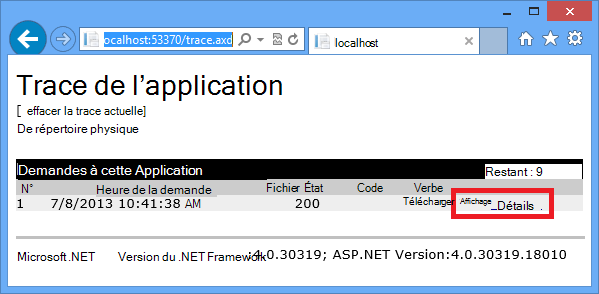

    La page de **Détails de la demande** s’affiche, et dans la section **Informations de traçage** , vous voyez la sortie dans les instructions trace que vous avez ajoutés à la `Index` méthode.

    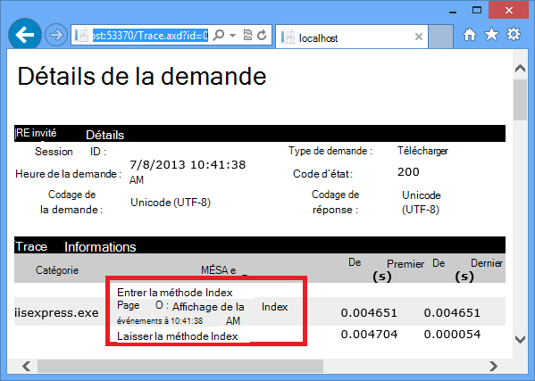

    Par défaut, `trace.axd` n’est disponible que localement. Si vous souhaitez rendre disponible à partir d’une application web à distance, vous pouvez ajouter `localOnly="false"` à la `trace` élément dans le fichier *Web.config* , comme illustré dans l’exemple suivant :

        <trace enabled="true" writeToDiagnosticsTrace="true" localOnly="false" mostRecent="true" pageOutput="false" />

    Toutefois, l’activation de `trace.axd` dans une production web app est généralement pas recommandé pour des raisons de sécurité, et dans les sections suivantes, vous verrez un moyen plus simple pour lire les journaux de traçage dans une application web Azure.

### Afficher la sortie de traçage dans Azure

1. Dans l' **Explorateur de solutions**, cliquez sur le projet web, puis cliquez sur **Publier**.

2. Dans la boîte de dialogue **Publier le site Web** , cliquez sur **Publier**.

    Une fois que Visual Studio publie votre mise à jour, il ouvre une fenêtre de navigateur à votre page d’accueil (en supposant que vous n’avez pas effacer les **URL de Destination** sous l’onglet **connexion** ).

3. Dans l' **Explorateur de serveurs**, avec le bouton droit de votre application web et sélectionnez **Afficher les journaux de diffusion en continu**. 

    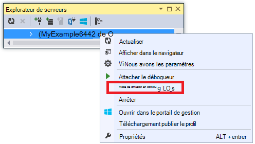

    La fenêtre **sortie** montre que vous êtes connecté au service de diffusion en continu de journal et ajoute une ligne notification chaque minute qui passe sans un journal à afficher.

    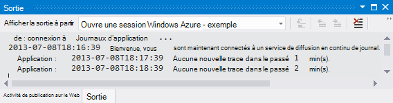

4. Dans la fenêtre du navigateur qui affiche la page d’accueil de votre application, cliquez sur **Contact**.

    Quelques secondes de la sortie de ce niveau d’erreur trace vous avez ajouté à la `Contact` méthode s’affiche dans la fenêtre **sortie** .

    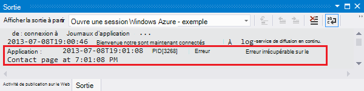

    Visual Studio affiche uniquement les traces au niveau de l’erreur parce que c’est le paramètre par défaut, lorsque vous activez le service de surveillance du journal. Lorsque vous créez une nouvelle application web Azure, tout enregistrement est désactivé par défaut, comme vous l’avez vu lorsque vous avez ouvert la page de paramètres précédemment :

    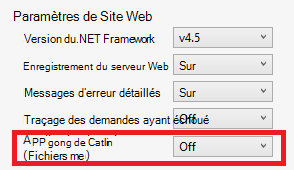

    Toutefois, lorsque vous avez sélectionné **Afficher les journaux de diffusion en continu**, Visual Studio automatiquement remplacé **Application Logging(File System)** **erreur**, ce qui signifie que les journaux de niveau erreur obtenir signalés. Pour voir tous vos journaux de suivi, vous pouvez modifier ce paramètre sur **commentaires**. Lorsque vous sélectionnez un niveau de gravité inférieur à erreur, tous les journaux pour les niveaux de gravité supérieurs sont également signalées. Ainsi, lorsque vous sélectionnez commentaires, vous voyez également journaux d’erreurs, d’avertissement et d’informations.  

4. Dans l' **Explorateur de serveurs**, avec le bouton droit à l’application web, puis cliquez sur **Afficher les paramètres** comme vous l’avez fait précédemment.

5. Modifier **L’Application enregistre (système de fichiers)** sur **commentaires**, puis cliquez sur **Enregistrer**.
 
    

6. Dans la fenêtre du navigateur est maintenant affiché dans votre page de **Contact** , cliquez sur **accueil**, puis cliquez **sur**, puis cliquez sur **Contact**.

    Au bout de quelques secondes, la fenêtre **sortie** affiche l’ensemble de la sortie du traçage.

    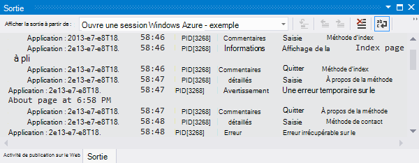

    Dans cette section vous activé et désactivé la journalisation à l’aide de paramètres d’application web Azure. Vous pouvez également activer et désactiver des écouteurs de la trace en modifiant le fichier Web.config. Toutefois, la modification du fichier Web.config, le domaine d’application pour le recyclage, alors que l’activation de la journalisation via la configuration d’application web qui ne. Si le problème prend beaucoup de temps à reproduire, ou n’est pas stable, recyclage le domaine d’application peut « Aidez-moi » et vous oblige à attendre qu’il se produit à nouveau. Activer les diagnostics dans Azure ne faire cela, vous pouvez démarrer immédiatement la capture des informations d’erreur.

### Caractéristiques de la fenêtre Sortie

L’onglet **Journaux d’Azure** de la fenêtre **sortie** comporte plusieurs boutons et une zone de texte :

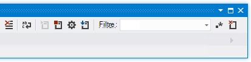

Ils effectuent les fonctions suivantes :

* Effacer la fenêtre de **sortie** .
* Activer ou désactiver le retour automatique à la.
* Démarrer ou arrêter la surveillance des journaux.
* Permet de spécifier des journaux à surveiller.
* Télécharger les journaux.
* Filtrer les journaux basés sur une chaîne de recherche ou d’une expression régulière.
* Fermez la fenêtre de **sortie** .

Si vous entrez une expression régulière ou une chaîne de recherche, Visual Studio filtre les informations de journalisation sur le client. Cela signifie que vous pouvez entrer les critères après que les journaux sont affichés dans la fenêtre **sortie** et vous pouvez modifier les critères de filtrage sans avoir à régénérer les journaux.

## Afficher les journaux de serveur web

Journaux de serveur Web enregistrent toute l’activité HTTP pour l’application web. Afin de les voir dans la fenêtre de **sortie** que vous devez les activer pour l’application web et indiquer à Visual Studio que vous souhaitez surveiller les. 

1. Dans l’onglet **Configuration des applications Azure Web** que vous avez ouvert à partir de **l’Explorateur de serveurs**, modifier la journalisation sur le serveur Web à la zone **sur**, puis cliquez sur **Enregistrer**.

    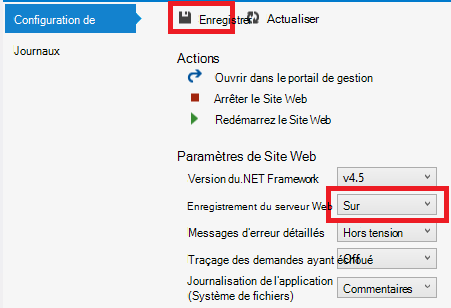

2. Dans la fenêtre **sortie** , cliquez sur le bouton **spécifier lequel Azure se connecte à surveiller** .
    
    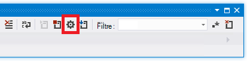

3. Dans la boîte de dialogue **Options de journalisation d’Azure** , sélectionnez les **journaux de serveur Web**, puis cliquez sur **OK**.

    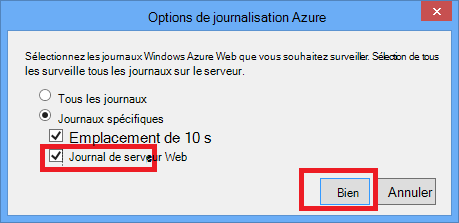

4. Dans la fenêtre du navigateur qui affiche l’application web, cliquez sur **accueil**, puis cliquez **sur**, puis cliquez sur **Contact**.

    Les journaux d’application apparaissent généralement en premier, suivi par les journaux de serveur web. Vous devrez peut-être attendre un certain temps pour les journaux s’affiche. 

    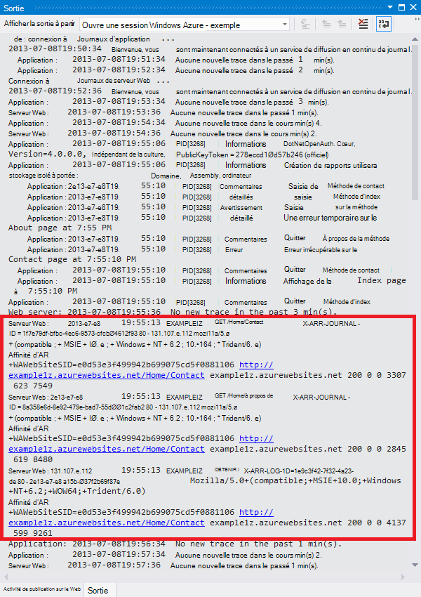

Par défaut, lorsque vous activez tout d’abord les journaux de serveur web à l’aide de Visual Studio, Azure écrit les journaux dans le système de fichiers. Comme alternative, vous pouvez utiliser le portail Azure pour spécifier les journaux doivent être écrits dans un conteneur de blob dans un compte de stockage que le serveur web.

Si vous utilisez le portail pour activer le serveur web connexion à un compte de stockage Azure, puis désactivez la journalisation dans Visual Studio, lorsque vous ré-activez la journalisation dans Visual Studio vos paramètres de compte de stockage sont restaurés. 

## Afficher les journaux de messages d’erreur détaillés

Journaux d’erreurs détaillés fournissent des informations supplémentaires sur les requêtes HTTP qui résultent en codes de réponse d’erreur (400 ou supérieur). Afin de les voir dans la fenêtre **sortie** , vous devez les activer pour l’application web et indiquer à Visual Studio que vous souhaitez surveiller les.

1. Dans l’onglet **Configuration des applications Azure Web** que vous avez ouvert à partir de **l’Explorateur de serveurs**, modifier les **Messages d’erreur détaillés** **sur**, puis cliquez sur **Enregistrer**.

    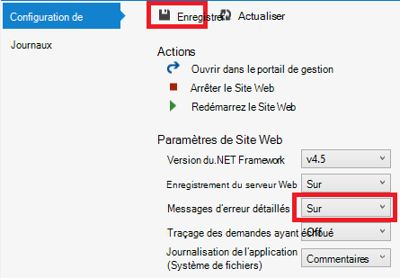

2. Dans la fenêtre **sortie** , cliquez sur le bouton **spécifier lequel Azure se connecte à surveiller** .

3. Dans la boîte de dialogue **Options de journalisation d’Azure** , cliquez sur **tous les journaux**, puis cliquez sur **OK**.

    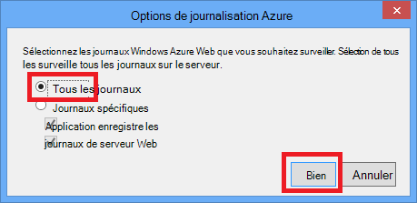

4. Dans la barre d’adresses de la fenêtre du navigateur, ajoutez un caractère supplémentaire à l’URL de provoquer une erreur 404 (par exemple, `http://localhost:53370/Home/Contactx`), puis appuyez sur ENTRÉE.

    Après quelques secondes le journal d’erreur détaillé s’affiche dans la fenêtre Visual Studio de **sortie** .

    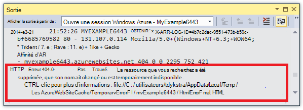

    CTRL + cliquez sur le lien pour afficher la sortie de journal mis en forme dans un navigateur :

    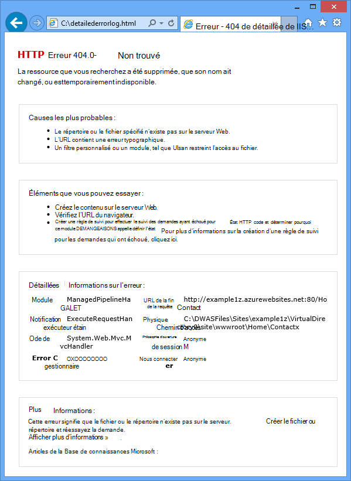

## Télécharger les journaux système de fichier

Tous les journaux que vous pouvez analyser dans la fenêtre **sortie** peuvent également être téléchargés sous la forme d’un fichier *.zip* . 

1. Dans la fenêtre **sortie** , cliquez sur **Télécharger les journaux de diffusion en continu**.

    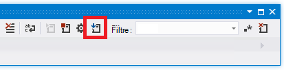

    Explorateur de fichiers s’ouvre dans le dossier *téléchargements* avec le fichier téléchargé sélectionné.

    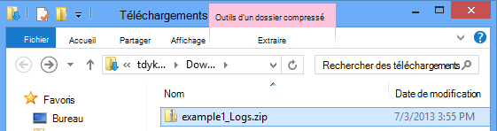

2. Extrayez le fichier *.zip* , et que la structure de dossiers suivante :

    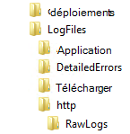

    * Journaux de suivi d’application se trouvent dans les fichiers *.txt* dans le dossier *LogFiles\Application* .
    * Journaux de serveur Web se trouvent dans les fichiers *.log* dans le dossier *LogFiles\http\RawLogs* . Vous pouvez utiliser un outil comme [l’Analyseur de journal](http://www.microsoft.com/download/details.aspx?displaylang=en&id=24659) pour afficher et manipuler ces fichiers.
    * Journaux de messages d’erreur détaillés sont dans des fichiers *.html* dans le dossier *LogFiles\DetailedErrors* .

    (Le dossier de *déploiement* est pour les fichiers créés par le contrôle de source de publication ; il n’a rien liés à la publication de Visual Studio. Le dossier *Git* est pour les traces liées à un contrôle de source de publication et le journal de service de diffusion en continu de fichiers.)  

## Afficher les journaux de stockage

Journaux de suivi d’application peuvent également être envoyés à un compte de stockage Azure, et vous pouvez les afficher dans Visual Studio. Activer les journaux de stockage dans le portail classique pour faire que vous allez créer un compte de stockage et les afficher dans l’onglet **journaux** de la fenêtre de **l’Application Web de Azure** .

Vous pouvez envoyer des journaux à tout ou partie des trois destinations :

* Le système de fichiers.
* Tables de compte de stockage.
* BLOB de compte de stockage.

Vous pouvez spécifier un niveau de gravité différents pour chaque destination. 

Tables permettent d’afficher les détails des journaux en ligne, et ils prennent en charge la diffusion en continu ; Vous pouvez interroger des journaux dans les tables et consultez les nouveaux journaux tel qu’ils sont en cours de création. BLOB facilitent pour télécharger des journaux dans les fichiers et les analyser à l’aide de HDInsight, car HDInsight sait comment travailler avec le stockage des objets blob. Pour plus d’informations, consultez **Hadoop et MapReduce** dans les [Options de stockage de données (création réelle nuage d’applications Azure)](http://www.asp.net/aspnet/overview/developing-apps-with-windows-azure/building-real-world-cloud-apps-with-windows-azure/data-storage-options).

Vous avez actuellement des journaux de système de fichier définies pour le niveau de détail ; les étapes suivantes vous guident dans la configuration des journaux de niveau d’informations pour accéder à des tables de compte de stockage. Niveau d’informations signifie que tous les journaux créés par l’appel de `Trace.TraceInformation`, `Trace.TraceWarning`, et `Trace.TraceError` s’affiche, mais pas les journaux créés par l’appel de `Trace.WriteLine`.

Les comptes de stockage offrent plus de stockage et de conservation durable pour les journaux par rapport au système de fichiers. Un autre avantage de l’envoi des journaux de suivi d’application vers le stockage est que vous obtenez des informations supplémentaires avec chaque journal que vous n’obtenez pas de système de fichiers journaux.

5. Droit de **stockage** sous le nœud Azure, puis cliquez sur **Créer un compte de stockage**.

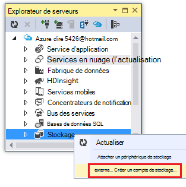

3. Dans la boîte de dialogue **Créer un compte de stockage** , entrez un nom pour le compte de stockage. 

    Le nom doit être doit être unique (l’aucun autre compte de stockage Azure ne peut avoir le même nom). Si le nom que vous entrez est déjà en cours d’utilisation, vous obtiendrez une chance de le modifier.

    L’URL pour accéder à votre compte de stockage sera *{nom}*. core.windows.net. 

5. Définissez la liste déroulante **région ou un groupe d’affinité** à la région le plus proche de vous.

    Ce paramètre spécifie le centre de données Azure hébergera votre compte de stockage. Pour ce didacticiel, votre choix ne faire une différence notable, mais pour une application web de production vous souhaitez que votre serveur web et votre compte de stockage pour être dans la même région afin de réduire les frais de sortie de latence et de données. L’application web (que vous allez créer plus loin) doit s’exécuter dans une zone aussi proche que possible de navigateurs l’accès à votre application web afin de réduire la latence.

6. Affectez la liste déroulante de **réplication** **redondants localement**. 

    Lors de la réplication géographique est activée pour un compte de stockage, le contenu stocké est répliqué sur un centre de données secondaire pour permettre le basculement à cet emplacement en cas de sinistre majeur dans l’emplacement principal. Geo-réplication peut entraîner des coûts supplémentaires. Pour les comptes de test et de développement, vous ne souhaitez généralement payer pour la réplication de la zone géographique. Pour plus d’informations, voir [créer, gérer, ou de supprimer un compte de stockage](../storage-create-storage-account/#replication-options).

5. Cliquez sur **créer**. 

    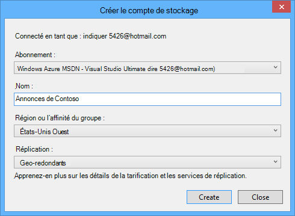  

1. Dans la fenêtre Visual Studio **Azure Web App** , cliquez sur l’onglet **journaux** , puis cliquez sur **Configurer la journalisation dans le portail de gestion**.

    <!-- todo:screenshot of new portal if the VS page link goes to new portal -->
    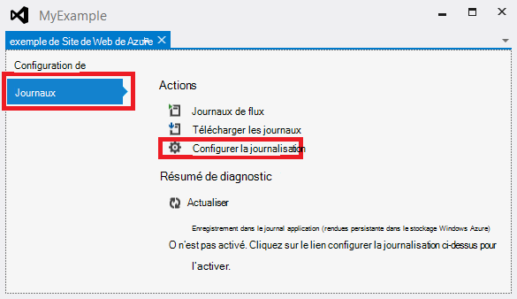

    Sous l’onglet **configurer** dans le portail classique pour votre application web s’ouvre.

2. Dans l’onglet de **configuration** du portail classique, faites défiler jusqu'à la section diagnostics d’application et choisissez **L’Application enregistre (Storage Table)** **sur**.

3. Modifier le **niveau d’enregistrement** **d’informations**.

4. Cliquez sur **gérer le stockage de la Table**.

    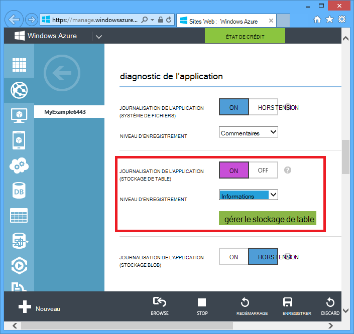

    Dans la zone de **stockage de table gérer pour le diagnostic de l’application** , vous pouvez choisir votre compte de stockage si vous avez plus d’un. Vous pouvez créer une nouvelle table ou en utiliser une existante.

    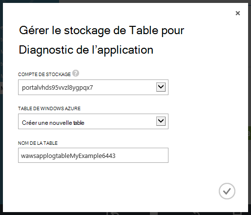

6. Dans la zone de **stockage de table gérer pour le diagnostic de l’application** , cliquez sur la case à cocher pour fermer la boîte.

6. Dans l’onglet de **configuration** du portail classique, cliquez sur **Enregistrer**.

7. Dans la fenêtre du navigateur qui affiche l’application de web application, cliquez sur **accueil**, puis cliquez **sur**, puis cliquez sur **Contact**.

    Les informations de journalisation produites en parcourant ces pages web seront écrit sur le compte de stockage.

8. Dans l’onglet **journaux** , de la fenêtre **d’Application de Web Azure** dans Visual Studio, cliquez sur **Actualiser** sous **Résumé de Diagnostic**.

    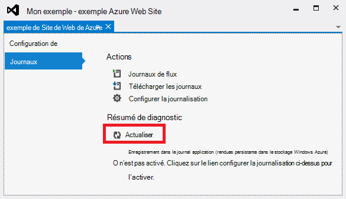

    La section **Résumé de Diagnostic** affiche les journaux pour les 15 dernières minutes par défaut. Vous pouvez modifier la période pour afficher plus de journaux. 

    (Si vous obtenez une erreur « table introuvable », vérifiez que vous avez recherchés sur les pages qui effectuent le suivi une fois que vous avez activé **L’Application enregistre (stockage)** et une fois que vous avez cliqué sur **Enregistrer**.)

    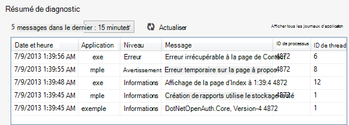

    Notez que dans ce mode d’affichage **Des ID de processus** et **l’ID de Thread** pour chaque journal, vous n’obtenez pas dans les système de fichiers journaux. Vous pouvez voir des champs supplémentaires en consultant la table de stockage Azure directement.

8. Cliquez sur **Afficher tous les journaux de l’application**.

    La table de journal de trace s’affiche dans la visionneuse de table stockage Azure.
   
    (Si vous obtenez une erreur « séquence ne contient aucun élément », ouvrir **l’Explorateur de serveurs**, développez le nœud de votre compte de stockage sous le nœud **Azure** , puis cliquez sur **Tables** et cliquez sur **Actualiser**.)

    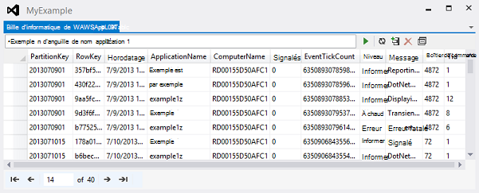

    Cette vue affiche les champs supplémentaires que n’apparaissent pas dans les autres vues. Cet affichage vous permet également de filtrer les journaux à l’aide de l’interface utilisateur du Générateur de requête spécial pour la construction d’une requête. Pour plus d’informations, consultez Utilisation des ressources de la Table - filtrage des entités dans [l’Exploration des ressources de stockage avec l’Explorateur de serveurs](http://msdn.microsoft.com/library/ff683677.aspx).

7. Pour consulter les détails d’une ligne, double-cliquez sur une des lignes.

    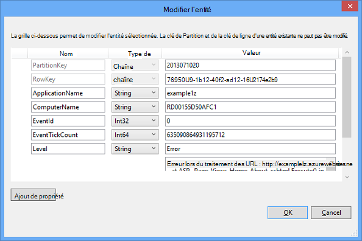

## Afficher les journaux de suivi des demandes qui ont échoué

Journaux de suivi des demandes qui ont échoué sont utiles lorsque vous avez besoin de comprendre les détails de la façon dont IIS traite une demande HTTP, dans les scénarios de problèmes d’authentification ou de réécriture d’URL. 

Applications web Azure utilisent les mêmes fonctionnalités de suivi de demande ayant échoué est disponible avec IIS 7.0 et versions ultérieures. Vous n’avez pas accès aux paramètres IIS qui configurent les erreurs sont enregistrés, toutefois. Lorsque vous activez le traçage des demandes ayant échoué, toutes les erreurs sont capturés. 

Vous pouvez activer le traçage de demande ayant échoué à l’aide de Visual Studio, mais vous ne pouvez pas les afficher dans Visual Studio. Ces journaux est des fichiers XML. Le service de journal de transmission en continu seulement vérifie que les fichiers qui sont réputées être lu dans le mode texte brut : fichiers *.txt*, *.html*et *.log* .

Vous pouvez afficher les journaux de suivi des demandes qui ont échoué dans un navigateur directement via FTP, ou localement une fois à l’aide d’un outil FTP afin de les télécharger sur votre ordinateur local. Dans cette section vous allez les afficher dans un navigateur directement.

1. Dans l’onglet **Configuration** de la fenêtre **Azure Web App** que vous avez ouvert à partir de **l’Explorateur de serveurs**, remplacez **Failed Request Tracing** **sur**, puis cliquez sur **Enregistrer**.

    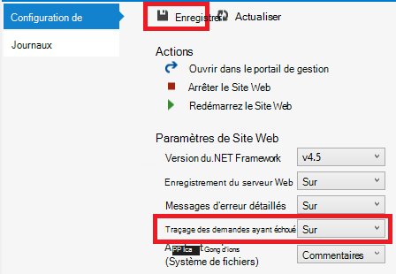

4. Dans la barre d’adresses de la fenêtre du navigateur qui affiche l’application web, ajoutez un caractère supplémentaire à l’URL, puis cliquez sur ENTRÉE pour provoquer une erreur 404.

    Ainsi, un journal de suivi des demandes qui ont échoué à créer, et les étapes suivantes indiquent comment visualiser ou télécharger le journal.

2. Dans Visual Studio, dans l’onglet **Configuration** de la fenêtre **Azure Web App** , cliquez sur **Ouvrir dans le portail de gestion**.

3. De la lame de **paramètres** de [Portail Azure](https://portal.azure.com) pour votre application web, cliquez sur les **informations d’identification de déploiement**et puis entrez un nouveau nom d’utilisateur et un mot de passe.

    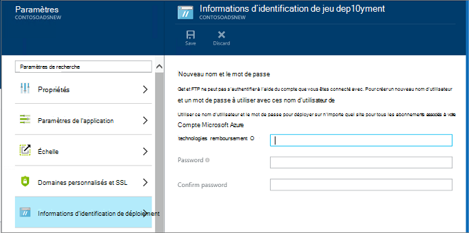

    ** Lorsque vous vous connectez, vous devez utiliser le nom d’utilisateur complet avec le nom d’application web devant elle. Par exemple, si vous entrez « myid » comme nom d’utilisateur et le site est « myexample », vous connecter en tant que « myexample\myid ».

5. Dans une nouvelle fenêtre de navigateur, accédez à l’URL qui s’affiche sous le **nom d’hôte FTP** ou **FTPS hostname** de la lame de **l’Application Web** pour votre application web. 

6. Connectez-vous en utilisant les informations d’identification FTP que vous avez créée précédemment (y compris le préfixe du nom web app pour le nom d’utilisateur).

    Le navigateur affiche le dossier racine de l’application web.

6. Ouvrez le dossier de *fichiers journaux* .

    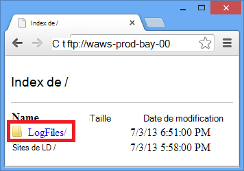

7. Ouvrez le dossier nommé W3SVC ainsi qu’une valeur numérique.

    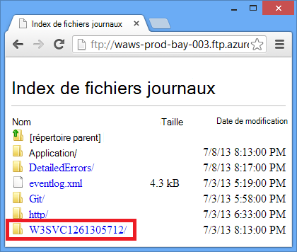

    Le dossier contient des fichiers XML pour les erreurs qui ont été consignés une fois que vous avez activé le traçage des demandes ayant échoué et un fichier XSL qui permet de mettre en forme le code XML par un navigateur.

    

8. Cliquez sur le fichier XML de la requête ayant échoué que vous souhaitez voir les informations de traçage.

    L’illustration suivante montre une partie des informations de traçage pour un exemple d’erreur.

    

## Étapes suivantes

Vous avez vu comment Visual Studio facilite afficher les journaux créés par une application web Azure. Les sections suivantes fournissent des liens vers des ressources supplémentaires sur les rubriques connexes :

* Dépannage des applications web Azure
* Débogage dans Visual Studio 
* Dans Azure le débogage distant
* Traçage dans des applications ASP.NET
* Journaux de serveur web analyse
* Analyse des journaux de suivi de demande n’a pas pu
* Débogage des Services en nuage

### Dépannage des applications web Azure

Pour plus d’informations sur la résolution des applications web dans le Service d’application Azure, consultez les ressources suivantes :

* [Comment faire pour surveiller les applications web](/manage/services/web-sites/how-to-monitor-websites/)
* [Recherche de fuites de mémoire dans les applications Web Azure avec Visual Studio 2013](http://blogs.msdn.com/b/visualstudioalm/archive/2013/12/20/investigating-memory-leaks-in-azure-web-sites-with-visual-studio-2013.aspx). Billet de blog Microsoft ALM sur les fonctionnalités de Visual Studio pour analyser les problèmes de mémoire managée.
* [Les outils en ligne les applications web azure que vous devez connaître](/blog/2014/03/28/windows-azure-websites-online-tools-you-should-know-about-2/). Billet de blog par Amit Apple.

Pour l’aide sur une question spécifique de dépannage, démarrage d’un thread dans un des forums suivants :

* [Forum d’Azure le sur le site ASP.NET](http://forums.asp.net/1247.aspx/1?Azure+and+ASP+NET).
* [Forum d’Azure le sur MSDN](http://social.msdn.microsoft.com/Forums/windowsazure/).
* [StackOverflow.com](http://www.stackoverflow.com).

### Débogage dans Visual Studio 

Pour plus d’informations sur l’utilisation du mode débogage dans Visual Studio, consultez la rubrique MSDN de [débogage dans Visual Studio](http://msdn.microsoft.com/library/vstudio/sc65sadd.aspx) et des [Conseils de débogage avec Visual Studio 2010](http://weblogs.asp.net/scottgu/archive/2010/08/18/debugging-tips-with-visual-studio-2010.aspx).

### Dans Azure le débogage distant

Pour plus d’informations sur le débogage distant d’applications web Azure et WebJobs, consultez les ressources suivantes :

* [Introduction à distance débogage Azure Application Service Web Apps](/blog/2014/05/06/introduction-to-remote-debugging-on-azure-web-sites/).
* [Introduction au débogage Azure Application Service Web applications distantes 2ème partie - à l’intérieur de débogage distant](/blog/2014/05/07/introduction-to-remote-debugging-azure-web-sites-part-2-inside-remote-debugging/)
* [Introduction au débogage distant sur Azure Application Service Web Apps 3ème partie-environnement d’instances multiples et GIT](/blog/2014/05/08/introduction-to-remote-debugging-on-azure-web-sites-part-3-multi-instance-environment-and-git/)
* [WebJobs de débogage (vidéo)](https://www.youtube.com/watch?v=ncQm9q5ZFZs&list=UU_SjTh-ZltPmTYzAybypB-g&index=1)

Si votre application web utilise une API de Web Azure ou Services mobiles principale et que vous devez déboguer qui, consultez [Débogage de serveur principal .NET dans Visual Studio](http://blogs.msdn.com/b/azuremobile/archive/2014/03/14/debugging-net-backend-in-visual-studio.aspx).

### Traçage dans des applications ASP.NET

Aucun suivi d’ASP.NET complètes et à jour introductions ne sont disponibles sur Internet. La meilleure solution pour vous est mise en route avec les documents de présentation anciens écrits pour les Web Forms, car MVC n’existe encore et qui complètent avec blog plus récente publication qui se concentrent sur des problèmes spécifiques. Un bon point de départ est les ressources suivantes :

* La [surveillance et la télémétrie (création d’applications réelles nuage avec Azure)](http://www.asp.net/aspnet/overview/developing-apps-with-windows-azure/building-real-world-cloud-apps-with-windows-azure/monitoring-and-telemetry).  Chapitre du livre électronique avec des recommandations pour le traçage dans des applications de cloud Azure.
* [Traçage de ASP.NET](http://msdn.microsoft.com/library/ms972204.aspx) 
  Ancien mais toujours sur excellente ressource pour une présentation générale de l’objet.
* [Écouteurs de la trace](http://msdn.microsoft.com/library/4y5y10s7.aspx) 
  Informations sur les écouteurs de la trace mais ne Mentionnez le [WebPageTraceListener](http://msdn.microsoft.com/library/system.web.webpagetracelistener.aspx).
* [Procédure pas à pas : Intégration de traçage de ASP.NET avec le traçage System.Diagnostics](http://msdn.microsoft.com/library/b0ectfxd.aspx) 
  Ce trop ancien, mais inclut des informations supplémentaires qui ne couvre pas l’article de présentation.
* [Traçage dans les vues de Razor ASP.NET MVC](http://blogs.msdn.com/b/webdev/archive/2013/07/16/tracing-in-asp-net-mvc-razor-views.aspx) 
  Outre le suivi dans les vues de RASOIR, la publication explique également comment créer un filtre d’erreur afin de consigner toutes les exceptions non gérées dans une application MVC. Pour plus d’informations sur la façon de connecter toutes les exceptions non gérées dans une application Web Forms, consultez l’exemple de Global.asax dans [Un exemple complet pour les gestionnaires d’erreurs](http://msdn.microsoft.com/library/bb397417.aspx) sur le site MSDN. Dans MVC ou Web Forms, si vous voulez consigner certaines exceptions mais laisser la structure par défaut gestion prennent effet, vous pouvez intercepter et lever de nouveau comme dans l’exemple suivant :

        try
        {
           // Your code that might cause an exception to be thrown.
        }
        catch (Exception ex)
        {
            Trace.TraceError("Exception: " + ex.ToString());
            throw;
        } 

* [Transmission en continu Trace Diagnostics Logging à partir de la ligne de commande Azure (plus aperçu !)](http://www.hanselman.com/blog/StreamingDiagnosticsTraceLoggingFromTheAzureCommandLinePlusGlimpse.aspx) 
  L’utilisation de la ligne de commande à faire ce que ce didacticiel indique comment faire dans Visual Studio. [Aperçu](http://www.hanselman.com/blog/IfYoureNotUsingGlimpseWithASPNETForDebuggingAndProfilingYoureMissingOut.aspx) est un outil de débogage des applications ASP.NET. 
* [L’utilisation de Web Apps-Journalisation et diagnostic - avec David Ebbo](/documentation/videos/azure-web-site-logging-and-diagnostics/) et [journaux en continu à partir de Web Apps - avec David Ebbo](/documentation/videos/log-streaming-with-azure-web-sites/) 
  Vidéos par Scott Hanselman et David Ebbo.

Pour l’enregistrement des erreurs, au lieu d’écrire votre propre code de suivi est d’utiliser une infrastructure open source enregistrement comme [ELMAH](http://nuget.org/packages/elmah/). Pour plus d’informations, consultez les [publications de blog de Scott Hanselman parler d’ELMAH](http://www.hanselman.com/blog/NuGetPackageOfTheWeek7ELMAHErrorLoggingModulesAndHandlersWithSQLServerCompact.aspx).

Notez également que vous n’êtes pas obligé d’utiliser ASP.NET ou System.Diagnostics suivi si vous souhaitez obtenir en continu de journaux à partir d’Azure. Le service de journal web Azure app en continu est diffusés à n’importe quel fichier *.txt*, *.html*ou *.log* qu’il trouve dans le dossier de *fichiers journaux* . Par conséquent, vous pouvez créer votre propre système de journalisation qui écrit dans le système de fichiers de l’application web et votre fichier sera automatiquement diffusé en continu et téléchargé. Tout vous avez à faire est d’écrire du code application qui crée des fichiers dans le dossier *d:\home\logfiles* . 

### Journaux de serveur web analyse

Pour plus d’informations sur l’analyse des journaux de serveur web, consultez les ressources suivantes :

* [LogParser](http://www.microsoft.com/download/details.aspx?id=24659) 
  Un outil pour afficher des données dans des journaux de serveur web (fichiers*.log* ).
* [Dépannage des problèmes de performances de IIS ou des erreurs d’Application à l’aide de LogParser](http://www.iis.net/learn/troubleshoot/performance-issues/troubleshooting-iis-performance-issues-or-application-errors-using-logparser) 
  Introduction à l’outil Analyseur de journal que vous pouvez utiliser pour analyser les journaux de serveur web.
* [Billets de blog par Robert McMurray sur l’utilisation de LogParser](http://blogs.msdn.com/b/robert_mcmurray/archive/tags/logparser/) 
* [Le code d’état HTTP dans IIS 7.0 et IIS 7.5 8.0 de IIS](http://support.microsoft.com/kb/943891)

### Analyse des journaux de suivi de demande n’a pas pu

Le site Web Microsoft TechNet comprend une section [à l’aide de Failed Request Tracing](http://www.iis.net/learn/troubleshoot/using-failed-request-tracing) , qui peut être utile pour comprendre comment utiliser ces journaux. Toutefois, cette documentation se concentre principalement sur la configuration du traçage de demande ayant échoué dans IIS, vous ne pouvez pas faire dans Azure Web Apps.

[GetStarted]: web-sites-dotnet-get-started.md
[GetStartedWJ]: websites-dotnet-webjobs-sdk.md
 
