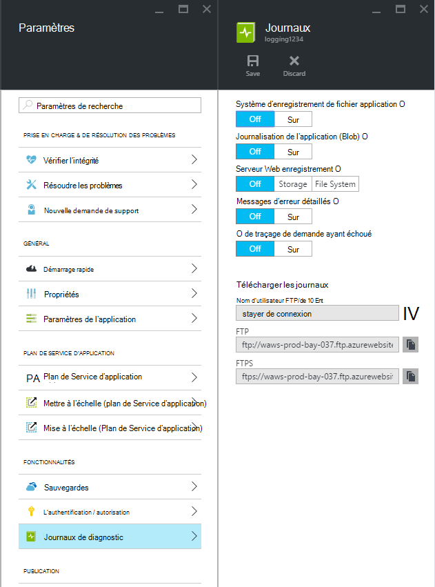
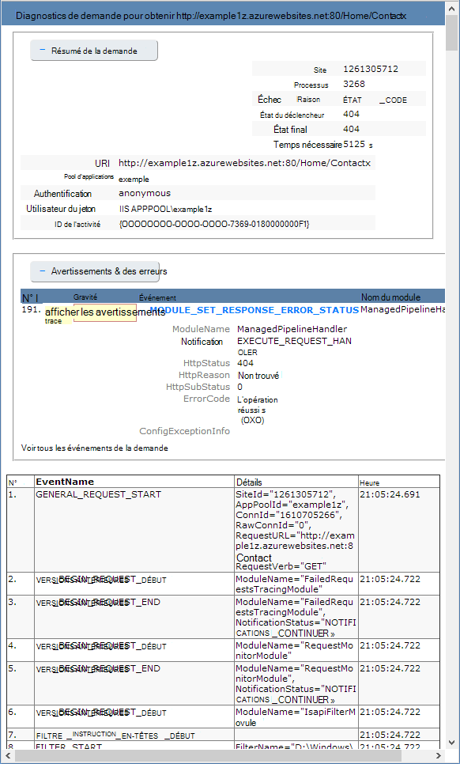

<properties
    pageTitle="Activer la journalisation de diagnostics pour les applications web dans le Service d’application Azure"
    description="Découvrez comment activer l’enregistrement des diagnostics et ajouter une instrumentation à votre application, ainsi que comment accéder aux informations enregistrées par Azure."
    services="app-service"
    documentationCenter=".net"
    authors="cephalin"
    manager="wpickett"
    editor="jimbe"/>

<tags
    ms.service="app-service"
    ms.workload="na"
    ms.tgt_pltfrm="na"
    ms.devlang="na"
    ms.topic="article"
    ms.date="06/06/2016"
    ms.author="cephalin"/>

# Activer la journalisation de diagnostics pour les applications web dans le Service d’application Azure

## Vue d’ensemble

Azure fournit des diagnostics intégrés pour faciliter le débogage d’une [application de Service de l’application web](http://go.microsoft.com/fwlink/?LinkId=529714). Dans cet article, vous apprendrez comment activer l’enregistrement des diagnostics et ajouter une instrumentation à votre application, ainsi que comment accéder aux informations enregistrées par Azure.

Cet article utilise l’Interface de ligne de commande (CLI Azure) Azure, Azure PowerShell et le [Portail Azure](https://portal.azure.com)pour travailler avec les journaux de diagnostic. Pour plus d’informations sur l’utilisation des journaux de diagnostic à l’aide de Visual Studio, consultez [Résolution des problèmes d’Azure dans Visual Studio](web-sites-dotnet-troubleshoot-visual-studio.md).

[AZURE.INCLUDE [app-service-web-to-api-and-mobile](../../includes/app-service-web-to-api-and-mobile.md)]

## Diagnostics de serveur Web et des diagnostics d’applications

Applications de Service de l’application web fournissent des fonctionnalités de diagnostic pour consigner les informations à partir du serveur web et l’application web. Logiquement, elles sont séparées dans les **tests de diagnostic de serveur web** et des **diagnostics d’applications**.

### Diagnostics de serveur Web

Vous pouvez activer ou désactiver les types de journaux suivants :

- **Enregistrement des erreurs détaillées** - informations d’erreur détaillées pour les codes d’état HTTP qui indiquent un échec (code d’état 400 ou supérieur). Il peut contenir des informations qui peuvent aider à déterminer la raison pour laquelle le serveur a renvoyé le code d’erreur.
- **Échec de l’outil suivi des demandes** - des informations détaillées sur les demandes qui ont échoué, y compris une trace des composants IIS utilisé pour traiter la demande et la durée de chaque composant. Cela peut être utile si vous essayez d’augmenter les performances d’un site ou d’isoler la cause une erreur HTTP spécifique doit être retourné.
- **Journal de serveur web** - informations sur les transactions HTTP à l’aide du [format de fichier journal étendu W3C](http://msdn.microsoft.com/library/windows/desktop/aa814385.aspx). Cela est utile lors de la détermination des métriques de site globale comme le nombre de demandes traitées ou le nombre de requêtes est à partir d’une adresse IP spécifique.

### Diagnostic de l’application

Diagnostics d’application vous permet de capturer des informations produites par une application web. Les applications ASP.NET permet à la classe de [System.Diagnostics.Trace](http://msdn.microsoft.com/library/36hhw2t6.aspx) pour enregistrer les informations dans le journal des applications de diagnostic. Par exemple :

    System.Diagnostics.Trace.TraceError("If you're seeing this, something bad happened");

Lors de l’exécution, vous pouvez extraire ces fichiers journaux pour aider à la résolution des problèmes. Pour plus d’informations, consultez [Dépannage de Azure les applications web dans Visual Studio](web-sites-dotnet-troubleshoot-visual-studio.md).

Application Service web apps également consigner les informations relatives au déploiement que lorsque vous publiez du contenu sur une application web. Cela se produit automatiquement et il n’y a aucun paramètre de configuration pour l’enregistrement de déploiement. Enregistrement de déploiement vous permet de déterminer pourquoi un déploiement a échoué. Par exemple, si vous utilisez un script de déploiement personnalisé, vous pouvez utiliser la journalisation de déploiement afin de déterminer les raisons de l’échec du script.

## Comment faire pour activer les tests de diagnostic

Pour activer les diagnostics dans [Azure Portal](https://portal.azure.com), accédez à la lame pour votre application web et cliquez sur **les paramètres > journaux de Diagnostics**.

<!-- todo:cleanup dogfood addresses in screenshot -->

Lorsque vous activez des **diagnostics d’applications** vous choisissez également le **niveau**. Ce paramètre vous permet de filtrer les informations capturées pour les informations **d’information**, **Avertissement** ou **erreur** . Cette définition **explicite** consigne toutes les informations produites par l’application.

> [AZURE.NOTE] Contrairement à la modification du fichier web.config, activer les diagnostics de l’Application ou la modification des niveaux de journal de diagnostic n’est pas recyclé le domaine d’application que l’application s’exécute dans.

Dans l’onglet de **configuration** [classique portail](https://manage.windowsazure.com) Web app, vous pouvez sélectionner le **stockage** ou le **système de fichiers** de **journal de serveur web**. Sélection **stockage** vous permet de sélectionner un compte de stockage, puis un conteneur d’objet blob qui seront écrites dans les journaux. Tous les autres journaux pour les **diagnostics de site** sont écrits dans le système de fichiers uniquement.

Sous l’onglet **configurer** de [portail classique](https://manage.windowsazure.com) Web app a également des paramètres supplémentaires pour le diagnostic de l’application :

* **Système de fichiers** - stocke les informations de diagnostic d’application pour le système de fichiers d’application web. Ces fichiers peuvent être accessible par FTP ou téléchargés sous la forme d’une archive Zip en utilisant l’Azure PowerShell ou l’Azure Interface de ligne de commande (CLI Azure).
* **Stockage de table** - stocke les informations de diagnostic d’application dans le nom du compte de stockage Azure et la table spécifié.
* **Stockage des objets blob** - stocke les informations de diagnostic d’application dans le conteneur du compte de stockage Azure et blob spécifié.
* **Période de rétention** - par défaut, les journaux ne sont pas automatiquement supprimés depuis le **stockage blob**. Sélectionnez **un jeu de rétention** et entrez le nombre de jours de conservation des journaux si vous souhaitez supprimer automatiquement les journaux.

>[AZURE.NOTE] Si vous [régénérez les touches d’accès rapide de votre compte de stockage](storage-create-storage-account.md#view-copy-and-regenerate-storage-access-keys), vous devez réinitialiser la configuration de la journalisation respectives d’utiliser les clés mis à jour. Pour ce faire :
>
> 1. Dans l’onglet **configurer** , définir la fonctionnalité de journalisation respectifs à **Off**. Enregistrer vos paramètres.
> 2. Activer l’enregistrement dans le blob de compte de stockage ou de la table à nouveau. Enregistrer vos paramètres.

N’importe quelle combinaison de système de fichiers, stockage de table ou de stockage des objets blob peut être activée en même temps et ont des configurations au niveau du journal. Par exemple, vous souhaiterez peut-être enregistrer les erreurs et les avertissements de stockage blob comme une solution à long terme de l’enregistrement, lors de l’activation de l’enregistrement de système de fichiers avec un niveau de commentaires.

Alors que tous les trois emplacements de stockage fournissent les mêmes informations de base pour les événements enregistrés, **stockage de table** et de **stockage des objets blob** enregistrer toutes les informations supplémentaires telles que l’ID d’instance, ID de thread et un horodatage plus granulaire (format de graduation) à celui de la connexion au **système de fichiers**.

> [AZURE.NOTE] Les informations stockées dans le **stockage de table** ou de **stockage des objets blob** seulement sont accessibles qu’à l’aide d’un client de stockage ou une application qui peut travailler directement avec ces systèmes de stockage. Par exemple, Visual Studio 2013 contient un Explorateur de stockage peut être utilisée pour Explorer le stockage blob ou de table, et HDInsight peut accéder aux données stockées dans le stockage blob. Vous pouvez également écrire une application qui accède au stockage Azure à l’aide d’un de l' [Azure SDK](/downloads/#).

> [AZURE.NOTE] Tests de diagnostic peut également être activé à partir de PowerShell Azure à l’aide de l’applet de commande **Set-AzureWebsite** . Si vous n’avez pas installé Azure PowerShell ou que vous n’avez pas configuré pour utiliser votre abonnement Azure, voir [comment utiliser le PowerShell Azure](/develop/nodejs/how-to-guides/powershell-cmdlets/).

##Comment : télécharger des journaux

Informations de diagnostic stockés dans le système de fichiers d’application web est accessible directement à l’aide de FTP. Il peut également être téléchargé sous la forme d’une archive Zip à l’aide d’Azure PowerShell ou l’Interface de ligne de commande d’Azure.

Les journaux sont stockés dans la structure du répertoire est la suivante :

* Des **journaux d’application** - Application//LogFiles /. Ce dossier contient un ou plusieurs fichiers texte contenant des informations produites par la journalisation de l’application.

* **Échec de la demande de Traces** - / fichiers journaux W3SVC ### /. Ce dossier contient un fichier XSL et un ou plusieurs fichiers XML. Assurez-vous de télécharger le fichier XSL dans le même répertoire que le fichier (s) le code XML, car le fichier XSL fournit des fonctionnalités de mise en forme et de filtrer le contenu des fichiers XML lorsqu’il est affiché dans Internet Explorer.

* **Journaux d’erreurs détaillés** - /LogFiles/DetailedErrors /. Ce dossier contient un ou plusieurs fichiers .htm qui fournissent des informations détaillées pour les erreurs HTTP qui se sont produites.

* **Journaux de serveur web** - /LogFiles/http/RawLogs. Ce dossier contient un ou plusieurs fichiers texte formatés en utilisant le [format de fichier journal étendu W3C](http://msdn.microsoft.com/library/windows/desktop/aa814385.aspx).

* **Journaux de déploiement** - fichiers journaux/Git. Ce dossier contient les journaux générés par les processus de déploiement interne utilisés par les applications web Azure, ainsi que des journaux pour les déploiements de Git.

### FTP

Pour accéder à des informations de diagnostic à l’aide de FTP, visitez le site du **tableau de bord** de votre application web sur le [portail classique](https://manage.windowsazure.com). Dans la section **Aperçu rapide** , cliquez sur le lien de **Journaux de Diagnostic FTP** pour accéder aux fichiers journaux à l’aide de FTP. L’entrée de **l’Utilisateur de déploiement/FTP** répertorie le nom d’utilisateur qui doit être utilisé pour accéder au site FTP.

> [AZURE.NOTE] Si l’entrée de **l’Utilisateur de déploiement/FTP** n’est pas définie ou si vous avez oublié le mot de passe pour cet utilisateur, vous pouvez créer un nouvel utilisateur et le mot de passe en utilisant le lien **Réinitialiser les informations d’identification de déploiement** dans la section **Aperçu rapide** du tableau de **bord**.

### Télécharger avec PowerShell Azure

Pour télécharger les fichiers journaux, démarrez une nouvelle instance d’Azure PowerShell et utilisez la commande suivante :

    Save-AzureWebSiteLog -Name webappname

Ceci enregistre les journaux de l’application web spécifiée par la **-nom** paramètre dans un fichier nommé **logs.zip** dans le répertoire en cours.

> [AZURE.NOTE] Si vous n’avez pas installé Azure PowerShell ou que vous n’avez pas configuré pour utiliser votre abonnement Azure, voir [comment utiliser le PowerShell Azure](/develop/nodejs/how-to-guides/powershell-cmdlets/).

### Télécharger avec Azure Interface de ligne de commande

Pour télécharger les fichiers journaux à l’aide de l’Interface de ligne de commande Azure, ouvrez une nouvelle invite de commande, PowerShell, Bash ou une session Terminal Server et entrez la commande suivante :

    azure site log download webappname

Ceci enregistre les journaux de l’application web nommée « webappname » dans un fichier nommé **diagnostics.zip** dans le répertoire en cours.

> [AZURE.NOTE] Si vous n’avez pas installé l’Interface de ligne de commande (CLI Azure) Azure, ou que vous n’avez pas configuré pour utiliser votre abonnement Azure, apprendre [à utiliser la CLI de Azure](../xplat-cli-install.md).

## Comment : afficher les journaux dans les perspectives de l’Application

Idées d’Application Visual Studio fournit des outils de filtrage et de recherche des journaux et de corrélation des journaux avec des requêtes et d’autres événements.

1. Ajoutez le Kit de développement de perspectives Application vers votre projet dans Visual Studio.
 * Dans l’Explorateur de solutions, cliquez avec le bouton droit sur votre projet et choisissez Ajouter les perspectives sur l’Application. Vous serez guidé dans les étapes qui incluent la création d’une ressource d’informations d’Application. [Pour en savoir plus](../application-insights/app-insights-asp-net.md)
2. Ajoutez le package de l’écouteur de la Trace à votre projet.
 * Cliquez avec le bouton droit sur votre projet et sélectionnez Manage NuGet Packages. Sélectionnez `Microsoft.ApplicationInsights.TraceListener` [en savoir plus](../application-insights/app-insights-asp-net-trace-logs.md)
3. Téléchargez votre projet et l’exécuter pour générer des données de journal.
4. Dans le [Portail Azure](https://portal.azure.com/), accédez à votre nouvelle ressource d’idées d’Application et ouvrez la **recherche**. Vous verrez vos données de journal, ainsi que de la demande, l’utilisation et autre télémétrie. Certains télémétrie peut prendre de quelques minutes à arriver : cliquez sur Actualiser. [Pour en savoir plus](../application-insights/app-insights-diagnostic-search.md)

[En savoir plus sur les perspectives d’Application de suivi des performances](../application-insights/app-insights-azure-web-apps.md)

##Comment : flux de journaux

Lors du développement d’une application, il est souvent utile de consulter les informations de journalisation en temps quasi réel. Pour ce faire, vous pouvez en flux continu d’enregistrement des informations dans votre environnement de développement à l’aide de PowerShell d’Azure ou de l’Interface de ligne de commande d’Azure.

> [AZURE.NOTE] Certains types de tampon d’enregistrement d’écrire dans le fichier journal, ce qui peut aboutir à des événements de manière désordonnés dans le flux. Par exemple, une entrée de journal d’application qui se produit lorsqu’un utilisateur visite une page peut s’afficher dans le flux avant l’entrée de journal correspondante HTTP pour la requête de page.

> [AZURE.NOTE] Diffusion en continu de journal sera également diffuser des flux d’informations écrites dans n’importe quel fichier texte stocké dans le **D:\\domestique\\fichiers journaux\\ ** dossier.

### Diffusion en continu avec PowerShell Azure

Pour diffuser des informations de journalisation, démarrer une nouvelle instance d’Azure PowerShell et utilisez la commande suivante :

    Get-AzureWebSiteLog -Name webappname -Tail

Vous êtes alors connecté à l’application web spécifiée par la **-nom** paramètre et commencer la diffusion en continu des informations dans la fenêtre PowerShell au journal des événements qui se produisent sur l’application web. Toutes les informations écrites dans les fichiers se terminant par .txt ou .htm .log et qui sont stockés dans le répertoire /LogFiles (accueil/d:/logfiles) sont envoyées à la console locale.

Pour filtrer des événements spécifiques, comme les erreurs, vous devez utiliser le **-Message** paramètre. Par exemple :

    Get-AzureWebSiteLog -Name webappname -Tail -Message Error

Pour filtrer les types de journal spécifique, tel que HTTP, vous devez utiliser le **-chemin d’accès** paramètre. Par exemple :

    Get-AzureWebSiteLog -Name webappname -Tail -Path http

Pour afficher une liste de chemins d’accès disponibles, utilisez le paramètre - ListPath.

> [AZURE.NOTE] Si vous n’avez pas installé Azure PowerShell ou que vous n’avez pas configuré pour utiliser votre abonnement Azure, voir [comment utiliser le PowerShell Azure](/develop/nodejs/how-to-guides/powershell-cmdlets/).

### Diffusion en continu avec une Interface de ligne de commande Azure

Pour diffuser des informations de journalisation, ouvrez une nouvelle invite de commande, PowerShell, Bash ou une session Terminal Server et entrez la commande suivante :

    azure site log tail webappname

Vous connecter à l’application web nommée 'webappname' et commencer la diffusion en continu à la fenêtre au journal des événements qui se produisent sur l’application web. Toutes les informations écrites dans les fichiers se terminant par .txt ou .htm .log et qui sont stockés dans le répertoire /LogFiles (accueil/d:/logfiles) sont envoyées à la console locale.

Pour filtrer des événements spécifiques, comme des erreurs, utilisez les **--filtre** paramètre. Par exemple :

    azure site log tail webappname --filter Error

Pour filtrer les types de journal spécifique, tel que HTTP, utilisez la **: chemin d’accès** paramètre. Par exemple :

    azure site log tail webappname --path http

> [AZURE.NOTE] Si vous n’avez pas installé l’Interface de ligne de commande d’Azure, ou que vous n’avez pas configuré pour utiliser votre abonnement Azure, voir [Comment faire pour utiliser Azure CLI](../xplat-cli-install.md).

##Comment : comprendre les journaux de diagnostic

### Journaux de diagnostics d’application

Diagnostic de l’application stocke des informations dans un format spécifique pour les applications .NET, en fonction de si vous stockez les journaux sur le système de fichiers, le stockage de table ou le stockage blob. L’ensemble de base de données stockées est le même sur les trois types de stockage - la date et l’heure de l’événement, l’ID du processus qui a produit le message d’événement, l’événement et le type d’événement (informations, avertissement, erreur).

__Système de fichiers__

Chaque ligne connecté au système de fichiers, ou reçus à l’aide de la diffusion en continu sera au format suivant :

    {Date}  PID[{process id}] {event type/level} {message}

Par exemple, un événement d’erreur devrait ressembler à ce qui suit :

    2014-01-30T16:36:59  PID[3096] Error       Fatal error on the page!

Connexion au système de fichiers fournit les informations essentielles des trois méthodes disponibles, fournissant uniquement le temps, id de processus, niveau d’événement et le message.

__Stockage de table__

Lors de la connexion au stockage de table, des propriétés supplémentaires sont utilisées pour faciliter la recherche des données stockées dans la table, ainsi que des informations plus précises sur l’événement. Les propriétés suivantes (colonnes) sont utilisées pour chaque entité (ligne) stockée dans la table.

Nom de la propriété|Format de la valeur
---|---
PartitionKey|Date/heure de l’événement au format d’yyyyMMddHH
RowKey|Une valeur GUID qui identifie de manière unique cette entité
Horodatage|La date et l’heure à laquelle l’événement s’est produit
EventTickCount|La date et l’heure à laquelle l’événement s’est produit, au format de graduation (précision)
ApplicationName|Le nom de l’application web
Niveau|Niveau d’événement (par exemple, erreur, avertissement, informations)
ID de l’événement|L’ID d’événement de cet événement

Par défaut, 0 si aucune n’est spécifiée
ID d’instance|Instance de l’application web qui s’est produite lors d’une même sur
PID|ID de processus
TID|L’ID de thread du thread qui a généré l’événement
Message|Message d’événement détail

__Stockage des objets BLOB__

Lors de la connexion pour le stockage blob, les données sont stockées dans un format de valeurs séparées par des virgules (CSV). Similaire à un stockage de table, des champs supplémentaires sont enregistrés pour fournir des informations plus précises sur l’événement. Les propriétés suivantes sont utilisées pour chaque ligne de la CSV :

Nom de la propriété|Format de la valeur
---|---
Date|La date et l’heure à laquelle l’événement s’est produit
Niveau|Niveau d’événement (par exemple, erreur, avertissement, informations)
ApplicationName|Le nom de l’application web
ID d’instance|Instance de l’application web qui s’est produite lors de l’événement sur
EventTickCount|La date et l’heure à laquelle l’événement s’est produit, au format de graduation (précision)
ID de l’événement|L’ID d’événement de cet événement

Par défaut, 0 si aucune n’est spécifiée
PID|ID de processus
TID|L’ID de thread du thread qui a généré l’événement
Message|Message d’événement détail

Les données stockées dans un objet blob devrait ressembler à ce qui suit :

    date,level,applicationName,instanceId,eventTickCount,eventId,pid,tid,message
    2014-01-30T16:36:52,Error,mywebapp,6ee38a,635266966128818593,0,3096,9,An error occurred

> [AZURE.NOTE] La première ligne du journal contient les en-têtes de colonne comme représenté dans cet exemple.

### Échec de la demande traces

Échec de la demande, les traces sont stockées dans des fichiers XML nommés __fr ### .xml__. Pour le rendre plus facile à voir les informations enregistrées, une feuille de style XSL nommé __freb.xsl__ est fourni dans le même répertoire que les fichiers XML. Ouverture d’un des fichiers XML dans Internet Explorer utilise la feuille de style XSL pour fournir un affichage de mise en forme des informations de traçage. Cela s’affiche semblable à la suivante :

### Journaux d’erreurs détaillés

Journaux d’erreurs détaillés sont les documents HTML qui fournissent des informations détaillées sur les erreurs HTTP qui sont sont produites. Dans la mesure où ils sont simplement des documents HTML, ils peuvent être affichés à l’aide d’un navigateur web.

### Journaux de serveur Web

Les journaux de serveur web sont mis en forme à l’aide du [format de fichier journal étendu W3C](http://msdn.microsoft.com/library/windows/desktop/aa814385.aspx). Ces informations peuvent être lues à l’aide d’un éditeur de texte ou de l’analyse à l’aide d’utilitaires tels que [Analyseur de journal](http://go.microsoft.com/fwlink/?LinkId=246619).

> [AZURE.NOTE] Les journaux générés par les applications web Azure ne supportent pas les champs __s-computername__, __s-ip__ou __cs-version__ .

##Étapes suivantes

- [Comment faire pour surveiller les applications Web](/manage/services/web-sites/how-to-monitor-websites/)
- [Dépannage des applications web Azure dans Visual Studio](web-sites-dotnet-troubleshoot-visual-studio.md)
- [Analyser ouvre une application web dans HDInsight](http://gallery.technet.microsoft.com/scriptcenter/Analyses-Windows-Azure-web-0b27d413)

> [AZURE.NOTE] Si vous souhaitez commencer avec le Service d’application Azure avant l’ouverture d’un compte Azure, accédez à [Essayer le Service application](http://go.microsoft.com/fwlink/?LinkId=523751), où vous pouvez créer une application web de courte durée starter immédiatement dans le Service d’application. Aucune carte de crédit obligatoire ; aucun des engagements.

## Ce qui a changé
* Pour obtenir un guide pour la modification de sites Web au Service de l’application voir : [Service d’application Azure et son Impact sur les Services Azure existants](http://go.microsoft.com/fwlink/?LinkId=529714)
* Pour un guide sur la modification de l’ancien portail au nouveau portail voir : [référence pour naviguer dans le portail Azure](http://go.microsoft.com/fwlink/?LinkId=529715)
 
