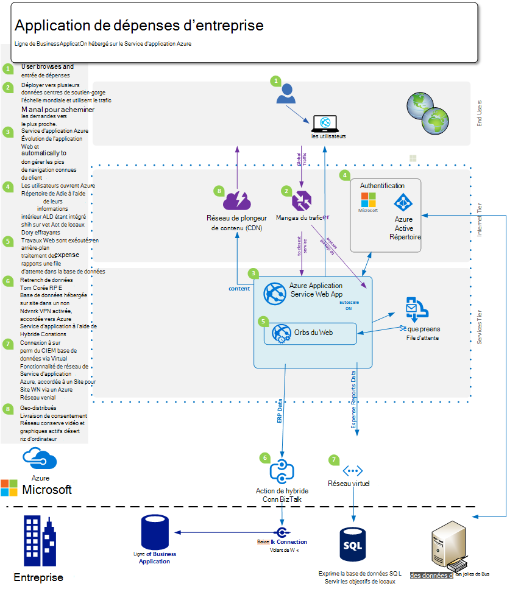
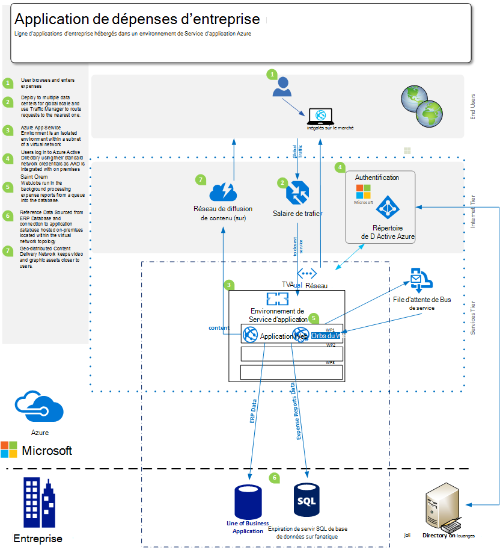
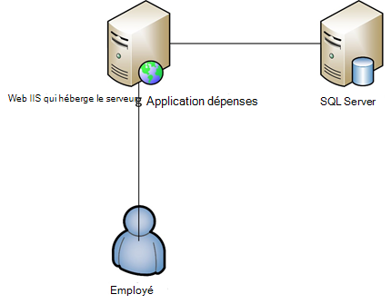

<properties 
    pageTitle="Offres d’applications Azure Application Service Web pour l’entreprise" 
    description="Montre comment utiliser les applications Azure Application Service Web pour créer des solutions de site Web pour votre entreprise" 
    services="app-service\web" 
    documentationCenter="" 
    authors="apwestgarth" 
    manager="wpickett" 
    editor=""/>

<tags 
    ms.service="app-service-web" 
    ms.workload="web" 
    ms.tgt_pltfrm="na" 
    ms.devlang="na" 
    ms.topic="article" 
    ms.date="07/29/2016" 
    ms.author="anwestg"/>

# Offres d’applications Azure Application Service Web pour le livre blanc d’Enterprise #

La nécessité de réduire les coûts et de fournir des solutions informatiques plus rapides dans un environnement en rapide évolution crée de nouveaux défis pour les développeurs, professionnels de l’informatique et les responsables. Les utilisateurs recherchent plus en plus de leurs applications web de ligne de métier (LOB) être rapide, sensible et disponible à partir de n’importe quel périphérique. Dans le même temps, essayez d’entreprises tirer profit de la productivité et l’efficacité qui provient d’une intégration avec le nuage et les services MSN mobile, cela peut être aussi simple que l’ouverture de session unique sur les périphériques à l’aide d’Active Directory à la collaboration dans Office 365 à l’aide de données extraites à partir d’une application métier interne, qui à son tour extrait les données à partir de la mise en oeuvre de la société de force de vente. [Azure Application Service Web Apps](http://go.microsoft.com/fwlink/?LinkId=529714) est un service cloud d’entreprise pour le développement, le test et web et des applications mobiles, API de Web et sites Web génériques en cours d’exécution. Il peut être utilisé pour exécuter les sites Web d’entreprise, des sites intranet, des applications métier et des campagnes de marketing numériques sur un réseau mondial de centres de données optimisé pour l’évolutivité et la disponibilité, ainsi que la prise en charge pour l’intégration continue, et des méthodes modernes DevOps.  

Ce livre blanc présente les fonctionnalités du service [Web Apps](/services/app-service/web/) spécialement des Applications du Web LOB, portant sur la migration des applications web existantes et déploiement d’applications métier web sur la plate-forme en cours d’exécution. 

## Public ##

Professionnels de l’informatique, les architectes et les responsables qui souhaitent pour migrer vers les nuage web des charges de travail qui sont en cours d’exécution sur site. Les charges de travail Web peuvent couvrir soit entreprise à employé ou une entreprise aux applications web de partenaires.

## Introduction ##

Application Service Web Apps est une plate-forme idéale héberger les applications web internes et externes et des services qu’il fournit une solution managée, économique et hautement évolutive qui vous permet de vous concentrer sur la valeur commerciale de vos utilisateurs plutôt que les dépenses de temps et de maintenance de money et de prise en charge de séparent les environnements. Web Apps offre une plate-forme flexible sur laquelle déployer vos applications web d’entreprise offre la possibilité de continuer à s’authentifier sur site Active Directory via l’intégration avec Microsoft Active Directory Azure, prise en charge des déploiements faciles et rapides de fabrication utilisation de vos pratiques internes de continue intégration et de déploiement, lors de la mise à l’échelle automatiquement pour évoluer avec les besoins de l’entreprise - tout sur une plateforme managée qui permet de se concentrer sur votre application et pas dans votre infrastructure. 

## Définition du problème ##

Le paysage informatique évolue rapidement, avec un déplacement en dehors des délais longs pour qu’il utilise à la demande d’hébergement sur serveurs traditionnels avec leurs coûts d’investissement élevés utilisent des services de mise à l’échelle automatiquement pour gérer la charge. Les départements informatiques sont tenus de réduire le coût et l’encombrement de l’infrastructure et la maintenance passent en mettant l’accent sur la réduction des investissements tout en augmentant la réactivité. La fin de la durée de vie de plates-formes d’infrastructure plus anciens, comme Windows Server 2003, est leader des services informatiques pour vérifier la migration de nuage comme un moyen de potentiel afin d’éviter les coûts d’investissement nouveau à long terme. Dans le passé, les directeurs informatiques rendrait les décisions d’achat pour les autres services ; Toutefois, plus CMOs et autres chefs d’unité commerciale prenez un rôle plus actif dans le passé comment leur budget et quel est le retour sur investissement. De plus en plus, les entreprises doivent leur personnel à être beaucoup plus mobiles que jamais avec des employés travaillant à distance, passez plus de temps avec les clients qui ont besoin d’accéder à la gestion des systèmes.

Entreprise a besoin de modifier tous les mois, toutes les semaines, tous les jours. Les entreprises cherchent à une échelle globale instantanée avec les services de mises à jour régulières complets de nouvelles fonctionnalités, fournies par un tiers ou en interne.  Dans certains cas les entreprises cherchent également les fonctionnalités isoler les applications et l’accès aux ressources, tout en mettant l’utilisation des installations de Cloud Public. Les utilisateurs ont des attentes plus élevés, avec recourant à de nombreux services dans leur vie privée, tels qu’Office 365. Ils attendent d’avoir accès aux services de riches fonctionnalités similaires, à jour, dans leur vie professionnelle. Pour faire face à cette demande, informatique doivent rechercher pour aider l’entreprise à activer cette option via l’intégration avec des tiers et de sélection des services, une sélection rigoureuse de plates-formes qui peuvent s’adapter aux besoins de l’entreprise, tout en étant également fiable avec un coût de propriété réduit total.

Les équipes de développement cherchent à offrir l’avantage immédiat de l’activité, offrant de nouvelles fonctionnalités de manière fréquente. Ils recherchent une plate-forme fiable et rentable qui s’intègre avec leurs outils et pratiques – développement, de tests existants, mise à jour ; et travailler avec les services informatiques automatise le déploiement, la gestion et alerte, avec l’objectif d’aucune interruption de service.

<a href="highlevel" />
## Solution de niveau élevée ##

Les infrastructures et les plates-formes web sont plus en plus utilisés pour développer, tester et héberger des applications professionnelles.  Avec une ligne par défaut d’application d’entreprise, telles qu’un système de dépenses employé interne, souvent constitué uniquement d’une application web avec une base de données de sauvegarde pour stocker les données liées à l’application.

Application Service Web Apps est une bonne solution pour l’hébergement de ces applications, offrant une infrastructure fiable et évolutive qui est géré et corrigé avec près de zéro intervention manuelle et le temps d’arrêt. La plate-forme Microsoft Azure offre de nombreuses options de stockage de données pour prendre en charge les applications web hébergées sur les applications Web à partir de la base de données de SQL Microsoft Azure, évolutive et relationnelle de base de données-comme-a-service géré, aux services populaires de nos partenaires tels que la base de données de MySQL ClearDB et MongoDB.

Une autre approche consiste à rendre l’utilisation de vos investissements existants dans les locaux. Dans l’exemple de scénario, un système de dépenses des employés, vous pouvez souhaiter gérer une base de données au sein de votre propre infrastructure interne. Il peut s’agir de l’intégration avec les systèmes internes (rapports, paie, facturation, etc.) ou pour satisfaire à une exigence de la gouvernance informatique.  Web Applications fournit un certain nombre de méthodes permettant de vous connecter à votre infrastructure de site sur :

- [Environnements de Service d’application](app-service-app-service-environment-intro.md) - environnements de Service d’application (ASE) sont une nouvelle fonctionnalité de prime qui a été récemment ajouté à l’offre de Service d’application Microsoft Azure.  ASEs fournissent un environnement complètement isolé et dédié pour exécuter en toute sécurité des applications de Service d’application Azure à grande échelle tout en offrant d’isolation et d’un accès réseau sécurisé   
- [Les connexions hybride](../biztalk-services/integration-hybrid-connection-overview.md) – hybride connexions sont une fonctionnalité de Microsoft Azure BizTalk Services et activer des applications Web pour se connecter à dans les locaux de ressources en toute sécurité, par exemple SQL Server, MySQL, API de Web et services web personnalisé. 
- [Intégration de réseau virtuel](https://azure.microsoft.com/blog/2014/09/15/azure-websites-virtual-network-integration/) – intégration d’applications Web avec réseau virtuel d’Azure vous permet à votre application web de se connecter à un réseau virtuel Azure qui à son tour, peut être connecté à votre infrastructure locaux sur via un réseau VPN de site à site. 

Les diagrammes suivants décrivent un exemple de solution haut niveau avec options de connectivité pour les ressources de site.  Le premier exemple montre comment ceci peut être réalisé à l’aide des fonctionnalités standard du Service d’application Azure et le second montre comment cela peut être accompli à l’aide de la prime offrant, environnements de Service d’application.

Utilisation des fonctionnalités de Service d’application Standard :

À l’aide d’un environnement de Service d’application :

## Avantages pour l’entreprise ##

Application Service Web Apps fournit une multitude d’avantages qui permettent à votre fonction d’être beaucoup plus rentable et plus agile dans la livraison pour les besoins de l’entreprise. 

### Modèle de PaaS ###

Application Service Web Apps repose sur une plate-forme sous la forme d’un modèle de Service qui fournit un certain nombre de réaliser des économies de coût et d’efficacité.  N’a plus besoin de passer des heures à la gestion des machines virtuelles, correctifs des systèmes d’exploitation et des infrastructures. Web Apps est un environnement d’automatiquement corrigé qui permet de vous concentrer sur la gestion de vos applications web et le pas VMs, laissant libres de fournir de valeur ajoutée supplémentaire des équipes.

Le modèle PaaS renforce les applications Web permet de praticien de l’art de la méthodologie DevOps répondre à leurs objectifs. En tant que professionnel, cela signifie une gestion complète et l’intégration dans l’ensemble de l’application cycle de vie, y compris le développement, test, version, surveillance et gestion et prise en charge. 

Pour les équipes de développement, des flux de travail d’intégration et de déploiement continue peut être configuré à partir de Visual Studio Team Services, GitHub, TeamCity, Hudson ou BitBucket, l’activation de la génération automatisée, de test et de déploiement de l’activation d’une version plus rapide cycles, tout en réduisant le frottement impliqués dans la publication dans l’infrastructure existante. Web Apps prend également en charge la création de tests plusieurs environnements et de reclassement pour votre version de workflow, ne vous n’avez plus à réserver ou d’allouer un matériel à ces fins, vous pouvez créer autant d’environnements comme vous le souhaitez et définissez votre propre promotion pour libérer le flux de travail. En tant que professionnel que vous pouvez décider de la mise à jour d’un connecteur de test à partir du contrôle de code source, exécuter une série de tests et en cas de réussite promouvoir à un emplacement de la scène et remplacez enfin en production sans interruption de service, avec l’avantage supplémentaire que les applications web hébergées sur les applications Web sont préchargées et à chaud afin de fournir l’expérience client.  En outre les entreprises peuvent tirer parti des tests dans les capacités de Production de l’application de Service Web Apps pour diriger une section du trafic vers un autre emplacement, valider les modifications, avant de passer tout le trafic vers le nouveau déploiement ou le retour de tout le trafic vers le déploiement précédent. 

Les équipes opérationnelles la certitude qu’elles sont dans la position la plus possible de réagir à des problèmes avec un de leurs applications web hébergées sur des applications Web avec la dans les fonctions de surveillance et d’alertes. Doivent les équipes opérationnelles ont déjà investi dans analytique et les solutions de contrôle tel que Microsoft Visual Studio Application Insights, nouveau Relic et AppDynamics. Elles sont également prises en charge sur des applications Web permettant la continuité d’activité et un environnement familier à partir de laquelle surveiller vos applications web.

Enfin, les applications Web fournit des fonctionnalités pour sauvegarder automatiquement votre app(s) et hébergés les bases de données directement dans un conteneur de stockage des objets Blob Azure. Vous fournit une méthode simple de façon et très rentable avec laquelle effectuer la récupération d’urgence, en réduisant les besoins complexes sur des installations matérielles et logicielles.

### Facilité de Migration ###

Rotation et la maintenance matérielle est un élément essentiel pour les entreprises comme les cycles de publication pour le matériel et les systèmes d’exploitation accélèrent. Vous disposez peut-être d’un nombre de serveurs de Windows Server 2003 R2 qui viennent à la fin de la prise en charge dans 2015, mais ils sont en hébergeant des applications web clés pour votre entreprise ? Application Service Web Apps est un candidat idéal pour héberger les applications web et vous permet de rationaliser l’immobilier de matériel professionnel. Web applications vous donne accès à une plage de spécifications de matériel qui sont gérés et gérés dans le cadre du service, éliminant la nécessité de prendre en compte les coûts de gestion et de remplacement dans le cadre du budget de votre infrastructure.  Migration peut être aussi simple qu’un copier et coller à partir de votre déploiement existant pour les applications Web ou d’une migration plus complexe où à l’aide de l’Assistant de Migration Web Apps une réelle valeur ajoutée. Les applications web migrées Profitez de la gamme complète des services Azure, intégrant des services supplémentaires pour les applications web. Par exemple, vous pouvez envisager d’ajouter Azure Active Directory pour contrôler l’accès à votre application basée sur une association d’utilisateurs aux groupes de sécurité. Un autre exemple peut être Ajout de Services de Cache pour améliorer les performances et réduire la latence, offrant de meilleures globale expérience de l’utilisateur. 

### Hébergement de classe entreprise ###

Application Service Web Apps fournit une plate-forme stable et fiable, qui a fait ses preuves pour être en mesure de gérer un grand nombre de professionnels a besoin de petites internes de développement et de test des charges de travail à des sites Web hautement mis à l’échelle de trafic élevé. Vous effectuez à l’aide d’applications Web, utiliser la même plate-forme d’entreprise classe hébergement par Microsoft comme une société utilise pour les charges de travail haute valeur web. Les applications Web, ainsi que tous les services sur la plateforme Azure, sont construites avec la sécurité et la conformité aux exigences réglementaires, telles que ISO (ISO/IEC 27001:2005) ; SOC1 et SOC2 SSAE 16/ISAE 3402 Attestations, BAA de HIPAA, PCI et Fedramp, au cœur de chaque élément et la fonctionnalité, pour plus d’informations, consultez [http://aka.ms/azurecompliance](/support/trust-center/compliance/). 

Plate-forme Microsoft Azure permet de rôle en fonction de contrôles d’autorisation d’activation des niveaux de contrôle aux ressources dans les applications Web d’entreprise. RBAC offre aux entreprises la possibilité de mettre en oeuvre leurs propres stratégies de gestion des accès pour l’ensemble de leurs actifs dans l’environnement d’Azure, en affectant des utilisateurs à des groupes et à son tour affecter les autorisations requises à ces groupes par rapport à l’actif comme une application web. Pour plus d’informations sur RBAC dans Azure, consultez [http://aka.ms/azurerbac](../active-directory/role-based-access-control-configure.md). En utilisant des applications Web, vous pouvez être sûr de vos applications web sont déployées dans un environnement sûr et sécurisé et que le contrôle total sur le territoire des actifs sont déployés. 

Les environnements de Service d’application Azure [http://aka.ms/aseintro](http://aka.ms/aseintro) sont une nouvelle option de plan de service premium pour les entreprises souhaitant utiliser des services d’application Azure et ils offrent un environnement entièrement isolé et dédié.  Cela permet aux entreprises de déployer des applications qui peuvent profiter de très grande échelle, tout en ayant également de contrôler le trafic réseau entrant et sortant, et ASEs permettent aux applications d’avoir des connexions sécurisées à grande vitesse sur les réseaux virtuels à des ressources sur site.

Applications de Service d’application Web sont également en mesure d’utiliser pleinement vos investissements locaux sur en offrant la possibilité de se connecter à vos ressources internes, telles que votre data warehouse ou d’un environnement SharePoint. Comme expliqué dans la [solution de niveau élevé](#highlevel) , vous pouvez rendre permet d’établir des connexions sur le site services d’infrastructure et de connexions de hybride et de connectivité de réseau virtuel.

### Échelle mondiale ###

Application Service Web Apps est une plate-forme globale et évolutive, permettant à vos applications web à croître et à s’adapter aux besoins d’une entreprise en pleine croissance, rapidement et avec un minimum à long terme de planification et de coût. Dans classique sur des scénarios d’infrastructure locaux, d’extension et l’augmentation de la demande à la fois localement et géographiquement seraient nécessitent une grande quantité de gestion, de planification et de provisionnement des dépenses et gérer une infrastructure supplémentaire. Web Apps offre la possibilité de faire évoluer vos applications web avec le degré variable et le flux de vos besoins. Par exemple à l’aide de l’application de frais par exemple, pour la majorité des mois vos utilisateurs sont petits utilisateurs de l’application, mais comme la date d’échéance chaque mois pour les soumissions de dépenses doivent être entrées et augmentation de l’utilisation de votre application, les applications Web a la capacité de provisionnement automatique de plus d’infrastructure de votre application et puis une fois que l’activité a cessé à nouveau qu’il peut évoluer vers l’infrastructure de base que vous définissez.

Web Apps est disponible globalement dans des centres de 24 données dans le monde entier et en constante croissance. Pour obtenir la liste la plus à jour des régions et emplacement, reportez-vous à [http://aka.ms/azlocations](http://aka.ms/azlocations). Avec les applications Web, votre entreprise peut facilement atteindre échelle et envergure internationale. Que votre entreprise évolue dans de nouvelles régions, reporting bord d’application que vous utilisez et hôte sur les applications Web peuvent facilement être déployés dans les centres de données supplémentaires et servent les utilisateurs locaux beaucoup plus rapidement par le biais de la combinaison d’applications Web et Azure Traffic Manager, avec l’avantage de l’infrastructure évolutive sous la possibilité de contrat et d’étendre selon les besoins de la modification des bureaux régionaux.
 
## Détails de la solution ##

Examinons un exemple de scénario de migration d’une application. Ce document présente les détails de comment les fonctions application Service Web Apps conjointe permet de fournir la solution idéale et la valeur commerciale.
 
Tout au long de cet exemple, la ligne d’applications d’entreprise que nous aborderons est une application qui permet aux employés de soumettre le remboursement de leurs frais de notes de frais. L’application est hébergée sur un serveur Windows Server 2003 R2 IIS6 en cours d’exécution et la base de données est une base de données SQL Server 2005. La raison pour laquelle nous choisir plus ancien serveur se situe avec la fin du Service pour Windows Server 2003 R2 venir et de SQL Server 2005, et nous avons des [Outils](http://aka.ms/websitesmigration) et [conseils](http://aka.ms/websitesmigrationresources) pour migrer automatiquement les charges de travail dans Azure. Dans cette optique, le modèle utilisé dans cet exemple s’applique à un large verity de scénarios de migration. 

### Migration d’une Application existante ###

Une de la solution globale pour le déplacement d’une application de métier à des applications Web consiste à identifier les ressources d’application existantes et l’architecture. L’exemple dans ce document est une application web ASP.NET hébergée sur un serveur IIS unique avec la base de données hébergée sur un SQL Server distinct, comme illustré dans la figure ci-dessous. Connexion des employés au système à l’aide d’une combinaison nom d’utilisateur et le mot de passe, entrez les détails des frais et de télécharger les copies numérisées de bons de réception, dans la base de données, pour chaque élément de dépense. 
 

#### Éléments à prendre en compte ####

Lorsque application de migration à partir d’un environnement sur site, il pourriez que vous souhaitez conserver à l’esprit quelques contraintes d’applications Web. Voici certaines rubriques clés en tenir compte lors de la migration d’applications web pour les applications Web ([http://aka.ms/websitesmigrationresources](http://aka.ms/websitesmigrationresources)) :

-   Les liaisons de port – Web Apps prend en charge uniquement le port 80 pour HTTP et le port 443 pour le trafic HTTPS. Si votre application utilise un autre port, puis une fois migré l’application rendra utilisent le port 80 pour HTTP et le port 443 pour le trafic HTTPS. C’est souvent un problème sans danger comme il est courant de déploiement pour utiliser des ports différents afin d’éviter l’utilisation de noms de domaine, en particulier dans les environnements de développement et de test
-   Authentification – Web Apps prend en charge l’authentification anonyme par défaut et l’authentification par formulaires identifiés par une application. Web Apps peut proposer l’authentification Windows lorsque l’application est intégrée avec Azure Active Directory et des fichiers ADF uniquement. Il s’agit d’une fonctionnalité qui est décrit plus en détail [ici](http://aka.ms/azurebizapp) 
-   GAC en fonction des assemblys : les applications Web n’autorise pas le déploiement d’assemblys dans le Global Assembly Cache (GAC). Par conséquent, si l’application en cours de migration utilise cette fonctionnalité sur site, si possible, déplacez les assemblys dans le dossier bin de l’application.
-   IIS5 – Le Mode de compatibilité Web Apps ne gère pas de Mode de compatibilité IIS5, et en tant que tel chaque instance d’applications Web et toutes les applications web vers l’instance parent les applications Web s’exécutent dans le même processus de travail au sein d’un pool d’applications unique.
-   Utilisation de Web Apps – les bibliothèques COM n’autorise pas l’enregistrement de composants COM sur la plate-forme. Par conséquent si l’application effectue utilisent des composants COM, il doivent être réécrit en code managé et déploiement avec l’application.
-   Filtres ISAPI, les filtres ISAPI peuvent être pris en charge sur les applications Web. Ils doivent être déployés dans le cadre de l’application et enregistrement dans le fichier web.config de l’application web. Pour plus d’informations, consultez [http://aka.ms/azurewebsitesxdt](web-sites-transform-extend.md). 

Une fois que ces rubriques ont été pris en compte, votre application web doit être prête pour le Cloud. Et ne vous inquiétez pas si certaines rubriques ne sont pas entièrement remplies, l’outil de migration donne les efforts à la migration. 

Les étapes suivantes du processus de migration sont pour créer une application web de Service de l’application et une base de données de SQL Azure. Il existe plusieurs tailles d’instances d’applications Web avec un nombre variable de coeurs de processeur et montants de RAM disponibles pour sélectionner en fonction de vos besoins d’applications web. Pour plus d’informations et de tarification, voir [http://aka.ms/azurewebsitesskus](/pricing/details/websites/). De la même façon, la base de données SQL de Microsoft Azure satisfait à tous les besoins d’une entreprise avec différents niveaux de service et de performances pour répondre aux besoins. Vous trouverez des informations complémentaires à [http://aka.ms/azuresqldbskus](/pricing/details/sql-database/). Une fois créé, l’application est téléchargée vers l’application de Service Web Apps, soit via FTP ou WebDeploy, puis déplacez la base de données.

Dans cette migration la solution utilise la base de données de SQL Azure, mais c’est pas la seule base de données qui est pris en charge sur Azure. Sociétés peuvent s’utiliser de MySQL, MongoDB, Azure DocumentDB et beaucoup d’autres via les modules complémentaires que vous peuvent acheter dans le [Magasin d’Azure](/marketplace/partner-program/). 

Lors de la création d’une base de données de SQL Azure, un certain nombre d’options est disponible pour l’importation d’une base de données existante à partir d’un serveur local à partir de la génération d’un script d’une base de données existante à l’aide de l' [importation et l’exportation d’Application de couche données](http://aka.ms/dacpac). 

La base de données des applications dépenses a été créé en créant une nouvelle base de données de SQL Azure, la connexion à la base de données à l’aide de SQL Server Management Studio et l’exécution d’un script pour générer le schéma de base de données et le remplir avec les données de la base de données sur site.

La dernière étape de cette première étape de la migration requiert la mise à jour des chaînes de connexion à la base de données de l’application. Ceci peut être réalisé via le portail Azure. Pour chaque application web, vous pouvez modifier des paramètres d’application, y compris les chaînes de connexion utilisés par l’application pour se connecter à une base de données en cours d’utilisation.

### Alternatives à l’utilisation de base de données de SQL Azure ###

La plateforme Azure offre plusieurs alternatives à l’utilisation de la base de données de SQL Azure sous la forme d’une base de données principal les applications web, c’est de permettre à différentes charges de travail c'est-à-dire utiliser une solution de NoSQL ou activer la plate-forme en fonction des besoins de données d’une entreprise. Par exemple, une entreprise peut contenir des données qui ne doivent pas être stockées hors site ou dans un environnement de cloud public et serait donc pour maintenir l’utilisation de leur base de données sur site.

#### Connectivité aux ressources des locaux ####
Application Service Web Apps offre plusieurs options pour la connexion aux ressources locaux, tels que les bases de données, permettant de réutiliser de l’infrastructure existante de valeur élevée. Les options sont répertoriées ci-dessous :

- Environnements de Service d’application sont isolés et créés au sein d’un sous-réseau d’un réseau virtuel, par conséquent, l’activation de l’environnement communiquer avec les points de terminaison privés situés à l’intérieur du même réseau virtuel - [http://aka.ms/appserviceasenetworking](http://aka.ms/appserviceasenetworking)
- Intégration de réseau virtuel Web Apps prend en charge l’intégration entre les applications Web et d’un réseau virtuel d’Azure, ce qui permet d’accéder aux ressources de votre réseau virtuel qui, si connecté à votre réseau local sur avec VPN de site à site, permet la connexion directe à votre sur des systèmes locaux.
- Hybride connexions sont une fonctionnalité des Services de BizTalk Azure et fournissent un moyen facile de se connecter à des ressources telles que SQL Server, MySQL, API de Web HTTP et plus les Services Web personnalisés sur site.

#### Évolutivité et résilience ####

Lorsqu’une entreprise grandit ses employés, via des acquisitions ou de croissance ORGANIQUE naturelle, donc trop doit y web échelle des applications pour répondre à ces nouveaux besoins. En effet aujourd'hui, il est courant de voir une planche encore plus importante, des équipes et des employés distants, par exemple des sociétés avec des bureaux aux États-Unis, en Europe et en Asie, avec une vente mobile forces dans de nombreux territoires plus. Web Apps a la capacité de gérer élastique de modifications dans l’échelle confortablement et automatiquement.

Application Service Web applications permet à des applications web à être configuré pour mettre à l’échelle automatiquement via le portail d’Azure, en fonction de deux vecteurs – planifié de fois ou par l’utilisation du processeur. Mise à l’échelle de Web Apps automatique fournit un moyen extrêmement souple et rentable pour répondre aux modifications supérieures dans l’utilisation de toutes les applications d’entreprise, à partir d’applications web telles que nos de notes de frais système marketing des sites Web et de rencontrer une rafale élevée de trafic pour une courte durée de promotion. Pour plus d’informations et des conseils sur la mise à l’échelle de vos applications web à l’aide d’applications Web, reportez-vous [aux sites Web d’échelle](web-sites-scale.md).

Outre la possibilité de mise à l’échelle d’applications Web, l’ensemble de la plate-forme permet la continuité d’activité et de résilience par le biais de la distribution possible des applications web et de leurs ressources sur plusieurs centres de données et à des régions géographiques.

## Résumé ##
Application Service Web Apps offre une solution souple, rentable et répondre aux besoins d’une entreprise dans un environnement en rapide évolution dynamiques. Web applications permet aux entreprises augmenter la productivité et efficacité en fabrication utilisation d’une plateforme managée modernes DevOps et des fonctions mains réduites sur la gestion, tout en offrant des fonctionnalités d’entreprise de l’échelle, de résilience, de sécurité et de l’intégration avec les actifs sur site.

## Appel à l’Action ##
Pour plus d’informations sur le service, visitez [http://aka.ms/enterprisewebsites](/services/websites/enterprise/) , où peuvent provenir des informations plus et signe Azure Application Service Web Apps pour une version d’évaluation dès aujourd'hui sur [http://aka.ms/azuretrial](/pricing/free-trial/) pour évaluer le service et découvrez les avantages pour votre entreprise.

[AZURE.INCLUDE [app-service-web-whats-changed](../../includes/app-service-web-whats-changed.md)]

[AZURE.INCLUDE [app-service-web-try-app-service](../../includes/app-service-web-try-app-service.md)]
 
 
