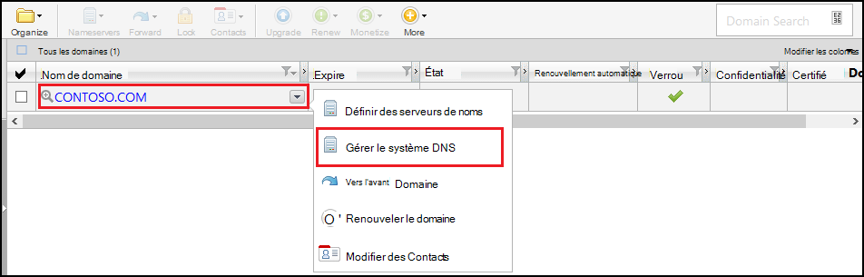
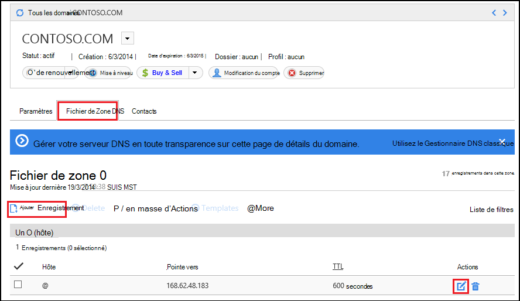
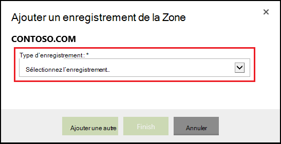
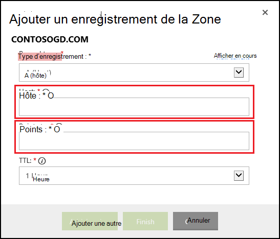

<properties
    pageTitle="Configurer un nom de domaine personnalisé dans le Service d’application Azure (GoDaddy)"
    description="Apprenez à utiliser un nom de domaine à partir de GoDaddy avec Azure Web Apps"
    services="app-service"
    documentationCenter=""
    authors="erikre"
    manager="wpickett"
    editor="jimbe"/>

<tags
    ms.service="app-service"
    ms.workload="na"
    ms.tgt_pltfrm="na"
    ms.devlang="na"
    ms.topic="article"
    ms.date="01/12/2016"
    ms.author="cephalin"/>

# Configurer un nom de domaine personnalisé dans le Service d’application Azure (acheté directement à partir de GoDaddy)

[AZURE.INCLUDE [web-selector](../../includes/websites-custom-domain-selector.md)]

[AZURE.INCLUDE [intro](../../includes/custom-dns-web-site-intro.md)]

Si vous avez acheté le domaine par le biais de Azure Application Service Web Apps ensuite faire référence à la dernière étape [d’Acheter un domaine pour les applications Web](custom-dns-web-site-buydomains-web-app.md).

Cet article fournit des instructions sur l’utilisation d’un nom de domaine personnalisé qui a été acheté directement à partir de [GoDaddy](https://godaddy.com) avec [l’Application de Service Web Apps](http://go.microsoft.com/fwlink/?LinkId=529714).

[AZURE.INCLUDE [introfooter](../../includes/custom-dns-web-site-intro-notes.md)]

##Présentation des enregistrements DNS

[AZURE.INCLUDE [understandingdns](../../includes/custom-dns-web-site-understanding-dns-raw.md)]

## Ajouter un enregistrement DNS pour votre domaine personnalisé

Pour associer votre domaine personnalisé à une application web dans le Service d’application, vous devez ajouter une nouvelle entrée dans la table DNS pour votre domaine personnalisé à l’aide des outils fournis par GoDaddy. Procédez comme suit pour localiser les outils DNS pour GoDaddy.com

1. Ouvrez une session sur votre compte avec GoDaddy.com et cliquez sur **Mon compte** , puis sur **Gérer mes domaines**. Enfin, sélectionnez le menu déroulant pour le nom de domaine que vous souhaitez utiliser avec votre application web d’Azure, puis sélectionnez **Gérer les DNS**.

    

2. À partir de la page de **Détails du domaine** , accédez à l’onglet **Fichier de Zone DNS** . Il s’agit de la section utilisée pour l’ajout et la modification des enregistrements DNS pour le nom de votre domaine.

    

    Sélectionnez **Ajouter un enregistrement** pour ajouter un enregistrement existant.

    Pour **Modifier** un enregistrement existant, sélectionnez l’icône de stylo et de papier à côté de l’enregistrement.

    > [AZURE.NOTE] Avant d’ajouter de nouveaux enregistrements, notez que GoDaddy a déjà créé des enregistrements DNS pour les sous-domaines (appelés **l’hôte** dans l’éditeur,) telles que les **e-mails**, **fichiers**, **messages**et autres. Si le nom que vous souhaitez utiliser déjà existe, modifie l’enregistrement existant au lieu de créer un nouveau.

4. Lorsque vous ajoutez un enregistrement, vous devez d’abord sélectionner le type d’enregistrement.

    

    Ensuite, vous devez fournir l' **hôte** (personnalisée domaine ou sous-domaine) et ce qu’elle **pointe vers**.

    

    * Lors de l’ajout d’un **enregistrement A (hôte)** - vous devez définir le champ **hôte** soit **@** (il s’agit de nom de domaine racine, par exemple, **contoso.com**,) *(un caractère générique pour faire correspondre plusieurs sous-domaines,) ou le sous-domaine que vous souhaitez utiliser (par exemple, * *Web**.) Vous devez définir le * *pointe vers** champ à l’adresse IP de votre application web Azure.

    * Lors de l’ajout d’un **enregistrement CNAME (alias)** - vous devez définir le champ de **l’hôte** pour le sous-domaine que vous souhaitez utiliser. Par exemple, **www**. Vous devez affecter le champ **Points de** la **. azurewebsites.net** nom de domaine de votre application web Azure. Par exemple, **contoso.azurewebsites.net**.

5. Cliquez sur **Ajouter un autre**.
6. Sélectionnez le type d’enregistrement **TXT** , puis spécifiez la valeur **hôte** **@** et la valeur **pointe vers** ** &lt;yourwebappname&gt;. azurewebsites.net**.

    > [AZURE.NOTE] Cet enregistrement TXT est utilisé par Azure pour valider que vous possédez le domaine décrit par le premier enregistrement TXT ou de l’enregistrement A. Une fois que le domaine a été mappé à l’application web du portail d’Azure, cette entrée de l’enregistrement TXT peut être supprimée.

5. Lorsque vous avez terminé d’ajouter ou modifier des enregistrements, cliquez sur **Terminer** pour enregistrer les modifications.

## Activer le nom de domaine sur votre application web

[AZURE.INCLUDE [modes](../../includes/custom-dns-web-site-enable-on-web-site.md)]

>[AZURE.NOTE] Si vous souhaitez commencer avec le Service d’application Azure avant l’ouverture d’un compte Azure, accédez à [Essayer le Service application](http://go.microsoft.com/fwlink/?LinkId=523751), où vous pouvez créer une application web de courte durée starter immédiatement dans le Service d’application. Aucune carte de crédit obligatoire ; aucun des engagements.

## Ce qui a changé
* Pour obtenir un guide pour la modification de sites Web au Service de l’application voir : [Service d’application Azure et son Impact sur les Services Azure existants](http://go.microsoft.com/fwlink/?LinkId=529714)
