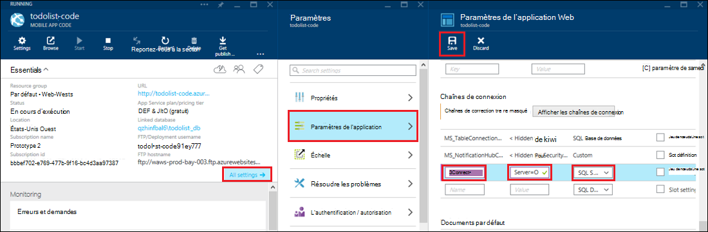

<properties 
    pageTitle="Accéder à des ressources sur site à l’aide de connexions de hybride dans le Service d’application Azure" 
    description="Créer une connexion entre une application web dans le Service d’application Azure et une ressource de site qui utilise un port TCP statique" 
    services="app-service" 
    documentationCenter="" 
    authors="cephalin" 
    manager="wpickett" 
    editor="mollybos"/>

<tags 
    ms.service="app-service" 
    ms.workload="na" 
    ms.tgt_pltfrm="na" 
    ms.devlang="na" 
    ms.topic="article" 
    ms.date="02/03/2016" 
    ms.author="cephalin"/>

#Accéder à des ressources sur site à l’aide de connexions de hybride dans le Service d’application Azure

Vous pouvez vous connecter à une application de Service d’application Azure à n’importe quelle ressource locale qui utilise un port TCP statique, tel que SQL Server, MySQL, API de Web HTTP et la plupart des Services Web personnalisés. Cet article vous montre comment créer une connexion hybride entre le Service de l’application et une base de données de SQL Server sur site.

> [AZURE.NOTE] La partie des applications Web de la fonctionnalité connexions de hybride est disponible uniquement dans le [Portail Azure](https://portal.azure.com). Pour créer une connexion dans les Services BizTalk, consultez [Connexions d’hybrides](http://go.microsoft.com/fwlink/p/?LinkID=397274). 
> 
> Ce contenu s’applique également aux applications Mobile dans le Service d’application Azure. 

## Conditions préalables
- Un abonnement Azure. Pour un abonnement gratuit, consultez [Azure la version d’évaluation gratuite](https://azure.microsoft.com/pricing/free-trial/). 
 
    Si vous souhaitez commencer avec le Service d’application Azure avant l’ouverture d’un compte Azure, accédez à [Essayer le Service application](http://go.microsoft.com/fwlink/?LinkId=523751), où vous pouvez créer une application web de courte durée starter immédiatement dans le Service d’application. Aucune carte de crédit obligatoire ; aucun des engagements.

- Pour utiliser une base de données SQL Server ou de SQL Server Express local avec une connexion hybride, TCP/IP doit être activé sur un port statique. À l’aide d’une instance par défaut de SQL Server est recommandé car il utilise le port 1433 statique. Pour plus d’informations sur l’installation et la configuration de SQL Server Express pour une utilisation avec des connexions hybride, voir [se connecter à un de SQL Server sur site d’un site web Azure à l’aide de connexions de hybride](http://go.microsoft.com/fwlink/?LinkID=397979).

- L’ordinateur sur lequel vous installez l’agent hybride Connection Manager sur site décrit plus loin dans cet article :

    - Doit être en mesure de se connecter à Azure sur port 5671
    - Doit être en mesure d’atteindre le *nom d’hôte*:*numéro de port* de votre ressource locale. 

> [AZURE.NOTE] Les étapes décrites dans cet article supposent que vous utilisez le navigateur de l’ordinateur qui hébergera l’agent de connexion hybride sur site.

## Créer une application web dans le portail Azure ##

> [AZURE.NOTE] Si vous avez déjà créé une application web ou un back-end de l’application Mobile dans le portail Azure que vous souhaitez utiliser pour ce didacticiel, vous pouvez passer directement à [créer une connexion hybride et un BizTalk Service](#CreateHC) et démarrer à partir de là.

1. Dans le coin supérieur gauche du [Portail Azure](https://portal.azure.com), cliquez sur **Nouveau** > **Web + Mobile** > **Web App**.
    
    ![Nouvelle application web][NewWebsite]
    
2. Sur la blade **d’application Web** , une URL et cliquez sur **créer**. 
    
    ![Nom du site Web][WebsiteCreationBlade]
    
3. Après quelques instants, l’application web est créée et sa pale d’application web s’affiche. La lame est un tableau de bord vertical avec défilement qui vous permet de gérer votre site.
    
    ![Site Web en cours d’exécution][WebSiteRunningBlade]
    
4. Pour vérifier que le site est en ligne, vous pouvez cliquer sur l’icône **Parcourir** pour afficher la page par défaut.
    
    ![Cliquez sur Parcourir pour afficher votre application web][Browse]
    
    ![Page d’application web par défaut][DefaultWebSitePage]
    
Ensuite, vous créerez une connexion hybride et un service BizTalk pour l’application web.

## Créer une connexion hybride et un Service BizTalk ##

1. Dans la blade d’application web, cliquez sur **tous les paramètres** > **réseau** > **configurer vos points de terminaison de connexion hybride**.
    
    ![Connexions hybride][CreateHCHCIcon]
    
2. Sur la lame de connexions hybride, cliquez sur **Ajouter**.
    
    <!-- ![Add a hybrid connnection][CreateHCAddHC]
-->
    
3. La blade **d’Ajouter une connexion hybride** s’ouvre.  Dans la mesure où il s’agit de votre première connexion hybride, l’option **nouvelle connexion hybride** est présélectionnée et la lame de **créer une connexion hybride** s’ouvre pour vous.
    
    ![Créer une connexion hybride][TwinCreateHCBlades]
    
    Sur la **lame de connexion hybride de créer**:
    - Pour **nom**, fournissez un nom pour la connexion.
    - **Nom d’hôte**, tapez le nom de l’ordinateur local qui héberge votre ressource.
    - **Port**, entrez le numéro de port utilisé que votre ressource locale (1433 pour une instance par défaut de SQL Server).
    - Cliquez sur le **Service BizTalk Server**

4. La lame de **Créer le BizTalk Service** s’ouvre. Entrez un nom pour le service BizTalk, puis cliquez sur **OK**.
    
    ![Créer le service BizTalk][CreateHCCreateBTS]
    
    La lame de **Créer le BizTalk Service** se ferme et vous revenez à la blade de **créer une connexion hybride** .
    
5. Sur la lame de connexion hybride de créer, cliquez sur **OK**. 
    
    ![Cliquez sur OK][CreateBTScomplete]
    
6. Lorsque le processus se termine, la zone de notification dans le portail vous informe que la connexion a été créée avec succès.
    < !---TODO

    Tout échec à ce stade. Impossible de créer un service BizTalk dans le portail dogfood. Basculer vers le portail classique (portail complète) et de la création du service BizTalk mais il ne semble pas vous permettent de lier les - lorsque vous avez terminé l’étape de conn créer hybride, vous obtenez l’erreur suivante de la création de connexion d’hybrides RelecIoudHC a échoué. Le type de ressource est introuvable dans l’espace de noms 'Microsoft.BizTaIkServices de l’api version 2014-06-01'.
    
    L’erreur indique qu’il n’a pas pu trouver le type, et pas l’instance.
    ![Notification de succès][CreateHCSuccessNotification]
    -->
7. Sur la lame de l’application web, l’icône **hybride connexions** indique maintenant que 1 connexion hybride a été créée.
    
    ![Connexion d’un hybride créée][CreateHCOneConnectionCreated]
    
À ce stade, vous avez terminé une partie importante de l’infrastructure de connexion cloud hybride. Ensuite, vous allez créer une partie sur site correspondant.

## Installer le Gestionnaire de connexion hybride sur site pour effectuer la connexion ##

1. Sur la lame de l’application web, cliquez sur **tous les paramètres** > **réseau** > **configurer vos points de terminaison de connexion hybride**. 
    
    ![Icône de connexions hybride][HCIcon]
    
2. Sur la lame de **connexions d’hybrides** , la colonne **statut** pour le point de terminaison ajouté récemment montre **pas connecté**. Cliquez sur la connexion pour le configurer.
    
    ![Non connecté][NotConnected]
    
    La lame de connexion hybride s’ouvre.
    
    ![NotConnectedBlade][NotConnectedBlade]
    
3. Sur la lame, cliquez sur **Configuration de l’écouteur**.
    
    ![Cliquez sur Configuration de l’écouteur][ClickListenerSetup]
    
4. La lame de **Propriétés de la connexion hybride** s’ouvre. Sous **Local hybride Connection Manager**, cliquez sur **Cliquez ici pour installer**.
    
    ![Cliquez ici pour installer][ClickToInstallHCM]
    
5. Exécutez des Application avertissement boîte de dialogue sécurité, cliquez sur **exécuter** pour continuer.
    
    ![Cliquez sur Exécuter pour continuer][ApplicationRunWarning]
    
6.  Dans la boîte de dialogue **Contrôle de compte d’utilisateur** , cliquez sur **Oui**.
    
    ![Cliquez sur Oui][UAC]
    
7. Le Gestionnaire de connexion hybride est téléchargé et installé pour vous. 
    
    ![L’installation de][HCMInstalling]
    
8. Une fois l’installation terminée, cliquez sur **Fermer**.
    
    ![Cliquez sur Fermer][HCMInstallComplete]
    
    Sur la lame de **connexions d’hybrides** , la colonne **état** indique maintenant **connecté**. 
    
    ![État connecté][HCStatusConnected]

Maintenant que l’infrastructure de connexion hybride est terminée, vous pouvez créer une application hybride qui l’utilise. 

>[AZURE.NOTE]Les sections suivantes vous montrent comment utiliser une connexion hybride avec un projet de back-end .NET des applications mobiles.

## Configurez le projet de back-end de Mobile application .NET pour se connecter à la base de données SQL Server

Dans le Service d’application, un projet de serveur principal Mobile applications .NET est simplement une application web ASP.NET avec un SDK d’applications Mobile supplémentaire installé et initialisé. Pour utiliser votre application web sous la forme d’un back-end d’applications Mobile, vous devez [télécharger et initialiser le back-end Mobile applications .NET SDK](../app-service-mobile/app-service-mobile-dotnet-backend-how-to-use-server-sdk.md#install-sdk).  

Pour les applications mobiles, vous devez également définir une chaîne de connexion pour la base de données sur site et de modifier le serveur principal pour utiliser cette connexion. 

1. Dans l’Explorateur de solutions dans Visual Studio, ouvrez le fichier Web.config de votre back-end de Mobile application .NET, repérez la section **connectionStrings** , ajoutez une nouvelle entrée de SqlClient comme suit, qui pointe vers la base de données de SQL Server sur site :

        <add name="OnPremisesDBConnection"
         connectionString="Data Source=OnPremisesServer,1433;
         Initial Catalog=OnPremisesDB;
         User ID=HybridConnectionLogin;
         Password=<**secure_password**>;
         MultipleActiveResultSets=True"
         providerName="System.Data.SqlClient" />

    N’oubliez pas de remplacer `<**secure_password**>` de cette chaîne avec le mot de passe que vous avez créé pour *HybridConnectionLogin*.

3. Cliquez sur **Enregistrer** dans Visual Studio pour enregistrer le fichier Web.config.

    > [AZURE.NOTE]Ce paramètre de connexion est utilisé lors de l’exécution sur l’ordinateur local. Lors de l’exécution dans Azure, ce paramètre est remplacé par le paramètre de connexion défini dans le portail.

4. Développez le dossier **modèles** et ouvrez le fichier de modèle de données, qui se termine par *Context.cs*.

6. Modifiez le constructeur d’instance de **DbContext** pour passer la valeur `OnPremisesDBConnection` au constructeur **DbContext** base, similaire à l’extrait de code suivant :

        public class hybridService1Context : DbContext
        {
            public hybridService1Context()
                : base("OnPremisesDBConnection")
            {
            }
        }

    Le service utilisera maintenant la nouvelle connexion à la base de données SQL Server.

## Mise à jour de la principale application Mobile pour utiliser la chaîne de connexion en local

Ensuite, vous devez ajouter un paramètre d’application pour cette nouvelle chaîne de connexion afin qu’il peut être utilisé à partir d’Azure.  

1. Dans le [portail Azure](https://portal.azure.com) dans le code de serveur principal d’application web pour votre application Mobile, cliquez sur **tous les paramètres**, puis sur **paramètres de l’Application**.

3. De la lame de **paramètres d’application Web** , faites défiler **les chaînes de connexion** et ajouter une nouvelle chaîne de connexion **SQL Server** nommée `OnPremisesDBConnection` avec une valeur comme `Server=OnPremisesServer,1433;Database=OnPremisesDB;User ID=HybridConnectionsLogin;Password=<**secure_password**>`.

    Remplacer `<**secure_password**>` avec le mot de passe sécurisé pour votre base de données sur site.

    

2. Appuyez sur **Enregistrer** pour enregistrer la connexion des hybrides et la chaîne de connexion que vous venez de créer.

À ce stade, vous pouvez republier le projet serveur et tester la nouvelle connexion avec vos clients d’applications Mobile existants. Données va être lues et écrites dans la base de données locale à l’aide de la connexion hybride.

## Étapes suivantes ##

- Pour plus d’informations sur la création d’une application web ASP.NET qui utilise une connexion hybride, voir [se connecter à un de SQL Server sur site d’un site web Azure à l’aide de connexions de hybride](http://go.microsoft.com/fwlink/?LinkID=397979). 

### Ressources supplémentaires

[Vue d’ensemble des connexions hybride](http://go.microsoft.com/fwlink/p/?LinkID=397274)

[Josh Twist présente les connexions hybride (vidéo Channel 9)](http://channel9.msdn.com/Shows/Azure-Friday/Josh-Twist-introduces-hybrid-connections)

[Site web de connexions hybride](https://azure.microsoft.com/services/biztalk-services/)

[Les Services BizTalk : Onglets de tableau de bord, moniteur, échelle, configurer et hybride connexion](../biztalk-services/biztalk-dashboard-monitor-scale-tabs.md)

[Création d’un nuage hybride de réelles avec la portabilité des applications transparente (vidéo Channel 9)](http://channel9.msdn.com/events/TechEd/NorthAmerica/2014/DCIM-B323#fbid=)

[Se connecter à un de SQL Server sur site depuis Azure les Services mobiles à l’aide de connexions de hybride (vidéo Channel 9)](http://channel9.msdn.com/Series/Windows-Azure-Mobile-Services/Connect-to-an-on-premises-SQL-Server-from-Azure-Mobile-Services-using-Hybrid-Connections)

## Ce qui a changé
* Pour obtenir un guide pour la modification de sites Web au Service de l’application voir : [Service d’application Azure et son Impact sur les Services Azure existants](http://go.microsoft.com/fwlink/?LinkId=529714)

<!-- IMAGES -->
[New]:./media/web-sites-hybrid-connection-get-started/B01New.png
[NewWebsite]:./media/web-sites-hybrid-connection-get-started/B02NewWebsite.png
[WebsiteCreationBlade]:./media/web-sites-hybrid-connection-get-started/B03WebsiteCreationBlade.png
[WebSiteRunningBlade]:./media/web-sites-hybrid-connection-get-started/B04WebSiteRunningBlade.png
[Browse]:./media/web-sites-hybrid-connection-get-started/B05Browse.png
[DefaultWebSitePage]:./media/web-sites-hybrid-connection-get-started/B06DefaultWebSitePage.png
[CreateHCHCIcon]:./media/web-sites-hybrid-connection-get-started/C01CreateHCHCIcon.png
[CreateHCAddHC]:./media/web-sites-hybrid-connection-get-started/C02CreateHCAddHC.png
[TwinCreateHCBlades]:./media/web-sites-hybrid-connection-get-started/C03TwinCreateHCBlades.png
[CreateHCCreateBTS]:./media/web-sites-hybrid-connection-get-started/C04CreateHCCreateBTS.png
[CreateBTScomplete]:./media/web-sites-hybrid-connection-get-started/C05CreateBTScomplete.png
[CreateHCSuccessNotification]:./media/web-sites-hybrid-connection-get-started/C06CreateHCSuccessNotification.png
[CreateHCOneConnectionCreated]:./media/web-sites-hybrid-connection-get-started/C07CreateHCOneConnectionCreated.png
[HCIcon]:./media/web-sites-hybrid-connection-get-started/D01HCIcon.png
[NotConnected]:./media/web-sites-hybrid-connection-get-started/D02NotConnected.png
[NotConnectedBlade]:./media/web-sites-hybrid-connection-get-started/D03NotConnectedBlade.png
[ClickListenerSetup]:./media/web-sites-hybrid-connection-get-started/D04ClickListenerSetup.png
[ClickToInstallHCM]:./media/web-sites-hybrid-connection-get-started/D05ClickToInstallHCM.png
[ApplicationRunWarning]:./media/web-sites-hybrid-connection-get-started/D06ApplicationRunWarning.png
[UAC]:./media/web-sites-hybrid-connection-get-started/D07UAC.png
[HCMInstalling]:./media/web-sites-hybrid-connection-get-started/D08HCMInstalling.png
[HCMInstallComplete]:./media/web-sites-hybrid-connection-get-started/D09HCMInstallComplete.png
[HCStatusConnected]:./media/web-sites-hybrid-connection-get-started/D10HCStatusConnected.png
 