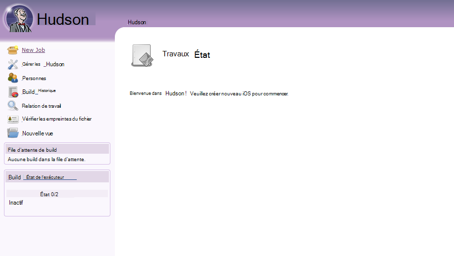
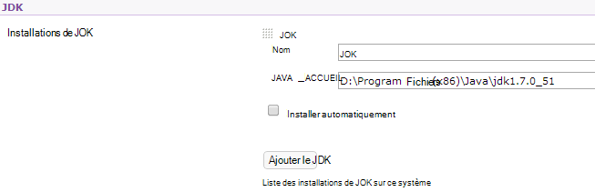
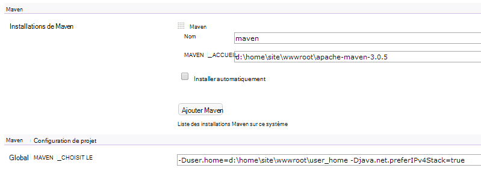

<properties 
    pageTitle="Téléchargement d’une application web de Java personnalisée vers Azure" 
    description="Ce didacticiel vous montre comment télécharger une application web de Java personnalisée pour Azure Application Service Web Apps." 
    services="app-service\web" 
    documentationCenter="java" 
    authors="rmcmurray" 
    manager="wpickett" 
    editor=""/>

<tags 
    ms.service="app-service-web" 
    ms.workload="web" 
    ms.tgt_pltfrm="na" 
    ms.devlang="Java" 
    ms.topic="article" 
    ms.date="08/11/2016" 
    ms.author="robmcm"/>

# Téléchargement d’une application web de Java personnalisée vers Azure

Cette rubrique explique comment télécharger une application web de Java personnalisée pour [Azure Application Service] Web Apps. Les informations qui s’applique à n’importe quelle application web ou le site Web de Java et également quelques exemples pour des applications spécifiques sont incluses.

Notez que Azure fournit un moyen pour la création d’applications web de Java à l’aide d’interface utilisateur de configuration du portail Azure et le marché Azure, comme indiqué à la [Création d’une application web de Java dans le Service d’application Azure](web-sites-java-get-started.md). Ce didacticiel est pour les scénarios dans lesquels vous ne souhaitez pas utiliser la configuration du portail d’Azure, l’interface utilisateur ou l’Azure Marketplace.  

## Instructions de configuration

La section suivante décrit les paramètres attendus pour les applications web Java personnalisées sur Azure.

- Le port HTTP utilisé par le processus Java est attribué dynamiquement.  Le processus doit utiliser le port à partir de la variable d’environnement `HTTP_PLATFORM_PORT`.
- Tous les ports d’écoute autre que le port d’écoute HTTP simple doivent être désactivés.  Tomcat, qui inclut l’arrêt, HTTPS et AJP ports.
- Le conteneur doit être configuré pour le trafic IPv4 uniquement.
- La commande de **démarrage** de l’application doit être définie dans la configuration.
- Les applications qui nécessitent des répertoires avec écrivent le besoin d’autorisation doit être situé dans le répertoire de contenu de l’application web d’Azure, qui est **D:\home**.  La variable d’environnement `HOME` fait référence à D:\home.  

Vous pouvez définir des variables d’environnement requises dans le fichier web.config.

## configuration de httpPlatform de Web.config

Les informations suivantes décrivent le format **httpPlatform** dans web.config.
                                 
**arguments** (Par défaut = » »). Arguments pour l’exécutable ou du script spécifié dans le paramètre **processPath** .

Exemples (avec **processPath** inclus) :

    processPath="%HOME%\site\wwwroot\bin\tomcat\bin\catalina.bat"
    arguments="start"
    
    processPath="%JAVA_HOME\bin\java.exe"
    arguments="-Djava.net.preferIPv4Stack=true -Djetty.port=%HTTP\_PLATFORM\_PORT% -Djetty.base=&quot;%HOME%\site\wwwroot\bin\jetty-distribution-9.1.0.v20131115&quot; -jar &quot;%HOME%\site\wwwroot\bin\jetty-distribution-9.1.0.v20131115\start.jar&quot;"

**processPath** - chemin d’accès de l’exécutable ou un script qui lancera un processus à l’écoute des requêtes HTTP.

Exemples :

    processPath="%JAVA_HOME%\bin\java.exe"

    processPath="%HOME%\site\wwwroot\bin\tomcat\bin\startup.bat"

    processPath="%HOME%\site\wwwroot\bin\tomcat\bin\catalina.bat"
                                                                                       
**rapidFailsPerMinute** (Par défaut = 10.) Nombre de fois que le processus spécifié dans **processPath** est autorisé à se bloquer par minute. Si cette limite est dépassée, **HttpPlatformHandler** s’arrête le lancement du processus pour le reste de la minute.
                                    
**requestTimeout** (Par défaut = "00 : 02:00 ».) Durée pour laquelle **HttpPlatformHandler** attend une réponse du processus à l’écoute sur `%HTTP_PLATFORM_PORT%`.

**startupRetryCount** (Par défaut = 10.) Nombre de tentatives **HttpPlatformHandler** pour lancer le processus spécifié dans **processPath**. Consultez **startupTimeLimit** pour plus de détails.

**startupTimeLimit** (Par défaut = 10 secondes.) Durée d’attente pour lesquels **HttpPlatformHandler** pour le fichier exécutable/script démarrer un processus à l’écoute sur le port.  Si ce délai est dépassé, **HttpPlatformHandler** sera le processus et essayez de lancer une nouvelle fois de **startupRetryCount** .
                                                                                      
**stdoutLogEnabled** (Par défaut = « true ».) Si true, **stdout** et **stderr** pour le processus spécifié dans le paramètre **processPath** seront redirigés vers le fichier spécifié dans **stdoutLogFile** (voir la section de **stdoutLogFile** ).
                                    
**stdoutLogFile** (Default="d:\home\LogFiles\httpPlatformStdout.log ».) Chemin d’accès absolu pour lequel **stdout** et **stderr** à partir du processus spécifié dans **processPath** seront enregistrés.
                                    
> [AZURE.NOTE] `%HTTP_PLATFORM_PORT%`est un espace réservé spécial qui doit être spécifié dans le cadre des **arguments** ou en tant que partie de la liste de **environmentVariables** **httpPlatform** . Il sera remplacé par un port généré en interne par **HttpPlatformHandler** afin que le processus spécifié par **processPath** pouvez écouter sur ce port.

## Déploiement

Java web en fonction des applications peuvent être déployées facilement par l’intermédiaire de la plupart des mêmes moyens qui sont utilisés avec les Services d’informations Internet (IIS) en fonction des applications web.  FTP, Git et Kudu sont toutes prises en charge en tant que mécanismes de déploiement, comme c’est la capacité SCM intégrée pour les applications web. Works WebDeploy sous la forme d’un protocole, cependant, comme Java n’est pas développée dans Visual Studio, WebDeploy ne correspond pas au cas d’utilisation de Java web app déploiement.

## Exemples de configuration de l’application

Pour les applications suivantes, un fichier web.config et l’application de configuration est fournie en tant qu’exemples pour montrer comment permettre à votre application de Java sur l’application de Service Web Apps.

### Tomcat
Bien qu’il existe deux variantes qui sont fournis avec l’application de Service Web Apps sur Tomcat, il est toujours tout à fait possible de télécharger des instances spécifiques du client. Voici un exemple d’une installation de Tomcat avec un autre Java Virtual Machine (JVM).

    <?xml version="1.0" encoding="UTF-8"?>
    <configuration>
      <system.webServer>
        <handlers>
          <add name="httpPlatformHandler" path="*" verb="*" modules="httpPlatformHandler" resourceType="Unspecified" />
        </handlers>
        <httpPlatform processPath="%HOME%\site\wwwroot\bin\tomcat\bin\startup.bat" 
            arguments="">
          <environmentVariables>
            <environmentVariable name="CATALINA_OPTS" value="-Dport.http=%HTTP_PLATFORM_PORT%" />
            <environmentVariable name="CATALINA_HOME" value="%HOME%\site\wwwroot\bin\tomcat" />
            <environmentVariable name="JRE_HOME" value="%HOME%\site\wwwroot\bin\java" /> <!-- optional, if not specified, this will default to %programfiles%\Java -->
            <environmentVariable name="JAVA_OPTS" value="-Djava.net.preferIPv4Stack=true" />
          </environmentVariables>
        </httpPlatform>
      </system.webServer>
    </configuration>

Sur le côté de Tomcat, il existe quelques modifications de configuration qui doivent être apportées. Le fichier server.xml doit être modifié pour définir :

-   Port d’arrêt = -1
-   Port du connecteur HTTP = ${port.http}
-   Adresse du connecteur HTTP = « 127.0.0.1 »
-   Commentez les connecteurs HTTPS et AJP
-   Le paramètre IPv4 peut également être défini dans le fichier catalina.properties dans lequel vous pouvez ajouter`java.net.preferIPv4Stack=true`
    
Les appels Direct3d ne sont pas pris en charge sur l’application de Service Web Apps. Pour désactiver les messages, ajoutez l’option Java suivante votre application fasse ces appels :`-Dsun.java2d.d3d=false`

### Jetée

Comme c’est le cas pour Tomcat, les clients peuvent télécharger leurs propres instances pour jetée. Dans le cas de l’exécution d’une installation complète de la jetée, la configuration ressemblerait à ceci :

    <?xml version="1.0" encoding="UTF-8"?>
    <configuration>
      <system.webServer>
        <handlers>
          <add name="httppPlatformHandler" path="*" verb="*" modules="httpPlatformHandler" resourceType="Unspecified" />
        </handlers>
        <httpPlatform processPath="%JAVA_HOME%\bin\java.exe" 
             arguments="-Djava.net.preferIPv4Stack=true -Djetty.port=%HTTP_PLATFORM_PORT% -Djetty.base=&quot;%HOME%\site\wwwroot\bin\jetty-distribution-9.1.0.v20131115&quot; -jar &quot;%HOME%\site\wwwroot\bin\jetty-distribution-9.1.0.v20131115\start.jar&quot;"
            startupTimeLimit="20"
          startupRetryCount="10"
          stdoutLogEnabled="true">
        </httpPlatform>
      </system.webServer>
    </configuration>

La configuration de la jetée doit être modifié dans le start.ini pour définir `java.net.preferIPv4Stack=true`.

### Springboot
Pour obtenir un Springboot application s’exécute, vous devez charger votre fichier JAR ou de guerre et ajouter le fichier web.config suivant. Le fichier web.config est placé dans le dossier wwwroot. Dans le fichier web.config, ajustez les arguments pour pointer vers votre fichier JAR, dans l’exemple suivant, que le fichier JAR se trouve dans le dossier wwwroot.  

    <?xml version="1.0" encoding="UTF-8"?>
    <configuration>
      <system.webServer>
        <handlers>
          <add name="httpPlatformHandler" path="*" verb="*" modules="httpPlatformHandler" resourceType="Unspecified" />
        </handlers>
        <httpPlatform processPath="%JAVA_HOME%\bin\java.exe"
            arguments="-Djava.net.preferIPv4Stack=true -Dserver.port=%HTTP_PLATFORM_PORT% -jar &quot;%HOME%\site\wwwroot\my-web-project.jar&quot;">
        </httpPlatform>
      </system.webServer>
    </configuration>

### Hudson

Notre test utilisé la guerre Hudson 3.1.2 et l’instance de Tomcat 7.0.50 par défaut mais sans l’utilisation de l’interface utilisateur pour configurer les choses.  Hudson étant un logiciel de création d’outil, il est conseillé de l’installer sur des instances dédiées dans l’indicateur **AlwaysOn** peut être défini sur l’application web.

1. Dans le répertoire de votre application web, par exemple, **d:\home\site\wwwroot**, créez un répertoire **d’applications Web** (s’il n’en existe pas déjà) et place Hudson.war dans **d:\home\site\wwwroot\webapps**.
2. Télécharger maven d’apache 3.0.5 (compatible avec Hudson) et le placer dans **d:\home\site\wwwroot**.
3. Créer web.config dans **d:\home\site\wwwroot** et collez le contenu suivant dans celui-ci :
    
        <?xml version="1.0" encoding="UTF-8"?>
        <configuration>
          <system.webServer>
            <handlers>
              <add name="httppPlatformHandler" path="*" verb="*" 
        modules="httpPlatformHandler" resourceType="Unspecified" />
            </handlers>
            <httpPlatform processPath="%AZURE_TOMCAT7_HOME%\bin\startup.bat"
        startupTimeLimit="20"
        startupRetryCount="10">
        <environmentVariables>
          <environmentVariable name="HUDSON_HOME" 
        value="%HOME%\site\wwwroot\hudson_home" />
          <environmentVariable name="JAVA_OPTS" 
        value="-Djava.net.preferIPv4Stack=true -Duser.home=%HOME%/site/wwwroot/user_home -Dhudson.DNSMultiCast.disabled=true" />
        </environmentVariables>            
            </httpPlatform>
          </system.webServer>
        </configuration>

    À ce stade, l’application web peut être redémarrée pour prendre les modifications.  Se connecter à http://yourwebapp/hudson pour démarrer Hudson.

4. Après que Hudson se configure lui-même, vous devriez voir l’écran suivante :

    
    
5. Accéder à la page de configuration Hudson : cliquez sur **Gérer les Hudson**, puis cliquez sur **Configuration du système**.
6. Configurez le JDK, comme indiqué ci-dessous :

    

7. Configurez Maven comme indiqué ci-dessous :

    

8. Enregistrer les paramètres. Hudson doit maintenant être configuré et prêt à l’emploi.

Pour plus d’informations sur Hudson, consultez [http://hudson-ci.org](http://hudson-ci.org).

### Liferay

Liferay est pris en charge sur l’application de Service Web Apps. Dans la mesure où Liferay peut nécessiter une mémoire importante, l’application web doit s’exécuter sur un travailleur dédié moyen ou grand, ce qui peut fournir suffisamment de mémoire. Liferay prend également plusieurs minutes à démarrer. Pour cette raison, il est recommandé de définir l’application web sur **Toujours actif**.  

À l’aide de Liferay 6.1.2 que Communauté édition GA3 fourni avec Tomcat, les fichiers suivants ont été modifiés après le téléchargement de Liferay :

**Server.Xml**

- Modifier le port d’arrêt-1.
- Connecteur HTTP de modification      `<Connector port="${port.http}" protocol="HTTP/1.1" connectionTimeout="600000" address="127.0.0.1" URIEncoding="UTF-8" />`
- Commentez le connecteur AJP.

Dans le dossier **liferay\tomcat-7.0.40\webapps\ROOT\WEB-INF\classes** , créez un fichier nommé **portal-ext.properties**. Ce fichier doit contenir une seule ligne, comme illustré ici :

    liferay.home=%HOME%/site/wwwroot/liferay

Au niveau que le dossier tomcat-7.0.40 du même répertoire, créez un fichier nommé **web.config** avec le contenu suivant :

    <?xml version="1.0" encoding="UTF-8"?>
    <configuration>
      <system.webServer>
        <handlers>
    <add name="httpPlatformHandler" path="*" verb="*"
         modules="httpPlatformHandler" resourceType="Unspecified" />
        </handlers>
        <httpPlatform processPath="%HOME%\site\wwwroot\tomcat-7.0.40\bin\catalina.bat" 
                      arguments="run" 
                      startupTimeLimit="10" 
                      requestTimeout="00:10:00" 
                      stdoutLogEnabled="true">
          <environmentVariables>
      <environmentVariable name="CATALINA_OPTS" value="-Dport.http=%HTTP_PLATFORM_PORT%" />
      <environmentVariable name="CATALINA_HOME" value="%HOME%\site\wwwroot\tomcat-7.0.40" />
            <environmentVariable name="JRE_HOME" value="D:\Program Files\Java\jdk1.7.0_51" /> 
            <environmentVariable name="JAVA_OPTS" value="-Djava.net.preferIPv4Stack=true" />
          </environmentVariables>
        </httpPlatform>
      </system.webServer>
    </configuration>

Sous le bloc **httpPlatform** , la **requestTimeout** a la valeur « 00 : 10:00 ».  Elle peut être réduite, mais vous êtes susceptible de voir des erreurs de délai d’attente lors de l’amorçage de Liferay.  Si cette valeur est modifiée, le **connectionTimeout** dans le fichier server.xml de tomcat doit également être modifié.  

Il est important de noter que le varariable d’environnement JRE_HOME est spécifié dans le fichier de web.config ci-dessus pour pointer vers le JDK 64 bits. La valeur par défaut est 32 bits, mais Liferay peut nécessiter des niveaux élevés de mémoire, il est recommandé d’utiliser le JDK de 64 bits.

Une fois ces modifications, redémarrez votre application web Liferay en cours d’exécution, ouvrez ensuite http://yourwebapp. Le portail de Liferay est disponible à partir de la racine de l’application web. 

## Étapes suivantes

Pour plus d’informations sur Liferay, reportez-vous à [http://www.liferay.com](http://www.liferay.com).

Pour plus d’informations sur Java, consultez le [Centre pour développeurs Java](/develop/java/).

[AZURE.INCLUDE [app-service-web-whats-changed](../../includes/app-service-web-whats-changed.md)]

[AZURE.INCLUDE [app-service-web-try-app-service](../../includes/app-service-web-try-app-service.md)]
 
 
<!-- External Links -->
[Service d’application Azure]: http://go.microsoft.com/fwlink/?LinkId=529714
