<properties 
    pageTitle="Migration d’une application web d’enterprise au Service d’application Azure" 
    description="Montre comment utiliser l’Assistant Migration Web applications à migrer rapidement des sites Web existants de IIS pour Azure Application Service Web Apps" 
    services="app-service" 
    documentationCenter="" 
    authors="cephalin" 
    writer="cephalin" 
    manager="wpickett" 
    editor=""/>

<tags 
    ms.service="app-service" 
    ms.workload="na" 
    ms.tgt_pltfrm="na" 
    ms.devlang="na" 
    ms.topic="article" 
    ms.date="07/01/2016" 
    ms.author="cephalin"/>

# Migration d’une application web d’enterprise au Service d’application Azure

Vous pouvez facilement migrer vos sites Web existants qui s’exécutent sur les services Internet (IIS) 6 ou version ultérieure pour les [Application Service Web Apps](http://go.microsoft.com/fwlink/?LinkId=529714). 

>[AZURE.IMPORTANT] Windows Server 2003 a atteint la fin de la prise en charge sur les 2015 14 juillet. Si vous hébergez vos sites Web sur un serveur IIS Windows Server 2003, les applications Web est un risque faible, faible coût, et à faible frottement pour conserver vos sites Web en ligne et l’Assistant Migration de Web Apps permettent d’automatiser le processus de migration pour vous. 

[L’Assistant Migration de Web Apps](https://www.movemetothecloud.net/) peut analyser votre installation de serveur IIS, d’identifier les sites peuvent être migrées vers le Service d’application, met en surbrillance les éléments qui ne peuvent pas être migrés ou qui sont non pris en charge sur la plate-forme et puis migrer vos sites Web et les bases de données associées vers Azure.

[AZURE.INCLUDE [app-service-web-to-api-and-mobile](../../includes/app-service-web-to-api-and-mobile.md)]

## Éléments vérifiés au cours de l’analyse de compatibilité ##
L’Assistant de Migration crée un rapport de compatibilité pour identifier les causes potentielles de problème ou des problèmes de blocage qui peuvent empêcher la migration à partir de locaux IIS vers Azure Application Service Web Apps. Certains des éléments clés à connaître sont :

-   Les liaisons de port – Web Apps prend en charge uniquement le Port 80 pour HTTP et 443 pour le trafic HTTPS. Configurations de port différent seront ignorées et le trafic est routé vers 80 ou 443. 
-   Authentification – Web Apps prend en charge l’authentification anonyme par défaut et l’authentification par formulaire lorsque spécifiés par une application. Authentification de Windows peut être utilisée en intégrant uniquement d’Azure Active Directory et des fichiers ADF. Toutes les autres formes d’authentification - par exemple, l’authentification de base - ne sont pas actuellement pris en charge. 
-   Global Assembly Cache (GAC) – le GAC n’est pas pris en charge dans les applications Web. Si votre application référence les assemblys que vous généralement déployer dans le GAC, vous devrez le déployer dans le dossier bin de l’application dans les applications Web. 
-   IIS5 Mode de compatibilité – il n’est pas pris en charge dans les applications Web. 
-   Les Pools d’applications – dans les applications Web, de chaque site et de ses applications enfants s’exécutent dans le même pool d’applications. Si votre site comporte plusieurs applications enfant utilisant plusieurs pools d’applications, de les consolider dans un seul pool d’application avec les paramètres courants ou migrer chaque application pour une application web distincte.
-   Les composants COM – Web Apps ne permet pas à l’inscription de composants COM sur la plate-forme. Si vos applications ou sites Web recourent à des composants COM, vous devez les réécrire dans du code managé et les déployer avec le site Web ou une application.
-   Les filtres ISAPI – Web Apps peut prendre en charge l’utilisation des filtres ISAPI. Vous devez effectuer les opérations suivantes :
    -   déployer les DLL avec votre application web 
    -   enregistrement des DLL à l’aide de [Web.config](http://www.iis.net/configreference/system.webserver/isapifilters)
    -   Placez un fichier applicationHost.xdt dans la racine du site avec le contenu suivant :

            <?xml version="1.0"?>
            <configuration xmlns:xdt="http://schemas.microsoft.com/XML-Document-Transform">
            <configSections>
                <sectionGroup name="system.webServer">
                  <section name="isapiFilters" xdt:Transform="SetAttributes(overrideModeDefault)" overrideModeDefault="Allow" />
                </sectionGroup>
              </configSections>
            </configuration>

        Pour plus d’exemples d’utilisation des Transformations de documents XML avec votre site Web, consultez [transformer votre Site Web de Microsoft Azure](http://blogs.msdn.com/b/waws/archive/2014/06/17/transform-your-microsoft-azure-web-site.aspx).

-   Autres composants comme SharePoint, les extensions serveur FrontPage (FPSE), FTP, les certificats SSL ne seront pas migrés.

## Comment faire pour utiliser l’Assistant de Migration de Web Apps ##
Cette section détaille un exemple pour migrer des sites qui utilisent une base de données SQL Server et s’exécutant sur un ordinateur de Windows Server 2003 R2 (IIS 6.0) sur site :

1.  Sur le serveur IIS ou sur l’ordinateur client, accédez à [https://www.movemetothecloud.net/](https://www.movemetothecloud.net/) 

    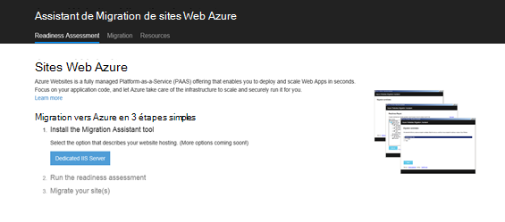

2.  Installer l’Assistant Migration de Web Apps en cliquant sur le bouton **Dédié un serveur IIS** . Plus d’options seront les options dans un avenir proche. 
4.  Cliquez sur le bouton de **l’Outil d’installation** pour installer l’Assistant Migration de Web Apps sur votre ordinateur.

    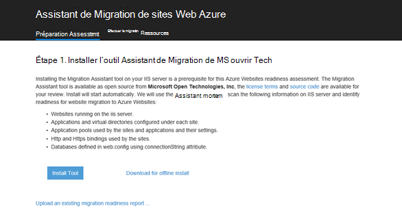

    >[AZURE.NOTE] Vous pouvez également cliquer sur **télécharger pour installer en mode hors connexion** pour télécharger un fichier ZIP pour l’installation sur les serveurs non connectés à internet. Ou bien, vous pouvez cliquer sur **charger un rapport de préparation de migration existant**, qui est une option avancée pour travailler avec un migration readiness rapport existant que vous avez généré précédemment (décrit ultérieurement).

5.  Dans l’écran **d’Installation de l’Application** , cliquez sur **installer** pour installer sur votre ordinateur. Il installe également les dépendances correspondantes comme déploiement Web, DacFX et IIS, si nécessaire. 

    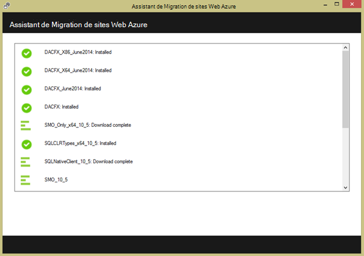

    Une fois installé, l’Assistant Migration de Web Apps démarre automatiquement.
  
6.  Cliquez sur **migrer les sites et les bases de données à partir d’un serveur distant vers Azure**. Entrez les informations d’identification d’administration pour le serveur distant, puis cliquez sur **Continuer**. 

    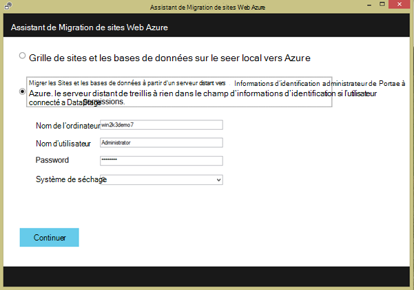

    Bien sûr, vous pouvez choisir de migrer à partir du serveur local. L’option remote est utile lorsque vous souhaitez effectuer la migration des sites Web à partir d’un serveur IIS de production.
 
    À ce stade d’inspecter l’outil de migration de la configuration de votre serveur IIS, tels que les Sites, les Applications, les Pools d’applications et les dépendances pour identifier les sites candidates pour la migration. 

8.  La capture d’écran ci-dessous montre les trois sites Web, **Site Web par défaut**, **TimeTracker**et **CommerceNet4**. Tous sont équipés d’une base de données associée que nous souhaitons migrer. Sélectionnez tous les sites que vous souhaitez évaluer et puis cliquez sur **suivant**.

    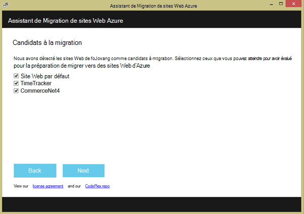
 
9.  Cliquez sur **Télécharger** pour télécharger le rapport de compatibilité. Si vous cliquez sur **Enregistrer le fichier localement**, vous pouvez exécuter l’outil de migration ultérieurement et charger l’état de préparation enregistré comme indiqué précédemment.

    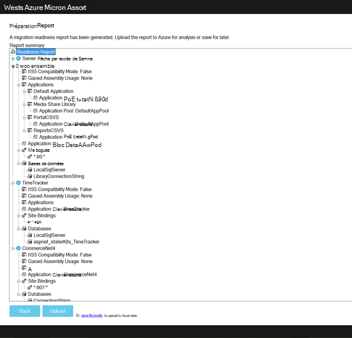
 
    Une fois que vous chargez l’état de préparation, Azure effectue une analyse de disponibilité et vous montre les résultats. Lire les informations d’évaluation pour chaque site Web et assurez-vous que vous comprenez ou avez résolu tous les problèmes avant de poursuivre. 
 
    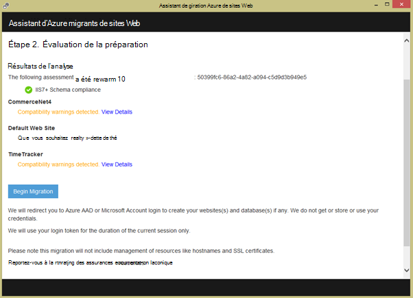

12. Cliquez sur **Commencer la Migration** pour démarrer la migration. Vous serez maintenant redirigé vers Azure pour vous connecter à votre compte. Il est important que vous ouvrez une session avec un compte qui possède un abonnement Azure. Si vous ne disposez pas d’un compte Azure puis vous pouvez vous inscrire pour un gratuit d’évaluation [ici](https://azure.microsoft.com/pricing/free-trial/?WT.srch=1&WT.mc_ID=SEM_). 

13. Sélectionnez le compte de clients, l’abonnement Azure et la région à utiliser pour vos bases de données et les applications web d’Azure migré, puis cliquez sur **Démarrer la Migration**. Vous pouvez sélectionner les sites Web à migrer ultérieurement.

    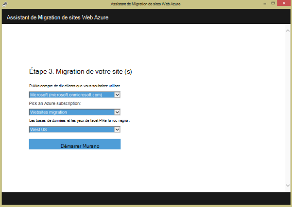

14. Sur l’écran suivant vous pouvez modifier les paramètres de migration par défaut, tels que :

    - utiliser une base de données de SQL Azure existante ou créer une nouvelle base de données de SQL Azure et configurer ses informations d’identification
    - Sélectionnez les sites Web à migrer
    - définir des noms pour les applications web Azure et leurs bases de données SQL liées
    - personnaliser les paramètres globales et au niveau du site

    La capture d’écran ci-dessous montre l’ensemble des sites Web sélectionnés pour la migration avec les paramètres par défaut.

    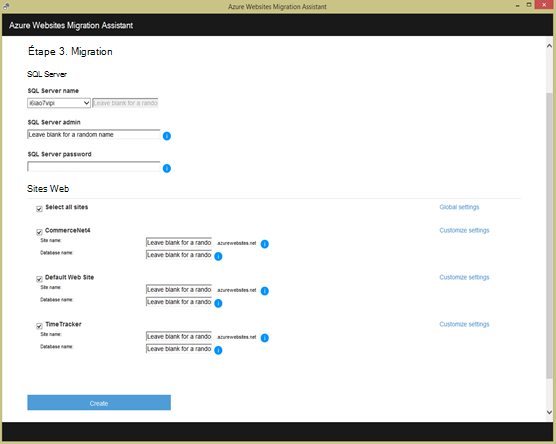

    >[AZURE.NOTE] la case à cocher **Activer Azure Active Directory** dans les paramètres personnalisés s’intègre à l’application web Azure avec [Azure Active Directory](active-directory-whatis.md) (le **Répertoire par défaut**). Pour plus d’informations sur Azure synchronisation Active Directory avec Active Directory sur site, reportez-vous à la section [intégration d’annuaire](http://msdn.microsoft.com/library/jj573653).

16.  Une fois que vous apportez toutes les modifications souhaitées, cliquez sur **créer** pour lancer le processus de migration. L’outil de migration crée la base de données de SQL Azure et Azure web app et publier le contenu du site Web et les bases de données. Progression de la migration est clairement indiquée dans l’outil de migration, et vous verrez un écran de résumé à la fin, les détails sur les sites migrés, si elles ont réussi, des liens vers les applications web de Azure nouvellement créée. 

    Si une erreur se produit lors de la migration, l’outil de migration clairement indique l’échec et le restaurer les modifications. Vous pourrez également envoyer le rapport directement à l’équipe d’ingénierie en cliquant sur le bouton **Envoyer le rapport d’erreur** , à la pile des appels capturée échec et créer le corps du message. 

    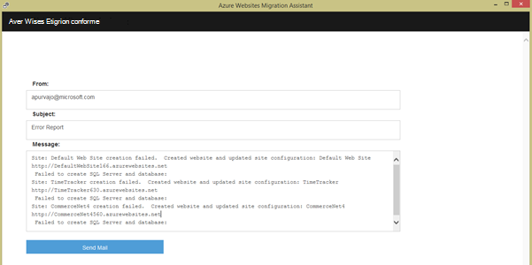

    Si migrer aboutit sans erreur, vous pouvez également cliquer sur le bouton de **Donner un Feedback** pour soumettre vos commentaires directement. 
 
20. Cliquez sur les liens pour les applications web Azure et vérifier que la migration a réussi.

21. Vous pouvez désormais gérer les applications web migrées dans le Service d’application Azure. Pour ce faire, connectez-vous au [Portail Azure](https://portal.azure.com).

22. Dans le portail d’Azure, ouvrez la blade d’applications Web pour visualiser vos sites migrés (indiqué comme les applications web), puis cliquez sur un d'entre eux pour commencer à gérer l’application web, tels que la configuration de la publication continue, création de sauvegardes, autoscaling et analyse l’utilisation ou les performances.

    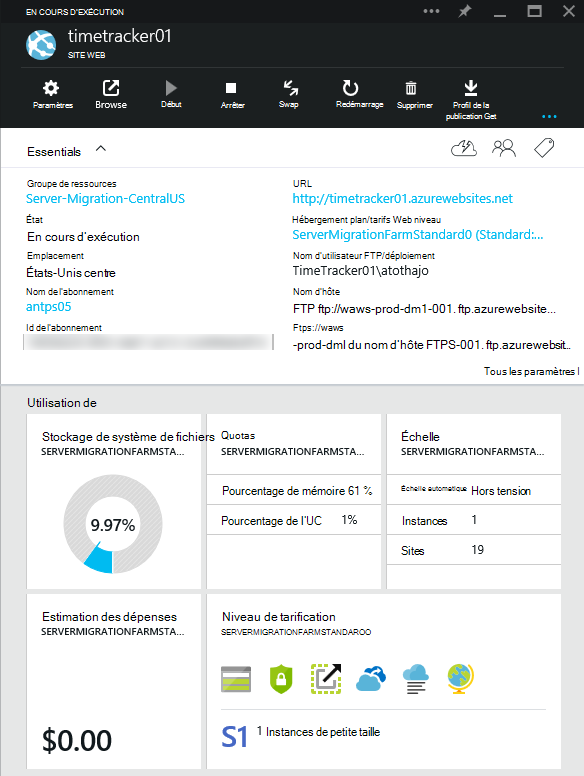

>[AZURE.NOTE] Si vous souhaitez commencer avec le Service d’application Azure avant l’ouverture d’un compte Azure, accédez à [Essayer le Service application](http://go.microsoft.com/fwlink/?LinkId=523751), où vous pouvez créer une application web de courte durée starter immédiatement dans le Service d’application. Aucune carte de crédit obligatoire ; aucun des engagements.

## Ce qui a changé
* Pour obtenir un guide pour la modification de sites Web au Service de l’application voir : [Service d’application Azure et son Impact sur les Services Azure existants](http://go.microsoft.com/fwlink/?LinkId=529714)
 
