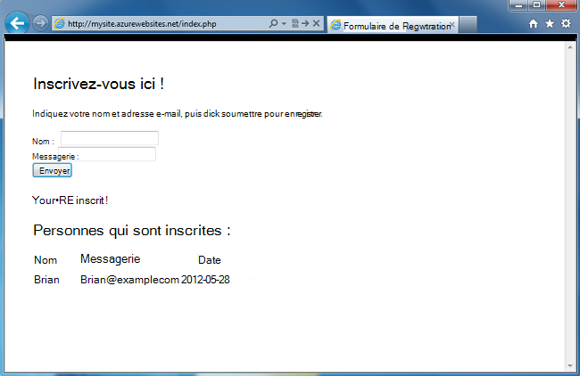
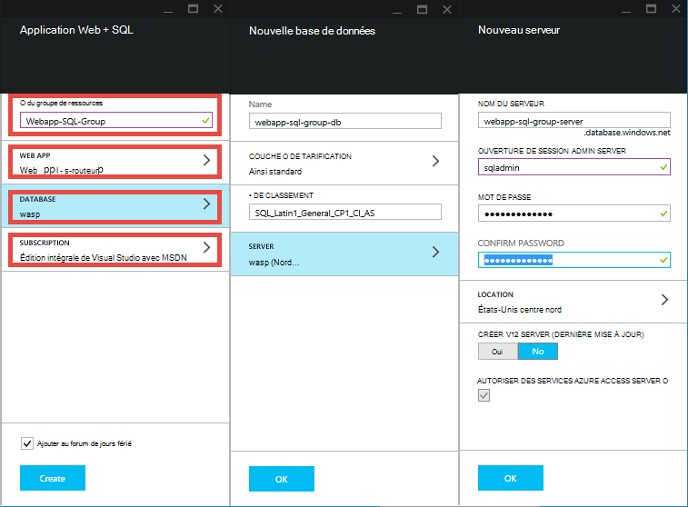
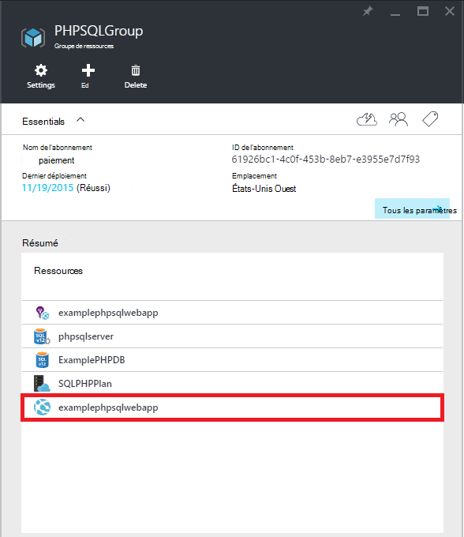
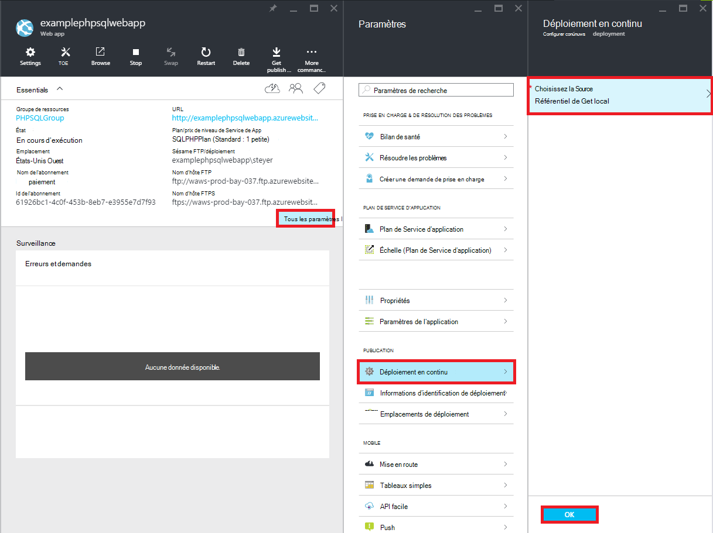
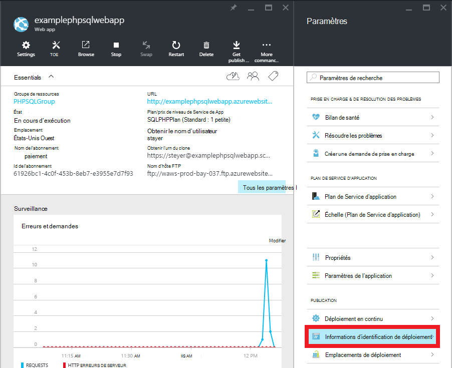
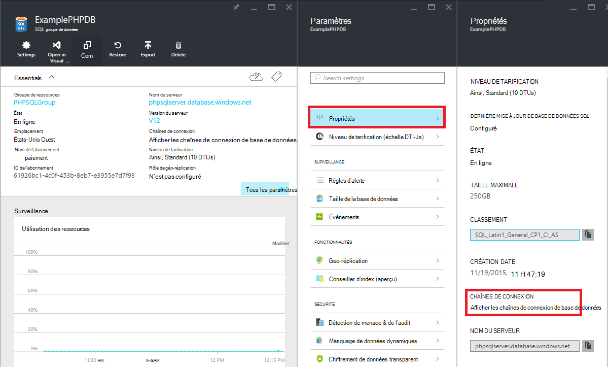

<properties 
    pageTitle="Créer une application web de PHP-SQL et le déployer vers le Service d’application Azure à l’aide de Git" 
    description="Un didacticiel qui montre comment créer une application web PHP qui stocke les données dans la base de données de SQL Azure et utiliser le déploiement Git au Service d’application Azure." 
    services="app-service\web, sql-database" 
    documentationCenter="php" 
    authors="rmcmurray" 
    manager="wpickett" 
    editor=""/>

<tags 
    ms.service="app-service-web" 
    ms.workload="web" 
    ms.tgt_pltfrm="na" 
    ms.devlang="PHP" 
    ms.topic="article" 
    ms.date="08/11/2016" 
    ms.author="robmcm"/>

# Créer une application web de PHP-SQL et le déployer vers le Service d’application Azure à l’aide de Git

Ce didacticiel vous montre comment créer une application web PHP dans le [Service d’application Azure](http://go.microsoft.com/fwlink/?LinkId=529714) qui se connecte à la base de données de SQL Azure et comment le déployer à l’aide de Git. Ce didacticiel suppose que vous avez [PHP][install-php], [De SQL Server Express][install-SQLExpress], les [Pilotes Microsoft SQL Server pour PHP](http://www.microsoft.com/download/en/details.aspx?id=20098)et [Git] [ install-git] installé sur votre ordinateur. À la fin de ce guide, vous disposerez d’une application web de PHP-SQL en cours d’exécution dans Azure.

> [AZURE.NOTE]
> Vous pouvez installer et configurer PHP, SQL Server Express et le Microsoft Drivers pour SQL Server pour PHP à l’aide [Microsoft Web Platform Installer](http://www.microsoft.com/web/downloads/platform.aspx).

Vous allez apprendre :

* Comment créer une application web Azure et une base de données SQL à l’aide du [Portail Azure](http://go.microsoft.com/fwlink/?LinkId=529715). Par défaut, PHP est activé dans l’application de Service Web Apps, rien de spécial est tenu d’exécuter votre code PHP.
* Comment publier et publier à nouveau votre application Azure à l’aide de Git.
 
En suivant ce didacticiel, vous allez générer une application web de simple inscription dans PHP. L’application sera hébergée dans un site Web d’Azure. Une capture d’écran de l’application terminée est inférieure à :

[AZURE.INCLUDE [create-account-and-websites-note](../../includes/create-account-and-websites-note.md)]

>[AZURE.NOTE] Si vous souhaitez commencer avec le Service d’application Azure avant l’ouverture d’un compte Azure, accédez à [Essayer le Service application](http://go.microsoft.com/fwlink/?LinkId=523751), où vous pouvez créer une application web de courte durée starter immédiatement dans le Service d’application. Aucune carte de crédit obligatoire ; aucun des engagements.

##Créer une application web Azure et paramétrer la publication Git

Suivez ces étapes pour créer une application web Azure et une base de données SQL :

1. Connectez-vous au [portail Azure](https://portal.azure.com/).

2. Ouvrir l’Azure Marketplace en cliquant sur l’icône **Nouveau** dans la partie supérieure gauche du tableau de bord, cliquez sur **Sélectionner tout** en regard de marché et en sélectionnant **Web + Mobile**.
    
3. Sur le marché, sélectionnez **Web + Mobile**.

4. Cliquez sur l’icône de **l’application Web + SQL** .

5. Après avoir lu la description de l’application Web + SQL app, sélectionnez **créer**.

6. Cliquez sur chaque partie (**Groupe de ressources**, **Application Web**, **base de données**et **d’abonnement**) et entrez ou sélectionnez des valeurs pour les champs obligatoires :
    
    - Entrez un nom d’URL de votre choix.   
    - Configurer les informations d’identification du serveur de base de données
    - Sélectionnez la région plus proche de vous

    

7. Lorsque vous avez terminé la définition de l’application web, cliquez sur **créer**.

    Lorsque l’application web a été créée, le bouton **Notifications** clignote en vert **Réussite** et la lame de groupe de ressources ouvrir pour afficher l’application web et la base de données SQL dans le groupe.

4. Cliquez sur l’icône de l’application web dans la lame de groupe de ressources pour ouvrir la lame de l’application web.

    

5. Dans **paramètres** , cliquez sur **déploiement continue** > **configurer les paramètres requis**. Sélectionnez **Le référentiel Git Local** et cliquez sur **OK**.

    

    Si vous n’avez pas défini un référentiel Git avant, vous devez fournir un nom d’utilisateur et le mot de passe. Pour ce faire, cliquez sur **paramètres** > **informations d’identification du déploiement** de lame de l’application web.

    

6. Dans **paramètres** , cliquez sur **Propriétés** pour afficher l’URL à distance Git vous devez utiliser pour déployer votre application PHP ultérieurement.

##Obtenir des informations de connexion de base de données SQL

Pour vous connecter à l’instance de base de données SQL liée à votre application web, votre avez besoin les informations de connexion que vous avez spécifiée lorsque vous avez créé la base de données. Pour obtenir les informations de connexion de base de données SQL, procédez comme suit :

1. Dans les lames du groupe ressources, cliquez sur l’icône de la base de données SQL.

2. Dans les lames de la base de données SQL, cliquez sur **paramètres** > **Propriétés**, puis cliquez sur **Afficher les chaînes de connexion de base de données**. 

    
    
3. Dans la section **PHP** de la boîte de dialogue, notez les valeurs de `Server`, `SQL Database`, et `User Name`. Vous utiliserez ces valeurs ultérieurement lors de la publication de votre application de web PHP au Service d’application Azure.

##Générer et tester votre application localement

La demande d’enregistrement est une simple application PHP qui permet de vous inscrire pour un événement en fournissant votre nom et adresse e-mail. Informations inscrites précédents s’affiche dans un tableau. Informations d’enregistrement sont stockées dans une instance de base de données SQL. L’application se compose de deux fichiers (code de copier/coller ci-dessous) :

* **index.php**: affiche un formulaire pour l’enregistrement et une table contenant des informations de l’abonné.
* **CreateTable.php**: crée la table de base de données SQL pour l’application. Ce fichier seulement sera utilisé qu’une seule fois.

Pour exécuter l’application localement, suivez les étapes ci-dessous. Notez que ces étapes supposent que vous avez PHP et SQL Server Express est configuré sur votre ordinateur local, et que vous avez activé l' [extension PDO pour SQL Server][pdo-sqlsrv].

1. Créer une base de données SQL Server appelé `registration`. Vous pouvez le faire à partir de la `sqlcmd` invite de commandes avec ces commandes :

        >sqlcmd -S localhost\sqlexpress -U <local user name> -P <local password>
        1> create database registration
        2> GO   

2. Dans le répertoire racine de votre application, créez deux fichiers : une appelée `createtable.php` et l’autre appelé `index.php`.

3. Ouvrir le `createtable.php` de fichiers dans un éditeur de texte ou un IDE et ajoutez le code ci-dessous. Ce code sera utilisé pour créer le `registration_tbl` la table dans le `registration` base de données.

        <?php
        // DB connection info
        $host = "localhost\sqlexpress";
        $user = "user name";
        $pwd = "password";
        $db = "registration";
        try{
            $conn = new PDO( "sqlsrv:Server= $host ; Database = $db ", $user, $pwd);
            $conn->setAttribute( PDO::ATTR_ERRMODE, PDO::ERRMODE_EXCEPTION );
            $sql = "CREATE TABLE registration_tbl(
            id INT NOT NULL IDENTITY(1,1) 
            PRIMARY KEY(id),
            name VARCHAR(30),
            email VARCHAR(30),
            date DATE)";
            $conn->query($sql);
        }
        catch(Exception $e){
            die(print_r($e));
        }
        echo "<h3>Table created.</h3>";
        ?>

    Notez que vous devez mettre à jour les valeurs de <code>$user</code> et <code>$pwd</code> avec votre nom d’utilisateur SQL Server local et le mot de passe.

4. Dans un terminal dans le répertoire racine de l’application, tapez la commande suivante :

        php -S localhost:8000

4. Ouvrez un navigateur web et accédez à **http://localhost:8000/createtable.php**. Cette opération va créer le `registration_tbl` la table dans la base de données.

5. Ouvrez le fichier **index.php** dans un éditeur de texte ou un IDE et ajouter le code HTML et CSS de base pour la page (le code PHP sera ajouté dans les étapes suivantes).

        <html>
        <head>
        <Title>Registration Form</Title>
        
        </head>
        <body>
        <h1>Register here!</h1>
        
Fill in your name and email address, then click <strong>Submit</strong> to register.

        <form method="post" action="index.php" enctype="multipart/form-data" >
              Name  <input type="text" name="name" id="name"/> 
              Email <input type="text" name="email" id="email"/> 
              <input type="submit" name="submit" value="Submit" />
        </form>
        <?php

        ?>
        </body>
        </html>

6. Dans les balises PHP, ajoutez du code PHP pour la connexion à la base de données.

        // DB connection info
        $host = "localhost\sqlexpress";
        $user = "user name";
        $pwd = "password";
        $db = "registration";
        // Connect to database.
        try {
            $conn = new PDO( "sqlsrv:Server= $host ; Database = $db ", $user, $pwd);
            $conn->setAttribute( PDO::ATTR_ERRMODE, PDO::ERRMODE_EXCEPTION );
        }
        catch(Exception $e){
            die(var_dump($e));
        }

    À nouveau, vous devez mettre à jour les valeurs de <code>$user</code> et <code>$pwd</code> avec votre nom d’utilisateur MySQL local et le mot de passe.

7. Selon le code de connexion de base de données, ajoutez du code pour insérer des informations d’inscription dans la base de données.

        if(!empty($_POST)) {
        try {
            $name = $_POST['name'];
            $email = $_POST['email'];
            $date = date("Y-m-d");
            // Insert data
            $sql_insert = "INSERT INTO registration_tbl (name, email, date) 
                           VALUES (?,?,?)";
            $stmt = $conn->prepare($sql_insert);
            $stmt->bindValue(1, $name);
            $stmt->bindValue(2, $email);
            $stmt->bindValue(3, $date);
            $stmt->execute();
        }
        catch(Exception $e) {
            die(var_dump($e));
        }
        echo "<h3>Your're registered!</h3>";
        }

8. Enfin, après le code précédent, ajoutez du code pour récupérer des données à partir de la base de données.

        $sql_select = "SELECT * FROM registration_tbl";
        $stmt = $conn->query($sql_select);
        $registrants = $stmt->fetchAll(); 
        if(count($registrants) > 0) {
            echo "<h2>People who are registered:</h2>";
            echo "<table>";
            echo "<tr><th>Name</th>";
            echo "<th>Email</th>";
            echo "<th>Date</th></tr>";
            foreach($registrants as $registrant) {
                echo "<tr><td>".$registrant['name']."</td>";
                echo "<td>".$registrant['email']."</td>";
                echo "<td>".$registrant['date']."</td></tr>";
            }
            echo "</table>";
        } else {
            echo "<h3>No one is currently registered.</h3>";
        }

Vous pouvez maintenant accéder à **http://localhost:8000/index.php** pour tester l’application.

##Publication de votre application.

Après avoir testé votre application localement, vous pouvez le publier à l’application de Service Web Apps à l’aide de Git. Toutefois, vous devez tout d’abord mettre à jour les informations de connexion de base de données dans l’application. En utilisant les informations de connexion de base de données que vous avez obtenu précédemment (dans la section **informations de connexion d’obtenir une base de données SQL** ), de mettre à jour les informations suivantes dans **à la fois** la `createdatabase.php` et `index.php` les fichiers avec les valeurs appropriées :

    // DB connection info
    $host = "tcp:<value of Server>";
    $user = "<value of User Name>";
    $pwd = "<your password>";
    $db = "<value of SQL Database>";

> [AZURE.NOTE]
> Dans le <code>$host</code>, la valeur du serveur doit être précédée de <code>tcp:</code>.

Maintenant, vous êtes prêt à configurer la publication Git et publier l’application.

> [AZURE.NOTE]
> Il s’agit de la même procédure que notée la fin de la section **créer une application web Azure et paramétrer la publication Git** ci-dessus.

1. Ouvrez GitBash (ou un terminal, se Git dans votre `PATH`), changez les répertoires pour le répertoire racine de votre application (le répertoire **d’enregistrement** ) et exécutez les commandes suivantes :

        git init
        git add .
        git commit -m "initial commit"
        git remote add azure [URL for remote repository]
        git push azure master

    Vous demandera le mot de passe que vous avez créé précédemment.

2. Accédez à **http://[web application name].azurewebsites.net/createtable.php** pour créer la table de base de données SQL pour l’application.
3. Accédez à **http://[web application name].azurewebsites.net/index.php** pour commencer à utiliser l’application.

Après la publication de votre application, vous pouvez apporter des modifications à celui-ci et Git permet de les publier. 

##Publier les modifications apportées à votre application

Pour publier les modifications apportées à l’application, procédez comme suit :

1. Apporter des modifications à votre application localement.
2. Ouvrez GitBash (ou un terminal, informatique Git est dans votre `PATH`), changez les répertoires pour le répertoire racine de votre application et exécutez les commandes suivantes :

        git add .
        git commit -m "comment describing changes"
        git push azure master

    Vous demandera le mot de passe que vous avez créé précédemment.

3. Accédez à **http://[web application name].azurewebsites.net/index.php** pour voir vos modifications.

## Ce qui a changé
* Pour obtenir un guide pour la modification de sites Web au Service de l’application voir : [Service d’application Azure et son Impact sur les Services Azure existants](http://go.microsoft.com/fwlink/?LinkId=529714)

[install-php]: http://www.php.net/manual/en/install.php
[install-SQLExpress]: http://www.microsoft.com/download/details.aspx?id=29062
[install-Drivers]: http://www.microsoft.com/download/details.aspx?id=20098
[install-git]: http://git-scm.com/
[pdo-sqlsrv]: http://php.net/pdo_sqlsrv
 
