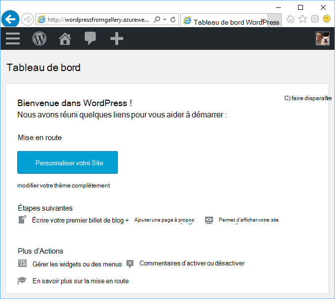
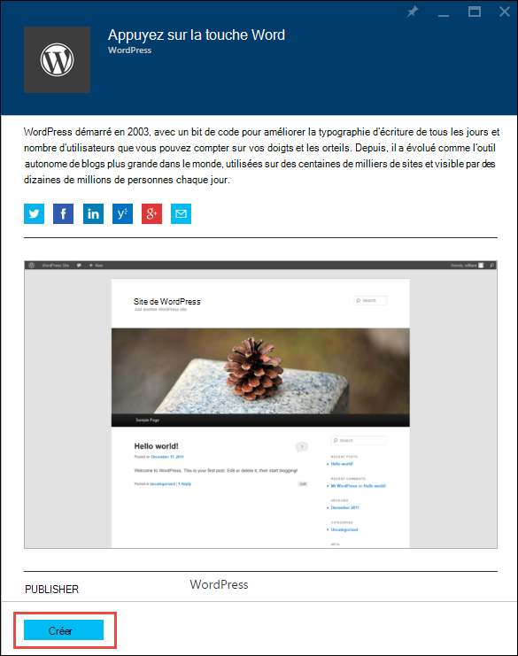
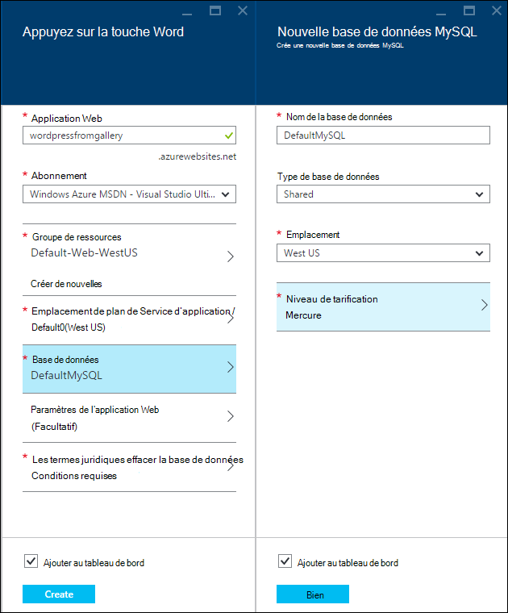
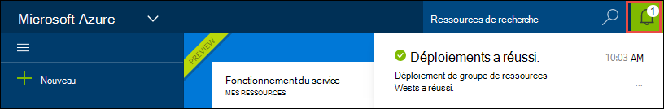
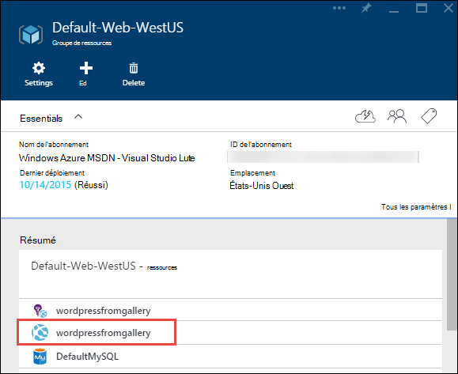
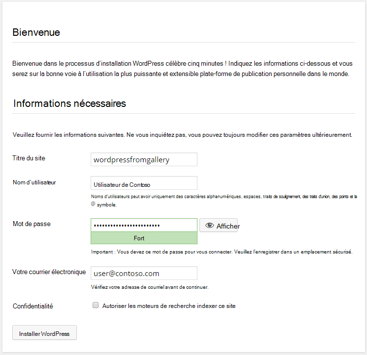

<properties
    pageTitle="Créer une application web de WordPress dans le Service d’application Azure | Microsoft Azure"
    description="Apprenez à créer une nouvelle application web Azure pour un blog WordPress via le portail d’Azure."
    services="app-service\web"
    documentationCenter="php"
    authors="rmcmurray"
    manager="wpickett"
    editor=""/>

<tags
    ms.service="app-service-web"
    ms.workload="na"
    ms.tgt_pltfrm="na"
    ms.devlang="PHP"
    ms.topic="hero-article"
    ms.date="08/11/2016"
    ms.author="robmcm"/>

# Créer une application web de WordPress dans le Service d’application Azure

[AZURE.INCLUDE [tabs](../../includes/app-service-web-get-started-nav-tabs.md)]

Ce didacticiel explique comment déployer un site de blog WordPress à partir du marché Azure.

Lorsque vous avez terminé avec le didacticiel, vous aurez votre propre site de blog WordPress haut et s’exécutant dans le nuage.

Vous apprendrez à :

* Comment rechercher un modèle d’application sur le marché d’Azure.
* Comment créer une application web dans le Service d’application Azure qui est basé sur le modèle.
* Comment faire pour configurer les paramètres de Service d’application Azure pour la nouvelle application web et la base de données.

Le marché Azure met à disposition un large éventail d’applications web populaire développé par Microsoft, des entreprises tierces et initiatives de logiciels open source. Les applications web sont construites sur une large gamme de structures répandues, telles que [PHP](/develop/nodejs/) dans ce WordPress exemple [.NET](/develop/net/), [Node.js](/develop/nodejs/), [Java](/develop/java/)et [Python](/develop/python/), pour ne citer. Pour créer une application web à partir du marché Azure le seul logiciel dont vous avez besoin est le navigateur que vous utilisez pour le [Portail Azure](https://portal.azure.com/). 

Le site de WordPress que vous déployez dans ce didacticiel utilise MySQL pour la base de données. Si vous souhaitez utiliser à la place de la base de données SQL pour la base de données, reportez-vous à la section [Nami du projet](http://projectnami.org/). **Nami de projet** est également disponible via le Marketplace.

> [AZURE.NOTE]
> Pour terminer ce didacticiel, vous avez besoin d’un compte Microsoft Azure. Si vous n’avez pas un compte, vous pouvez [activer vos avantages d’abonné de Visual Studio](/pricing/member-offers/msdn-benefits-details/?WT.mc_id=A261C142F) , ou [Inscrivez-vous pour un essai gratuit](/en-us/pricing/free-trial/?WT.mc_id=A261C142F).
>
> Si vous souhaitez commencer avec le Service d’application Azure avant de vous inscrivez pour un compte Azure, accédez à [Essayer le Service application](http://go.microsoft.com/fwlink/?LinkId=523751). Vous pouvez créer une application web de courte durée starter immédiatement dans le Service d’application : aucune carte de crédit requise et aucun des engagements.

## Sélectionnez WordPress et configurer le service d’application Azure

1. Connectez-vous au [portail Azure](https://portal.azure.com/).

2. Cliquez sur **Nouveau**.
    
    ![Créer de nouvelles][5]
    
3. Recherchez **WordPress**, puis cliquez sur **WordPress**. Si vous souhaitez utiliser de la base de données SQL au lieu de MySQL, recherchez le **Projet Nami**.

    ![WordPress à partir de la liste][7]
    
5. Après avoir lu la description de l’application WordPress, cliquez sur **créer**.

    

4. Entrez un nom pour l’application web dans la zone de **l’application Web** .

    Ce nom doit être unique dans le domaine azurewebsites.net, car l’URL de l’application web sera {nom}. azurewebsites.net. Si le nom que vous entrez n’est pas unique, un point d’exclamation rouge s’affiche dans la zone de texte.

8. Si vous avez plus d’un abonnement, cliquez sur celui que vous souhaitez utiliser. 

5. Sélectionnez un **Groupe de ressources** ou créez-en un nouveau.

    Pour plus d’informations sur les groupes de ressources, consultez [vue d’ensemble du Gestionnaire de ressources Azure](../azure-resource-manager/resource-group-overview.md).

5. Sélectionnez un **Emplacement de plan de Service** d’application/ou créez-en un nouveau.

    Pour plus d’informations sur les plans de Service d’application, consultez [vue d’ensemble des plans de Service d’application Azure](../azure-web-sites-web-hosting-plans-in-depth-overview.md) 

7. Cliquez sur la **base de données**et ensuite dans la **Nouvelle base de données MySQL** lame fournir les valeurs requises pour la configuration de votre base de données MySQL.

    une barre d’outils. Entrez un nouveau nom ou laissez le nom par défaut.

    b. Laissez le **Type base de données** **partagée**.

    c. Choisissez le même emplacement que celui que vous avez choisi pour l’application web.

    d. Choisissez un niveau de tarification. Mercure (disponible avec les connexions autorisées minimales et l’espace disque) est parfait pour ce didacticiel.

8. Dans la **Nouvelle base de données MySQL** lame, cliquez sur **OK**. 

8. Dans la lame **WordPress** , accepter les conditions juridiques et puis cliquez sur **créer**. 

    

    Service d’application Azure crée l’application web, généralement en moins d’une minute. Vous pouvez surveiller la progression en cliquant sur l’icône de la clochette en haut de la page du portail.

    

## Lancer et gérer votre application de web WordPress
    
7. Lors de la création d’applications web est terminée, naviguer dans le portail Azure au groupe de ressources dans lequel vous avez créé l’application, et vous pouvez voir l’application web et la base de données.

    La ressource supplémentaire avec l’icône d’ampoule est [d’Idées d’Application](/services/application-insights/), qui fournit des services de surveillance pour votre application web.

1. Dans la lame du **groupe de ressources** , cliquez sur la ligne d’application web.

    

2. De la lame d’application Web, cliquez sur **Parcourir**.

    ![URL du site][browse]

3. Dans la page **Bienvenue** WordPress, entrez les informations de configuration requises par WordPress, puis cliquez sur **Installer un WordPress**.

    

4. Connectez-vous en utilisant les informations d’identification que vous avez créé sur la page **d’accueil** .  

5. Ouvre la page de tableau de bord de votre site.    

    

## Étapes suivantes

Vous avez vu comment créer et déployer une application web PHP à partir de la galerie. Pour plus d’informations sur l’utilisation de PHP dans Azure, consultez le [Centre pour développeurs PHP](/develop/php/).

Pour plus d’informations sur l’utilisation de l’application de Service Web Apps, consultez les liens sur le côté gauche de la page (pour les fenêtres du navigateur large) ou en haut de la page (pour les fenêtres du navigateur étroit). 

## Ce qui a changé
* Pour un guide pour la modification de sites Web au Service de l’application, voir [Service d’application Azure et son impact sur les Services Azure existants](http://go.microsoft.com/fwlink/?LinkId=529714).

[5]: ./media/web-sites-php-web-site-gallery/startmarketplace.png
[7]: ./media/web-sites-php-web-site-gallery/search-web-app.png
[browse]: ./media/web-sites-php-web-site-gallery/browse-web.png
