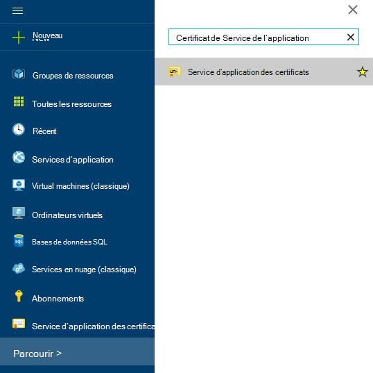
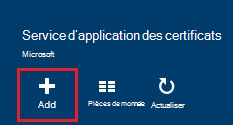
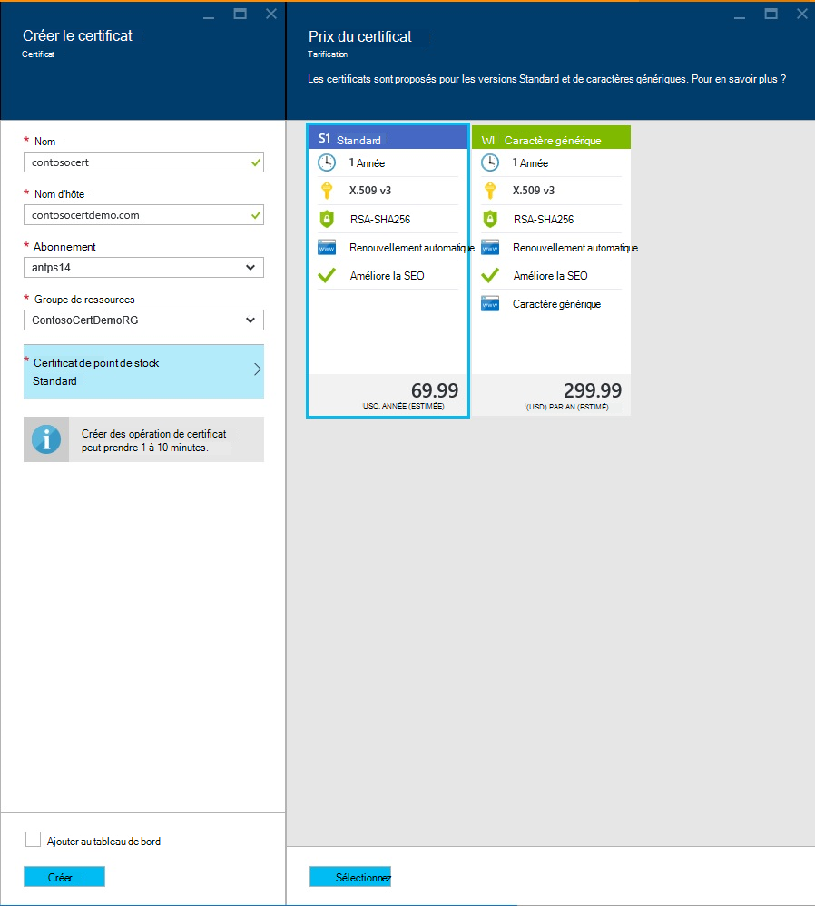
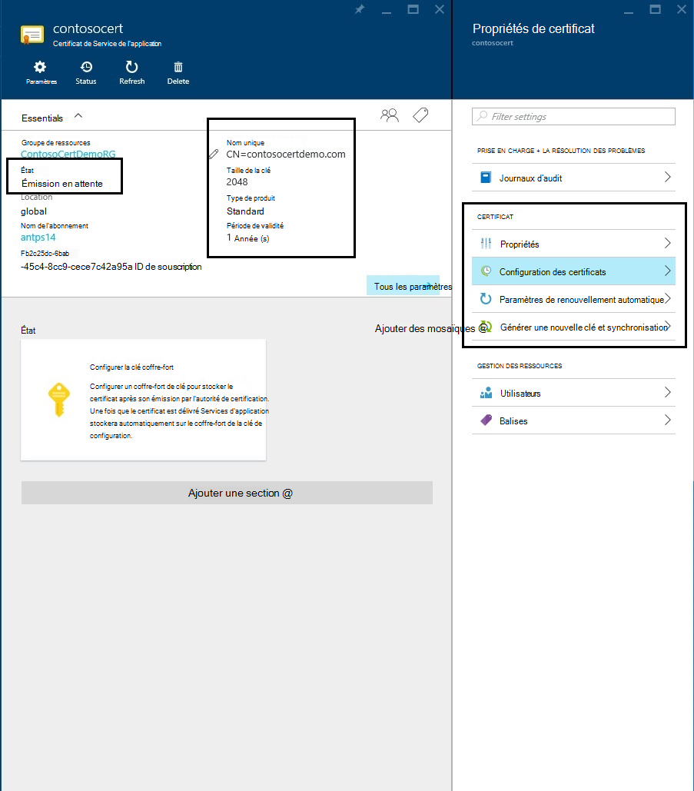
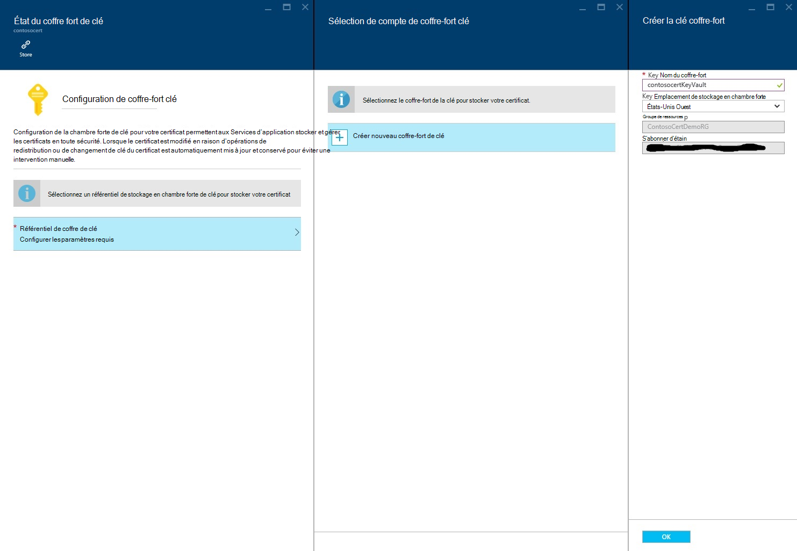
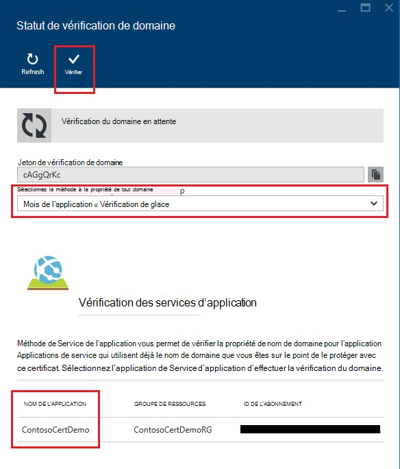
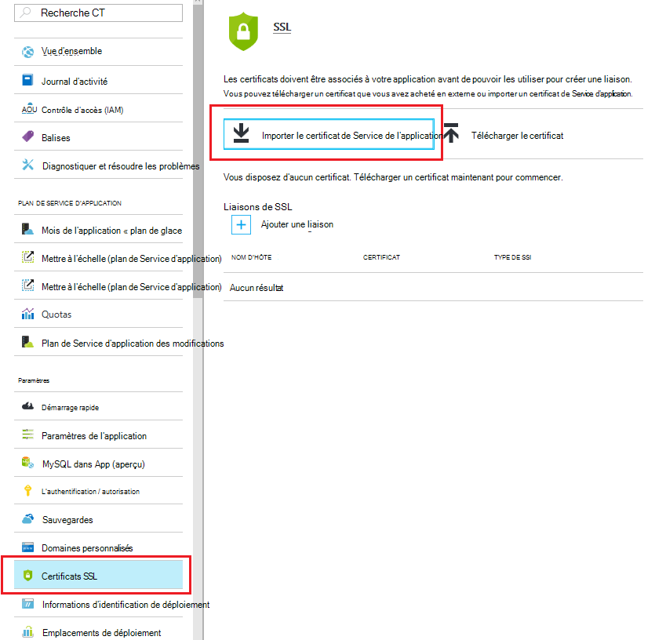
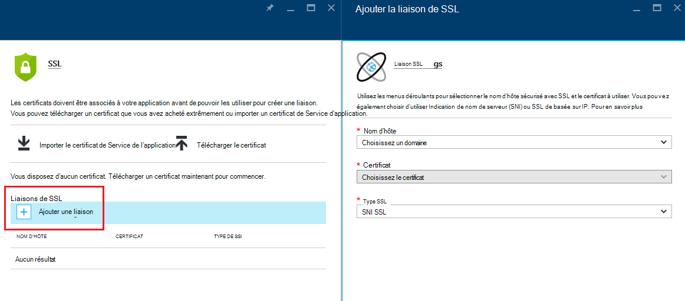
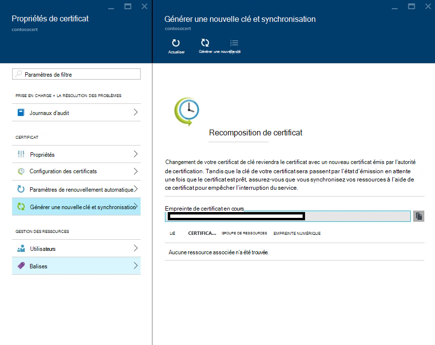

<properties
    pageTitle="Acheter et configurer un certificat SSL pour votre Service application Azure"
    description="Découvrez comment acheter et configurer un certificat SSL pour votre Service application Azure."
    services="app-service"
    documentationCenter=".net"
    authors="apurvajo"
    manager="stefsch"
    editor="cephalin"
    tags="buy-ssl-certificates"/>

<tags
    ms.service="app-service"
    ms.workload="na"
    ms.tgt_pltfrm="na"
    ms.devlang="na"
    ms.topic="article"
    ms.date="09/19/2016"
    ms.author="apurvajo"/>

#Acheter et configurer un certificat SSL pour votre Service application Azure

> [AZURE.SELECTOR]
- [Acheter le certificat SSL dans Azure](web-sites-purchase-ssl-web-site.md)
- [Utiliser un certificat SSL à partir d’un autre emplacement](web-sites-configure-ssl-certificate.md)

Par défaut, **[Service d’application Azure](http://go.microsoft.com/fwlink/?LinkId=529714)** permet déjà de HTTPS pour votre application web avec un certificat générique pour le *. azurewebsites.net domaine. Si vous ne souhaitez pas configurer un domaine personnalisé, vous pouvez bénéficier à partir du certificat HTTPS par défaut. Toutefois, comme tous les * [domaines génériques](https://casecurity.org/2014/02/26/pros-and-cons-of-single-domain-multi-domain-and-wildcard-certificates), il n’est pas aussi sûre que l’utilisation d’un domaine personnalisé avec votre propre certificat. Service d’application Azure fournit désormais un moyen vraiment simplifié d’acheter et de gérer un certificat SSL à partir d’Azure Portal sans jamais quitter le portail.  
Cet article explique comment faire pour acheter et configurer un certificat SSL pour votre **[Service d’application Azure](http://go.microsoft.com/fwlink/?LinkId=529714)** en 3 étapes simples. 

> [AZURE.NOTE]
> Impossible d’utiliser les certificats SSL pour les noms de domaine personnalisé avec des application web libre et partagé. Vous devez configurer votre application web pour le mode de base, Standard ou Premium, qui peut changer à combien vous êtes facturé pour votre abonnement. Pour plus d’informations, reportez-vous à la section **[Détails de tarification Web applications](https://azure.microsoft.com/pricing/details/web-sites/)** .

##Vue d’ensemble
> [AZURE.NOTE]
> N’essayez pas d’acheter un certificat SSL à l’aide d’un abonnement qui ne dispose pas d’une carte de crédit Active associée. Cela peut entraîner votre abonnement en cours de désactivation. 

##<a>Acheter, de stocker et d’attribuer un certificat SSL pour votre domaine personnalisé</a>
Pour activer HTTPS pour un domaine personnalisé, par exemple, contoso.com, vous devez d’abord ** [configurer un nom de domaine personnalisé dans le Service d’application Azure.](web-sites-custom-domain-name.md)**

Avant de demander un certificat SSL, vous devez d’abord déterminer les noms de domaine sont sécurisées par le certificat. Cela permet de déterminer quel type de certificat, vous devez obtenir. Si vous avez juste besoin de sécuriser un seul nom de domaine tel que contoso.com ou www.contoso.com Standard (de base) certificat est suffisante. Si vous avez besoin sécuriser plusieurs noms de domaine, par exemple contoso.com, www.contoso.com et mail.contoso.com, vous pouvez obtenir un [certificat générique](http://en.wikipedia.org/wiki/Wildcard_certificate) de ****

##Étape 0 : Place une commande de certificat SSL

Dans cette étape, vous allez apprendre à passer une commande pour un certificat SSL de votre choix.

1.  Dans le **[Portail Azure](https://portal.azure.com/)**, cliquez sur Parcourir et tapez « Certificats de Service application » dans la barre de recherche et sélectionnez « Certificats de Service App » à partir des résultats et cliquez sur Ajouter. 

    

    

2.  Entrez le **nom convivial** pour votre certificat SSL.

3.  Entrez le **nom d’hôte**
> [AZURE.NOTE]
    Il s’agit d’un des éléments plus essentiels du processus d’achat. Veillez à entrer un nom d’hôte correct (domaine personnalisé) que vous souhaitez protéger avec ce certificat. **Ne pas** ajouter le nom d’hôte WWW. Par exemple, si votre nom de domaine personnalisé est www.contoso.com puis saisissez contoso.com dans le champ nom d’hôte, le certificat en question protège à la fois www et du domaine racine. 
    
4.  Sélectionnez votre **abonnement**. 

    Si vous disposez de plusieurs abonnements, vérifiez que créer un certificat SSL dans le même abonnement que vous avez utilisé pour votre domaine personnalisé ou d’une application Web en question.
       
5.  Sélectionnez ou créez un **groupe de ressources**.

    Groupes de ressources vous permettent de gérer les ressources connexes Azure en tant qu’unité et sont utiles lors de l’établissement des règles de contrôle (RBAC) d’accès basé sur les rôles pour vos applications. Pour plus d’informations, consultez Gestion de vos ressources d’Azure.
     
6.  Sélectionnez le **certificat de point de stock** 

    Enfin, sélectionnez le certificat SKU qui correspond à vos besoins et cliquez sur Créer. Aujourd'hui, Azure Application Service vous permet d’acheter deux différentes références SKU • S1 – Standard avec validité de 1 an et renouvellement automatique des certificats  
           • W1 – certificats génériques avec renouvellement automatique et de la validité de 1 an      
    Pour plus d’informations, reportez-vous à la section **[Détails de tarification Web applications](https://azure.microsoft.com/pricing/details/web-sites/)** .

> [AZURE.NOTE]
> Création de certificat SSL peut durer de 1 à 10 minutes. Ce processus effectue plusieurs opérations en arrière-plan qui seraient autrement très difficiles à réaliser manuellement.  

##Étape 1 : Stocker le certificat dans le coffre-fort de clé Azure

Dans cette étape, vous allez apprendre à placer une banque un certificat SSL que vous avez achetées pour Azure chambre forte de clé de votre choix.

1.  Une fois l’achat du certificat SSL est terminée, vous devrez ouvrir manuellement la lame de **Certificats du Service application** ressource en parcourant à nouveau (voir étape 1 ci-dessus)   

    

    Vous remarquerez que l’état du certificat est **« en attente d’émission »** qu’il sont a quelques étapes plus, que vous devez effectuer avant de commencer à l’aide de certificats de ce.
 
2. Cliquez sur **« Configuration des certificats »** à l’intérieur de la lame de propriétés du certificat et cliquez sur **« étape 1 : banque d’informations »** pour stocker ce certificat dans Azure clé coffre-fort.

3.  Dans, cliquez **« état de coffre-fort clé »** lame sur **« référentiel de coffre-fort clé »** pour choisir un coffre-fort existant de la clé pour stocker ce certificat **ou « créer nouveau coffre-fort de clé »** pour créer le nouveau coffre-fort de clé à l’intérieur du même groupe de ressources et d’abonnement.
 
    
 
    > [AZURE.NOTE]
    Coffre-fort de clé Azure a des frais minimes pour le stockage de ce certificat. Pour plus d’informations, reportez-vous à la section **[Détails de tarification Azure clé de coffre-fort](https://azure.microsoft.com/pricing/details/key-vault/)** .

4. Une fois que vous avez sélectionné le référentiel de coffre-fort de clé pour stocker ce certificat dans, continuez et stockez-le en cliquant sur le bouton de **« Stockage »** en haut de la lame de le **« état du coffre-fort de clé »** .  

    Ceci doit terminer l’étape pour stocker le certificat que vous avez acheté avec Azure chambre forte de clé de votre choix. Lors de l’actualisation de la lame, vous devriez voir vert vérifier marquer contre cette étape ainsi.
    
##Étape 2 : Vérification de l’appartenance de domaine

Dans cette étape, vous allez apprendre à procéder à la vérification de propriété de domaine d’un certificat SSL qui vous venez de placer une commande pour. 

1.  Cliquez sur **« étape 2 : vérifier »** étape à partir de la Blade de **« Configuration de certificat »** . Il existe 4 types de domaine pris en charge par l’application de Service de certificats de vérification.

    * **Vérification des services d’application** 
    
        * C’est le processus plus pratique si vous avez déjà **votre domaine personnalisé attribué pour les applications de Service de l’application.** Cette méthode affiche la liste des toutes les applications de Service d’application qui répondent à ce critère. 
           Par exemple, dans ce cas, **contosocertdemo.com** est un domaine personnalisé attribué à l’application de Service d’application appelé **« ContosoCertDemo »** et, par conséquent, c’est la seule application de Service d’application répertoriés ici. S’il y a plusieurs région déploiement, puis il serait répertorier tous les régions.
        
           La méthode de vérification est uniquement disponible pour les achats d’un certificat (de base) Standard. Pour les certificats génériques, veuillez ignorer et passer à l’option B, C ou D ci-dessous.
        * Cliquez sur le bouton **« Vérifier »** pour terminer cette étape.
        * Cliquez sur **« Actualiser »** pour mettre à jour l’état de certificat une fois la vérification terminée. Il peut prendre quelques minutes pour terminer la vérification.
        
             

    * **Vérification de domaine** 

        * C’est le processus plus pratique **que si** vous avez **[acheté votre domaine personnalisé à partir du Service d’application Azure.](custom-dns-web-site-buydomains-web-app.md)**
        
        * Cliquez sur le bouton **« Vérifier »** pour terminer cette étape.
        
        * Cliquez sur **« Actualiser »** pour mettre à jour l’état de certificat une fois la vérification terminée. Il peut prendre quelques minutes pour terminer la vérification.

    * **Vérification de messagerie**
        
        * Courrier électronique de vérification a déjà été envoyé aux adresses E-mail associé à ce domaine personnalisé.
         
        * Ouvrez le courrier électronique et cliquez sur le lien de vérification pour terminer l’étape de vérification de messagerie. 
        
        * Si vous avez besoin de renvoyer le message de vérification, cliquez sur le bouton **« renvoyer du courrier électronique »** .
         
    * **Vérification manuelle**    
                 
        1. **Vérification de Page Web HTML**
        
            * Créez un fichier HTML nommé **{Jeton vérification domaine}**.html (vous pouvez copier le jeton il lame de statut de vérification de domaine)
            
            * Le contenu de ce fichier doit être exactement le même nom de **Jeton de vérification de domaine**.
            
            * Télécharger ce fichier à la racine du serveur web hébergeant votre domaine.
            
            * Cliquez sur **« Actualiser »** pour mettre à jour l’état de certificat une fois la vérification terminée. Il peut prendre quelques minutes pour terminer la vérification.
            
            Par exemple, si vous achetez un certificat standard pour contosocertdemo.com avec le jeton de vérification de domaine **'cAGgQrKc'** une requête web pour **'http://contosocertdemo.com/cAGgQrKc.html'** doit retourner **cAGgQrKc.**
        2. **Vérification d’enregistrement TXT DNS**

            * Utiliser le Gestionnaire DNS, créer un enregistrement TXT sur le sous-domaine **'DZC'** avec une valeur égale à la **vérification de domaine jeton.**
            
            * Cliquez sur **« Actualiser »** pour mettre à jour l’état de certificat une fois la vérification terminée. Il peut prendre quelques minutes pour terminer la vérification.
                              
            Par exemple, pour exécuter la validation d’un certificat générique avec le nom d’hôte ** \*. contosocertdemo.com** ou ** \*. subdomain.contosocertdemo.com** et **cAGgQrKc**de jetons de vérification de domaine, vous devez créer un enregistrement TXT sur dzc.contosocertdemo.com avec la valeur **cAGgQrKc.**     

##Étape 3 : Assigner un certificat à l’application de Service de l’application

Dans cette étape, vous allez apprendre à affecter ce nouvellement acheté certificat à vos applications de Service d’application. 

> [AZURE.NOTE]
> Avant d’effectuer les étapes de cette section, vous avez devez associé un nom de domaine personnalisé à votre application. Pour plus d’informations, reportez-vous à la section ** [configuration d’un nom de domaine personnalisé pour un web App.](web-sites-custom-domain-name.md)**

1.  Dans votre navigateur, ouvrez le ** [Azure Portal.](https://portal.azure.com/)**
2.  Cliquez sur l’option de **Service de l’application** sur le côté gauche de la page.
3.  Cliquez sur le nom de votre application à laquelle vous souhaitez attribuer ce certificat. 
4.  Dans la zone **paramètres**, cliquez sur **certificats SSL**
5.  Cliquez sur **Le certificat de Service d’application importer** et sélectionnez le certificat que vous venez d’acheter

    

6. Dans les **liaisons ssl** de la section, cliquez sur **Ajouter des liaisons**
7. De la lame **d’Ajouter la liaison SSL** utilisez les menus déroulants pour sélectionner le nom de domaine pour sécuriser avec SSL et le certificat à utiliser. Vous pouvez également choisir d’utiliser **[Indication de nom de serveur (SNI)](http://en.wikipedia.org/wiki/Server_Name_Indication)** ou SSL de basée sur IP.

    

       •    IP based SSL associates a certificate with a domain name by mapping the dedicated public IP address of the server to the domain name. This requires each domain name (contoso.com, fabricam.com, etc.) associated with your service to have a dedicated IP address. This is the traditional          method of associating SSL certificates with a web server.
       •    SNI based SSL is an extension to SSL and **[Transport Layer Security](http://en.wikipedia.org/wiki/Transport_Layer_Security)** (TLS) that allows multiple domains to share the same IP address, with separate security certificates for each domain. Most modern browsers (including Internet Explorer, Chrome, Firefox and Opera) support SNI, however older browsers may not support SNI. For more information on SNI, see the **[Server Name Indication](http://en.wikipedia.org/wiki/Server_Name_Indication)** article on Wikipedia.
       
7. Cliquez sur **Ajouter la liaison** pour enregistrer les modifications et activer SSL.

Si vous sélectionné **SSL de basée sur IP** , et votre domaine personnalisé est configuré à l’aide d’un enregistrement de, vous devez effectuer les étapes supplémentaires suivantes :

* Après avoir configuré une adresse IP en fonction de liaison SSL, une adresse IP dédiée est affectée à votre application. Vous trouverez cette adresse IP dans la page **domaine de personnalisé** sous les paramètres de votre application, juste au-dessus de la section de **noms d’hôtes** . Il sera répertorié comme **Adresse IP externe**
    
    

    Notez que cette adresse IP sera différente de l’adresse IP virtuelle utilisée précédemment pour configurer l’enregistrement A de votre domaine. Si vous avez configuré pour utiliser SNI basée SSL, ou ne sont pas configurés pour utiliser SSL, aucune adresse n’apparaît pour cette entrée.
    
2. À l’aide des outils fournis par votre registraire de nom de domaine, de modifier l’enregistrement de votre nom de domaine personnalisé pointer vers l’adresse IP à partir de l’étape précédente.
À ce stade, vous devez être en mesure de consulter votre application à l’aide de HTTPS:// au lieu de HTTP:// pour vérifier que le certificat a été configuré correctement.

##Recomposition et synchroniser le certificat

1. Pour des raisons de sécurité, si vous avez besoin de recomposition votre certificat puis simplement l’option **« recomposition et synchronisation »** de lame de **« Propriétés de certificat »** . 

2. Cliquez sur **« Recomposition »** pour lancer le processus. Ce processus peut prendre 1 à 10 minutes. 

    

3. Changement de votre certificat de clé reviendra le certificat avec un nouveau certificat émis par l’autorité de certification.
4. Vous ne sera pas débitée de la recomposition de la durée de vie du certificat. 
5. Changement de votre certificat de clé passe par l’état d’émission en attente. 
6. Une fois que le certificat est prêt, veillez à que vous synchronisez vos ressources à l’aide de ce certificat pour empêcher une interruption du service.
7. Option de synchronisation n’est pas disponible pour les certificats qui ne sont pas encore affectés à l’application Web. 

## Plus de ressources ##
- [Activer HTTPS pour une application dans Azure Application Service](web-sites-configure-ssl-certificate.md)
- [Acheter et configurer un nom de domaine personnalisé dans le Service d’application Azure](custom-dns-web-site-buydomains-web-app.md)
- [Centre de confidentialité de Microsoft Azure](/support/trust-center/security/)
- [Options de configuration déverrouillées dans des Sites Web Azure](http://azure.microsoft.com/blog/2014/01/28/more-to-explore-configuration-options-unlocked-in-windows-azure-web-sites/)
- [Portail de gestion Azure](https://manage.windowsazure.com)

>[AZURE.NOTE] Si vous souhaitez commencer avec le Service d’application Azure avant l’ouverture d’un compte Azure, accédez à [Essayer le Service application](http://go.microsoft.com/fwlink/?LinkId=523751), où vous pouvez créer une application web de courte durée starter immédiatement dans le Service d’application. Aucune carte de crédit obligatoire ; aucun des engagements.

