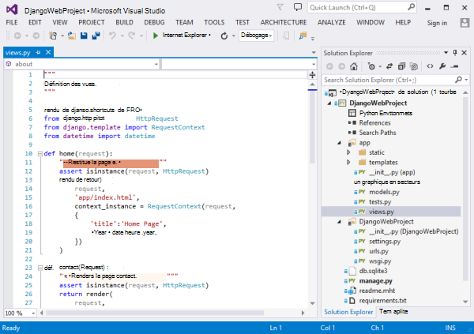
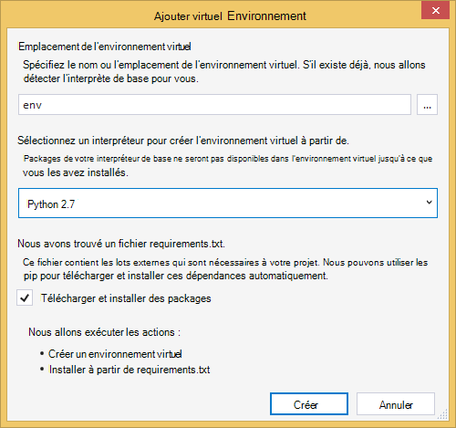
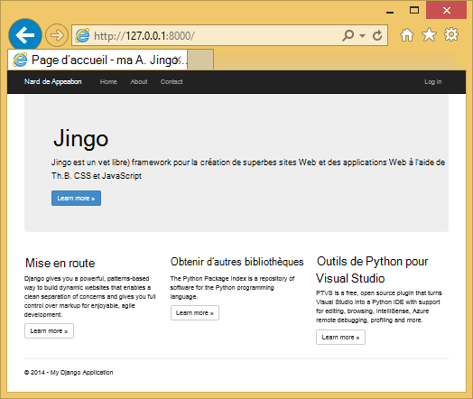
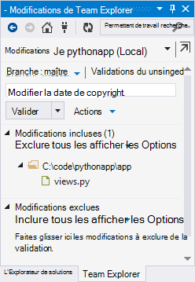
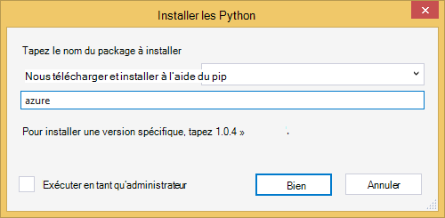
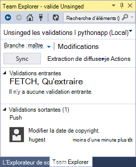
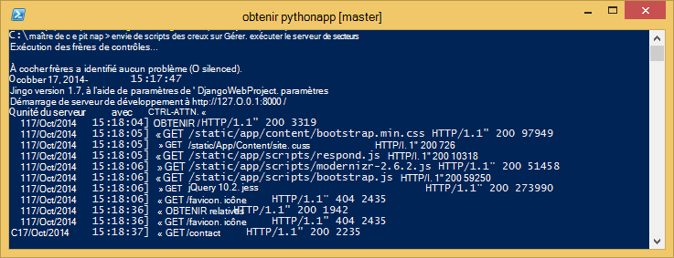
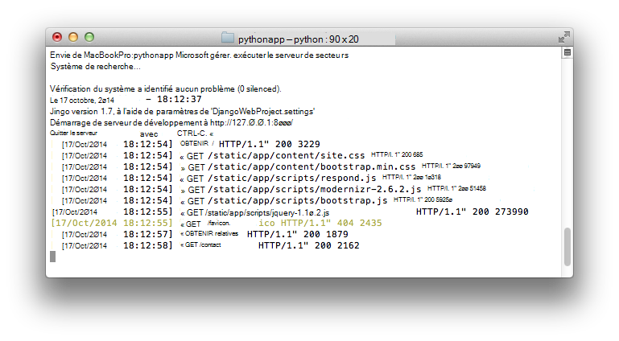

<properties
    pageTitle="Création d’applications web avec Django dans Azure"
    description="Un didacticiel qui présente à l’exécution d’une application web de Python dans Azure Application Service Web Apps."
    services="app-service\web"
    documentationCenter="python"
    tags="python"
    authors="huguesv" 
    manager="wpickett" 
    editor=""/>

<tags
    ms.service="app-service-web"
    ms.workload="web"
    ms.tgt_pltfrm="na"
    ms.devlang="python"
    ms.topic="hero-article" 
    ms.date="02/19/2016"
    ms.author="huvalo"/>

# Création d’applications web avec Django dans Azure

Ce didacticiel explique comment commencer à exécuter les Python sur [Azure Application Service Web Apps](http://go.microsoft.com/fwlink/?LinkId=529714). Web Apps offre d’hébergement gratuit limité et un déploiement rapide, et vous pouvez utiliser les Python ! Au fur et à mesure du votre application, vous pouvez passer à l’hébergement payé, et vous pouvez également intégrer avec tous les autres services Azure.

Vous allez créer une application à l’aide de l’infrastructure web Django (voir les autres versions de ce didacticiel pour [ballon](web-sites-python-create-deploy-flask-app.md) et [bouteille](web-sites-python-create-deploy-bottle-app.md)). Vous créer l’application web depuis le site Marketplace d’Azure, configurer le déploiement de Git et cloner le référentiel local. Puis vous exécutez l’application localement, apporter des modifications, valider et les dirige vers Azure. Ce didacticiel montre comment effectuer cette opération à partir de Windows ou de Mac/Linux.

[AZURE.INCLUDE [create-account-and-websites-note](../../includes/create-account-and-websites-note.md)]

>[AZURE.NOTE] Si vous souhaitez commencer avec le Service d’application Azure avant l’ouverture d’un compte Azure, accédez à [Essayer le Service application](http://go.microsoft.com/fwlink/?LinkId=523751), où vous pouvez créer une application web de courte durée starter immédiatement dans le Service d’application. Aucune carte de crédit obligatoire ; aucun des engagements.

## Conditions préalables

- Windows, Mac ou Linux
- Python 2.7 ou 3.4
- setuptools, pip, virtualenv (2,7 Python uniquement)
- GIT
- [Outils de Python pour Visual Studio][] (PTVS) - Remarque : cette option est facultative

**Remarque**: publication de TFS n’est actuellement pas prise en charge pour les projets de Python.

### Windows

Si vous ne disposez pas les Python 2.7 ou 3.4 installé (32 bits), nous vous recommandons d’installer [Azure SDK pour les Python 2.7] ou [Azure SDK pour les Python 3.4] , à l’aide de Web Platform Installer. Cette procédure installe la version 32 bits de Python, setuptools, pip, virtualenv, etc. (les Python de 32 bits est ce qui est installé sur les machines hôtes Azure). Vous pouvez également obtenir les Python à partir de [python.org].

Git, nous vous recommandons [Git pour Windows] ou [GitHub pour Windows]. Si vous utilisez Visual Studio, vous pouvez utiliser la prise en charge intégrée de Git.

Nous vous recommandons également d’installer [2.2 d’outils Python pour Visual Studio]. Cette étape est facultative, mais si vous disposez [De Visual Studio], y compris la libre 2013 de communauté de Visual Studio ou Visual Studio Express 2013 pour le Web, puis vous obtiendrez un remarquable IDE Python.

### Mac/Linux

Vous devez avoir les Python et Git déjà installé, mais vérifiez que vous avez les Python 2.7 ou 3.4.

## Création d’applications Web sur le portail

La première étape lors de la création de votre application consiste à créer l’application web via le [Portail Azure](https://portal.azure.com).

1. Connectez-vous au portail Azure et cliquez sur le bouton **Nouveau** dans le coin inférieur gauche.
3. Dans la zone Rechercher, tapez « python ».
4. Résultats de la recherche, sélectionnez **Django** (publié par PTVS), puis cliquez sur **créer**.
5. Configurez la nouvelle application Django, comme la création d’un nouveau plan de Service d’application et un nouveau groupe de ressources. Ensuite, cliquez sur **créer**.
6. Configurer la publication des Git pour votre application web nouvellement créé en suivant les instructions sur le [Déploiement de Git Local pour le Service d’application Azure](app-service-deploy-local-git.md).

## Vue d’ensemble de l’application

### Contenu du référentiel GIT

Voici une vue d’ensemble des fichiers que vous trouverez dans le référentiel Git initial, nous allons clone dans la section suivante.

    \app\__init__.py
    \app\forms.py
    \app\models.py
    \app\tests.py
    \app\views.py
    \app\static\content\
    \app\static\fonts\
    \app\static\scripts\
    \app\templates\about.html
    \app\templates\contact.html
    \app\templates\index.html
    \app\templates\layout.html
    \app\templates\login.html
    \app\templates\loginpartial.html
    \DjangoWebProject\__init__.py
    \DjangoWebProject\settings.py
    \DjangoWebProject\urls.py
    \DjangoWebProject\wsgi.py

Principales sources de l’application. Se compose de 3 pages (index, sur contact) avec une disposition maître. Les scripts et le contenu statique incluent les données d’amorçage, jquery, modernizr et répondre.

    \manage.py

Gestion locale et la prise en charge du serveur de développement. Utilisez cette option pour exécuter l’application localement, de synchroniser la base de données, etc..

    \db.sqlite3

Base de données par défaut. Inclut les tables nécessaires pour l’application s’exécute, mais ne contient pas tous les utilisateurs (synchroniser la base de données pour créer un utilisateur).

    \DjangoWebProject.pyproj
    \DjangoWebProject.sln

Fichiers de projet à utiliser avec [Les outils de Python pour Visual Studio].

    \ptvs_virtualenv_proxy.py

Proxy IIS pour les environnements virtuels et PTVS prise en charge de débogage distant.

    \requirements.txt

Lots externes requis par cette application. Le script de déploiement sera pip installer les packages répertoriés dans ce fichier.

    \web.2.7.config
    \web.3.4.config

Fichiers de configuration IIS. Le script de déploiement utilise le web.x.y.config approprié et copiez-le sous web.config.

### Fichiers facultatifs - déploiement de personnalisation

[AZURE.INCLUDE [web-sites-python-django-customizing-deployment](../../includes/web-sites-python-django-customizing-deployment.md)]

### Fichiers facultatifs - les Python runtime

[AZURE.INCLUDE [web-sites-python-customizing-runtime](../../includes/web-sites-python-customizing-runtime.md)]

### Fichiers supplémentaires sur le serveur

Certains fichiers existent sur le serveur, mais ne sont pas ajoutés au référentiel git. Ceux-ci sont créés par le script de déploiement.

    \web.config

Fichier de configuration de IIS. Créé à partir de web.x.y.config à chaque déploiement.

    \env\

Environnement virtuel de Python. Si un environnement virtuel compatible n’existe pas déjà sur l’application web, créé pendant le déploiement. Packages répertoriés dans requirements.txt sont des pip installé, mais pip ignorera l’installation si les packages sont déjà installés.

Les 3 sections décrivent comment poursuivre le développement d’applications web sous 3 environnements différents :

- Windows, avec des outils de Python pour Visual Studio
- Windows, avec la ligne de commande
- Mac/Linux, avec la ligne de commande

## Développement d’applications Web les Python - Windows - outils de Visual Studio

### Cloner le référentiel

Tout d’abord, cloner le référentiel à l’aide de l’URL fournie sur le portail d’Azure. Pour plus d’informations, consultez [Déploiement de Git Local pour le Service d’application Azure](app-service-deploy-local-git.md).

Ouvrez le fichier solution (.sln) qui est inclus dans la racine du référentiel.

### Créer l’environnement virtuel

Nous allons maintenant créer un environnement virtuel pour un développement local. Avec le bouton droit sur sélection **d’Environnements de Python** **Ajouter environnement virtuel...**.

- Assurez-vous que le nom de l’environnement est `env`.

- Sélectionnez l’interpréteur de base. Veillez à utiliser la même version de Python qui est sélectionné pour votre application web (dans runtime.txt ou la lame de **Paramètres d’Application** de votre application web dans le portail Azure).

- Assurez-vous que l’option Télécharger et installer des packages est activée.

Cliquez sur **créer**. Cela créer l’environnement virtuel et installez les dépendances répertoriées dans requirements.txt.

### Création d’un super-utilisateur

La base de données inclus dans l’application n’a pas tout superutilisateur défini. Pour utiliser la fonctionnalité Ouverture de session dans l’application ou de l’interface d’administration de Django (si vous décidez de l’activer), vous devrez créer un superutilisateur.

Exécutez-le à partir de la ligne de commande à partir de votre dossier de projet :

    env\scripts\python manage.py createsuperuser

Suivez les instructions pour définir le nom d’utilisateur, mot de passe, etc..

### Exécuter à l’aide du serveur de développement

Appuyez sur F5 pour démarrer le débogage et votre navigateur web seront ouvre automatiquement à la page en cours d’exécution localement.

Vous pouvez définir des points d’arrêt dans les sources, utilisez les fenêtres Espion, etc.. Consultez les [Python Documentation Tools for Visual Studio] pour plus d’informations sur les différentes fonctionnalités.

### Apporter des modifications

Maintenant vous pouvez expérimenter en modifiant les modèles et/ou les sources de l’application.

Une fois que vous avez testé vos modifications, les valider au référentiel Git :

### Installer des packages

Votre application peut avoir des dépendances au-delà les Python et Django.

Vous pouvez installer des packages supplémentaires à l’aide du pip. Pour installer un package, avec le bouton droit sur l’environnement virtuel et sélectionnez **Installer un Package de Python**.

Par exemple, pour installer le SDK Azure pour les Python, qui vous permet d’accéder au stockage Azure, les bus de services et les autres services Azure, entrez `azure`:

Avec le bouton droit sur l’environnement virtuel et sélectionnez **Générer requirements.txt** à jour requirements.txt.

Ensuite, validez les modifications à requirements.txt dans le référentiel Git.

### Déployer vers Azure

Pour déclencher un déploiement, cliquez sur **synchronisation** ou **par diffusion**. La synchronisation est à la fois un push et une extraction.

Le premier déploiement prend un certain temps, car il crée un environnement virtuel, les packages d’installation, etc..

Visual Studio n’affiche pas la progression du déploiement. Si vous souhaitez examiner la sortie, consultez la section sur la [résolution des problèmes - déploiement](#troubleshooting-deployment).

Accédez à l’URL Azure pour visualiser vos modifications.

## Ligne de commande de développement - Windows - application Web

### Cloner le référentiel

Tout d’abord, cloner le référentiel à l’aide de l’URL fournie sur le portail d’Azure et d’ajouter le référentiel Azure une télécommande. Pour plus d’informations, consultez [Déploiement de Git Local pour le Service d’application Azure](app-service-deploy-local-git.md).

    git clone <repo-url>
    cd <repo-folder>
    git remote add azure <repo-url>

### Créer l’environnement virtuel

Nous allons créer un nouvel environnement virtuel pour le développement (ne l’ajoutez pas au référentiel). Les environnements virtuels dans les Python ne sont pas transférable, afin que chaque développeur travaillant sur l’application va créer leur propres localement.

Veillez à utiliser la même version de Python qui est sélectionné pour votre application web (dans runtime.txt ou la lame de paramètres d’Application de votre application web dans le portail Azure).

Pour les Python 2.7 :

    c:\python27\python.exe -m virtualenv env

Pour les Python 3.4 :

    c:\python34\python.exe -m venv env

Installez tous les packages requis par votre application externes. Vous pouvez utiliser le fichier requirements.txt à la racine du référentiel pour installer les modules dans votre environnement virtuel :

    env\scripts\pip install -r requirements.txt

### Création d’un super-utilisateur

La base de données inclus dans l’application n’a pas tout superutilisateur défini. Pour utiliser la fonctionnalité Ouverture de session dans l’application ou de l’interface d’administration de Django (si vous décidez de l’activer), vous devrez créer un superutilisateur.

Exécutez-le à partir de la ligne de commande à partir de votre dossier de projet :

    env\scripts\python manage.py createsuperuser

Suivez les instructions pour définir le nom d’utilisateur, mot de passe, etc..

### Exécuter à l’aide du serveur de développement

Vous pouvez lancer l’application sous un serveur de développement avec la commande suivante :

    env\scripts\python manage.py runserver

La console affiche l’URL et le port que le serveur est à l’écoute :

Ensuite, ouvrez votre navigateur web à cette URL.

### Apporter des modifications

Maintenant vous pouvez expérimenter en modifiant les modèles et/ou les sources de l’application.

Une fois que vous avez testé vos modifications, les valider au référentiel Git :

    git add <modified-file>
    git commit -m "<commit-comment>"

### Installer des packages

Votre application peut avoir des dépendances au-delà les Python et Django.

Vous pouvez installer des packages supplémentaires à l’aide du pip. Par exemple, pour installer le SDK Azure pour les Python, qui vous permet d’accéder au stockage Azure, les bus de services et les autres services Azure, tapez :

    env\scripts\pip install azure

Veillez à mettre à jour les requirements.txt :

    env\scripts\pip freeze > requirements.txt

Valider les modifications :

    git add requirements.txt
    git commit -m "Added azure package"

### Déployer vers Azure

Pour déclencher un déploiement, diffuser les changements vers Azure :

    git push azure master

Vous verrez la sortie du script de déploiement, y compris la création d’un environnement virtuel, l’installation des packages, création du fichier web.config.

Accédez à l’URL Azure pour visualiser vos modifications.

## Ligne de commande de développement - Mac/Linux - Web app

### Cloner le référentiel

Tout d’abord, cloner le référentiel à l’aide de l’URL fournie sur le portail d’Azure et d’ajouter le référentiel Azure une télécommande. Pour plus d’informations, consultez [Déploiement de Git Local pour le Service d’application Azure](app-service-deploy-local-git.md).

    git clone <repo-url>
    cd <repo-folder>
    git remote add azure <repo-url>

### Créer l’environnement virtuel

Nous allons créer un nouvel environnement virtuel pour le développement (ne l’ajoutez pas au référentiel). Les environnements virtuels dans les Python ne sont pas transférable, afin que chaque développeur travaillant sur l’application va créer leur propres localement.

Veillez à utiliser la même version de Python qui est sélectionné pour votre application web (dans runtime.txt ou la lame de paramètres d’Application de votre application web dans le portail Azure).

Pour les Python 2.7 :

    python -m virtualenv env

Pour les Python 3.4 :

    python -m venv env

ou

    pyvenv env

Installez tous les packages requis par votre application externes. Vous pouvez utiliser le fichier requirements.txt à la racine du référentiel pour installer les modules dans votre environnement virtuel :

    env/bin/pip install -r requirements.txt

### Création d’un super-utilisateur

La base de données inclus dans l’application n’a pas tout superutilisateur défini. Pour utiliser la fonctionnalité Ouverture de session dans l’application ou de l’interface d’administration de Django (si vous décidez de l’activer), vous devrez créer un superutilisateur.

Exécutez-le à partir de la ligne de commande à partir de votre dossier de projet :

    env/bin/python manage.py createsuperuser

Suivez les instructions pour définir le nom d’utilisateur, mot de passe, etc..

### Exécuter à l’aide du serveur de développement

Vous pouvez lancer l’application sous un serveur de développement avec la commande suivante :

    env/bin/python manage.py runserver

La console affiche l’URL et le port que le serveur est à l’écoute :

Ensuite, ouvrez votre navigateur web à cette URL.

### Apporter des modifications

Maintenant vous pouvez expérimenter en modifiant les modèles et/ou les sources de l’application.

Une fois que vous avez testé vos modifications, les valider au référentiel Git :

    git add <modified-file>
    git commit -m "<commit-comment>"

### Installer des packages

Votre application peut avoir des dépendances au-delà les Python et Django.

Vous pouvez installer des packages supplémentaires à l’aide du pip. Par exemple, pour installer le SDK Azure pour les Python, qui vous permet d’accéder au stockage Azure, les bus de services et les autres services Azure, tapez :

    env/bin/pip install azure

Veillez à mettre à jour les requirements.txt :

    env/bin/pip freeze > requirements.txt

Valider les modifications :

    git add requirements.txt
    git commit -m "Added azure package"

### Déployer vers Azure

Pour déclencher un déploiement, diffuser les changements vers Azure :

    git push azure master

Vous verrez la sortie du script de déploiement, y compris la création d’un environnement virtuel, l’installation des packages, création du fichier web.config.

Accédez à l’URL Azure pour visualiser vos modifications.

## Dépannage - Installation d’un Package

[AZURE.INCLUDE [web-sites-python-troubleshooting-package-installation](../../includes/web-sites-python-troubleshooting-package-installation.md)]

## Dépannage - environnement virtuel

[AZURE.INCLUDE [web-sites-python-troubleshooting-virtual-environment](../../includes/web-sites-python-troubleshooting-virtual-environment.md)]

## Dépannage - fichiers statiques

Django est le concept de la collecte de fichiers statiques. Cette opération prend tous les statiques des fichiers à partir de leur emplacement d’origine et les copie dans un dossier unique. Pour cette application, elles sont copiées sur `/static`.

Pour ce faire, car les fichiers statiques peuvent provenir de différent Django « applications ». Par exemple, les fichiers statiques à partir des interfaces d’administration de Django sont situés dans un sous-dossier de la bibliothèque Django dans l’environnement virtuel. Les fichiers statiques définis par cette application se trouvent dans `/app/static`. Lorsque vous utilisez le plus Django « applications », vous avez des fichiers statiques situés à plusieurs endroits.

Lorsque vous exécutez l’application en mode débogage, l’application remplit les fichiers statiques à partir de leur emplacement d’origine.

Lorsque vous exécutez l’application en mode release, l’application ne **pas** servir les fichiers statiques. Il est de la responsabilité du serveur web pour les fichiers. Pour cette application, IIS servira les fichiers statiques à partir de `/static`.

La collection des fichiers statiques s’effectue automatiquement en tant que fichiers de la partie du script de déploiement, en désactivant recueilli précédemment. Cela signifie que la collection se produit dans chaque déploiement, ralentir, de déploiement, mais elle garantit que les fichiers obsolètes ne sont pas disponibles, évitant ainsi un problème de sécurité potentiel.

Si vous souhaitez ignorer les fichiers statiques pour votre application Django :

    \.skipDjango

Puis vous devrez faire la collection manuellement sur votre ordinateur local :

    env\scripts\python manage.py collectstatic

Puis supprimez le `\static` dossier de `.gitignore` et l’ajouter au référentiel Git.

## Dépannage - paramètres

Différents paramètres de l’application peuvent être modifiés dans `DjangoWebProject/settings.py`.

Pour le confort du développeur, le mode débogage est activé. Un bon effet pervers qui est que vous serez en mesure de voir les images et autre contenu statique lors de l’exécution en local, sans avoir à les collecter des fichiers statiques.

Pour désactiver le mode débogage :

    DEBUG = False

Lorsque le débogage est désactivé, la valeur de `ALLOWED_HOSTS` doit être mis à jour pour inclure le nom d’hôte Azure. Par exemple :

    ALLOWED_HOSTS = (
        'pythonapp.azurewebsites.net',
    )

ou pour les activer :

    ALLOWED_HOSTS = (
        '*',
    )

Dans la pratique, vous souhaiterez sans doute faire quelque chose de plus complexe à traiter avec passage de débogage et de libérer le mode et l’obtention du nom d’hôte.

Vous pouvez définir des variables d’environnement via le portail Azure page **configurer** , dans la section **paramètres de l’application** .  Cela peut être utile pour définir les valeurs que vous souhaitez pas s’affichent dans les sources (les chaînes de connexion, mots de passe, etc.), ou que vous souhaitez définir différemment entre Azure et votre ordinateur local. Dans `settings.py`, vous pouvez interroger les variables d’environnement à l’aide de `os.getenv`.

## À l’aide d’une base de données

La base de données qui est inclus dans l’application est une base de données de sqlite. Il s’agit d’une base de données par défaut de pratique et utile pour le développement, car elle ne requiert presque aucune configuration. La base de données est stockée dans le fichier db.sqlite3 dans le dossier du projet.

Azure fournit des services de base de données qui sont faciles à utiliser à partir d’une application Django. Didacticiels pour l’utilisation [De la base de données SQL] et [MySQL] à partir d’une application de Django affichent les étapes nécessaires pour créer le service de base de données, modifier les paramètres de base de données dans `DjangoWebProject/settings.py`et les bibliothèques nécessaires à l’installation.

Bien entendu, si vous préférez gérer vos propres serveurs de base de données, vous pouvez effectuer à l’aide de Windows ou Linux des machines virtuelles en cours d’exécution sur Azure.

## Interface d’administration de Django

Une fois que vous démarrez la création de vos modèles, vous souhaiterez probablement remplir la base de données avec des données. Un moyen simple de faire ajouter et modifier du contenu interactif est d’utiliser l’interface d’administration de Django.

Le code de l’interface d’administration est commenté dans les sources de l’application, mais il est clairement marqué et vous pouvez facilement l’activer (recherchez « admin »).

Lorsqu’il est activé, synchroniser la base de données, exécutez l’application et accédez à `/admin`.

## Étapes suivantes

Cliquez sur ces liens pour en savoir plus sur les Django et les Python outils pour Visual Studio :

- [Documentation de Django]
- [Outils de Python pour la Documentation de Visual Studio]

Pour plus d’informations sur l’utilisation de la base de données SQL et MySQL :

- [Django et MySQL sur Azure avec les outils de Python pour Visual Studio]
- [Django et base de données SQL Azure avec les outils de Python pour Visual Studio]

Pour plus d’informations, consultez le [Centre de développement de Python](/develop/python/).

## Ce qui a changé
* Pour obtenir un guide pour la modification de sites Web au Service de l’application voir : [Service d’application Azure et son Impact sur les Services Azure existants](http://go.microsoft.com/fwlink/?LinkId=529714)

<!--Link references-->
[Django et MySQL sur Azure avec les outils de Python pour Visual Studio]: web-sites-python-ptvs-django-mysql.md
[Django et base de données SQL Azure avec les outils de Python pour Visual Studio]: web-sites-python-ptvs-django-sql.md
[Base de données SQL]: web-sites-python-ptvs-django-sql.md
[MySQL]: web-sites-python-ptvs-django-mysql.md

<!--External Link references-->
[Azure SDK pour les Python 2.7]: http://go.microsoft.com/fwlink/?linkid=254281
[Azure SDK pour les Python 3.4]: http://go.microsoft.com/fwlink/?linkid=516990
[Python.org]: http://www.python.org/
[GIT pour Windows]: http://msysgit.github.io/
[GitHub pour Windows]: https://windows.github.com/
[Outils de Python pour Visual Studio]: http://aka.ms/ptvs
[Python 2.2 des outils de Visual Studio]: http://go.microsoft.com/fwlink/?LinkID=624025
[Visual Studio]: http://www.visualstudio.com/
[Outils de Python pour la Documentation de Visual Studio]: http://aka.ms/ptvsdocs
[Documentation de Django]: https://www.djangoproject.com/
