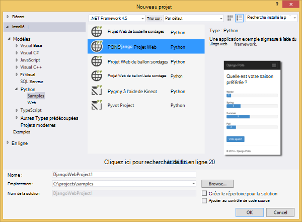
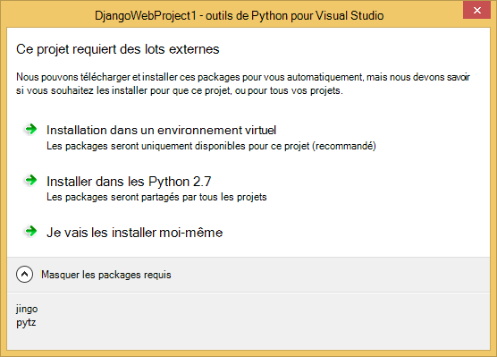
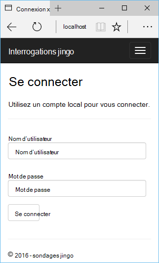
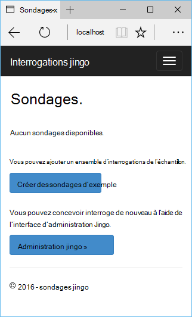
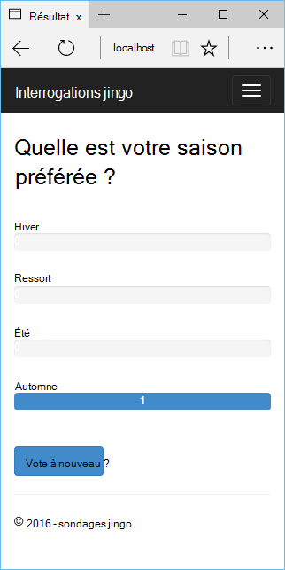
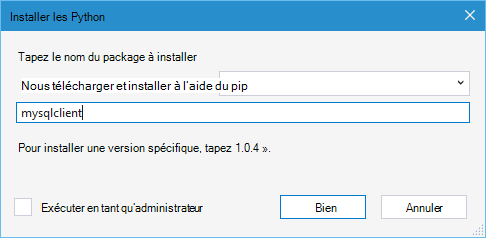
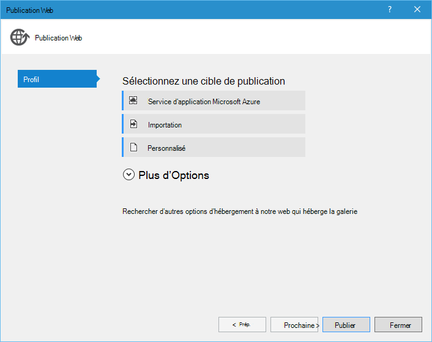
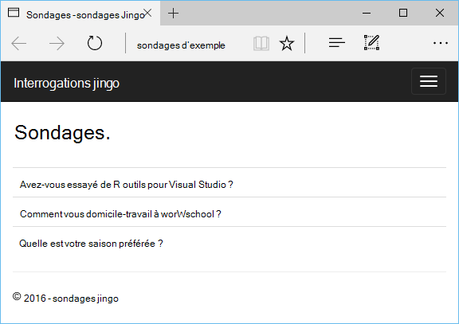

<properties 
    pageTitle="Django et MySQL sur Azure avec les outils de Python 2.2 pour Visual Studio" 
    description="Apprenez à utiliser les outils de Python pour Visual Studio pour créer une application web Django qui stocke les données dans une instance de base de données MySQL et le déployer sur Azure Application Service Web Apps." 
    services="app-service\web" 
    documentationCenter="python" 
    authors="huguesv" 
    manager="wpickett" 
    editor=""/>

<tags 
    ms.service="app-service-web" 
    ms.workload="web" 
    ms.tgt_pltfrm="na" 
    ms.devlang="python"
    ms.topic="get-started-article" 
    ms.date="07/07/2016"
    ms.author="huvalo"/>

# Django et MySQL sur Azure avec les outils de Python 2.2 pour Visual Studio 

[AZURE.INCLUDE [tabs](../../includes/app-service-web-get-started-nav-tabs.md)]

Dans ce didacticiel, vous utiliserez les [Python des outils de Visual Studio] (PTVS) pour créer une application web de sondages simple à l’aide d’un des exemples de modèles de PTVS. Vous apprendrez comment utiliser un service de MySQL hébergé sur Azure, comment faire pour configurer l’application web pour utiliser MySQL et comment publier l’application web au [Service Web Apps Azure App](http://go.microsoft.com/fwlink/?LinkId=529714).

> [AZURE.NOTE] Les informations contenues dans ce didacticiel sont également disponibles dans la vidéo suivante :
> 
> [PTVS 2.1 : Application de Django avec MySQL][video]

Consultez le [Centre de développement de Python] pour plus d’articles couvrant le développement d’Azure Application Service Web Apps avec PTVS à l’aide de la bouteille, fiole et Django des infrastructures web, avec les services de stockage par Table Azure, MySQL et de la base de données SQL. Bien que cet article se concentre sur l’application de Service, les étapes sont similaires lorsque vous développez des [Services en nuage Azure].

## Conditions préalables

 - Visual Studio 2015
 - [Python 2.7 32 bits] ou les [Python 3.4 32 bits]
 - [Python 2.2 des outils de Visual Studio]
 - [Python 2.2 des outils Visual Studio exemples VSIX]
 - [Outils du SDK Azure pour VS 2015]
 - Django 1,9 ou version ultérieure

[AZURE.INCLUDE [create-account-and-websites-note](../../includes/create-account-and-websites-note.md)]

<!-- This note should not render as part of the the previous include. -->

> [AZURE.NOTE] Si vous souhaitez commencer avec le Service d’application Azure avant l’ouverture d’un compte Azure, accédez à [Essayer le Service application](http://go.microsoft.com/fwlink/?LinkId=523751), où vous pouvez créer une application web de courte durée starter immédiatement dans le Service d’application. Aucune carte de crédit n’est obligatoire, et aucun des engagements ne sont nécessaires.

## Créer le projet

Dans cette section, vous allez créer un projet Visual Studio à l’aide d’un exemple de modèle. Vous allez créer un environnement virtuel et installer des packages requis. Vous allez créer une base de données locale à l’aide de sqlite. Vous allez exécuter l’application localement.

1. Dans Visual Studio, sélectionnez **fichier**, **Nouveau projet**.

1. Les modèles de projet à partir de la [2.2 d’outils Python pour VSIX d’exemples Visual Studio] sont disponibles sous les **Python**, **exemples**. Sélectionnez **Projet de sondages Django Web** et cliquez sur OK pour créer le projet.

    

1. Vous devez installer les modules externes. Sélectionnez **installer dans un environnement virtuel**.

    

1. Sélectionnez les **Python 2.7** ou les **Python 3.4** comme interpréteur de base.

    

1. Dans l' **Explorateur de solutions**, avec le bouton droit sur le nœud du projet et sélectionnez les **Python**puis sélectionnez **Migrer de Django**.  Sélectionnez ensuite **Django créer de super utilisateur**.

1. Vous ouvrez une Console de gestion Django et créer une base de données de sqlite dans le dossier du projet. Suivez les invites pour créer un utilisateur.

1. Confirmer que l’application fonctionne en appuyant sur `F5`.

1. À partir de la barre de navigation en haut, cliquez sur **se connecter** .

    

1. Entrez les informations d’identification de l’utilisateur que vous avez créé lors de la synchronisation de la base de données.

    

1. Cliquez sur **créer des sondages d’exemple**.

    

1. Cliquez sur un sondage et vote.

    

## Créer une base de données MySQL

Pour la base de données, vous allez créer une base de données hébergée ClearDB MySQL sur Azure.

Comme alternative, vous pouvez créer votre propre Machine virtuelle en cours d’exécution dans Azure, puis installer et administrer MySQL vous-même.

Vous pouvez créer une base de données avec un plan libre en suivant ces étapes.

1. Connectez-vous au [portail Azure].

1. En haut du volet de navigation, cliquez sur **Nouveau**, puis cliquez sur **données + de stockage**, puis cliquez sur **Base de données MySQL**. 

1. Configurer la nouvelle base de données de MySQL en créant un nouveau groupe de ressources, puis sélectionnez l’emplacement approprié pour lui.

1. Une fois la base de données MySQL est créé, cliquez sur **Propriétés** dans la lame de la base de données.

1. Utilisez le bouton Copier pour placer la valeur de **Chaîne de connexion** dans le Presse-papiers.

## Configurez le projet

Dans cette section, vous allez configurer notre application web pour utiliser la base de données MySQL que vous venez de créer. Vous allez également installer des packages de Python supplémentaires requis pour utiliser des bases de données MySQL avec Django. Ensuite, vous allez exécuter l’application web localement.

1. Dans Visual Studio, ouvrez **settings.py**, à partir du dossier *NomProjet* . Temporairement, collez la chaîne de connexion dans l’éditeur. La chaîne de connexion se trouve dans ce format :

        Database=<NAME>;Data Source=<HOST>;User Id=<USER>;Password=<PASSWORD>

    Modifier la base de données par défaut **moteur** d’utiliser MySQL et définir les valeurs pour **nom**, **utilisateur**, **mot de passe** et **l’hôte** dans le **CONNECTIONSTRING**.

        DATABASES = {
            'default': {
                'ENGINE': 'django.db.backends.mysql',
                'NAME': '<Database>',
                'USER': '<User Id>',
                'PASSWORD': '<Password>',
                'HOST': '<Data Source>',
                'PORT': '',
            }
        }

1. Dans l’Explorateur de solutions, sous **Des environnements de Python**, avec le bouton droit sur l’environnement virtuel et sélectionnez **Installer un Package de Python**.

1. Installez le package `mysqlclient` à l’aide du **pip**.

    

1. Dans l' **Explorateur de solutions**, avec le bouton droit sur le nœud du projet et sélectionnez les **Python**puis sélectionnez **Migrer de Django**.  Sélectionnez ensuite **Django créer de super utilisateur**.

    Cette opération crée les tables de la base de données MySQL que vous avez créé dans la section précédente. Suivez les invites pour créer un utilisateur, qui ne doit pas correspondre à l’utilisateur dans la base de données de sqlite créé dans la première section de cet article.

1. Exécutez l’application avec `F5`. Sondages qui sont créés avec les données soumises par vote et de **Créer des sondages exemple** seront sérialisées dans la base de données MySQL.

## Publier l’application web à un Service d’application Azure

Le Kit de développement .NET Azure fournit un moyen facile de déployer votre application web à un Service d’application Azure.

1. Dans l' **Explorateur de solutions**, avec le bouton droit sur le nœud du projet et sélectionnez **Publier**.

    

1. Cliquez sur **Service d’application Microsoft Azure**.

1. Cliquez sur **Nouveau** pour créer une nouvelle application web.

1. Renseignez les champs suivants et cliquez sur **créer**:
    - **Nom de l’application Web**
    - **Plan de Service d’application**
    - **Groupe de ressources**
    - **Région**
    - Laisser **Aucune** base de données de **serveur de base de données**

1. Accepter toutes les autres valeurs par défaut et cliquez sur **Publier**.

1. Votre navigateur web s’ouvre automatiquement pour l’application du site web publié. Vous devez voir l’application web fonctionne comme prévu, à l’aide de la base de données **MySQL** hébergé sur Azure.

    

    Félicitations ! Vous avez publié votre application web basée sur MySQL sur Azure.

## Étapes suivantes

Cliquez sur ces liens pour en savoir plus sur les Python outils de Visual Studio, Django et MySQL.

- [Outils de Python pour la Documentation de Visual Studio]
  - [Projets Web]
  - [Projets de Service cloud]
  - [Le débogage distant sur Microsoft Azure]
- [Documentation de Django]
- [MySQL]

Pour plus d’informations, consultez le [Centre de développement de Python](/develop/python/).

<!--Link references-->

[Centre de développement de Python]: /develop/python/
[Services en nuage Azure]: ../cloud-services-python-ptvs.md

<!--External Link references-->

[Azure Portal]: https://portal.azure.com
[Outils de Python pour Visual Studio]: http://aka.ms/ptvs
[Python 2.2 des outils de Visual Studio]: http://go.microsoft.com/fwlink/?LinkID=624025
[Python 2.2 des outils Visual Studio exemples VSIX]: http://go.microsoft.com/fwlink/?LinkID=624025
[Outils du SDK Azure pour VS 2015]: http://go.microsoft.com/fwlink/?LinkId=518003
[Python 2.7 32 bits]: http://go.microsoft.com/fwlink/?LinkId=517190 
[Python 3.4 32 bits]: http://go.microsoft.com/fwlink/?LinkId=517191
[Outils de Python pour la Documentation de Visual Studio]: http://aka.ms/ptvsdocs
[Le débogage distant sur Microsoft Azure]: http://go.microsoft.com/fwlink/?LinkId=624026
[Projets Web]: http://go.microsoft.com/fwlink/?LinkId=624027
[Projets de Service cloud]: http://go.microsoft.com/fwlink/?LinkId=624028
[Documentation de Django]: https://www.djangoproject.com/
[MySQL]: http://www.mysql.com/
[video]: http://youtu.be/oKCApIrS0Lo
