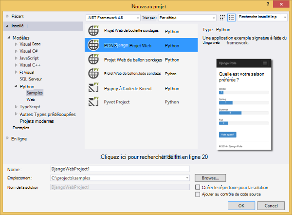
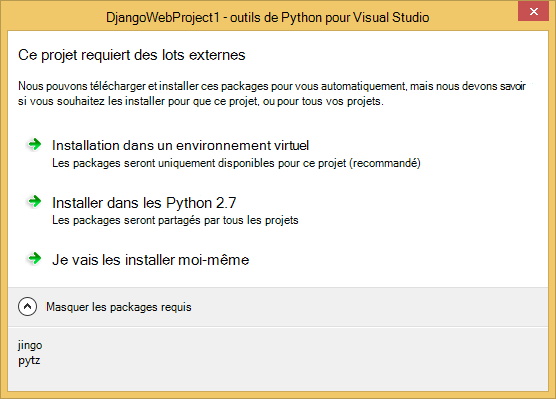
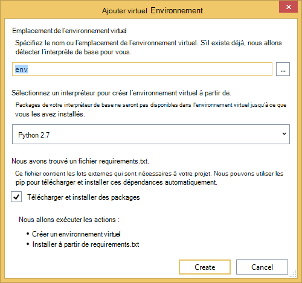
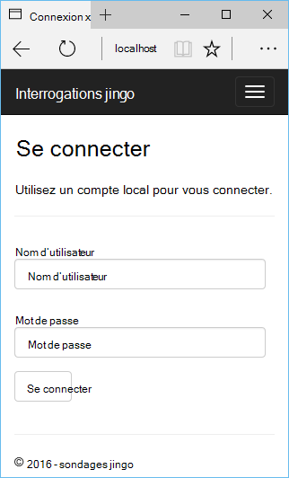
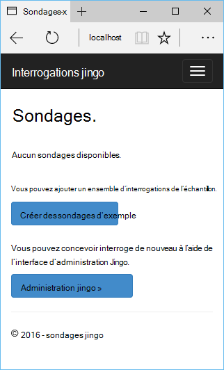
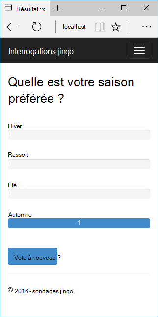
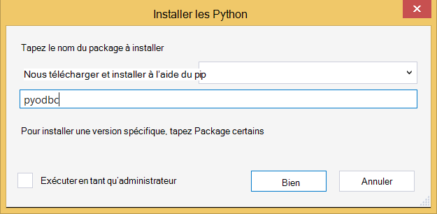
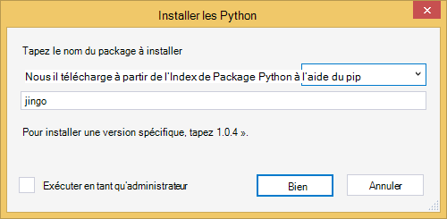
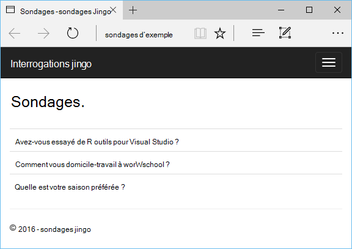

<properties 
    pageTitle="Django et base de données SQL Azure avec les outils de Python 2.2 pour Visual Studio" 
    description="Apprenez à utiliser les outils de Python pour Visual Studio pour créer une application web Django qui stocke les données dans une instance de base de données SQL et le déployer sur Azure Application Service Web Apps." 
    services="app-service\web" 
    tags="python"
    documentationCenter="python" 
    authors="huguesv" 
    manager="wpickett" 
    editor=""/>

<tags 
    ms.service="app-service-web" 
    ms.workload="web" 
    ms.tgt_pltfrm="na" 
    ms.devlang="python" 
    ms.topic="article" 
    ms.date="07/07/2016"
    ms.author="huguesv"/>

# Django et base de données SQL Azure avec les outils de Python 2.2 pour Visual Studio 

Dans ce didacticiel, nous allons utiliser les [Python des outils de Visual Studio] pour créer une application web de sondages simple à l’aide d’un des exemples de modèles de PTVS. Ce didacticiel est également disponible sous la forme d’une [vidéo](https://www.youtube.com/watch?v=ZwcoGcIeHF4).

Nous verrons comment utiliser une base de données SQL hébergée sur Azure, comment faire pour configurer l’application web pour utiliser une base de données SQL et comment publier l’application web au [Service Web Apps Azure App](http://go.microsoft.com/fwlink/?LinkId=529714).

Consultez le [Centre de développement de Python] pour plus d’articles couvrant le développement d’Azure Application Service Web Apps avec PTVS à l’aide de la bouteille, fiole et Django des infrastructures web, avec les services de stockage par Table Azure, MySQL et de la base de données SQL. Bien que cet article se concentre sur l’application de Service, les étapes sont similaires lorsque vous développez des [Services en nuage Azure].

## Conditions préalables

 - Visual Studio 2015
 - [Python 2.7 32 bits]
 - [Python 2.2 des outils de Visual Studio]
 - [Python 2.2 des outils Visual Studio exemples VSIX]
 - [Outils du SDK Azure pour VS 2015]
 - Django 1,9 ou version ultérieure

[AZURE.INCLUDE [create-account-and-websites-note](../../includes/create-account-and-websites-note.md)]

>[AZURE.NOTE] Si vous souhaitez commencer avec le Service d’application Azure avant l’ouverture d’un compte Azure, accédez à [Essayer le Service application](http://go.microsoft.com/fwlink/?LinkId=523751), où vous pouvez créer une application web de courte durée starter immédiatement dans le Service d’application. Aucune carte de crédit obligatoire ; aucun des engagements.

## Créer le projet

Dans cette section, nous allons créer un projet Visual Studio à l’aide d’un exemple de modèle. Nous allons créer un environnement virtuel et installer des packages requis. Nous allons créer une base de données locale à l’aide de sqlite. Ensuite, nous allons exécuter l’application web localement.

1.  Dans Visual Studio, sélectionnez **fichier**, **Nouveau projet**.

1.  Les modèles de projet à partir de la [2.2 d’outils Python pour VSIX d’exemples Visual Studio] sont disponibles sous les **Python**, **exemples**. Sélectionnez **Projet de sondages Django Web** et cliquez sur OK pour créer le projet.

    

1.  Vous devez installer les modules externes. Sélectionnez **installer dans un environnement virtuel**.

    

1.  Sélectionnez les **Python 2.7** comme interpréteur de base.

    

1.  Dans l' **Explorateur de solutions**, avec le bouton droit sur le nœud du projet et sélectionnez les **Python**puis sélectionnez **Migrer de Django**.  Sélectionnez ensuite **Django créer de super utilisateur**.

1.  Vous ouvrez une Console de gestion Django et créer une base de données de sqlite dans le dossier du projet. Suivez les invites pour créer un utilisateur.

1.  Vérifiez que l’application fonctionne en appuyant sur <kbd>F5</kbd>.

1.  À partir de la barre de navigation en haut, cliquez sur **se connecter** .

    

1.  Entrez les informations d’identification de l’utilisateur que vous avez créé lors de la synchronisation de la base de données.

    

1.  Cliquez sur **créer des sondages d’exemple**.

    

1.  Cliquez sur un sondage et vote.

    

## Créer une base de données SQL

La base de données, nous allons créer une base de données SQL d’Azure.

Vous pouvez créer une base de données en suivant ces étapes.

1.  Journal du [portail Azure].

1.  En bas du volet de navigation, cliquez sur **Nouveau**. , cliquez sur **données + stockage** > **De la base de données SQL**.

1.  Configurer la nouvelle base de données SQL en créant un nouveau groupe de ressources, puis sélectionnez l’emplacement approprié pour lui.

1.  Une fois la base de données SQL est créée, cliquez sur **Ouvrir dans Visual Studio** dans la lame de la base de données.
2.  Cliquez sur **configurer votre pare-feu**.
3.  La lame de **Paramètres de pare-feu** , ajoutez qu'une règle de pare-feu avec **IP de début** et de **Fin IP** définie sur l’adresse IP publique de votre ordinateur de développement. Cliquez sur **Enregistrer**.

    Ainsi, les connexions au serveur de base de données à partir de votre ordinateur de développement.

4.  De retour dans la lame de la base de données, cliquez sur **Propriétés**, puis cliquez sur **Afficher les chaînes de connexion de base de données**. 

2.  Utilisez le bouton Copier pour placer la valeur de **ADO.NET** dans le Presse-papiers.

## Configurez le projet

Dans cette section, nous allons configurer notre application web pour utiliser la base de données SQL que nous venons de créer. Nous allons également installer des packages de Python supplémentaires requis pour utiliser des bases de données SQL avec Django. Ensuite, nous allons exécuter l’application web localement.

1.  Dans Visual Studio, ouvrez **settings.py**, à partir du dossier *NomProjet* . Temporairement, collez la chaîne de connexion dans l’éditeur. La chaîne de connexion se trouve dans ce format :

        Server=<ServerName>,<ServerPort>;Database=<DatabaseName>;User ID=<UserName>;Password={your_password_here};Encrypt=True;TrustServerCertificate=False;Connection Timeout=30;

Modifier la définition de `DATABASES` pour utiliser les valeurs ci-dessus.

        DATABASES = {
            'default': {
                'ENGINE': 'sql_server.pyodbc',
                'NAME': '<DatabaseName>',
                'USER': '<UserName>',
                'PASSWORD': '{your_password_here}',
                'HOST': '<ServerName>',
                'PORT': '<ServerPort>',
                'OPTIONS': {
                    'driver': 'SQL Server Native Client 11.0',
                    'MARS_Connection': 'True',
                }
            }
        }

1.  Dans l’Explorateur de solutions, sous **Des environnements de Python**, avec le bouton droit sur l’environnement virtuel et sélectionnez **Installer un Package de Python**.

1.  Installez le package `pyodbc` à l’aide du **pip**.

    

1.  Installez le package `django-pyodbc-azure` à l’aide du **pip**.

    

1.  Dans l' **Explorateur de solutions**, avec le bouton droit sur le nœud du projet et sélectionnez les **Python**puis sélectionnez **Migrer de Django**.  Sélectionnez ensuite **Django créer de super utilisateur**.

    Cette opération crée les tables de la base de données SQL que nous avons créé dans la section précédente. Suivez les invites pour créer un utilisateur, qui ne doit pas correspondre à l’utilisateur dans la base de données de sqlite créé dans la première section.

1.  Exécutez l’application avec `F5`. Sondages qui sont créés avec les données soumises par vote et de **Créer des sondages exemple** seront sérialisées dans la base de données SQL.

## Publier l’application web à un Service d’application Azure

Le Kit de développement .NET Azure fournit un moyen facile de déployer votre application web de web au Service Web Apps Azure App.

1.  Dans l' **Explorateur de solutions**, avec le bouton droit sur le nœud du projet et sélectionnez **Publier**.

    

1.  Cliquez sur **les applications Web Microsoft Azure**.

1.  Cliquez sur **Nouveau** pour créer une nouvelle application web.

1.  Renseignez les champs suivants et cliquez sur **créer**.
    -   **Nom de l’application Web**
    -   **Plan de Service d’application**
    -   **Groupe de ressources**
    -   **Région**
    -   Laisser **Aucune** base de données de **serveur de base de données**

1.  Accepter toutes les autres valeurs par défaut et cliquez sur **Publier**.

1.  Votre navigateur web s’ouvre automatiquement pour l’application du site web publié. Vous devez voir l’application web fonctionne comme prévu, à l’aide de la base de données **SQL** hébergée sur Azure.

    Félicitations !

    

## Étapes suivantes

Cliquez sur ces liens pour en savoir plus sur les Python outils de Visual Studio, Django et de la base de données SQL.

- [Outils de Python pour la Documentation de Visual Studio]
  - [Projets Web]
  - [Projets de Service cloud]
  - [Le débogage distant sur Microsoft Azure]
- [Documentation de Django]
- [Base de données SQL]

## Ce qui a changé
* Pour obtenir un guide pour la modification de sites Web au Service de l’application voir : [Service d’application Azure et son Impact sur les Services Azure existants](http://go.microsoft.com/fwlink/?LinkId=529714)

<!--Link references-->
[Centre de développement de Python]: /develop/python/
[Services en nuage Azure]: ../cloud-services-python-ptvs.md

<!--External Link references-->
[Azure Portal]: https://portal.azure.com
[Outils de Python pour Visual Studio]: http://aka.ms/ptvs
[Python 2.2 des outils de Visual Studio]: http://go.microsoft.com/fwlink/?LinkID=624025
[Python 2.2 des outils Visual Studio exemples VSIX]: http://go.microsoft.com/fwlink/?LinkID=624025
[Outils du SDK Azure pour VS 2015]: http://go.microsoft.com/fwlink/?LinkId=518003
[Python 2.7 32 bits]: http://go.microsoft.com/fwlink/?LinkId=517190 
[Outils de Python pour la Documentation de Visual Studio]: http://aka.ms/ptvsdocs
[Le débogage distant sur Microsoft Azure]: http://go.microsoft.com/fwlink/?LinkId=624026
[Projets Web]: http://go.microsoft.com/fwlink/?LinkId=624027
[Projets de Service cloud]: http://go.microsoft.com/fwlink/?LinkId=624028
[Documentation de Django]: https://www.djangoproject.com/
[Base de données SQL]: /documentation/services/sql-database/
