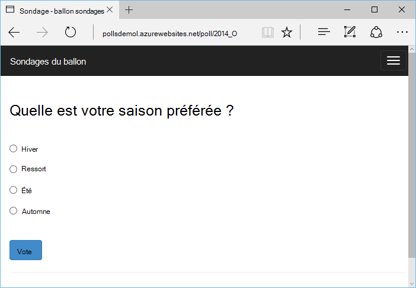

<properties 
    pageTitle="Ballon et le stockage par Table Azure sur Azure avec les outils de Python 2.2 pour Visual Studio" 
    description="Apprenez à utiliser les outils de Python pour Visual Studio pour créer une application web de ballon qui stocke les données dans le stockage par Table Azure et déployez-le sur Azure Application Service Web Apps." 
    services="app-service\web"
    tags="python"
    documentationCenter="python" 
    authors="huguesv" 
    manager="wpickett" 
    editor=""/>

<tags 
    ms.service="app-service-web" 
    ms.workload="web" 
    ms.tgt_pltfrm="na" 
    ms.devlang="python" 
    ms.topic="article" 
    ms.date="07/07/2016"
    ms.author="huvalo"/>

# Ballon et le stockage par Table Azure sur Azure avec les outils de Python 2.2 pour Visual Studio 

Dans ce didacticiel, nous allons utiliser les [Python des outils de Visual Studio] pour créer une application web de sondages simple à l’aide d’un des exemples de modèles de PTVS. Ce didacticiel est également disponible sous la forme d’une [vidéo](https://www.youtube.com/watch?v=qUtZWtPwbTk).

L’application web de sondages définit une abstraction pour son référentiel, de sorte que vous pouvez facilement basculer entre les différents types de référentiels (mémoire, stockage par Table Azure, MongoDB).

Nous verrons comment créer un compte de stockage Azure, comment faire pour configurer l’application web pour utiliser le stockage par Table Azure et comment publier l’application web au [Service Web Apps Azure App](http://go.microsoft.com/fwlink/?LinkId=529714).

Consultez le [Centre de développement de Python] pour plus d’articles couvrant le développement d’Azure Application Service Web Apps avec PTVS à l’aide de la bouteille, fiole et Django des infrastructures web, avec les services de MongoDB, stockage par Table Azure, MySQL et de la base de données SQL. Bien que cet article se concentre sur l’application de Service, les étapes sont similaires lorsque vous développez des [Services en nuage Azure].

## Conditions préalables

 - Visual Studio 2015
 - [Python 2.2 des outils de Visual Studio]
 - [Python 2.2 des outils Visual Studio exemples VSIX]
 - [Outils du SDK Azure pour VS 2015]
 - [Python 2.7 32 bits] ou les [Python 3.4 32 bits]

[AZURE.INCLUDE [create-account-and-websites-note](../../includes/create-account-and-websites-note.md)]

>[AZURE.NOTE] Si vous souhaitez commencer avec le Service d’application Azure avant l’ouverture d’un compte Azure, accédez à [Essayer le Service application](http://go.microsoft.com/fwlink/?LinkId=523751), où vous pouvez créer une application web de courte durée starter immédiatement dans le Service d’application. Aucune carte de crédit obligatoire ; aucun des engagements.

## Créer le projet

Dans cette section, nous allons créer un projet Visual Studio à l’aide d’un exemple de modèle. Nous allons créer un environnement virtuel et installer des packages requis. Ensuite, nous allons exécuter l’application localement à l’aide du référentiel en mémoire par défaut.

1.  Dans Visual Studio, sélectionnez **fichier**, **Nouveau projet**.

1.  Les modèles de projet à partir de la [2.2 d’outils Python pour VSIX d’exemples Visual Studio] sont disponibles sous les **Python**, **exemples**. Sélectionnez **Projet de sondages ballon Web** et cliquez sur OK pour créer le projet.

    

1.  Vous devez installer les modules externes. Sélectionnez **installer dans un environnement virtuel**.

    

1.  Sélectionnez les **Python 2.7** ou les **Python 3.4** comme interpréteur de base.

    

1.  Confirmer que l’application fonctionne en appuyant sur `F5`. Par défaut, l’application utilise un référentiel en mémoire qui ne nécessite aucune configuration. Toutes les données sont perdues lorsque le serveur web est arrêté.

1.  Cliquez sur **Créer des sondages exemple**, puis cliquez sur un sondage et le vote.

    

## Créer un compte de stockage Azure

Pour utiliser les opérations de stockage, vous avez besoin d’un compte de stockage Azure. Vous pouvez créer un compte de stockage en suivant ces étapes.

1.  Journal du [portail Azure](https://portal.azure.com/).

2. Cliquez sur l’icône **Nouveau** dans la partie supérieure gauche du portail, puis cliquez sur **données + stockage** > **Compte de stockage**. Cliquez sur **créer**, puis nommez le compte de stockage unique et créer un nouveau [groupe de ressources](../azure-resource-manager/resource-group-overview.md) pour celui-ci.

    

    Lorsque le compte de stockage a été créé, le bouton **Notifications** clignote en vert **Réussite** et les lames du compte de stockage sont ouvert pour montrer qu’il appartient pour le nouveau groupe de ressources que vous avez créé.

5. Cliquez sur la partie de **Touches d’accès rapide** dans les lames du compte de stockage. Notez le nom du compte et l’argument key1.

    

    Nous aurons besoin de ces informations pour configurer votre projet dans la section suivante.

## Configurez le projet

Dans cette section, nous allons configurer notre application pour utiliser le compte de stockage que nous venons de créer. Nous allons voir comment obtenir des paramètres de connexion à partir du portail Azure. Ensuite, nous allons exécuter l’application localement.

1.  Dans Visual Studio, avec le bouton droit sur le nœud de votre projet dans l’Explorateur de solutions et sélectionnez **Propriétés**. Cliquez sur l’onglet **Déboguer** .

    

1.  Définissez les valeurs des variables d’environnement requises par l’application de **Commande de serveur de Debug**, **environnement**.

        REPOSITORY_NAME=azuretablestorage
        STORAGE_NAME=<storage account name>
        STORAGE_KEY=<primary access key>

    Ceci permettra de définir les variables d’environnement lorsque vous **Démarrez le débogage**. Si vous souhaitez que les variables à définir lorsque vous **Exécuter sans débogage**, définissez les mêmes valeurs sous **Exécuter la commande de serveur** ainsi.

    Vous pouvez également définir des variables d’environnement en utilisant le panneau de configuration Windows. Il s’agit d’une meilleure option si vous souhaitez éviter de stocker des informations d’identification dans le code source et le fichier de projet. Notez que vous devez redémarrer Visual Studio pour les nouvelles valeurs de l’environnement pour être disponible pour l’application.

1.  Le code qui implémente le référentiel de stockage par Table Azure se trouve dans **models/azuretablestorage.py**. Consultez la [documentation] pour plus d’informations sur l’utilisation du Service de la Table à partir de Python.

1.  Exécutez l’application avec `F5`. Sondages qui sont créés avec les données soumises par vote et de **Créer des sondages exemple** seront sérialisées dans le stockage par Table Azure.

    > [AZURE.NOTE] L’environnement virtuel de Python 2.7 peut provoquer une interruption d’exception dans Visual Studio.  Appuyez sur la touche `F5` pour continuer à charger le projet web.

1.  Accédez à la page **à propos** pour vérifier que l’application utilise le référentiel de **Stockage par Table Azure** .

    

## Explorez le stockage par Table Azure

Il est facile d’afficher et de modifier des tables de stockage à l’aide de Cloud Explorer dans Visual Studio. Dans cette section, nous allons utiliser Explorateur de serveurs pour afficher le contenu des tables application interroge.

> [AZURE.NOTE] Cela nécessite Microsoft Azure installation des outils, qui sont disponibles dans le cadre du [Kit de développement logiciel Azure pour .NET].

1.  Ouvrez **l’Explorateur de nuage**. Développez les **Comptes de stockage**, votre compte de stockage, puis **Tables**.

    

1.  Double-cliquez sur la table de **choix** de **sondages** ou pour afficher le contenu de la table dans une fenêtre de document, ainsi que les entités d’Ajouter/Supprimer/modifier.

    

## Publier l’application web à un Service d’application Azure

Le Kit de développement .NET Azure fournit un moyen facile de déployer votre application web à un Service d’application Azure.

1.  Dans l' **Explorateur de solutions**, avec le bouton droit sur le nœud du projet et sélectionnez **Publier**.

    

1.  Cliquez sur **les applications Web Microsoft Azure**.

1.  Cliquez sur **Nouveau** pour créer une nouvelle application web.

1.  Renseignez les champs suivants et cliquez sur **créer**.
    -   **Nom de l’application Web**
    -   **Plan de Service d’application**
    -   **Groupe de ressources**
    -   **Région**
    -   Laisser **Aucune** base de données de **serveur de base de données**

1.  Accepter toutes les autres valeurs par défaut et cliquez sur **Publier**.

1.  Votre navigateur web s’ouvre automatiquement pour l’application du site web publié. Si vous recherchez le sur la page, vous verrez qu’elle utilise le référentiel **En mémoire** , pas le référentiel de **Stockage par Table Azure** .

    C’est parce que les variables d’environnement ne sont pas définies sur l’instance de Web Apps dans le Service d’application Azure, afin qu’il utilise les valeurs par défaut spécifiées dans **settings.py**.

## Configurez l’instance de Web Apps

Dans cette section, nous allons configurer variables d’environnement pour l’instance d’applications Web.

1.  Dans [Azure Portal](https://portal.azure.com), ouvrez la lame de l’application web en cliquant sur **Parcourir** > **Application Services** > le nom de votre application web.

1.  Dans les lames de votre application web, cliquez sur **Tous les paramètres**, puis cliquez sur **Paramètres de l’Application**.

1.  Faites défiler jusqu'à la section **paramètres d’application** et de définir les valeurs de **référentiel\_nom de**, **stockage\_nom de** et **stockage\_clé** comme décrit dans la section de **configuration du projet** ci-dessus.

    

1.  Cliquez sur **Enregistrer**. Après avoir reçu les notifications que les modifications ont été appliquées, cliquez sur **Parcourir** à partir de la lame principale de Web app.

1.  Vous devez voir l’application web fonctionne comme prévu, l’utilisation du référentiel de **Stockage par Table Azure** .

    Félicitations !

    

## Étapes suivantes

Cliquez sur ces liens pour en savoir plus sur les Python outils de Visual Studio, ballon et stockage par Table Azure.

- [Outils de Python pour la Documentation de Visual Studio]
  - [Projets Web]
  - [Projets de Service cloud]
  - [Le débogage distant sur Microsoft Azure]
- [Documentation de ballon]
- [Stockage Azure]
- [Azure SDK pour les Python]
- [Comment faire pour utiliser le Service de stockage de Table à partir de Python]

## Ce qui a changé
* Pour obtenir un guide pour la modification de sites Web au Service de l’application voir : [Service d’application Azure et son Impact sur les Services Azure existants](http://go.microsoft.com/fwlink/?LinkId=529714)

<!--Link references-->
[Centre de développement de Python]: /develop/python/
[Services en nuage Azure]: ../cloud-services-python-ptvs.md
[documentation]: ../storage-python-how-to-use-table-storage.md
[Comment faire pour utiliser le Service de stockage de Table à partir de Python]: ../storage-python-how-to-use-table-storage.md

<!--External Link references-->
[Azure Portal]: https://portal.azure.com
[Azure SDK pour .NET]: http://azure.microsoft.com/downloads/
[Outils de Python pour Visual Studio]: http://aka.ms/ptvs
[Python 2.2 des outils de Visual Studio]: http://go.microsoft.com/fwlink/?LinkID=624025
[Python 2.2 des outils Visual Studio exemples VSIX]: http://go.microsoft.com/fwlink/?LinkID=624025
[Outils du SDK Azure pour VS 2015]: http://go.microsoft.com/fwlink/?linkid=518003
[Python 2.7 32 bits]: http://go.microsoft.com/fwlink/?LinkId=517190 
[Python 3.4 32 bits]: http://go.microsoft.com/fwlink/?LinkId=517191
[Outils de Python pour la Documentation de Visual Studio]: http://aka.ms/ptvsdocs
[Documentation de ballon]: http://flask.pocoo.org/
[Le débogage distant sur Microsoft Azure]: http://go.microsoft.com/fwlink/?LinkId=624026
[Projets Web]: http://go.microsoft.com/fwlink/?LinkId=624027
[Projets de Service cloud]: http://go.microsoft.com/fwlink/?LinkId=624028
[Stockage Azure]: http://azure.microsoft.com/documentation/services/storage/
[Azure SDK pour les Python]: https://github.com/Azure/azure-sdk-for-python
 
