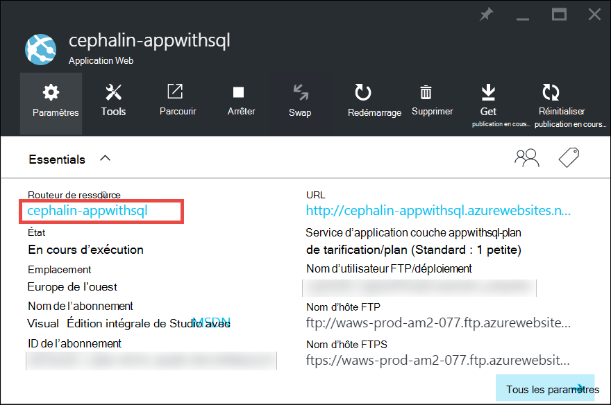
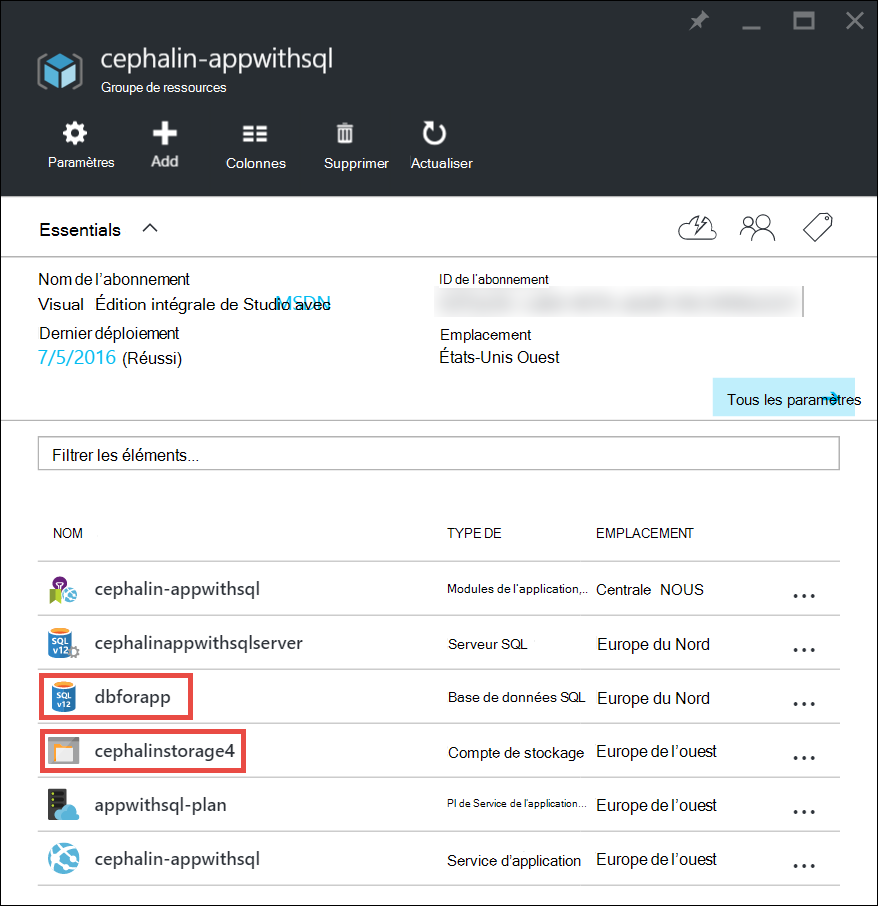
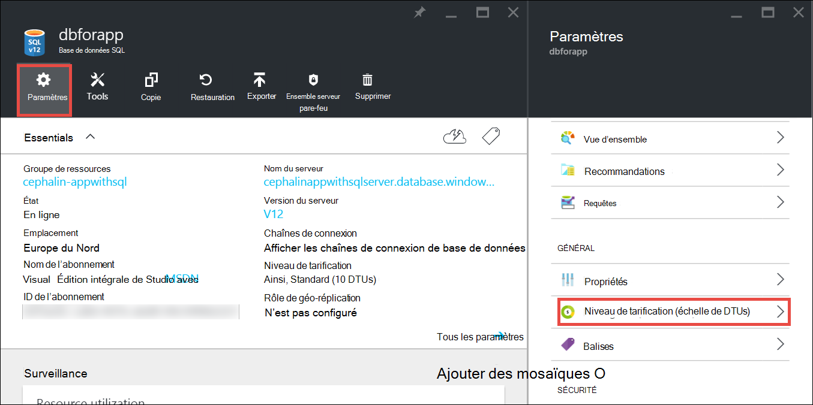
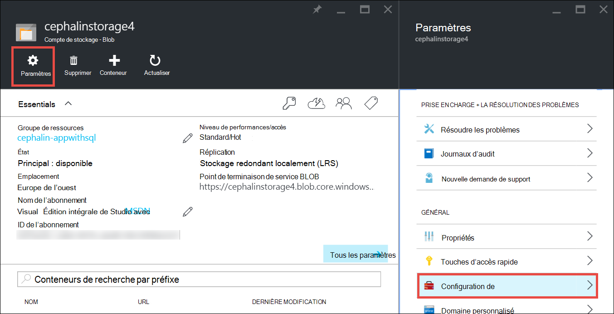

<properties
    pageTitle="Mettre à l’échelle d’une application dans Azure | Microsoft Azure"
    description="Découvrez comment mettre à l’échelle d’une application dans le Service d’application Azure pour ajouter des capacités et fonctionnalités."
    services="app-service"
    documentationCenter=""
    authors="cephalin"
    manager="wpickett"
    editor="mollybos"/>

<tags
    ms.service="app-service"
    ms.workload="na"
    ms.tgt_pltfrm="na"
    ms.devlang="na"
    ms.topic="article"
    ms.date="07/05/2016"
    ms.author="cephalin"/>

# Mettre à l’échelle d’une application dans Azure #

Cet article vous explique comment mettre à l’échelle votre application dans le Service d’application Azure. Il existe deux flux de travail pour la mise à l’échelle, échelle des et mise à l’échelle et cet article explique l’échelle des flux de travail.

- [Évolution verticale](https://en.wikipedia.org/wiki/Scalability#Horizontal_and_vertical_scaling): obtenir plus du processeur, mémoire, espace disque et des fonctionnalités supplémentaires telles que des machines virtuelles dédiés (VM), les domaines personnalisés et les certificats, emplacements, autoscaling et plus la zone de transit. Évoluer en modifiant le niveau de tarification du plan auquel appartient votre application Service d’application.
- [Mise à l’échelle](https://en.wikipedia.org/wiki/Scalability#Horizontal_and_vertical_scaling): augmenter le nombre d’instances de machine virtuelle qui exécute votre application.
Vous pouvez faire évoluer jusqu'à 20 instances, en fonction de votre niveau de tarification. [Environnements de Service d’application](../app-service/app-service-app-service-environments-readme.md) de couche de **prime** continueront à augmenter votre nombre horizontale à 50 instances. Pour plus d’informations sur la mise à l’échelle, consultez le [nombre d’instances à l’échelle manuellement ou automatiquement](../monitoring-and-diagnostics/insights-how-to-scale.md). Vous y trouverez comment utiliser autoscaling, qui est mise à l’échelle du nombre d’instances automatiquement en fonction des calendriers et des règles prédéfinies.

Les paramètres d’échelle ne prennent que quelques secondes pour appliquer et affecte toutes les applications dans votre [plan de Service de l’application](../app-service/azure-web-sites-web-hosting-plans-in-depth-overview.md).
Ils ne nécessitent pas de modifier votre code ou de redéployer votre application.

Pour plus d’informations sur les tarifs et les fonctionnalités de plans de Service d’application individuels, voir les [Détails de la tarification Service App](/pricing/details/web-sites/).  

> [AZURE.NOTE] Avant de passer d’un plan de Service d’application de la couche **libre** , vous devez d’abord supprimer les [plafonds de dépenses](/pricing/spending-limits/) en place pour votre abonnement Azure. Pour afficher ou modifier les options de votre abonnement Microsoft Azure App, consultez [Microsoft Azure abonnements][azuresubscriptions].

## Évoluer votre niveau de tarification

1. Dans votre navigateur, ouvrez le [portail Azure][portal].

2. Dans les lames de votre application, cliquez sur **tous les paramètres**et cliquez sur **Échelle**.

    ![Naviguez pour évoluer votre application Azure.][ChooseWHP]

4. Choisissez votre niveau, puis cliquez sur **Sélectionner**.

    L’onglet **Notifications** clignote en vert **succès** une fois l’opération terminée.

## Mettre à l’échelle les ressources connexes
Si votre application dépend d’autres services, tels que la base de données de SQL Azure ou stockage Azure, vous pouvez également évoluer ces ressources en fonction de vos besoins. Ces ressources ne sont pas mis à l’échelle avec le plan de Service de l’application et doivent être mis à l’échelle séparément.

1. **Essentials**, cliquez sur le lien de **groupe de ressources** .

    

2. Dans la partie **Résumé** de la lame du **groupe de ressources** , cliquez sur une ressource que vous souhaitez mettre à l’échelle. La capture d’écran suivante illustre une ressource de base de données SQL et une ressource de stockage Azure.

    

3. Pour une ressource de base de données SQL, cliquez sur **paramètres** > **niveau de tarification** à l’échelle de la tarification de niveau.

    

    Vous pouvez également activer [géo-réplication](../sql-database/sql-database-geo-replication-overview.md) pour votre instance de base de données SQL.

    Pour une ressource de stockage Azure, cliquez sur **paramètres** > **Configuration** à l’échelle des options de stockage.

    

## En savoir plus sur les fonctionnalités de développement
Selon le niveau de prix, les fonctionnalités destinées aux développeurs suivantes sont disponibles :

### Nombre de bits ###

- Les niveaux de **base**, **Standard**et **Premium** prend en charge les applications 32 bits et 64 bits.
- Le **libre** et les niveaux de plan **Shared** prend en charge les applications 32 bits uniquement.

### Prise en charge du débogueur ###

- Prise en charge du débogueur est disponible pour les modes **libre**, **Shared**et **base** sur une connexion par le service d’application.
- Prise en charge du débogueur est disponible pour les modes **Standard** et **Premium** à cinq connexions simultanées par le service d’application.

## En savoir plus sur les autres fonctionnalités

- Pour obtenir des informations détaillées sur toutes les autres fonctionnalités dans les plans de Service de l’application, y compris les prix et fonctionnalités intéressantes pour tous les utilisateurs (y compris les développeurs), consultez les [Détails de la tarification Service App](/pricing/details/web-sites/).

>[AZURE.NOTE] Si vous souhaitez commencer avec le Service d’application Azure avant de vous inscrivez pour un compte Azure, accédez à [Essayer le Service application](http://go.microsoft.com/fwlink/?LinkId=523751) où vous pouvez créer une application web de courte durée starter immédiatement dans le Service d’application. Aucune carte de crédit ne sont nécessaires, et il n’y a aucun engagement.

## Étapes suivantes

- Pour commencer avec Azure, consultez la [Version d’évaluation gratuite de Microsoft Azure](/pricing/free-trial/).
- Pour plus d’informations sur la tarification, la prise en charge et SLA, visitez les liens suivants.

    [Détails de la tarification des transferts de données](/pricing/details/data-transfers/)

    [Plans de Support Azure de Microsoft](/support/plans/)

    [Accords de niveau de service](/support/legal/sla/)

    [Détails de la tarification de base de données SQL](/pricing/details/sql-database/)

    [Machine virtuelle et les tailles de Service de Cloud de Microsoft Azure][vmsizes]

    [Détails de la tarification Service d’application](/pricing/details/app-service/)

    [Service d’application tarifs - connexions SSL](/pricing/details/web-sites/#ssl-connections)

- Meilleures pratiques en matière de création d’une architecture évolutive et robuste, reportez-vous à la section pour plus d’informations sur le Service d’application Azure [recommandées : Azure Application Service Web Apps](http://blogs.msdn.com/b/windowsazure/archive/2014/02/10/best-practices-windows-azure-websites-waws.aspx).

- Pour les vidéos sur la mise à l’échelle des applications de Service d’application, consultez les ressources suivantes :

    - [Lorsque la mise à l’échelle des sites Web Azure - avec Stefan Schackow](/documentation/videos/azure-web-sites-free-vs-standard-scaling/)
    - [Mise à l’échelle de sites Azure, processeur ou planifiée - avec Stefan Schackow](/documentation/videos/auto-scaling-azure-web-sites/)
    - [Comment Azure échelle de sites Web - avec Stefan Schackow](/documentation/videos/how-azure-web-sites-scale/)

<!-- LINKS -->
[vmsizes]:/pricing/details/app-service/
[SQLaccountsbilling]:http://go.microsoft.com/fwlink/?LinkId=234930
[azuresubscriptions]:http://go.microsoft.com/fwlink/?LinkID=235288
[portal]: https://portal.azure.com/

<!-- IMAGES -->
[ChooseWHP]: ./media/web-sites-scale/scale1ChooseWHP.png
[ChooseBasicInstances]: ./media/web-sites-scale/scale2InstancesBasic.png
[SaveButton]: ./media/web-sites-scale/05SaveButton.png
[BasicComplete]: ./media/web-sites-scale/06BasicComplete.png
[ScaleStandard]: ./media/web-sites-scale/scale3InstancesStandard.png
[Autoscale]: ./media/web-sites-scale/scale4AutoScale.png
[SetTargetMetrics]: ./media/web-sites-scale/scale5AutoScaleTargetMetrics.png
[SetFirstRule]: ./media/web-sites-scale/scale6AutoScaleFirstRule.png
[SetSecondRule]: ./media/web-sites-scale/scale7AutoScaleSecondRule.png
[SetThirdRule]: ./media/web-sites-scale/scale8AutoScaleThirdRule.png
[SetRulesFinal]: ./media/web-sites-scale/scale9AutoScaleFinal.png
[ResourceGroup]: ./media/web-sites-scale/scale10ResourceGroup.png
[ScaleDatabase]: ./media/web-sites-scale/scale11SQLScale.png
[GeoReplication]: ./media/web-sites-scale/scale12SQLGeoReplication.png
