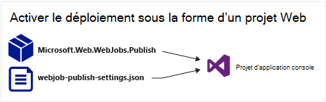
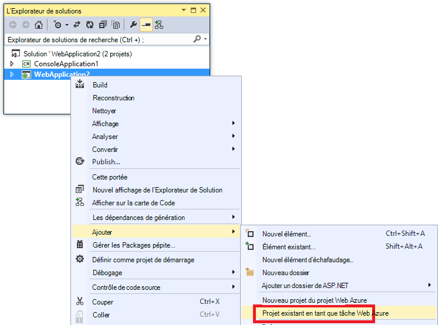
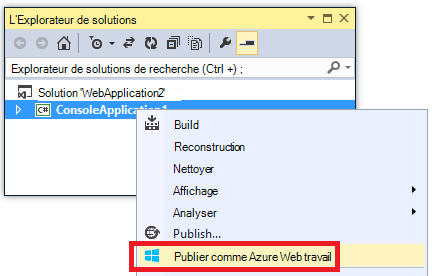

<properties 
    pageTitle="Déployer des WebJobs à l’aide de Visual Studio" 
    description="Découvrez comment déployer Azure WebJobs pour Azure Application Service Web Apps à l’aide de Visual Studio." 
    services="app-service" 
    documentationCenter="" 
    authors="tdykstra" 
    manager="wpickett" 
    editor="jimbe"/>

<tags 
    ms.service="app-service" 
    ms.devlang="dotnet" 
    ms.topic="article" 
    ms.tgt_pltfrm="na" 
    ms.workload="na" 
    ms.date="04/27/2016" 
    ms.author="tdykstra"/>

# Déployer des WebJobs à l’aide de Visual Studio

## Vue d’ensemble

Cette rubrique explique comment utiliser Visual Studio pour déployer un projet d’Application Console pour une application web dans le [Service d’application](http://go.microsoft.com/fwlink/?LinkId=529714) sous la forme d’un [WebJob d’Azure](http://go.microsoft.com/fwlink/?LinkId=390226). Pour plus d’informations sur la façon de déployer des WebJobs à l’aide du [Portail Azure](https://portal.azure.com), consultez [tâches d’arrière-plan de s’exécuter avec WebJobs](web-sites-create-web-jobs.md).

Lorsque Visual Studio déploie un projet d’Application de Console WebJobs-activé, il effectue deux tâches :

* Copie les fichiers de runtime dans le dossier approprié dans l’application web (*App_Data/travaux/continu* pour WebJobs continu, *App_Data/travaux/déclenchée* pour WebJobs planifiées et à la demande).
* Définit les [tâches du planificateur d’Azure](#scheduler) pour WebJobs qui sont planifiées pour s’exécuter à des heures particulières. (Cela est inutile pour WebJobs continu.)

Un projet prenant en charge les WebJobs comprend les éléments suivants ajoutés :

* Le package NuGet [Microsoft.Web.WebJobs.Publish](http://www.nuget.org/packages/Microsoft.Web.WebJobs.Publish/) .
* Un fichier [webjob-publier-settings.json](#publishsettings) qui contient les paramètres de déploiement et le planificateur. 

Vous pouvez ajouter ces éléments à un projet d’Application Console existant ou utiliser un modèle pour créer un nouveau projet d’Application de Console WebJobs-activé. 

Vous pouvez déployer un projet sous la forme d’un WebJob par lui-même ou le lier à un projet web afin qu’il déploie automatiquement chaque fois que vous déployez le projet web. Pour lier des projets, Visual Studio inclut le nom du projet prenant en charge les WebJobs dans un fichier [webjobs-list.json](#webjobslist) dans le projet web.

## Conditions préalables

WebJobs les fonctionnalités de déploiement sont disponibles dans Visual Studio 2015 lorsque vous installez le Kit de développement Azure pour .NET :

* [Azure SDK pour .NET (Visual Studio 2015)](http://go.microsoft.com/fwlink/?linkid=518003).

## Activer le déploiement d’un projet d’Application Console existant WebJobs

Vous disposez de deux options :

* [Activer le déploiement automatique avec un projet web](#convertlink).

    Configurer un projet d’Application Console existant afin qu’il déploie automatiquement sous la forme d’un WebJob lorsque vous déployez un projet web. Utilisez cette option lorsque vous souhaitez exécuter votre WebJob dans la même application web, dans lequel vous exécutez l’application web associée.

* [Activer le déploiement sans qu’un projet web](#convertnolink).

    Configurer un projet d’Application Console existant pour déployer comme un WebJob par elle-même, sans lien à un projet web. Utilisez cette option lorsque vous souhaitez exécuter un WebJob dans une application web, par lui-même, avec aucune application web en cours d’exécution dans l’application web. Vous pouvez souhaiter faire cela pour pouvoir faire évoluer vos ressources WebJob indépendamment de vos ressources d’application web.

### Activer le déploiement automatique de WebJobs avec un projet web
  
1. Cliquez sur le projet web dans **L’Explorateur de solutions**, puis cliquez sur **Ajouter** > **Un projet existant en tant que WebJob d’Azure**.

    
    
    La boîte de dialogue [Ajouter des WebJob Azure](#configure) s’affiche.

1. Dans la liste déroulante **nom du projet** , sélectionnez le projet d’Application Console à ajouter comme un WebJob.

    

2. Complétez la boîte de dialogue [Ajouter des WebJob Azure](#configure) , puis cliquez sur **OK**. 

### Activer le déploiement de WebJobs sans qu’un projet web
  
1. Cliquez sur le projet d’Application Console dans **L’Explorateur de solutions**, puis cliquez sur **Publier en tant que WebJob d’Azure**. 

    
    
    La boîte de dialogue [Ajouter des WebJob Azure](#configure) s’affiche, avec le projet sélectionné dans la zone **nom du projet** .

2.  La boîte de dialogue [Ajouter des WebJob Azure](#configure) , puis cliquez sur **OK**.

    L’Assistant de **Publication Web** s’affiche.  Si vous ne souhaitez pas publier immédiatement, fermez l’Assistant. Les paramètres que vous avez saisies sont enregistrées pour lorsque vous ne souhaitez pas [déployer le projet](#deploy).

## Créez un nouveau projet WebJobs-activé

Pour créer un nouveau projet WebJobs-activé, vous pouvez utiliser le modèle de projet Application Console et activer le déploiement de WebJobs comme expliqué dans [la section précédente](#convert). En guise d’alternative, vous pouvez utiliser le modèle de projet WebJobs :

* [Utilisez le modèle de projet WebJobs pour une WebJob indépendant](#createnolink)

    Créez un projet et le configurer pour déployer en soi comme un WebJob, sans lien à un projet web. Utilisez cette option lorsque vous souhaitez exécuter un WebJob dans une application web, par lui-même, avec aucune application web en cours d’exécution dans l’application web. Vous pouvez souhaiter faire cela pour pouvoir faire évoluer vos ressources WebJob indépendamment de vos ressources d’application web.

* [Utilisez le modèle de projet WebJobs pour une WebJob liée à un projet web](#createlink)

    Créez un projet qui est configuré pour déployer automatiquement sous la forme d’un WebJob lors du déployée d’un projet web dans la même solution. Utilisez cette option lorsque vous souhaitez exécuter votre WebJob dans la même application web, dans lequel vous exécutez l’application web associée.

> [AZURE.NOTE] Le modèle de projet de nouvelles WebJobs installe les packages NuGet automatiquement et inclut le code pour le [Kit de développement logiciel WebJobs](http://www.asp.net/aspnet/overview/developing-apps-with-windows-azure/getting-started-with-windows-azure-webjobs)dans *Program.cs* . Si vous ne souhaitez utiliser le SDK WebJobs, ou à utiliser un WebJob planifiée et non continu, supprimer ou modifier les `host.RunAndBlock` instruction dans *Program.cs*.

### Utilisez le modèle de projet WebJobs pour une WebJob indépendant
  
1. Cliquez sur **le fichier** > **Nouveau projet**, puis dans la boîte de dialogue **Nouveau projet** , cliquez sur **nuage** > **Microsoft Azure WebJob**.

    
    
2. Suivez les instructions ci-dessus pour [que l’Application Console un projet WebJobs indépendant](#convertnolink).

### Utilisez le modèle de projet WebJobs pour une WebJob liée à un projet web

1. Cliquez sur le projet web dans **L’Explorateur de solutions**, puis cliquez sur **Ajouter** > **Nouveau projet WebJob d’Azure**.

    

    La boîte de dialogue [Ajouter des WebJob Azure](#configure) s’affiche.

2. La boîte de dialogue [Ajouter des WebJob Azure](#configure) , puis cliquez sur **OK**.

## La boîte de dialogue Ajouter des WebJob Azure

La boîte de dialogue **Ajouter des WebJob Azure** vous permet d’entrer le nom de WebJob et de la planification des paramètres pour votre WebJob. 

Les champs de cette boîte de dialogue correspondent aux champs de la boîte de dialogue **Nouveau travail** du portail Azure. Pour plus d’informations, consultez [tâches d’arrière-plan de s’exécuter avec WebJobs](web-sites-create-web-jobs.md).

Pour un WebJob planifiée (pas pour le WebJobs en continu), Visual Studio crée une collection de tâche du [Planificateur d’Azure](/services/scheduler/) si une n’existe pas encore, et il crée un projet dans la collection :

* La collection de tâche du planificateur est nommée *WebJobs-{regionname}* où *{regionname}* fait référence à la région le web app est hébergé dans. Par exemple : WebJobs-WestUS.
* La tâche du planificateur est nommée *{webappname}-{webjobname}*. Par exemple : MyWebJob-MyWebApp. 
 
>[AZURE.NOTE]
> 
>* Pour plus d’informations sur le déploiement de ligne de commande, reportez-vous à la section [activation de ligne de commande ou la livraison continue de Azure WebJobs](/blog/2014/08/18/enabling-command-line-or-continuous-delivery-of-azure-webjobs/).
>* Si vous configurez un **Projet récurrent** et définissez la fréquence de récurrence pour un nombre de minutes, le service Planificateur de Azure n’est pas disponible. Autres fréquences (heures, jours, etc.) sont gratuites.
>* Si vous déployez un WebJob et que vous décidez ensuite à modifier le type de WebJob et de redéploiement, vous devez supprimer le fichier webjobs-publier-settings.json. Cela permettra de Visual Studio réafficher les options de publication, vous pouvez modifier le type de WebJob.
>* Si vous déployez un WebJob et que vous modifiez ultérieurement le mode exécution de continu non continues ou vice versa, Visual Studio crée un nouveau WebJob dans Azure lorsque vous redéployez. Si vous modifiez d’autres paramètres de planification mais laisser exécuter le mode de la même ou basculer entre planifiée et à la demande, Visual Studio met à jour de la tâche existante au lieu de créer un nouveau.

## webjob-publier-settings.json

Lorsque vous configurez une Application Console pour le déploiement de WebJobs, Visual Studio installe le package NuGet [Microsoft.Web.WebJobs.Publish](http://www.nuget.org/packages/Microsoft.Web.WebJobs.Publish/) et stocke les informations de planification dans un fichier de *webjob-publier-settings.json* dans le dossier *Propriétés* de projet du projet WebJobs. Voici un exemple de ce fichier :

        {
          "$schema": "http://schemastore.org/schemas/json/webjob-publish-settings.json",
          "webJobName": "WebJob1",
          "startTime": "2014-06-23T00:00:00-08:00",
          "endTime": "2014-06-27T00:00:00-08:00",
          "jobRecurrenceFrequency": "Minute",
          "interval": 5,
          "runMode": "Scheduled"
        }

Vous pouvez modifier ce fichier directement, ainsi que Visual Studio IntelliSense. Le schéma de fichier stocké dans [http://schemastore.org](http://schemastore.org/schemas/json/webjob-publish-settings.json) et peut être affiché à cet endroit.  

>[AZURE.NOTE]
>
>* Si vous configurez un **Projet récurrent** et définissez la fréquence de récurrence pour un nombre de minutes, le service Planificateur de Azure n’est pas disponible. Autres fréquences (heures, jours, etc.) sont gratuites.

## webjobs-list.json

Lorsque vous liez un projet prenant en charge le WebJobs à un projet web, Visual Studio stocke le nom du projet WebJobs dans un fichier *webjobs-list.json* dans le dossier des *Propriétés* du projet web. La liste peut contenir plusieurs projets de WebJobs, comme illustré dans l’exemple suivant :

        {
          "$schema": "http://schemastore.org/schemas/json/webjobs-list.json",
          "WebJobs": [
            {
              "filePath": "../ConsoleApplication1/ConsoleApplication1.csproj"
            },
            {
              "filePath": "../WebJob1/WebJob1.csproj"
            }
          ]
        }

Vous pouvez modifier ce fichier directement, ainsi que Visual Studio IntelliSense. Le schéma de fichier stocké dans [http://schemastore.org](http://schemastore.org/schemas/json/webjobs-list.json) et peut être affiché à cet endroit.
  
## Déploiement d’un projet WebJobs

Un projet WebJobs que vous avez liés à un projet web est déployé automatiquement avec le projet web. Pour plus d’informations sur le déploiement de projets web, consultez [comment déployer des applications Web](web-sites-deploy.md).

Pour déployer un projet de WebJobs par lui-même, droit sur le projet dans **L’Explorateur de solutions**, puis cliquez sur **Publier en tant que WebJob d’Azure**. 

    
Pour un WebJob indépendant, le même Assistant **Publication sur le Web** qui est utilisé pour les projets web s’affiche, mais avec moins de paramètres disponibles à modifier.

## Étapes suivantes

Cet article a décrit comment déployer des WebJobs à l’aide de Visual Studio. Pour plus d’informations sur le déploiement de WebJobs d’Azure, consultez [déploiement d’Azure, WebJobs - ressources recommandé](http://www.asp.net/aspnet/overview/developing-apps-with-windows-azure/azure-webjobs-recommended-resources#deploying).
