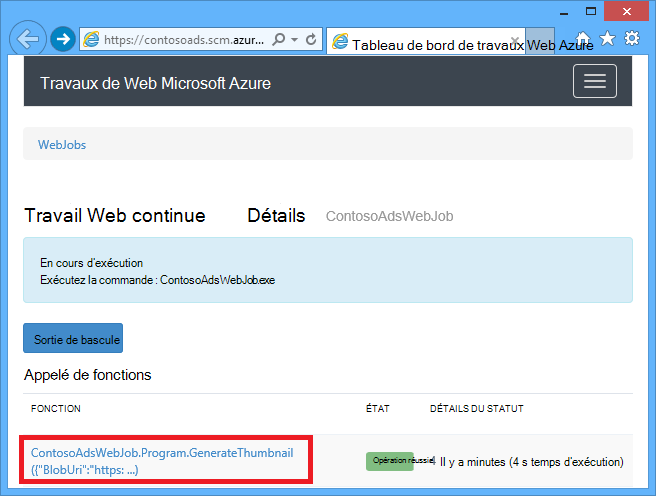

<properties
    pageTitle="Créer un WebJob de .NET dans le Service d’application Azure | Microsoft Azure"
    description="Créer une application à plusieurs niveaux à l’aide d’ASP.NET MVC et Azure. L’exécution de fin avant dans une application web dans le Service d’application Azure et le serveur principal s’exécute comme un WebJob. L’application utilise Entity Framework, base de données SQL et les files d’attente de stockage Azure et BLOB."
    services="app-service"
    documentationCenter=".net"
    authors="tdykstra"
    manager="wpickett"
    editor="mollybos"/>

<tags
    ms.service="app-service"
    ms.workload="na"
    ms.tgt_pltfrm="na"
    ms.devlang="na"
    ms.topic="article"
    ms.date="10/28/2016"
    ms.author="tdykstra"/>

# Créer un WebJob de .NET dans le Service d’application Azure

Ce didacticiel explique comment écrire du code pour une application ASP.NET MVC 5 n-tier simple qui utilise le [Kit de développement logiciel WebJobs](websites-dotnet-webjobs-sdk.md).

Le [Kit de développement logiciel WebJobs](websites-webjobs-resources.md) vise à simplifier le code que vous écrivez pour les tâches courantes qu’un WebJob peut effectuer, telles que le traitement d’image, de traitement de la file d’attente, RSS agrégation, gestion des fichiers et l’envoi d’e-mails. Le SDK WebJobs possède des fonctionnalités intégrées pour travailler avec le stockage Azure et Bus de Service, tâches de planification et de gestion des erreurs et de nombreux autres scénarios courants. En outre, il est conçu pour être extensible, et il est un [référentiel de code source pour les extensions d’ouvrir](https://github.com/Azure/azure-webjobs-sdk-extensions/wiki/Binding-Extensions-Overview).

L’exemple d’application est un forum de publicité. Les utilisateurs peuvent télécharger des images pour les publicités, et un processus de back-end convertit les images miniatures. La page de liste de publicité affiche les miniatures, et la page de détails de publicité affiche l’image en taille réelle. Voici une capture d’écran :

Cet exemple d’application fonctionne avec les [files d’attente Azure](http://www.asp.net/aspnet/overview/developing-apps-with-windows-azure/building-real-world-cloud-apps-with-windows-azure/queue-centric-work-pattern) et [BLOB Azure](http://www.asp.net/aspnet/overview/developing-apps-with-windows-azure/building-real-world-cloud-apps-with-windows-azure/unstructured-blob-storage). Ce didacticiel indique comment déployer l’application de [Service d’application Azure](http://go.microsoft.com/fwlink/?LinkId=529714) et [Base de données de SQL Azure](http://msdn.microsoft.com/library/azure/ee336279).

## Conditions préalables

Ce didacticiel suppose que vous savez comment travailler avec des projets [ASP.NET MVC 5](http://www.asp.net/mvc/tutorials/mvc-5/introduction/getting-started) dans Visual Studio.

Ce didacticiel a été écrit pour Visual Studio 2013. Si vous n’avez pas déjà de Visual Studio, il va être installé pour vous automatiquement lorsque vous installez le Kit de développement Azure pour .NET.

Le didacticiel peut être utilisé avec Visual Studio 2015, mais avant d’exécuter l’application localement vous devez modifier le `Data Source` fait partie de la chaîne de connexion SQL Server LocalDB dans les fichiers Web.config et App.config de `Data Source=(localdb)\v11.0` à `Data Source=(LocalDb)\MSSQLLocalDB`. 

> [AZURE.NOTE] Vous avez besoin d’un compte Azure pour compléter ce didacticiel :
  >
  > + Vous pouvez [Ouvrir un compte Azure gratuitement](https://azure.microsoft.com/pricing/free-trial/?WT.mc_id=A261C142F): vous obtenez des crédits vous permet d’essayer les services Azure payés et même après leur utilisation jusqu'à vous pouvez conserver le compte et utilisation libre des services Azure, tels que les sites Web. Votre carte de crédit ne sera jamais être débitée, sauf si vous modifiez vos paramètres explicitement et que vous demandez à percevoir.
  >
  > + Vous pouvez [activer des avantages pour les abonnés MSDN](https://azure.microsoft.com/pricing/member-offers/msdn-benefits-details/?WT.mc_id=A261C142F): MSDN votre abonnement fournit les crédits chaque mois que vous pouvez utiliser pour des services Azure payés.
  >
  >Si vous souhaitez commencer avec le Service d’application Azure avant l’ouverture d’un compte Azure, accédez à [Essayer le Service application](http://go.microsoft.com/fwlink/?LinkId=523751), où vous pouvez créer une application web de courte durée starter immédiatement dans le Service d’application. Aucune carte de crédit obligatoire ; aucun des engagements.

## Vous allez apprendre

Ce didacticiel montre comment effectuer les tâches suivantes :

* Activer votre machine de développement Azure en installant le Kit de développement Azure.
* Créez un projet d’Application Console qui déploie automatiquement sous la forme d’un WebJob d’Azure lorsque vous déployez le projet web associé.
* Tester un back-end WebJobs SDK localement sur l’ordinateur de développement.
* Publier une application avec un back-end WebJobs pour une application web dans le Service d’application.
* Télécharger des fichiers et de les stocker dans le service d’objet Blob d’Azure.
* Le Kit de développement logiciel WebJobs Azure permet de travailler avec des objets BLOB et les files d’attente de stockage Azure.

## Architecture de l’application

L’exemple d’application utilise le [modèle de travail centré sur la file d’attente](http://www.asp.net/aspnet/overview/developing-apps-with-windows-azure/building-real-world-cloud-apps-with-windows-azure/queue-centric-work-pattern) pour décharger le processeur de manière intensive de la création de miniatures à un processus de back-end.

L’application stocke des annonces dans une base de données SQL, à l’aide de Entity Framework Code First pour créer les tables et d’accéder aux données. Pour chaque annonce, la base de données stocke les deux URL : un pour l’image en taille réelle et un pour la miniature.

Lorsqu’un utilisateur télécharge une image, l’application web stocke l’image dans un [blob d’Azure](http://www.asp.net/aspnet/overview/developing-apps-with-windows-azure/building-real-world-cloud-apps-with-windows-azure/unstructured-blob-storage), et stocke les informations d’Active Directory dans la base de données avec une URL qui pointe vers l’objet blob. Dans le même temps, il écrit un message à une file d’attente Azure. Dans un processus de back-end s’exécutant comme un WebJob d’Azure, le SDK WebJobs interroge la file d’attente pour les nouveaux messages. Lorsqu’un nouveau message s’affiche, le WebJob crée une miniature de l’image et met à jour le champ de base de données URL miniature pour cette annonce. Voici un diagramme qui montre l’interagissent entre les parties de l’application :

[AZURE.INCLUDE [install-sdk](../../includes/install-sdk-2015-2013.md)]

Les didacticiels instructions s’appliquent à Azure SDK pour .NET 2.7.1 ou ultérieure.

## Créer un compte de stockage Azure

Un compte de stockage Azure fournit des ressources pour le stockage des données de file d’attente et l’objet blob dans le nuage. Il est également utilisé par le SDK WebJobs pour stocker les données de l’enregistrement du tableau de bord.

Dans une application réelle, vous créez en général des comptes séparés pour application données par rapport aux données de journalisation et est séparé des comptes pour les données de test par rapport aux données de production. Pour ce didacticiel, vous allez utiliser qu’un seul compte.

1. Ouvrez la fenêtre de **l’Explorateur de serveurs** dans Visual Studio.

2. Cliquez sur le nœud **d’Azure** , puis cliquez sur **se connecter à Microsoft Azure**.

3. Ouvrez une session à l’aide de vos informations d’identification Azure.

5. Droit de **stockage** sous le nœud Azure, puis cliquez sur **Créer un compte de stockage**.

3. Dans la boîte de dialogue **Créer un compte de stockage** , entrez un nom pour le compte de stockage.

    Le nom doit être doit être unique (l’aucun autre compte de stockage Azure ne peut avoir le même nom). Si le nom que vous entrez est déjà en cours d’utilisation, vous obtiendrez une chance de le modifier.

    L’URL pour accéder à votre compte de stockage sera *{nom}*. core.windows.net.

5. Définissez la liste déroulante **région ou un groupe d’affinité** à la région le plus proche de vous.

    Ce paramètre spécifie le centre de données Azure hébergera votre compte de stockage. Pour ce didacticiel, votre choix ne sont pas faire la différence notable. Toutefois, pour une application web de production, vous souhaitez que votre serveur web et votre compte de stockage pour être dans la même région afin de réduire les frais de sortie de latence et de données. L’application web (que vous allez créer plus loin) datacenter doit être aussi proche que possible pour les navigateurs, l’accès à l’application web afin de réduire la latence.

6. Affectez la liste déroulante de **réplication** **redondants localement**.

    Lors de la réplication géographique est activée pour un compte de stockage, le contenu stocké est répliqué sur un centre de données secondaire pour permettre le basculement à cet emplacement en cas de sinistre majeur dans l’emplacement principal. Geo-réplication peut entraîner des coûts supplémentaires. Pour les comptes de test et de développement, vous ne souhaitez généralement payer pour la réplication de la zone géographique. Pour plus d’informations, voir [créer, gérer, ou de supprimer un compte de stockage](../storage-create-storage-account/#replication-options).

5. Cliquez sur **créer**.

    

## Télécharger l’application

1. Téléchargez et décompressez le [complété solution](http://code.msdn.microsoft.com/Simple-Azure-Website-with-b4391eeb).

2. Démarrez Visual Studio.

3. Dans le menu **fichier** , choisissez **Ouvrir > Projet/Solution**, recherchez où vous avez téléchargé la solution et puis ouvrez le fichier solution.

4. Appuyez sur CTRL + MAJ + B pour générer la solution.

    Par défaut, Visual Studio restaure automatiquement le contenu du package NuGet, qui ne figurait pas dans le fichier *.zip* . Si les packages ne sont pas restaurées, installez-les manuellement en cliquant le bouton **restaurer** en haut à droite de la boîte de dialogue **Manage NuGet Packages de Solution** .

5. Dans l' **Explorateur de solutions**, vérifiez que **ContosoAdsWeb** est sélectionné comme projet de démarrage.

## Configurer l’application pour utiliser votre compte de stockage

1. Dans le projet ContosoAdsWeb, ouvrez le fichier *Web.config* de l’application.

    Le fichier contient une chaîne de connexion SQL et une chaîne de connexion de stockage Azure pour travailler avec des objets BLOB et les files d’attente.

    La chaîne de connexion SQL pointe vers une base de données [SQL Server Express LocalDB](http://msdn.microsoft.com/library/hh510202.aspx) .

    La chaîne de connexion de stockage est un exemple qui contient des espaces réservés pour la clé d’accès et le nom du compte stockage. Vous allez le remplacer par une chaîne de connexion qui a le nom et la clé de votre compte de stockage.  

    <pre class="prettyprint">&lt;connectionStrings&gt;
   &lt;ajouter nom = « ContosoAdsContext » connectionString = "Source de données = (localdb), \v11.0 ; Catalogue initial = ContosoAds ; Integrated Security = True ; MultipleActiveResultSets = True ; » providerName="System.Data.SqlClient » /&gt;
   &lt;ajouter nom = « AzureWebJobsStorage » connectionString =" DefaultEndpointsProtocol = https ; Nom de compte =<mark>[nom_compte]</mark>; AccountKey =<mark>[accesskey]</mark>« /&gt; 
    &lt;/connectionStrings      &gt;</pre>

    La chaîne de connexion de stockage est nommée AzureWebJobsStorage, car c’est celui que le SDK WebJobs utilise par défaut. Le nom même est utilisé ici pour avoir à les ne définir qu’une seule valeur de chaîne de connexion dans l’environnement Azure.

2. Dans l' **Explorateur de serveurs**, cliquez sur votre compte de stockage sous le nœud de **stockage** , puis cliquez sur **Propriétés**.

    

3. Dans la fenêtre **Propriétés** , cliquez sur **Clés de compte de stockage**, puis cliquez sur le bouton de sélection.

    

4. Copier la **chaîne de connexion**.

    

5. Remplacez la chaîne de connexion de stockage dans le fichier *Web.config* avec la chaîne de connexion que vous venez de copier. Assurez-vous de que sélectionner tous les éléments à l’intérieur des guillemets, mais non compris entre guillemets avant de coller.

6. Ouvrez le fichier *App.config* dans le projet ContosoAdsWebJob.

    Ce fichier a deux chaînes de connexion de stockage, l’autre pour les données d’application et une pour la connexion. Vous pouvez utiliser des comptes de stockage distincte pour la journalisation et des données d’application, et vous pouvez utiliser [plusieurs comptes de stockage pour les données](https://github.com/Azure/azure-webjobs-sdk/blob/master/test/Microsoft.Azure.WebJobs.Host.EndToEndTests/MultipleStorageAccountsEndToEndTests.cs). Pour ce didacticiel, vous allez utiliser un compte de stockage unique. Les chaînes de connexion possèdent des espaces réservés pour les clés de compte de stockage. 
    <pre class="prettyprint">&lt;configuration de&gt; 
    &lt;connectionStrings&gt;
   &lt;ajouter nom = « AzureWebJobsDashboard » connectionString = "DefaultEndpointsProtocol = https ; Nom de compte =<mark>[nom_compte]</mark>; AccountKey =<mark>[accesskey]</mark>« /&gt;
   &lt;ajouter nom = « AzureWebJobsStorage » connectionString = "DefaultEndpointsProtocol = https ; Nom de compte =<mark>[nom_compte]</mark>; AccountKey =<mark>[accesskey]</mark>« /&gt;
   &lt;ajouter nom = « ContosoAdsContext » connectionString = "Source de données = (localdb), \v11.0 ; Catalogue initial = ContosoAds ; Integrated Security = True ; MultipleActiveResultSets = True ; » /&gt; 
    &lt;/connectionStrings&gt;
   &lt;démarrage&gt;
   &lt;supportedRuntime version = « v4.0 » sku = ». NETFramework, Version v4.5 de = » /&gt; 
    &lt;/startup&gt;
&lt;configuration                             &gt;</pre>

    Par défaut, le SDK WebJobs recherche les chaînes de connexion nommées AzureWebJobsStorage et AzureWebJobsDashboard. Comme alternative, vous pouvez [banque de la chaîne de connexion cependant vous souhaitez et passez explicitement à la `JobHost` objet](websites-dotnet-webjobs-sdk-storage-queues-how-to.md#config).

7. Remplacez les deux chaînes de connexion de stockage avec la chaîne de connexion que vous avez copié précédemment.

8. Enregistrez vos modifications.

## Exécutez l’application localement

1. Pour démarrer le site Web frontal web de l’application, appuyez sur CTRL + F5.

    Le navigateur par défaut s’ouvre à la page d’accueil. (Le projet web s’exécute, car vous avez rendait le projet de démarrage.)

    

2. Pour démarrer le serveur de WebJob principal de l’application, cliquez sur le projet ContosoAdsWebJob dans **L’Explorateur de solutions**, puis cliquez sur **débogage** > **Démarrer une nouvelle instance**.

    Une fenêtre d’application de console s’ouvre et affiche les messages de journalisation qui indique l’objet de la JobHost du Kit de développement logiciel WebJobs a commencé à s’exécuter.

    

3. Dans votre navigateur, cliquez sur **créer une annonce**.

4. Entrez quelques données de test et sélectionner une image à télécharger, puis cliquez sur **créer**.

    

    L’application accède à la page d’Index, mais il n’affiche pas une miniature pour la nouvelle annonce car ce traitement n’a pas encore s’est produit.

    Pendant ce temps, après une brève attente dans la fenêtre de l’application console, un message d’enregistrement indique qu’un message de la file d’attente a été reçu et qu’elle a été traité.

    

5. Une fois que vous consultez l’enregistrement des messages dans la fenêtre de l’application console, actualisez la page d’Index pour afficher la miniature.

    

6. Cliquez sur **Détails** pour votre annonce pour voir l’image en taille réelle.

    

Vous avez déjà exécuté l’application sur votre ordinateur local et qu’il utilise un SQL Server, base de données située sur votre ordinateur, mais il travaille avec les files d’attente et les objets BLOB dans le nuage. Dans la section suivante vous allez exécuter l’application dans le nuage, à l’aide d’une base de données ainsi que des blobs de nuage et des files d’attente.  

## Exécutez l’application dans le nuage

Vous allez effectuer les étapes suivantes pour exécuter l’application dans le nuage :

* Déployer des applications Web. Visual Studio crée automatiquement une nouvelle application web dans l’application de Service et une instance de base de données SQL.
* Configurer l’application web pour utiliser votre compte Azure SQL de base de données et de stockage.

Une fois que vous avez créé des annonces lors de l’exécution dans le nuage, vous allez afficher le tableau de bord WebJobs SDK pour voir la riche qu’il a à offrir des fonctionnalités d’analyse.

### Déployer des applications Web

1. Fermez le navigateur et la fenêtre de l’application console.

2. Dans l' **Explorateur de solutions**, cliquez sur le projet ContosoAdsWeb, puis cliquez sur **Publier**.

3. Dans le **profil** de l’Assistant **Publication sur le Web** , cliquez sur **les applications web Microsoft Azure**.

    

4. Connectez-vous à Azure si vous n’êtes pas encore connecté.

5. Cliquez sur **Nouveau**.

    La boîte de dialogue peut différer légèrement selon la version du SDK Azure pour .NET que vous avez installé.

    

6. Dans la boîte de dialogue **créer des applications de web sur Microsoft Azure** , entrez un nom unique dans la zone **nom de l’application Web** .

    L’URL complète est constituée de ce que vous entrez ici et. azurewebsites.net (comme indiqué en regard de la zone de texte **nom de l’application Web** ). Par exemple, si le nom de l’application web est ContosoAds, l’URL sera ContosoAds.azurewebsites.net.

7. Dans la liste déroulante [plan de Service d’application](../app-service/azure-web-sites-web-hosting-plans-in-depth-overview.md) , choisissez **créer un plan de Service de l’application**. Entrez un nom pour le plan de Service de l’application, par exemple ContosoAdsPlan.

8. Dans la liste déroulante [groupe de ressources](../azure-resource-manager/resource-group-overview.md) , choisissez **créer un groupe de ressources**.

9. Entrez un nom pour le groupe de ressources, par exemple ContosoAdsGroup.

10. Dans la liste déroulante de la **zone** , sélectionnez la même région que vous avez choisi pour votre compte de stockage.

    Ce paramètre spécifie le centre de données Azure votre application web s’exécute dans. Conserver le compte de stockage et d’application web dans le même centre de données réduit les frais de sortie de latence et de données.

11. Cliquez sur **créer un nouveau serveur**dans la liste déroulante **serveur de base de données** .

12. Entrez un nom pour le serveur de base de données, comme les contosoadsserver + un numéro ou votre nom pour que le nom de serveur unique. 

    Le nom du serveur doit être unique. Il peut contenir des lettres en minuscules, des chiffres et des traits d’union. Il ne peut pas contenir un trait d’union. 

    Vous pouvez également, si votre abonnement déjà dispose d’un serveur, vous pouvez sélectionner ce serveur dans la liste déroulante.

12. Entrez un **nom de base de données d’utilisateur** d’administrateur et le **mot de passe de base de données**.

    Si vous avez sélectionné la **nouvelle base de données SQL server** ne sont pas la saisie d’un nom existant et un mot de passe ici, vous saisissez un nouveau nom et un mot de passe que vous définissez maintenant pour une utilisation ultérieure lorsque vous accédez à la base de données. Si vous avez sélectionné un serveur que vous avez créé précédemment, vous devrez faire pour le mot de passe pour le compte d’utilisateur d’administration que vous avez déjà créé.

13. Cliquez sur **créer**.

    

    Visual Studio crée la solution, le projet web, la web application dans Azure et l’instance de base de données de SQL Azure.

14. Dans l’étape de **connexion** de l’Assistant **Publication sur le Web** , cliquez sur **suivant**.

    

15. Dans l’étape de **paramètres** , désactivez la case à cocher **utiliser cette chaîne de connexion lors de l’exécution** , puis cliquez sur **suivant**.

    

    Vous n’avez pas besoin d’utiliser la boîte de dialogue Publier pour définir la chaîne de connexion SQL, car vous allez définir ultérieurement cette valeur dans l’environnement Azure.

    Vous pouvez ignorer les avertissements de cette page.

    * Le compte de stockage vous utilisez normalement lorsque les exécute dans Azure est différent de celui que vous utilisez lorsque vous exécutez localement, mais pour ce didacticiel, vous utilisez le même que celui dans les deux environnements. Ainsi, la chaîne de connexion AzureWebJobsStorage n’a pas besoin d’être transformé. Même si vous ne souhaitez pas utiliser un compte différent de stockage dans le nuage, vous n’avez pas besoin de transformer la chaîne de connexion parce que l’application utilise un paramètre d’environnement Azure lorsqu’il s’exécute dans Azure. Vous le verrez plus loin dans le didacticiel.

    * Pour ce didacticiel, que vous ne comptez pas apporter de modifications au modèle de données utilisé pour la base de données ContosoAdsContext, il est donc inutile d’utiliser des Migrations premier du Code Entity Framework pour le déploiement. Tout d’abord, code crée automatiquement une nouvelle heure de la première de la base de données, l’application tente d’accéder aux données SQL.

    Pour ce didacticiel, les valeurs par défaut des options sous **Options de publication du fichier** sont correctement.

16. Dans **l’Aperçu** , cliquez sur **Démarrer l’aperçu**.

    

    Vous pouvez ignorer l’avertissement sur aucune base de données en cours de publication. Entity Framework Code First crée la base de données ; Il n’a pas besoin d’être publié.

    La fenêtre d’aperçu montre que binaires et les fichiers de configuration du projet WebJob seront copiés dans le dossier *app_data\jobs\continuous* de l’application web.

    

17. Cliquez sur **Publier**.

    Visual Studio déploie l’application et ouvre l’URL de la page d’accueil dans le navigateur.

    Vous ne pourrez pas utiliser l’application web que lorsque vous définissez des chaînes de connexion dans l’environnement Azure dans la section suivante. Vous verrez une page d’erreur ou de la page d’accueil en fonction de l’application et la base de données création options web que vous avez choisi précédemment.

### Configurer l’application web pour utiliser votre compte Azure SQL de base de données et de stockage.

Il s’agit des raisons de sécurité afin [d’éviter des informations sensibles telles que les chaînes de connexion dans des fichiers qui sont stockés dans des référentiels de code source](http://www.asp.net/aspnet/overview/developing-apps-with-windows-azure/building-real-world-cloud-apps-with-windows-azure/source-control#secrets). Azure fournit un moyen de faire cela : vous pouvez définir la chaîne de connexion et d’autres valeurs de paramètre dans l’environnement Azure, et les API de configuration ASP.NET prélever automatiquement ces valeurs lorsque l’application s’exécute dans Azure. Vous pouvez définir ces valeurs dans Azure en utilisant **l’Explorateur de serveurs**, le portail d’Azure, Windows PowerShell ou l’interface de ligne de commande multiplateforme. Pour plus d’informations, consultez [comment les chaînes d’Application et de travail des chaînes de connexion](/blog/2013/07/17/windows-azure-web-sites-how-application-strings-and-connection-strings-work/).

Dans cette section **l’Explorateur de serveurs** vous permet de définir des valeurs de chaîne de connexion dans Azure.

7. Dans l' **Explorateur de serveurs**, cliquez sur votre application web sous **Azure > Application Service > {votre groupe de ressources}**, puis cliquez sur **Paramètres d’affichage**.

    La fenêtre **Azure Web App** s’ouvre sur l’onglet **Configuration** .

9. Remplacez le nom de la chaîne de connexion DefaultConnection ContosoAdsContext.

    Azure créé automatiquement cette chaîne de connexion lorsque vous avez créé l’application web avec une base de données associée, elle a déjà la valeur de chaîne de connexion de droite. Vous modifiez simplement le nom d’à ce que votre code de recherche.

9. Ajoutez deux nouvelles chaînes de connexion, nommés AzureWebJobsStorage et AzureWebJobsDashboard. Définir le type personnalisé et définissez la valeur de chaîne de connexion à la même valeur que celle que vous avez utilisé précédemment pour les fichiers *Web.config* et *App.config* . (Assurez-vous que vous n’incluez pas les guillemets et incluez la chaîne de connexion entière, pas seulement la touche d’accès rapide,.)

    Ces chaînes de connexion sont utilisés par le SDK WebJobs, l’autre pour les données de l’application et l’autre pour l’enregistrement. Comme vous avez vu précédemment, l’un pour les données d’application est également utilisé par le code de frontal web.

9. Cliquez sur **Enregistrer**.

    

10. Dans l' **Explorateur de serveurs**, cliquez sur l’application web, puis cliquez sur **Arrêter**.

12. Une fois que l’application web s’arrête, l’application web avec le bouton droit à nouveau, puis cliquez sur **Démarrer**.

    Le WebJob démarre automatiquement lorsque vous publiez, mais il s’arrête lorsque vous modifiez la configuration. Vous pouvez redémarrer l’application web pour redémarrer ou redémarrer le WebJob dans le [Portail Azure](http://go.microsoft.com/fwlink/?LinkId=529715). Il est généralement recommandé de redémarrer l’application web après une modification de configuration.

9. Actualiser la fenêtre du navigateur avec l’URL d’application web dans la barre d’adresses.

    La page d’accueil s’affiche.

10. Créer une annonce, comme vous l’avez fait lorsque vous avez exécuté l’application localement.

    La page Index s’affiche sans une miniature au premier abord.

11. Actualiser la page après quelques secondes, la miniature s’affiche.

    Si la miniature ne s’affiche pas, vous devrez peut-être attendez une minute pour le WebJob de redémarrer. Si après un temps n’apparaît toujours pas la miniature lorsque vous actualisez la page, la WebJob a ne peut-être pas démarré automatiquement. Dans ce cas, accédez à l’onglet WebJobs dans la page de [portail classique](https://manage.windowsazure.com) pour votre application web, puis cliquez sur **Démarrer**.

### Afficher le tableau de bord WebJobs SDK

1. Dans le [portail classique](https://manage.windowsazure.com), sélectionnez votre application web.

2. Cliquez sur l’onglet **WebJobs** .

3. Cliquez sur l’URL dans la colonne de journaux pour votre WebJob.

    

    Un nouvel onglet de navigateur s’ouvre sur le tableau de bord WebJobs SDK. Le tableau de bord montre que le WebJob est en cours d’exécution et qu’il présente une liste des fonctions de votre code qui a déclenché le SDK WebJobs.

4. Cliquez sur l’une des fonctions pour afficher les détails de son exécution.

    

    

    Sur cette page, le bouton de **Fonction de relecture** provoque le framework WebJobs SDK appeler la fonction à nouveau, et il vous donne l’occasion de modifier les données passées en premier à la fonction.

>[AZURE.NOTE] Lorsque vous avez terminé le test, supprimez l’application web et l’instance de base de données SQL. L’application web est gratuite, mais l’instance de base de données de SQL et d’un compte de stockage accumuler de frais (minimum en raison de la petite taille). Également, si vous laissez l’application web en cours d’exécution, toute personne qui trouve votre adresse URL peut créer et d’afficher des annonces. Dans le portail classique, accédez à l’onglet de **tableau de bord** pour votre application web, puis cliquez sur le bouton **Supprimer** en bas de la page. Vous pouvez ensuite sélectionner une case à cocher pour supprimer l’instance de base de données SQL en même temps. Si vous souhaitez simplement empêcher d’autres utilisateurs d’accéder à l’application web, cliquez sur **Arrêter** . Dans ce cas, les frais continuera à accumuler pour le compte de base de données SQL et du stockage. Vous pouvez suivre une procédure similaire pour supprimer le compte de stockage et de base de données SQL lorsque vous n’avez plus besoin.

## Création de l’application à partir de zéro

Dans cette section, vous allez effectuer les tâches suivantes :

* Créer une solution Visual Studio avec un projet web.
* Ajouter un projet de bibliothèque de classes de la couche d’accès aux données qui est partagée entre le back-end et front-end.
* Ajouter un projet d’Application Console pour le serveur principal, avec un déploiement WebJobs activé.
* Ajouter des packages NuGet.
* Ensemble de références de projet.
* Copiez les fichiers de code et de la configuration de l’application à partir de l’application téléchargée que vous avez utilisé à la section précédente de ce didacticiel.
* Passez en revue les parties du code qui fonctionnent avec les objets BLOB Azure et les files d’attente et le SDK WebJobs.

### Créer une solution Visual Studio avec un projet web et un projet bibliothèque de classes

1. Dans Visual Studio, choisissez **Nouveau** > **projet** à partir du menu **fichier** .

2. Dans la boîte de dialogue **Nouveau projet** , sélectionnez **Visual C#** > **Web** > **ASP.NET Web Application**.

3. Nommez le projet ContosoAdsWeb, nom de la solution ContosoAdsWebJobsSDK (modifier le nom de la solution si vous êtes le plaçant dans le même dossier que la solution de téléchargement), puis cliquez sur **OK**.

    

5. Dans la boîte de dialogue **Nouveau projet ASP.NET** , choisissez le modèle MVC et désactivez la case à cocher **hôte dans le nuage** sous **Microsoft Azure**.

    Sélection **d’hôte dans le nuage** permet à Visual Studio de créer automatiquement une nouvelle application web Azure et base de données de SQL. Étant donné que vous avez déjà créé ces précédemment, vous n’avez pas besoin de réalisent maintenant la création du projet. Si vous souhaitez créer un nouveau, activez la case à cocher. Vous pouvez ensuite configurer la nouvelle application web et la base de données SQL la même manière que vous l’avez fait précédemment lorsque vous avez déployé l’application.

5. Cliquez sur **Modifier l’authentification**.

    

7. Dans la boîte de dialogue **Modifier l’authentification** , sélectionnez **Aucune authentification**, puis cliquez sur **OK**.

    

8. Dans la boîte de dialogue **Nouveau projet ASP.NET** , cliquez sur **OK**.

    Visual Studio crée la solution et le projet web.

9. Dans l' **Explorateur de solutions**, avec le bouton droit de la solution (et non sur le projet), puis sélectionnez **Ajouter** > **Nouveau projet**.

11. Dans la boîte de dialogue **Ajouter un nouveau projet** , sélectionnez **Visual C#** > **Bureau Windows** > modèle**Bibliothèque de classes** .  

10. Nommez le projet *ContosoAdsCommon*, puis cliquez sur **OK**.

    Ce projet contient le contexte de l’Entity Framework et le modèle de données qui seront utilisé par le front-end et le back-end. En guise d’alternative, vous pouvez définir les classes associées à EF dans le projet web et faire référence à ce projet à partir du projet WebJob. Mais ensuite votre projet WebJob une référence aux assemblys web qui n’a pas besoin.

### Ajouter un projet d’Application Console qui dispose de déploiement WebJobs activée

1. Cliquez sur le projet web (pas la solution ou le projet de bibliothèque de classes), puis cliquez sur **Ajouter** > **Nouveau projet WebJob d’Azure**.

    

2. Dans la boîte de dialogue **Ajouter des WebJob Azure** , entrez ContosoAdsWebJob le **nom du projet** et le **nom de WebJob**. Laisser **WebJob s’exécuter en mode** défini pour **S’exécuter en permanence**.

3.  Cliquez sur **OK**.

    Visual Studio crée une application Console qui est configurée pour déployer comme un WebJob chaque fois que vous déployez le projet web. Pour ce faire, il a effectué les tâches suivantes après avoir créé le projet :

    * Ajouté un fichier de *webjob-publier-settings.json* dans le dossier Propriétés du projet WebJob.
    * Ajouter un fichier *webjobs-list.json* dans le dossier Propriétés du projet web.
    * Installé le package NuGet de Microsoft.Web.WebJobs.Publish dans le projet WebJob.

    Pour plus d’informations sur ces modifications, consultez [comment déployer des WebJobs à l’aide de Visual Studio](websites-dotnet-deploy-webjobs.md).

### Ajouter des packages NuGet

Le modèle de projet de nouveau pour un projet de WebJob installe automatiquement le package NuGet du Kit de développement logiciel WebJobs [Microsoft.Azure.WebJobs](http://www.nuget.org/packages/Microsoft.Azure.WebJobs) et ses dépendances.

L’une des dépendances WebJobs SDK qui est installé automatiquement dans le projet WebJob est la bibliothèque de Client stockage Azure (SCL). Toutefois, vous devez ajouter le projet web pour travailler avec des objets BLOB et les files d’attente.

1. Ouvrez la boîte de dialogue **Gérer les Packages NuGet** pour la solution.

2. Dans le volet gauche, sélectionnez **les packages installés**.

3. Recherchez le package de *Stockage Azure* , puis cliquez sur **Gérer**.

4. Dans la zone **Sélectionnez les projets** , activez la case à cocher **ContosoAdsWeb** , puis cliquez sur **OK**.

    Les trois projets utilisent l’Entity Framework pour travailler avec des données dans la base de données de SQL.

5. Dans le volet gauche, sélectionnez **en ligne**.

6. Recherchez le package NuGet *EntityFramework* et installer dans les trois projets.

### Définir les références de projet

Les WebJob projets et fonctionnent avec la base de données SQL, afin que les deux ont besoin d’une référence au projet ContosoAdsCommon.

1. Dans le projet ContosoAdsWeb, définissez une référence au projet ContosoAdsCommon. (Droit sur le projet ContosoAdsWeb, puis cliquez sur **Ajouter** > **référence**. Dans la boîte de dialogue **Gestionnaire de référence** , sélectionnez **Solution** > **projets** > **ContosoAdsCommon**, puis cliquez sur **OK**.)

1. Dans le projet ContosoAdsWebJob, définissez une référence au projet ContosAdsCommon.

    Le projet WebJob a besoin de références pour travailler avec des images et pour l’accès à des chaînes de connexion.

3. Dans le projet ContosoAdsWebJob, définissez une référence à `System.Drawing` et `System.Configuration`.

### Ajouter des fichiers de code et de la configuration

Ce didacticiel n’indique pas comment [créer des vues à l’aide de la structure et les contrôleurs MVC](http://www.asp.net/mvc/tutorials/mvc-5/introduction/getting-started), comment [écrire du code Entity Framework qui fonctionne avec les bases de données SQL Server](http://www.asp.net/mvc/tutorials/getting-started-with-ef-using-mvc)ou [les bases d’asynchrone de programmation dans ASP.NET 4.5](http://www.asp.net/aspnet/overview/developing-apps-with-windows-azure/building-real-world-cloud-apps-with-windows-azure/web-development-best-practices#async). Sorte que reste à faire est de copier les fichiers de code et de la configuration de la solution téléchargée dans la nouvelle solution. Une fois que vous le faites, les sections suivantes Montrez et expliquent les principales parties du code.

Pour ajouter des fichiers à un projet ou un dossier, cliquez droit sur le projet ou le dossier, puis cliquez sur **Ajouter** > **Élément existant**. Sélectionnez les fichiers que vous souhaitez et cliquez sur **Ajouter**. Si vous êtes invité à remplacer les fichiers existants, cliquez sur **Oui**.

1. Dans le projet ContosoAdsCommon, supprimez le fichier *Class1.cs* et ajouter à la place les fichiers suivants à partir du projet téléchargé.

    - *AD.cs*
    - *ContosoAdscontext.cs*
    - *BlobInformation.cs*  

2. Dans le projet ContosoAdsWeb, ajoutez les fichiers suivants à partir du projet téléchargé.

    - *Web.config*
    - *Global.asax.cs*  
    - Dans le dossier *contrôleurs* : *AdController.cs*
    - Dans le dossier *Views\Shared* : fichier *_Layout.cshtml*
    - Dans le dossier *Views\Home* : *Index.cshtml*
    - Dans le dossier *Views\Ad* (créez d’abord le dossier) : cinq fichiers *.cshtml*  

3. Dans le projet ContosoAdsWebJob, ajoutez les fichiers suivants à partir du projet téléchargé.

    - *App.config* (modifier le filtre de type de fichier à **Tous les fichiers**)
    - *Program.cs*
    - *Functions.cs*

Vous pouvez désormais créer, exécuter et déployer l’application, comme indiqué précédemment dans le didacticiel. Avant cela, toutefois, arrêter la WebJob qui est toujours en cours d’exécution dans la première application web que vous avez déployé sur. Dans le cas contraire ce WebJob traitera les messages de file d’attente créées localement ou par l’application en cours d’exécution dans une nouvelle application web, car tous utilisent le même compte de stockage.

## Examinez le code de l’application

Les sections suivantes expliquent le code relatifs au travail avec les BLOB WebJobs SDK et le stockage Azure et les files d’attente.

> [AZURE.NOTE] Pour le code spécifique à la WebJobs SDK, consultez les sections [Program.cs et Functions.cs](#programcs) .

### ContosoAdsCommon - Ad.cs

Le fichier Ad.cs définit un enum pour les catégories d’annonce et une classe d’entité POCO pour les informations d’Active Directory.

        public enum Category
        {
            Cars,
            [Display(Name="Real Estate")]
            RealEstate,
            [Display(Name = "Free Stuff")]
            FreeStuff
        }

        public class Ad
        {
            public int AdId { get; set; }

            [StringLength(100)]
            public string Title { get; set; }

            public int Price { get; set; }

            [StringLength(1000)]
            [DataType(DataType.MultilineText)]
            public string Description { get; set; }

            [StringLength(1000)]
            [DisplayName("Full-size Image")]
            public string ImageURL { get; set; }

            [StringLength(1000)]
            [DisplayName("Thumbnail")]
            public string ThumbnailURL { get; set; }

            [DataType(DataType.Date)]
            [DisplayFormat(DataFormatString = "{0:yyyy-MM-dd}", ApplyFormatInEditMode = true)]
            public DateTime PostedDate { get; set; }

            public Category? Category { get; set; }
            [StringLength(12)]
            public string Phone { get; set; }
        }

### ContosoAdsCommon - ContosoAdsContext.cs

La classe ContosoAdsContext Spécifie que la classe Active Directory est utilisée dans une collection de DbSet, Entity Framework stocke dans une base de données SQL.

        public class ContosoAdsContext : DbContext
        {
            public ContosoAdsContext() : base("name=ContosoAdsContext")
            {
            }
            public ContosoAdsContext(string connString)
                : base(connString)
            {
            }
            public System.Data.Entity.DbSet<Ad> Ads { get; set; }
        }

La classe possède deux constructeurs. Le premier est utilisé par le projet web et spécifie le nom de chaîne de connexion qui est stockée dans le fichier Web.config ou l’environnement d’exécution Azure. Le deuxième constructeur vous permet de passer la chaîne de connexion. Dans la mesure où il n’a pas de fichier Web.config, qui est nécessaire par le projet WebJob. Vous avez vu précédemment où cette chaîne de connexion a été stockée et vous verrez plus tard comment le code récupère la chaîne de connexion lorsqu’il instancie la classe DbContext.

### ContosoAdsCommon - BlobInformation.cs

Le `BlobInformation` classe est utilisée pour stocker des informations à propos d’un blob d’image dans un message de la file d’attente.

        public class BlobInformation
        {
            public Uri BlobUri { get; set; }

            public string BlobName
            {
                get
                {
                    return BlobUri.Segments[BlobUri.Segments.Length - 1];
                }
            }
            public string BlobNameWithoutExtension
            {
                get
                {
                    return Path.GetFileNameWithoutExtension(BlobName);
                }
            }
            public int AdId { get; set; }
        }

### ContosoAdsWeb - Global.asax.cs

Code qui est appelé à partir de la `Application_Start` méthode crée un conteneur de blob *d’images* et une file d’attente des *images* si elles n’existent pas déjà. Cela garantit que chaque fois que vous démarrez à l’aide d’un nouveau compte de stockage, le conteneur de l’objet blob requis et la file d’attente sont créées automatiquement.

Le code obtient l’accès au compte de stockage à l’aide de la chaîne de connexion de stockage à partir du fichier *Web.config* ou l’environnement d’exécution Azure.

        var storageAccount = CloudStorageAccount.Parse
            (ConfigurationManager.ConnectionStrings["AzureWebJobsStorage"].ToString());

Puis il obtient une référence au conteneur blob *images* , crée le conteneur s’il n’existe pas déjà et il définit des autorisations d’accès sur le nouveau conteneur. Par défaut, nouveaux conteneurs autorisent uniquement les clients avec des informations d’identification du compte de stockage accéder aux objets BLOB. L’application web doit les blobs en public afin qu’il peut afficher des images à l’aide des URL qui pointent vers les objets BLOB d’image.

        var blobClient = storageAccount.CreateCloudBlobClient();
        var imagesBlobContainer = blobClient.GetContainerReference("images");
        if (imagesBlobContainer.CreateIfNotExists())
        {
            imagesBlobContainer.SetPermissions(
                new BlobContainerPermissions
                {
                    PublicAccess = BlobContainerPublicAccessType.Blob
                });
        }

Un code similaire Obtient une référence à la file d’attente *thumbnailrequest* et crée une nouvelle file d’attente. Dans ce cas, aucune modification d’autorisations n’est nécessaire. 

        CloudQueueClient queueClient = storageAccount.CreateCloudQueueClient();
        var imagesQueue = queueClient.GetQueueReference("thumbnailrequest");
        imagesQueue.CreateIfNotExists();

### ContosoAdsWeb - _Layout.cshtml

Le fichier *_Layout.cshtml* définit le nom de l’application dans l’en-tête et le pied de page et crée une entrée de menu « Annonces ».

### ContosoAdsWeb - Views\Home\Index.cshtml

Le fichier *Views\Home\Index.cshtml* affiche les liens de catégorie sur la page d’accueil. Les liens de passent la valeur de l’entier de la `Category` enum dans une variable chaîne de requête à la page d’Index des annonces.

        <li>@Html.ActionLink("Cars", "Index", "Ad", new { category = (int)Category.Cars }, null)</li>
        <li>@Html.ActionLink("Real estate", "Index", "Ad", new { category = (int)Category.RealEstate }, null)</li>
        <li>@Html.ActionLink("Free stuff", "Index", "Ad", new { category = (int)Category.FreeStuff }, null)</li>
        <li>@Html.ActionLink("All", "Index", "Ad", null, null)</li>

### ContosoAdsWeb - AdController.cs

Dans *AdController.cs* fichier le constructeur appelle la `InitializeStorage` pour créer les objets de la bibliothèque de Client de stockage Azure qui fournissent une API permettant de travailler avec des objets BLOB et les files d’attente.

Puis le code obtient une référence au conteneur blob *images* comme vous l’avez vu précédemment dans *Global.asax.cs*. Tout cela, il définit un défaut [Réessayer la stratégie](http://www.asp.net/aspnet/overview/developing-apps-with-windows-azure/building-real-world-cloud-apps-with-windows-azure/transient-fault-handling) appropriée pour une application web. La stratégie de nouvelles tentatives par défaut backoff exponentielle se bloque l’application web pour plus d’une minute sur les tentatives répétées d’une erreur transitoire. La stratégie de nouvelles tentatives spécifiée ici attend trois secondes après chaque essayez de jusqu'à 3 tentatives.

        var blobClient = storageAccount.CreateCloudBlobClient();
        blobClient.DefaultRequestOptions.RetryPolicy = new LinearRetry(TimeSpan.FromSeconds(3), 3);
        imagesBlobContainer = blobClient.GetContainerReference("images");

Un code similaire Obtient une référence à la file d’attente des *images* .

        CloudQueueClient queueClient = storageAccount.CreateCloudQueueClient();
        queueClient.DefaultRequestOptions.RetryPolicy = new LinearRetry(TimeSpan.FromSeconds(3), 3);
        imagesQueue = queueClient.GetQueueReference("blobnamerequest");

La plupart du code de contrôleur est généralement utilisé pour travailler avec un modèle de données Entity Framework à l’aide d’une classe DbContext. Une exception est HttpPost `Create` méthode, qui télécharge un fichier et l’enregistre dans le stockage blob. Le classeur de modèles offre un objet [HttpPostedFileBase](http://msdn.microsoft.com/library/system.web.httppostedfilebase.aspx) à la méthode.

        [HttpPost]
        [ValidateAntiForgeryToken]
        public async Task<ActionResult> Create(
            [Bind(Include = "Title,Price,Description,Category,Phone")] Ad ad,
            HttpPostedFileBase imageFile)

Si l’utilisateur a sélectionné un fichier à télécharger, le code télécharge le fichier, l’enregistre dans un blob et met à jour l’enregistrement de base de données Active Directory avec une URL qui pointe vers l’objet blob.

        if (imageFile != null && imageFile.ContentLength != 0)
        {
            blob = await UploadAndSaveBlobAsync(imageFile);
            ad.ImageURL = blob.Uri.ToString();
        }

Le code qui effectue le téléchargement se trouve dans le `UploadAndSaveBlobAsync` méthode. Il crée un nom GUID de l’objet blob, télécharge et enregistre le fichier et renvoie une référence à l’objet blob enregistrée.

        private async Task<CloudBlockBlob> UploadAndSaveBlobAsync(HttpPostedFileBase imageFile)
        {
            string blobName = Guid.NewGuid().ToString() + Path.GetExtension(imageFile.FileName);
            CloudBlockBlob imageBlob = imagesBlobContainer.GetBlockBlobReference(blobName);
            using (var fileStream = imageFile.InputStream)
            {
                await imageBlob.UploadFromStreamAsync(fileStream);
            }
            return imageBlob;
        }

Après le HttpPost `Create` méthode télécharge un blob et mises à jour de la base de données, il crée un message de la file d’attente pour informer le processus principaux qu’une image est prête pour la conversion en une miniature.

        BlobInformation blobInfo = new BlobInformation() { AdId = ad.AdId, BlobUri = new Uri(ad.ImageURL) };
        var queueMessage = new CloudQueueMessage(JsonConvert.SerializeObject(blobInfo));
        await thumbnailRequestQueue.AddMessageAsync(queueMessage);

Le code de la HttpPost `Edit` méthode est similaire, sauf que si l’utilisateur sélectionne un nouveau fichier image des objets BLOB qui existent déjà pour cette annonce doit être supprimés.

        if (imageFile != null && imageFile.ContentLength != 0)
        {
            await DeleteAdBlobsAsync(ad);
            imageBlob = await UploadAndSaveBlobAsync(imageFile);
            ad.ImageURL = imageBlob.Uri.ToString();
        }

Voici le code qui supprime les objets BLOB lorsque vous supprimez une annonce :

        private async Task DeleteAdBlobsAsync(Ad ad)
        {
            if (!string.IsNullOrWhiteSpace(ad.ImageURL))
            {
                Uri blobUri = new Uri(ad.ImageURL);
                await DeleteAdBlobAsync(blobUri);
            }
            if (!string.IsNullOrWhiteSpace(ad.ThumbnailURL))
            {
                Uri blobUri = new Uri(ad.ThumbnailURL);
                await DeleteAdBlobAsync(blobUri);
            }
        }
        private static async Task DeleteAdBlobAsync(Uri blobUri)
        {
            string blobName = blobUri.Segments[blobUri.Segments.Length - 1];
            CloudBlockBlob blobToDelete = imagesBlobContainer.GetBlockBlobReference(blobName);
            await blobToDelete.DeleteAsync();
        }

### ContosoAdsWeb - Views\Ad\Index.cshtml et Details.cshtml

Le fichier *Index.cshtml* affiche les miniatures avec les autres données Active Directory :

        

Le fichier *Details.cshtml* affiche l’image en taille réelle :

        

### ContosoAdsWeb - Views\Ad\Create.cshtml et Edit.cshtml

Les fichiers *Create.cshtml* et *Edit.cshtml* spécifient le codage du formulaire qui permet d’obtenir le contrôleur de la `HttpPostedFileBase` objet.

        @using (Html.BeginForm("Create", "Ad", FormMethod.Post, new { enctype = "multipart/form-data" }))

Un `<input>` élément indique au navigateur d’une boîte de dialogue de sélection de fichier.

        <input type="file" name="imageFile" accept="image/*" class="form-control fileupload" />

### ContosoAdsWebJob - Program.cs

Au démarrage de la WebJob, le `Main` méthode appelle le SDK WebJobs `JobHost.RunAndBlock` méthode pour commencer l’exécution de déclenche de fonctions sur le thread actuel.

        static void Main(string[] args)
        {
            JobHost host = new JobHost();
            host.RunAndBlock();
        }

### Méthode de GenerateThumbnail de ContosoAdsWebJob - Functions.cs-

Le SDK WebJobs appelle cette méthode lors de la réception d’un message de la file d’attente. La méthode crée une miniature et place la miniature de l’URL dans la base de données.

        public static void GenerateThumbnail(
        [QueueTrigger("thumbnailrequest")] BlobInformation blobInfo,
        [Blob("images/{BlobName}", FileAccess.Read)] Stream input,
        [Blob("images/{BlobNameWithoutExtension}_thumbnail.jpg")] CloudBlockBlob outputBlob)
        {
            using (Stream output = outputBlob.OpenWrite())
            {
                ConvertImageToThumbnailJPG(input, output);
                outputBlob.Properties.ContentType = "image/jpeg";
            }

            // Entity Framework context class is not thread-safe, so it must
            // be instantiated and disposed within the function.
            using (ContosoAdsContext db = new ContosoAdsContext())
            {
                var id = blobInfo.AdId;
                Ad ad = db.Ads.Find(id);
                if (ad == null)
                {
                    throw new Exception(String.Format("AdId {0} not found, can't create thumbnail", id.ToString()));
                }
                ad.ThumbnailURL = outputBlob.Uri.ToString();
                db.SaveChanges();
            }
        }

* Le `QueueTrigger` attribut dirige le SDK WebJobs à appeler cette méthode lorsqu’un nouveau message est reçu dans la file d’attente de thumbnailrequest.

        [QueueTrigger("thumbnailrequest")] BlobInformation blobInfo,

    Le `BlobInformation` l’objet dans le message de la file d’attente est automatiquement désérialisé dans le `blobInfo` paramètre. Une fois la méthode terminée, le message de la file d’attente est supprimé. Si la méthode échoue avant la fin, le message de la file d’attente n’est pas supprimé ; après l’expiration d’un bail de 10 minutes, le message est publié pour chercher à nouveau et traité. Cette séquence ne se répéte pas indéfiniment si un message provoque toujours une exception. Après 5 échecs essaie de traiter un message, le message est déplacé vers une file d’attente nommée {nom}-poison. Le nombre maximal de tentatives est configurable.

* Les deux `Blob` les attributs fournissent des objets qui sont liés à des objets BLOB : une pour le blob d’image existant et à un blob miniature de nouveau créé par la méthode.

        [Blob("images/{BlobName}", FileAccess.Read)] Stream input,
        [Blob("images/{BlobNameWithoutExtension}_thumbnail.jpg")] CloudBlockBlob outputBlob)

    Noms de BLOB proviennent des propriétés de la `BlobInformation` objet reçu dans le message de la file d’attente (`BlobName` et `BlobNameWithoutExtension`). Pour obtenir toutes les fonctionnalités de la bibliothèque de Client de stockage que vous pouvez utiliser la `CloudBlockBlob` classe pour travailler avec des objets BLOB. Si vous souhaitez réutiliser le code qui a été écrite pour utiliser `Stream` des objets, vous pouvez utiliser la `Stream` classe.

Pour plus d’informations sur la façon d’écrire des fonctions qui utilisent des attributs de WebJobs SDK, consultez les ressources suivantes :

* [Comment faire pour utiliser le stockage de la file d’attente Azure avec le SDK WebJobs](websites-dotnet-webjobs-sdk-storage-queues-how-to.md)
* [L’utilisation du stockage blob Azure avec le SDK WebJobs](websites-dotnet-webjobs-sdk-storage-blobs-how-to.md)
* [Comment faire pour utiliser le stockage par table Azure avec le SDK WebJobs](websites-dotnet-webjobs-sdk-storage-tables-how-to.md)
* [L’utilisation du Bus des services Azure avec le SDK WebJobs](websites-dotnet-webjobs-sdk-service-bus.md)

> [AZURE.NOTE]
>
> * Si votre application web s’exécute sur plusieurs ordinateurs virtuels, plusieurs WebJobs exécuteront simultanément, et dans certains scénarios, cela peut entraîner des mêmes données traitées plusieurs fois. Si vous utilisez la file d’attente intégré, blob et les déclencheurs de Bus de Service, il ne s’agit pas d’un problème. Le Kit de développement logiciel garantit que vos fonctions seront traitées qu’une seule fois pour chaque message ou d’un objet blob.
>
> * Pour plus d’informations sur la façon d’implémenter l’arrêt progressif, voir [Arrêt progressif](websites-dotnet-webjobs-sdk-storage-queues-how-to.md#graceful).
>
> * Le code de la `ConvertImageToThumbnailJPG` méthode (non illustré) utilise des classes dans le `System.Drawing` espace de noms pour plus de simplicité. Toutefois, les classes de cet espace de noms ont été conçus pour une utilisation avec Windows Forms. Ils ne sont pas pris en charge pour une utilisation dans un service Windows ou ASP.NET. Pour plus d’informations sur les options de traitement d’image, consultez [Génération d’Image dynamique](http://www.hanselman.com/blog/BackToBasicsDynamicImageGenerationASPNETControllersRoutingIHttpHandlersAndRunAllManagedModulesForAllRequests.aspx) et de la [Profondeur à l’intérieur de redimensionnement de l’Image](http://www.hanselminutes.com/313/deep-inside-image-resizing-and-scaling-with-aspnet-and-iis-with-imageresizingnet-author-na).

## Étapes suivantes

Dans ce didacticiel, vous avez vu une application n-tier simple qui utilise le SDK WebJobs pour le traitement de back-end. Cette section propose quelques suggestions pour en apprendre davantage sur les applications ASP.NET à plusieurs niveaux et WebJobs.

### Fonctionnalités manquantes

L’application a été maintenue simple pour obtenir un didacticiel mise en route. Dans une application réelle, vous souhaitez implémenter [l’injection de dépendance](http://www.asp.net/mvc/tutorials/hands-on-labs/aspnet-mvc-4-dependency-injection) et le [référentiel et l’unité de travaillent modèles](http://www.asp.net/mvc/tutorials/getting-started-with-ef-using-mvc/advanced-entity-framework-scenarios-for-an-mvc-web-application#repo), utilisent [une interface pour l’enregistrement](http://www.asp.net/aspnet/overview/developing-apps-with-windows-azure/building-real-world-cloud-apps-with-windows-azure/monitoring-and-telemetry#log), [Migrations de premier Code EF](http://www.asp.net/mvc/tutorials/getting-started-with-ef-using-mvc/migrations-and-deployment-with-the-entity-framework-in-an-asp-net-mvc-application) permet de gérer les modifications de modèle de données et [EF connexion résilience](http://www.asp.net/mvc/tutorials/getting-started-with-ef-using-mvc/connection-resiliency-and-command-interception-with-the-entity-framework-in-an-asp-net-mvc-application) permet de gérer les erreurs de réseau temporaires.

### WebJobs de mise à l’échelle

WebJobs exécuter dans le contexte d’une application web et ne sont pas évolutives séparément. Par exemple, si vous avez une instance d’application web Standard, vous n'avez qu’une seule instance de votre processus d’arrière-plan en cours d’exécution, et elle utilise certaines ressources serveur (processeur, mémoire, etc.) qui sinon seraient disponibles pour servir du contenu web.

Si le trafic varie par heure du jour ou jour de la semaine, et si le traitement back-end que vous devez peut attendre, vous a pu planifier vos WebJobs à exécuter à des heures de faible trafic. Si la charge est encore trop élevée pour cette solution, vous pouvez exécuter le serveur principal sous la forme d’une WebJob dans une application web distinct dédiée à cet effet. Vous pouvez ensuite mettre à l’échelle votre application web de back-end indépendamment à partir de votre application de web frontal.

Pour plus d’informations, voir [WebJobs de mise à l’échelle](websites-webjobs-resources.md#scale).

### Éviter le délai application web arrêter déroulants

Pour vous assurer que vos WebJobs sont toujours en cours d’exécution et en cours d’exécution sur toutes les instances de votre application web, vous devez activer la fonctionnalité [AlwaysOn](http://weblogs.asp.net/scottgu/archive/2014/01/16/windows-azure-staging-publishing-support-for-web-sites-monitoring-improvements-hyper-v-recovery-manager-ga-and-pci-compliance.aspx) .

### À l’aide du SDK WebJobs hors WebJobs

Un programme qui utilise le SDK de WebJobs n’est exécuté dans Azure dans un WebJob. Il peut s’exécuter localement, et il peut également s’exécuter dans d’autres environnements, par exemple un rôle worker de Service Cloud ou un service Windows. Toutefois, vous ne pouvez accéder le tableau de bord WebJobs SDK via une application web Azure. Pour utiliser le tableau de bord, vous devez connecter l’application web pour le compte de stockage que vous utilisez en définissant la chaîne de connexion AzureWebJobsDashboard sur l’onglet **configurer** du portail classique. Puis, vous pouvez obtenir au tableau de bord à l’aide de l’URL suivante :

https://{webappname}.SCM.azurewebsites.NET/azurejobs/#/Functions

Pour plus d’informations, consultez [mise en route d’un tableau de bord de développement local avec le Kit de développement de WebJobs](http://blogs.msdn.com/b/jmstall/archive/2014/01/27/getting-a-dashboard-for-local-development-with-the-webjobs-sdk.aspx), mais notez qu’elle présente un ancien nom de chaîne de connexion.

### Documentation de WebJobs plus

Pour plus d’informations, consultez [les ressources de documentation Azure WebJobs](http://go.microsoft.com/fwlink/?LinkId=390226).
