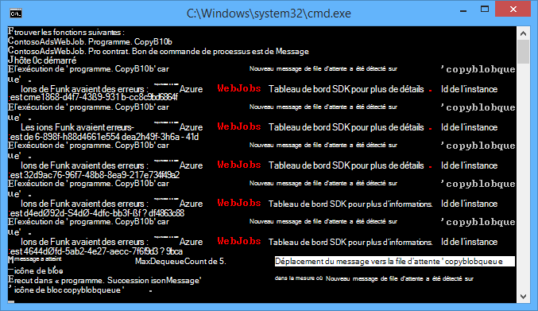
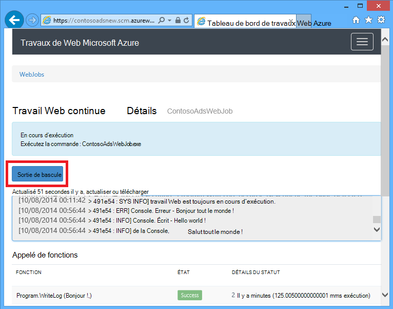
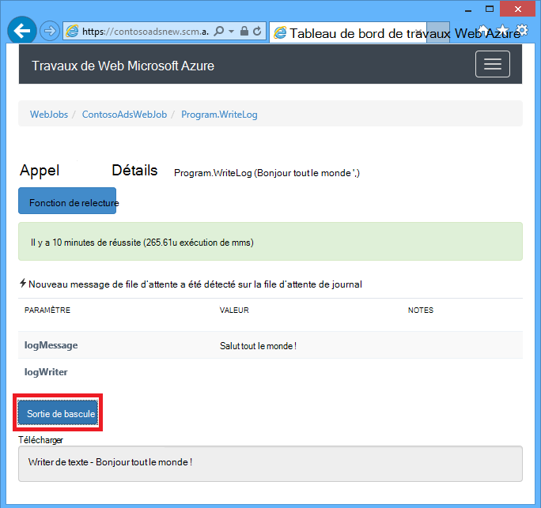
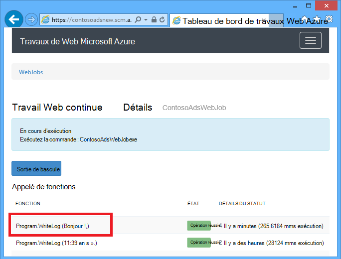
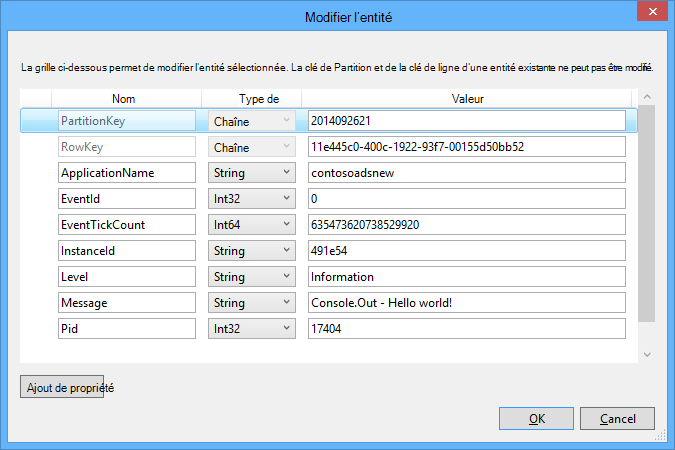
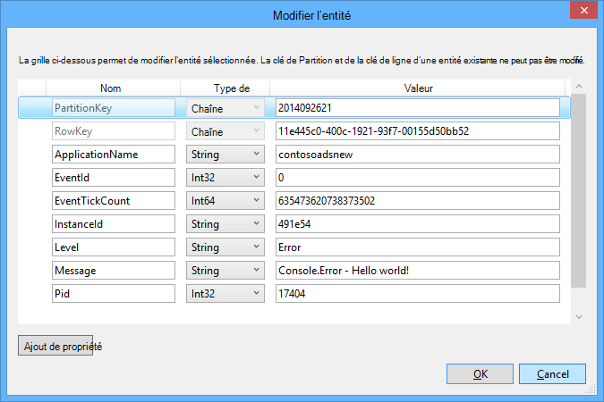

<properties 
    pageTitle="Comment faire pour utiliser le stockage de la file d’attente Azure avec le SDK WebJobs" 
    description="Apprenez à utiliser le stockage de la file d’attente Azure avec le SDK WebJobs. Créer et supprimer des files d’attente ; Insérer, lire, obtenir et supprimer les messages de la file d’attente et bien plus encore." 
    services="app-service\web, storage" 
    documentationCenter=".net" 
    authors="tdykstra" 
    manager="wpickett" 
    editor="jimbe"/>

<tags 
    ms.service="app-service-web" 
    ms.workload="web" 
    ms.tgt_pltfrm="na" 
    ms.devlang="dotnet" 
    ms.topic="article" 
    ms.date="06/01/2016" 
    ms.author="tdykstra"/>

# <a name="how-to-use-azure-queue-storage-with-the-webjobs-sdk"></a>Comment faire pour utiliser le stockage de la file d’attente Azure avec le SDK WebJobs

## <a name="overview"></a>Vue d’ensemble

Ce guide fournit des exemples de code C# qui illustrent l’utilisation de la version du Kit de développement logiciel Azure WebJobs 1.x avec le service de stockage Azure de file d’attente.

Le guide suppose que vous savez [comment créer un projet dans Visual Studio avec des chaînes de connexion qui pointent vers votre compte de stockage de WebJob](websites-dotnet-webjobs-sdk-get-started.md#configure-storage) ou de [plusieurs comptes de stockage](https://github.com/Azure/azure-webjobs-sdk/blob/master/test/Microsoft.Azure.WebJobs.Host.EndToEndTests/MultipleStorageAccountsEndToEndTests.cs).

La plupart des extraits de code affiche uniquement les fonctions, pas le code qui crée la `JobHost` objet comme dans cet exemple :

        static void Main(string[] args)
        {
            JobHost host = new JobHost();
            host.RunAndBlock();
        }
        
Le guide comprend les rubriques suivantes :

-   [Comment déclencher une fonction lors de la réception d’un message de la file d’attente](#trigger)
    - Messages de file d’attente de chaîne
    - Messages de file d’attente POCO
    - Fonctions d’async
    - L’attribut QueueTrigger fonctionne avec des types
    - Algorithme d’interrogation
    - Plusieurs instances
    - Exécution en parallèle
    - Obtenir la file d’attente ou la file d’attente message métadonnées
    - Arrêt progressif
-   [Comment créer un message de la file d’attente lors du traitement d’un message de la file d’attente](#createqueue)
    - Messages de file d’attente de chaîne
    - Messages de file d’attente POCO
    - Créer plusieurs messages ou dans des fonctions d’async
    - L’attribut file d’attente fonctionne avec des types
    - Utilisez les attributs WebJobs SDK dans le corps d’une fonction
-   [Comment faire pour lire et écrire des objets BLOB lors du traitement d’un message de la file d’attente](#blobs)
    - Messages de file d’attente de chaîne
    - Messages de file d’attente POCO
    - L’attribut de l’objet Blob fonctionne avec des types
-   [Comment gérer les messages incohérents](#poison)
    - Messages poison automatique
    - Messages poison manuelle
-   [Comment définir les options de configuration](#config)
    - Définir des chaînes de connexion de kit de développement logiciel dans le code
    - Configurer les paramètres de QueueTrigger
    - Définir les valeurs pour WebJobs SDK paramètres du constructeur dans le code
-   [Comment déclencher une fonction manuellement](#manual)
-   [Comment écrire des journaux](#logs) 
-   [Comment gérer les erreurs et de configurer des délais d’attente](#errors)
-   [Étapes suivantes](#nextsteps)

## <a id="trigger"></a>Comment déclencher une fonction lors de la réception d’un message de la file d’attente

Pour écrire une fonction qui le SDK WebJobs appelle lors de la réception d’un message de la file d’attente, utilisez la `QueueTrigger` attribut. Le constructeur d’attribut a un paramètre de chaîne qui spécifie le nom de la file d’attente à interroger. Vous pouvez également [définir de manière dynamique le nom de la file d’attente](#config).

### <a name="string-queue-messages"></a>Messages de file d’attente de chaîne

Dans l’exemple suivant, la file d’attente contient un message de type chaîne, donc `QueueTrigger` est appliqué à un paramètre de chaîne nommé `logMessage` qui contient le contenu du message de la file d’attente. La fonction [écrit un message de journal pour le tableau de bord](#logs).
 

        public static void ProcessQueueMessage([QueueTrigger("logqueue")] string logMessage, TextWriter logger)
        {
            logger.WriteLine(logMessage);
        }

Outre `string`, le paramètre peut être un tableau d’octets, un `CloudQueueMessage` objet ou un POCO que vous définissez.

### <a name="poco-plain-old-clr-objecthttpenwikipediaorgwikiplainoldclrobject-queue-messages"></a>POCO [(Plain ancien objet CLR](http://en.wikipedia.org/wiki/Plain_Old_CLR_Object)) file d’attente de messages

Dans l’exemple suivant, le message de la file d’attente contient JSON pour un `BlobInformation` objet qui inclut un `BlobName` propriété. Le Kit de développement logiciel désérialise automatiquement l’objet.

        public static void WriteLogPOCO([QueueTrigger("logqueue")] BlobInformation blobInfo, TextWriter logger)
        {
            logger.WriteLine("Queue message refers to blob: " + blobInfo.BlobName);
        }

Le Kit de développement logiciel utilise le [package NuGet de Newtonsoft.Json](http://www.nuget.org/packages/Newtonsoft.Json) pour sérialiser et désérialiser les messages. Si vous créez des messages de la file d’attente dans un programme qui n’utilise pas le SDK WebJobs, vous pouvez écrire du code comme dans l’exemple suivant pour créer un message de file d’attente POCO le SDK peut analyser. 

        BlobInformation blobInfo = new BlobInformation() { BlobName = "log.txt" };
        var queueMessage = new CloudQueueMessage(JsonConvert.SerializeObject(blobInfo));
        logQueue.AddMessage(queueMessage);

### <a name="async-functions"></a>Fonctions d’async

Le suivant async fonction [écrit un journal au tableau de bord](#logs).

        public async static Task ProcessQueueMessageAsync([QueueTrigger("logqueue")] string logMessage, TextWriter logger)
        {
            await logger.WriteLineAsync(logMessage);
        }

Les fonctions Async peuvent prendre un [jeton d’annulation](http://www.asp.net/mvc/overview/performance/using-asynchronous-methods-in-aspnet-mvc-4#CancelToken), comme illustré dans l’exemple suivant, qui copie un objet blob. (Pour obtenir une explication de la `queueTrigger` espace réservé, reportez-vous à la section [objets BLOB](#blobs) .)

        public async static Task ProcessQueueMessageAsyncCancellationToken(
            [QueueTrigger("blobcopyqueue")] string blobName, 
            [Blob("textblobs/{queueTrigger}",FileAccess.Read)] Stream blobInput,
            [Blob("textblobs/{queueTrigger}-new",FileAccess.Write)] Stream blobOutput,
            CancellationToken token)
        {
            await blobInput.CopyToAsync(blobOutput, 4096, token);
        }

### <a id="qtattributetypes"></a>L’attribut QueueTrigger fonctionne avec des types

Vous pouvez utiliser `QueueTrigger` avec les types suivants :

* `string`
* Un type POCO sérialisé au format JSON
* `byte[]`
* `CloudQueueMessage`

### <a id="polling"></a>Algorithme d’interrogation

Le Kit de développement implémente un exponentiel recul algorithme aléatoire pour réduire les effets d’inactivité-file d’attente d’interrogation sur les coûts de transaction de stockage.  Lorsqu’un message est trouvé, le Kit de développement logiciel attend deux secondes, puis vérifie un autre message ; Lorsque aucun message n’est trouvé, il attend environ quatre secondes avant d’essayer à nouveau. Après les tentatives ultérieures pour obtenir un message de la file d’attente, le temps d’attente continue d’augmenter jusqu'à ce qu’elle atteigne le délai d’attente maximal, qui est par défaut à une minute. [Le délai d’attente maximal est configurable](#config).

### <a id="instances"></a>Plusieurs instances

Si votre application web s’exécute sur plusieurs instances, une WebJob continue s’exécute sur chaque ordinateur et chaque ordinateur va attendre des déclencheurs et tente d’exécuter des fonctions. Le déclencheur de la file d’attente WebJobs SDK empêche automatiquement une fonction de traitement d’un message de la file d’attente plusieurs fois ; fonctions ne doivent pas être écrites pour être équipotentes. Toutefois, si vous souhaitez vous assurer qu’une seule instance d’une fonction s’exécute même lorsque plusieurs instances de l’hôte web app, vous pouvez utiliser la `Singleton` attribut. 

### <a id="parallel"></a>Exécution en parallèle

Si vous avez plusieurs fonctions sont à l’écoute sur différentes files d’attente, le Kit de développement appelle les en parallèle lorsque les messages sont reçus simultanément. 

Il en est de même lorsque plusieurs messages sont reçus d’une file d’attente unique. Par défaut, le Kit de développement logiciel Obtient un lot de 16 messages de file d’attente à la fois et exécute la fonction qui les traite en parallèle. [La taille du lot est configurable](#config). Lorsqu’il obtient le nombre en cours de traitement à la moitié de la taille du lot, le Kit de développement logiciel Obtient un autre lot et démarre le traitement de ces messages. Par conséquent, le nombre maximal de messages simultanés en cours de traitement par la fonction est la taille de lot une fois et demie. Cette limite s’applique séparément à chaque fonction qui a un `QueueTrigger` attribut. 

Si vous ne souhaitez pas l’exécution en parallèle pour les messages reçus dans une file d’attente, vous pouvez définir la taille du lot à 1. Voir également **davantage de contrôle sur le traitement de la file d’attente** dans la [version commerciale du Kit de développement logiciel WebJobs Azure 1.1.0](/blog/azure-webjobs-sdk-1-1-0-rtm/).

### <a id="queuemetadata"></a>Obtenir la file d’attente ou la file d’attente message métadonnées

Vous pouvez obtenir les propriétés de message suivantes en ajoutant des paramètres à la signature de méthode :

* `DateTimeOffset`expirationTime
* `DateTimeOffset`insertionTime
* `DateTimeOffset`nextVisibleTime
* `string`queueTrigger (contient le texte du message)
* `string`ID
* `string`popReceipt
* `int`dequeueCount

Si vous souhaitez travailler directement avec l’API de stockage Azure, vous pouvez également ajouter un `CloudStorageAccount` paramètre.

L’exemple suivant écrit toutes ces métadonnées dans un journal d’application INFO. Dans l’exemple, à la fois logMessage et queueTrigger contiennent le contenu du message de la file d’attente.

        public static void WriteLog([QueueTrigger("logqueue")] string logMessage,
            DateTimeOffset expirationTime,
            DateTimeOffset insertionTime,
            DateTimeOffset nextVisibleTime,
            string id,
            string popReceipt,
            int dequeueCount,
            string queueTrigger,
            CloudStorageAccount cloudStorageAccount,
            TextWriter logger)
        {
            logger.WriteLine(
                "logMessage={0}\n" +
            "expirationTime={1}\ninsertionTime={2}\n" +
                "nextVisibleTime={3}\n" +
                "id={4}\npopReceipt={5}\ndequeueCount={6}\n" +
                "queue endpoint={7} queueTrigger={8}",
                logMessage, expirationTime,
                insertionTime,
                nextVisibleTime, id,
                popReceipt, dequeueCount,
                cloudStorageAccount.QueueEndpoint,
                queueTrigger);
        }

Voici un exemple de journal écrit par l’exemple de code :

        logMessage=Hello world!
        expirationTime=10/14/2014 10:31:04 PM +00:00
        insertionTime=10/7/2014 10:31:04 PM +00:00
        nextVisibleTime=10/7/2014 10:41:23 PM +00:00
        id=262e49cd-26d3-4303-ae88-33baf8796d91
        popReceipt=AgAAAAMAAAAAAAAAfc9H0n/izwE=
        dequeueCount=1
        queue endpoint=https://contosoads.queue.core.windows.net/
        queueTrigger=Hello world!

### <a id="graceful"></a>Arrêt progressif

Une fonction qui s’exécute dans un WebJob en continu peut accepter une `CancellationToken` paramètre qui permet au système d’exploitation notifier la fonction lorsque la WebJob est sur le point de se terminer. Vous pouvez utiliser cette notification pour vous assurer que la fonction n’arrêt inattendu d’une façon qui conserve les données dans un état incohérent.

L’exemple suivant montre comment vérifier imminente fin WebJob dans une fonction.

    public static void GracefulShutdownDemo(
                [QueueTrigger("inputqueue")] string inputText,
                TextWriter logger,
                CancellationToken token)
    {
        for (int i = 0; i < 100; i++)
        {
            if (token.IsCancellationRequested)
            {
                logger.WriteLine("Function was cancelled at iteration {0}", i);
                break;
            }
            Thread.Sleep(1000);
            logger.WriteLine("Normal processing for queue message={0}", inputText);
        }
    }

**Remarque :** Le tableau de bord ne peut pas afficher correctement l’état et les résultats de fonctions qui ont été arrêtés.
 
Pour plus d’informations, voir [Arrêt progressif de WebJobs](http://blog.amitapple.com/post/2014/05/webjobs-graceful-shutdown/#.VCt1GXl0wpR).   

## <a id="createqueue"></a>Comment créer un message de la file d’attente lors du traitement d’un message de la file d’attente

Pour écrire une fonction qui crée un nouveau message de la file d’attente, utilisez la `Queue` attribut. Comme `QueueTrigger`, vous passez le nom de la file d’attente sous forme de chaîne, ou vous pouvez [définir de manière dynamique le nom de la file d’attente](#config).

### <a name="string-queue-messages"></a>Messages de file d’attente de chaîne

L’exemple de code suivant non-async crée un nouveau message de la file d’attente dans la file d’attente nommée « outputqueue » avec le même contenu que le message de la file d’attente reçu dans la file d’attente nommée « inputqueue ». (Pour une opération asynchrone utilisent fonctions `IAsyncCollector<T>` comme indiqué plus loin dans cette section.)


        public static void CreateQueueMessage(
            [QueueTrigger("inputqueue")] string queueMessage,
            [Queue("outputqueue")] out string outputQueueMessage )
        {
            outputQueueMessage = queueMessage;
        }
  
### <a name="poco-plain-old-clr-objecthttpenwikipediaorgwikiplainoldclrobject-queue-messages"></a>POCO [(Plain ancien objet CLR](http://en.wikipedia.org/wiki/Plain_Old_CLR_Object)) file d’attente de messages

Pour créer un message de la file d’attente contenant un POCO plutôt qu’une chaîne, passez le type POCO comme paramètre de sortie pour le `Queue` le constructeur d’attribut.
 
        public static void CreateQueueMessage(
            [QueueTrigger("inputqueue")] BlobInformation blobInfoInput,
            [Queue("outputqueue")] out BlobInformation blobInfoOutput )
        {
            blobInfoOutput = blobInfoInput;
        }

Le Kit de développement logiciel sérialise automatiquement l’objet JSON. Un message de la file d’attente est toujours créé, même si l’objet est null.

### <a name="create-multiple-messages-or-in-async-functions"></a>Créer plusieurs messages ou dans des fonctions d’async

Pour créer plusieurs messages, vérifiez le type de paramètre pour la file d’attente de sortie `ICollector<T>` ou `IAsyncCollector<T>`, comme illustré dans l’exemple suivant.

        public static void CreateQueueMessages(
            [QueueTrigger("inputqueue")] string queueMessage,
            [Queue("outputqueue")] ICollector<string> outputQueueMessage,
            TextWriter logger)
        {
            logger.WriteLine("Creating 2 messages in outputqueue");
            outputQueueMessage.Add(queueMessage + "1");
            outputQueueMessage.Add(queueMessage + "2");
        }

Chaque message de la file d’attente est créée immédiatement lors de la `Add` méthode est appelée.

### <a name="types-that-the-queue-attribute-works-with"></a>Types fonctionnant avec l’attribut file d’attente

Vous pouvez utiliser la `Queue` attribut sur les types de paramètres suivants :

* `out string`(crée le message de la file d’attente si la valeur du paramètre est non nulle lorsque la fonction se termine)
* `out byte[]`(fonctionne comme `string`) 
* `out CloudQueueMessage`(fonctionne comme `string`) 
* `out POCO`(un type sérialisable, crée un message avec un objet null si le paramètre a la valeur null lorsque la fonction se termine)
* `ICollector`
* `IAsyncCollector`
* `CloudQueue`(pour la création des messages manuellement à l’aide de l’API de stockage Azure directement)

### <a id="ibinder"></a>Utilisez les attributs WebJobs SDK dans le corps d’une fonction

Si vous avez besoin d’effectuer un travail dans la fonction avant d’utiliser un attribut WebJobs SDK tel que `Queue`, `Blob`, ou `Table`, vous pouvez utiliser la `IBinder` interface.

L’exemple suivant prend un message de la file d’attente d’entrée et crée un nouveau message avec le même contenu dans une file d’attente de sortie. Le nom de file d’attente de sortie est défini par le code dans le corps de la fonction.

        public static void CreateQueueMessage(
            [QueueTrigger("inputqueue")] string queueMessage,
            IBinder binder)
        {
            string outputQueueName = "outputqueue" + DateTime.Now.Month.ToString();
            QueueAttribute queueAttribute = new QueueAttribute(outputQueueName);
            CloudQueue outputQueue = binder.Bind<CloudQueue>(queueAttribute);
            outputQueue.AddMessage(new CloudQueueMessage(queueMessage));
        }

Le `IBinder` interface peut également être utilisée avec la `Table` et `Blob` les attributs.

## <a id="blobs"></a>Comment lire et écrire les BLOB et les tables pendant le traitement d’un message de la file d’attente

La `Blob` et `Table` attributs permettent de lire et d’écrire les BLOB et les tables. Les exemples de cette section s’appliquent aux objets BLOB. Pour les exemples de code qui montrent comment déclencher des processus lorsque les objets BLOB est créés ou mis à jour, voir [comment utiliser le stockage blob Azure avec le Kit de développement de WebJobs](websites-dotnet-webjobs-sdk-storage-blobs-how-to.md)et pour des exemples de code qui lisent et écrivent des tables, voir [comment utiliser le stockage par table Azure avec le SDK WebJobs](websites-dotnet-webjobs-sdk-storage-tables-how-to.md).

### <a name="string-queue-messages-triggering-blob-operations"></a>Messages de file d’attente de chaîne déclenchement des opérations de blob

Pour un message de la file d’attente qui contient une chaîne, `queueTrigger` est un espace réservé que vous pouvez utiliser dans les `Blob` l’attribut `blobPath` paramètre qui contient le contenu du message. 

L’exemple suivant utilise `Stream` objets pour lire et écrire des objets BLOB. Le message de la file d’attente est le nom d’un objet blob que qui se trouve dans le conteneur textblobs. Une copie de l’objet blob avec «-nouveau » ajouté au nom est créé dans le même conteneur. 

        public static void ProcessQueueMessage(
            [QueueTrigger("blobcopyqueue")] string blobName, 
            [Blob("textblobs/{queueTrigger}",FileAccess.Read)] Stream blobInput,
            [Blob("textblobs/{queueTrigger}-new",FileAccess.Write)] Stream blobOutput)
        {
            blobInput.CopyTo(blobOutput, 4096);
        }

Le `Blob` attribut constructeur prend un `blobPath` paramètre qui spécifie le nom de conteneur et blob. Pour plus d’informations sur cet espace réservé, voir [comment utiliser le stockage blob Azure avec le Kit de développement de WebJobs](websites-dotnet-webjobs-sdk-storage-blobs-how-to.md), 

Lorsque l’attribut décore un `Stream` objet, un autre paramètre de constructeur spécifie la `FileAccess` le mode lecture, écriture ou en lecture-écriture. 

L’exemple suivant utilise un `CloudBlockBlob` objet à supprimer d’un objet blob. Le message de la file d’attente est le nom de l’objet blob.

        public static void DeleteBlob(
            [QueueTrigger("deleteblobqueue")] string blobName,
            [Blob("textblobs/{queueTrigger}")] CloudBlockBlob blobToDelete)
        {
            blobToDelete.Delete();
        }

### <a id="pocoblobs"></a>POCO [(Plain ancien objet CLR](http://en.wikipedia.org/wiki/Plain_Old_CLR_Object)) file d’attente de messages

Pour un POCO stockée en tant que JSON dans le message de la file d’attente, vous pouvez utiliser des espaces réservés aux noms des propriétés de l’objet dans le `Queue` l’attribut `blobPath` paramètre. Vous pouvez également utiliser des [noms de propriété de métadonnées de file d’attente](#queuemetadata) comme espaces réservés. 

L’exemple suivant copie un blob dans un objet blob de nouveau avec une extension différente. Le message de la file d’attente est un `BlobInformation` objet qui inclut des `BlobName` et `BlobNameWithoutExtension` propriétés. Les noms de propriété sont utilisés comme espaces réservés dans le chemin d’accès de l’objet blob pour les `Blob` les attributs. 
 
        public static void CopyBlobPOCO(
            [QueueTrigger("copyblobqueue")] BlobInformation blobInfo,
            [Blob("textblobs/{BlobName}", FileAccess.Read)] Stream blobInput,
            [Blob("textblobs/{BlobNameWithoutExtension}.txt", FileAccess.Write)] Stream blobOutput)
        {
            blobInput.CopyTo(blobOutput, 4096);
        }

Le Kit de développement logiciel utilise le [package NuGet de Newtonsoft.Json](http://www.nuget.org/packages/Newtonsoft.Json) pour sérialiser et désérialiser les messages. Si vous créez des messages de la file d’attente dans un programme qui n’utilise pas le SDK WebJobs, vous pouvez écrire du code comme dans l’exemple suivant pour créer un message de file d’attente POCO le SDK peut analyser.

        BlobInformation blobInfo = new BlobInformation() { BlobName = "boot.log", BlobNameWithoutExtension = "boot" };
        var queueMessage = new CloudQueueMessage(JsonConvert.SerializeObject(blobInfo));
        logQueue.AddMessage(queueMessage);

Si vous avez besoin d’effectuer un travail dans votre fonction avant la liaison d’un objet blob à un objet, vous pouvez utiliser l’attribut dans le corps de la fonction, [comme indiqué plus haut pour l’attribut de file d’attente](#ibinder).

### <a id="blobattributetypes"></a>Vous pouvez utiliser l’attribut d’objet Blob avec des types
 
Le `Blob` attribut peut être utilisé avec les types suivants :

* `Stream`(en lecture ou en écriture, spécifié à l’aide du paramètre de constructeur FileAccess)
* `TextReader`
* `TextWriter`
* `string`(lecture)
* `out string`(écriture, crée un objet blob que si le paramètre de chaîne n’est pas null lorsque la fonction retourne une valeur)
* POCO (lecture)
* sortie POCO (écrire ; toujours crée un blob, crée en tant qu’objet null si POCO paramètre est null, la fonction retourne)
* `CloudBlobStream`(écriture)
* `ICloudBlob`(en lecture ou en écriture)
* `CloudBlockBlob`(en lecture ou en écriture) 
* `CloudPageBlob`(en lecture ou en écriture) 

## <a id="poison"></a>Comment gérer les messages incohérents

Les messages dont le contenu provoque une fonction échec sont appelés des *messages incohérents*. Lorsque la fonction échoue, le message de la file d’attente n’est pas supprimé et finalement est récupérée encore une fois, entraînant le cycle doit être répétée. Le Kit de développement peut interrompre automatiquement le cycle après un nombre limité d’itérations, ou vous pouvez le faire manuellement.

### <a name="automatic-poison-message-handling"></a>Messages poison automatique

Le Kit de développement appelle une fonction jusqu'à 5 fois pour traiter un message de la file d’attente. Si la cinquième tentative échoue, le message est déplacé vers une file d’attente poison. [Le nombre maximal de tentatives est configurable](#config). 

La file d’attente poison est nommé *{originalqueuename}*-poison. Vous pouvez écrire une fonction pour traiter les messages de la file d’attente poison par leur enregistrement ou envoi d’une notification qu’attention manuelle est nécessaire. 

Dans l’exemple suivant le `CopyBlob` fonction échoue lorsqu’un message de la file d’attente contient le nom d’un objet blob qui n’existe pas. Lorsque cela se produit, le message est déplacé à partir de la file d’attente de copyblobqueue à la file d’attente de copyblobqueue-poison. Le `ProcessPoisonMessage` puis enregistre le message poison.

        public static void CopyBlob(
            [QueueTrigger("copyblobqueue")] string blobName,
            [Blob("textblobs/{queueTrigger}", FileAccess.Read)] Stream blobInput,
            [Blob("textblobs/{queueTrigger}-new", FileAccess.Write)] Stream blobOutput)
        {
            blobInput.CopyTo(blobOutput, 4096);
        }
        
        public static void ProcessPoisonMessage(
            [QueueTrigger("copyblobqueue-poison")] string blobName, TextWriter logger)
        {
            logger.WriteLine("Failed to copy blob, name=" + blobName);
        }

L’illustration suivante montre la sortie de la console à partir de ces fonctions lors du traitée d’un message incohérent.



### <a name="manual-poison-message-handling"></a>Messages poison manuelle

Vous pouvez obtenir le nombre de fois qu’un message a été collecté pour le traitement en ajoutant une `int` paramètre nommé `dequeueCount` à votre fonction. Vous pouvez vérifier le nombre de dequeue dans le code de fonction et effectuer votre propre gestion de messages incohérents lorsque le nombre dépasse un seuil, comme illustré dans l’exemple suivant.

        public static void CopyBlob(
            [QueueTrigger("copyblobqueue")] string blobName, int dequeueCount,
            [Blob("textblobs/{queueTrigger}", FileAccess.Read)] Stream blobInput,
            [Blob("textblobs/{queueTrigger}-new", FileAccess.Write)] Stream blobOutput,
            TextWriter logger)
        {
            if (dequeueCount > 3)
            {
                logger.WriteLine("Failed to copy blob, name=" + blobName);
            }
            else
            {
            blobInput.CopyTo(blobOutput, 4096);
            }
        }

## <a id="config"></a>Comment définir les options de configuration

Vous pouvez utiliser la `JobHostConfiguration` type pour définir les options de configuration suivantes :

* Définir les chaînes de connexion du Kit de développement logiciel dans le code.
* Configurer `QueueTrigger` paramètres de maximum file count.
* Obtenir le nom de la file d’attente à partir de la configuration.

### <a id="setconnstr"></a>Définir des chaînes de connexion de kit de développement logiciel dans le code

Permet de définir les chaînes de connexion du Kit de développement logiciel dans le code vous permet d’utiliser vos propres noms de chaîne de connexion dans des fichiers de configuration ou des variables d’environnement, comme illustré dans l’exemple suivant.

        static void Main(string[] args)
        {
            var _storageConn = ConfigurationManager
                .ConnectionStrings["MyStorageConnection"].ConnectionString;
        
            var _dashboardConn = ConfigurationManager
                .ConnectionStrings["MyDashboardConnection"].ConnectionString;
        
            var _serviceBusConn = ConfigurationManager
                .ConnectionStrings["MyServiceBusConnection"].ConnectionString;
        
            JobHostConfiguration config = new JobHostConfiguration();
            config.StorageConnectionString = _storageConn;
            config.DashboardConnectionString = _dashboardConn;
            config.ServiceBusConnectionString = _serviceBusConn;
            JobHost host = new JobHost(config);
            host.RunAndBlock();
        }

### <a id="configqueue"></a>Configurer les paramètres de QueueTrigger

Vous pouvez configurer les paramètres suivants qui s’appliquent au traitement du message de file d’attente :

- Le nombre maximal de messages de file d’attente qui sont pris en charge simultanément à exécuter en parallèle (valeur par défaut est 16).
- Le nombre maximal de tentatives avant un message de la file d’attente est envoyé à une file d’attente poison (valeur par défaut est 5).
- Au maximum la durée d’attente avant l’interrogation à nouveau lorsqu’une file d’attente est vide (valeur par défaut est de 1 minute).

L’exemple suivant montre comment configurer ces paramètres :

        static void Main(string[] args)
        {
            JobHostConfiguration config = new JobHostConfiguration();
            config.Queues.BatchSize = 8;
            config.Queues.MaxDequeueCount = 4;
            config.Queues.MaxPollingInterval = TimeSpan.FromSeconds(15);
            JobHost host = new JobHost(config);
            host.RunAndBlock();
        }

### <a id="setnamesincode"></a>Définir les valeurs pour WebJobs SDK paramètres du constructeur dans le code

Parfois vous souhaitez spécifier un nom de file d’attente, un nom d’objet blob ou un conteneur, ou une table le nom dans le code plutôt que de coder en dur. Par exemple, vous pouvez souhaiter spécifier le nom de la file d’attente de `QueueTrigger` dans une variable d’environnement ou le fichier de configuration. 

Vous pouvez le faire en passant dans un `NameResolver` objet de la `JobHostConfiguration` type. Inclure des espaces réservés spéciales, délimitées par des signes de pourcentage (%) dans les paramètres de constructeur d’attribut WebJobs SDK et votre `NameResolver` code spécifie les valeurs réelles à la place de ces espaces réservés.

Par exemple, supposons que vous souhaitez utiliser une file d’attente nommée logqueuetest dans l’environnement de test et un logqueueprod nommé dans la production. Au lieu d’un nom codé en dur la file d’attente, vous souhaitez spécifier le nom d’une entrée dans le `appSettings` collection qui aurait le nom de la file d’attente réelle. Si le `appSettings` la clé est logqueue, votre fonction pourrait ressembler à l’exemple suivant.

        public static void WriteLog([QueueTrigger("%logqueue%")] string logMessage)
        {
            Console.WriteLine(logMessage);
        }

Votre `NameResolver` classe a ensuite pu obtenir le nom de la file d’attente à partir de `appSettings` comme indiqué dans l’exemple suivant :

        public class QueueNameResolver : INameResolver
        {
            public string Resolve(string name)
            {
                return ConfigurationManager.AppSettings[name].ToString();
            }
        }

Vous passez le `NameResolver` classe dans le `JobHost` objet comme illustré dans l’exemple suivant.

        static void Main(string[] args)
        {
            JobHostConfiguration config = new JobHostConfiguration();
            config.NameResolver = new QueueNameResolver();
            JobHost host = new JobHost(config);
            host.RunAndBlock();
        }
 
**Remarque :** Les noms de blob, table et file d’attente sont résolus chaque fois qu’une fonction est appelée, mais les noms de conteneurs blob sont résolues uniquement lorsque l’application démarre. Vous ne pouvez pas modifier le nom du conteneur blob pendant l’exécution de la tâche. 

## <a id="manual"></a>Comment déclencher une fonction manuellement

Pour déclencher une fonction manuellement, utilisez le `Call` ou `CallAsync` méthode sur le `JobHost` objet et la `NoAutomaticTrigger` d’attribut sur la fonction, comme indiqué dans l’exemple suivant. 

        public class Program
        {
            static void Main(string[] args)
            {
                JobHost host = new JobHost();
                host.Call(typeof(Program).GetMethod("CreateQueueMessage"), new { value = "Hello world!" });
            }
        
            [NoAutomaticTrigger]
            public static void CreateQueueMessage(
                TextWriter logger, 
                string value, 
                [Queue("outputqueue")] out string message)
            {
                message = value;
                logger.WriteLine("Creating queue message: ", message);
            }
        }

## <a id="logs"></a>Comment écrire des journaux

Le tableau de bord affiche les journaux à deux endroits : les pages pour la WebJob et pour une instance particulière de la WebJob. 





Sortie à partir de méthodes de Console que vous appelez dans une fonction ou dans les `Main()` méthode s’affiche dans la page de tableau de bord pour le WebJob, et non dans la page pour un appel de méthode particulière. Sortie à partir de l’objet TextWriter que vous obtenez à partir d’un paramètre dans la signature de méthode s’affiche dans la page de tableau de bord pour un appel de méthode.

Sortie de la console ne peut pas être lié à un appel de méthode particulier étant donné que la Console est mono-thread, tandis que de nombreuses fonctions de travail peuvent s’exécuter en même temps. C’est pourquoi le SDK fournit à chaque appel de fonction avec son propre objet writer de journal unique.

Pour écrire des [journaux de suivi d’application](web-sites-dotnet-troubleshoot-visual-studio.md#logsoverview), utilisez `Console.Out` (crée des journaux marquées comme INFO) et `Console.Error` (crée des journaux marquées comme une erreur). Une alternative consiste à utiliser des [TraceSource ou suivi](http://blogs.msdn.com/b/mcsuksoldev/archive/2014/09/04/adding-trace-to-azure-web-sites-and-web-jobs.aspx), qui fournit des niveaux critiques, d’avertissement et commentaires en plus des informations et d’erreur. Journaux de suivi des applications s’affichent dans les fichiers de journaux d’application web, les tables Azure, ou Azure BLOB selon la configuration de votre application web Azure. Comme c’est vrai pour toutes les sorties de la Console, les journaux de 100 applications les plus récents apparaissent également dans la page tableau de bord pour le WebJob, pas sur la page pour un appel de fonction. 

Sortie de la console s’affiche dans le tableau de bord uniquement si le programme est en cours d’exécution dans un WebJob d’Azure, pas si le programme est exécuté localement ou dans tout autre environnement.

Désactiver la journalisation de tableau de bord pour les scénarios de débit élevé. Par défaut, le Kit de développement logiciel écrit des journaux dans le stockage, et cette activité peut dégrader les performances lorsque vous traitez un grand nombre de messages. Pour désactiver la journalisation, définissez la chaîne de connexion NULL comme indiqué dans l’exemple suivant du tableau de bord.

        JobHostConfiguration config = new JobHostConfiguration();       
        config.DashboardConnectionString = "";        
        JobHost host = new JobHost(config);
        host.RunAndBlock();

L’exemple suivant montre plusieurs façons d’écrire des journaux :

        public static void WriteLog(
            [QueueTrigger("logqueue")] string logMessage,
            TextWriter logger)
        {
            Console.WriteLine("Console.Write - " + logMessage);
            Console.Out.WriteLine("Console.Out - " + logMessage);
            Console.Error.WriteLine("Console.Error - " + logMessage);
            logger.WriteLine("TextWriter - " + logMessage);
        }

Tableau de bord SDK WebJobs, la sortie de la `TextWriter` objet s’affiche lorsque vous accédez à la page pour un particulier fonction d’appel et cliquez sur **Activer/désactiver sortie**:




Dans le panneau de commandes du Kit de développement logiciel de WebJobs, les 100 lignes de Console plus récentes sortie afficher les lorsque vous accédez à la page de la WebJob (pas pour l’appel de la fonction) et cliquez sur **Activer/désactiver sortie**.
 


Dans un WebJob en continu, les journaux d’application s’affichent dans/données/tâches/continu /*{webjobname}*/job_log.txt dans le système de fichiers d’application web.

        [09/26/2014 21:01:13 > 491e54: INFO] Console.Write - Hello world!
        [09/26/2014 21:01:13 > 491e54: ERR ] Console.Error - Hello world!
        [09/26/2014 21:01:13 > 491e54: INFO] Console.Out - Hello world!

Dans un Azure blob le journaux application doit ressembler à cela : 2014-09-26T21:01:13,Information,contosoadsnew,491e54,635473620738373502,0,17404,17,Console.Write - Bonjour !, 2014-09-26T21:01:13,Error,contosoadsnew,491e54,635473620738373502,0,17404,19,Console.Error - Bonjour !, 2014-09-26T21:01:13,Information,contosoadsnew,491e54,635473620738529920,0,17404,17,Console.Out - Bonjour !,

Une table Azure et la `Console.Out` et `Console.Error` journaux se présenter comme suit :





Si vous souhaitez connecter votre propre journal, reportez-vous à [Cet exemple](http://github.com/Azure/azure-webjobs-sdk-samples/blob/master/BasicSamples/MiscOperations/Program.cs).

## <a id="errors"></a>Comment gérer les erreurs et de configurer des délais d’attente

Le SDK WebJobs inclut également un [délai d’expiration](http://github.com/Azure/azure-webjobs-sdk-samples/blob/master/BasicSamples/MiscOperations/Functions.cs) de l' attribut que vous pouvez utiliser pour une fonction d’annulation si ne termine pas pendant un laps de temps. Et si vous souhaitez déclencher une alerte lorsque trop d’erreurs se produire dans une période spécifiée, vous pouvez utiliser la `ErrorTrigger` attribut. Voici un [exemple de ErrorTrigger](https://github.com/Azure/azure-webjobs-sdk-extensions/wiki/Error-Monitoring).

```
public static void ErrorMonitor(
[ErrorTrigger("00:01:00", 1)] TraceFilter filter, TextWriter log,
[SendGrid(
    To = "admin@emailaddress.com",
    Subject = "Error!")]
 SendGridMessage message)
{
    // log last 5 detailed errors to the Dashboard
   log.WriteLine(filter.GetDetailedMessage(5));
   message.Text = filter.GetDetailedMessage(1);
}
```

Vous pouvez également de façon dynamique désactiver et activer les fonctions de contrôle qu’ils peuvent être déclenchées, à l’aide d’un commutateur de configuration qui peut être un paramètre d’application ou d’un nom de variable d’environnement. Pour l’exemple de code, consultez la `Disable` l’attribut dans [le référentiel d’exemples SDK de WebJobs](https://github.com/Azure/azure-webjobs-sdk-samples/blob/master/BasicSamples/MiscOperations/Functions.cs).

## <a id="nextsteps"></a>Étapes suivantes

Ce guide fournit des exemples de code qui montrent comment gérer des scénarios courants pour l’utilisation de files d’attente Azure. Pour plus d’informations sur l’utilisation de WebJobs d’Azure et le SDK WebJobs, reportez-vous à la section [Ressources recommandé des WebJobs d’Azure](http://go.microsoft.com/fwlink/?linkid=390226).
 
