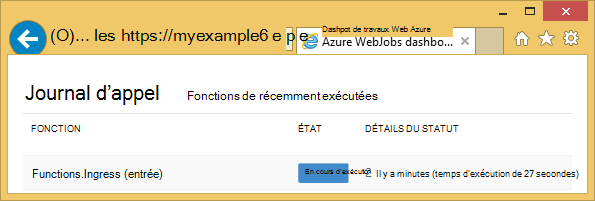
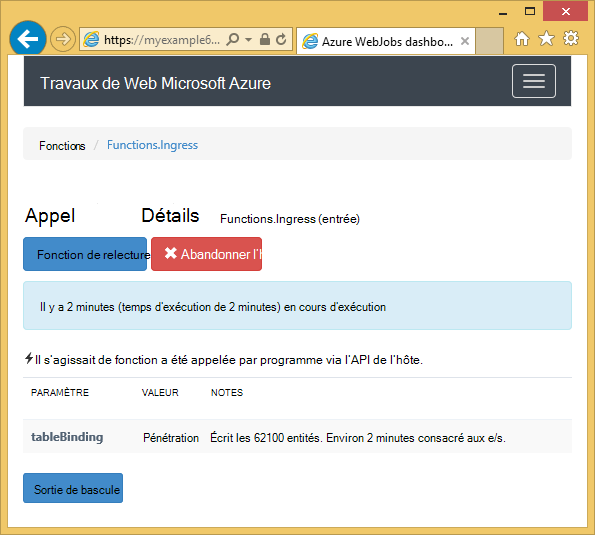
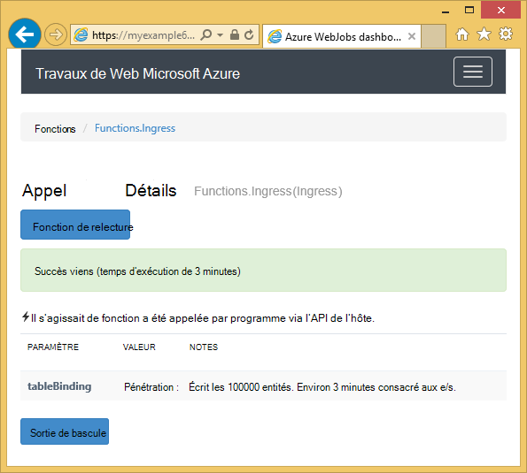

<properties 
    pageTitle="Comment faire pour utiliser le stockage par table Azure avec le SDK WebJobs" 
    description="Apprenez à utiliser le stockage par table Azure avec le SDK WebJobs. Créer des tables, ajouter des entités à des tables, et lire les tables existantes." 
    services="app-service\web, storage" 
    documentationCenter=".net" 
    authors="tdykstra" 
    manager="wpickett" 
    editor="jimbe"/>

<tags 
    ms.service="app-service-web" 
    ms.workload="web" 
    ms.tgt_pltfrm="na" 
    ms.devlang="dotnet" 
    ms.topic="article" 
    ms.date="06/01/2016" 
    ms.author="tdykstra"/>

# Comment faire pour utiliser le stockage par table Azure avec le SDK WebJobs

## Vue d’ensemble

Ce guide fournit des exemples de code C# qui montrent comment lire et écrire des tables de stockage Azure à l’aide du [Kit de développement logiciel WebJobs](websites-dotnet-webjobs-sdk.md) version 1.x.

Le guide suppose que vous savez [comment créer un projet dans Visual Studio avec des chaînes de connexion qui pointent vers votre compte de stockage de WebJob](websites-dotnet-webjobs-sdk-get-started.md) ou de [plusieurs comptes de stockage](https://github.com/Azure/azure-webjobs-sdk/blob/master/test/Microsoft.Azure.WebJobs.Host.EndToEndTests/MultipleStorageAccountsEndToEndTests.cs).
        
Parmi l’extraits de code montrent le `Table` attribut utilisé dans les fonctions qui sont [appelé manuellement](websites-dotnet-webjobs-sdk-storage-queues-how-to.md#manual), autrement dit, pas en utilisant un des attributs de déclencheur. 

## Comment faire pour ajouter des entités à un tableau

Pour ajouter des entités à une table, utilisez le `Table` d’attribut avec un `ICollector<T>` ou `IAsyncCollector<T>` paramètre où `T` Spécifie le schéma des entités que vous souhaitez ajouter. Le constructeur d’attribut a un paramètre de chaîne qui spécifie le nom de la table. 

L’exemple de code suivant ajoute `Person` une table nommée *pénétration*des entités.

        [NoAutomaticTrigger]
        public static void IngressDemo(
            [Table("Ingress")] ICollector<Person> tableBinding)
        {
            for (int i = 0; i < 100000; i++)
            {
                tableBinding.Add(
                    new Person() { 
                        PartitionKey = "Test", 
                        RowKey = i.ToString(), 
                        Name = "Name" }
                    );
            }
        }

Le type vous utilisez généralement avec `ICollector` dérive de `TableEntity` ou implémente `ITableEntity`, mais il ne doit pas. Une des opérations suivantes `Person` classes de travail avec le code indiqué dans le précédent `Ingress` méthode.

        public class Person : TableEntity
        {
            public string Name { get; set; }
        }

        public class Person
        {
            public string PartitionKey { get; set; }
            public string RowKey { get; set; }
            public string Name { get; set; }
        }

Si vous souhaitez travailler directement avec l’API de stockage Azure, vous pouvez ajouter un `CloudStorageAccount` paramètre de la signature de méthode.

## Surveillance en temps réel

Étant donné que les fonctions d’entrée de données traitent souvent d’importants volumes de données, le tableau de bord WebJobs SDK fournit des données de surveillance en temps réel. La section du **Journal d’appel** vous indique si la fonction est en cours d’exécution.

La page **Détails de l’appel** signale la progression de la fonction (nombre d’entités écrit) pendant qu’il est en cours d’exécution et vous donne la possibilité pour l’abandonner. 

Lorsque la fonction est terminée, la page **Détails de l’appel** indique le nombre de lignes écrites.

## Comment faire pour lire plusieurs entités d’une table

Pour lire une table, utilisez le `Table` d’attribut avec un `IQueryable<T>` paramètre où taper `T` dérive de `TableEntity` ou implémente `ITableEntity`.

L’exemple de code suivant lit et enregistre toutes les lignes de la `Ingress` table :
 
        public static void ReadTable(
            [Table("Ingress")] IQueryable<Person> tableBinding,
            TextWriter logger)
        {
            var query = from p in tableBinding select p;
            foreach (Person person in query)
            {
                logger.WriteLine("PK:{0}, RK:{1}, Name:{2}", 
                    person.PartitionKey, person.RowKey, person.Name);
            }
        }

### Comment faire pour lire une entité unique d’une table

Il y a un `Table` le constructeur d’attribut avec deux paramètres supplémentaires qui vous permettent de spécifier la clé de partition et de la clé de ligne lorsque vous souhaitez lier à une entité de table unique.

L’exemple de code suivant lit une ligne de table pour un `Person` entité basé sur partition clé et ligne clés valeurs reçues dans un message de la file d’attente :  

        public static void ReadTableEntity(
            [QueueTrigger("inputqueue")] Person personInQueue,
            [Table("persontable","{PartitionKey}", "{RowKey}")] Person personInTable,
            TextWriter logger)
        {
            if (personInTable == null)
            {
                logger.WriteLine("Person not found: PK:{0}, RK:{1}",
                        personInQueue.PartitionKey, personInQueue.RowKey);
            }
            else
            {
                logger.WriteLine("Person found: PK:{0}, RK:{1}, Name:{2}",
                        personInTable.PartitionKey, personInTable.RowKey, personInTable.Name);
            }
        }

Le `Person` classe dans cet exemple ne doit pas implémenter `ITableEntity`.

## Comment faire pour utiliser l’API de stockage .NET directement à une table de travail

Vous pouvez également utiliser le `Table` d’attribut avec un `CloudTable` objet pour plus de souplesse dans l’utilisation d’une table.

Le code suivant utilise des exemples un `CloudTable` objet pour ajouter une seule entité à la table *d’entrée* . 
 
        public static void UseStorageAPI(
            [Table("Ingress")] CloudTable tableBinding,
            TextWriter logger)
        {
            var person = new Person()
                {
                    PartitionKey = "Test",
                    RowKey = "100",
                    Name = "Name"
                };
            TableOperation insertOperation = TableOperation.Insert(person);
            tableBinding.Execute(insertOperation);
        }

Pour plus d’informations sur l’utilisation de la `CloudTable` objet, voir [comment utiliser le stockage de Table à partir de .NET](../storage/storage-dotnet-how-to-use-tables.md). 

## Rubriques connexes couvertes par l’article d’apprentissage de files d’attente

Pour plus d’informations sur la gestion du traitement de table déclenchée par un message de la file d’attente, ou pour les scénarios de WebJobs SDK non spécifiques à la table de traitement, voir [comment utiliser le stockage Azure de file d’attente avec le SDK WebJobs](websites-dotnet-webjobs-sdk-storage-queues-how-to.md). 

Les sujets abordés dans cet article sont les suivants :

* Fonctions d’async
* Plusieurs instances
* Arrêt progressif
* Utilisez les attributs WebJobs SDK dans le corps d’une fonction
* Définir les chaînes de connexion du Kit de développement logiciel dans le code
* Définir les valeurs pour WebJobs SDK paramètres du constructeur dans le code
* Déclencher une fonction manuellement
* Écrire des journaux

## Étapes suivantes

Ce guide fournit des exemples de code qui montrent comment gérer des scénarios courants pour l’utilisation de tables Azure. Pour plus d’informations sur l’utilisation de WebJobs d’Azure et le SDK WebJobs, reportez-vous à la section [Ressources recommandé des WebJobs d’Azure](http://go.microsoft.com/fwlink/?linkid=390226).
 
