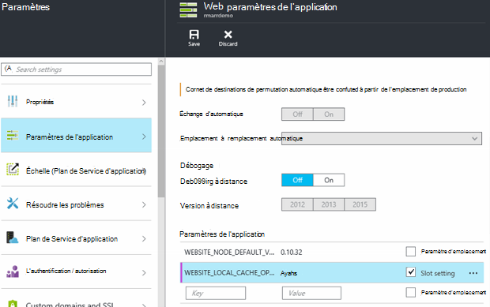

<properties
   pageTitle="Vue d’ensemble de Cache Local du Service application Azure | Microsoft Azure"
   description="Cet article explique comment activer, redimensionner et interroger l’état de la fonctionnalité de Cache Local du Service application Azure"
   services="app-service"
   documentationCenter="app-service"
   authors="SyntaxC4"
   manager="yochayk"
   editor=""
   tags="optional"
   keywords=""/>

<tags
   ms.service="app-service"
   ms.devlang="multiple"
   ms.topic="article"
   ms.tgt_pltfrm="na"
   ms.workload="na"
   ms.date="03/04/2016"
   ms.author="cfowler"/>

# <a name="azure-app-service-local-cache-overview"></a>Vue d’ensemble de Cache Local du Service application Azure

Contenu d’application Azure web est stocké sur le stockage Azure et est apparue haut de façon durable sous la forme d’un partage de contenu. Cette conception est destinée à fonctionner avec une variété d’applications et possède les attributs suivants :  

* Le contenu est partagé entre plusieurs instances de machine virtuelle (VM) de l’application web.
* Le contenu est durable et peut être modifié en exécutant des applications web.
* Fichiers journaux et les fichiers de données de diagnostic sont disponibles sous le même dossier de contenu partagé.
* Publication de nouveaux contenus directement de met à jour le dossier de contenu. Vous pouvez afficher immédiatement le même contenu par le biais du site Web SCM et l’application web en cours d’exécution (en général des technologies comme ASP.NET initier un redémarrage d’application web sur des modifications de fichier afin d’obtenir le contenu le plus récent).

Bien que beaucoup d’applications web utilisent une ou toutes ces fonctionnalités, certaines applications web juste besoin d’un magasin de contenu haute performance en lecture seule qu’il peut effectuer à partir de haute disponibilité. Ces applications peuvent bénéficier d’une instance de la machine virtuelle d’un cache local spécifique.

La fonctionnalité de Cache Local du Service application Azure fournit une vue du rôle de votre contenu web. Ce contenu est un cache d’écriture-mais-ignorer de votre contenu de stockage qui est créé de façon asynchrone lors du démarrage du site. Lorsque le cache est prêt, le site est commuté pour s’exécuter sur le contenu mis en cache. Les applications Web qui s’exécutent sur le Cache Local ont les avantages suivants :

* Ils sont protégés à latences qui se produisent lorsqu’ils accèdent au contenu sur le stockage Azure.
* Ils sont protégés pour les mises à niveau planifiées ou périodes d’indisponibilité non planifiés et les autres perturbations avec le stockage Azure qui se produisent sur les serveurs qui ont le partage de contenu.
* Ils ont moins de redémarrages application suite à des modifications du partage de stockage.

## <a name="how-local-cache-changes-the-behavior-of-app-service"></a>Comment le Cache Local change le comportement du Service d’application

* Le cache local est une copie des dossiers /site et /siteextensions de l’application web. Il est créé sur l’instance locale de la machine virtuelle sur le démarrage de l’application web. La taille de la mémoire cache locale par l’application web se limite à 300 Mo par défaut, mais vous pouvez l’augmenter jusqu'à 1 Go.
* Le cache local est en lecture-écriture. Toutefois, les modifications seront ignorées lors de la déplace des machines virtuelles ou obtient le redémarrage de l’application web. Vous ne devez pas utiliser Cache Local pour les applications qui stockent des données sensibles dans le magasin de contenu.
* Les applications Web peuvent continuer à écrire des fichiers journaux et données de diagnostic comme ils le font actuellement. Fichiers journaux et données, cependant, sont stockées localement sur l’ordinateur virtuel. Puis ils sont copiées régulièrement au magasin de contenu partagé. La copie vers le magasin de contenu partagé est un meilleur effort--écriture de sauvegarde peut être perdus dû à une panne soudaine d’une instance de la machine virtuelle.
* Il existe une modification dans la structure de dossiers des dossiers de fichiers journaux et de données pour les applications web qui utilisent le Cache Local. Il existe désormais des sous-dossiers dans les dossiers de données et les fichiers journaux de stockage qui suivent le modèle d’affectation de noms de « identificateur unique » + horodatage. Chacun des sous-dossiers correspond à une instance de machine virtuelle où l’application web est en cours d’exécution ou a été exécuté.  
* Publication des modifications à l’application web par le biais des mécanismes des publication seront publiée dans le magasin de contenu partagé. Cela est normal, car nous souhaitons que le contenu publié pour être durables. Pour actualiser le cache local de l’application web, il doit être redémarré. Cela semble comme une étape excessive ? Pour rendre le cycle de vie transparente, consultez les informations plus loin dans cet article.
* D:\Home pointe vers le cache local. D:\Local continue en pointant sur le stockage spécifique de machine virtuelle temporaire.
* L’affichage du contenu par défaut du site SCM sera toujours celui de la banque de contenu partagée.

## <a name="enable-local-cache-in-app-service"></a>Activer le Cache Local dans le Service d’application

Vous configurez le Cache Local à l’aide d’une combinaison de paramètres d’application réservée. Vous pouvez configurer ces paramètres d’application à l’aide des méthodes suivantes :

* [Azure portal](#Configure-Local-Cache-Portal)
* [Gestionnaire de ressources Azure](#Configure-Local-Cache-ARM)

### <a name="configure-local-cache-by-using-the-azure-portal"></a>Configurer le Cache Local à l’aide du portail Azure
<a name="Configure-Local-Cache-Portal"></a>

Pour activer le Cache Local sur une base d’application web à l’aide de ce paramètre d’application :`WEBSITE_LOCAL_CACHE_OPTION` = `Always`  



### <a name="configure-local-cache-by-using-azure-resource-manager"></a>Configurer le Cache Local à l’aide du Gestionnaire de ressources Azure
<a name="Configure-Local-Cache-ARM"></a>

```
...

{
    "apiVersion": "2015-08-01",
    "type": "config",
    "name": "appsettings",
    "dependsOn": [
        "[resourceId('Microsoft.Web/sites/', variables('siteName'))]"
    ],
    "properties": {
        "WEBSITE_LOCAL_CACHE_OPTION": "Always",
        "WEBSITE_LOCAL_CACHE_SIZEINMB": "300"
    }
}

...
```

## <a name="change-the-size-setting-in-local-cache"></a>Modifiez le paramètre de taille de Cache Local

Par défaut, la taille du cache local est de **300 Mo**. Cela inclut la /site et /siteextensions les dossiers qui sont copiés à partir de la banque de contenu, ainsi que les dossiers de journaux et de données créés en local. Pour augmenter cette limite, utilisez le paramètre d’application `WEBSITE_LOCAL_CACHE_SIZEINMB`. Vous pouvez augmenter la taille jusqu'à **1 Go** (1 000 Mo) par application web.

## <a name="best-practices-for-using-app-service-local-cache"></a>Méthodes conseillées pour utiliser la mémoire Cache locale de Service d’application

Nous vous conseillons de Cache Local en conjonction avec la fonctionnalité des [Environnements de reclassement](../app-service-web/web-sites-staged-publishing.md) .

* Ajouter le paramètre d’application _persistantes_ `WEBSITE_LOCAL_CACHE_OPTION` avec la valeur `Always` à votre emplacement de **Production** . Si vous utilisez des `WEBSITE_LOCAL_CACHE_SIZEINMB`, également l’ajouter comme un paramètre du pense-bête à votre emplacement de Production.
* Créer un emplacement **intermédiaire** et publier dans votre module de transfert. Vous ne définissez généralement pas l’emplacement intermédiaire de Cache Local permet d’activer un cycle de génération-déploiement-test transparente vie pour la zone de transit si vous bénéficiez des avantages du Cache Local pour l’emplacement de production.
*   Tester votre site par rapport à votre emplacement de transit.  
*   Lorsque vous êtes prêt, lancez une [opération de permutation](../app-service-web/web-sites-staged-publishing.md#to-swap-deployment-slots) entre vos emplacements intermédiaires et de Production.  
*   Paramètres du pense-bête incluent nom et permanent à un emplacement. Donc, lorsque l’emplacement de mise en attente obtient échangé en Production, il héritera les paramètres d’application du Cache Local. L’emplacement de Production qui vient d’être substitué s’exécuteront sur le cache local après quelques minutes et s’être échauffé dans le cadre de la préparation de l’emplacement après permutation. Par conséquent, lorsque la permutation de logement est terminée, votre emplacement de Production exécutent contre le cache local.

## <a name="frequently-asked-questions-faq"></a>Forum aux questions (FAQ)

### <a name="how-can-i-tell-if-local-cache-applies-to-my-web-app"></a>Comment puis-je savoir si le Cache Local s’applique à mon application web ?

Si votre application web a besoin d’une banque de contenu hautes performances, fiable, n’utilise pas le magasin de contenu pour écrire des données critiques en cours d’exécution et taille totale est inférieure à 1 Go, la réponse est « Oui » ! Pour obtenir la taille totale de vos dossiers /site et /siteextensions, vous pouvez utiliser l’extension de site « Utilisation du disque Azure Web applications ».  

### <a name="how-can-i-tell-if-my-site-has-switched-to-using-local-cache"></a>Comment puis-je savoir si mon site est passé à l’utilisation du Cache Local ?

Si vous utilisez la fonctionnalité de Cache locale avec les environnements de reclassement, l’opération d’échange ne terminera pas tant que le Cache Local est échauffé. Pour vérifier si votre site est en cours d’exécution sur le Cache Local, vous pouvez vérifier la variable d’environnement processus travailleur `WEBSITE_LOCALCACHE_READY`. Suivez les instructions de la page de la [variable d’environnement de processus de travail](https://github.com/projectkudu/kudu/wiki/Process-Threads-list-and-minidump-gcdump-diagsession#process-environment-variable) pour accéder à la variable d’environnement de processus travailleur sur plusieurs instances.  

### <a name="i-just-published-new-changes-but-my-web-app-does-not-seem-to-have-them-why"></a>Je vient d’être publié de nouvelles modifications, mais mon application web ne semble pas faire. Pourquoi ?

Si votre application web utilise un Cache Local, vous devez redémarrer votre site pour obtenir les dernières modifications apportées. Ne voulez pas publier les modifications apportées à un site de production ? Consultez les options d’emplacement dans la section précédente des pratiques recommandées.

### <a name="where-are-my-logs"></a>Où sont mes journaux ?

Avec une mémoire Cache locale, les journaux et les dossiers de données ont-ils un aspect un peu différents. Toutefois, la structure de vos sous-dossiers reste la même, à ceci près que les sous-dossiers sont imbriqués sous un sous-dossier avec le format « VM identificateur unique » + horodatage.

### <a name="i-have-local-cache-enabled-but-my-web-app-still-gets-restarted-why-is-that-i-thought-local-cache-helped-with-frequent-app-restarts"></a>J’ai activé de Cache Local, mais mon application web obtient toujours redémarrée. Pourquoi ? J’ai pensé que les permis de Cache Local avec les redémarrages fréquents app.

Cache local d’éviter des redémarrages d’application liés au stockage de web. Toutefois, votre application web peut toujours subir un redémarrage au cours de la mise à niveau de l’infrastructure planifiée de la machine virtuelle. Redémarrage de l’application globale que vous rencontrez avec Cache Local activé doit être moins.
