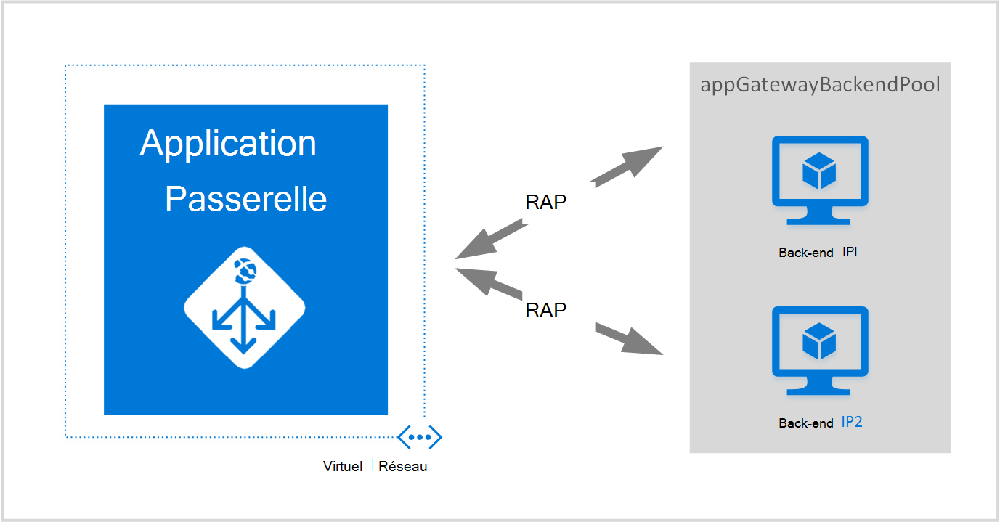
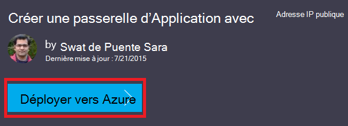
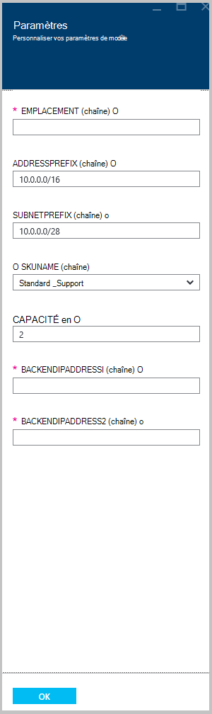

<properties
   pageTitle="Créer une passerelle d’application à l’aide des modèles du Gestionnaire de ressources Azure | Microsoft Azure"
   description="Cette page fournit des instructions pour créer une passerelle d’application Azure en utilisant le modèle de gestionnaire de ressources Azure"
   documentationCenter="na"
   services="application-gateway"
   authors="georgewallace"
   manager="carmonm"
   editor="tysonn"/>
<tags
   ms.service="application-gateway"
   ms.devlang="na"
   ms.topic="article"
   ms.tgt_pltfrm="na"
   ms.workload="infrastructure-services"
   ms.date="10/25/2016"
   ms.author="gwallace"/>

# Créer une passerelle d’application en utilisant le modèle de gestionnaire de ressources Azure

> [AZURE.SELECTOR]
- [Azure portal](application-gateway-create-gateway-portal.md)
- [Azure PowerShell de gestionnaire de ressources](application-gateway-create-gateway-arm.md)
- [Azure PowerShell classique](application-gateway-create-gateway.md)
- [Modèle de gestionnaire de ressources Azure](application-gateway-create-gateway-arm-template.md)
- [CLI Azure](application-gateway-create-gateway-cli.md)

Passerelle d’Application Azure est un équilibreur de charge de couche 7. Il fournit le basculement, routage des performances des requêtes HTTP entre différents serveurs, qu’ils soient sur le nuage ou sur site. Passerelle d’application fournit de nombreuses fonctionnalités de contrôleur de livraison d’applications (ADC), notamment l’équilibrage de charge HTTP, l’affinité de cookie de session, le déchargement de Secure Sockets Layer (SSL), les sondes d’état personnalisé, prise en charge de plusieurs sites et bien d’autres. Pour obtenir une liste complète des fonctionnalités prises en charge, consultez [Vue d’ensemble de la passerelle Application](application-gateway-introduction.md)

Vous apprenez à les télécharger et de modifier un modèle de gestionnaire de ressources Azure existant à partir de GitHub et de déployer le modèle à partir de la CLI d’Azure, PowerShell et GitHub.

Si vous déployez simplement le modèle de gestionnaire de ressources Azure directement à partir de GitHub sans aucune modification, ignorer pour déployer un modèle à partir de GitHub.

## Scénario

Dans ce scénario, vous allez :

- Créer une passerelle d’application avec les deux instances.
- Créer un réseau virtuel appelé VirtualNetwork1 avec un bloc CIDR réservé de 10.0.0.0/16.
- Créer un sous-réseau appelé Appgatewaysubnet qui utilise 10.0.0.0/28 comme son bloc CIDR.
- Configurer deux précédemment configuré IPs back-end pour les serveurs web que vous voulez équilibrer la charge du trafic. Dans cet exemple de modèle, les adresses IP du back-end sont 10.0.1.10 et 10.0.1.11.

>[AZURE.NOTE] Ces paramètres sont les paramètres de ce modèle. Pour personnaliser le modèle, vous pouvez modifier les règles, le port d’écoute et le protocole SSL qui ouvre le azuredeploy.json.

## Téléchargez et comprendre le modèle de gestionnaire de ressources Azure

Vous pouvez télécharger le modèle de gestionnaire de ressources Azure existant pour créer un réseau virtuel et deux sous-réseaux à partir de GitHub, apportez les modifications, vous pouvez souhaitez et réutiliser. Pour ce faire, procédez comme suit :

1. Accédez à [créer la passerelle d’Application](https://github.com/Azure/azure-quickstart-templates/tree/master/101-application-gateway-create).
2. Cliquez sur **azuredeploy.json**, puis cliquez sur **RAW**.
3. Enregistrez le fichier dans un dossier local sur votre ordinateur.
4. Si vous êtes familiarisé avec les modèles du Gestionnaire de ressources Azure, passez à l’étape 7.
5. Ouvrez le fichier que vous avez enregistré et examinez le contenu sous les **paramètres** dans la ligne 5. Paramètres de modèle de gestionnaire de ressources Azure fournissent un espace réservé pour les valeurs qui peuvent être remplis au cours du déploiement.

  	| Paramètre | Description |
  	|---|---|
  	| **emplacement** | Région Azure où la passerelle d’application est créée |
  	| **VirtualNetwork1** | Nom pour le nouveau réseau virtuel |
  	| **addressPrefix** | Espace d’adressage pour le réseau virtuel, au format CIDR |
  	| **ApplicationGatewaysubnet** | Nom du sous-réseau de passerelle d’application |
  	| **subnetPrefix** | Bloc CIDR pour le sous-réseau de passerelle d’application |
  	| **SKUName** | Taille d’instance SKU |
  	| **capacité** | Nombre d’instances |
  	| **backendaddress1** | Adresse IP du premier serveur web |
  	| **backendaddress2** | Adresse IP du deuxième serveur web |

    >[AZURE.IMPORTANT] Modèles de gestionnaire de ressources Azure mis à jour dans GitHub peuvent changer avec le temps. Vérifiez que le modèle avant de l’utiliser.

6. Vérifiez le contenu sous **ressources** et notez les éléments suivants :

    - **type**. Type de ressource qui est créé par le modèle. Dans ce cas, le type est **Microsoft.Network/applicationGateways**, qui représente une passerelle d’application.
    - **nom**. Nom de la ressource. Notez l’utilisation de **[parameters('applicationGatewayName')]**, qui signifie que le nom est fourni en tant qu’entrée par vous ou par un fichier de paramètres au cours du déploiement.
    - **Propriétés**. Liste des propriétés de la ressource. Ce modèle utilise le réseau virtuel et une adresse IP publique lors de la création de passerelle d’application.

7. Accédez à [https://github.com/Azure/azure-quickstart-templates/blob/master/101-application-gateway-create/](https://github.com/Azure/azure-quickstart-templates/blob/master/101-application-gateway-create).
8. Cliquez sur **azuredeploy-paremeters.json**, puis cliquez sur **RAW**.
9. Enregistrez le fichier dans un dossier local sur votre ordinateur.
10. Ouvrez le fichier que vous avez enregistré et de modifier les valeurs pour les paramètres. Utilisez les valeurs suivantes pour déployer la passerelle d’application décrite dans notre scénario.

        {
        "$schema": "http://schema.management.azure.com/schemas/2015-01-01/deploymentParameters.json#",
        {
        "location" : {
        "value" : "West US"
        },
        "addressPrefix": {
        "value": "10.0.0.0/16"
        },
        "subnetPrefix": {
        "value": "10.0.0.0/24"
        },
        "skuName": {
        "value": "Standard_Small"
        },
        "capacity": {
        "value": 2
        },
        "backendIpAddress1": {
        "value": "10.0.1.10"
        },
        "backendIpAddress2": {
        "value": "10.0.1.11"
        }
        }

11. Enregistrez le fichier. Vous pouvez tester le modèle JSON et le modèle de paramètre à l’aide des outils de validation de JSON en ligne comme [JSlint.com](http://www.jslint.com/).

## Déployer le modèle de gestionnaire de ressources Azure à l’aide de PowerShell

Si vous n’avez jamais utilisé Azure PowerShell, voir [Comment faire pour installer et configurer Azure PowerShell](../powershell-install-configure.md) et suivez les instructions pour signer dans Azure et sélectionnez votre abonnement.

### Étape 1

    Login-AzureRmAccount

### Étape 2

Vérifiez les abonnements pour le compte.

    Get-AzureRmSubscription

Vous êtes invité à authentifier vos informations d’identification.

### Étape 3

Choisir vos abonnements Azure à utiliser.

    Select-AzureRmSubscription -Subscriptionid "GUID of subscription"

### Étape 4

Si nécessaire, créez un groupe de ressources à l’aide de l’applet de commande **New-AzureResourceGroup** . Dans l’exemple suivant, vous créez un groupe de ressources appelé AppgatewayRG emplacement américain d’Extrême-Orient.

    New-AzureRmResourceGroup -Name AppgatewayRG -Location "East US"

Exécutez l’applet de commande **New-AzureRmResourceGroupDeployment** pour déployer le nouveau réseau virtuel en utilisant le modèle précédent et les fichiers de paramètres vous avez téléchargé et modifié.

    New-AzureRmResourceGroupDeployment -Name TestAppgatewayDeployment -ResourceGroupName AppgatewayRG `
        -TemplateFile C:\ARM\azuredeploy.json -TemplateParameterFile C:\ARM\azuredeploy-parameters.json

## Déployer le modèle de gestionnaire de ressources Azure à l’aide de la CLI d’Azure

Pour déployer le modèle de gestionnaire de ressources Azure que vous avez téléchargé à l’aide de CLI d’Azure, suivez les étapes ci-dessous :

### Étape 1

Si vous n’avez jamais utilisé Azure CLI, reportez-vous à la section [installer et configurer l’infrastructure du langage commun Azure](../xplat-cli-install.md) et suivez les instructions jusqu'à l’endroit où vous sélectionnez votre compte Azure et abonnement.

### Étape 2

Exécutez la commande **mode config azure** pour passer en mode de gestionnaire de ressources, comme indiqué ci-dessous.

    azure config mode arm

Voici la sortie attendue de la commande ci-dessus :

    info:   New mode is arm

### Étape 3

Si nécessaire, exécutez la commande de **Création de groupe azure** pour créer un nouveau groupe de ressources, comme indiqué ci-dessous. Notez la sortie de la commande. La liste est indiquée après que la sortie explique les paramètres utilisés. Pour plus d’informations sur les groupes de ressources, consultez [vue d’ensemble du Gestionnaire de ressources Azure](../azure-resource-manager/resource-group-overview.md).

    azure group create -n appgatewayRG -l eastus

**n-(ou--nom)**. Nom du nouveau groupe de ressources. Pour notre scénario, il est *appgatewayRG*.

**-l (ou--emplacement)**. Région Azure où le nouveau groupe de ressources est créé. Pour notre scénario, il est *eastus*.

### Étape 4

Exécutez l’applet de commande **groupe azure déploiement crée** pour déployer le nouveau réseau virtuel en utilisant les fichiers de modèle et de paramètres vous avez téléchargé et modifier les propriétés. La liste est indiquée après que la sortie explique les paramètres utilisés.

    azure group deployment create -g appgatewayRG -n TestAppgatewayDeployment -f C:\ARM\azuredeploy.json -e C:\ARM\azuredeploy-parameters.json

## Déployer le modèle de gestionnaire de ressources Azure à l’aide de clic à déployer

Cliquez sur pour déployer une autre méthode consiste à utiliser des modèles d’Azure le Gestionnaire de ressources. Il s’agit d’un moyen facile d’utiliser des modèles avec le portail Azure.

### Étape 1

Passez à [Création d’une passerelle d’application avec l’adresse IP publique](https://azure.microsoft.com/documentation/templates/101-application-gateway-public-ip/).

### Étape 2

Cliquez sur **déployer sur Azure**.

### Étape 3

Entrez les paramètres pour le modèle de déploiement sur le portail et cliquez sur **OK**.

### Étape 4

Permet de sélectionner **les conditions juridiques** , cliquez sur **acheter**.

### Étape 5

Sur la lame de déploiement personnalisé, cliquez sur **créer**.

## Étapes suivantes

Si vous souhaitez configurer le déchargement SSL, voir [configurer une passerelle d’application pour SSL de déchargement](application-gateway-ssl.md).

Si vous souhaitez configurer une passerelle d’application à utiliser avec un équilibreur de charge interne, voir [Création d’une passerelle d’application avec un équilibreur de charge interne (ILB)](application-gateway-ilb.md).

Si vous souhaitez plus d’informations sur des options d’équilibrage de charge en général, visitez le site :

- [Équilibreur de charge Azure](https://azure.microsoft.com/documentation/services/load-balancer/)
- [Gestionnaire de trafic Azure](https://azure.microsoft.com/documentation/services/traffic-manager/)
