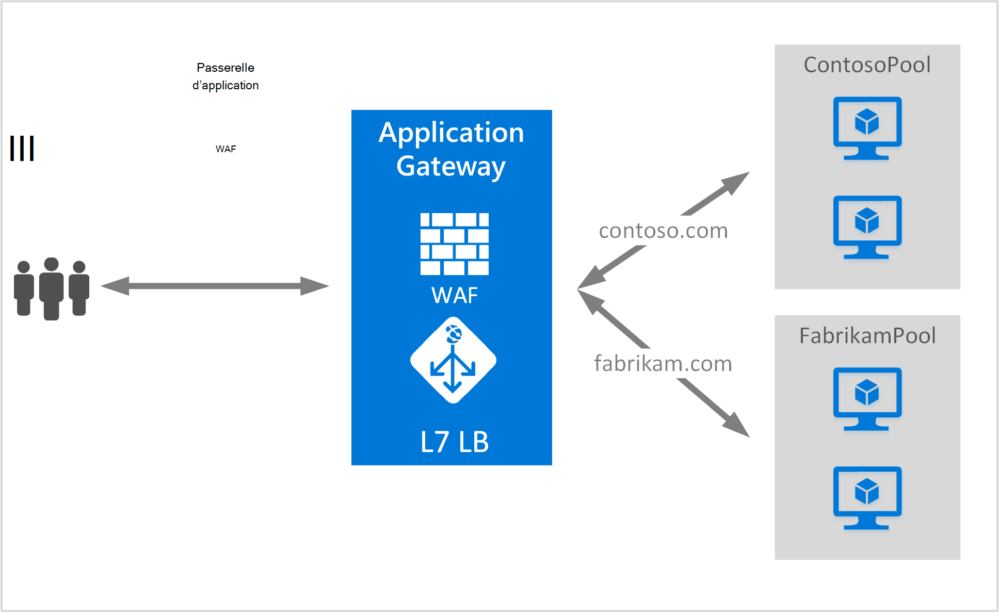

<properties
   pageTitle="Créer une passerelle d’application pour l’hébergement de plusieurs sites | Microsoft Azure"
   description="Cette page fournit des instructions pour la création, la configuration d’une passerelle d’application Azure pour l’hébergement de plusieurs applications web sur la même passerelle."
   documentationCenter="na"
   services="application-gateway"
   authors="amsriva"
   manager="rossort"
   editor="amsriva"/>
<tags
   ms.service="application-gateway"
   ms.devlang="na"
   ms.topic="article"
   ms.tgt_pltfrm="na"
   ms.workload="infrastructure-services"
   ms.date="10/25/2016"
   ms.author="amsriva"/>

# Créer une passerelle d’application pour l’hébergement de plusieurs applications web

> [AZURE.SELECTOR]
- [Azure portal](application-gateway-create-multisite-portal.md)
- [Azure PowerShell de gestionnaire de ressources](application-gateway-create-multisite-azureresourcemanager-powershell.md)

Hébergement de plusieurs sites vous permet de déployer plusieurs applications web sur la même passerelle d’application. Il s’appuie sur la présence de l’en-tête de l’hôte dans la requête HTTP entrante, pour déterminer quel écouteur reçoit le trafic. L’écouteur dirige ensuite le trafic vers le pool de serveur principal approprié tel que configuré dans la définition de règles de la passerelle. Dans les applications web SSL activé, passerelle d’application dépend de l’extension de l’Indication de nom de serveur (SNI) pour choisir le port d’écoute approprié pour le trafic web. Une utilisation courante de l’hébergement de plusieurs sites est à la charge des demandes de solde pour les domaines web différents pour les pools des serveurs principaux différents. De la même façon plusieurs sous-domaines du domaine racine même peuvent également être hébergés sur la même passerelle d’application.

## Scénario

Dans l’exemple suivant, passerelle d’application sert le trafic pour contoso.com et fabrikam.com avec deux pools de serveur back-end : contoso serveur pool et pool de serveur de fabrikam. Le programme d’installation similaire peut servir aux sous-domaines d’hôte telles que app.contoso.com et blog.contoso.com.

## Avant de commencer

1. À l’aide de Web Platform Installer, installez la version la plus récente des applets de commande PowerShell d’Azure. Vous pouvez télécharger et installer la dernière version à partir de la section **Windows PowerShell** de la [page de téléchargement](https://azure.microsoft.com/downloads/).
2. Les serveurs ajoutés au pool de back-end à utiliser la passerelle d’application doivent exister ou ont créé leurs points de terminaison dans le réseau virtuel dans un sous-réseau distinct ou avec un IP public/VIP affecté.

## Configuration requise

- **Pool de serveurs back-end :** La liste des adresses IP des serveurs principaux. Les adresses IP répertoriées doivent soit appartenir au sous-réseau de réseau virtuel ou doivent être un IP public/VIP. Nom de domaine complet peut également être utilisé.
- **Paramètres de pool de serveurs back-end :** Chaque pool dispose de paramètres comme port, le protocole et l’affinité basée sur les cookies. Ces paramètres sont liés à un pool et sont appliquées à tous les serveurs au sein du pool.
- **Port front-end :** Ce port est le port public qui est ouvert sur la passerelle d’application. Le trafic atteint ce port et qui obtient ensuite redirigé vers l’un des serveurs principaux.
- **Récepteur :** L’écouteur a un port front-end, un protocole (Http ou Https, ces valeurs sont sensibles à la casse) et le nom du certificat SSL (si le décharge de la configuration de SSL). Pour les passerelles d’application activée de plusieurs sites, nom d’hôte et les indicateurs SNI sont également ajoutés.
- **Règle :** La règle lie l’écouteur, le pool de serveur principal et définit le pool de serveur back-end le trafic doit être dirigé vers lorsqu’il rencontre un écouteur particulier.

## Créer une passerelle d’application

Les étapes nécessaires à la création d’une passerelle d’application sont les suivantes :

1. Créer un groupe de ressources pour le Gestionnaire de ressources.
2. Créer un réseau virtuel, des sous-réseaux et publique IP pour la passerelle d’application.
3. Créer un objet de configuration d’application passerelle.
4. Créer une ressource d’application passerelle.

## Créer un groupe de ressources pour le Gestionnaire de ressources

Assurez-vous que vous utilisez la version la plus récente de PowerShell d’Azure. Informations supplémentaires sont disponibles à [L’aide de Windows PowerShell avec le Gestionnaire de ressources](../powershell-azure-resource-manager.md).

### Étape 1

Ouvrez une session Azure

    Login-AzureRmAccount

Vous êtes invité à authentifier vos informations d’identification.

### Étape 2

Vérifiez les abonnements pour le compte.

    Get-AzureRmSubscription

### Étape 3

Choisir vos abonnements Azure à utiliser.

    Select-AzureRmSubscription -SubscriptionName "Name of subscription"

### Étape 4

Créer un groupe de ressources (ignorer cette étape si vous utilisez un groupe de ressources existant).

    New-AzureRmResourceGroup -Name appgw-RG -location "West US"

Vous pouvez également créer des balises pour un groupe de ressources pour la passerelle d’application :

    $resourceGroup = New-AzureRmResourceGroup -Name appgw-RG -Location "West US" -Tags @{Name = "testtag"; Value = "Application Gateway multiple site"}

Le Gestionnaire de ressources Azure requiert que tous les groupes de ressources spécifient un emplacement. Cet emplacement est utilisé comme emplacement par défaut pour les ressources dans ce groupe de ressources. Assurez-vous que toutes les commandes pour créer une passerelle d’application utilisent le même groupe de ressources.

Dans l’exemple ci-dessus, nous avons créé un groupe de ressources appelé « appgw-RG » avec un emplacement de « Ouest nous ».

>[AZURE.NOTE] Si vous avez besoin configurer une sonde personnalisée pour votre passerelle d’application, voir [Création d’une passerelle d’application avec des sondes personnalisées à l’aide de PowerShell](application-gateway-create-probe-ps.md). Reportez-vous au [contrôle du fonctionnement et sondes personnalisés](application-gateway-probe-overview.md) pour plus d’informations.

## Créer un réseau virtuel et sous-réseaux

L’exemple suivant montre comment créer un réseau virtuel à l’aide du Gestionnaire de ressources. Deux sous-réseaux sont créés dans cette étape. Le premier sous-réseau est pour la passerelle d’application lui-même. Passerelle d’application nécessite son propre sous-réseau pour contenir ses instances. Uniquement autres passerelles d’application peuvent être déployées dans ce sous-réseau. Le deuxième sous-réseau est utilisé pour contenir les serveurs d’applications back-end.

### Étape 1

Assignez le 10.0.0.0/24 plage adresse à la variable de sous-réseau à utiliser pour stocker la passerelle d’application.

    $subnet = New-AzureRmVirtualNetworkSubnetConfig -Name appgatewaysubnet -AddressPrefix 10.0.0.0/24

### Étape 2

Affecter la 10.0.1.0/24 plage adresse à la variable subnet2 à utiliser pour les pools de back-end.

    $subnet2 = New-AzureRmVirtualNetworkSubnetConfig -Name backendsubnet -AddressPrefix 10.0.1.0/24

### Étape 3

Créer un réseau virtuel nommé « appgwvnet » dans la ressource groupe « appgw-rg » pour la région Ouest américaine avec le préfixe 10.0.0.0/16 de sous-réseau 10.0.0.0/24 et 10.0.1.0/24.

    $vnet = New-AzureRmVirtualNetwork -Name appgwvnet -ResourceGroupName appgw-RG -Location "West US" -AddressPrefix 10.0.0.0/16 -Subnet $subnet,$subnet2

### Étape 4

Affecter une variable de sous-réseau pour les étapes suivantes, laquelle crée une passerelle d’application.

    $appgatewaysubnet = Get-AzureRmVirtualNetworkSubnetConfig -Name appgatewaysubnet -VirtualNetwork $vnet
    $backendsubnet = Get-AzureRmVirtualNetworkSubnetConfig -Name backendsubnet -VirtualNetwork $vnet

## Créer une adresse IP publique pour la configuration frontale

Créez une ressource IP publique « publicIP01 » dans la ressource groupe « appgw-rg » pour la région Ouest.

    $publicip = New-AzureRmPublicIpAddress -ResourceGroupName appgw-RG -name publicIP01 -location "West US" -AllocationMethod Dynamic

Une adresse IP est affectée à la passerelle de l’application lorsque le service démarre.

## Créer la configuration de passerelle d’application

Vous devez configurer tous les éléments de configuration avant de créer la passerelle d’application. Les étapes suivantes créent les éléments de configuration qui sont nécessaires pour une ressource d’application passerelle.

### Étape 1

Créer la configuration IP d’une passerelle d’application nommée « gatewayIP01 ». Lors du démarrage de la passerelle d’application, il sélectionne une adresse IP du sous-réseau configuré et route le trafic réseau vers les adresses IP dans le pool d’IP back-end. Gardez à l’esprit que chaque instance prend une adresse IP.

    $gipconfig = New-AzureRmApplicationGatewayIPConfiguration -Name gatewayIP01 -Subnet $appgatewaysubnet

### Étape 2

Configurer le pool d’adresses IP principal nommé « pool01 » et « pool2 » avec des adresses IP « entre 10.0.1.100, 10.0.1.101,10.0.1.102 » pour « pool1 » et « 10.0.1.103, 10.0.1.104, 10.0.1.105 » pour « pool2 ».

    $pool1 = New-AzureRmApplicationGatewayBackendAddressPool -Name pool01 -BackendIPAddresses 10.0.1.100, 10.0.1.101, 10.0.1.102
    $pool2 = New-AzureRmApplicationGatewayBackendAddressPool -Name pool02 -BackendIPAddresses 10.0.1.103, 10.0.1.104, 10.0.1.105

Dans cet exemple, il existe deux pools de back-end pour router le trafic réseau selon le site demandé. Un pool reçoit le trafic à partir de site « contoso.com » et l’autre pool reçoit le trafic à partir de site « fabrikam.com ». Vous devez remplacer les adresses IP ci-dessus pour ajouter vos propres points de terminaison application IP adresse. À la place des adresses IP internes, vous pouvez également utiliser les adresses IP publiques, nom de domaine complet ou carte d’interface réseau d’un ordinateur virtuel pour les instances de serveur principal. Utilisez «-BackendFQDNs » paramètre dans PowerShell pour spécifier les noms de domaine complets au lieu de l’IPs.

### Étape 3

Configurez le paramètre de passerelle d’application « poolsetting01 » et « poolsetting02 » pour le trafic réseau à charge équilibrée dans le pool principal. Dans cet exemple, vous configurez les paramètres de pool de principal différent pour les pools de back-end. Chaque pool principal peut avoir son propre paramètre de pool de back-end.

    $poolSetting01 = New-AzureRmApplicationGatewayBackendHttpSettings -Name "besetting01" -Port 80 -Protocol Http -CookieBasedAffinity Disabled -RequestTimeout 120
    $poolSetting02 = New-AzureRmApplicationGatewayBackendHttpSettings -Name "besetting02" -Port 80 -Protocol Http -CookieBasedAffinity Enabled -RequestTimeout 240

### Étape 4

Configurer le front-end IP avec point de terminaison IP publique.

    $fipconfig01 = New-AzureRmApplicationGatewayFrontendIPConfig -Name "frontend1" -PublicIPAddress $publicip

### Étape 5

Configurer le port front-end pour une passerelle d’application.

    $fp01 = New-AzureRmApplicationGatewayFrontendPort -Name "fep01" -Port 443

### Étape 6

Configurer les deux certificats SSL pour les sites Web de deux que pour prendre en charge dans cet exemple, nous allons. Un certificat est pour le trafic de contoso.com et l’autre pour le trafic de fabrikam.com. Ces certificats doivent être une autorité de certification délivre des certificats pour vos sites Web. Les certificats auto-signés sont pris en charge mais non recommandés pour le trafic de production.

    $cert01 = New-AzureRmApplicationGatewaySslCertificate -Name contosocert -CertificateFile <file path> -Password <password>
    $cert02 = New-AzureRmApplicationGatewaySslCertificate -Name fabrikamcert -CertificateFile <file path> -Password <password>

### Étape 7

Dans cet exemple, configurez deux écouteurs pour les deux sites web. Cette étape configure les écouteurs pour public hôte utilisé pour recevoir le trafic entrant, port et adresse IP. Paramètre de nom d’hôte est nécessaire pour la prise en charge de plusieurs sites et doit être défini sur le site Web approprié, pour lesquelles le trafic est reçu. Paramètre de RequireServerNameIndication doit être définie sur true pour les sites Web qui ont besoin de la prise en charge pour SSL dans un scénario à plusieurs hôtes. Si la prise en charge SSL est requise, vous devez également spécifier le certificat SSL est utilisé pour sécuriser le trafic de l’application web. La combinaison de FrontendIPConfiguration, FrontendPort et nom d’hôte doit être unique pour un port d’écoute. Chaque écouteur peut prendre en charge un seul certificat.

    $listener01 = New-AzureRmApplicationGatewayHttpListener -Name "listener01" -Protocol Https -FrontendIPConfiguration $fipconfig01 -FrontendPort $fp01 -HostName "contoso11.com" -RequireServerNameIndication true  -SslCertificate $cert01
    $listener02 = New-AzureRmApplicationGatewayHttpListener -Name "listener02" -Protocol Https -FrontendIPConfiguration $fipconfig01 -FrontendPort $fp01 -HostName "fabrikam11.com" -RequireServerNameIndication true -SslCertificate $cert02

### Étape 8

Dans cet exemple, créez deux paramètres de règle pour les applications web de deux. Une règle associe des écouteurs, des pools de back-end et des paramètres http. Cette étape configure la passerelle d’application pour utiliser la règle de routage base, un pour chaque site Web. Le trafic sur chaque site Web est reçu par son écouteur configuré et est alors dirigé vers son pool principal configuré, à l’aide des propriétés indiquées dans le BackendHttpSettings.

    $rule01 = New-AzureRmApplicationGatewayRequestRoutingRule -Name "rule01" -RuleType Basic -HttpListener $listener01 -BackendHttpSettings $poolSetting01 -BackendAddressPool $pool1
    $rule02 = New-AzureRmApplicationGatewayRequestRoutingRule -Name "rule02" -RuleType Basic -HttpListener $listener02 -BackendHttpSettings $poolSetting02 -BackendAddressPool $pool2

### Étape 9

Configurez le nombre d’instances et de taille pour la passerelle d’application.

    $sku = New-AzureRmApplicationGatewaySku -Name "Standard_Medium" -Tier Standard -Capacity 2

## Créer application passerelle

Créer une passerelle d’application avec tous les objets de configuration dans les étapes précédentes.

    $appgw = New-AzureRmApplicationGateway -Name appgwtest -ResourceGroupName appgw-RG -Location "West US" -BackendAddressPools $pool1,$pool2 -BackendHttpSettingsCollection $poolSetting01, $poolSetting02 -FrontendIpConfigurations $fipconfig01 -GatewayIpConfigurations $gipconfig -FrontendPorts $fp01 -HttpListeners $listener01, $listener02 -RequestRoutingRules $rule01, $rule02 -Sku $sku -SslCertificates $cert01, $cert02

>[AZURE.IMPORTANT] Approvisionnement d’application passerelle est une opération longue et peut prendre un certain temps pour terminer.

## Obtenir le nom de l’application passerelle DNS

Une fois la passerelle est créée, l’étape suivante consiste à configurer le front-end pour la communication. Lorsque vous utilisez une adresse IP publique, la passerelle d’application requiert un nom DNS attribué de manière dynamique, ce qui n’est pas convivial. Pour garantir aux utilisateurs finaux peut atteint la passerelle d’application un enregistrement CNAME peut servir pour pointer vers le point de terminaison public de la passerelle d’application. [Configuration d’un nom de domaine personnalisé pour dans Azure](../cloud-services/cloud-services-custom-domain-name-portal.md). Pour ce faire, récupérer les détails de la passerelle d’application et de ses associé IP ou le nom DNS à l’aide de l’élément PublicIPAddress attaché à la passerelle d’application. Nom DNS de la passerelle application doit être utilisé pour créer un enregistrement CNAME, qui désigne les applications web de deux à ce nom DNS. L’utilisation d’un des enregistrements n’est pas recommandée car l’adresse IP virtuelle peut changer lors du redémarrage de la passerelle d’application.
    
    Get-AzureRmPublicIpAddress -ResourceGroupName appgw-RG -Name publicIP01
        
    Name                     : publicIP01
    ResourceGroupName        : appgw-RG
    Location                 : westus
    Id                       : /subscriptions/<subscription_id>/resourceGroups/appgw-RG/providers/Microsoft.Network/publicIPAddresses/publicIP01
    Etag                     : W/"00000d5b-54ed-4907-bae8-99bd5766d0e5"
    ResourceGuid             : 00000000-0000-0000-0000-000000000000
    ProvisioningState        : Succeeded
    Tags                     : 
    PublicIpAllocationMethod : Dynamic
    IpAddress                : xx.xx.xxx.xx
    PublicIpAddressVersion   : IPv4
    IdleTimeoutInMinutes     : 4
    IpConfiguration          : {
                                 "Id": "/subscriptions/<subscription_id>/resourceGroups/appgw-RG/providers/Microsoft.Network/applicationGateways/appgwtest/frontendIP
                               Configurations/frontend1"
                               }
    DnsSettings              : {
                                 "Fqdn": "00000000-0000-xxxx-xxxx-xxxxxxxxxxxx.cloudapp.net"
                               }

## Étapes suivantes

Découvrez comment protéger vos sites Web à une [Application passerelle - pare-feu pour applications Web](application-gateway-webapplicationfirewall-overview.md)