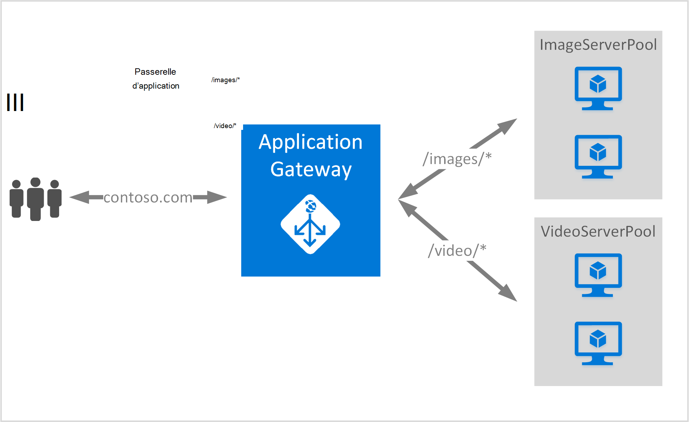

<properties
   pageTitle="Créer une passerelle d’application à l’aide des règles de routage d’URL | Microsoft Azure"
   description="Cette page fournit des instructions pour la création, la configuration d’une passerelle d’application Azure à l’aide des règles de routage d’URL"
   documentationCenter="na"
   services="application-gateway"
   authors="georgewallace"
   manager="jdial"
   editor="tysonn"/>
<tags
   ms.service="application-gateway"
   ms.devlang="na"
   ms.topic="article"
   ms.tgt_pltfrm="na"
   ms.workload="infrastructure-services"
   ms.date="10/25/2016"
   ms.author="gwallace"/>

# Créer une passerelle d’application à l’aide du routage basé sur le chemin d’accès 

> [AZURE.SELECTOR]
- [Azure portal](application-gateway-create-url-route-portal.md)
- [Azure PowerShell de gestionnaire de ressources](application-gateway-create-url-route-arm-ps.md)

Routage basé sur le chemin d’accès d’URL vous permet d’associer des itinéraires basés sur le chemin d’accès de l’URL de requête Http. Il vérifie s’il existe un itinéraire vers un pool de back-end configuré pour les listes d’URL dans une Application passerelle et envoyer le trafic réseau vers le pool principal défini. Une utilisation courante de routage basé sur l’URL est à la charge des demandes de solde pour les types de contenu différents pour les pools des serveurs principaux différents.

Passerelle d’application basée sur l’URL de routage présente un nouveau type de règle. Passerelle d’application possède deux types de règles : base et PathBasedRouting. Type de règle de base fournit un service de répétition alternée pour les pools back-end PathBasedRouting lors de la distribution de répétition alternée, prend également le modèle de chemin d’accès de l’URL de la demande en considération lors du choix du pool back-end.

>[AZURE.IMPORTANT] PathPattern : La liste des modèles de chemin d’accès pour faire correspondre. Chacun doit commencer par / et le seul endroit où une «\*» est autorisé est à la fin. Exemples valides sont /xyz, /xyz* ou /xyz/*. La chaîne utilisée dans le traitement de chemin d’accès n’inclut pas de tout texte situé après le premier « ? » ou « # » et ces caractères ne sont pas autorisés. 

## Scénario
Dans l’exemple suivant, Application Gateway sert le trafic pour contoso.com avec deux pools de serveur back-end : pool de serveur vidéo et image de pool de serveur.

Demandes de http://contoso.com/image* sont routés vers un pool de serveurs d’image (pool1) et http://contoso.com/video* sont transférées vers le pool de serveur vidéo (pool2). Un pool de serveurs par défaut (pool1) est sélectionné si aucun des modèles de chemin d’accès correspond.

## Avant de commencer

1. À l’aide de Web Platform Installer, installez la version la plus récente des applets de commande PowerShell d’Azure. Vous pouvez télécharger et installer la dernière version à partir de la section **Windows PowerShell** de la [page de téléchargement](https://azure.microsoft.com/downloads/).
2. Vous créez un réseau virtuel et le sous-réseau pour la passerelle d’Application. Assurez-vous qu’aucun machines virtuelles ou des déploiements dans le cloud n’utilisent le sous-réseau. La passerelle d’application lui-même doit être dans un sous-réseau de réseau virtuel.
3. Les serveurs ajoutés au pool de back-end à utiliser la passerelle d’application doivent exister ou ont créé leurs points de terminaison dans le réseau virtuel ou avec un IP public/VIP affecté.

## Ce qui est nécessaire pour créer une passerelle d’application ?

- **Pool de serveurs back-end :** La liste des adresses IP des serveurs principaux. Les adresses IP répertoriées doivent soit appartenir au sous-réseau de réseau virtuel ou doivent être un IP public/VIP.
- **Paramètres de pool de serveurs back-end :** Chaque pool dispose de paramètres comme port, le protocole et l’affinité basée sur les cookies. Ces paramètres sont liés à un pool et sont appliquées à tous les serveurs au sein du pool.
- **Port front-end :** Ce port est le port public qui est ouvert sur la passerelle d’application. Le trafic atteint ce port et qui obtient ensuite redirigé vers l’un des serveurs principaux.
- **Récepteur :** L’écouteur a un port front-end, un protocole (Http ou Https, qui sont sensibles à la casse) et le nom du certificat SSL (si le décharge de la configuration de SSL).
- **Règle :** La règle lie l’écouteur, le pool de serveur principal et définit le pool de serveur back-end le trafic doit être dirigé vers lorsqu’il rencontre un écouteur particulier.

## Créer une passerelle d’application

La différence entre l’utilisation classique d’Azure et d’Azure le Gestionnaire de ressources est l’ordre dans lequel vous créez la passerelle d’application et les éléments qui doivent être configurés.

Avec le Gestionnaire de ressources, tous les éléments qui composent une passerelle d’application configurés individuellement et mettez ensuite pour créer la ressource de passerelle d’application.

Voici les étapes nécessaires à la création d’une passerelle d’application :

1. Créer un groupe de ressources pour le Gestionnaire de ressources.
2. Créer un réseau virtuel, du sous-réseau et adresse IP publique pour la passerelle d’application.
3. Créer un objet de configuration d’application passerelle.
4. Créer une ressource d’application passerelle.

## Créer un groupe de ressources pour le Gestionnaire de ressources

Assurez-vous que vous utilisez la version la plus récente de PowerShell d’Azure. Plus d’infos est disponible à [L’aide de Windows PowerShell avec le Gestionnaire de ressources](../powershell-azure-resource-manager.md).

### Étape 1

Ouvrez une session Azure

    Login-AzureRmAccount

Vous êtes invité à authentifier vos informations d’identification. 

### Étape 2

Vérifiez les abonnements pour le compte.

    Get-AzureRmSubscription

### Étape 3

Choisir vos abonnements Azure à utiliser.  

    Select-AzureRmSubscription -Subscriptionid "GUID of subscription"

### Étape 4

Créer un groupe de ressources (ignorer cette étape si vous utilisez un groupe de ressources existant).

    New-AzureRmResourceGroup -Name appgw-RG -Location "West US"

Vous pouvez également créer des balises pour un groupe de ressources pour la passerelle d’application :
    
    $resourceGroup = New-AzureRmResourceGroup -Name appgw-RG -Location "West US" -Tags @{Name = "testtag"; Value = "Application Gateway URL routing"} 

Le Gestionnaire de ressources Azure requiert que tous les groupes de ressources spécifient un emplacement. Il est utilisé comme emplacement par défaut pour les ressources dans ce groupe de ressources. Assurez-vous que toutes les commandes pour créer une passerelle d’application utilisent le même groupe de ressources.

Dans l’exemple ci-dessus, nous avons créé un groupe de ressources appelé « appgw-RG » et l’emplacement « Ouest nous ».

>[AZURE.NOTE] Si vous avez besoin configurer une sonde personnalisée pour votre passerelle d’application, voir [Création d’une passerelle d’application avec des sondes personnalisées à l’aide de PowerShell](application-gateway-create-probe-ps.md). Consultez les [sondes personnalisé et le contrôle d’état](application-gateway-probe-overview.md) pour plus d’informations.

## Créer un réseau virtuel et un sous-réseau pour la passerelle d’application

L’exemple suivant montre comment créer un réseau virtuel à l’aide du Gestionnaire de ressources.

### Étape 1

Assignez le 10.0.0.0/24 plage adresse à la variable de sous-réseau à utiliser pour créer un réseau virtuel.

    $subnet = New-AzureRmVirtualNetworkSubnetConfig -Name subnet01 -AddressPrefix 10.0.0.0/24

### Étape 2

Créer un réseau virtuel nommé « appgwvnet » dans la ressource groupe « appgw-rg » pour la région Ouest américaine avec le préfixe 10.0.0.0/16 de sous-réseau 10.0.0.0/24.

    $vnet = New-AzureRmVirtualNetwork -Name appgwvnet -ResourceGroupName appgw-RG -Location "West US" -AddressPrefix 10.0.0.0/16 -Subnet $subnet

### Étape 3

Affecter une variable de sous-réseau pour les étapes suivantes, laquelle crée une passerelle d’application.

    $subnet=$vnet.Subnets[0]

## Créer une adresse IP publique pour la configuration frontale

Créez une ressource IP publique « publicIP01 » dans la ressource groupe « appgw-rg » pour la région Ouest.

    $publicip = New-AzureRmPublicIpAddress -ResourceGroupName appgw-RG -name publicIP01 -location "West US" -AllocationMethod Dynamic

Une adresse IP est affectée à la passerelle de l’application lorsque le service démarre.

## Créer la configuration de passerelle d’application

Tous les éléments de configuration doivent être définies avant la création de la passerelle d’application. Les étapes suivantes créent les éléments de configuration qui sont nécessaires pour une ressource d’application passerelle.

### Étape 1

Créer la configuration IP d’une passerelle d’application nommée « gatewayIP01 ». Lors du démarrage de la passerelle d’Application, il sélectionne une adresse IP du sous-réseau configuré et route le trafic réseau vers les adresses IP dans le pool d’IP back-end. Gardez à l’esprit que chaque instance prend une adresse IP.

    $gipconfig = New-AzureRmApplicationGatewayIPConfiguration -Name gatewayIP01 -Subnet $subnet

### Étape 2

Configurer le pool d’adresses IP principal nommé « pool01 » et « pool2 » avec des adresses IP « 134.170.185.46, 134.170.188.221,134.170.185.50 » pour « pool1 » et « 134.170.186.46, 134.170.189.221,134.170.186.50 » pour « pool2 ».

    $pool1 = New-AzureRmApplicationGatewayBackendAddressPool -Name pool01 -BackendIPAddresses 134.170.185.46, 134.170.188.221,134.170.185.50

    $pool2 = New-AzureRmApplicationGatewayBackendAddressPool -Name pool02 -BackendIPAddresses 134.170.186.46, 134.170.189.221,134.170.186.50

Dans cet exemple, il existe deux pools de back-end pour router le trafic réseau basée sur le chemin d’accès de l’URL. Un pool reçoit le trafic à partir du chemin d’accès de l’URL « / vidéo » et l’autre pool recevoir du trafic de chemin d’accès « / images ». Remplacer les adresses IP ci-dessus pour ajouter vos propres points de terminaison application IP adresse. 

### Étape 3

Configurez le paramètre de passerelle d’application « poolsetting01 » et « poolsetting02 » pour le trafic réseau à charge équilibrée dans le pool principal. Dans cet exemple, vous configurez les paramètres de pool de principal différent pour les pools de back-end. Chaque pool principal peut avoir son propre paramètre de pool de back-end.

    $poolSetting01 = New-AzureRmApplicationGatewayBackendHttpSettings -Name "besetting01" -Port 80 -Protocol Http -CookieBasedAffinity Disabled -RequestTimeout 120

    $poolSetting02 = New-AzureRmApplicationGatewayBackendHttpSettings -Name "besetting02" -Port 80 -Protocol Http -CookieBasedAffinity Enabled -RequestTimeout 240

### Étape 4

Configurer le front-end IP avec point de terminaison IP publique.

    $fipconfig01 = New-AzureRmApplicationGatewayFrontendIPConfig -Name "frontend1" -PublicIPAddress $publicip

### Étape 5 

Configurer le port front-end pour une passerelle d’application.

    $fp01 = New-AzureRmApplicationGatewayFrontendPort -Name "fep01" -Port 80
### Étape 6

Configurer le port d’écoute. Cette étape configure le port d’écoute pour l’adresse IP publique et le port utilisé pour recevoir le trafic réseau entrant. 
 
    $listener = New-AzureRmApplicationGatewayHttpListener -Name "listener01" -Protocol Http -FrontendIPConfiguration $fipconfig01 -FrontendPort $fp01

### Étape 7 

Configurer les chemins d’accès de la règle URL pour les pools de back-end. Cette étape configure le chemin d’accès relatif utilisé par la passerelle d’application pour définir le mappage entre le chemin d’accès de l’URL et le pool principal est affecté pour le trafic entrant.

L’exemple ci-dessous crée deux règles : une « image / » chemin d’accès le routage du trafic vers le principal « pool1 » et une autre pour « vidéo / » chemin d’accès au trafic de routage au back-end « pool2 ».
    
    $imagePathRule = New-AzureRmApplicationGatewayPathRuleConfig -Name "pathrule1" -Paths "/image/*" -BackendAddressPool $pool1 -BackendHttpSettings $poolSetting01

    $videoPathRule = New-AzureRmApplicationGatewayPathRuleConfig -Name "pathrule2" -Paths "/video/*" -BackendAddressPool $pool2 -BackendHttpSettings $poolSetting02

La configuration de mappage de chemin d’accès de règle configure également un pool d’adresses principal par défaut si le chemin d’accès ne correspond à aucune des règles de chemin d’accès prédéterminé. 

    $urlPathMap = New-AzureRmApplicationGatewayUrlPathMapConfig -Name "urlpathmap" -PathRules $videoPathRule, $imagePathRule -DefaultBackendAddressPool $pool1 -DefaultBackendHttpSettings $poolSetting02

### Étape 8

Créer un paramètre de règle. Cette étape configure la passerelle d’application pour utiliser le routage basé sur le chemin d’accès d’URL.

    $rule01 = New-AzureRmApplicationGatewayRequestRoutingRule -Name "rule1" -RuleType PathBasedRouting -HttpListener $listener -UrlPathMap $urlPathMap

### Étape 9

Configurez le nombre d’instances et de taille pour la passerelle d’application.

    $sku = New-AzureRmApplicationGatewaySku -Name "Standard_Small" -Tier Standard -Capacity 2

## Créer Application passerelle

Créer une passerelle d’application avec tous les objets de configuration dans les étapes précédentes.

    $appgw = New-AzureRmApplicationGateway -Name appgwtest -ResourceGroupName appgw-RG -Location "West US" -BackendAddressPools $pool1,$pool2 -BackendHttpSettingsCollection $poolSetting01, $poolSetting02 -FrontendIpConfigurations $fipconfig01 -GatewayIpConfigurations $gipconfig -FrontendPorts $fp01 -HttpListeners $listener -UrlPathMaps $urlPathMap -RequestRoutingRules $rule01 -Sku $sku

## Obtenir le nom de l’application passerelle DNS

Une fois la passerelle est créée, l’étape suivante consiste à configurer le front-end pour la communication. Lorsque vous utilisez une adresse IP publique, la passerelle d’application requiert un nom DNS attribué de manière dynamique, ce qui n’est pas convivial. Pour garantir aux utilisateurs finaux peut atteint la passerelle d’application un enregistrement CNAME peut servir pour pointer vers le point de terminaison public de la passerelle d’application. [Configuration d’un nom de domaine personnalisé pour dans Azure](../cloud-services/cloud-services-custom-domain-name-portal.md). Pour ce faire, récupérer les détails de la passerelle d’application et de ses associé IP ou le nom DNS à l’aide de l’élément PublicIPAddress attaché à la passerelle d’application. Nom DNS de la passerelle application doit être utilisé pour créer un enregistrement CNAME, qui désigne les applications web de deux à ce nom DNS. L’utilisation d’un des enregistrements n’est pas recommandée car l’adresse IP virtuelle peut changer lors du redémarrage de la passerelle d’application.
    
    Get-AzureRmPublicIpAddress -ResourceGroupName appgw-RG -Name publicIP01
        
    Name                     : publicIP01
    ResourceGroupName        : appgw-RG
    Location                 : westus
    Id                       : /subscriptions/<subscription_id>/resourceGroups/appgw-RG/providers/Microsoft.Network/publicIPAddresses/publicIP01
    Etag                     : W/"00000d5b-54ed-4907-bae8-99bd5766d0e5"
    ResourceGuid             : 00000000-0000-0000-0000-000000000000
    ProvisioningState        : Succeeded
    Tags                     : 
    PublicIpAllocationMethod : Dynamic
    IpAddress                : xx.xx.xxx.xx
    PublicIpAddressVersion   : IPv4
    IdleTimeoutInMinutes     : 4
    IpConfiguration          : {
                                 "Id": "/subscriptions/<subscription_id>/resourceGroups/appgw-RG/providers/Microsoft.Network/applicationGateways/appgwtest/frontendIP
                               Configurations/frontend1"
                               }
    DnsSettings              : {
                                 "Fqdn": "00000000-0000-xxxx-xxxx-xxxxxxxxxxxx.cloudapp.net"
                               }

## Étapes suivantes

Si vous souhaitez en savoir le déchargement de la couche de Sockets sécurisée (SSL), consultez [configurer une passerelle d’application pour SSL de déchargement](application-gateway-ssl-arm.md).