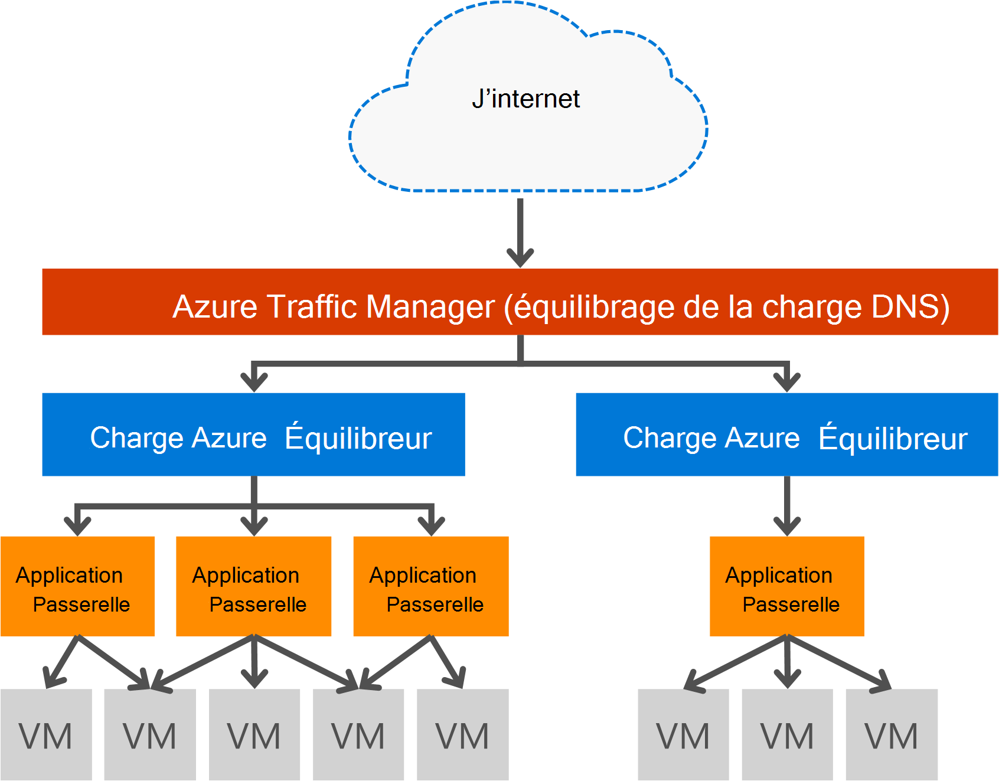

<properties
   pageTitle="Introduction à la passerelle d’Application | Microsoft Azure"
   description="Cette page fournit une vue d’ensemble du service Application Gateway pour équilibrage de charge de couche 7, y compris les tailles de passerelle HTTP charge équilibrage, basée sur les cookies, l’affinité de session et de déchargement SSL."
   documentationCenter="na"
   services="application-gateway"
   authors="georgewallace"
   manager="carmonm"
   editor="tysonn"/>
<tags
   ms.service="application-gateway"
   ms.devlang="na"
   ms.topic="hero-article"
   ms.tgt_pltfrm="na"
   ms.workload="infrastructure-services"
   ms.date="10/25/2016"
   ms.author="gwallace"/>

# Vue d’ensemble de la passerelle application

## Quelle est la passerelle d’Application

Passerelle d’Application Microsoft Azure fournit contrôleur de livraison d’applications (ADC) en tant que service, offrant diverses fonctionnalités de votre application d’équilibrage de charge de couche 7. Il permet aux clients d’optimiser la productivité de batterie de serveurs web en déchargeant l’arrêt de SSL intensif du processeur à la passerelle d’Application. Il fournit également d’autres fonctionnalités de routage de couche 7, y compris la distribution de répétition alternée de trafic entrant, le cookie en fonction de l’affinité de session, le routage de chemin d’accès de la base de URL et la possibilité d’héberger plusieurs sites Web derrière une passerelle d’Application unique. Passerelle d’application possède également un pare-feu pour applications web (WAF) qui protège votre application par rapport à la plupart de l’OWASP avoir top 10 web les vulnérabilités courantes. Passerelle d’application peut être configuré en tant que passerelle qui fait face à internet, d’interne seule passerelle ou une combinaison des deux. Passerelle d’application est entièrement Azure gérés, hautement disponible et évolutive. Il fournit un ensemble complet de diagnostics et de capacités d’enregistrement pour faciliter la gestion. Passerelle d’application fonctionne avec les ordinateurs virtuels, les services en nuage et les applications web internes ou externes en vis-à-vis.

Passerelle d’application est une application dédiée virtuelle pour votre application et se compose de plusieurs instances de travailleur pour la disponibilité et l’évolutivité. Lorsque vous créez une passerelle d’application, un point de terminaison (VIP public ou interne ILB IP) est associée et est utilisé pour le trafic réseau de pénétration. Cette adresse IP virtuelle ou une ILB IP est fournie par équilibreur de charge Azure fonctionne au niveau du transport (TCP/UDP) et d’avoir tout le trafic réseau entrant équilibré pour les instances de travailleur de passerelle d’Application. La passerelle d’Application puis les itinéraires le trafic HTTP/HTTPS en fonction de sa configuration, qu’il s’agisse d’une machine virtuelle, le cloud service, interne ou une adresse IP externe. Pour le contrat SLA et les tarifs, reportez-vous aux pages de [SLA](https://azure.microsoft.com/support/legal/sla/) et de [tarification](https://azure.microsoft.com/pricing/details/application-gateway/) .

## Fonctionnalités

Passerelle d’application prend actuellement en charge la remise de 7 d’application de couche avec les fonctionnalités suivantes :

- **[Pare-feu pour applications web (aperçu)](application-gateway-webapplicationfirewall-overview.md)** - le pare-feu d’application web (WAF) dans Azure Application Gateway protège les applications web contre les attaques courantes sur le web comme SQL injection, les attaques de script entre sites et détournements de session.
- **L’équilibrage de charge HTTP** - Application Gateway fournit l’équilibrage de charge round robin. L’équilibrage de charge est effectué au niveau de la couche 7 et est utilisé pour le trafic HTTP (S) uniquement.
- **Affinité de cookie de session** - cette fonctionnalité est utile lorsque vous souhaitez maintenir une session utilisateur sur le même serveur dorsal. À l’aide de cookies de passerelle gérée, la passerelle d’Application est en mesure de diriger le trafic de suivant à partir d’une session utilisateur vers le même serveur principal pour le traitement. Cette fonctionnalité est importante dans les cas où l’état de session est enregistrée localement sur le serveur principal pour une session utilisateur.
- **[Déchargement de la couche SSL (secure Sockets)](application-gateway-ssl-arm.md)** - cette fonctionnalité prend la tâche coûteuse de décryptage du trafic HTTPS sur vos serveurs web. Arrête la connexion SSL au niveau de la passerelle d’Application et de transmettre la requête au serveur non crypté, le serveur web est unburdened par le déchiffrement.  Passerelle d’application crypte de nouveau la réponse avant de l’envoyer au client. Cette fonctionnalité est utile dans les scénarios où se trouve le back-end sur le même réseau virtuel sécurisé comme la passerelle d’Application dans Azure.
- **[SSL de bout en bout](application-gateway-backend-ssl.md)** - passerelle d’Application prend en charge le cryptage de bout en bout du trafic. Passerelle d’application effectue cette opération en mettant fin à la connexion SSL au niveau de la passerelle d’application. La passerelle puis applique les règles de routage pour le trafic, crypte de nouveau le paquet et transfère le paquet vers le back-end approprié selon les règles de routage définies. Toute réponse du serveur web passe par le même processus à l’utilisateur final.
- **[Routage de contenu basée sur URL](application-gateway-url-route-overview.md)** - cette fonctionnalité offre la possibilité d’utiliser des serveurs principaux différents pour le trafic de différent. Le trafic d’un dossier sur le serveur web ou pour un réseau CDN peut être acheminé vers un autre back-end, réduisant la charge inutile sur les serveurs principaux qui ne desservent un contenu spécifique.
- **[Le routage multisite](application-gateway-multi-site-overview.md)** - Application passerelle permet de consolider jusqu'à 20 sites sur une passerelle d’application unique.
- **[Prise en charge de Websocket](application-gateway-websocket.md)** - une autre fonctionnalité intéressante de passerelle d’Application est la prise en charge native pour Websocket.
- **[Surveillance de la santé](application-gateway-probe-overview.md)** - passerelle d’Application fournit des sondes de santé par défaut personnalisée et de surveillance des ressources de serveur principal pour surveiller pour des scénarios plus spécifiques.

## Avantages

Passerelle d’application est utile pour :

- Applications qui requièrent des demandes à partir de la même session utilisateur/client pour atteindre la même machine virtuelle back-end. Exemples de ces applications d’achat panier les applications et les serveurs de messagerie web.
- Applications qui vous voulez libérer des batteries de serveurs web à partir de surcharge de terminaison SSL.
- Applications, comme un réseau de distribution de contenu, qui requiert plusieurs requêtes HTTP sur la même connexion TCP de durée d’exécution longue d’être routé ou de charger équilibrée sur les différents serveurs back-end.
- Applications prenant en charge le trafic websocket
- Protection des applications web contre les attaques courantes sur le web comme l’injection SQL, les attaques de script entre sites et les détournements de session.

Passerelle d’application l’équilibrage de charge comme un service géré par Azure permet la mise en service d’un équilibreur de charge de couche 7 situé derrière l’équilibreur de charge logiciel Azure. Gestionnaire de trafic peut être utilisé pour terminer le scénario, comme illustré dans l’image suivante. Où Traffic Manager fournit la redirection et disponibilité, équilibreur de charge fournit dans la disponibilité et l’évolutivité de la région et passerelle d’application fournit l’équilibrage de charge de couche 7 zone croisée.

[AZURE.INCLUDE [load-balancer-compare-tm-ag-lb-include.md](../../includes/load-balancer-compare-tm-ag-lb-include.md)]

## Les tailles de la passerelle et les instances

Passerelle d’application n’est actuellement proposé dans trois formats : petites, moyennes et grandes. Les tailles de petite instance sont conçus pour les scénarios de test et de développement.

Il existe actuellement deux références SKU pour la passerelle d’Application : WAF et Standard.

Vous pouvez créer jusqu'à 50 passerelles d’application par abonnement et passerelle de chaque application peut avoir jusqu'à 10 instances chaque. Chaque passerelle d’application peut se composer de 20 ports d’écoute http. Pour obtenir la liste complète des limites de passerelle d’application visitez la page de [Limites de Service](../azure-subscription-service-limits.md#application-gateway) .

Le tableau suivant présente un débit moyen de performances pour chaque instance de passerelle d’application :

| Réponse de la page de back-end | Petite taille | Support | Grande taille|
|---|---|---|---|
| 6K | 7.5 Mbps | 13 Mbits/s | 50 Mbits/s |
|100K | Mbits/35 s | 100 Mbits/s| 200 Mbits/s |

>[AZURE.NOTE] Ces valeurs sont approximatives pour un débit de passerelle d’application. Le débit réel dépend de divers détails de l’environnement, telles que la taille de page moyenne, l’emplacement des instances de back-end et des temps de traitement pour répondre à une page. Pour les numéros de performances exact, vous devez exécuter vos propres tests, ces valeurs ne sont fournies que pour la planification de capacité.

## Surveillance de l’état

Passerelle d’Application Azure surveille automatiquement l’état de santé des instances Basic back-end ou des sondes d’état personnalisé. À l’aide de sondes de santé, ainsi que les hôtes uniquement sains répondent au trafic. Pour plus d’informations, consultez [Présentation de surveillance de santé passerelle d’Application](application-gateway-probe-overview.md).

## Configuration et gestion

Pour son point de terminaison, passerelle d’application peut avoir une adresse IP publique, IP privée ou les deux lorsqu’il est configuré. Passerelle d’application est configuré à l’intérieur d’un réseau virtuel dans son propre sous-réseau. Le sous-réseau créé ou utilisé pour la passerelle d’application ne peut pas contenir d’autres types de ressources, les seules ressources qui sont autorisées dans le sous-réseau sont d’autres passerelles d’application. Pour sécuriser vos ressources back-end du back-end les serveurs pouvant être contenus dans un sous-réseau différent dans le même réseau que la passerelle d’application virtuel. Ce sous-réseau supplémentaire que ne requis pas pour les applications back-end, tant que la passerelle d’application peut atteindre l’adresse ip, passerelle d’application est en mesure de fournir des fonctionnalités de connecteur Active Directory pour les serveurs principaux.

Vous pouvez créer et gérer une passerelle d’application à l’aide des API du reste, applets de commande PowerShell, Azure CLI ou [Azure portal](https://portal.azure.com/).

## Étapes suivantes

Après étude de la passerelle d’Application, vous pouvez [créer une passerelle d’application](application-gateway-create-gateway-portal.md) , ou vous pouvez [créer une passerelle d’application de déchargement SSL](application-gateway-ssl-arm.md) pour les connexions HTTPS de l’équilibrage de charge.

Pour apprendre à créer une passerelle d’application à l’aide de routage de contenu basé sur des URL, consultez [créer une passerelle d’application à l’aide du routage basé sur l’URL](application-gateway-create-url-route-arm-ps.md) pour plus d’informations.

