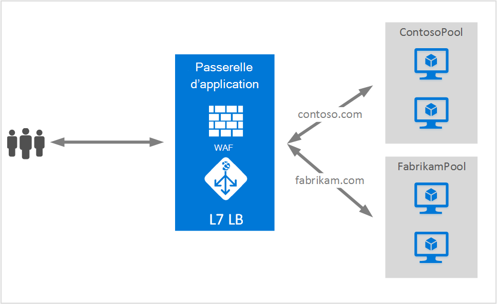

<properties
   pageTitle="Hébergement de plusieurs sites sur la passerelle d’Application | Microsoft Azure"
   description="Cette page fournit une vue d’ensemble de la prise en charge de plusieurs sites de passerelle d’Application."
   documentationCenter="na"
   services="application-gateway"
   authors="amsriva"
   manager="rossort"
   editor="amsriva"/>
<tags
   ms.service="application-gateway"
   ms.devlang="na"
   ms.topic="hero-article"
   ms.tgt_pltfrm="na"
   ms.workload="infrastructure-services"
   ms.date="10/25/2016"
   ms.author="amsriva"/>

# Passerelle d’application hébergement de plusieurs sites

Hébergement de plusieurs sites vous permet de configurer plus d’une application web sur la même instance de passerelle d’application. Cette fonctionnalité vous permet de configurer une topologie la plus efficace pour vos déploiements en ajoutant des sites Web jusqu'à 20 à une application passerelle. Chaque site Web peut être dirigé vers son propre pool back-end. Dans l’exemple suivant, passerelle d’application sert le trafic pour contoso.com et fabrikam.com à partir de deux pools de serveur dorsal appelés ContosoServerPool et FabrikamServerPool.

Demandes de http://contoso.com sont routés vers ContosoServerPool et http://fabrikam.com sont routés vers FabrikamServerPool.

De la même façon deux sous-domaines du domaine parent même peuvent être hébergés dans le même déploiement de passerelle d’application. Exemples d’utilisation de sous-domaines peuvent inclure des http://blog.contoso.com et des http://app.contoso.com hébergé sur un déploiement de passerelle d’application unique.

## En-têtes d’hôte et d’Indication de nom de serveur (SNI)

Il existe trois mécanismes pour permettre l’hébergement de sites multiples sur la même infrastructure.

1. Héberger plusieurs applications web chaque sur une adresse IP unique.
2. Utilisez le nom d’hôte pour héberger plusieurs applications web sur la même adresse IP.
3. Utiliser des ports différents pour héberger plusieurs applications web sur la même adresse IP.

Actuellement, une passerelle d’application obtient une adresse IP publique unique sur lequel il écoute le trafic. Par conséquent, prise en charge de plusieurs applications, chacune avec sa propre adresse IP, est actuellement pas pris en charge. Passerelle d’application prend en charge l’hébergement de plusieurs applications chaque écouter sur des ports différents, mais ce scénario nécessiterait les applications à accepter le trafic sur des ports non standard et qu’il n’est souvent pas une configuration souhaitée. Passerelle d’application s’appuie sur les en-têtes d’hôte HTTP 1.1 pour héberger plusieurs sites Web sur la même adresse IP publique et un port. Les sites hébergés sur la passerelle d’application peuvent également prise en charge du déchargement de SSL avec extension TLS d’Indication de nom de serveur (SNI). Cela signifie que le client navigateur et back-end batterie de serveurs web doit prendre en charge HTTP/1.1 et extension TLS comme défini dans RFC 6066.

## Élément de configuration de port d’écoute

Élément de configuration HTTPListener existant est améliorée pour prendre en charge d’hôte nom nom indique les éléments et serveur, qui est utilisé par une application passerelle à acheminer le trafic vers le pool de serveur principal approprié. L’exemple de code suivant est l’extrait de l’élément de HttpListeners à partir du fichier de modèle.

    "httpListeners": [
                {
                    "name": "appGatewayHttpsListener1",
                    "properties": {
                        "FrontendIPConfiguration": {
                            "Id": "/subscriptions/<subid>/resourceGroups/<rgName>/providers/Microsoft.Network/applicationGateways/applicationGateway1/frontendIPConfigurations/DefaultFrontendPublicIP"
                        },
                        "FrontendPort": {
                            "Id": "/subscriptions/<subid>/resourceGroups/<rgName>/providers/Microsoft.Network/applicationGateways/applicationGateway1/frontendPorts/appGatewayFrontendPort443'"
                        },
                        "Protocol": "Https",
                        "SslCertificate": {
                            "Id": "/subscriptions/<subid>/resourceGroups/<rgName>/providers/Microsoft.Network/applicationGateways/applicationGateway1/sslCertificates/appGatewaySslCert1'"
                        },
                        "HostName": "contoso.com",
                        "RequireServerNameIndication": "true"
                    }
                },
                {
                    "name": "appGatewayHttpListener2",
                    "properties": {
                        "FrontendIPConfiguration": {
                            "Id": "/subscriptions/<subid>/resourceGroups/<rgName>/providers/Microsoft.Network/applicationGateways/applicationGateway1/frontendIPConfigurations/appGatewayFrontendIP'"
                        },
                        "FrontendPort": {
                            "Id": "/subscriptions/<subid>/resourceGroups/<rgName>/providers/Microsoft.Network/applicationGateways/applicationGateway1/frontendPorts/appGatewayFrontendPort80'"
                        },
                        "Protocol": "Http",
                        "HostName": "fabrikam.com",
                        "RequireServerNameIndication": "false"
                    }
                }
            ],

Vous pouvez visiter le [modèle du Gestionnaire de ressources à l’aide d’hébergement de plusieurs sites](https://github.com/Azure/azure-quickstart-templates/blob/master/201-application-gateway-multihosting) pour un déploiement basé sur un modèle de bout en bout.

## Règle de routage

Il n’y a aucun changement dans la règle de routage. La règle de routage « Basic » doit continuer à être choisi pour lier l’écouteur de site approprié pour le pool d’adresses back-end correspondants.

    "requestRoutingRules": [
    {
        "name": "<ruleName1>",
        "properties": {
            "RuleType": "Basic",
            "httpListener": {
                "id": "/subscriptions/<subid>/resourceGroups/<rgName>/providers/Microsoft.Network/applicationGateways/applicationGateway1/httpListeners/appGatewayHttpsListener1')]"
            },
            "backendAddressPool": {
                "id": "/subscriptions/<subid>/resourceGroups/<rgName>/providers/Microsoft.Network/applicationGateways/applicationGateway1/backendAddressPools/ContosoServerPool')]"
            },
            "backendHttpSettings": {
                "id": "/subscriptions/<subid>/resourceGroups/<rgName>/providers/Microsoft.Network/applicationGateways/applicationGateway1/backendHttpSettingsCollection/appGatewayBackendHttpSettings')]"
            }
        }

    },
    {
        "name": "<ruleName2>",
        "properties": {
            "RuleType": "Basic",
            "httpListener": {
                "id": "/subscriptions/<subid>/resourceGroups/<rgName>/providers/Microsoft.Network/applicationGateways/applicationGateway1/httpListeners/appGatewayHttpListener2')]"
            },
            "backendAddressPool": {
                "id": "/subscriptions/<subid>/resourceGroups/<rgName>/providers/Microsoft.Network/applicationGateways/applicationGateway1/backendAddressPools/FabrikamServerPool')]"
            },
            "backendHttpSettings": {
                "id": "/subscriptions/<subid>/resourceGroups/<rgName>/providers/Microsoft.Network/applicationGateways/applicationGateway1/backendHttpSettingsCollection/appGatewayBackendHttpSettings')]"
            }
        }

    }
    ]

## Étapes suivantes

Après étude de l’hébergement de plusieurs sites, accédez à [créer une passerelle d’application à l’aide d’hébergement de plusieurs sites](application-gateway-create-multisite-azureresourcemanager-powershell.md) pour créer une passerelle d’application avec la prise en charge de plusieurs applications web.
