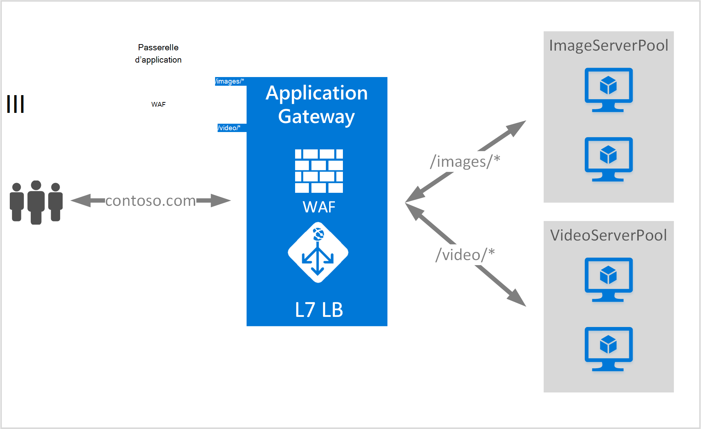

<properties
   pageTitle="Basé sur l’URL de la vue d’ensemble de routage contenu | Microsoft Azure"
   description="Cette page fournit une vue d’ensemble du routage de contenu basé sur des URL d’Application passerelle, configuration de UrlPathMap et PathBasedRouting règle."
   documentationCenter="na"
   services="application-gateway"
   authors="georgewallace"
   manager="carmonm"
   editor="tysonn"/>
<tags
   ms.service="application-gateway"
   ms.devlang="na"
   ms.topic="hero-article"
   ms.tgt_pltfrm="na"
   ms.workload="infrastructure-services"
   ms.date="10/25/2016"
   ms.author="gwallace"/>

# Vue d’ensemble du routage par URL Path

Routage par URL de chemin d’accès vous permet d’acheminer le trafic vers des pools de serveur back-end basé sur les chemins d’accès de l’URL de la demande. L’un des scénarios consiste à acheminer les requêtes de types de contenu différents pour les pools de serveurs back-end différentes.
Dans l’exemple suivant, Application Gateway sert le trafic pour contoso.com à partir de trois pools de serveur back-end par exemple : VideoServerPool, ImageServerPool et DefaultServerPool.

Demandes de http://contoso.com/video* sont routés vers VideoServerPool et http://contoso.com/images* sont routés vers ImageServerPool. DefaultServerPool est sélectionnée si aucun des modèles de chemin d’accès correspond.

## Élément de configuration de UrlPathMap

Élément de UrlPathMap est utilisé pour spécifier les modèles de chemin d’accès aux mappages de pool de serveur principal. L’exemple de code suivant est l’extrait de l’élément d’urlPathMap à partir du fichier de modèle.

    "urlPathMaps": [
    {
    "name": "<urlPathMapName>",
    "id": "/subscriptions/<subscriptionId>/../microsoft.network/applicationGateways/<gatewayName>/ urlPathMaps/<urlPathMapName>",
    "properties": {
        "defaultBackendAddressPool": {
            "id": "/subscriptions/<subscriptionId>/../microsoft.network/applicationGateways/<gatewayName>/backendAddressPools/<poolName>"
        },
        "defaultBackendHttpSettings": {
            "id": "/subscriptions/<subscriptionId>/../microsoft.network/applicationGateways/<gatewayName>/backendHttpSettingsList/<settingsName>"
        },
        "pathRules": [
            {
                "paths": [
                    <pathPattern>
                ],
                "backendAddressPool": {
                    "id": "/subscriptions/<subscriptionId>/../microsoft.network/applicationGateways/<gatewayName>/backendAddressPools/<poolName2>"
                },
                "backendHttpsettings": {
                    "id": "/subscriptions/<subscriptionId>/../microsoft.network/applicationGateways/<gatewayName>/backendHttpsettingsList/<settingsName2>"
                },

            },

        ],

    }
    }
    

>[AZURE.NOTE] PathPattern : Ce paramètre est une liste de modèles du chemin à faire correspondre. Chacun doit commencer par / et le seul endroit où un « * » est autorisé occupe la position qui suit la fin un « / ». La chaîne utilisée dans le traitement de chemin d’accès n’inclut pas de tout texte situé après le premier ? ou # et ces caractères ne sont pas autorisés ici. 

Vous pouvez extraire un [modèle de gestionnaire de ressources à l’aide du routage basé sur l’URL](https://azure.microsoft.com/documentation/templates/201-application-gateway-url-path-based-routing) pour plus d’informations.

## Règle de PathBasedRouting

RequestRoutingRule de type PathBasedRouting est utilisé pour lier un écouteur pour un urlPathMap. Toutes les demandes reçues pour cet écouteur sont routés en fonction de la stratégie spécifiée dans urlPathMap.
Extrait de la règle de PathBasedRouting :

    "requestRoutingRules": [
    {

    "name": "<ruleName>",
    "id": "/subscriptions/<subscriptionId>/../microsoft.network/applicationGateways/<gatewayName>/requestRoutingRules/<ruleName>",
    "properties": {
        "ruleType": "PathBasedRouting",
        "httpListener": {
            "id": "/subscriptions/<subscriptionId>/../microsoft.network/applicationGateways/<gatewayName>/httpListeners/<listenerName>"
        },
        "urlPathMap": {
            "id": "/subscriptions/<subscriptionId>/../microsoft.network/applicationGateways/<gatewayName>/ urlPathMaps/<urlPathMapName>"
        },

    }
    
## Étapes suivantes

Après étude de routage de contenu basée sur URL, accédez à [créer une passerelle d’application à l’aide du routage basé sur l’URL](application-gateway-create-url-route-portal.md) pour créer une passerelle d’application avec les règles de routage d’URL.
