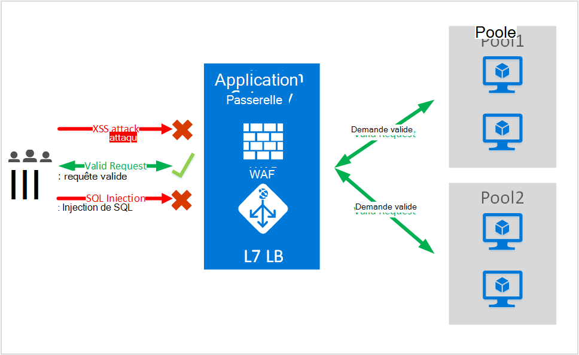
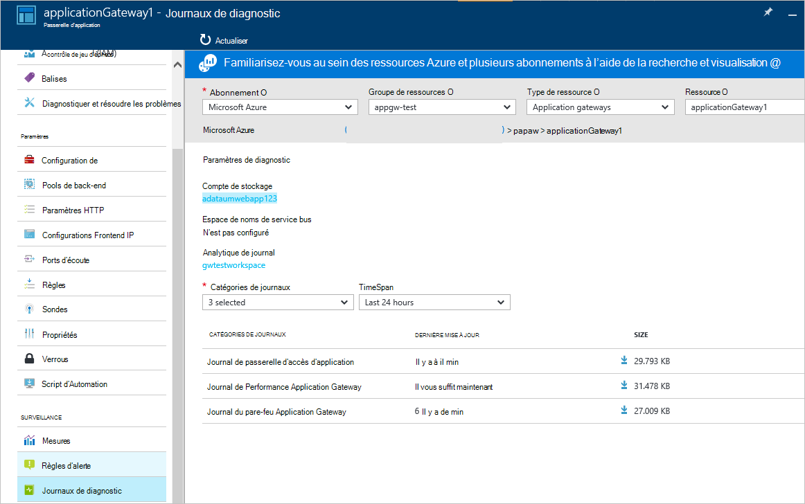

<properties
   pageTitle="Introduction à Web Application pare-feu (WAF) pour la passerelle d’Application | Microsoft Azure"
   description="Cette page fournit une vue d’ensemble de Web Application pare-feu WAF () pour la passerelle d’Application "
   documentationCenter="na"
   services="application-gateway"
   authors="amsriva"
   manager="rossort"
   editor="amsriva"/>
<tags
   ms.service="application-gateway"
   ms.devlang="na"
   ms.topic="hero-article"
   ms.tgt_pltfrm="na"
   ms.workload="infrastructure-services"
   ms.date="10/25/2016"
   ms.author="amsriva"/>

# Pare-feu pour applications Web application passerelle (aperçu)

Pare-feu pour applications Web (WAF) est une fonctionnalité de passerelle d’application azure qui fournit une protection pour les applications web qui tirent parti de passerelle d’application pour les fonctions de contrôle de livraison d’applications (ADC) standard. Pare-feu pour applications Web effectue cette opération en les protégeant contre la plupart des OWASP avoir top 10 web vulnérabilités courantes. Les applications Web sont plus en plus des cibles d’attaques qui exploitent les vulnérabilités courantes. Ces attaques communes sont les attaques d’injection SQL, les attaques de script entre sites pour citer. Empêcher ces attaques dans le code d’application peut se révéler complexe et peut nécessiter une maintenance rigoureuse, application de correctifs et de surveillance au niveau de plusieurs couches de la topologie de l’application. Un pare-feu d’application web centralisé pour se protéger contre les attaques web facilite grandement la gestion de la sécurité et offre une meilleure assurance l’application contre les menaces d’intrusion. Une solution WAF peut également réagir à une menace de sécurité plus rapidement par la correction d’une vulnérabilité connue dans un emplacement central et sécurisation de chacune des applications web individuelles. Passerelles d’application existant peuvent être convertis facilement à une passerelle d’application avec le pare-feu d’application web.

Passerelle d’application fonctionne comme un contrôleur de livraison d’application et offre arrêt de SSL, l’affinité de cookie de session, round-robin répartition de la charge, contenue en fonction du routage, possibilité d’héberger plusieurs améliorations de sécurité et de sites Web. Améliorations de sécurité offertes par la passerelle d’Application incluent la gestion de stratégie SSL, prise en charge SSL de bout en bout. Nous sommes renforcement des fonctions de sécurité des applications de notre service en introduisant directement intégré dans le connecteur Active Directory offre le WAF (pare-feu d’application web). Cela fournit un facile à configurer l’emplacement central pour gérer et protéger vos applications web contre les vulnérabilités courantes du web.

Configuration de WAF au niveau de la passerelle d’application vous fournit de l’avantage suivant :

- Protéger votre application web contre des vulnérabilités du web et sans modification de code principal.
- Protéger plusieurs applications web en même temps derrière une passerelle d’application. Passerelle d’application prend en charge l’hébergement des sites Web jusqu'à 20 derrière une passerelle unique qui peut être protégé contre les attaques web.
- Analyser votre application web contre les attaques à l’aide de rapport en temps réel générée par une application passerelle WAF journaux.
- Certains contrôles de la conformité requièrent tous les internet en vis-à-vis fin points à protéger par une solution WAF. À l’aide de passerelle d’application avec WAF activé, vous pouvez répondre à ces exigences de conformité.

## Vue d’ensemble

Application passerelle WAF est proposé dans une nouvelle référence SKU (stock WAF) et est préconfigurée avec ModSecurity et ensemble de règles de base OWASP avoir offrent une protection de base contre la plupart des OWASP avoir top 10 web vulnérabilités courantes.

- Protection contre les injections SQL
- Protection contre les scripts site de coupe
- Web des attaques de Protection commune comme injection de commande, de fractionnement, de la réponse HTTP, smuggling de requêtes HTTP et attaque d’inclusion de fichier distant
- Protection contre les violations de protocole HTTP
- Protection contre les anomalies de protocole HTTP comme absente hôte de l’agent utilisateur et accepter des en-têtes
- Protections de déni de service HTTP, y compris HTTP inondation et lente prévention du déni de service HTTP
- Prévention contre les robots, les robots d’indexation et les scanneurs
- Détection d’erreurs de configuration d’application (Apache, IIS, etc.)

## WAF Modes

Application passerelle WAF peut être configuré pour s’exécuter dans les deux modes suivants :

- Le **mode de détection** – lorsqu’il est configuré pour s’exécuter en mode détection, Application passerelle WAF surveille et enregistre toutes les alertes de menace dans un fichier journal. Vous devez vous assurer que la journalisation de diagnostics pour passerelle d’Application est activée à l’aide de la section Diagnostics. Vous devez également vous assurer que le journal WAF est sélectionné et activé.
- **Mode de prévention** – lorsque configuré pour s’exécuter en mode de prévention, Application passerelle activement bloque les intrusions et attaques détectées par les règles. L’attaquant reçoit une exception 403 accès non autorisé et que la connexion est terminée. Mode de prévention continue à enregistrer ce type d’attaques dans les journaux WAF.

## Les rapports application passerelle WAF

Application passerelle WAF fournit des rapports détaillés sur chaque menace qu’il détecte. L’enregistrement est intégré avec les journaux de Diagnostics Azure et alertes sont enregistrés dans un format json.

    {
        "resourceId": "/SUBSCRIPTIONS/<subscriptionId>/RESOURCEGROUPS/<resourceGroupName>/PROVIDERS/MICROSOFT.NETWORK/APPLICATIONGATEWAYS/<applicationGatewayName>",
        "operationName": "ApplicationGatewayFirewall",
        "time": "2016-09-20T00:40:04.9138513Z",
        "category": "ApplicationGatewayFirewallLog",
        "properties":     {
            "instanceId":"ApplicationGatewayRole_IN_0",
            "clientIp":"108.41.16.164",
            "clientPort":1815,
            "requestUri":"/wavsep/active/RXSS-Detection-Evaluation-POST/",
            "ruleId":"OWASP_973336",
            "message":"XSS Filter - Category 1: Script Tag Vector",
            "action":"Logged",
            "site":"Global",
            "message":"XSS Filter - Category 1: Script Tag Vector",
            "details":{"message":" Warning. Pattern match "(?i)(<script","file":"/owasp_crs/base_rules/modsecurity_crs_41_xss_attacks.conf","line":"14"}}
    }

## Application passerelle WAF SKU de tarification

Lors de l’aperçu, il n’existe pas de frais supplémentaires pour l’utilisation d’Application passerelle WAF. Vous continuez à percevoir sur les frais de la référence SKU de base. Nous communiquons les frais WAF SKU actuellement. Les clients qui ont choisi de déployer l’Application Gateway dans WAF SKU seraient courent SKU WAF uniquement après l’annonce de la disponibilité générale de tarification.

## Étapes suivantes

Après savoir plus sur les fonctionnalités de WAF, visitez le site [comment configurer le pare-feu pour applications Web sur une Application passerelle](application-gateway-web-application-firewall-portal.md).
