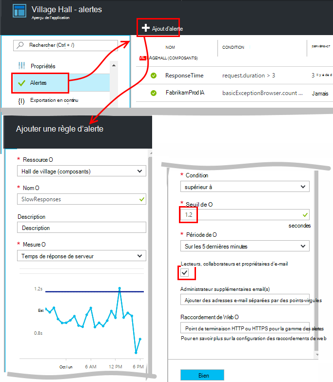
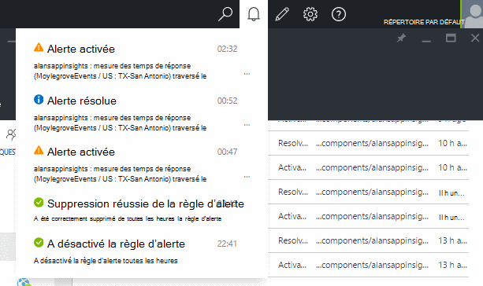
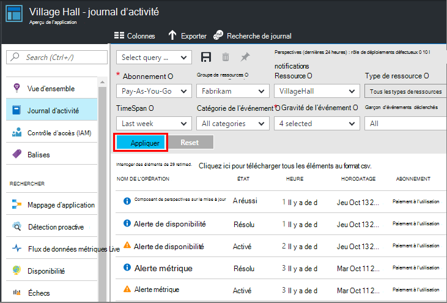

<properties 
    pageTitle="Définir des alertes dans les conseils d’Application | Microsoft Azure" 
    description="Recevez une notification sur les temps de réponse lents, exceptions et performances ou des modifications de l’utilisation de votre application web." 
    services="application-insights" 
    documentationCenter=""
    authors="alancameronwills" 
    manager="douge"/>

<tags 
    ms.service="application-insights" 
    ms.workload="tbd" 
    ms.tgt_pltfrm="ibiza" 
    ms.devlang="na" 
    ms.topic="article" 
    ms.date="10/14/2016" 
    ms.author="awills"/>
 
# Définir des alertes dans les conseils d’Application

[Idées d’Application Visual Studio] [ start] de vous signaler les modifications dans les mesures de performances ou d’utilisation dans votre application web. 

Idées d’application surveille votre application live sur un [large éventail de plates-formes] de[ platforms] pour vous aider à diagnostiquer les problèmes de performances et les tendances d’utilisation.

Il existe trois types d’alertes :

* **Métriques alertes** vous indiquent lorsque toute mesure franchit un seuil pendant une certaine période - temps de réponse, nombre d’exception, l’utilisation du processeur ou des affichages de page. 
* [**Tests Web** ] [ availability] vous indiquent lorsque votre site n’est pas disponible sur internet, ou ne répond lentement. [Pour en savoir plus][availability].
* [**Diagnostics proactifs**](app-insights-proactive-diagnostics.md) sont automatiquement configurés pour vous avertir à propos des modèles de performances inhabituelles.

Nous concentrer sur les alertes métriques dans cet article.

## Définissez une alerte métrique

Ouvrir la lame de règles d’alerte et utilisez le bouton Ajouter. 

* Définissez la ressource avant les autres propriétés. **Choisissez la ressource « (composants) »** si vous voulez définir des alertes sur les mesures de performances ou d’utilisation.
* Le nom que vous attribuez à l’alerte doit être unique dans le groupe de ressources (et pas seulement de votre application).
* Veillez à noter les unités dans lequel vous êtes invité à entrer la valeur de seuil.
* Si vous cochez la case « Propriétaires de l’E-mail... », les alertes seront envoyées par courrier électronique à toute personne ayant accès à ce groupe de ressources. Pour étendre cet ensemble de personnes, les ajouter au [groupe de ressources ou d’abonnement](app-insights-resources-roles-access-control.md) (pas la ressource).
* Si vous spécifiez « E-mails supplémentaires », les alertes seront envoyées à des individus ou des groupes (ou non coché la case « e-mail propriétaires... »). 
* Définissez une [adresse de webhook](../monitoring-and-diagnostics/insights-webhooks-alerts.md) si vous avez configuré une application web qui répond à des alertes. Elle sera appelée lorsque l’alerte est activée (ce qui est, déclenchée) et lorsqu’il est résolu. (Mais notez qu’à l’heure actuelle, paramètres de la requête ne sont pas passés en tant que propriétés de webhook.)
* Vous pouvez désactiver ou activer la mise en garde : les boutons en haut de la lame.

*Je ne vois pas le bouton Ajouter une alerte.* 

- Vous utilisez un compte d’organisation ? Si vous disposez de propriétaire ou accéder à cette ressource de l’application de collaboration, vous pouvez définir des alertes. Examinons la lame de contrôle d’accès. [En savoir plus sur le contrôle d’accès][roles].

> [AZURE.NOTE] De la lame d’alertes, vous verrez qu’il existe déjà un jeu alert : [Diagnostics proactifs](app-insights-proactive-failure-diagnostics.md). Il s’agit d’une alerte automatique qui surveille un particulier métrique, demande taux de défaillance. Sauf si vous décidez de désactiver l’alerte proactive, vous n’avez pas besoin de définir vos propres alerte sur les taux d’échec de la demande. 

## Voir vos alertes

Vous recevez un courriel lorsqu’un état d’alerte des modifications entre actif et inactif. 

L’état actuel de chaque alerte est illustré à la lame de règles d’alerte.

Il existe un résumé de l’activité récente dans les alertes de liste déroulante :

L’historique des modifications d’état est dans le journal d’activité :

## Fonctionnement des alertes

* Une alerte possède trois états : « Jamais activé », « Activé » et « Résolu ». Activé signifie que la condition spécifiée est true, lorsqu’elle a été évaluée dernier.

* Une notification est générée lorsqu’une alerte change d’état. (Si la condition d’alerte était déjà le cas lorsque vous avez créé l’alerte, vous ne pouvez pas obtenir une notification jusqu'à ce que la condition est false.)

* Chaque notification génère un e-mail si vous activé la case à cocher e-mails ou fourni des adresses e-mail. Vous pouvez également consulter la liste déroulante de Notifications.

* Une alerte est évaluée chaque fois qu’une mesure arrive, mais pas dans le cas contraire.

* L’évaluation regroupe la métrique de la période précédente et les compare à la valeur de seuil pour déterminer le nouvel état.

* La période que vous choisissez Spécifie l’intervalle sur laquelle les mesures sont agrégées. Il n’affecte pas la fréquence à laquelle l’alerte est évaluée : cela dépend de la fréquence de l’arrivée des mesures.

* Si aucune donnée n’est émise pour une mesure particulière pendant un certain temps, l’intervalle a des effets différents sur l’évaluation de l’alerte et sur les graphiques dans l’Explorateur de métriques. Dans l’Explorateur de métriques, si aucune donnée n’apparaît plus longtemps que l’intervalle d’échantillonnage du graphique, le graphique affiche la valeur 0. Mais une alerte basée sur la même métrique n’est pas être réévaluée et l’état de l’alerte reste inchangée. 

    Lorsque des données arrivent par la suite, le graphique revient à une valeur différente de zéro. L’alerte évalue selon les données disponibles pour la période que vous avez spécifié. Si le nouveau point de données est le seul disponible dans la période, le regroupement est basé seulement sur que du point de données.

* Une alerte peut clignoter fréquemment entre les États d’alerte et sains, même si vous définissez une longue période. Cela peut se produire si la valeur métrique est placé autour du seuil. Il n’existe aucune hystérésis dans le seuil : la transition vers l’alerte se produit à la même valeur que la transition vers en bon état.

## Que sont les alertes de bonne pour définir ?

Cela dépend de votre application. Il est préférable de ne pas définir trop de mesures. Prenez le temps de consulter vos graphiques métriques alors que votre application est en cours d’exécution, pour avoir une idée de la façon dont il se comporte normalement. Cela vous permet de trouver des moyens d’améliorer ses performances. Puis définir des alertes pour vous indiquer quand les mesures de sortir de la normale à une zone. 

Alertes les plus courants sont les suivants :

* [Les mesures de navigateur][client], navigateur notamment **les temps de chargement de page**, sont utiles pour les applications web. Si votre page comporte un grand nombre de scripts, vous voudrez rechercher **exceptions du navigateur**. Pour obtenir ces mesures et les alertes, vous devez configurer [l’analyse de la page web][client].
* **Temps de réponse des serveurs** pour des applications web côté serveur. Ainsi que de la configuration d’alertes, gardez un œil sur cette mesure pour voir si il varie proportionnellement avec le taux de demandes élevé : qui peut indiquer que votre application s’exécute plus de ressources. 
* **Exceptions du serveur** - pour les afficher, vous devez faire certains [paramètres supplémentaires](app-insights-asp-net-exceptions.md).

N’oubliez pas que [diagnostics de défaillance proactive de taux](app-insights-proactive-failure-diagnostics.md) automatiquement surveiller la vitesse à laquelle votre application répond aux demandes avec des codes d’erreur. 

## Automation

* [Utilisation de PowerShell pour automatiser la configuration des alertes](app-insights-powershell-alerts.md)
* [Utilisez webhooks pour automatiser les réponses aux alertes](../monitoring-and-diagnostics/insights-webhooks-alerts.md)

## Voir aussi

* [Disponibilité des tests web](app-insights-monitor-web-app-availability.md)
* [Automatiser la configuration des alertes](app-insights-powershell-alerts.md)
* [Diagnostics proactifs](app-insights-proactive-diagnostics.md) 

<!--Link references-->

[availability]: app-insights-monitor-web-app-availability.md
[client]: app-insights-javascript.md
[platforms]: app-insights-platforms.md
[roles]: app-insights-resources-roles-access-control.md
[start]: app-insights-overview.md

 