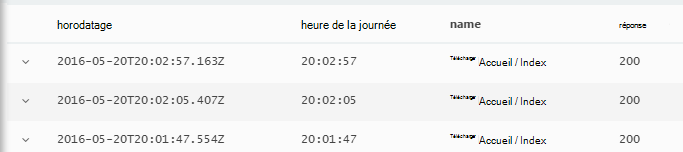

<properties 
    pageTitle="Visite guidée Analytique dans les perspectives d’Application | Microsoft Azure" 
    description="Exemples courts de toutes les requêtes dans Analytique, l’outil de recherche puissant de perspectives de l’Application principales." 
    services="application-insights" 
    documentationCenter=""
    authors="alancameronwills" 
    manager="douge"/>

<tags 
    ms.service="application-insights" 
    ms.workload="tbd" 
    ms.tgt_pltfrm="ibiza" 
    ms.devlang="na" 
    ms.topic="article" 
    ms.date="10/15/2016" 
    ms.author="awills"/>


 
# <a name="a-tour-of-analytics-in-application-insights"></a>Visite guidée d’Analytique dans les perspectives de l’Application


[Analytique](app-insights-analytics.md) est une fonctionnalité puissante de recherche [d’Idées d’Application](app-insights-overview.md). Ces pages décrivent le lanquage de requête Analytique.


* **[Visionnez la vidéo d’introduction](https://applicationanalytics-media.azureedge.net/home_page_video.mp4)**.
* **[Lecteur de test Analytique sur nos données simulées](https://analytics.applicationinsights.io/demo)** si votre application n’est pas envoyer des données aux analyses d’Application encore.


Nous allons évoquer certaines requêtes de base pour vous aider à démarrer.

## <a name="connect-to-your-application-insights-data"></a>Se connecter à vos données d’idées d’Application

Ouvrez Analytique à partir de votre application [lame de vue d’ensemble](app-insights-dashboards.md) dans les perspectives de l’Application :


    
## <a name="takeapp-insights-analytics-referencemdtake-operator-show-me-n-rows"></a>[Prendre](app-insights-analytics-reference.md#take-operator): afficher les n lignes

Les points de données qui ouvrent des opérations de l’utilisateur (généralement des demandes HTTP reçues par votre application web) sont stockés dans une table appelée `requests`. Chaque ligne est un point de données de télémétrie reçu depuis le SDK de perspectives d’Application dans votre application.

Commençons par examiner quelques exemples de lignes de la table :


> [AZURE.NOTE] Placez le curseur quelque part dans l’instruction avant de cliquer sur OK. Vous pouvez fractionner une instruction sur plusieurs lignes, mais que vous ne placez pas de lignes vides dans une instruction. Les lignes vides sont un moyen pratique de conserver plusieurs requêtes distinctes dans la fenêtre.


Choisir les colonnes, faites glisser les grouper par colonnes et filtrer : 


Développez un élément pour voir les détails :
 


> [AZURE.NOTE] Cliquez sur l’en-tête d’une colonne pour trier les résultats dans le navigateur web. Mais sachez que, pour un grand jeu de résultats, le nombre de lignes téléchargées dans le navigateur est limité. Tri de cette manière ne toujours vous montre les éléments plus hauts ou plus bas. Pour trier les éléments de manière fiable, utilisez le `top` ou `sort` opérateur. 

## <a name="topapp-insights-analytics-referencemdtop-operator-and-sortapp-insights-analytics-referencemdsort-operator"></a>[Haut](app-insights-analytics-reference.md#top-operator) et [tri](app-insights-analytics-reference.md#sort-operator)

`take`est utile pour obtenir un exemple rapide d’un résultat, mais il affiche des lignes de la table dans aucun ordre particulier. Pour obtenir un affichage ordonné, utilisez `top` (pour obtenir un exemple) ou `sort` (sur l’ensemble du tableau).

Afficher les n premières lignes, commandés par une colonne particulière :

```AIQL

    requests | top 10 by timestamp desc 
```

* *Syntaxe :* La plupart des opérateurs ont des paramètres de mot clé tel que `by`.
* `desc`par ordre décroissant, de = `asc` = croissant.


`top...`est un moyen performant plus de dire `sort ... | take...`. Nous pourrions écrire :

```AIQL

    requests | sort by timestamp desc | take 10
```

Le résultat sera le même, mais il s’exécute un peu plus lentement. (Vous pouvez également écrire le `order`, qui est un alias de `sort`.)

Les en-têtes de colonne dans l’affichage tableau peuvent également être utilisés pour trier les résultats sur l’écran. Mais bien entendu, si vous avez utilisé `take` ou `top` pour récupérer une partie seulement d’une table, vous allez uniquement retrier les enregistrements que vous avez récupéré.


## <a name="projectapp-insights-analytics-referencemdproject-operator-select-rename-and-compute-columns"></a>[Projet](app-insights-analytics-reference.md#project-operator): sélectionnez, de renommer et de calcul des colonnes

Utilisez [`project`](app-insights-analytics-reference.md#project-operator) pour extraire uniquement les colonnes que vous souhaitez :

```AIQL

    requests | top 10 by timestamp desc
             | project timestamp, name, resultCode
```


Vous pouvez également renommer des colonnes et définir de nouveaux :

```AIQL

    requests 
  	| top 10 by timestamp desc 
  	| project  
            name, 
            response = resultCode,
            timestamp, 
            ['time of day'] = floor(timestamp % 1d, 1s)
```



* [Les noms de colonnes](app-insights-analytics-reference.md#names) peuvent contenir des espaces ou si elles sont placées entre les symboles comme suit : `['...']` ou`["..."]`
* `%`est l’opérateur modulo habituel. 
* `1d`(qui est un chiffre, puis une avait ») est un littéral de timespan ce qui signifie un jour. Voici certains littéraux timespan plus : `12h`, `30m`, `10s`, `0.01s`.
* `floor`(alias `bin`) Arrondit une valeur au multiple plus proche de vous fournissez la valeur de base. Par conséquent, `floor(aTime, 1s)` Arrondit un temps à la seconde près.

[Les expressions](app-insights-analytics-reference.md#scalars) peuvent contenir tous les opérateurs habituels (`+`, `-`,...), et il existe une gamme de fonctions utiles.

    

## <a name="extendapp-insights-analytics-referencemdextend-operator-compute-columns"></a>[Étendre](app-insights-analytics-reference.md#extend-operator): calcul des colonnes

Si vous souhaitez simplement ajouter des colonnes à existants, utilisez [`extend`](app-insights-analytics-reference.md#extend-operator):

```AIQL

    requests 
  	| top 10 by timestamp desc
  	| extend timeOfDay = floor(timestamp % 1d, 1s)
```

À l’aide de [`extend`](app-insights-analytics-reference.md#extend-operator) moins prolixe que [`project`](app-insights-analytics-reference.md#project-operator) si vous souhaitez conserver toutes les colonnes existantes.


## <a name="summarizeapp-insights-analytics-referencemdsummarize-operator-aggregate-groups-of-rows"></a>[Synthèse](app-insights-analytics-reference.md#summarize-operator): groupes de lignes d’agrégation

`Summarize`applique une *fonction d’agrégation* de spécifiée sur les groupes de lignes. 

Par exemple, la durée de votre application web pour répondre à une demande est indiquée dans le champ `duration`. Voyons à présent le temps de réponse moyen pour toutes les demandes :


Ou nous pouvons séparer le résultat dans les requêtes de noms différents :


`Summarize`collecte les points de données dans le flux de données dans des groupes pour lesquels le `by` clause prend également. Chaque valeur de la `by` expression - chaque nom de l’opération dans l’exemple ci-dessus - génère une ligne dans la table de résultats. 

Ou nous pouvons regrouper les résultats par heure de la journée :


Notez la façon dont nous utilisons les `bin` fonction (alias `floor`). Si nous avons simplement utilisé `by timestamp`, chaque ligne d’entrée finiriez dans son propre groupe peu. Pour tout scalaire continue comme heures ou nombres, il faut rompre la plage continue dans un nombre gérable de valeurs discrètes, et `bin` -qui est simplement le familier arrondi vers le bas `floor` fonction - est le moyen le plus simple de le faire.

Nous pouvons utiliser la même technique pour réduire des plages de chaînes :


Notez que vous pouvez utiliser `name=` pour définir le nom d’une colonne de résultat, dans les expressions d’agrégation ou dans la clause.

## <a name="counting-sampled-data"></a>Comptage des données échantillonnées

`sum(itemCount)`est l’agrégation recommandée pour compter des événements. Dans de nombreux cas, itemCount == 1, afin que la fonction compte simplement le nombre de lignes dans le groupe. Mais lorsque [l’échantillonnage](app-insights-sampling.md) est en fonctionnement, qu’une fraction des événements d’origine est conservée en tant que points de données dans l’aperçu de l’Application, afin que chaque point de données vous voyez, il y a `itemCount` les événements. 

Par exemple, si l’échantillonnage ignore 75 % des événements d’origine, puis itemCount == 4 dans les enregistrements conservés - autrement dit, pour chaque enregistrement retenu, il y avait quatre enregistrements d’origine. 

Échantillonnage Adaptive entraîne itemCount être plus élevée au cours des périodes lorsque votre application est utilisée de manière intensive.

Pour résumer itemCount donne donc une bonne estimation du nombre d’événements d’origine.


Il existe également un `count()` agrégation (et une opération count), pour les cas où vous souhaitez réellement le nombre de lignes dans un groupe.


Il existe une gamme de [fonctions d’agrégation](app-insights-analytics-reference.md#aggregations).


## <a name="charting-the-results"></a>Graphiques de résultats


```AIQL

    exceptions 
       | summarize count()  
         by bin(timestamp, 1d)
```

Par défaut, les résultats affichent sous forme de tableau :


Nous pouvons faire mieux que l’affichage de la table. Examinons les résultats dans le graphique avec la verticale barre d’option :


Notez que bien que nous n’a pas trier les résultats par heure (comme vous pouvez le voir dans l’affichage du tableau), le graphique affiche toujours les dates/heures dans le bon ordre.


## <a name="whereapp-insights-analytics-referencemdwhere-operator-filtering-on-a-condition"></a>[Où](app-insights-analytics-reference.md#where-operator): filtrage sur une condition

Si vous avez défini des perspectives de l’Application d’analyse pour les côtés à la fois le [client](app-insights-javascript.md) et le serveur de votre application, certains de la télémétrie dans la base de données provient de navigateurs.

Nous allons voir exceptions uniquement dans les navigateurs :

```AIQL

    exceptions 
  	| where client_Type == "Browser" 
  	|  summarize count() 
       by client_Browser, outerMessage 
```


Le `where` l’opérateur accepte une expression booléenne. Voici quelques points importants à leur sujet :

 * `and`, `or`: Les opérateurs booléens
 * `==`, `<>` : égal à et pas égal à
 * `=~`, `!=` : chaîne respectant la casse égal et n’est pas égal. Il existe beaucoup de plusieurs opérateurs de comparaison de chaîne.

Découvrez toutes les [expressions scalaires](app-insights-analytics-reference.md#scalars).

### <a name="filtering-events"></a>Filtrage des événements

Rechercher des requêtes non réussies :

```AIQL

    requests 
  	| where isnotempty(resultCode) and toint(resultCode) >= 400
```

`responseCode`a chaîne de type, il doit [effectuer un cast](app-insights-analytics-reference.md#casts) d’une comparaison numérique.

Récapitulez les réponses différentes :

```AIQL

    requests
  	| where isnotempty(resultCode) and toint(resultCode) >= 400
  	| summarize count() 
      by resultCode
```

## <a name="timecharts"></a>Timecharts

Afficher le nombre d’événements il est chaque jour :

```AIQL

    requests
      | summarize event_count=count()
        by bin(timestamp, 1d)
```

Sélectionnez l’option d’affichage graphique :


## <a name="multiple-series"></a>Plusieurs séries 

Plusieurs expressions dans le `summarize` crée plusieurs colonnes.

Plusieurs expressions dans le `by` clause crée plusieurs lignes, une pour chaque combinaison de valeurs.


```AIQL

    requests
  	| summarize count(), avg(duration) 
      by bin(timestamp, 1d), client_StateOrProvince, client_City 
  	| order by timestamp asc, client_StateOrProvince, client_City
```


### <a name="segment-a-chart-by-dimensions"></a>Segmenter un graphique par dimensions

Si vous représenter une table contenant une colonne de type chaîne et une colonne numérique, la chaîne peut être utilisée pour fractionner les données numériques en série séparée de points. S’il existe plus d’une colonne de type chaîne, vous pouvez choisir la colonne à utiliser comme discriminant. 


### <a name="display-multiple-metrics"></a>Afficher plusieurs métriques

Si vous représenter une table plus d’une colonne numérique, en plus de l’estampille, vous pouvez afficher n’importe quelle combinaison d'entre elles.


Vous devez sélectionner Split de ne pas pouvoir sélectionner plusieurs colonnes numériques que vous ne pouvez pas fractionner une colonne de chaîne en même temps que l’affichage de plus d’une colonne numérique. 


## <a name="daily-average-cycle"></a>Cycle de moyenne quotidienne

Dans quelle mesure l’utilisation de fonction dans la journée moyenne ?

Demandes de nombres binned en heures par modulo un jour, lors du :

```AIQL

    requests
  	| extend hour = floor(timestamp % 1d , 1h) 
          + datetime("2016-01-01")
  	| summarize event_count=count() by hour
```


>[AZURE.NOTE] Notez nous avons actuellement convertir des durées pour les dates/heures afin d’afficher sur l’un graphique.


## <a name="compare-multiple-daily-series"></a>Comparer plusieurs séries quotidiennes

Comment l’utilisation de varier pendant la durée de la journée dans les différents pays ?

```AIQL

 requests  | where tostring(operation_SyntheticSource)
     | extend hour= floor( timestamp % 1d , 1h)
           + datetime("2001-01-01")
     | summarize event_count=count() 
       by hour, client_CountryOrRegion 
     | render timechart
```


## <a name="plot-a-distribution"></a>Tracer une distribution

Le nombre de sessions est de longueurs différentes ?

```AIQL

    requests 
  	| where isnotnull(session_Id) and isnotempty(session_Id) 
  	| summarize min(timestamp), max(timestamp) 
      by session_Id 
  	| extend sessionDuration = max_timestamp - min_timestamp 
  	| where sessionDuration > 1s and sessionDuration < 3m 
  	| summarize count() by floor(sessionDuration, 3s) 
  	| project d = sessionDuration + datetime("2016-01-01"), count_
```

La dernière ligne est nécessaire pour convertir en datetime. L’axe des x d’un graphique est affichée sous la forme d’une valeur scalaire uniquement s’il est d’une valeur datetime.

Le `where` clause exclut les sessions assurément (Durée_de_la_session == 0) et définit la longueur de l’axe x.


## <a name="percentilesapp-insights-analytics-referencemdpercentiles"></a>[Centiles](app-insights-analytics-reference.md#percentiles)

Les plages des durées de couvrir différents pourcentages de sessions ?

Utilisez la requête ci-dessus, mais remplacez la dernière ligne :

```AIQL

    requests 
  	| where isnotnull(session_Id) and isnotempty(session_Id) 
  	| summarize min(timestamp), max(timestamp) 
      by session_Id 
  	| extend sesh = max_timestamp - min_timestamp 
  	| where sesh > 1s
  	| summarize count() by floor(sesh, 3s) 
  	| summarize percentiles(sesh, 5, 20, 50, 80, 95)
```

Nous avons supprimé également la limite supérieure de la page où la clause, afin d’obtenir des chiffres corrects, y compris toutes les sessions avec plus d’une demande :


À partir de laquelle nous pouvons voir que :

* 5 % de sessions ont une durée de moins de 3 minutes 34s ; 
* 50 % des sessions a moins de 36 minnutes ;
* 5 % des sessions plus de 7 derniers jours

Pour obtenir une ventilation distincte pour chaque pays, il suffit simplement de mettre la colonne client_CountryOrRegion séparément à la fois résumer les opérateurs :

```AIQL

    requests 
  	| where isnotnull(session_Id) and isnotempty(session_Id) 
  	| summarize min(timestamp), max(timestamp) 
      by session_Id, client_CountryOrRegion
  	| extend sesh = max_timestamp - min_timestamp 
  	| where sesh > 1s
  	| summarize count() by floor(sesh, 3s), client_CountryOrRegion
  	| summarize percentiles(sesh, 5, 20, 50, 80, 95)
      by client_CountryOrRegion
```


## <a name="joinapp-insights-analytics-referencemdjoin"></a>[Jointure](app-insights-analytics-reference.md#join)

Nous avons accès à plusieurs tables, y compris les requêtes et les exceptions.

Pour rechercher les exceptions relatives à une demande qui a renvoyé une réponse de panne, nous pouvons joindre les tables sur `session_Id`:

```AIQL

    requests 
  	| where toint(responseCode) >= 500 
  	| join (exceptions) on operation_Id 
  	| take 30
```


Il est recommandé d’utiliser `project` pour sélectionner uniquement les colonnes nous avons besoin avant d’effectuer la jointure.
Les mêmes clauses, nous permet de renommer la colonne timestamp.


## <a name="letapp-insights-analytics-referencemdlet-clause-assign-a-result-to-a-variable"></a>[Laisser](app-insights-analytics-reference.md#let-clause): assigner un résultat à une variable

Permet de [vous permettent de](./app-insights-analytics-reference.md#let-statements) séparer les parties de l’expression précédente. Les résultats sont identiques :

```AIQL

    let bad_requests = 
      requests
        | where  toint(resultCode) >= 500  ;
    bad_requests
  	| join (exceptions) on session_Id 
  	| take 30
```

> Conseil : Dans le client Analytique, ne placez pas des lignes vides entre les parties de ce. Veillez à les exécuter.


## <a name="accessing-nested-objects"></a>L’accès à des objets imbriqués

Les objets imbriqués sont accessibles facilement. Par exemple, dans le flux d’exceptions, vous verrez les objets structurés comme suit :


Vous pouvez aplatir en choisissant les propriétés que qui vous intéressent :

```AIQL

    exceptions | take 10
  	| extend method1 = tostring(details[0].parsedStack[1].method)
```

Notez que vous devez utiliser un [cast](app-insights-analytics-reference.md#casts) vers le type approprié.

## <a name="custom-properties-and-measurements"></a>Des mesures et des propriétés personnalisées

Si votre application attache des [dimensions personnalisées (propriétés) et des mesures personnalisées](app-insights-api-custom-events-metrics.md#properties) aux événements, puis que vous les voyez dans le `customDimensions` et `customMeasurements` objets.


Par exemple, si votre application inclut :

```C#

    var dimensions = new Dictionary<string, string> 
                     {{"p1", "v1"},{"p2", "v2"}};
    var measurements = new Dictionary<string, double>
                     {{"m1", 42.0}, {"m2", 43.2}};
    telemetryClient.TrackEvent("myEvent", dimensions, measurements);
```

Pour extraire ces valeurs dans Analytique :

```AIQL

    customEvents
  	| extend p1 = customDimensions.p1, 
      m1 = todouble(customMeasurements.m1) // cast to expected type

``` 

## <a name="tables"></a>Tables

Le flux de données de télémétrie reçu à partir de votre application est accessible par le biais de plusieurs tables. Le schéma des propriétés disponibles pour chaque table est visible à la gauche de la fenêtre.

### <a name="requests-table"></a>Table demandes

Demandes HTTP de nombre à votre application web et le segment par un nom de page :


Rechercher les demandes qui ont échoué la plupart :


### <a name="custom-events-table"></a>Table d’événements personnalisés

Si vous utilisez [TrackEvent()](app-insights-api-custom-events-metrics.md#track-event) pour envoyer vos propres événements, vous pouvez les lire à partir de cette table. 

Prenons un exemple dans lequel votre code d’application contient ces lignes :

```C#

    telemetry.TrackEvent("Query", 
       new Dictionary<string,string> {{"query", sqlCmd}},
       new Dictionary<string,double> {
           {"retry", retryCount},
           {"querytime", totalTime}})
```

Afficher la fréquence de ces événements :
 


Extraire les événements des mesures et dimensions :


### <a name="custom-metrics-table"></a>Table de mesures personnalisées

Si vous utilisez [TrackMetric()](app-insights-api-custom-events-metrics.md#track-metric) pour envoyer vos propres valeurs métriques, vous trouverez ses résultats dans le flux **customMetrics** . Par exemple :  


> [AZURE.NOTE] Dans l' [Explorateur de mesures](app-insights-metrics-explorer.md), toutes les mesures personnalisées attachés à tout type de télémétrie figurent dans la lame de métriques et envoyés à l’aide de mesures `TrackMetric()`. Mais dans Analytique, mesures personnalisées sont toujours associés à n’importe quel type de télémétrie qu’ils ont été transportés - événements ou demandes, etc. - alors que les mesures envoyés par TrackMetric apparaissent dans leur propre flux de données.

### <a name="performance-counters-table"></a>Tableau des compteurs de performances

[Compteurs de performance](app-insights-performance-counters.md) vous indiquent les mesures de base du système pour votre application, telles que le processeur, la mémoire et l’utilisation du réseau. Vous pouvez configurer le Kit de développement logiciel pour envoyer des compteurs supplémentaires, y compris vos propres compteurs personnalisés.

Le schéma de **compteurs de performance** expose le `category`, `counter` nom, et `instance` nom de chaque compteur de performance. Noms d’instance de compteur sont uniquement applicables à certains compteurs de performance et indiquent généralement le nom du processus auquel se rapporte le nombre. Dans la télémétrie pour chaque application, vous verrez uniquement les compteurs pour cette application. Par exemple, pour voir quels compteurs sont disponibles : 


Pour obtenir un graphique de mémoire disponible sur la période récente : 


Comme les autre télémétrie, **compteurs de performance** a également une colonne `cloud_RoleInstance` qui indique l’identité de l’ordinateur hôte sur lequel votre application s’exécute. Par exemple, pour comparer les performances de votre application sur des ordinateurs différents : 


### <a name="exceptions-table"></a>Table d’exceptions

[Les exceptions signalées par votre application](app-insights-asp-net-exceptions.md) sont disponibles dans cette table. 

Pour trouver la requête HTTP qui gère votre application lorsque l’exception a été levée, participez à identifiant_opération :


### <a name="browser-timings-table"></a>Table de minutage de navigateur

`browserTimings`Affiche la page charge collectées dans les navigateurs de vos utilisateurs.

L’option [configurer votre application de télémétrie de côté client](app-insights-javascript.md) pour afficher ces mesures. 

Le schéma inclut des [mesures indiquant les longueurs des différentes étapes de la procédure de chargement de la page](app-insights-javascript.md#page-load-performance). (Ils n’indiquent pas la durée de que lecture d’une page par les utilisateurs).  

Afficher les popularities de différentes pages et charger les heures pour chaque page :


### <a name="availbility-results-table"></a>Tableau de résultats ainsi

`availabilityResults`Affiche les résultats de vos [tests web](app-insights-monitor-web-app-availability.md). Chaque exécution de vos tests à partir de l’emplacement de chaque test est déclarée séparément. 


### <a name="dependencies-table"></a>Table de dépendances

Contient les résultats des appels par votre application pour les bases de données et d’autres API, et autres appels à TrackDependency().

### <a name="traces-table"></a>Table de trace

Contient la télémétrie envoyée par votre application à l’aide de TrackTrace() ou [autres infrastructures de journalisation](app-insights-asp-net-trace-logs.md).

## <a name="dashboards"></a>Tableaux de bord

Vous pouvez épingler vos résultats à un tableau de bord afin de réunir toutes vos tables et graphiques plus importantes.

* [Tableau de bord partagé Azure](app-insights-dashboards.md#share-dashboards): cliquez sur l’icône d’épingle. Avant cela, vous devez disposer d’un tableau de bord partagé. Dans le portail Azure, ou créer un tableau de bord, cliquez sur partage.
* [Tableau de bord d’alimentation](app-insights-export-power-bi.md): cliquez sur Exporter, la puissance des requêtes. Des avantages de cette solution sont que vous pouvez présenter votre requête à côté d’un autres résultats à partir d’une très large gamme de sources.


## <a name="next-steps"></a>Étapes suivantes

* [Référence du langage Analytique](app-insights-analytics-reference.md)

[AZURE.INCLUDE [app-insights-analytics-footer](../../includes/app-insights-analytics-footer.md)]


