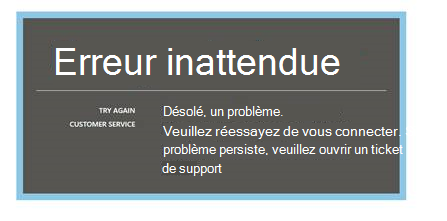

<properties 
    pageTitle="Résolution des problèmes d’Analytique - le puissant outil de recherche d’idées d’Application | Microsoft Azure" 
    description="Problèmes avec analytique d’idées d’Application ? Commencez ici. " 
    services="application-insights" 
    documentationCenter=""
    authors="alancameronwills" 
    manager="douge"/>

<tags 
    ms.service="application-insights" 
    ms.workload="tbd" 
    ms.tgt_pltfrm="ibiza" 
    ms.devlang="na" 
    ms.topic="article" 
    ms.date="07/11/2016" 
    ms.author="awills"/>

# Résoudre les problèmes d’Analytique dans les perspectives de l’Application

Problèmes avec [l’Application aperçu Analytique](app-insights-analytics.md)? Commencez ici. Analytique est un outil puissant de recherche d’idées d’Application Visual Studio.

## Limites

* À l’heure actuelle, les résultats de la requête sont limités à juste plus d’une semaine de données anciennes.
* Nous tester sur les navigateurs : dernières éditions de Chrome, Edge et Internet Explorer.

## Extensions du navigateur incompatibles connus

* Ghostery

Désactiver l’extension, ou utilisez un autre navigateur.

##« Erreur inattendue »

Une erreur interne s’est produite lors de l’exécution de portail – une exception non gérée.

* Nettoyer le cache du navigateur. 

## 403... Veuillez essayer de recharger

Une authentification concernant l’erreur s’est produite (lors de l’authentification ou pendant la génération de jeton d’accès). Le portail peut n’ont aucun moyen de récupérer sans modifier les paramètres du navigateur.

* Vérifiez [les cookies tiers sont activés](#cookies) dans le navigateur. 

## 403... Vérifiez la zone de sécurité

Une authentification concernant l’erreur s’est produite (lors de l’authentification ou pendant la génération de jeton d’accès). Le portail peut n’ont aucun moyen de récupérer sans modifier les paramètres du navigateur.

1. Vérifiez [les cookies tiers sont activés](#cookies) dans le navigateur. 

2. Avez-vous utilisé un favori, un signet ou un lien enregistré pour ouvrir le portail Analytique ? Si vous êtes connecté avec différentes informations d’identification que vous avez utilisé lorsque vous avez enregistré le lien ?

2. Essayez d’utiliser une fenêtre de navigateur de privé/incognito (après avoir fermé toutes les fenêtres de ce type). Vous devrez fournir vos informations d’identification. 

2. Ouvrir une autre fenêtre de navigateur (ordinaire) et accédez à [Azure](https://portal.azure.com). Se déconnecter. Ouvrez ensuite votre lien et les signe avec les informations d’identification correctes.

2. Les utilisateurs de bord et d’Internet Explorer peuvent aussi obtenir cette erreur lorsque les paramètres de zone de confiance ne sont pas pris en charge.

    Vérifiez le [portail d’Analytique](https://analytics.applicationinsights.io) et de [portail d’Azure Active Directory](https://portal.azure.com) sont dans la même zone de sécurité :

 * Dans Internet Explorer, ouvrez **Options Internet**, **sécurité**, **sites de confiance**, **Sites**:

    

    Dans la liste des sites Web, si une des URL suivantes sont incluse, assurez-vous que les autres sont également inclus :

    https://Analytics.applicationinsights.IO 
   https://login.microsoftonline.com 
   https://login.Windows.NET

## 404... Ressource non trouvée

Ressource d’application a été supprimée à partir de l’aperçu de l’Application et n’est plus disponible. Cela peut se produire si vous avez enregistré l’URL vers la page Analytique.

## 403... Aucune autorisation

Vous n’êtes pas autorisé à ouvrir cette application dans Analytique.

* Vous avez reçu le lien à partir d’une autre personne ? Demandez-leur de vous assurer que vous êtes dans les [lecteurs ou les collaborateurs pour ce groupe de ressources](app-insights-resources-roles-access-control.md).
* Avez-vous enregistré le lien à l’aide de différentes informations d’identification ? Ouvrir le [portail Azure](https://portal.azure.com)et se déconnecter puis essayez à nouveau, ce lien fournissant les informations d’identification correctes.

## 403... Stockage de HTML5

Notre portail utilise sessionStorage et localStorage de HTML5.

* Chrome : Paramètres, confidentialité, paramètres de contenu.
* Internet Explorer : Options Internet, onglet Avancé, sécurité, activer le stockage DOM

## 404... Abonnement introuvable

L’URL n’est pas valide. 

* Ouvrez la ressource d’application dans les [perspectives de l’Application portail](https://portal.azure.com). Utilisez le bouton Analytique.

## 404... n’existe pas

L’URL n’est pas valide.

* Ouvrez la ressource d’application dans les [perspectives de l’Application portail](https://portal.azure.com). Utilisez le bouton Analytique.

## Activer les cookies tiers

  Voir [Comment faire pour désactiver les cookies tierce partie](http://www.digitalcitizen.life/how-disable-third-party-cookies-all-major-browsers), mais notez que pour **Activer** leur utilité.

## Si tout le reste échoue    

[Nous contacter](app-insights-get-dev-support.md).
 
[AZURE.INCLUDE [app-insights-analytics-footer](../../includes/app-insights-analytics-footer.md)]

