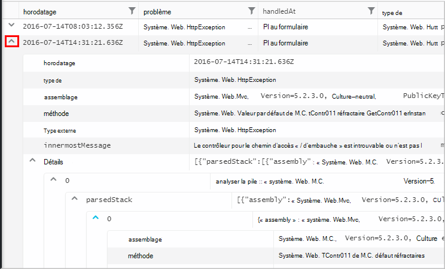

<properties 
    pageTitle="À l’aide d’Analytique - le puissant outil de recherche d’idées d’Application | Microsoft Azure" 
    description="À l’aide de l’Analytique, l’outil de recherche de diagnostic puissant de perspectives de l’Application. " 
    services="application-insights" 
    documentationCenter=""
    authors="danhadari" 
    manager="douge"/>

<tags 
    ms.service="application-insights" 
    ms.workload="tbd" 
    ms.tgt_pltfrm="ibiza" 
    ms.devlang="na" 
    ms.topic="article" 
    ms.date="10/21/2016" 
    ms.author="awills"/>

# À l’aide d’Analytique dans les perspectives de l’Application

[Analytique](app-insights-analytics.md) est une fonctionnalité puissante de recherche [d’Idées d’Application](app-insights-overview.md). Ces pages décrivent le langage de requête Analytique.

* **[Visionnez la vidéo d’introduction](https://applicationanalytics-media.azureedge.net/home_page_video.mp4)**.
* **[Lecteur de test Analytique sur nos données simulées](https://analytics.applicationinsights.io/demo)** si votre application n’est pas envoyer des données aux analyses d’Application encore.

## Ouvrir Analytique

À partir de la ressource de base de votre application dans les perspectives de l’Application, cliquez sur Analytique.

Le didacticiel en ligne vous donne quelques idées sur ce que vous pouvez faire.

Il existe une [présentation plus complète ici](app-insights-analytics-tour.md).

## Interroger votre télémétrie

### Écrire une requête

Commencer avec les noms de toutes les tables répertoriées sur la gauche (ou les opérateurs de [plage](app-insights-analytics-reference.md#range-operator) ou d’une [union](app-insights-analytics-reference.md#union-operator) ). Utilisez `|` pour créer un tuyau [d’opérateurs](app-insights-analytics-reference.md#queries-and-operators). IntelliSense vous invite avec les opérateurs et les éléments de l’expression que vous pouvez utiliser.

Consultez la [vue d’ensemble du langage Analytique](app-insights-analytics-tour.md) et la [référence du langage](app-insights-analytics-reference.md).

### Exécution d’une requête

1. Vous pouvez utiliser des sauts de ligne unique dans une requête.
2. Placez le curseur à l’intérieur ou à la fin de la requête que vous souhaitez exécuter.
3. Cliquez sur OK pour exécuter la requête.
4. Ne placez pas de lignes vides dans votre requête. Vous pouvez conserver plusieurs requêtes séparées dans un onglet de requête en les séparant par des lignes vides. Seul l’avec le curseur s’exécute.

### Enregistrer une requête

1. Enregistrez le fichier de requête en cours.
2. Ouvrir un fichier de requête enregistré.
3. Créer un nouveau fichier de requête.

## Afficher les détails

Développez une ligne quelconque dans les résultats pour voir la liste complète des propriétés. Vous pouvez développer davantage de toute propriété qui est une valeur structurée - par exemple, des dimensions personnalisées ou la pile de mise en vente dans une exception.

 

## Réorganiser les résultats

Vous pouvez trier, filtrer, paginer et regrouper les résultats retournés par votre requête.

> [AZURE.NOTE] Tri, de regroupement et de filtrage dans le navigateur ne réexécutez votre requête. Ils réorganiser uniquement les résultats qui ont été retournées par votre dernière requête. 
> 
> Pour effectuer ces tâches sur le serveur avant que les résultats sont renvoyés, écrivez votre requête avec les opérateurs de [tri](app-insights-analytics-reference.md#sort-operator), de [résumer](app-insights-analytics-reference.md#summarize-operator) et [où](app-insights-analytics-reference.md#where-operator) .

Sélectionnez les colonnes que vous souhaitez voir, faites glisser les en-têtes de colonne pour réorganiser et redimensionner les colonnes en faisant glisser leurs bordures.

### Trier et filtrer des éléments

Trier les résultats en cliquant sur l’en-tête d’une colonne. Cliquez à nouveau sur pour l’autre façon de trier, cliquez sur une troisième fois pour revenir à l’ordre d’origine renvoyées par votre requête.

Utilisez l’icône de filtre pour affiner votre recherche.

### Éléments de groupe

Pour trier plusieurs colonnes, utilisez regroupement. Tout d’abord l’activer, puis faites glisser les en-têtes de colonne dans l’espace situé au-dessus de la table.

### Certains résultats est-elle manquante ?

Il existe une limite de 10 lignes k sur les résultats renvoyés à partir du portail. Un avertissement indique que si vous passez en revue la limite. Dans ce cas, vos résultats dans la table de tri ne toujours vous montrer tous les résultats ou le prénom réels. 

Il est recommandé d’éviter de passer par la limite. Utilisez des opérateurs tels que :

* [où timestamp > ago(3d)](app-insights-analytics-reference.md#where-operator)
* [liste des 100 meilleurs clients par date](app-insights-analytics-reference.md#top-operator) 
* [prendre de 100](app-insights-analytics-reference.md#take-operator)
* [synthétiser](app-insights-analytics-reference.md#summarize-operator) 

## Diagrammes

Sélectionnez le type de diagramme que vous souhaitez :

Si vous avez plusieurs colonnes de types de droite, vous pouvez choisir le x et axes y et une colonne de dimensions à fractionner les résultats par.

Par défaut, les résultats sont affichées sous forme de tableau, et sélectionne le diagramme. Mais vous pouvez utiliser la [directive de rendu](app-insights-analytics-reference.md#render-directive) à la fin d’une requête pour sélectionner un diagramme.

## Ajouter au tableau de bord

Vous pouvez épingler un diagramme, ou table à l’un de vos [tableaux de bord partagés](app-insights-dashboards.md) - uniquement sur le code confidentiel. (Vous devrez [mise d’à niveau que votre application de tarification du package](app-insights-pricing.md) activer cette fonctionnalité.) 

Cela signifie que, lorsque vous placez ensemble d’un tableau de bord permettent de contrôler les performances ou l’utilisation de vos services web, vous pouvez inclure une analyse très complexe avec les autres mesures. 

Vous pouvez épingler un tableau au tableau de bord, si elle possède quatre ou moins de colonnes. Uniquement les sept premières lignes sont affichées.

#### Actualisation du tableau de bord

Le graphique épinglé au tableau de bord est actualisé automatiquement en exécutant de nouveau la requête environ toutes les demi-heures.

#### Simplifications automatiques

Dans certains cas, certaines simplifications sont appliquées à un graphique lorsque vous le mettez à un tableau de bord.

Lorsque l’axe sur un graphique qui affiche un grand nombre d’emplacements distincts (en général un graphique à barres), les emplacements moins peuplées sont automatiquement regroupés en un seul « autres » bin. Par exemple, cette requête :

    requests | summarize count_search = count() by client_CountryOrRegion

dans Analytique, ressemble à ceci :

mais lorsque vous l’ajoutez à un tableau de bord, il se présente comme suit :

## Exporter vers Excel

Après avoir exécuté une requête, vous pouvez télécharger un fichier .csv. Cliquez sur **Exporter vers Excel**.

## Exporter vers l’alimentation BI

Placez le curseur dans une requête et sélectionnez **Exporter vers BI d’alimentation**.

Vous exécutez la requête dans BI d’alimentation. Vous pouvez définir pour actualiser sur une grille.

Avec BI d’alimentation, vous pouvez créer des tableaux de bord rassembler des données à partir d’un large éventail de sources.

[En savoir plus sur l’exportation d’alimentation BI](app-insights-export-power-bi.md)

[AZURE.INCLUDE [app-insights-analytics-footer](../../includes/app-insights-analytics-footer.md)]

