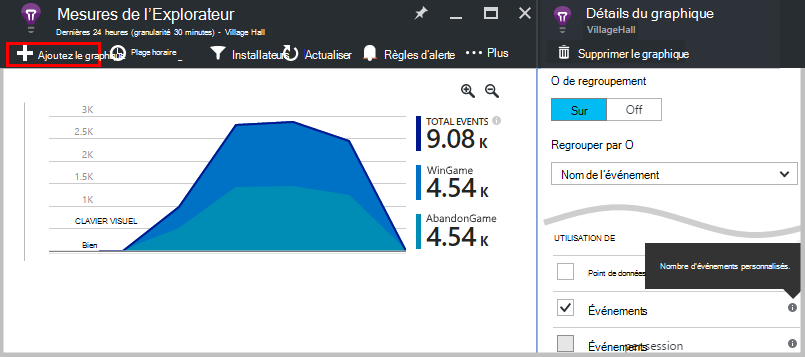
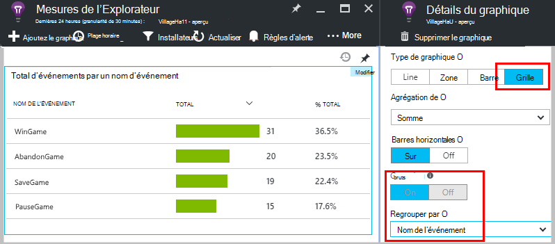
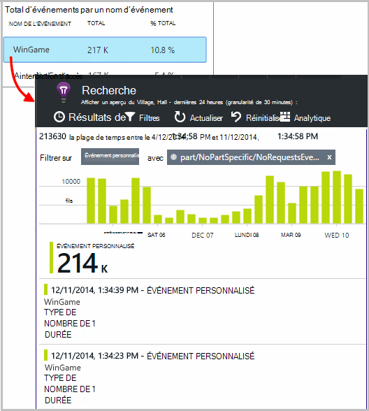
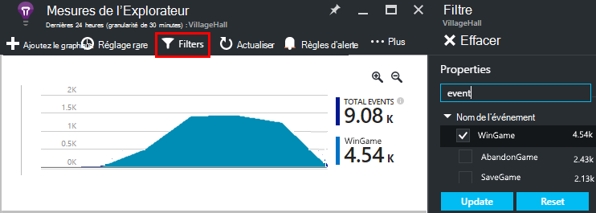
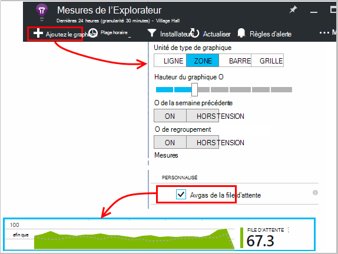
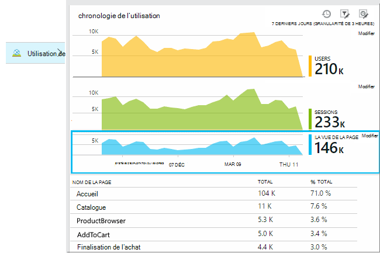
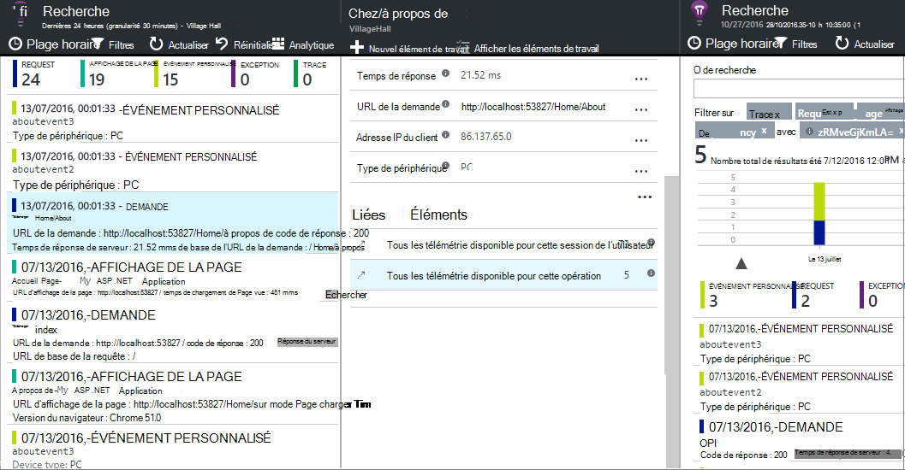
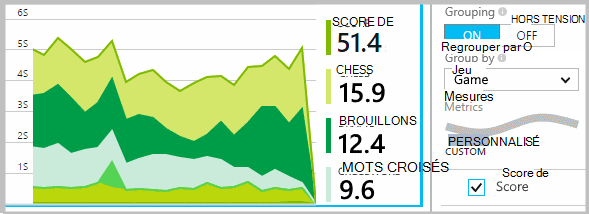
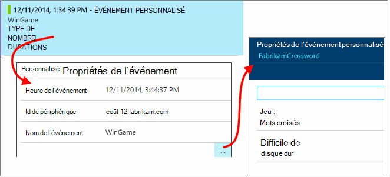
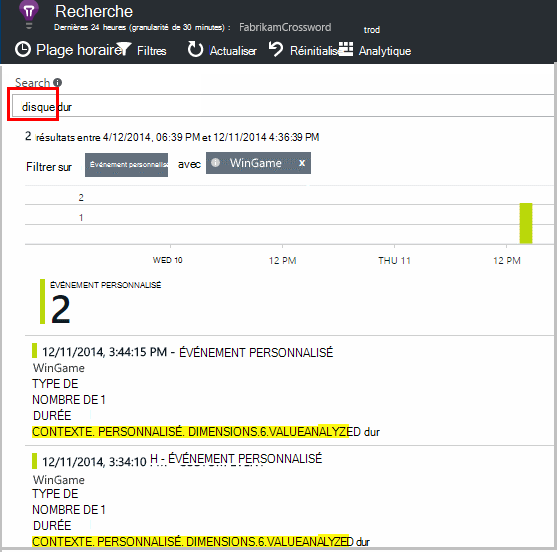

<properties 
    pageTitle="Idées d’applications API pour les événements personnalisés et les mesures | Microsoft Azure" 
    description="Insérez quelques lignes de code dans votre application de périphérique ou de bureau, la page web ou le service pour suivre l’utilisation et de diagnostiquer les problèmes." 
    services="application-insights"
    documentationCenter="" 
    authors="alancameronwills" 
    manager="douge"/>
 
<tags 
    ms.service="application-insights" 
    ms.workload="tbd" 
    ms.tgt_pltfrm="ibiza" 
    ms.devlang="multiple" 
    ms.topic="article" 
    ms.date="10/19/2016" 
    ms.author="awills"/>

# <a name="application-insights-api-for-custom-events-and-metrics"></a>Idées d’applications API pour les mesures et les événements personnalisés 

*Idées d’application est en mode Aperçu.*

Insérez quelques lignes de code dans votre application pour savoir ce que font les utilisateurs avec lui, ou pour aider à diagnostiquer les problèmes. Vous pouvez envoyer la télémétrie à partir des applications de bureau et de périphérique, des clients web et des serveurs web. La télémétrie de core [Visual Studio perspectives d’Application](app-insights-overview.md) API vous permet d’envoyer vos propres versions de télémétrie standard et des métriques et des événements personnalisés. Cette API est la même API que celle qui est utilisée par les collecteurs de données informations d’Application standard.

## <a name="api-summary"></a>Résumé de l’API

L’API est uniforme sur toutes les plates-formes, mis à part quelques petites variations.

Méthode | Utilisé pour
---|---
[`TrackPageView`](#page-views) | Pages, écrans, lames ou formes
[`TrackEvent`](#track-event) | Actions de l’utilisateur et d’autres événements. Utilisé pour effectuer le suivi du comportement de l’utilisateur ou pour surveiller les performances.
[`TrackMetric`](#track-metric) | Mesures de performances, tels que les longueurs de file d’attente non liées à des événements spécifiques
[`TrackException`](#track-exception)|Journal des exceptions diagnostic. Suivi lorsqu’ils se produisent par rapport aux autres événements et examinez les traces de la pile.
[`TrackRequest`](#track-request)| Ouvrez une session la fréquence et la durée de demandes du serveur pour l’analyse des performances.
[`TrackTrace`](#track-trace)|Messages du journal de diagnostic. Vous pouvez également capturer des journaux de 3 rd-party.
[`TrackDependency`](#track-dependency)|Ouvrez une session la durée et la fréquence des appels à des composants externes dont dépend votre application.

Vous pouvez [attacher des propriétés et des mesures](#properties) à la plupart de ces appels de télémétrie. 


## <a name="prep"></a>Avant de commencer

Si vous n’avez pas fait ces encore :

* Ajoutez le Kit de développement de perspectives Application à votre projet :
 * [Projet ASP.NET][greenbrown]
 * [Projet de Java][java] 
 * [JavaScript dans chaque page web][client]   

* Dans votre code de serveur web ou du périphérique, sont les suivantes :

    *C#:*`using Microsoft.ApplicationInsights;`

    *VB:*`Imports Microsoft.ApplicationInsights`

    *Java :*`import com.microsoft.applicationinsights.TelemetryClient;`

## <a name="construct-a-telemetryclient"></a>Créer un TelemetryClient

Construire une instance de TelemetryClient (à l’exception de JavaScript dans les pages web) :

*C# :* 

    private TelemetryClient telemetry = new TelemetryClient();

*VB :* 

    Private Dim telemetry As New TelemetryClient

*Java*

    private TelemetryClient telemetry = new TelemetryClient();

TelemetryClient est thread-safe.

Nous vous recommandons d’utiliser une instance de `TelemetryClient` pour chaque module de votre application. Par exemple, vous pouvez avoir une `TelemetryClient` dans votre service web pour signaler entrant les demandes http et un autre dans une classe de middleware pour les événements de logique d’entreprise rapport. Vous pouvez définir des propriétés telles que `TelemetryClient.Context.User.Id` pour effectuer le suivi des utilisateurs et des sessions, ou `TelemetryClient.Context.Device.Id` pour identifier l’ordinateur. Cette information est joint à tous les événements envoyés par l’instance.


## <a name="track-event"></a>Événement de suivi

Dans les analyses de l’Application, un *événement personnalisé* est une données point que vous pouvez afficher à la fois dans [l’Explorateur de mesures] [ metrics] sous la forme d’un nombre agrégé et également des occurrences individuelles de [Diagnostic recherche][diagnostic]. (Il n’est pas lié à MVC ou autre framework « événements ».) 

Insérer des appels TrackEvent dans votre code pour compter la fréquence à laquelle les utilisateurs choisir une fonctionnalité particulière, la fréquence à laquelle ils atteignent les objectifs de particuliers, ou peut-être effectuer certains types d’erreur. 

Par exemple, dans une application de jeu, vous devez envoyer un événement chaque fois qu’un utilisateur remporte la partie : 

*JavaScript*

    appInsights.trackEvent("WinGame");

*C#*
    
    telemetry.TrackEvent("WinGame");

*VB*


    telemetry.TrackEvent("WinGame")

*Java*

    telemetry.trackEvent("WinGame");


### <a name="view-your-events-in-the-azure-portal"></a>Afficher les événements dans le portail Azure

Pour afficher un nombre de vos événements, ouvrir une lame de [Mesure de l’Explorateur](app-insights-metrics-explorer.md) , ajouter un nouveau graphique et sélectionnez les événements.  



Pour comparer le nombre d’événements différents, définissez le type de graphique sur la grille et groupe par nom de l’événement :




Dans la grille, cliquez sur un nom d’événement pour afficher les occurrences de cet événement.



Cliquez sur n’importe quelle occurrence pour afficher plus de détails.

Pour vous concentrer sur des événements spécifiques dans la recherche ou de mesure de l’Explorateur, définir les filtres de la lame pour les noms d’événements qui vous intéressent :



## <a name="track-metric"></a>Effectuer le suivi de la métrique

Utiliser TrackMetric pour envoyer des mesures qui ne sont pas associées à des événements particuliers. Par exemple, vous pouvez contrôler une longueur de file d’attente à intervalles réguliers. 

Métriques sont affichés sous forme de graphiques de statistiques dans l’Explorateur de métriques, mais contrairement aux événements, vous ne pouvez pas rechercher dans diagnostic recherche les occurrences individuelles.

Valeurs métriques doivent être > = 0 pour s’afficher correctement.


*JavaScript*

    appInsights.trackMetric("Queue", queue.Length);

*C#*

    telemetry.TrackMetric("Queue", queue.Length);

*VB*

    telemetry.TrackMetric("Queue", queue.Length)

*Java*

    telemetry.trackMetric("Queue", queue.Length);

En fait, vous pouvez le faire dans un thread d’arrière-plan :

*C#*

    private void Run() {
     var appInsights = new TelemetryClient();
     while (true) {
      Thread.Sleep(60000);
      appInsights.TrackMetric("Queue", queue.Length);
     }
    }


Pour afficher les résultats, ouvrez l’Explorateur métriques et ajouter un nouveau graphique. Définir pour afficher votre métrique.



Il existe certaines [limites sur le nombre de mesures](#limits) que vous pouvez utiliser.

## <a name="page-views"></a>Affichages de page

Dans un périphérique ou une application de page web, la télémétrie d’affichage de page est envoyé par défaut lors du chargement de chaque écran ou la page. Mais vous pouvez modifier pour effectuer le suivi des affichages de page à des moments différents ou supplémentaires. Par exemple, dans une application qui affiche les onglets ou lames, il pourriez que vous souhaitez suivre une « page » à chaque fois que l’utilisateur ouvre une nouvelle lame. 



Les données utilisateur et la session sont envoyées en tant que propriétés, ainsi que des vues de la page, afin que les graphiques utilisateur et session vivant lorsqu’il y a de télémétrie d’affichage de page.

#### <a name="custom-page-views"></a>Vues de page personnalisée

*JavaScript*

    appInsights.trackPageView("tab1");

*C#*

    telemetry.TrackPageView("GameReviewPage");

*VB*

    telemetry.TrackPageView("GameReviewPage")


Si vous avez plusieurs onglets dans des pages HTML différents, vous pouvez spécifier l’URL trop :

    appInsights.trackPageView("tab1", "http://fabrikam.com/page1.htm");

#### <a name="timing-page-views"></a>Vues de page de minutage

Par défaut, les heures déclarées « Temps de chargement d’un affichage de Page » sont mesurés à partir de lorsque le navigateur envoie la demande, jusqu'à ce que l’événement de chargement de la page du navigateur est appelée.

Au lieu de cela, vous pouvez :

* Définissez une durée explicite dans l’appel de [trackPageView](https://github.com/Microsoft/ApplicationInsights-JS/blob/master/API-reference.md#trackpageview) .
 * `appInsights.trackPageView("tab1", null, null, null, durationInMilliseconds);`
* Utilisez l’affichage page minutage des appels `startTrackPage` et `stopTrackPage`.

*JavaScript*

    // To start timing a page:
    appInsights.startTrackPage("Page1");

... 

    // To stop timing and log the page:
    appInsights.stopTrackPage("Page1", url, properties, measurements);

Le nom que vous utilisez comme premier paramètre associe les appels de début et de fin. Il prend par défaut le nom de la page en cours. 

Les durées de charge page résultante affichées dans l’Explorateur de métrique sont dérivées de l’intervalle entre les appels de début et de fin. C’est à vous quel intervalle de temps en fait.

## <a name="track-request"></a>Demande de piste

Utilisé par le Kit de développement logiciel du serveur pour les demandes HTTP. 

Vous pouvez également l’appeler vous-même si vous souhaitez simuler des demandes dans un contexte où vous n’avez pas le module de service web en cours d’exécution.

*C#*

    // At start of processing this request:

    // Operation Id and Name are attached to all telemetry and help you identify
    // telemetry associated with one request:
    telemetry.Context.Operation.Id = Guid.NewGuid().ToString();
    telemetry.Context.Operation.Name = requestName;
    
    var stopwatch = System.Diagnostics.Stopwatch.StartNew();

    // ... process the request ...

    stopwatch.Stop();
    telemetry.TrackRequest(requestName, DateTime.Now,
       stopwatch.Elapsed, 
       "200", true);  // Response code, success


## <a name="operation-context"></a>Contexte de l’opération

Éléments de télémétrie peuvent être associés en joignant leur ID d’opération commune. La module de suivi de demande standard pour cela d’exceptions et d’autres événements envoyés lors du traitement d’une demande HTTP. Dans la [recherche](app-insights-diagnostic-search.md) et [Analytique](app-insights-analytics.md), vous pouvez utiliser le code pour trouver facilement tous les événements associés à la demande. 

Pour définir l’ID, le plus simple consiste à définir un contexte d’opération à l’aide de ce modèle :

    // Establish an operation context and associated telemetry item:
    using (var operation = telemetry.StartOperation<RequestTelemetry>("operationName"))
    {
        // Telemetry sent in here will use the same operation ID.
        ...
        telemetry.TrackEvent(...); // or other Track* calls
        ...
        // Set properties of containing telemetry item - for example:
        operation.Telemetry.ResponseCode = "200";
        
        // Optional: explicitly send telemetry item:
        telemetry.StopOperation(operation);

    } // When operation is disposed, telemetry item is sent.

Outre la définition d’un contexte d’opération, `StartOperation` crée un élément de télémétrie du type que vous spécifiez et il envoie de lorsque vous cédez l’opération, ou si vous appelez explicitement `StopOperation`. Si vous utilisez `RequestTelemetry` comme type de télémétrie, puis sa durée est égale à l’intervalle de temps entre le début et de fin.

Contextes d’opération ne peut pas être imbriqués. S’il existe déjà un contexte d’opération, son ID est associé à tous les éléments qu’il contient, y compris l’élément créé avec StartOperation.

Dans la recherche, le contexte de l’opération est utilisé pour créer la liste d’articles connexes :




## <a name="track-exception"></a>Exception de piste

Envoyer les exceptions aux analyses d’Application : pour [compter les][metrics], comme une indication de la fréquence d’un problème ; et [d’examiner des occurrences individuelles][diagnostic]. Les rapports comprennent les traces de la pile.

*C#*

    try
    {
        ...
    }
    catch (Exception ex)
    {
       telemetry.TrackException(ex);
    }

*JavaScript*

    try
    {
       ...
    }
    catch (ex)
    {
       appInsights.trackException(ex);
    }

Les kits de développement approximatif de nombreuses exceptions automatiquement, sans que vous ayez toujours à appeler explicitement de TrackException.

* ASP.NET : [écrire du code pour intercepter des exceptions](app-insights-asp-net-exceptions.md)
* J2EE : [les Exceptions sont interceptées automatiquement](app-insights-java-get-started.md#exceptions-and-request-failures)
* JavaScript : Détectée automatiquement. Si vous souhaitez désactiver la collection automatique, ajoutez une ligne dans l’extrait de code que vous insérez dans vos pages web :

    ```
    ({
      instrumentationKey: "your key"
      , disableExceptionTracking: true
    })
    ```


## <a name="track-trace"></a>Effectuer le suivi de Trace 

Cela permet de diagnostiquer les problèmes en envoyant une piste de navigation aux analyses de l’Application. Vous pouvez envoyer des blocs de données de diagnostic et les examiner dans une [recherche de Diagnostic][diagnostic]. 

 

[Connecter les cartes] [ trace] utiliser cette API pour envoyer les journaux tierce sur le portail.


*C#*

    telemetry.TrackTrace(message, SeverityLevel.Warning, properties);


Vous pouvez effectuer une recherche sur le contenu du message, mais (contrairement aux valeurs de propriété) vous ne pouvez pas filtrer sur celui-ci.

La limite de taille sur `message` est plus importante que la limite sur les propriétés.
Un avantage de TrackTrace, que vous pouvez placer des données relativement longues dans le message. Par exemple, vous pourriez coder les données POST.  


En outre, vous pouvez ajouter un niveau de gravité à votre message. Et, comme autre télémétrie, vous pouvez ajouter des valeurs de propriété que vous pouvez utiliser pour filtrer ou rechercher des jeux différents de traces. Par exemple :


    var telemetry = new Microsoft.ApplicationInsights.TelemetryClient();
    telemetry.TrackTrace("Slow database response",
                   SeverityLevel.Warning,
                   new Dictionary<string,string> { {"database", db.ID} });

Cela vous permettrait, dans une [recherche][diagnostic], facilement filtrer tous les messages d’une gravité particulière relative à une base de données particulière.

## <a name="track-dependency"></a>Effectuer le suivi de la dépendance

Cet appel permet de suivre le temps de réponse et le taux de réussite des appels à un morceau de code externe. Les résultats s’affichent dans les graphiques de dépendance dans le portail. 

```C#

            var success = false;
            var startTime = DateTime.UtcNow;
            var timer = System.Diagnostics.Stopwatch.StartNew();
            try
            {
                success = dependency.Call();
            }
            finally
            {
                timer.Stop();
                telemetry.TrackDependency("myDependency", "myCall", startTime, timer.Elapsed, success);
            }
```

N’oubliez pas que le serveur Qu'ils incluent un [module de dépendance](app-insights-dependencies.md) qui découvre et effectue le suivi de certaines dépendances appelle automatiquement - par exemple pour les bases de données et d’autres API. Vous devez installer un agent sur votre serveur pour que le module fonctionne. Vous utiliserez cet appel si vous souhaitez effectuer le suivi d’appels qui ne sont pas interceptées par le suivi automatisé, ou si vous ne souhaitez pas installer l’agent.

Pour désactiver le module de suivi de dépendance standard, [ApplicationInsights.config](app-insights-configuration-with-applicationinsights-config.md) de modifier et de supprimer la référence à `DependencyCollector.DependencyTrackingTelemetryModule`.


## <a name="flushing-data"></a>Vidage des données

Normalement le Kit de développement logiciel envoie des données à certains moments choisies pour réduire l’impact sur l’utilisateur. Toutefois, dans certains cas vous pouvez souhaiter vider le tampon - par exemple, si vous utilisez le Kit de développement d’une application s’arrête.

*C#*

    telemetry.Flush();

    // Allow some time for flushing before shutdown.
    System.Threading.Thread.Sleep(1000);

Notez que la fonction est asynchrone pour le [canal de télémétrie de serveur](https://www.nuget.org/packages/Microsoft.ApplicationInsights.WindowsServer.TelemetryChannel/), mais synchrone si vous choisissez d’utiliser le canal de mémoire ou [persistant](app-insights-api-filtering-sampling.md#persistence-channel).


## <a name="authenticated-users"></a>Utilisateurs authentifiés

Dans une application web, les utilisateurs sont par défaut identifié par le cookie. Un utilisateur peut être compté plus d’une fois s’ils accéder à votre application à partir d’un autre ordinateur ou un navigateur, ou supprimer les cookies. 

Mais si les utilisateurs se connecter à votre application, vous pouvez obtenir un inventaire plus précis en définissant l’id de l’utilisateur authentifié dans le code du navigateur :

*JavaScript*

```JS
    // Called when my app has identified the user.
    function Authenticated(signInId) {
      var validatedId = signInId.replace(/[,;=| ]+/g, "_");
      appInsights.setAuthenticatedUserContext(validatedId);
      ...
    }
```

Dans une application MVC, par exemple du site web d’ASP.NET :

*RASOIR*

        @if (Request.IsAuthenticated)
        {
            <script>
                appInsights.setAuthenticatedUserContext("@User.Identity.Name
                   .Replace("\\", "\\\\")"
                   .replace(/[,;=| ]+/g, "_"));
            </script>
        }

Il n’est pas nécessaire d’utiliser le nom d’utilisateur réel de l’utilisateur. Il ne doit pas être un id unique pour cet utilisateur. Il ne doit pas inclure d’espaces ni aucun des caractères `,;=|`. 

L’id d’utilisateur est également définie dans un cookie de session et envoyée au serveur. Si le Kit de développement logiciel de serveur est installé, l’id d’utilisateur authentifié sera envoyé en tant que partie des propriétés du contexte de télémétrie de client et le serveur, afin que vous pouvez filtrer et rechercher sur celui-ci.

Si votre application regroupe les comptes utilisateurs, vous pouvez également passer un identificateur pour le compte (avec les mêmes restrictions de caractère).


      appInsights.setAuthenticatedUserContext(validatedId, accountId);

Dans l' [Explorateur de mesures](app-insights-metrics-explorer.md), vous pouvez créer un graphique qui compte **utilisateurs authentifiés** et les **comptes d’utilisateurs**. 

Vous pouvez également de [recherche] [ diagnostic] pour les points de données de clients avec des comptes et des noms d’utilisateur spécifiques.

## <a name="properties"></a>Filtrer, rechercher et segmenter vos données avec des propriétés

Vous pouvez attacher des propriétés et des mesures à vos événements (et également pour les mesures, page affichages, les exceptions et les autres données de télémétrie).

**Les propriétés** sont des valeurs de chaîne que vous pouvez utiliser pour filtrer votre télémétrie dans les rapports d’utilisation. Par exemple si votre application fournit plusieurs jeux, vous souhaiterez attacher le nom du jeu à chaque événement, afin que vous puissiez voir les jeux sont de plus en plus répandus. 

Il existe une limite d’environ 1 Ko sur la longueur de la chaîne. (Si vous souhaitez envoyer de grandes quantités de données, utilisez le paramètre message de [TrackTrace](#track-trace).)

**Les mesures** sont des valeurs numériques qui peuvent être présentés sous forme graphique. Par exemple, vous pouvez souhaiter voir s’il existe une augmentation progressive de scores que vos joueurs atteindre. Les graphiques peuvent être subdivisés par les propriétés envoyées par l’événement, afin que vous pourriez obtenir distinct ou empilés graphiques pour jeux différents.

Valeurs métriques doivent être > = 0 pour s’afficher correctement.


Il existe certains [limites sur le nombre de propriétés, les valeurs de propriété et les mesures](#limits) que vous pouvez utiliser.


*JavaScript*

    appInsights.trackEvent
      ("WinGame",
         // String properties:
         {Game: currentGame.name, Difficulty: currentGame.difficulty},
         // Numeric metrics:
         {Score: currentGame.score, Opponents: currentGame.opponentCount}
         );

    appInsights.trackPageView
        ("page name", "http://fabrikam.com/pageurl.html",
          // String properties:
         {Game: currentGame.name, Difficulty: currentGame.difficulty},
         // Numeric metrics:
         {Score: currentGame.score, Opponents: currentGame.opponentCount}
         );
          

*C#*

    // Set up some properties and metrics:
    var properties = new Dictionary <string, string> 
       {{"game", currentGame.Name}, {"difficulty", currentGame.Difficulty}};
    var metrics = new Dictionary <string, double>
       {{"Score", currentGame.Score}, {"Opponents", currentGame.OpponentCount}};

    // Send the event:
    telemetry.TrackEvent("WinGame", properties, metrics);


*VB*

    ' Set up some properties:
    Dim properties = New Dictionary (Of String, String)
    properties.Add("game", currentGame.Name)
    properties.Add("difficulty", currentGame.Difficulty)

    Dim metrics = New Dictionary (Of String, Double)
    metrics.Add("Score", currentGame.Score)
    metrics.Add("Opponents", currentGame.OpponentCount)

    ' Send the event:
    telemetry.TrackEvent("WinGame", properties, metrics)


*Java*
    
    Map<String, String> properties = new HashMap<String, String>();
    properties.put("game", currentGame.getName());
    properties.put("difficulty", currentGame.getDifficulty());
    
    Map<String, Double> metrics = new HashMap<String, Double>();
    metrics.put("Score", currentGame.getScore());
    metrics.put("Opponents", currentGame.getOpponentCount());
    
    telemetry.trackEvent("WinGame", properties, metrics);


> [AZURE.NOTE] Prendre soin de ne pas pour enregistrer les informations personnellement identifiables dans les propriétés.

**Si vous avez utilisé des métriques**, ouvrez l’Explorateur métrique et sélectionner la mesure à partir du groupe personnalisé :


*Si votre métrique n’apparaît pas, ou si l’en-tête personnalisé n’est pas il, fermer la lame de sélection et réessayez plus tard. Il peut parfois prendre une heure pour les mesures de l’agrégation via le pipeline.*

**Si vous avez utilisé des propriétés et des mesures**, la métrique par la propriété de segment :





**Dans Diagnostic recherche**, vous pouvez afficher les propriétés et les mesures de chaque occurrence d’un événement.





Pour voir des occurrences d’événement avec une valeur de propriété particulière, utilisez le champ de recherche.




[En savoir plus sur les expressions de recherche][diagnostic].

#### <a name="alternative-way-to-set-properties-and-metrics"></a>Autre moyen de définir des propriétés et des mesures

S’il est plus pratique, vous pouvez collecter les paramètres d’un événement dans un objet séparé :

    var event = new EventTelemetry();

    event.Name = "WinGame";
    event.Metrics["processingTime"] = stopwatch.Elapsed.TotalMilliseconds;
    event.Properties["game"] = currentGame.Name;
    event.Properties["difficulty"] = currentGame.Difficulty;
    event.Metrics["Score"] = currentGame.Score;
    event.Metrics["Opponents"] = currentGame.Opponents.Length;

    telemetry.TrackEvent(event);

> [AZURE.WARNING] Ne pas réutiliser la même instance d’élément de télémétrie (`event` dans cet exemple) pour appeler Track*() plusieurs fois. Cela peut entraîner de télémétrie être envoyé avec une configuration incorrecte.


## <a name="timed"></a>Événements de minutage

Vous souhaitez parfois graphique le temps nécessaire pour effectuer une action. Par exemple, vous aimeriez peut-être savoir combien de temps utilisateurs sont à prendre en compte les choix dans un jeu. Il s’agit d’un exemple utile des utilisations du paramètre mesure.


*C#*

    var stopwatch = System.Diagnostics.Stopwatch.StartNew();

    // ... perform the timed action ...

    stopwatch.Stop();

    var metrics = new Dictionary <string, double>
       {{"processingTime", stopwatch.Elapsed.TotalMilliseconds}};

    // Set up some properties:
    var properties = new Dictionary <string, string> 
       {{"signalSource", currentSignalSource.Name}};

    // Send the event:
    telemetry.TrackEvent("SignalProcessed", properties, metrics);


## <a name="defaults"></a>Propriétés par défaut de télémétrie personnalisé

Si vous souhaitez définir des valeurs de propriété par défaut pour certains événements personnalisés que vous écrivez, vous pouvez les définir dans un TelemetryClient. Ils sont associés à chaque élément de télémétrie envoyé à partir de ce client. 

*C#*

    using Microsoft.ApplicationInsights.DataContracts;

    var gameTelemetry = new TelemetryClient();
    gameTelemetry.Context.Properties["Game"] = currentGame.Name;
    // Now all telemetry will automatically be sent with the context property:
    gameTelemetry.TrackEvent("WinGame");
    
*VB*

    Dim gameTelemetry = New TelemetryClient()
    gameTelemetry.Context.Properties("Game") = currentGame.Name
    ' Now all telemetry will automatically be sent with the context property:
    gameTelemetry.TrackEvent("WinGame")

*Java*

    import com.microsoft.applicationinsights.TelemetryClient;
    import com.microsoft.applicationinsights.TelemetryContext;
    ...


    TelemetryClient gameTelemetry = new TelemetryClient();
    TelemetryContext context = gameTelemetry.getContext();
    context.getProperties().put("Game", currentGame.Name);
    
    gameTelemetry.TrackEvent("WinGame");


    
Appels de télémétrie individuels peuvent substituer les valeurs par défaut dans leurs dictionnaires de propriété.

**Clients du web pour JavaScript**, [utilisez des initialiseurs de télémétrie de JavaScript](#js-initializer).

**Pour ajouter des propriétés de télémétrie tous** , y compris les données à partir des modules de la collection standard, [implémenter `ITelemetryInitializer` ](app-insights-api-filtering-sampling.md#add-properties).


## <a name="sampling-filtering-and-processing-telemetry"></a>Prélèvement d’échantillons, de filtrage et de traitement de télémétrie 

Vous pouvez écrire du code pour traiter votre télémétrie avant d’être envoyé à partir du Kit de développement. Le traitement inclut des données envoyées à partir des modules standard de télémétrie comme collection de demande HTTP et la collection de dépendances.

* [Ajouter des propriétés](app-insights-api-filtering-sampling.md#add-properties) à la télémétrie en implémentant `ITelemetryInitializer` - par exemple, pour ajouter une version numéros ou valeurs calculées à partir d’autres propriétés. 
* [Le filtrage](app-insights-api-filtering-sampling.md#filtering) peut modifier ou ignorer la télémétrie avant d’être envoyé à partir du Kit de développement logiciel en implémentant `ITelemetryProcesor`. Vous contrôlez ce qui est envoyé ou ignoré, mais vous devez tenir compte de l’effet sur vos mesures. En fonction de comment vous ignorez des éléments, vous risquez de perdre la possibilité de naviguer entre les éléments connexes.
* [L’échantillonnage](app-insights-api-filtering-sampling.md#sampling) est une solution pour réduire le volume des données envoyées à partir de votre application sur le portail. Il le fait sans affecter les mesures affichées et sans affecter votre capacité à diagnostiquer les problèmes de navigation entre les éléments associés, comme les exceptions, les requêtes et les vues de la page.

[Pour en savoir plus](app-insights-api-filtering-sampling.md)


## <a name="disabling-telemetry"></a>La désactivation de télémétrie

Pour **Arrêter dynamiquement et démarrer** la collection et transmission de télémétrie :

*C#*

```C#

    using  Microsoft.ApplicationInsights.Extensibility;

    TelemetryConfiguration.Active.DisableTelemetry = true;
```

Pour **désactiver les collecteurs standard sélectionnés** - par exemple, les compteurs de performance, les requêtes HTTP ou dépendances - supprimer ou mettez en commentaire les lignes appropriées dans les [ApplicationInsights.config][config]. Vous pouvez procéder, par exemple, si vous souhaitez envoyer vos propres données de TrackRequest.

## <a name="debug"></a>Mode développeur

Pendant le débogage, il est utile d’avoir votre expédiée via le pipeline de sorte que vous pouvez voir immédiatement les résultats de télémétrie. Vous get également des messages supplémentaires qui vous aident à suivre les problèmes liés à la télémétrie. Désactiver dans la production, car elle risque de ralentir votre application.


*C#*
    
    TelemetryConfiguration.Active.TelemetryChannel.DeveloperMode = true;

*VB*

    TelemetryConfiguration.Active.TelemetryChannel.DeveloperMode = True


## <a name="ikey"></a>Définissez la clé de l’instrumentation de télémétrie de personnalisé sélectionné

*C#*
    
    var telemetry = new TelemetryClient();
    telemetry.InstrumentationKey = "---my key---";
    // ...


## <a name="dynamic-ikey"></a>Clé de l’instrumentation dynamique

Pour éviter de mélanger des données télémétriques fournies par les environnements de développement, de test et de production, vous pouvez [créer des ressources de perspectives d’Application distincts] [ create] et modifier leurs clés en fonction de l’environnement.

Au lieu de récupérer la clé de l’instrumentation du fichier de configuration, vous pouvez la définir dans votre code. Définir la clé dans une méthode d’initialisation, par exemple global.aspx.cs dans un service ASP.NET :

*C#*

    protected void Application_Start()
    {
      Microsoft.ApplicationInsights.Extensibility.
        TelemetryConfiguration.Active.InstrumentationKey = 
          // - for example -
          WebConfigurationManager.Settings["ikey"];
      ...

*JavaScript*

    appInsights.config.instrumentationKey = myKey; 


Dans les pages web, vous pouvez souhaiter définir à partir du serveur web état, plutôt que de codage de littéralement dans le script. Par exemple, dans une page web générée dans une application ASP.NET :

*JavaScript dans Razor*

    <script type="text/javascript">
    // Standard Application Insights web page script:
    var appInsights = window.appInsights || function(config){ ...
    // Modify this part:
    }({instrumentationKey:  
      // Generate from server property:
      @Microsoft.ApplicationInsights.Extensibility.
         TelemetryConfiguration.Active.InstrumentationKey"
    }) // ...


## <a name="telemetrycontext"></a>TelemetryContext

TelemetryClient a une propriété de contexte, qui contient un nombre de valeurs qui sont envoyés avec toutes les données de télémétrie. Elles sont normalement définis par les modules de télémétrie standard, mais vous pouvez également les définir vous-même. Par exemple :

    telemetry.Context.Operation.Name = "MyOperationName";

Si vous définissez une de ces valeurs vous-même, supprimez la ligne correspondante à partir de [ApplicationInsights.config][config], de sorte que les valeurs et les valeurs standard ne peuvent prêter à confusion.

* **Composant** Identifie l’application et sa version
* **DISPOSITIF** Données concernant le périphérique sur lequel l’application est en cours d’exécution (dans les applications web, c’est le serveur ou le périphérique client à partir duquel la télémétrie est envoyé)
* **InstrumentationKey** Identifie la ressource de perspectives d’Application dans Azure où apparaît la télémétrie. Généralement extraits à partir de ApplicationInsights.config
* **Emplacement** Identifie l’emplacement géographique de l’équipement.
* **Opération** Dans les applications web, la demande HTTP en cours. Dans d’autres types d’application, vous pouvez définir pour grouper des événements ensemble.
 * **ID**: une valeur générée qui met en corrélation les événements, afin que lorsque vous examinez tout événement de Diagnostic de recherche, vous pouvez rechercher « éléments associés »
 * **Nom**: un identificateur, généralement à l’URL de la demande HTTP. 
 * **SyntheticSource**: si non null ou vide, cette chaîne indique que la source de la demande a été identifiée comme un test web ou de robot. Par défaut, celle-ci sera exclue des calculs dans les mesures de l’Explorateur.
* **Propriétés** Propriétés qui sont envoyées avec toutes les données de télémétrie. Peut être substituée dans la piste * appels individuels.
* **Session** Identifie la session de l’utilisateur. L’Id est défini à une valeur générée, ce qui est modifiée lorsque l’utilisateur n’a pas été active pendant un certain temps.
* **Utilisateur** Informations utilisateur. 

## <a name="limits"></a>Limites


[AZURE.INCLUDE [application-insights-limits](../../includes/application-insights-limits.md)]

*Comment puis-je éviter atteint la limite de débit ?*

* Utilisez [l’échantillonnage](app-insights-sampling.md).

*Combien de temps les données sont conservées ?*

* Reportez-vous à la section [confidentialité et rétention des données][data].


## <a name="reference-docs"></a>Documents de référence

* [Référence d’ASP.NET](https://msdn.microsoft.com/library/dn817570.aspx)
* [Référence de Java](http://dl.windowsazure.com/applicationinsights/javadoc/)
* [Référence JavaScript](https://github.com/Microsoft/ApplicationInsights-JS/blob/master/API-reference.md)
* [Le Kit de développement logiciel Android](https://github.com/Microsoft/ApplicationInsights-Android)
* [iOS SDK](https://github.com/Microsoft/ApplicationInsights-iOS)


## <a name="sdk-code"></a>Code du Kit de développement logiciel

* [ASP.NET Core SDK](https://github.com/Microsoft/ApplicationInsights-dotnet)
* [ASP.NET 5](https://github.com/Microsoft/ApplicationInsights-aspnet5)
* [Packages Windows Server](https://github.com/Microsoft/applicationInsights-dotnet-server)
* [Java SDK](https://github.com/Microsoft/ApplicationInsights-Java)
* [Kit de développement logiciel JavaScript](https://github.com/Microsoft/ApplicationInsights-JS)
* [Toutes les plates-formes](https://github.com/Microsoft?utf8=%E2%9C%93&query=applicationInsights)

## <a name="questions"></a>Questions

* *Les exceptions peuvent lever les appels de Track_() ?*
    
    Aucun. Vous n’avez pas besoin de les inclure dans les clauses try-catch. Si le Kit de développement logiciel rencontre des problèmes, il enregistrera les messages qui s’affichent dans la sortie de console de débogage, et - si les messages d’obtenir par l’intermédiaire de-recherche de diagnostic.


* *Existe-t-il une API REST pour obtenir des données à partir du portail ?*

    Oui, bientôt disponible. Dans le même temps, utilisez la commande [Exporter en continu](app-insights-export-telemetry.md).

## <a name="next"></a>Étapes suivantes


[Rechercher des événements et des journaux][diagnostic]

[Exemples et procédures pas à pas](app-insights-code-samples.md)

[Résolution des problèmes][qna]


<!--Link references-->

[client]: app-insights-javascript.md
[config]: app-insights-configuration-with-applicationinsights-config.md
[create]: app-insights-create-new-resource.md
[data]: app-insights-data-retention-privacy.md
[diagnostic]: app-insights-diagnostic-search.md
[exceptions]: app-insights-asp-net-exceptions.md
[greenbrown]: app-insights-asp-net.md
[java]: app-insights-java-get-started.md
[metrics]: app-insights-metrics-explorer.md
[qna]: app-insights-troubleshoot-faq.md
[trace]: app-insights-search-diagnostic-logs.md

 
