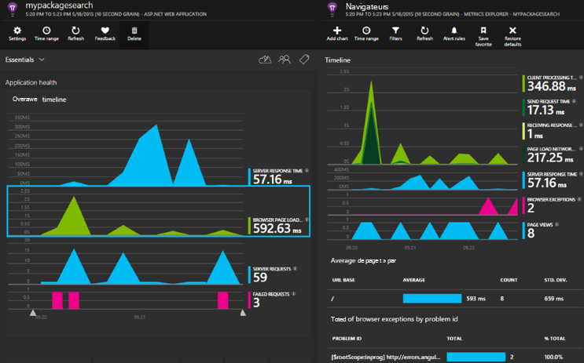

<properties 
    pageTitle="Idées d’application pour ASP.NET Core" 
    description="Surveiller des applications web pour la disponibilité, de performances et d’utilisation." 
    services="application-insights" 
    documentationCenter=".net"
    authors="alancameronwills" 
    manager="douge"/>

<tags 
    ms.service="application-insights" 
    ms.workload="tbd" 
    ms.tgt_pltfrm="ibiza" 
    ms.devlang="na" 
    ms.topic="article" 
    ms.date="08/30/2016" 
    ms.author="awills"/>

# Idées d’application pour ASP.NET Core

[Idées d’Application Visual Studio](app-insights-overview.md) vous permet de surveiller votre application web pour la disponibilité, de performances et d’utilisation. Avec les commentaires que vous obtenez sur les performances et l’efficacité de votre application dans la nature, vous pouvez effectuer des choix éclairés sur la direction de la conception dans chaque cycle de développement.

Vous aurez besoin d’un abonnement avec [Microsoft Azure](http://azure.com). Connectez-vous avec un compte Microsoft, qui peut avoir pour Windows, XBox Live ou d’autres services de cloud de Microsoft. Votre équipe peut avoir un abonnement d’organisation pour Azure : demandez au propriétaire de vous ajouter à l’aide de votre compte Microsoft.

## Mise en route

Suivez le [guide Mise en route](https://github.com/Microsoft/ApplicationInsights-aspnetcore/wiki/Getting-Started).

## À l’aide des informations d’Application

Ouvrir une session sur le [portail Microsoft Azure](https://portal.azure.com) et accédez à la ressource que vous créé pour surveiller votre application.

Dans une fenêtre distincte du navigateur, utilisez votre application pendant un certain temps. Vous verrez les données figurant dans les graphiques de perspectives de l’Application. (Vous devrez peut-être cliquez sur Actualiser.) Il y aura seulement une petite quantité de données pendant que vous développez, mais ces graphiques très actifs lorsque vous publiez votre application et que vous avez beaucoup d’utilisateurs. 

La page Vue d’ensemble affiche les graphiques de performances vous êtes plus susceptible d’être intéressé par : nombre de demandes ayant échoué, les temps de réponse de serveur et les temps de chargement de page. Cliquez sur n’importe quel graphique pour voir plus de données et de graphiques.

Affichages dans le portail se divisent en deux catégories principales :

* [Explorateur de mesures](app-insights-metrics-explorer.md) affiche les graphiques et les tables de mesures et de nombres, par exemple des temps de réponse, les taux d’échec ou les mesures que vous créez vous-même avec l' [API](app-insights-api-custom-events-metrics.md). Filtrer et segmenter les données par les valeurs de propriété pour obtenir une meilleure compréhension de votre application et ses utilisateurs.
* [L’Explorateur de recherche](app-insights-diagnostic-search.md) répertorie des événements individuels, tels que les demandes spécifiques, les exceptions, journal des traces ou les événements que vous avez créées avec l' [API](app-insights-api-custom-events-metrics.md). Filtrer et effectuer une recherche dans les événements et naviguer entre les événements connexes pour étudier des problèmes.
* [Analytique](app-insights-analytics.md) vous permet d’exécuter des requêtes SQL sur votre télémétrie et est un puissant outil d’analyse et de diagnostic.

## Alertes

* Vous obtiendrez automatiquement [les alertes de Diagnostics proactifs](app-insights-proactive-diagnostics.md) à vous sur les modifications anormales dans les taux d’échec et autres mesures.
* Configurer des [tests de disponibilité](app-insights-monitor-web-app-availability.md) pour tester votre site Web en continu à partir d’emplacements dans le monde entier et obtenir des courriels dès qu’un test échoue.
* Configurer des [alertes de métriques](app-insights-monitor-web-app-availability.md) de savoir si les mesures de temps de réponse ou de taux d’exception passez hors limites acceptables.

## Obtenir plus de télémétrie

* [Télémétrie d’ajouter à vos pages web](app-insights-javascript.md) à la page de surveiller l’utilisation et les performances.
* [Dépendances du moniteur](app-insights-dependencies.md) pour voir si reste, SQL ou autres ressources externes sont nuire.
* [Utilisation de l’API](app-insights-api-custom-events-metrics.md) pour envoyer vos propres événements et la métrique pour une vue plus détaillée de performances et d’utilisation de votre application.
* [Les tests de disponibilité](app-insights-monitor-web-app-availability.md) vérifier votre application en permanence de partout dans le monde. 

## Ouvrir la source

[Lire et contribuer au code](https://github.com/Microsoft/ApplicationInsights-aspnetcore#recent-updates)

